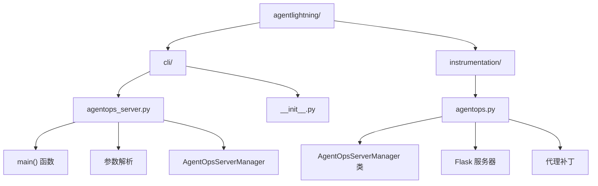
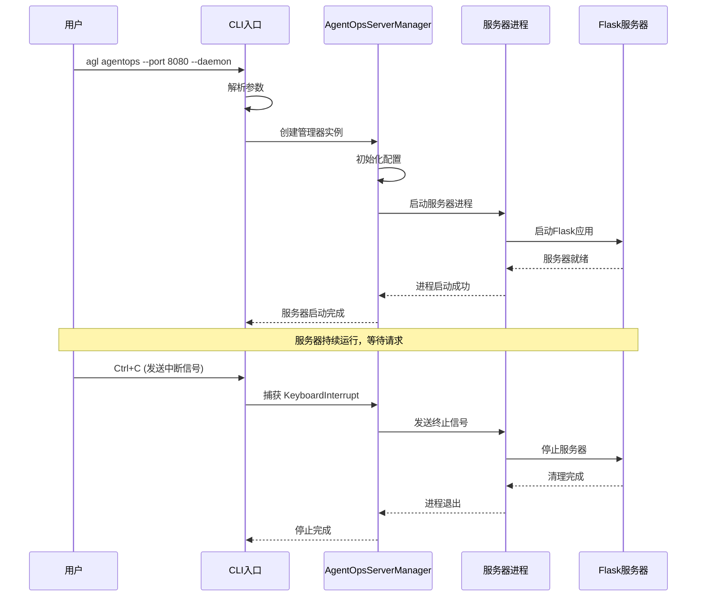
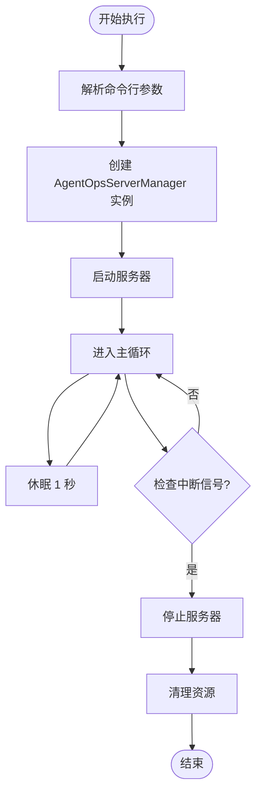
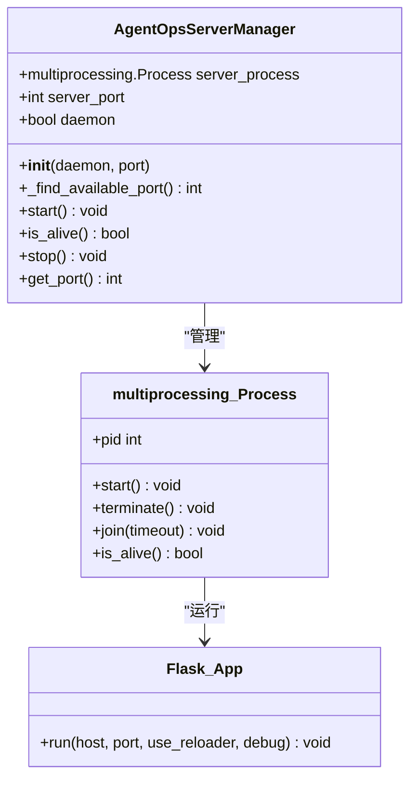
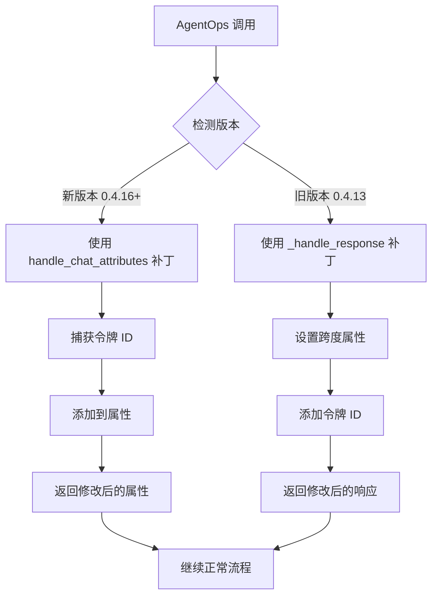

# AgentOps 服务器命令

<cite>
**本文档中引用的文件**
- [agentlightning/cli/agentops_server.py](file://agentlightning/cli/agentops_server.py)
- [agentlightning/cli/__init__.py](file://agentlightning/cli/__init__.py)
- [agentlightning/instrumentation/agentops.py](file://agentlightning/instrumentation/agentops.py)
</cite>

## 目录
1. [简介](#简介)
2. [项目结构](#项目结构)
3. [核心组件](#核心组件)
4. [架构概览](#架构概览)
5. [详细组件分析](#详细组件分析)
6. [使用方法](#使用方法)
7. [故障排除指南](#故障排除指南)
8. [结论](#结论)

## 简介

AgentOps 服务器命令是 Agent Lightning 框架中的一个重要功能，它提供了一个模拟的 AgentOps 服务器管理器，允许开发者在不连接真实 AgentOps 服务的情况下进行开发和测试。该命令通过 `agl agentops` 命令行接口启动，支持多种配置选项，特别是 `--port` 参数用于指定服务器端口，以及 `--daemon` 标志用于以守护进程模式运行。

这个功能对于开发环境特别有用，因为它允许开发者在本地环境中模拟 AgentOps 的行为，而无需实际的在线服务连接。这对于调试、测试和离线开发场景非常有价值。

## 项目结构

AgentOps 服务器命令在 Agent Lightning 项目中的组织结构如下：



**图表来源**
- [agentlightning/cli/agentops_server.py](file://agentlightning/cli/agentops_server.py#L1-L31)
- [agentlightning/cli/__init__.py](file://agentlightning/cli/__init__.py#L1-L56)
- [agentlightning/instrumentation/agentops.py](file://agentlightning/instrumentation/agentops.py#L1-L316)

**章节来源**
- [agentlightning/cli/agentops_server.py](file://agentlightning/cli/agentops_server.py#L1-L31)
- [agentlightning/cli/__init__.py](file://agentlightning/cli/__init__.py#L1-L56)

## 核心组件

AgentOps 服务器命令的核心组件包括以下关键部分：

### 主要模块

1. **CLI 入口点** (`agentlightning/cli/agentops_server.py`)
   - 提供命令行接口
   - 处理参数解析
   - 启动服务器管理器

2. **服务器管理器** (`AgentOpsServerManager`)
   - 管理本地 AgentOps 服务器进程
   - 处理服务器生命周期
   - 提供状态查询和控制功能

3. **代理补丁系统** (`agentlightning/instrumentation/agentops.py`)
   - 拦截和修改 AgentOps 调用
   - 支持不同版本的 AgentOps 库
   - 提供令牌 ID 捕获功能

**章节来源**
- [agentlightning/cli/agentops_server.py](file://agentlightning/cli/agentops_server.py#L10-L31)
- [agentlightning/instrumentation/agentops.py](file://agentlightning/instrumentation/agentops.py#L234-L314)

## 架构概览

AgentOps 服务器命令采用分层架构设计，确保了良好的模块化和可扩展性：



**图表来源**
- [agentlightning/cli/agentops_server.py](file://agentlightning/cli/agentops_server.py#L10-L31)
- [agentlightning/instrumentation/agentops.py](file://agentlightning/instrumentation/agentops.py#L234-L314)

## 详细组件分析

### CLI 主程序分析

CLI 主程序负责处理用户输入并协调服务器启动过程：



**图表来源**
- [agentlightning/cli/agentops_server.py](file://agentlightning/cli/agentops_server.py#L10-L31)

#### 关键特性

1. **参数处理**
   - `--daemon`: 以守护进程模式运行
   - `--port`: 指定服务器端口，默认为 8002

2. **异常处理**
   - 捕获 `KeyboardInterrupt` 信号
   - 提供优雅的停止机制

3. **服务器生命周期管理**
   - 启动前检查现有进程
   - 等待服务器启动完成
   - 提供状态查询功能

**章节来源**
- [agentlightning/cli/agentops_server.py](file://agentlightning/cli/agentops_server.py#L10-L31)

### AgentOpsServerManager 类分析

服务器管理器是整个系统的核心组件，负责管理本地 AgentOps 服务器的完整生命周期：



**图表来源**
- [agentlightning/instrumentation/agentops.py](file://agentlightning/instrumentation/agentops.py#L234-L314)

#### 核心方法详解

1. **初始化方法 (`__init__`)**
   - 设置守护进程模式
   - 配置服务器端口
   - 记录初始化日志

2. **端口查找方法 (`_find_available_port`)**
   - 使用临时套接字查找可用端口
   - 自动选择未被占用的端口

3. **启动方法 (`start`)**
   - 检查现有进程状态
   - 启动新的服务器进程
   - 等待服务器就绪
   - 提供启动确认

4. **停止方法 (`stop`)**
   - 发送终止信号
   - 等待进程优雅退出
   - 强制终止（如果需要）
   - 清理资源

5. **状态查询方法 (`is_alive`, `get_port`)**
   - 检查服务器进程状态
   - 获取当前使用的端口号

**章节来源**
- [agentlightning/instrumentation/agentops.py](file://agentlightning/instrumentation/agentops.py#L234-L314)

### 代理补丁系统分析

代理补丁系统提供了对 AgentOps 库的拦截和修改能力：



**图表来源**
- [agentlightning/instrumentation/agentops.py](file://agentlightning/instrumentation/agentops.py#L40-L199)

#### 补丁功能

1. **令牌 ID 捕获**
   - 自动捕获提示令牌 ID
   - 自动捕获响应令牌 ID
   - 支持多种数据格式

2. **版本兼容性**
   - 自动检测 AgentOps 版本
   - 选择合适的补丁方法
   - 提供降级支持

3. **LiteLLM 兼容性**
   - 支持 vLLM 返回的令牌 ID
   - 处理不同的 API 响应格式
   - 统一属性命名约定

**章节来源**
- [agentlightning/instrumentation/agentops.py](file://agentlightning/instrumentation/agentops.py#L40-L199)

## 使用方法

### 基本用法

启动 AgentOps 服务器的基本语法：

```bash
agl agentops [--port PORT] [--daemon]
```

### 参数说明

| 参数 | 类型 | 默认值 | 描述 |
|------|------|--------|------|
| `--port` | int | 8002 | 指定服务器监听的端口号 |
| `--daemon` | flag | false | 以守护进程模式运行服务器 |

### 使用示例

1. **基本启动**
   ```bash
   agl agentops
   ```
   在默认端口 8002 上启动服务器。

2. **指定端口**
   ```bash
   agl agentops --port 8080
   ```
   在端口 8080 上启动服务器。

3. **守护进程模式**
   ```bash
   agl agentops --daemon
   ```
   以守护进程模式在后台运行服务器。

4. **组合使用**
   ```bash
   agl agentops --port 8080 --daemon
   ```
   在端口 8080 上以守护进程模式启动服务器。

### 服务器行为

1. **启动过程**
   - 创建服务器管理器实例
   - 查找可用端口（如果未指定）
   - 启动 Flask 服务器进程
   - 等待服务器完全启动
   - 进入无限循环等待

2. **运行状态**
   - 服务器持续运行，响应 HTTP 请求
   - 提供模拟的 AgentOps API 端点
   - 记录操作日志

3. **停止过程**
   - 接收 `KeyboardInterrupt` 信号（Ctrl+C）
   - 调用 `manager.stop()` 方法
   - 终止服务器进程
   - 清理资源

**章节来源**
- [agentlightning/cli/agentops_server.py](file://agentlightning/cli/agentops_server.py#L10-L31)

## 故障排除指南

### 常见问题及解决方案

1. **端口冲突**
   - **问题**: 指定的端口已被占用
   - **解决方案**: 使用 `--port` 参数指定其他端口，或让系统自动选择可用端口

2. **权限问题**
   - **问题**: 无法绑定到指定端口
   - **解决方案**: 尝试使用更高权限的端口（>1024），或使用 `sudo` 运行命令

3. **服务器启动失败**
   - **问题**: 服务器进程未能正常启动
   - **解决方案**: 检查端口可用性，查看日志输出，确认依赖项安装正确

4. **进程管理问题**
   - **问题**: 守护进程无法正确停止
   - **解决方案**: 使用 `ps` 和 `kill` 命令手动终止相关进程

### 调试技巧

1. **启用详细日志**
   - 检查服务器启动时的日志输出
   - 观察进程状态变化
   - 监控网络连接情况

2. **验证服务器状态**
   - 使用 `curl` 或浏览器访问服务器
   - 检查服务器进程是否存在
   - 验证端口监听状态

3. **清理残留进程**
   - 使用 `ps aux | grep agentops` 查找相关进程
   - 使用 `kill` 命令终止进程
   - 等待进程完全退出

**章节来源**
- [agentlightning/instrumentation/agentops.py](file://agentlightning/instrumentation/agentops.py#L234-L314)

## 结论

AgentOps 服务器命令为 Agent Lightning 框架提供了一个强大而灵活的本地代理服务解决方案。通过 `agl agentops` 命令，开发者可以在不依赖真实 AgentOps 服务的情况下进行开发和测试，大大提高了开发效率和灵活性。

### 主要优势

1. **开发便利性**
   - 无需网络连接即可进行开发
   - 支持离线开发和测试
   - 提供一致的 API 行为

2. **配置灵活性**
   - 支持自定义端口配置
   - 提供守护进程模式
   - 兼容多种部署场景

3. **稳定性保证**
   - 提供优雅的启动和停止机制
   - 支持进程监控和清理
   - 具备错误恢复能力

4. **功能完整性**
   - 支持令牌 ID 捕获
   - 兼容多个 AgentOps 版本
   - 提供完整的代理补丁功能

### 最佳实践建议

1. **开发环境配置**
   - 在开发环境中始终使用本地服务器
   - 定期更新代理补丁以支持最新版本
   - 监控服务器性能和资源使用

2. **生产环境考虑**
   - 生产环境应连接真实的 AgentOps 服务
   - 仅在开发和测试阶段使用本地服务器
   - 确保正确的网络配置和防火墙规则

3. **维护和监控**
   - 定期检查服务器状态
   - 监控日志文件以识别潜在问题
   - 建立适当的备份和恢复策略

通过合理使用 AgentOps 服务器命令，开发者可以显著提高 Agent Lightning 应用的开发效率，同时确保代码质量和系统稳定性。