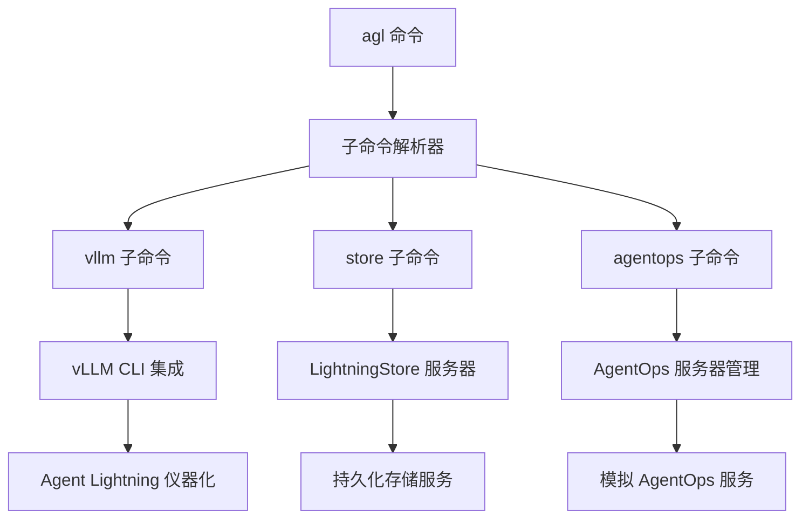
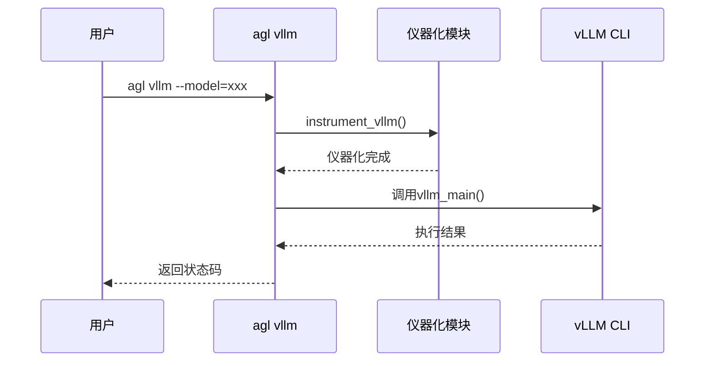
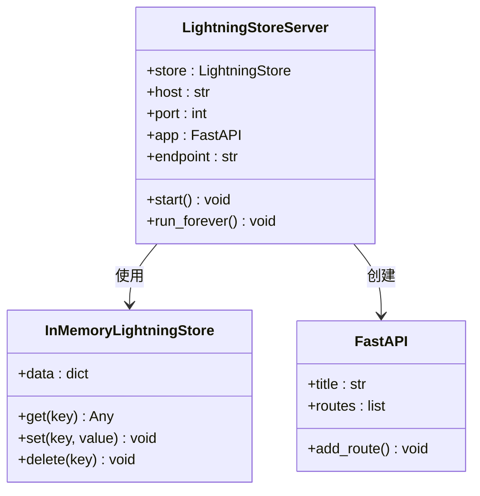
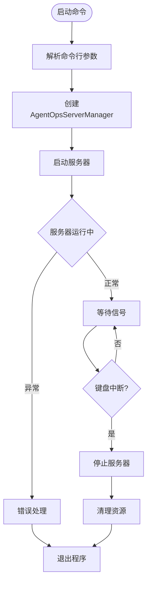
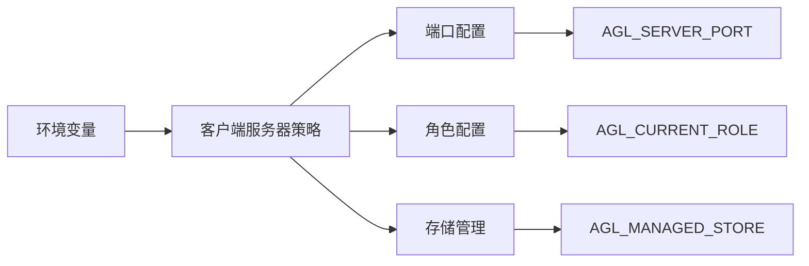

# CLI命令参考文档

<cite>
**本文档中引用的文件**
- [agentlightning/cli/__init__.py](file://agentlightning/cli/__init__.py)
- [agentlightning/cli/vllm.py](file://agentlightning/cli/vllm.py)
- [agentlightning/cli/store.py](file://agentlightning/cli/store.py)
- [agentlightning/cli/agentops_server.py](file://agentlightning/cli/agentops_server.py)
- [agentlightning/store/client_server.py](file://agentlightning/store/client_server.py)
- [agentlightning/instrumentation/agentops.py](file://agentlightning/instrumentation/agentops.py)
- [agentlightning/logging.py](file://agentlightning/logging.py)
- [pyproject.toml](file://pyproject.toml)
- [README.md](file://README.md)
</cite>

## 目录
1. [简介](#简介)
2. [主命令结构](#主命令结构)
3. [子命令详解](#子命令详解)
4. [环境变量配置](#环境变量配置)
5. [使用示例](#使用示例)
6. [故障排除](#故障排除)

## 简介

Agent Lightning CLI (`agl`) 是一个功能强大的命令行工具，提供了三个主要子命令：`vllm`、`store` 和 `agentops`。这些子命令分别用于集成vLLM CLI、启动LightningStore服务器和管理AgentOps服务器。

## 主命令结构



**图表来源**
- [agentlightning/cli/__init__.py](file://agentlightning/cli/__init__.py#L10-L15)

**章节来源**
- [agentlightning/cli/__init__.py](file://agentlightning/cli/__init__.py#L1-L56)

## 子命令详解

### agl vllm

`agl vllm` 命令用于运行带有Agent Lightning仪器化的vLLM CLI。

#### 功能特性
- 集成vLLM CLI功能
- 自动应用Agent Lightning仪器化
- 支持传递任意vLLM CLI参数

#### 使用语法
```bash
agl vllm [vllm-cli-options]
```

#### 参数说明
- `[vllm-cli-options]`: 传递给底层vLLM CLI的所有参数

#### 工作原理


**图表来源**
- [agentlightning/cli/vllm.py](file://agentlightning/cli/vllm.py#L8-L29)

#### 实际帮助文本
根据源码分析，该命令直接调用vLLM的CLI主函数，支持所有vLLM原生参数。

**章节来源**
- [agentlightning/cli/vllm.py](file://agentlightning/cli/vllm.py#L1-L30)

### agl store

`agl store` 命令用于启动LightningStore服务器，提供持久化访问能力。

#### 功能特性
- 启动HTTP API服务器
- 提供多进程间共享的存储服务
- 支持配置端口和主机地址

#### 使用语法
```bash
agl store [--port PORT]
```

#### 参数说明

| 参数 | 类型 | 默认值 | 描述 |
|------|------|--------|------|
| `--port` | int | 4747 | 服务器监听端口 |

#### 服务器架构


**图表来源**
- [agentlightning/store/client_server.py](file://agentlightning/store/client_server.py#L85-L120)

#### 实际帮助文本
```bash
$ agl store --help
usage: agl store [-h] [--port PORT]

Run a LightningStore server

optional arguments:
  -h, --help  show this help message and exit
  --port PORT  Port to run the server on (default: 4747)
```

**章节来源**
- [agentlightning/cli/store.py](file://agentlightning/cli/store.py#L1-L38)

### agl agentops

`agl agentops` 命令用于启动模拟的AgentOps服务器管理器。

#### 功能特性
- 启动AgentOps服务器管理器
- 支持守护进程模式
- 可配置服务器端口

#### 使用语法
```bash
agl agentops [--daemon] [--port PORT]
```

#### 参数说明

| 参数 | 类型 | 默认值 | 描述 |
|------|------|--------|------|
| `--daemon` | bool | false | 以守护进程模式运行服务器 |
| `--port` | int | 8002 | 服务器监听端口 |

#### 服务器管理流程


**图表来源**
- [agentlightning/cli/agentops_server.py](file://agentlightning/cli/agentops_server.py#L10-L29)

#### 实际帮助文本
```bash
$ agl agentops --help
usage: agl agentops [-h] [--daemon] [--port PORT]

Start AgentOps server

optional arguments:
  -h, --help  show this help message and exit
  --daemon    Run server as a daemon
  --port PORT  Port to run the server on (default: 8002)
```

**章节来源**
- [agentlightning/cli/agentops_server.py](file://agentlightning/cli/agentops_server.py#L1-L31)

## 环境变量配置

Agent Lightning CLI 支持多个环境变量来配置服务器行为和连接设置。

### 核心环境变量

| 环境变量 | 类型 | 默认值 | 描述 |
|----------|------|--------|------|
| `AGL_SERVER_PORT` | int | 4747 | 默认服务器端口 |
| `AGL_CURRENT_ROLE` | str | "both" | 当前角色配置 |
| `AGL_SERVER_HOST` | str | "localhost" | 服务器主机地址 |
| `AGL_MANAGED_STORE` | bool | true | 是否自动管理存储 |

### 环境变量影响



### 配置示例

#### 设置服务器端口
```bash
export AGL_SERVER_PORT=8080
agl store  # 将使用8080端口
```

#### 配置当前角色
```bash
export AGL_CURRENT_ROLE=algorithm
export AGL_MANAGED_STORE=false
# 这将配置算法进程不使用托管存储
```

#### 完整配置示例
```bash
# 设置服务器配置
export AGL_SERVER_HOST=0.0.0.0
export AGL_SERVER_PORT=4747

# 设置角色配置
export AGL_CURRENT_ROLE=both
export AGL_MANAGED_STORE=true

# 启动相关服务
agl store &
agl agentops --daemon &
```

**章节来源**
- [tests/execution/test_client_server.py](file://tests/execution/test_client_server.py#L70-L97)

## 使用示例

### 基础使用场景

#### 1. 启动存储服务器
```bash
# 默认端口启动
agl store

# 指定端口启动
agl store --port 5000

# 在后台运行
agl store --port 4747 &
```

#### 2. 使用vLLM集成
```bash
# 基本vLLM使用
agl vllm --model=meta-llama/Llama-2-7b-chat-hf --tensor-parallel-size=1

# 带有自定义参数
agl vllm --model=your-model --dtype=float16 --max-model-len=2048
```

#### 3. AgentOps服务器管理
```bash
# 启动AgentOps服务器
agl agentops

# 以守护进程模式启动
agl agentops --daemon

# 指定端口启动
agl agentops --port 8003
```

### 高级使用场景

#### 1. 多服务组合使用
```bash
#!/bin/bash
# 启动完整的Agent Lightning环境

# 启动存储服务器
echo "启动存储服务器..."
agl store --port 4747 &

# 启动AgentOps服务器
echo "启动AgentOps服务器..."
agl agentops --daemon --port 8002 &

# 等待服务启动
sleep 2

# 启动训练任务
echo "启动训练任务..."
export AGL_CURRENT_ROLE=algorithm
export AGL_MANAGED_STORE=true
python train_script.py

# 清理资源
kill $(jobs -p)
echo "环境清理完成"
```

#### 2. 开发环境配置
```bash
# 设置开发环境变量
export AGL_SERVER_HOST=localhost
export AGL_SERVER_PORT=4747
export AGL_CURRENT_ROLE=both
export AGL_MANAGED_STORE=true

# 启动开发服务器
agl store --port $AGL_SERVER_PORT &

# 使用vLLM进行推理测试
agl vllm --model=gpt2 --tensor-parallel-size=1 --distributed-executor-backend=mp

# 启动AgentOps监控
agl agentops --daemon --port 8002
```

#### 3. 生产环境部署
```bash
# 生产环境配置
export AGL_SERVER_HOST=0.0.0.0
export AGL_SERVER_PORT=4747
export AGL_CURRENT_ROLE=algorithm
export AGL_MANAGED_STORE=true

# 启动生产服务
agl store --port $AGL_SERVER_PORT &
agl agentops --daemon --port 8002 &

# 验证服务状态
curl -f http://localhost:4747/agl/v1/health || echo "存储服务未就绪"
curl -f http://localhost:8002/health || echo "AgentOps服务未就绪"
```

## 故障排除

### 常见问题及解决方案

#### 1. 端口冲突问题

**问题描述**: 服务器启动时提示端口已被占用
```bash
ERROR: [Errno 48] Address already in use
```

**解决方案**:
```bash
# 查找占用端口的进程
lsof -i :4747
# 或者在Windows上
netstat -ano | findstr :4747

# 终止占用进程或使用其他端口
agl store --port 4748
```

#### 2. 权限问题

**问题描述**: 无法绑定到指定端口（通常小于1024）
```bash
PermissionError: [Errno 13] Permission denied
```

**解决方案**:
```bash
# 使用非特权端口
agl store --port 8080

# 或者使用sudo（不推荐）
sudo agl store --port 80
```

#### 3. 依赖问题

**问题描述**: vLLM或AgentOps相关模块未安装
```bash
ModuleNotFoundError: No module named 'vllm'
```

**解决方案**:
```bash
# 安装完整依赖
pip install agentlightning[verl]

# 或单独安装vLLM
pip install vllm
```

#### 4. 服务器连接问题

**问题描述**: 无法连接到存储服务器
```bash
ConnectionError: Failed to connect to server
```

**解决方案**:
```bash
# 检查服务器是否启动
curl http://localhost:4747/agl/v1/health

# 检查防火墙设置
sudo ufw allow 4747
```

### 调试技巧

#### 1. 启用详细日志
```bash
# 设置日志级别
export PYTHONWARNINGS=ignore
python -m agentlightning.logging --level DEBUG

# 运行命令查看详细输出
agl store --port 4747
```

#### 2. 验证环境配置
```bash
# 检查环境变量
env | grep AGL_

# 验证端口可用性
telnet localhost 4747
```

#### 3. 测试服务健康状态
```bash
# 存储服务器健康检查
curl -f http://localhost:4747/agl/v1/health

# AgentOps服务器健康检查
curl -f http://localhost:8002/health
```

**章节来源**
- [agentlightning/logging.py](file://agentlightning/logging.py#L1-L55)