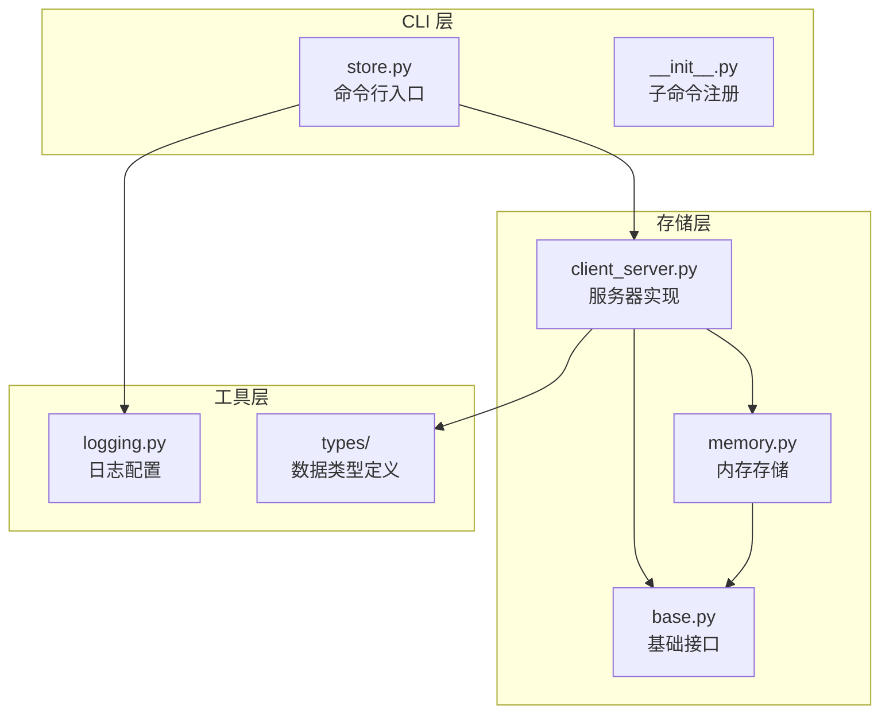
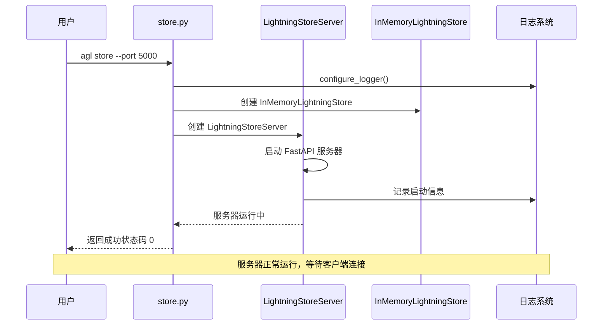
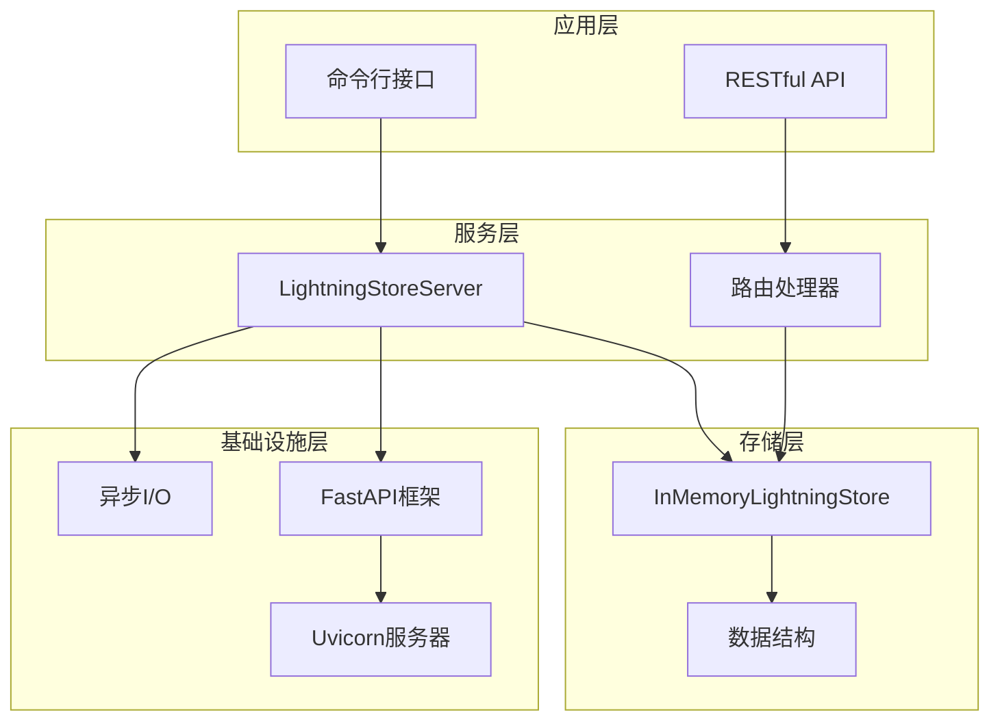
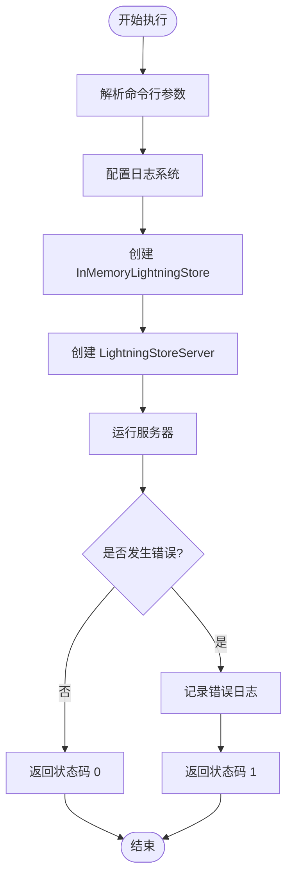
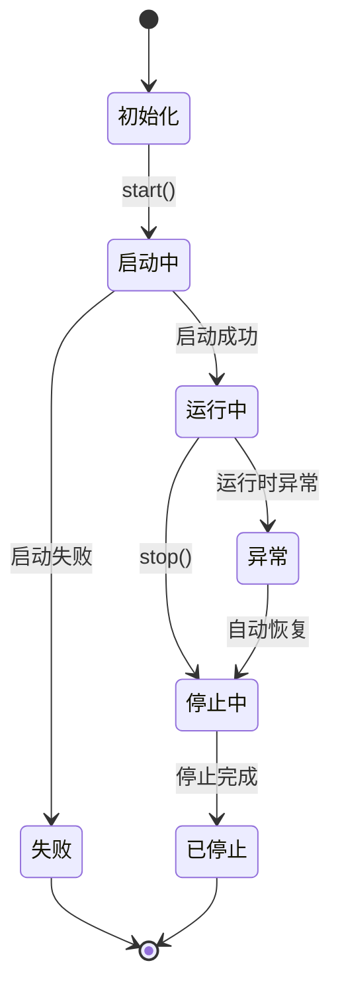
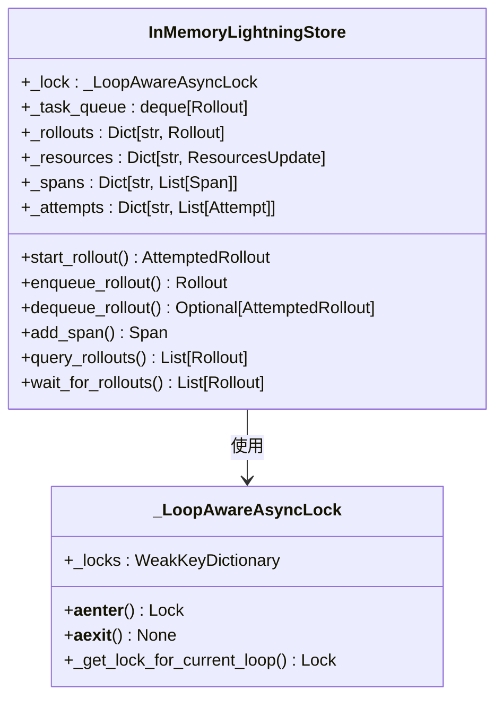
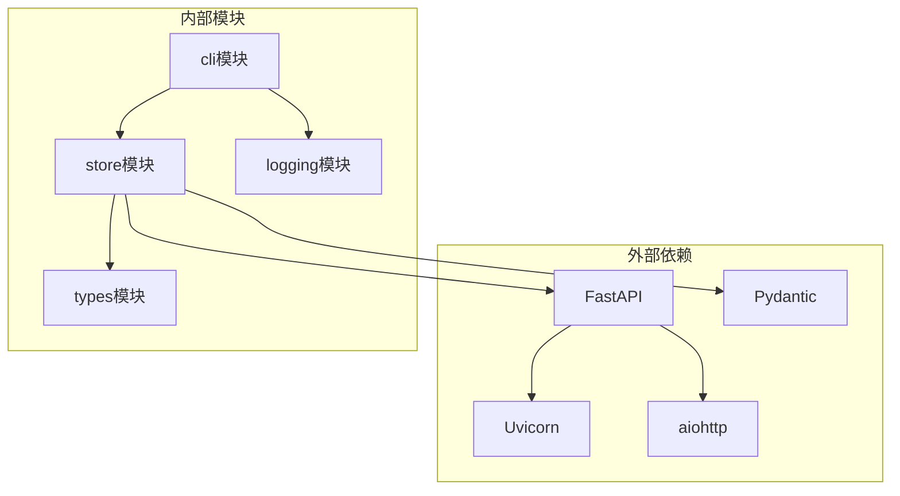
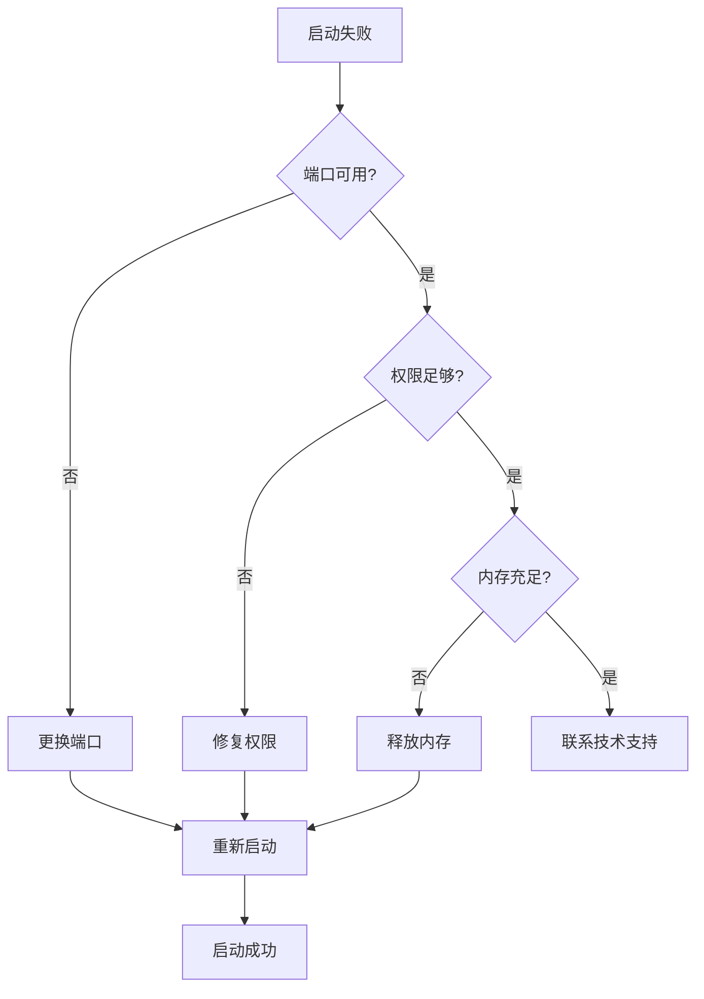

# LightningStore 服务器命令

<cite>
**本文档中引用的文件**
- [agentlightning/cli/store.py](file://agentlightning/cli/store.py)
- [agentlightning/store/client_server.py](file://agentlightning/store/client_server.py)
- [agentlightning/store/memory.py](file://agentlightning/store/memory.py)
- [agentlightning/logging.py](file://agentlightning/logging.py)
- [agentlightning/store/__init__.py](file://agentlightning/store/__init__.py)
- [tests/store/test_client_server.py](file://tests/store/test_client_server.py)
- [agentlightning/cli/__init__.py](file://agentlightning/cli/__init__.py)
</cite>

## 目录
1. [简介](#简介)
2. [项目结构](#项目结构)
3. [核心组件](#核心组件)
4. [架构概览](#架构概览)
5. [详细组件分析](#详细组件分析)
6. [依赖关系分析](#依赖关系分析)
7. [性能考虑](#性能考虑)
8. [故障排除指南](#故障排除指南)
9. [结论](#结论)

## 简介

`agl store` 命令是一个专门设计用于启动中央化 LightningStore 服务器的工具，该服务器允许多个进程通过客户端-服务器模式共享数据。这个命令为分布式系统提供了统一的数据访问接口，支持异步操作和高并发访问。

LightningStore 服务器采用 FastAPI 框架构建 RESTful API，内部使用 InMemoryLightningStore 作为后端存储，并通过 asyncio 实现异步运行机制。服务器提供了完整的 HTTP 接口来管理任务队列、资源、追踪数据等核心功能。

## 项目结构



**图表来源**
- [agentlightning/cli/store.py](file://agentlightning/cli/store.py#L1-L38)
- [agentlightning/store/client_server.py](file://agentlightning/store/client_server.py#L1-L50)
- [agentlightning/store/memory.py](file://agentlightning/store/memory.py#L1-L50)

**章节来源**
- [agentlightning/cli/store.py](file://agentlightning/cli/store.py#L1-L38)
- [agentlightning/store/__init__.py](file://agentlightning/store/__init__.py#L1-L13)

## 核心组件

### 主要组件概述

1. **命令行接口 (`store.py`)**：提供 `agl store` 命令的入口点，解析命令行参数并启动服务器
2. **LightningStoreServer**：基于 FastAPI 的 HTTP 服务器，暴露存储接口
3. **InMemoryLightningStore**：内存中的存储实现，提供线程安全和异步操作支持
4. **日志系统**：统一的日志配置和输出格式

### 组件交互流程



**图表来源**
- [agentlightning/cli/store.py](file://agentlightning/cli/store.py#L15-L35)
- [agentlightning/store/client_server.py](file://agentlightning/store/client_server.py#L80-L120)

**章节来源**
- [agentlightning/cli/store.py](file://agentlightning/cli/store.py#L15-L35)
- [agentlightning/store/client_server.py](file://agentlightning/store/client_server.py#L80-L120)

## 架构概览

LightningStore 服务器采用分层架构设计，从上到下包括：



**图表来源**
- [agentlightning/store/client_server.py](file://agentlightning/store/client_server.py#L80-L150)
- [agentlightning/store/memory.py](file://agentlightning/store/memory.py#L200-L300)

## 详细组件分析

### 命令行接口组件

#### 参数配置

`agl store` 命令支持以下参数配置：

| 参数 | 类型 | 默认值 | 描述 |
|------|------|--------|------|
| `--port` | int | 4747 | 服务器监听端口号 |

#### 启动流程



**图表来源**
- [agentlightning/cli/store.py](file://agentlightning/cli/store.py#L15-L35)

**章节来源**
- [agentlightning/cli/store.py](file://agentlightning/cli/store.py#L15-L35)

### LightningStoreServer 组件

#### 核心功能特性

1. **HTTP API 暴露**：通过 FastAPI 提供 RESTful 接口
2. **异步运行**：基于 asyncio 实现非阻塞操作
3. **进程感知**：支持多进程环境下的数据隔离
4. **健康检查**：内置健康监控和故障恢复机制

#### 服务器生命周期管理



**图表来源**
- [agentlightning/store/client_server.py](file://agentlightning/store/client_server.py#L150-L200)

#### API 路由映射

服务器提供以下主要 API 端点：

| 端点路径 | 方法 | 功能描述 |
|----------|------|----------|
| `/agl/v1/health` | GET | 健康检查 |
| `/agl/v1/queues/rollouts/enqueue` | POST | 添加任务到队列 |
| `/agl/v1/queues/rollouts/dequeue` | POST | 从队列获取任务 |
| `/agl/v1/rollouts` | POST | 开始新任务 |
| `/agl/v1/rollouts/{id}` | GET/POST | 获取或更新任务 |
| `/agl/v1/resources` | POST | 添加资源 |
| `/agl/v1/spans` | POST | 添加追踪数据 |

**章节来源**
- [agentlightning/store/client_server.py](file://agentlightning/store/client_server.py#L300-L500)

### InMemoryLightningStore 组件

#### 存储架构



**图表来源**
- [agentlightning/store/memory.py](file://agentlightning/store/memory.py#L200-L300)

#### 内存管理策略

1. **自动内存回收**：基于内存阈值的智能回收机制
2. **序列号管理**：确保追踪数据的唯一性和顺序性
3. **状态传播**：自动维护任务状态的一致性

**章节来源**
- [agentlightning/store/memory.py](file://agentlightning/store/memory.py#L200-L400)

### 日志系统集成

#### 配置特性

- **统一格式**：所有日志消息使用一致的时间戳和进程标识
- **级别控制**：支持 INFO 及以上级别的日志输出
- **进程隔离**：每个进程独立的日志记录

#### 日志格式示例

```
2024-01-15 10:30:45 [INFO] (Process-12345 agentlightning.store.client_server)   Starting server at http://0.0.0.0:4747
```

**章节来源**
- [agentlightning/logging.py](file://agentlightning/logging.py#L10-L55)

## 依赖关系分析

### 模块依赖图



**图表来源**
- [agentlightning/cli/store.py](file://agentlightning/cli/store.py#L1-L10)
- [agentlightning/store/client_server.py](file://agentlightning/store/client_server.py#L1-L20)

### 关键依赖说明

1. **FastAPI & Uvicorn**：提供高性能的 HTTP 服务器框架
2. **aiohttp**：支持异步 HTTP 客户端操作
3. **Pydantic**：数据验证和序列化
4. **asyncio**：异步编程支持

**章节来源**
- [agentlightning/store/client_server.py](file://agentlightning/store/client_server.py#L1-L20)

## 性能考虑

### 异步运行机制

服务器采用完全异步的设计，能够高效处理大量并发请求：

- **非阻塞 I/O**：所有网络操作都是异步的
- **事件驱动**：基于 asyncio 事件循环
- **资源池化**：HTTP 连接复用和管理

### 内存优化策略

1. **LRU 回收**：基于时间的内存回收算法
2. **阈值控制**：可配置的内存使用上限
3. **增量清理**：避免长时间的内存扫描

### 并发控制

- **锁粒度**：细粒度的异步锁机制
- **无锁设计**：读操作不加锁，提高并发性能
- **超时保护**：防止死锁和饥饿问题

## 故障排除指南

### 常见错误及解决方案

#### 端口冲突错误

**错误信息**：
```
RuntimeError: LightningStore server failed to start on http://0.0.0.0:4747. Another process may already be using this port.
```

**解决方案**：
1. 检查端口占用情况：`netstat -an | grep 4747`
2. 更换端口号：`agl store --port 5001`
3. 终止占用进程：`kill -9 <PID>`

#### 启动失败处理



**图表来源**
- [agentlightning/store/client_server.py](file://agentlightning/store/client_server.py#L200-L250)

#### 错误返回码说明

| 返回码 | 含义 | 处理方式 |
|--------|------|----------|
| 0 | 成功启动 | 正常运行 |
| 1 | 启动失败 | 检查错误日志，根据具体错误类型处理 |

**章节来源**
- [agentlightning/cli/store.py](file://agentlightning/cli/store.py#L30-L35)

### 监控和诊断

#### 健康检查端点

访问 `http://localhost:4747/agl/v1/health` 可以检查服务器状态：

```json
{
  "status": "ok"
}
```

#### 日志分析

关键日志关键字：
- `Starting server at`: 服务器启动成功
- `Server failed to start`: 启动失败
- `Unhandled application error`: 应用程序错误

## 结论

`agl store` 命令提供了一个功能完整、性能优异的中央化 LightningStore 服务器解决方案。它通过以下特性满足了现代分布式系统的数据共享需求：

### 核心优势

1. **简单易用**：单命令即可启动服务器，无需复杂配置
2. **高性能**：基于异步 I/O 和事件驱动架构
3. **可靠性**：完善的错误处理和恢复机制
4. **可扩展性**：支持多进程和分布式部署

### 适用场景

- **多进程协作**：需要在多个进程中共享任务状态
- **微服务架构**：作为独立的服务提供数据访问
- **开发测试**：快速搭建本地测试环境
- **生产部署**：提供稳定的数据持久化服务

### 最佳实践建议

1. **合理选择端口**：避免与系统其他服务冲突
2. **监控资源使用**：定期检查内存和 CPU 使用情况
3. **备份重要数据**：对于关键业务，考虑持久化存储方案
4. **设置健康检查**：在生产环境中配置适当的健康检查机制

通过本文档的详细介绍，用户可以充分理解 LightningStore 服务器的工作原理、使用方法和最佳实践，从而在实际项目中有效利用这一强大的工具。