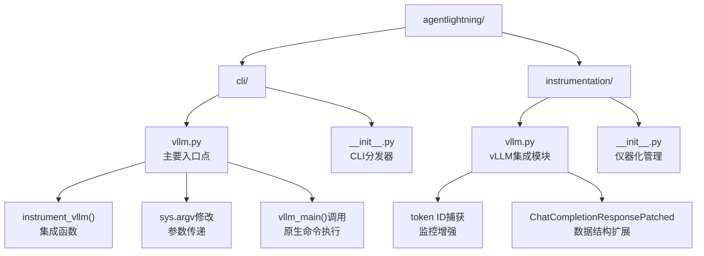
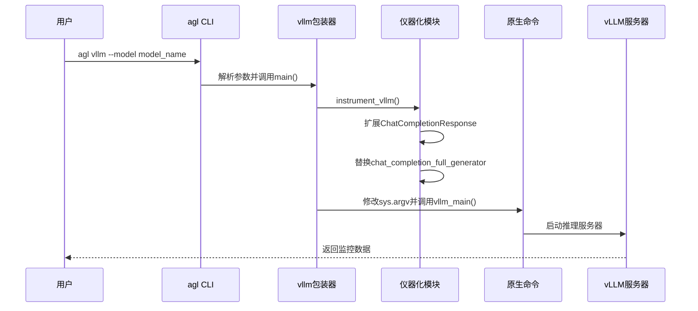
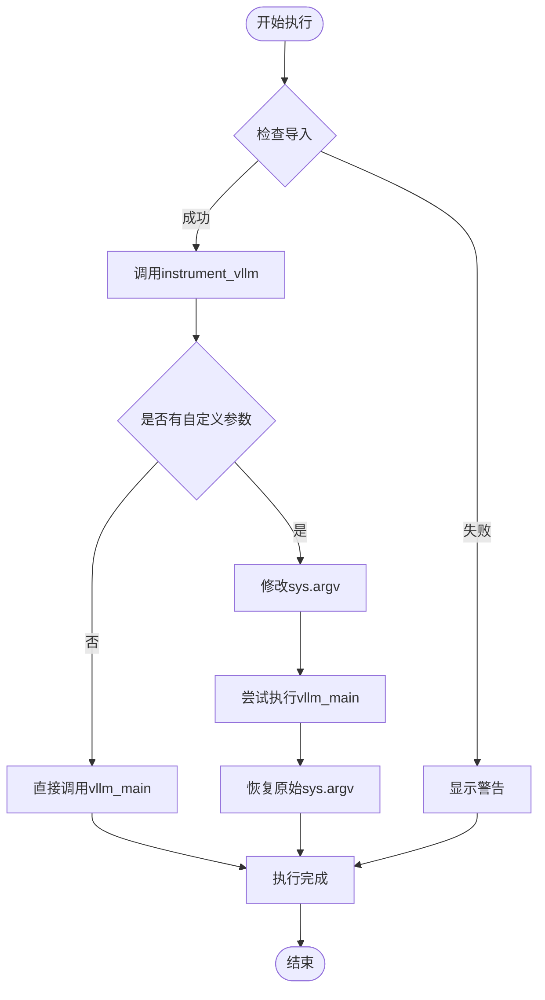
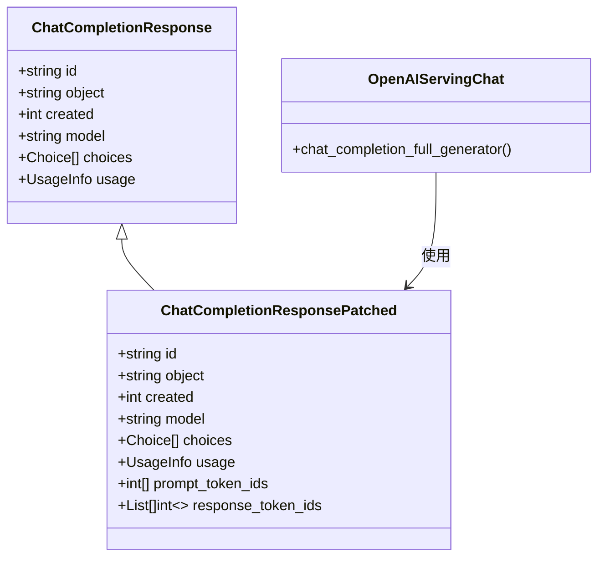
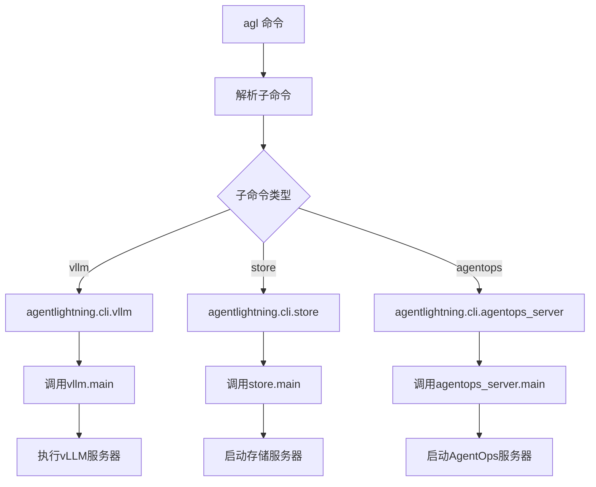
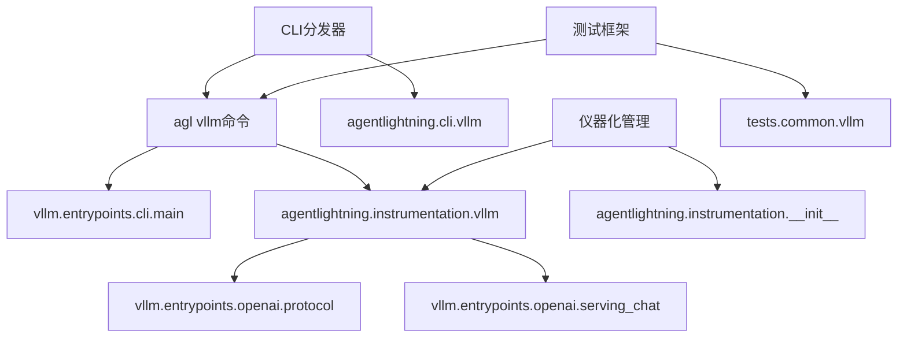

# vLLM 集成命令

<cite>
**本文档中引用的文件**
- [agentlightning/cli/vllm.py](file://agentlightning/cli/vllm.py)
- [agentlightning/instrumentation/vllm.py](file://agentlightning/instrumentation/vllm.py)
- [agentlightning/cli/__init__.py](file://agentlightning/cli/__init__.py)
- [agentlightning/instrumentation/__init__.py](file://agentlightning/instrumentation/__init__.py)
- [tests/common/vllm.py](file://tests/common/vllm.py)
</cite>

## 目录
1. [简介](#简介)
2. [项目结构](#项目结构)
3. [核心组件](#核心组件)
4. [架构概览](#架构概览)
5. [详细组件分析](#详细组件分析)
6. [依赖关系分析](#依赖关系分析)
7. [性能考虑](#性能考虑)
8. [故障排除指南](#故障排除指南)
9. [结论](#结论)

## 简介

agl vllm 子命令是一个专门设计用于启动带有 Agent Lightning 监控和数据收集功能的 vLLM 推理服务器的工具。该命令通过 `instrument_vllm()` 函数集成并增强原始的 vLLM CLI，为用户提供了一个透明且功能丰富的推理服务启动方式。

该命令的主要用途包括：
- 启动带有 Agent Lightning 监控功能的 vLLM 推理服务器
- 自动捕获和记录 token ID 数据（提示和响应）
- 提供与标准 vLLM CLI 完全兼容的接口
- 支持所有 vLLM 原生参数和配置选项

## 项目结构

agl vllm 子命令在 Agent Lightning 项目中的组织结构如下：

**图表来源**
- [agentlightning/cli/vllm.py](file://agentlightning/cli/vllm.py#L1-L30)
- [agentlightning/instrumentation/vllm.py](file://agentlightning/instrumentation/vllm.py#L1-L82)

**章节来源**
- [agentlightning/cli/vllm.py](file://agentlightning/cli/vllm.py#L1-L30)
- [agentlightning/instrumentation/vllm.py](file://agentlightning/instrumentation/vllm.py#L1-L82)

## 核心组件

### 主要模块

1. **CLI 入口点** (`agentlightning/cli/vllm.py`)
   - 提供 agl vllm 子命令的主入口
   - 负责参数解析和命令分发
   - 管理 sys.argv 的临时修改

2. **vLLM 集成模块** (`agentlightning/instrumentation/vllm.py`)
   - 实现 vLLM 的监控和数据收集功能
   - 扩展 ChatCompletionResponse 数据结构
   - 提供 instrument_vllm() 和 uninstrument_vllm() 函数

3. **CLI 分发器** (`agentlightning/cli/__init__.py`)
   - 管理所有 Agent Lightning 子命令
   - 处理命令行参数和模块加载
   - 统一的错误处理机制

**章节来源**
- [agentlightning/cli/vllm.py](file://agentlightning/cli/vllm.py#L1-L30)
- [agentlightning/instrumentation/vllm.py](file://agentlightning/instrumentation/vllm.py#L1-L82)
- [agentlightning/cli/__init__.py](file://agentlightning/cli/__init__.py#L1-L56)

## 架构概览

agl vllm 子命令采用透明包装器模式，通过以下架构实现对 vLLM 的增强：

**图表来源**
- [agentlightning/cli/vllm.py](file://agentlightning/cli/vllm.py#L8-L25)
- [agentlightning/instrumentation/vllm.py](file://agentlightning/instrumentation/vllm.py#L55-L75)

## 详细组件分析

### vllm 包装器模块

#### 主要功能

vllm 包装器模块实现了以下核心功能：

1. **仪器化集成**
   - 调用 `instrument_vllm()` 函数启用监控功能
   - 自动扩展 vLLM 的 ChatCompletionResponse 数据结构
   - 拦截和增强聊天完成请求的处理流程

2. **参数传递机制**
   - 支持两种调用模式：直接调用或带参数调用
   - 通过 sys.argv 的临时修改确保参数正确传递
   - 使用 try-finally 块保证系统状态恢复

3. **错误处理**
   - 在导入失败时提供适当的警告
   - 保持与原生命令的兼容性
   - 支持优雅的降级处理

**图表来源**
- [agentlightning/cli/vllm.py](file://agentlightning/cli/vllm.py#L8-L25)

**章节来源**
- [agentlightning/cli/vllm.py](file://agentlightning/cli/vllm.py#L8-L25)

### vLLM 仪器化模块

#### 数据结构扩展

仪器化模块通过扩展 vLLM 的 ChatCompletionResponse 类来捕获 token ID 数据：

**图表来源**
- [agentlightning/instrumentation/vllm.py](file://agentlightning/instrumentation/vllm.py#L18-L25)
- [agentlightning/instrumentation/vllm.py](file://agentlightning/instrumentation/vllm.py#L27-L53)

#### Token ID 捕获机制

仪器化模块实现了以下 token ID 捕获流程：

1. **拦截生成器**：替换原始的 `chat_completion_full_generator` 方法
2. **异步处理**：使用异步生成器捕获每个响应块
3. **数据提取**：从响应对象中提取 prompt_token_ids 和 response_token_ids
4. **结果更新**：将捕获的数据添加到最终的响应对象中

**章节来源**
- [agentlightning/instrumentation/vllm.py](file://agentlightning/instrumentation/vllm.py#L27-L53)

### CLI 分发器

#### 命令路由机制

CLI 分发器负责将 agl 命令路由到相应的子命令模块：

**图表来源**
- [agentlightning/cli/__init__.py](file://agentlightning/cli/__init__.py#L12-L16)
- [agentlightning/cli/__init__.py](file://agentlightning/cli/__init__.py#L25-L55)

**章节来源**
- [agentlightning/cli/__init__.py](file://agentlightning/cli/__init__.py#L25-L55)

## 依赖关系分析

### 模块依赖图

**图表来源**
- [agentlightning/cli/vllm.py](file://agentlightning/cli/vllm.py#L8-L10)
- [agentlightning/instrumentation/vllm.py](file://agentlightning/instrumentation/vllm.py#L8-L11)

### 版本兼容性

根据测试代码分析，该命令支持不同版本的 vLLM：

| vLLM 版本 | 功能支持 | 启动方式 |
|-----------|----------|----------|
| ≥ v0.10.2 | return_token_ids 支持 | 直接使用 vllm serve |
| < v0.10.2 | 不支持 return_token_ids | 使用 agentlightning.cli.vllm |

**章节来源**
- [tests/common/vllm.py](file://tests/common/vllm.py#L67-L85)

## 性能考虑

### 内存和计算开销

1. **内存占用**：仪器化模块通过类继承而非装饰器模式，避免了额外的闭包开销
2. **CPU 效率**：token ID 捕获采用异步生成器模式，不会阻塞主线程
3. **网络延迟**：监控数据的收集和传输经过优化，最小化对推理性能的影响

### 启动时间优化

- 延迟导入：仅在需要时才导入 vLLM 相关模块
- 缓存机制：仪器化状态通过全局变量进行缓存
- 快速路径：已仪器化的模块会跳过重复的初始化过程

## 故障排除指南

### 常见问题及解决方案

#### 1. 导入失败错误

**症状**：运行 agl vllm 时出现 ImportError

**原因**：vLLM 或相关依赖未正确安装

**解决方案**：
- 检查 vLLM 是否已安装：`pip show vllm`
- 安装缺失的依赖：`pip install vllm`
- 验证 Python 版本兼容性

#### 2. 仪器化不生效

**症状**：token ID 数据未被捕获

**原因**：vLLM 已经被其他进程仪器化

**解决方案**：
- 检查是否多次调用 instrument_vllm()
- 查看警告信息确认仪器化状态
- 使用 uninstrument_vllm() 清理后再重新仪器化

#### 3. 参数传递问题

**症状**：传递给 vLLM 的参数无效

**原因**：sys.argv 修改导致参数解析错误

**解决方案**：
- 确保参数格式正确
- 检查特殊字符的转义
- 使用引号包围包含空格的参数值

**章节来源**
- [agentlightning/instrumentation/vllm.py](file://agentlightning/instrumentation/vllm.py#L55-L65)
- [tests/common/vllm.py](file://tests/common/vllm.py#L15-L35)

### 错误处理机制

该命令实现了多层次的错误处理：

1. **导入级错误处理**：捕获模块导入失败
2. **运行时错误处理**：保护原生命令执行
3. **资源清理**：确保系统状态恢复

## 结论

agl vllm 子命令通过巧妙的设计实现了对 vLLM 的无缝增强，为用户提供了：
- 透明的监控和数据收集功能
- 完整的原生命令兼容性
- 灵活的参数传递机制
- 强大的错误处理能力

该实现展示了如何在不修改原生代码的情况下，通过仪器化技术为现有系统添加新功能，为类似的系统集成项目提供了优秀的参考范例。