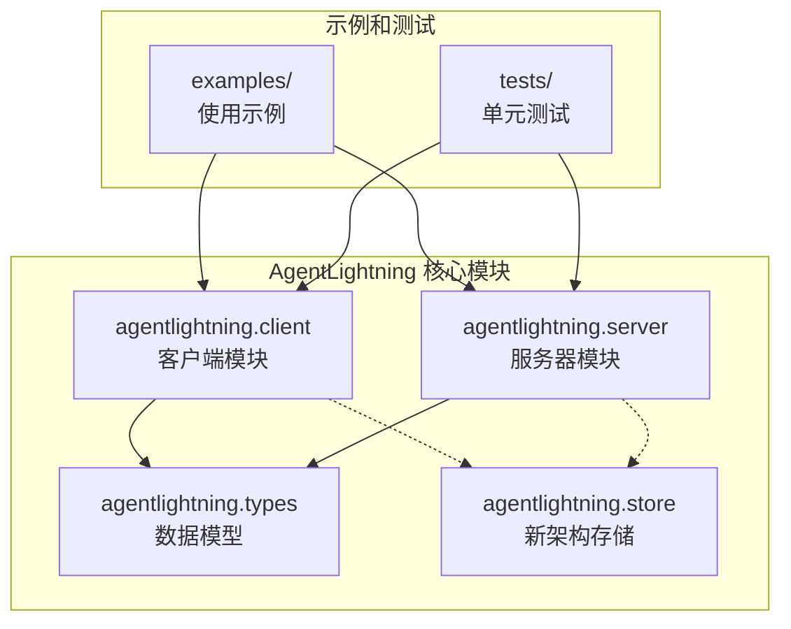
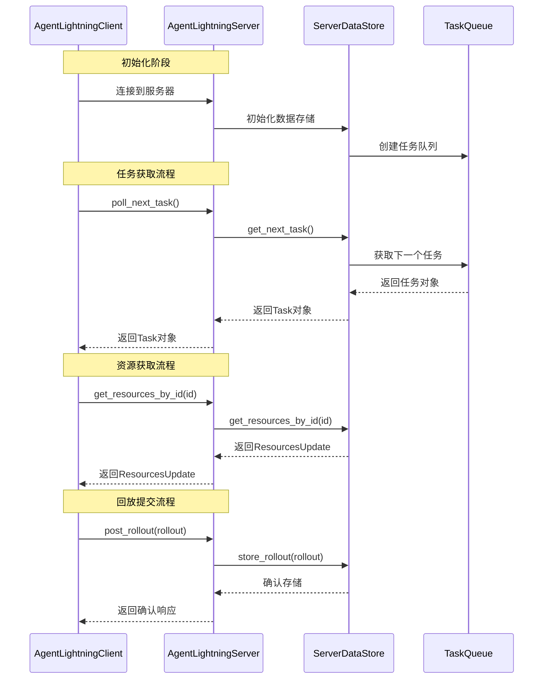
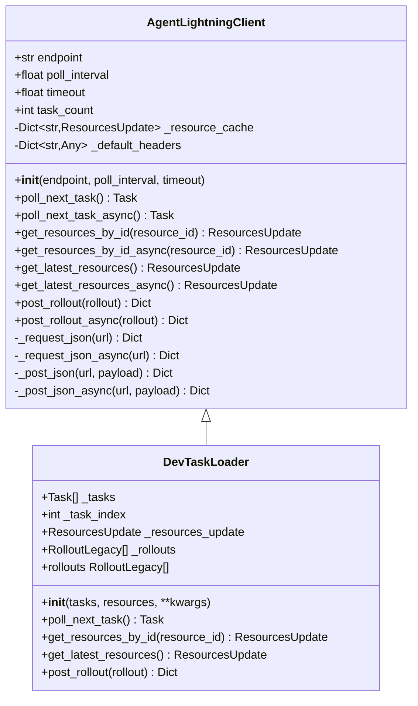
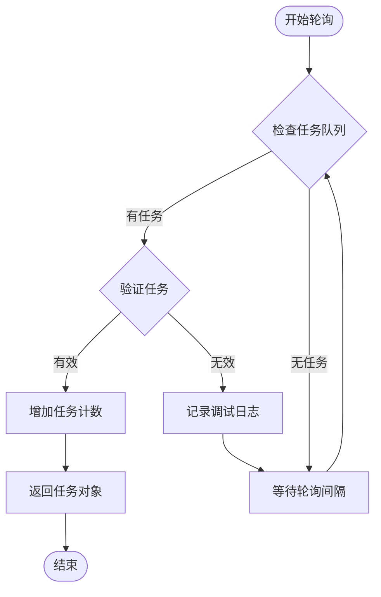
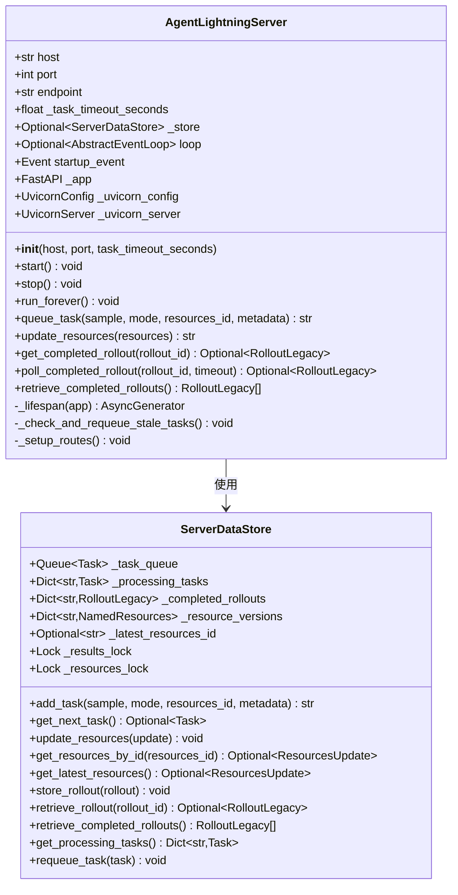
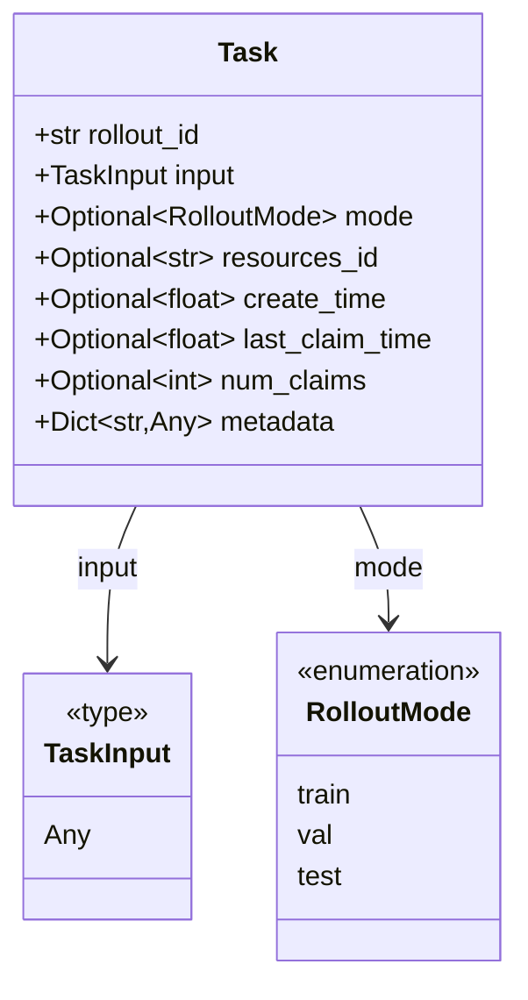
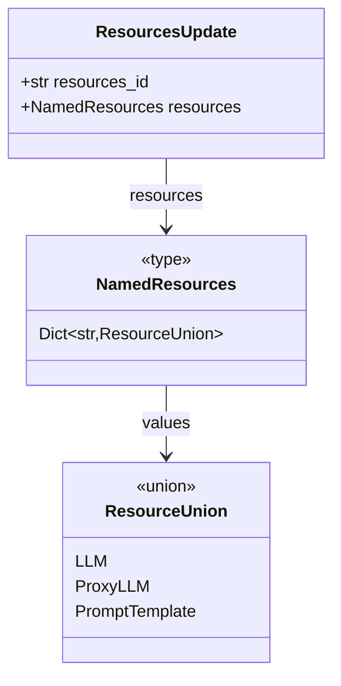
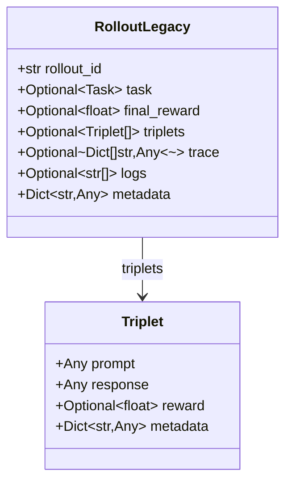
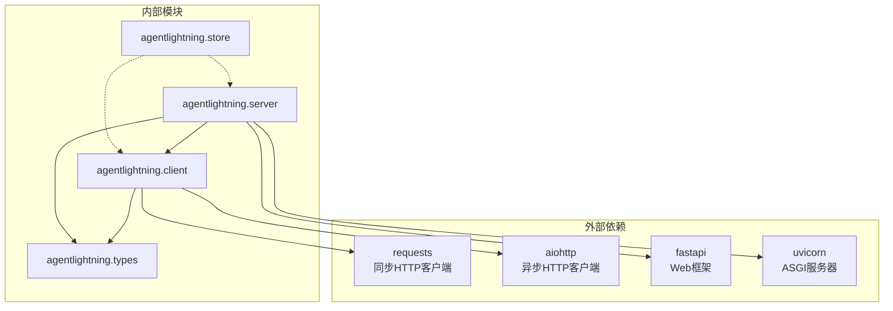

# Python API 参考文档

<cite>
**本文档中引用的文件**
- [agentlightning/client.py](file://agentlightning/client.py)
- [agentlightning/server.py](file://agentlightning/server.py)
- [agentlightning/__init__.py](file://agentlightning/__init__.py)
- [agentlightning/types/core.py](file://agentlightning/types/core.py)
- [agentlightning/types/resources.py](file://agentlightning/types/resources.py)
- [examples/apo/legacy_apo_client.py](file://examples/apo/legacy_apo_client.py)
- [examples/apo/legacy_apo_server.py](file://examples/apo/legacy_apo_server.py)
- [tests/test_client.py](file://tests/test_client.py)
</cite>

## 目录
1. [简介](#简介)
2. [项目结构](#项目结构)
3. [核心组件](#核心组件)
4. [架构概览](#架构概览)
5. [详细组件分析](#详细组件分析)
6. [依赖关系分析](#依赖关系分析)
7. [性能考虑](#性能考虑)
8. [故障排除指南](#故障排除指南)
9. [结论](#结论)

## 简介

AgentLightning 是一个用于强化学习代理训练的框架，提供了传统的基于HTTP的客户端-服务器架构。本文档专注于 `agentlightning.client` 和 `agentlightning.server` 模块，详细介绍了已弃用但仍然可用的API接口。

### 主要特性
- **同步和异步接口**：支持传统同步操作和现代异步编程模式
- **任务轮询机制**：自动处理任务分配和超时重试
- **资源管理**：版本化的资源配置系统
- **回放提交**：标准化的实验结果收集
- **开发工具**：本地任务加载器用于测试和调试

### 弃用警告

**重要提示**：这些API已被标记为弃用，建议迁移到基于store的新架构。新的store API提供了更好的性能、可扩展性和功能完整性。

```python
# 已弃用的客户端使用方式
from agentlightning import AgentLightningClient, AgentLightningServer

# 新架构推荐使用
from agentlightning.store import LightningStoreClient, LightningStoreServer
```

## 项目结构



**图表来源**
- [agentlightning/client.py](file://agentlightning/client.py#L1-L50)
- [agentlightning/server.py](file://agentlightning/server.py#L1-L50)
- [agentlightning/__init__.py](file://agentlightning/__init__.py#L1-L20)

**章节来源**
- [agentlightning/__init__.py](file://agentlightning/__init__.py#L1-L20)

## 核心组件

### AgentLightningClient 类

`AgentLightningClient` 是与传统Agent Lightning服务器交互的主要客户端类，提供同步和异步操作接口。

#### 主要属性
- `endpoint`: 服务器基础URL
- `poll_interval`: 轮询间隔（秒）
- `timeout`: 请求超时时间（秒）
- `task_count`: 已领取任务数量

#### 核心方法

##### 同步方法
- `poll_next_task()`: 同步轮询下一个可用任务
- `get_resources_by_id(resource_id)`: 获取指定资源包
- `get_latest_resources()`: 获取最新资源包
- `post_rollout(rollout)`: 提交完成的回放

##### 异步方法
- `poll_next_task_async()`: 异步轮询下一个可用任务
- `get_resources_by_id_async(resource_id)`: 异步获取指定资源包
- `get_latest_resources_async()`: 异步获取最新资源包
- `post_rollout_async(rollout)`: 异步提交完成的回放

### AgentLightningServer 类

`AgentLightningServer` 是传统的FastAPI服务器实现，负责任务队列管理和资源分发。

#### 主要属性
- `host`: 服务器主机名或IP地址
- `port`: TCP端口号
- `endpoint`: 完整的服务器URL
- `task_timeout_seconds`: 任务超时时间（秒）

#### 核心方法
- `start()`: 启动服务器
- `stop()`: 停止服务器
- `queue_task()`: 添加任务到队列
- `update_resources()`: 发布新的资源包
- `get_completed_rollout()`: 获取完成的回放
- `retrieve_completed_rollouts()`: 获取所有完成的回放

### DevTaskLoader 类

`DevTaskLoader` 是开发环境专用的任务加载器，模拟服务器行为用于本地测试。

#### 特殊功能
- 本地任务队列管理
- 内存中资源缓存
- 回放数据存储
- 开发友好的错误处理

**章节来源**
- [agentlightning/client.py](file://agentlightning/client.py#L25-L100)
- [agentlightning/server.py](file://agentlightning/server.py#L150-L250)

## 架构概览



**图表来源**
- [agentlightning/client.py](file://agentlightning/client.py#L100-L200)
- [agentlightning/server.py](file://agentlightning/server.py#L200-L300)

## 详细组件分析

### AgentLightningClient 类详细分析

#### 类定义和初始化



**图表来源**
- [agentlightning/client.py](file://agentlightning/client.py#L25-L150)
- [agentlightning/client.py](file://agentlightning/client.py#L350-L407)

#### 任务轮询机制

任务轮询是客户端的核心功能，支持同步和异步两种模式：



**图表来源**
- [agentlightning/client.py](file://agentlightning/client.py#L120-L150)
- [agentlightning/client.py](file://agentlightning/client.py#L250-L280)

#### 资源管理系统

资源管理系统提供版本化配置管理：

| 方法 | 描述 | 参数 | 返回值 |
|------|------|------|--------|
| `get_resources_by_id` | 获取指定版本的资源 | `resource_id: str` | `Optional[ResourcesUpdate]` |
| `get_latest_resources` | 获取最新版本资源 | 无 | `Optional[ResourcesUpdate]` |
| `get_resources_by_id_async` | 异步获取指定版本资源 | `resource_id: str` | `Optional[ResourcesUpdate]` |
| `get_latest_resources_async` | 异步获取最新版本资源 | 无 | `Optional[ResourcesUpdate]` |

### AgentLightningServer 类详细分析

#### 数据存储架构



**图表来源**
- [agentlightning/server.py](file://agentlightning/server.py#L30-L120)
- [agentlightning/server.py](file://agentlightning/server.py#L150-L250)

#### HTTP路由配置

服务器提供以下REST API端点：

| 端点 | 方法 | 功能 | 请求体 | 响应格式 |
|------|------|------|--------|----------|
| `/task` | GET | 获取下一个可用任务 | 无 | `TaskIfAny` |
| `/resources/latest` | GET | 获取最新资源包 | 无 | `ResourcesUpdate` |
| `/resources/{resource_id}` | GET | 获取指定资源包 | 无 | `ResourcesUpdate` |
| `/rollout` | POST | 提交完成的回放 | `RolloutLegacy` | `GenericResponse` |

### 核心数据模型

#### Task 数据模型



**图表来源**
- [agentlightning/types/core.py](file://agentlightning/types/core.py#L250-L280)

#### ResourcesUpdate 数据模型



**图表来源**
- [agentlightning/types/resources.py](file://agentlightning/types/resources.py#L180-L199)
- [agentlightning/types/resources.py](file://agentlightning/types/resources.py#L150-L170)

#### RolloutLegacy 数据模型



**图表来源**
- [agentlightning/types/core.py](file://agentlightning/types/core.py#L50-L80)

**章节来源**
- [agentlightning/client.py](file://agentlightning/client.py#L25-L407)
- [agentlightning/server.py](file://agentlightning/server.py#L30-L394)
- [agentlightning/types/core.py](file://agentlightning/types/core.py#L50-L300)
- [agentlightning/types/resources.py](file://agentlightning/types/resources.py#L150-L199)

## 依赖关系分析



**图表来源**
- [agentlightning/client.py](file://agentlightning/client.py#L1-L20)
- [agentlightning/server.py](file://agentlightning/server.py#L1-L25)

### 关键依赖说明

| 模块 | 用途 | 版本要求 |
|------|------|----------|
| `requests` | 同步HTTP请求 | 任意 |
| `aiohttp` | 异步HTTP请求 | 任意 |
| `fastapi` | Web服务器框架 | 任意 |
| `uvicorn` | ASGI服务器 | 任意 |
| `pydantic` | 数据验证和序列化 | 自动安装 |

**章节来源**
- [agentlightning/client.py](file://agentlightning/client.py#L1-L20)
- [agentlightning/server.py](file://agentlightning/server.py#L1-L25)

## 性能考虑

### 并发处理

传统客户端-服务器架构在高并发场景下的性能限制：
- **连接池限制**：每个客户端维护独立的连接
- **序列化开销**：JSON序列化/反序列化
- **网络延迟**：HTTP请求往返时间
- **内存使用**：完整数据模型传输

### 优化建议

1. **使用异步接口**：优先使用异步方法提高并发性能
2. **批量操作**：尽可能批量提交回放数据
3. **连接复用**：保持持久连接减少握手开销
4. **压缩传输**：启用HTTP压缩减少带宽使用

### 迁移建议

从传统架构迁移到新store架构的优势：
- **更低延迟**：直接内存访问减少序列化开销
- **更高吞吐量**：原生并发支持
- **更好可靠性**：内置错误恢复机制
- **更优资源利用**：共享内存减少重复数据

## 故障排除指南

### 常见问题和解决方案

#### 连接问题

**问题**：客户端无法连接到服务器
**解决方案**：
1. 检查服务器是否正在运行
2. 验证端点URL格式正确
3. 确认防火墙设置允许连接
4. 检查网络连通性

#### 超时问题

**问题**：请求超时或任务获取失败
**解决方案**：
1. 增加 `timeout` 参数值
2. 检查服务器负载情况
3. 验证任务队列是否有可用任务
4. 检查网络稳定性

#### 数据序列化问题

**问题**：JSON序列化/反序列化失败
**解决方案**：
1. 检查数据模型兼容性
2. 验证字段类型正确性
3. 使用最新的客户端版本
4. 检查自定义对象的序列化支持

### 调试技巧

1. **启用详细日志**：设置 `logging` 级别为 `DEBUG`
2. **监控网络流量**：使用网络抓包工具分析HTTP请求
3. **检查服务器状态**：通过 `/task` 端点验证服务器健康状态
4. **验证数据完整性**：比较客户端和服务器的数据一致性

**章节来源**
- [tests/test_client.py](file://tests/test_client.py#L1-L100)

## 结论

AgentLightning的传统客户端-服务器架构为早期用户提供了稳定的基础平台，但在现代应用场景中存在性能和可扩展性的局限。随着新store架构的推出，我们强烈建议现有用户逐步迁移到基于store的新API。

### 迁移路线图

1. **评估阶段**：分析现有工作流程和数据模型
2. **准备阶段**：更新依赖项和导入语句
3. **测试阶段**：在开发环境中验证新API功能
4. **部署阶段**：逐步替换旧客户端-服务器对
5. **优化阶段**：利用新架构特性进行性能调优

### 最佳实践

- **渐进式迁移**：不要一次性切换所有组件
- **充分测试**：确保新旧架构间的兼容性
- **监控性能**：对比迁移前后的性能指标
- **文档更新**：及时更新项目文档和开发指南

通过遵循这些指导原则，您可以顺利过渡到更现代化、高性能的AgentLightning架构，同时保持现有投资的价值。