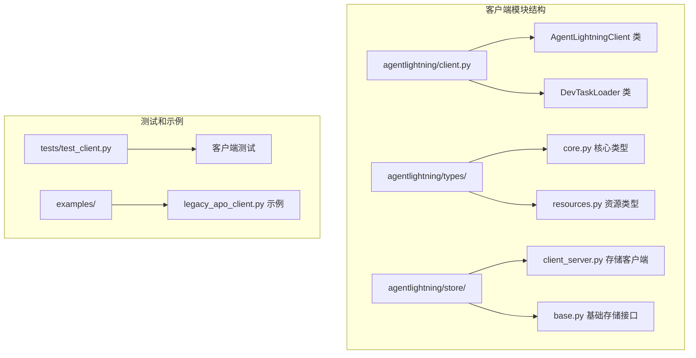
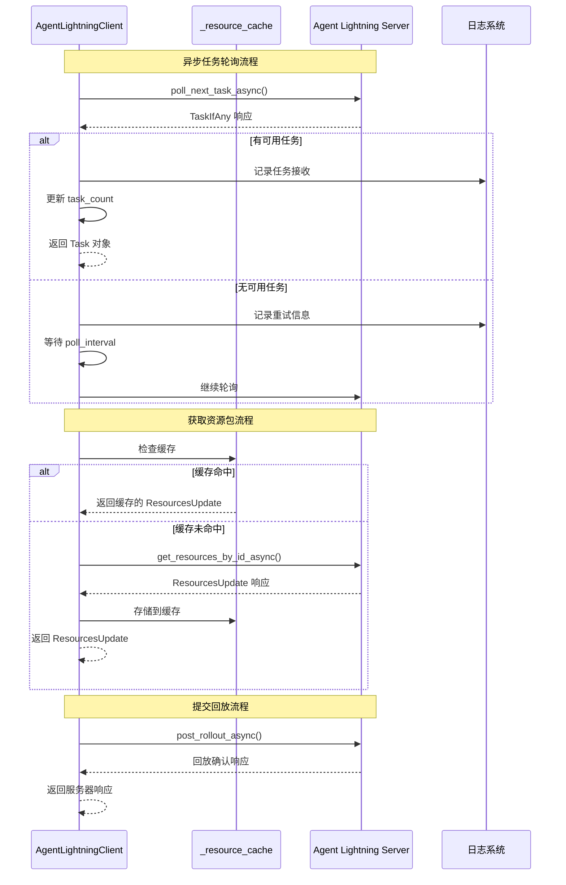
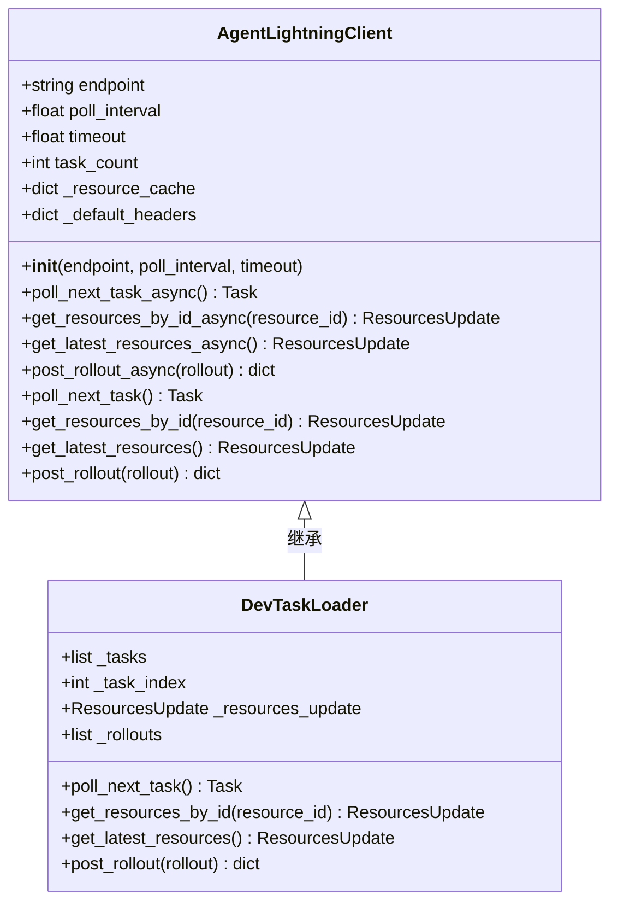
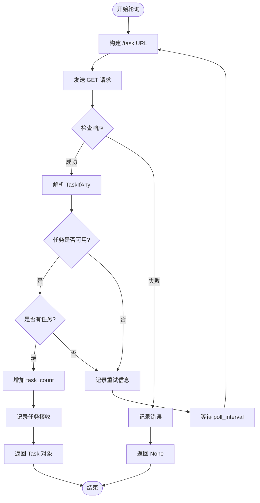
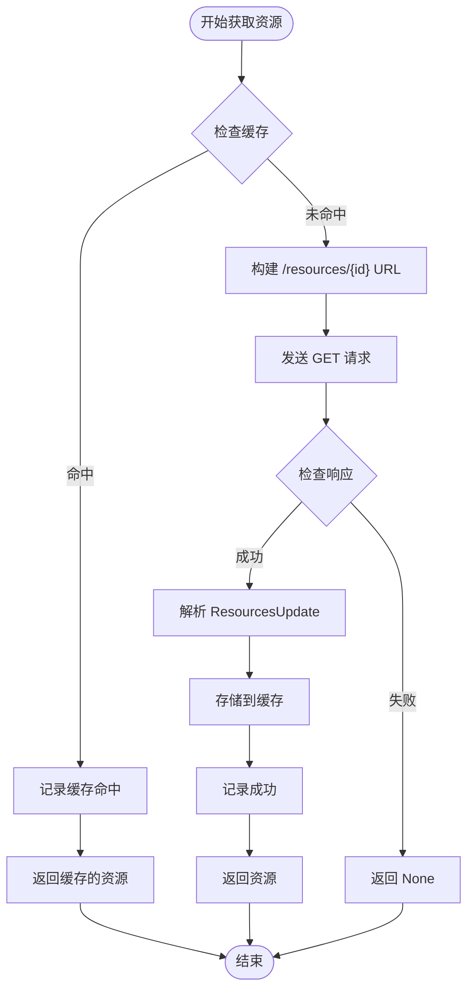
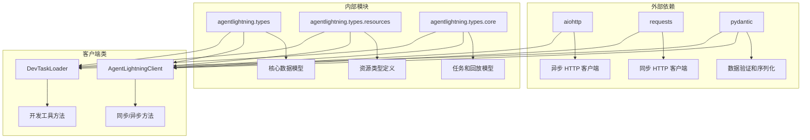

# 客户端 (AgentLightningClient)

<cite>
**本文档中引用的文件**
- [agentlightning/client.py](file://agentlightning/client.py)
- [agentlightning/types/core.py](file://agentlightning/types/core.py)
- [agentlightning/types/resources.py](file://agentlightning/types/resources.py)
- [agentlightning/store/__init__.py](file://agentlightning/store/__init__.py)
- [agentlightning/store/client_server.py](file://agentlightning/store/client_server.py)
- [examples/apo/legacy_apo_client.py](file://examples/apo/legacy_apo_client.py)
- [tests/test_client.py](file://tests/test_client.py)
</cite>

## 目录
1. [简介](#简介)
2. [项目结构](#项目结构)
3. [核心组件](#核心组件)
4. [架构概览](#架构概览)
5. [详细组件分析](#详细组件分析)
6. [依赖关系分析](#依赖关系分析)
7. [性能考虑](#性能考虑)
8. [故障排除指南](#故障排除指南)
9. [结论](#结论)

## 简介

`AgentLightningClient` 是 Agent Lightning 框架中的遗留客户端类，专门用于与旧版 Agent Lightning 服务器进行交互。该客户端提供了同步和异步接口，支持任务轮询、资源包获取和回放数据提交等功能。需要注意的是，该客户端已被标记为已弃用，推荐使用现代化的 `LightningStoreClient` 替代。

## 项目结构

Agent Lightning 客户端模块位于 `agentlightning/` 目录下，主要包含以下关键文件：



**图表来源**
- [agentlightning/client.py](file://agentlightning/client.py#L1-L50)
- [agentlightning/types/core.py](file://agentlightning/types/core.py#L1-L50)
- [agentlightning/store/client_server.py](file://agentlightning/store/client_server.py#L1-L50)

**章节来源**
- [agentlightning/client.py](file://agentlightning/client.py#L1-L407)
- [agentlightning/types/__init__.py](file://agentlightning/types/__init__.py#L1-L6)

## 核心组件

### AgentLightningClient 类

`AgentLightningClient` 是核心的客户端类，提供以下主要功能：

- **任务管理**: 支持轮询获取下一个可用任务
- **资源管理**: 提供资源包的获取和缓存机制
- **回放提交**: 支持将完成的回放数据提交到服务器
- **同步/异步接口**: 同时提供阻塞和非阻塞版本的方法

### 内部缓存机制

客户端维护一个简单的内存缓存系统 (`_resource_cache`)，用于避免重复的网络请求：

- **键值**: 以服务器提供的资源标识符作为键
- **值**: 缓存 `ResourcesUpdate` 对象
- **策略**: 首次请求时下载并缓存，后续请求直接从缓存返回

### HTTP 请求处理

客户端使用两个不同的 HTTP 库处理请求：
- **同步请求**: 使用 `requests` 库
- **异步请求**: 使用 `aiohttp` 库

**章节来源**
- [agentlightning/client.py](file://agentlightning/client.py#L25-L100)

## 架构概览



**图表来源**
- [agentlightning/client.py](file://agentlightning/client.py#L120-L200)
- [agentlightning/client.py](file://agentlightning/client.py#L250-L300)

## 详细组件分析

### 初始化和配置

#### 构造函数参数



**图表来源**
- [agentlightning/client.py](file://agentlightning/client.py#L40-L80)
- [agentlightning/client.py](file://agentlightning/client.py#L320-L380)

#### 配置参数说明

| 参数 | 类型 | 默认值 | 描述 |
|------|------|--------|------|
| `endpoint` | str | 必需 | Agent Lightning 服务器的基础 URL |
| `poll_interval` | float | 5.0 | 轮询间隔时间（秒），当没有可用任务时等待时间 |
| `timeout` | float | 10.0 | HTTP 请求超时时间（秒） |

### 同步接口方法

#### 轮询下一个任务



**图表来源**
- [agentlightning/client.py](file://agentlightning/client.py#L120-L140)

#### 获取特定资源包



**图表来源**
- [agentlightning/client.py](file://agentlightning/client.py#L160-L180)

### 异步接口方法

异步方法使用 `aiohttp` 库实现非阻塞操作，具有以下特点：

- **并发处理**: 可以同时处理多个请求
- **超时控制**: 使用 `aiohttp.ClientTimeout` 进行精确的超时管理
- **连接池**: 自动管理 HTTP 连接池

### DevTaskLoader 开发工具

`DevTaskLoader` 是 `AgentLightningClient` 的开发版本，提供本地任务加载功能：

- **本地任务队列**: 在内存中维护任务列表
- **静态资源**: 提供预定义的资源包
- **调试友好**: 支持回放数据的本地存储和查询

**章节来源**
- [agentlightning/client.py](file://agentlightning/client.py#L40-L120)
- [agentlightning/client.py](file://agentlightning/client.py#L320-L407)

## 依赖关系分析



**图表来源**
- [agentlightning/client.py](file://agentlightning/client.py#L1-L20)
- [agentlightning/types/core.py](file://agentlightning/types/core.py#L1-L30)

### 主要依赖项

| 依赖项 | 版本要求 | 用途 |
|--------|----------|------|
| `aiohttp` | 最新稳定版 | 异步 HTTP 请求处理 |
| `requests` | 最新稳定版 | 同步 HTTP 请求处理 |
| `pydantic` | 最新稳定版 | 数据模型验证和序列化 |
| `urllib.parse` | Python 标准库 | URL 构建和解析 |

**章节来源**
- [agentlightning/client.py](file://agentlightning/client.py#L1-L20)

## 性能考虑

### 缓存策略

客户端实现了简单但有效的缓存机制：

- **LRU 缓存**: 当前实现中没有明确的淘汰机制，TODO 中提到需要添加缓存淘汰机制
- **内存占用**: 缓存大小取决于资源包的数量和大小
- **性能提升**: 避免重复的网络请求，显著提高资源获取速度

### 超时配置

合理的超时配置对于系统稳定性至关重要：

- **默认超时**: 10 秒，适用于大多数网络环境
- **轮询间隔**: 5 秒，默认值平衡了响应性和资源消耗
- **健康检查**: 异常情况下自动进行健康检查

### 并发处理

异步接口支持高并发场景：

- **连接复用**: `aiohttp` 自动管理连接池
- **请求并发**: 可以同时发起多个请求
- **资源隔离**: 每个请求使用独立的会话

## 故障排除指南

### 常见问题和解决方案

#### 连接超时问题

**症状**: 客户端无法连接到服务器，请求超时

**解决方案**:
1. 检查网络连接状态
2. 验证服务器地址和端口
3. 调整 `timeout` 参数
4. 检查防火墙设置

#### 缓存失效问题

**症状**: 获取的资源不是最新的

**解决方案**:
1. 清除本地缓存
2. 使用 `get_latest_resources()` 方法
3. 检查服务器资源更新状态

#### 任务轮询效率低

**症状**: 任务轮询间隔过长或频繁失败

**解决方案**:
1. 调整 `poll_interval` 参数
2. 检查服务器负载情况
3. 实现指数退避策略

### 调试日志配置

客户端内置了详细的日志记录功能：

```python
import logging
from agentlightning import configure_logger

# 配置日志级别
configure_logger(level=logging.DEBUG)
```

**章节来源**
- [agentlightning/client.py](file://agentlightning/client.py#L100-L120)
- [tests/test_client.py](file://tests/test_client.py#L240-L280)

## 结论

`AgentLightningClient` 是 Agent Lightning 框架中的重要组件，虽然已被标记为已弃用，但在现有系统中仍然发挥着重要作用。该客户端提供了完整的工作流支持，包括任务管理、资源获取和回放提交等功能。

### 迁移建议

由于 `AgentLightningClient` 已被弃用，强烈建议迁移到现代化的 `LightningStoreClient`：

1. **评估现有代码**: 分析当前使用的功能和工作流程
2. **学习新 API**: 研究 `LightningStore` 和 `LightningStoreClient` 的使用方法
3. **渐进式迁移**: 逐步替换现有客户端代码
4. **测试验证**: 确保新实现的功能完整性

### 最佳实践

- **及时迁移**: 制定迁移计划，避免长期使用已弃用的组件
- **监控性能**: 迁移后持续监控系统性能和稳定性
- **文档更新**: 更新相关技术文档和开发指南
- **团队培训**: 确保开发团队熟悉新的客户端 API

通过遵循这些指导原则，可以确保系统的平滑过渡和长期稳定性。