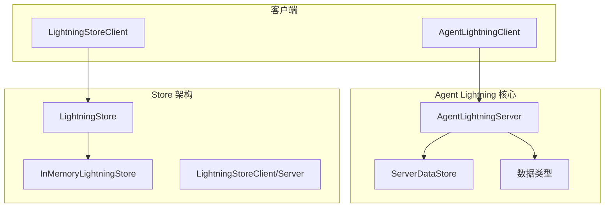
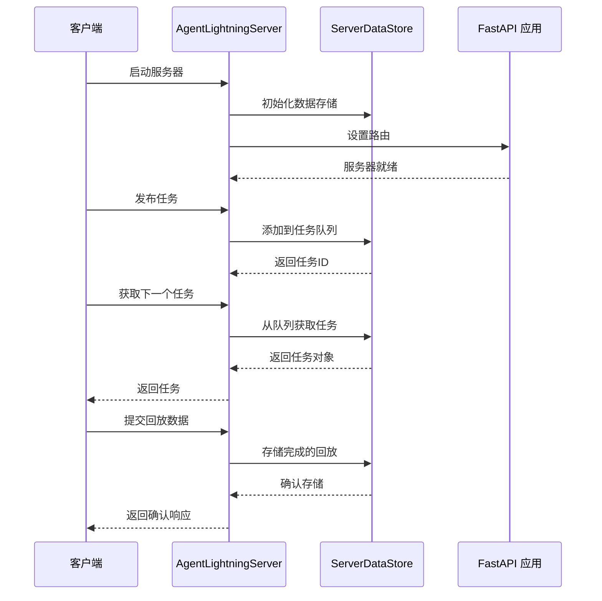
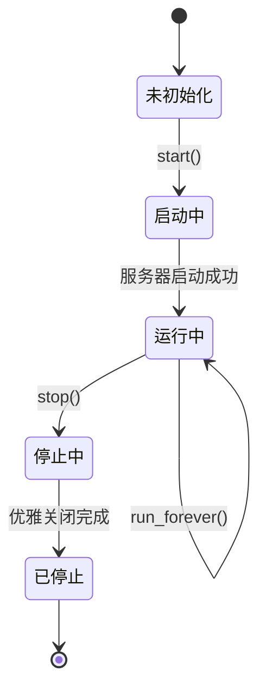
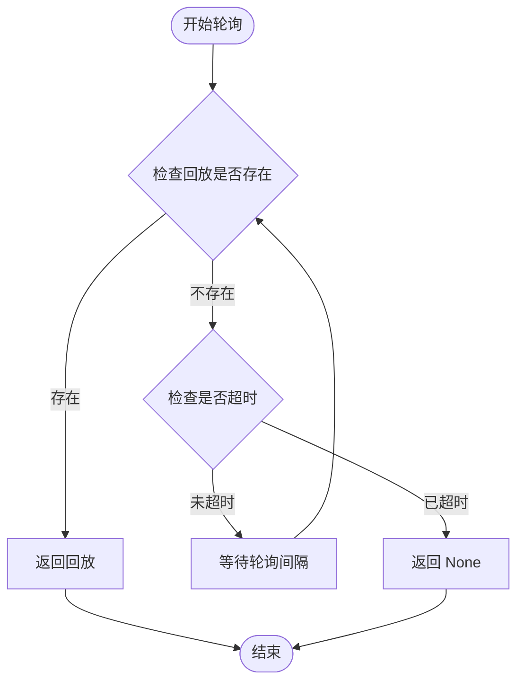
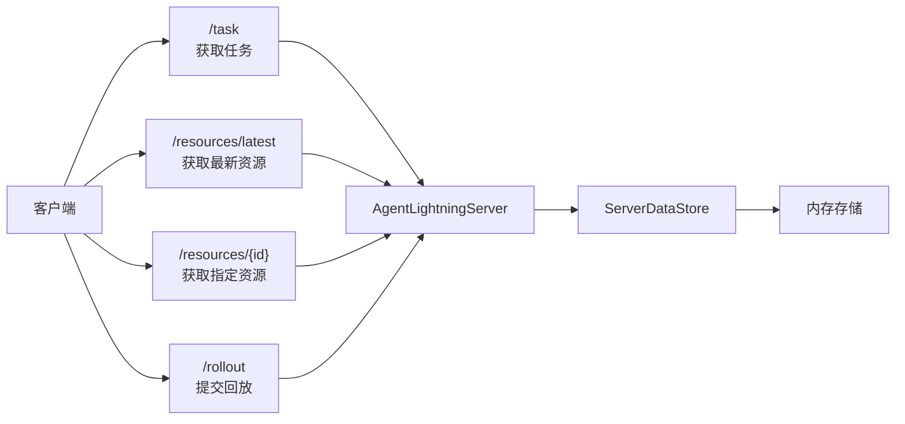
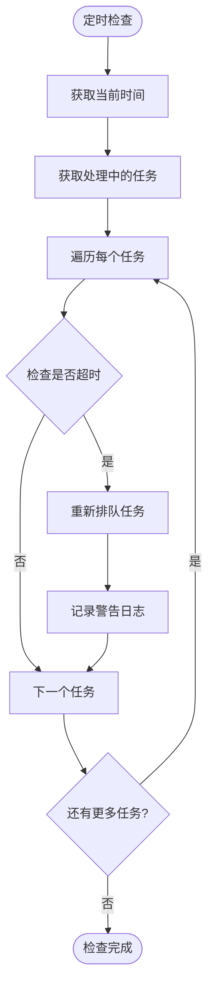
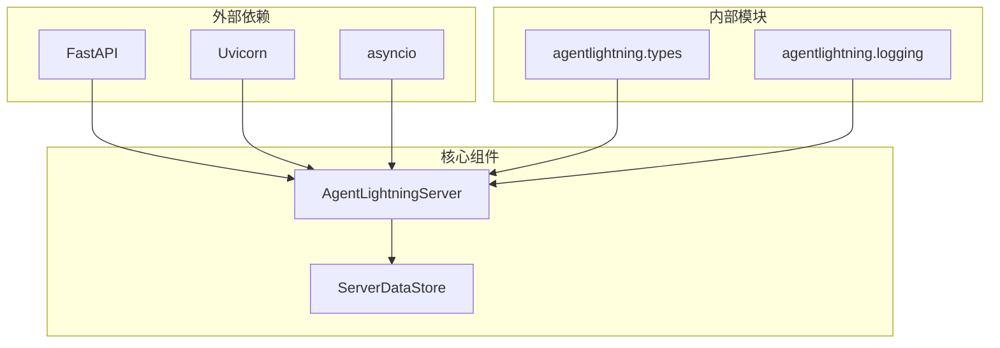

# 服务器 (AgentLightningServer)

<cite>
**本文档中引用的文件**
- [server.py](file://agentlightning/server.py)
- [base.py](file://agentlightning/store/base.py)
- [memory.py](file://agentlightning/store/memory.py)
- [client.py](file://agentlightning/client.py)
- [test_client.py](file://tests/test_client.py)
- [__init__.py](file://agentlightning/store/__init__.py)
</cite>

## 目录
1. [简介](#简介)
2. [项目结构](#项目结构)
3. [核心组件](#核心组件)
4. [架构概览](#架构概览)
5. [详细组件分析](#详细组件分析)
6. [依赖关系分析](#依赖关系分析)
7. [性能考虑](#性能考虑)
8. [故障排除指南](#故障排除指南)
9. [结论](#结论)

## 简介

`AgentLightningServer` 是 Agent Lightning 框架中的遗留 HTTP 服务器组件，专为向后兼容性而保留。该服务器实现了原始的 Agent Lightning 协议，支持任务队列管理、资源版本控制和回放数据存储。然而，由于其基于 FastAPI 的架构和内存中的状态管理，该组件已被标记为已弃用，新项目应迁移到基于 store 的现代架构。

该服务器的核心功能包括：
- 基于 FastAPI 的 RESTful API 路由配置
- 内存中任务队列管理（通过 `ServerDataStore`）
- 资源版本控制和发布机制
- 任务超时检测和重新排队机制
- 异步安全的状态管理

**重要警告**：`AgentLightningServer` 已被标记为已弃用，建议新项目使用 `LightningStore` 架构替代。

## 项目结构

Agent Lightning 项目采用模块化架构，其中服务器组件位于核心包中：

**图表来源**
- [server.py](file://agentlightning/server.py#L1-L50)
- [base.py](file://agentlightning/store/base.py#L1-L50)
- [memory.py](file://agentlightning/store/memory.py#L1-L50)

**章节来源**
- [server.py](file://agentlightning/server.py#L1-L394)
- [base.py](file://agentlightning/store/base.py#L1-L516)

## 核心组件

### AgentLightningServer 类

`AgentLightningServer` 是服务器的主要控制器类，负责管理 FastAPI 服务器实例、任务队列和资源管理。该类提供了完整的服务器生命周期管理功能。

主要特性：
- **异步服务器管理**：支持 `start()`、`stop()` 和 `run_forever()` 方法
- **任务队列操作**：提供 `queue_task()`、`get_completed_rollout()` 等方法
- **资源管理**：支持 `update_resources()` 和资源查询功能
- **超时处理**：内置任务超时检测和自动重新排队机制

### ServerDataStore 类

`ServerDataStore` 是内存中的状态容器，负责维护服务器的所有内部状态。该类确保所有操作都是线程安全的，并提供异步访问控制。

核心数据结构：
- `_task_queue`: 异步任务队列
- `_processing_tasks`: 当前处理中的任务字典
- `_completed_rollouts`: 完成的回放数据字典
- `_resource_versions`: 版本化的资源存储

**章节来源**
- [server.py](file://agentlightning/server.py#L30-L150)

## 架构概览

AgentLightningServer 采用基于 FastAPI 的微服务架构，结合内存中的状态管理：

**图表来源**
- [server.py](file://agentlightning/server.py#L150-L250)

## 详细组件分析

### 服务生命周期管理

#### start() 方法
启动 FastAPI 服务器并在后台运行。该方法创建一个新的异步任务来运行服务器，并等待 1 秒以确保服务器完全启动。

#### stop() 方法
优雅地停止服务器。该方法设置退出标志并等待最多 1 秒让服务器完成当前请求。

#### run_forever() 方法
无限期运行服务器，直到显式调用 `stop()`。该方法直接调用 Uvicorn 服务器的 `serve()` 方法。

**图表来源**
- [server.py](file://agentlightning/server.py#L350-L394)

**章节来源**
- [server.py](file://agentlightning/server.py#L350-L394)

### 核心功能方法

#### queue_task() 方法
将新任务添加到队列中并返回生成的回放标识符。该方法接受任务输入、执行模式、资源标识符和元数据参数。

#### update_resources() 方法
发布新的资源包并返回生成的标识符。该方法将资源包持久化为最新版本。

#### get_completed_rollout() 方法
通过标识符检索特定的完成回放。如果回放不存在，则返回 `None`。

#### poll_completed_rollout() 方法
轮询完成的回放，直到可用或超时。该方法支持可选的超时参数。

**图表来源**
- [server.py](file://agentlightning/server.py#L370-L394)

**章节来源**
- [server.py](file://agentlightning/server.py#L320-L394)

### 路由配置 (_setup_routes)

服务器配置了四个主要的 FastAPI 路由：

#### 任务获取路由 (/task)
提供下一个可用任务给客户端。该路由会先检查过期任务，然后尝试从队列获取任务。

#### 资源获取路由 (/resources/latest)
返回服务器上发布的最新资源包。如果没有资源则返回 404 错误。

#### 资源查询路由 (/resources/{resource_id})
通过标识符返回特定版本的资源。如果资源不存在则返回 404 错误。

#### 回放提交路由 (/rollout)
持久化客户端报告的回放数据。该路由验证服务器已完全初始化。

**图表来源**
- [server.py](file://agentlightning/server.py#L250-L320)

**章节来源**
- [server.py](file://agentlightning/server.py#L250-L320)

### 任务超时处理 (_check_and_requeue_stale_tasks)

服务器实现了智能的任务超时检测机制：

**图表来源**
- [server.py](file://agentlightning/server.py#L230-L250)

该机制通过以下步骤工作：
1. 获取当前时间戳
2. 检查所有正在处理的任务
3. 对于超过超时时间的任务，将其重新排队
4. 记录详细的日志信息用于调试

**章节来源**
- [server.py](file://agentlightning/server.py#L230-L250)

### ServerDataStore 实现细节

#### 任务队列管理
`ServerDataStore` 使用异步队列来管理任务，确保线程安全的操作：

- `add_task()`: 将新任务添加到队列，生成唯一的回放 ID
- `get_next_task()`: 非阻塞地从队列获取下一个任务
- `requeue_task()`: 将超时的任务重新排队

#### 资源版本控制
资源管理系统支持版本化存储和检索：

- `update_resources()`: 持久化新的资源包并标记为最新版本
- `get_resources_by_id()`: 通过标识符检索特定版本的资源
- `get_latest_resources()`: 返回最新的资源包

#### 回放数据存储
完成的回放数据通过以下方法管理：

- `store_rollout()`: 持久化完成的回放数据
- `retrieve_rollout()`: 检索并移除特定的回放数据
- `retrieve_completed_rollouts()`: 返回所有完成的回放并清空缓冲区

**章节来源**
- [server.py](file://agentlightning/server.py#L30-L230)

## 依赖关系分析

AgentLightningServer 的依赖关系图展示了其与框架其他部分的关系：

**图表来源**
- [server.py](file://agentlightning/server.py#L1-L25)

主要依赖项：
- **FastAPI**: 提供 Web 服务器和路由功能
- **Uvicorn**: ASGI 服务器，用于运行 FastAPI 应用
- **asyncio**: 异步编程支持
- **Pydantic**: 数据模型验证和序列化

**章节来源**
- [server.py](file://agentlightning/server.py#L1-L25)

## 性能考虑

### 内存使用优化
ServerDataStore 在设计时考虑了内存效率：

- 使用异步锁确保线程安全的同时最小化锁竞争
- 支持任务和资源的版本控制，避免重复存储
- 提供清理机制来管理长时间运行的服务器

### 并发处理
服务器支持高并发访问：

- 所有数据库操作都是异步的
- 使用 asyncio 锁保护共享状态
- 支持多个客户端同时连接

### 超时机制
智能的超时处理防止任务挂起：

- 可配置的任务超时时间
- 自动重新排队过期任务
- 详细的日志记录帮助调试

## 故障排除指南

### 常见问题

#### 服务器启动失败
**症状**: `RuntimeError: Store not initialized`
**原因**: 服务器尚未完全启动
**解决方案**: 等待服务器启动事件或增加启动超时

#### 任务超时问题
**症状**: 任务频繁重新排队
**原因**: 任务处理时间超过超时限制
**解决方案**: 增加 `task_timeout_seconds` 参数值

#### 资源获取错误
**症状**: 404 错误表示资源未找到
**原因**: 在任务分配之前没有更新资源
**解决方案**: 确保在发布任务之前调用 `update_resources()`

### 调试技巧

1. **启用详细日志**: 设置日志级别为 DEBUG 查看详细信息
2. **监控任务状态**: 使用 `get_processing_tasks()` 检查正在处理的任务
3. **检查队列状态**: 监控任务队列长度和处理速度

**章节来源**
- [server.py](file://agentlightning/server.py#L230-L250)
- [test_client.py](file://tests/test_client.py#L200-L250)

## 结论

`AgentLightningServer` 是 Agent Lightning 框架中的重要组件，尽管已被标记为已弃用，但它仍然为现有系统提供向后兼容性。该服务器展示了：

- **基于 FastAPI 的现代 Web 服务器架构**
- **内存中状态管理的最佳实践**
- **异步编程和并发处理的实现**
- **任务队列和资源管理的设计模式**

对于新项目，强烈建议迁移到基于 `LightningStore` 的现代架构，该架构提供了更好的可扩展性、持久化能力和更现代化的 API 设计。迁移路径包括：

1. 使用 `InMemoryLightningStore` 进行原型开发
2. 渐进式迁移到持久化存储实现
3. 利用新的客户端 API 和工具

虽然 `AgentLightningServer` 已被弃用，但其设计理念和实现模式仍然具有重要的学习价值，特别是在理解和设计分布式任务处理系统方面。