# 核心数据模型

<cite>
**本文档中引用的文件**
- [agentlightning/types/core.py](file://agentlightning/types/core.py)
- [agentlightning/types/resources.py](file://agentlightning/types/resources.py)
- [agentlightning/client.py](file://agentlightning/client.py)
- [agentlightning/server.py](file://agentlightning/server.py)
- [agentlightning/store/base.py](file://agentlightning/store/base.py)
- [agentlightning/runner/legacy.py](file://agentlightning/runner/legacy.py)
- [examples/calc_x/calc_agent.py](file://examples/calc_x/calc_agent.py)
</cite>

## 目录
1. [简介](#简介)
2. [项目结构概览](#项目结构概览)
3. [核心数据模型](#核心数据模型)
4. [架构概览](#架构概览)
5. [详细组件分析](#详细组件分析)
6. [客户端-服务器通信](#客户端-服务器通信)
7. [新Store架构对比](#新store架构对比)
8. [使用示例](#使用示例)
9. [最佳实践](#最佳实践)
10. [总结](#总结)

## 简介

Agent Lightning是一个用于训练和部署智能体的框架，其核心围绕几个关键的数据模型构建。本文档深入探讨了Python API中使用的Task、ResourcesUpdate、RolloutLegacy和NamedResources等核心数据结构，详细解释每个字段的含义、数据类型和使用场景，并说明这些模型如何通过Pydantic进行序列化和验证。

## 项目结构概览

Agent Lightning采用模块化架构，主要包含以下核心组件：

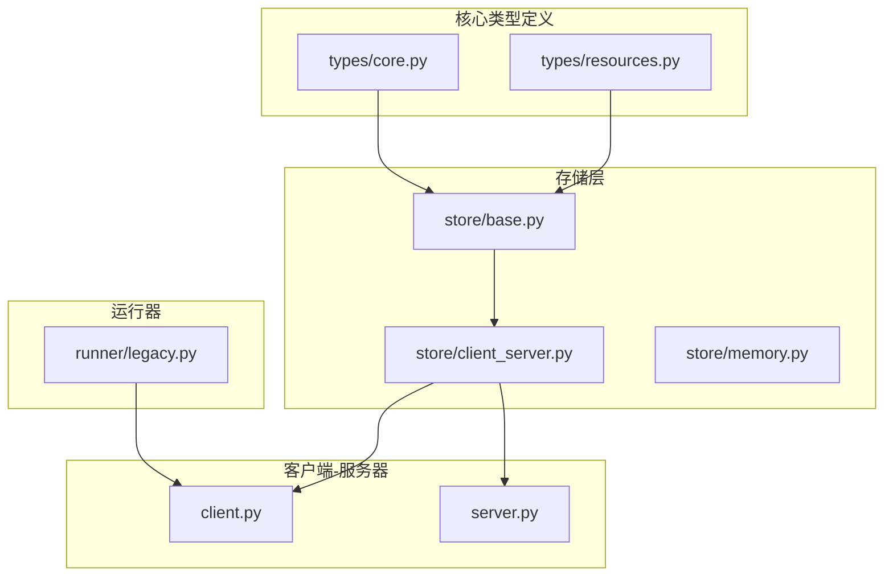

**图表来源**
- [agentlightning/types/core.py](file://agentlightning/types/core.py#L1-L50)
- [agentlightning/types/resources.py](file://agentlightning/types/resources.py#L1-L50)
- [agentlightning/store/base.py](file://agentlightning/store/base.py#L1-L50)

## 核心数据模型

### Task模型

Task是传递给客户端代理的核心数据结构，代表一个待执行的任务请求。

```mermaid
classDiagram
class Task {
+string rollout_id
+TaskInput input
+Optional~RolloutMode~ mode
+Optional~string~ resources_id
+Optional~float~ create_time
+Optional~float~ last_claim_time
+Optional~int~ num_claims
+Dict~string,Any~ metadata
}
class TaskInput {
<<type>>
Any
}
class RolloutMode {
<<literal>>
"train"
"val"
"test"
}
Task --> TaskInput : "包含"
Task --> RolloutMode : "可选模式"
```

**图表来源**
- [agentlightning/types/core.py](file://agentlightning/types/core.py#L206-L226)

#### 字段详解

| 字段名 | 类型 | 必需 | 描述 |
|--------|------|------|------|
| `rollout_id` | `str` | 是 | 唯一标识符，用于跟踪任务生命周期 |
| `input` | `TaskInput` | 是 | 任务的具体输入数据，可以是任意有效载荷 |
| `mode` | `Optional[RolloutMode]` | 否 | 执行模式：`"train"`（训练）、`"val"`（验证）、`"test"`（测试） |
| `resources_id` | `Optional[str]` | 否 | 资源包标识符，指向特定的资源配置 |
| `create_time` | `Optional[float]` | 否 | 任务创建时间戳 |
| `last_claim_time` | `Optional[float]` | 否 | 最后被认领的时间戳 |
| `num_claims` | `Optional[int]` | 否 | 被认领的次数 |
| `metadata` | `Dict[str, Any]` | 否 | 额外的元数据字段 |

**节来源**
- [agentlightning/types/core.py](file://agentlightning/types/core.py#L206-L226)

### ResourcesUpdate模型

ResourcesUpdate是当资源发生变化时广播给客户端的更新负载。

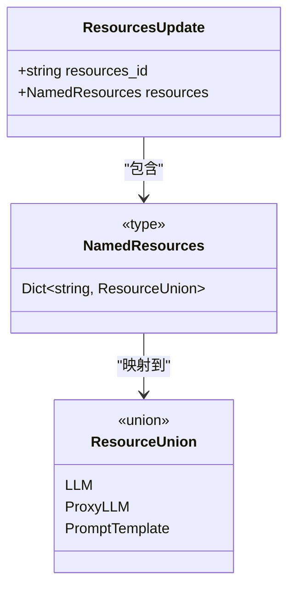

**图表来源**
- [agentlightning/types/resources.py](file://agentlightning/types/resources.py#L191-L197)

#### 字段详解

| 字段名 | 类型 | 必需 | 描述 |
|--------|------|------|------|
| `resources_id` | `str` | 是 | 用于版本控制资源的标识符 |
| `resources` | `NamedResources` | 是 | 资源名称到其定义的映射 |

**节来源**
- [agentlightning/types/resources.py](file://agentlightning/types/resources.py#L191-L197)

### RolloutLegacy模型

RolloutLegacy是与已弃用的HTTP服务器交换的传统报告负载。

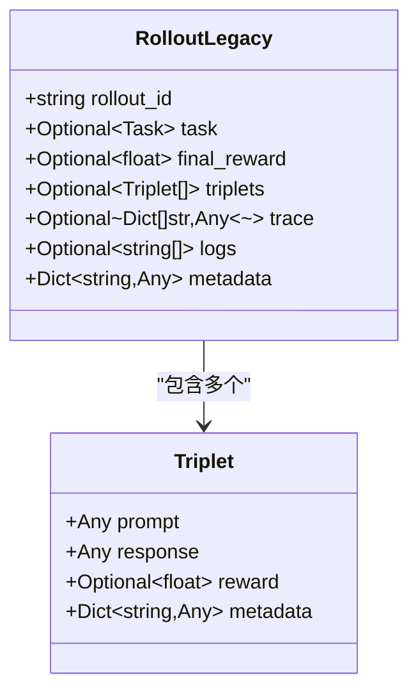

**图表来源**
- [agentlightning/types/core.py](file://agentlightning/types/core.py#L65-L93)

#### 字段详解

| 字段名 | 类型 | 必需 | 描述 |
|--------|------|------|------|
| `rollout_id` | `str` | 是 | 唯一标识符 |
| `task` | `Optional[Task]` | 否 | 输入任务的回显 |
| `final_reward` | `Optional[float]` | 否 | 主要的高级反馈 |
| `triplets` | `Optional[List[Triplet]]` | 否 | 结构化的序列化反馈，用于强化学习优化 |
| `trace` | `Optional[List[Dict[str, Any]]]` | 否 | 符合OpenTelemetry JSON格式的跨度列表 |
| `logs` | `Optional[List[str]]` | 否 | 日志记录 |
| `metadata` | `Dict[str, Any]` | 否 | 其他相关信息的容器 |

**节来源**
- [agentlightning/types/core.py](file://agentlightning/types/core.py#L65-L93)

### NamedResources类型

NamedResources是资源名称到其配置实例的映射。

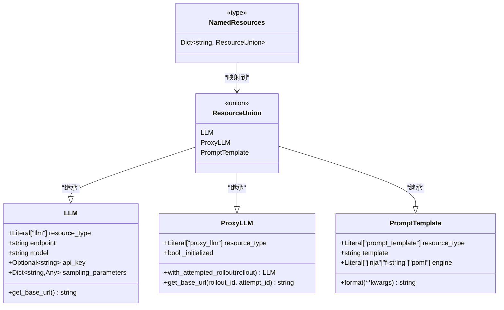

**图表来源**
- [agentlightning/types/resources.py](file://agentlightning/types/resources.py#L171-L171)
- [agentlightning/types/resources.py](file://agentlightning/types/resources.py#L25-L198)

**节来源**
- [agentlightning/types/resources.py](file://agentlightning/types/resources.py#L171-L171)
- [agentlightning/types/resources.py](file://agentlightning/types/resources.py#L25-L198)

## 架构概览

Agent Lightning采用分层架构设计，支持两种主要的通信模式：

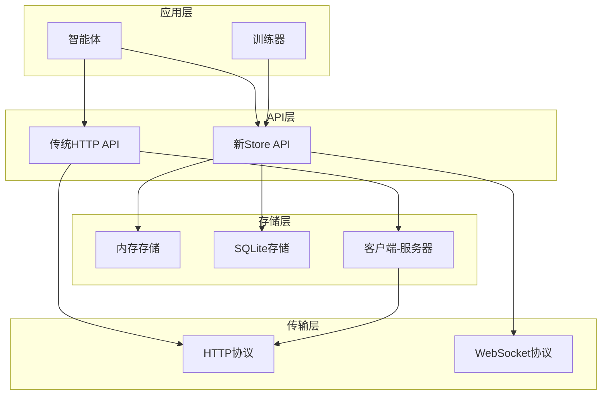

**图表来源**
- [agentlightning/client.py](file://agentlightning/client.py#L1-L50)
- [agentlightning/server.py](file://agentlightning/server.py#L1-L50)
- [agentlightning/store/base.py](file://agentlightning/store/base.py#L1-L50)

## 详细组件分析

### Pydantic验证机制

所有核心数据模型都基于Pydantic构建，提供了强大的序列化和验证功能：

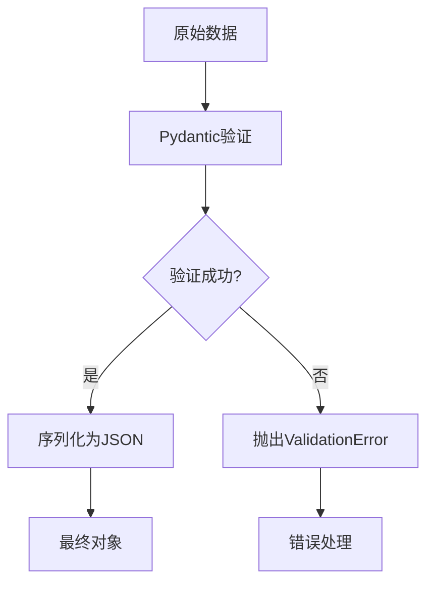

**图表来源**
- [agentlightning/types/core.py](file://agentlightning/types/core.py#L206-L226)
- [agentlightning/types/resources.py](file://agentlightning/types/resources.py#L191-L197)

### 数据流处理

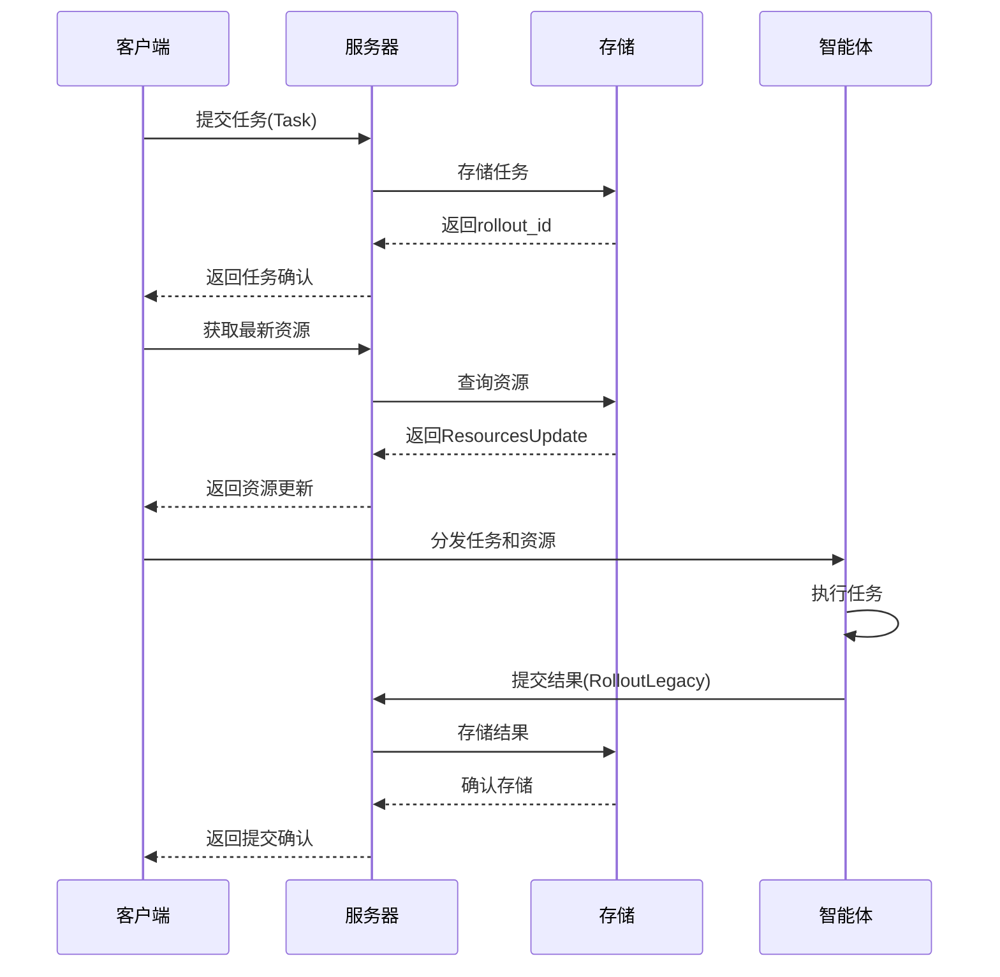

**图表来源**
- [agentlightning/client.py](file://agentlightning/client.py#L100-L150)
- [agentlightning/server.py](file://agentlightning/server.py#L150-L200)

**节来源**
- [agentlightning/client.py](file://agentlightning/client.py#L100-L150)
- [agentlightning/server.py](file://agentlightning/server.py#L150-L200)

## 客户端-服务器通信

### 传统HTTP通信模式

传统的Agent Lightning使用HTTP协议进行客户端-服务器通信：

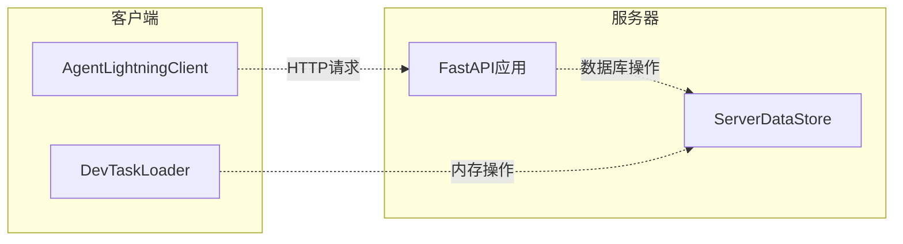

**图表来源**
- [agentlightning/client.py](file://agentlightning/client.py#L30-L80)
- [agentlightning/server.py](file://agentlightning/server.py#L40-L90)

### 异步通信流程

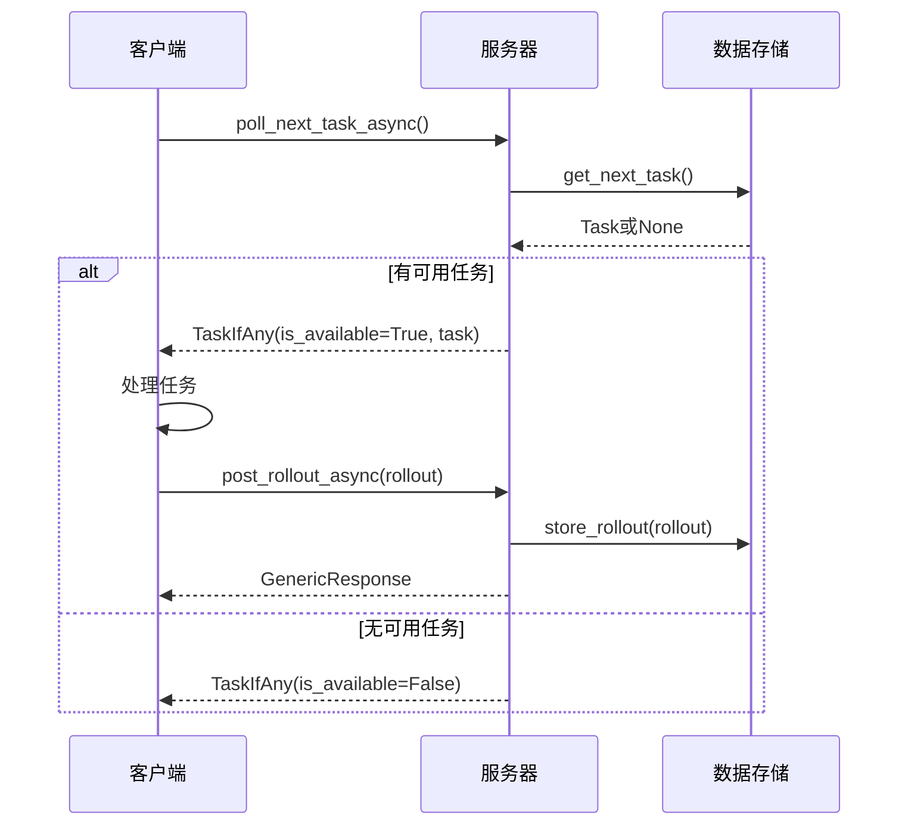

**图表来源**
- [agentlightning/client.py](file://agentlightning/client.py#L120-L170)
- [agentlightning/server.py](file://agentlightning/server.py#L250-L300)

**节来源**
- [agentlightning/client.py](file://agentlightning/client.py#L120-L170)
- [agentlightning/server.py](file://agentlightning/server.py#L250-L300)

## 新Store架构对比

### 传统架构 vs 新架构

| 特性 | 传统架构 | 新Store架构 |
|------|----------|-------------|
| 协议 | HTTP/REST | WebSocket/消息队列 |
| 并发性 | 同步阻塞 | 异步非阻塞 |
| 数据一致性 | 最终一致 | 强一致性 |
| 可扩展性 | 中等 | 高 |
| 错误恢复 | 基础 | 完善 |
| 性能 | 中等 | 高性能 |

### 新Store架构的核心组件

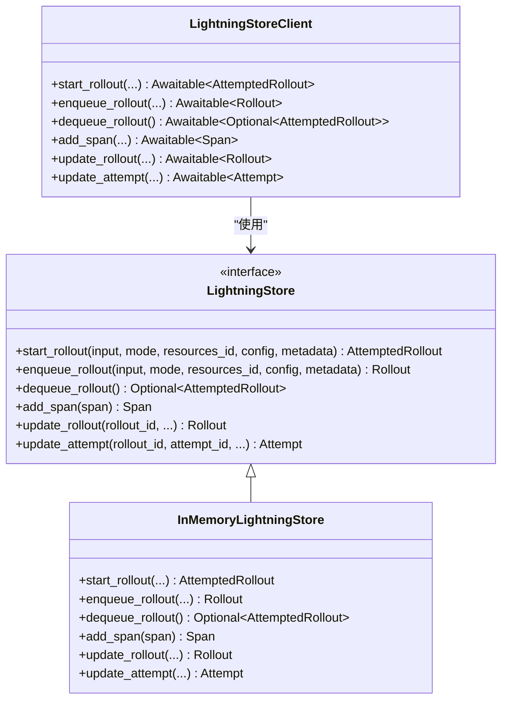

**图表来源**
- [agentlightning/store/base.py](file://agentlightning/store/base.py#L40-L100)

**节来源**
- [agentlightning/store/base.py](file://agentlightning/store/base.py#L40-L100)

## 使用示例

### 创建Task对象

```python
# 基本Task创建
task = Task(
    rollout_id="rollout-123",
    input={"problem": "What is 2+2?", "format": "text"},
    mode="train",
    resources_id="resources-456",
    create_time=1640995200.0,
    num_claims=1,
    metadata={"priority": "high"}
)
```

### 创建ResourcesUpdate对象

```python
# LLM资源配置
llm_resource = LLM(
    endpoint="https://api.openai.com/v1",
    model="gpt-4",
    api_key="sk-...",
    sampling_parameters={"temperature": 0.7, "max_tokens": 1000}
)

# Prompt模板资源
prompt_template = PromptTemplate(
    template="Answer the question: {{question}}",
    engine="jinja"
)

# 创建资源更新
resources_update = ResourcesUpdate(
    resources_id="res-abc123",
    resources={
        "main_llm": llm_resource,
        "system_prompt": prompt_template
    }
)
```

### 创建RolloutLegacy对象

```python
# 创建三元组（强化学习）
triplet = Triplet(
    prompt="What is the capital of France?",
    response="Paris",
    reward=1.0,
    metadata={"confidence": 0.95}
)

# 创建完整RolloutLegacy
rollout = RolloutLegacy(
    rollout_id="rollout-123",
    task=task,
    final_reward=0.8,
    triplets=[triplet],
    trace=[
        {
            "name": "llm_call",
            "attributes": {"model": "gpt-4", "tokens": 150}
        }
    ],
    logs=["Starting rollout...", "Processing task..."],
    metadata={"experiment": "baseline"}
)
```

### 客户端使用示例

```python
# 同步客户端使用
client = AgentLightningClient("http://localhost:8000")

# 获取下一个任务
task = client.poll_next_task()
if task:
    print(f"Received task: {task.rollout_id}")
    
    # 获取相关资源
    resources = client.get_resources_by_id(task.resources_id)
    
    # 处理任务...
    
    # 提交结果
    rollout = RolloutLegacy(
        rollout_id=task.rollout_id,
        final_reward=0.9,
        logs=["Task completed successfully"]
    )
    client.post_rollout(rollout)
```

**节来源**
- [examples/calc_x/calc_agent.py](file://examples/calc_x/calc_agent.py#L100-L158)

## 最佳实践

### 数据模型设计原则

1. **不可变性优先**：尽量使用不可变数据结构，确保数据一致性
2. **明确的类型注解**：使用严格的类型注解提高代码可读性和安全性
3. **默认值设置**：为可选字段提供合理的默认值
4. **验证机制**：利用Pydantic的验证功能确保数据完整性

### 性能优化建议

1. **缓存策略**：合理使用资源缓存减少网络请求
2. **批量操作**：尽可能批量处理任务和资源更新
3. **异步处理**：使用异步API提高并发性能
4. **连接池管理**：正确管理HTTP连接池

### 错误处理

```python
# 推荐的错误处理模式
try:
    task = client.poll_next_task()
    if not task:
        logger.info("No tasks available, waiting...")
        await asyncio.sleep(poll_interval)
        continue
        
    resources = client.get_resources_by_id(task.resources_id)
    if not resources:
        logger.error(f"Failed to get resources for {task.resources_id}")
        continue
        
    # 处理任务...
    
except Exception as e:
    logger.error(f"Error processing task {task.rollout_id}: {e}")
    # 实现重试逻辑
    await asyncio.sleep(retry_delay)
```

### 迁移指南

从传统架构迁移到新Store架构：

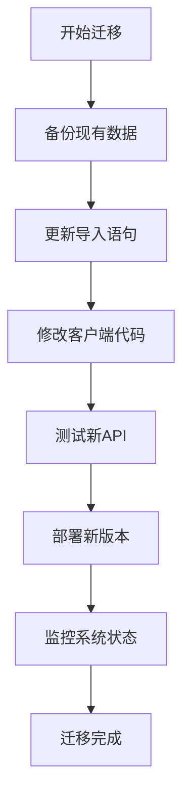

## 总结

Agent Lightning的核心数据模型构成了整个系统的基石，通过Pydantic提供的强大验证和序列化能力，确保了数据的一致性和可靠性。传统架构虽然功能完善但存在性能瓶颈，新Store架构则提供了更好的可扩展性和性能表现。

理解这些核心数据模型对于：
- 正确使用Agent Lightning框架
- 开发高效的智能体应用
- 进行系统性能优化
- 实施正确的错误处理策略

至关重要。随着框架的持续发展，新Store架构将成为主流选择，为开发者提供更强大、更灵活的工具集。