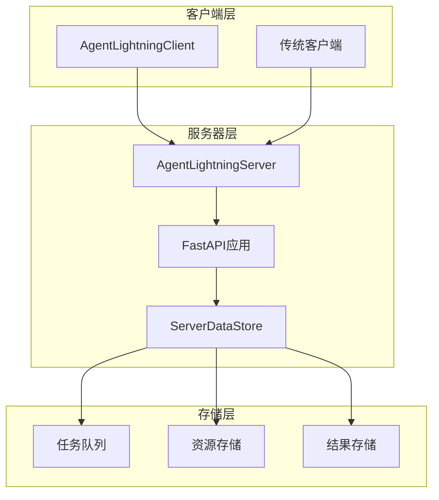
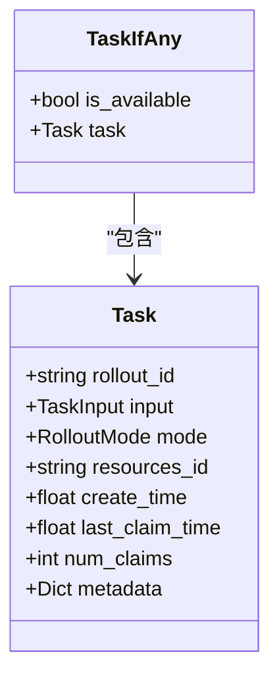
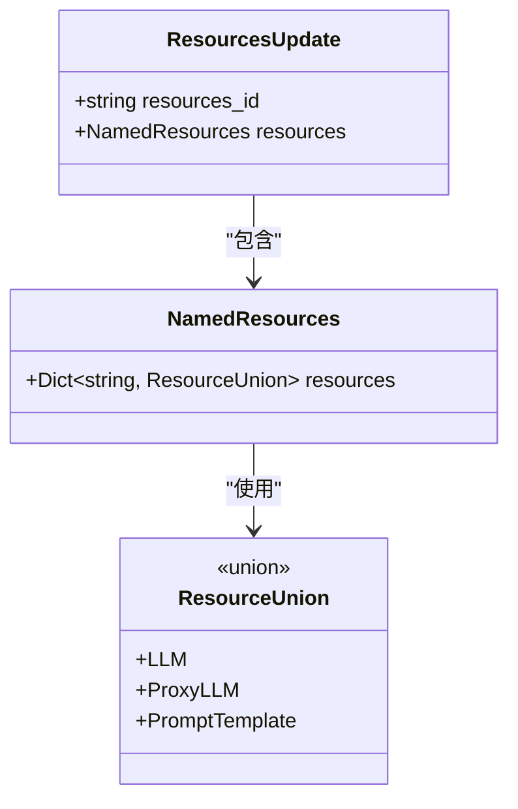
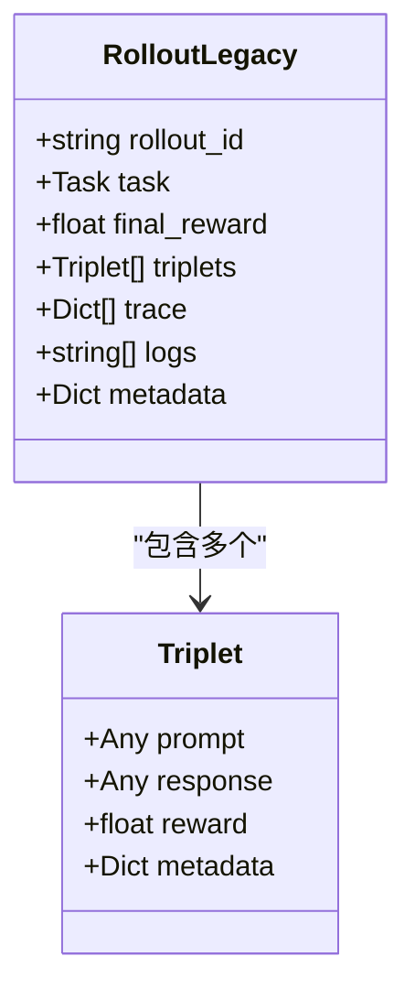
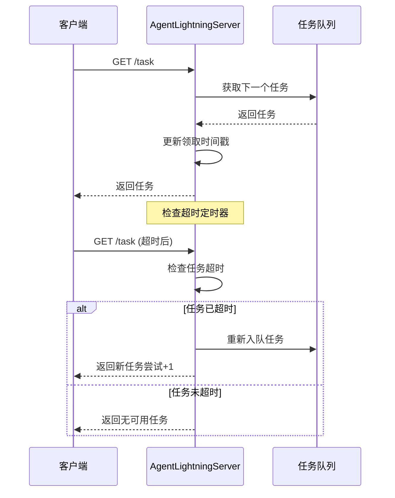
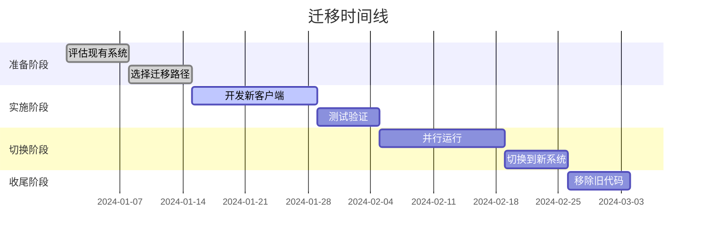

# REST API 参考文档

<cite>
**本文档中引用的文件**
- [agentlightning/server.py](file://agentlightning/server.py)
- [agentlightning/types/core.py](file://agentlightning/types/core.py)
- [agentlightning/types/resources.py](file://agentlightning/types/resources.py)
- [agentlightning/client.py](file://agentlightning/client.py)
- [tests/test_client.py](file://tests/test_client.py)
- [examples/apo/legacy_apo_server.py](file://examples/apo/legacy_apo_server.py)
</cite>

## 目录
1. [简介](#简介)
2. [项目架构概览](#项目架构概览)
3. [核心端点详解](#核心端点详解)
4. [数据模型定义](#数据模型定义)
5. [错误处理与状态码](#错误处理与状态码)
6. [客户端集成指南](#客户端集成指南)
7. [重试逻辑与超时处理](#重试逻辑与超时处理)
8. [安全考虑](#安全考虑)
9. [迁移建议](#迁移建议)

## 简介

AgentLightningServer是一个遗留的HTTP服务器，专为向后兼容性而设计，用于支持早期版本的Agent Lightning部署。该REST API提供了任务队列管理、资源分发和结果收集的核心功能，采用FastAPI框架构建，确保高性能和可扩展性。

### 主要特性
- **向后兼容性**：保持与旧版Agent Lightning客户端的兼容
- **异步处理**：基于asyncio的非阻塞并发处理
- **任务轮询**：智能的任务分配和超时重试机制
- **资源管理**：动态资源更新和版本控制
- **错误恢复**：完善的错误处理和重试策略

**节来源**
- [agentlightning/server.py](file://agentlightning/server.py#L1-L50)

## 项目架构概览



**图表来源**
- [agentlightning/server.py](file://agentlightning/server.py#L150-L200)

### 架构组件说明

1. **AgentLightningServer**：主控制器，负责服务器生命周期管理和路由配置
2. **ServerDataStore**：内存数据存储，支持异步安全访问
3. **FastAPI应用**：HTTP路由和请求处理
4. **任务队列**：FIFO任务调度系统
5. **资源存储**：版本化资源管理
6. **结果存储**：已完成任务的持久化

**节来源**
- [agentlightning/server.py](file://agentlightning/server.py#L40-L120)

## 核心端点详解

### 1. 获取下一个任务 - `/task`

**HTTP方法**: `GET`  
**URL模式**: `/task`  
**认证**: 无特殊认证要求  
**内容类型**: `application/json`

#### 请求参数
无参数

#### 响应结构



**图表来源**
- [agentlightning/types/core.py](file://agentlightning/types/core.py#L200-L230)

#### 成功响应示例
```json
{
  "is_available": true,
  "task": {
    "rollout_id": "rollout-12345",
    "input": {"prompt": "分析市场趋势"},
    "mode": "train",
    "resources_id": "res-67890",
    "create_time": 1640995200.123456,
    "last_claim_time": 1640995201.123456,
    "num_claims": 1,
    "metadata": {"priority": "high"}
  }
}
```

#### 错误响应
当没有可用任务时：
```json
{
  "is_available": false
}
```

**节来源**
- [agentlightning/server.py](file://agentlightning/server.py#L273-L288)

### 2. 获取最新资源 - `/resources/latest`

**HTTP方法**: `GET`  
**URL模式**: `/resources/latest`  
**认证**: 无特殊认证要求  
**内容类型**: `application/json`

#### 请求参数
无参数

#### 响应结构



**图表来源**
- [agentlightning/types/resources.py](file://agentlightning/types/resources.py#L150-L198)

#### 成功响应示例
```json
{
  "resources_id": "res-67890",
  "resources": {
    "main_llm": {
      "resource_type": "llm",
      "endpoint": "http://localhost:8080/v1/chat/completions",
      "model": "gpt-4o",
      "sampling_parameters": {
        "temperature": 0.8,
        "max_tokens": 500
      }
    },
    "system_prompt": {
      "resource_type": "prompt_template",
      "template": "你是一个{domain}领域的专家。",
      "engine": "f-string"
    }
  }
}
```

#### 错误响应
当没有设置任何资源时：
```json
{
  "detail": "No resources have been set on the server."
}
```

**节来源**
- [agentlightning/server.py](file://agentlightning/server.py#L289-L308)

### 3. 获取指定资源 - `/resources/{resource_id}`

**HTTP方法**: `GET`  
**URL模式**: `/resources/{resource_id}`  
**认证**: 无特殊认证要求  
**内容类型**: `application/json`

#### 路径参数
- `resource_id` (字符串): 资源标识符

#### 响应结构
与`/resources/latest`相同

#### 成功响应示例
```json
{
  "resources_id": "res-67890",
  "resources": {
    "main_llm": {
      "resource_type": "llm",
      "endpoint": "http://localhost:8080/v1/chat/completions",
      "model": "gpt-4o",
      "sampling_parameters": {
        "temperature": 0.8,
        "max_tokens": 500
      }
    }
  }
}
```

#### 错误响应
当资源ID不存在时：
```json
{
  "detail": "Resource ID 'res-invalid' not found."
}
```

**节来源**
- [agentlightning/server.py](file://agentlightning/server.py#L300-L312)

### 4. 提交任务结果 - `/rollout`

**HTTP方法**: `POST`  
**URL模式**: `/rollout`  
**认证**: 无特殊认证要求  
**内容类型**: `application/json`

#### 请求体结构



**图表来源**
- [agentlightning/types/core.py](file://agentlightning/types/core.py#L50-L100)

#### 请求示例
```json
{
  "rollout_id": "rollout-12345",
  "final_reward": 0.95,
  "triplets": [
    {
      "prompt": "分析市场趋势",
      "response": "市场呈现上升趋势，主要驱动因素...",
      "reward": 1.0,
      "metadata": {"confidence": 0.9}
    }
  ],
  "trace": [
    {
      "name": "llm_completion",
      "attributes": {
        "model": "gpt-4o",
        "tokens_used": 150
      }
    }
  ],
  "logs": [
    "开始执行任务",
    "完成数据分析"
  ],
  "metadata": {
    "client_version": "1.0",
    "execution_time": 12.5
  }
}
```

#### 响应结构
```json
{
  "status": "ok",
  "message": "Rollout rollout-12345 received and stored."
}
```

**节来源**
- [agentlightning/server.py](file://agentlightning/server.py#L313-L328)

## 数据模型定义

### 核心数据类型

#### Task (任务)
| 字段名 | 类型 | 必需 | 描述 |
|--------|------|------|------|
| rollout_id | string | 是 | 唯一的任务标识符 |
| input | TaskInput | 是 | 任务输入数据 |
| mode | RolloutMode | 否 | 执行模式（train/val/test） |
| resources_id | string | 否 | 关联的资源标识符 |
| create_time | float | 否 | 创建时间戳 |
| last_claim_time | float | 否 | 最后被领取时间戳 |
| num_claims | int | 否 | 领取次数 |
| metadata | Dict[string, Any] | 否 | 元数据 |

#### ResourcesUpdate (资源更新)
| 字段名 | 类型 | 必需 | 描述 |
|--------|------|------|------|
| resources_id | string | 是 | 资源版本标识符 |
| resources | NamedResources | 是 | 资源映射 |

#### RolloutLegacy (历史任务结果)
| 字段名 | 类型 | 必需 | 描述 |
|--------|------|------|------|
| rollout_id | string | 是 | 任务标识符 |
| task | Task | 否 | 对应的任务信息 |
| final_reward | float | 否 | 最终奖励分数 |
| triplets | List[Triplet] | 否 | 交互三元组列表 |
| trace | List[Dict] | 否 | 追踪数据 |
| logs | List[string] | 否 | 日志记录 |
| metadata | Dict[string, Any] | 否 | 元数据 |

**节来源**
- [agentlightning/types/core.py](file://agentlightning/types/core.py#L200-L350)
- [agentlightning/types/resources.py](file://agentlightning/types/resources.py#L150-L198)

## 错误处理与状态码

### HTTP状态码说明

| 状态码 | 含义 | 触发条件 | 解决方案 |
|--------|------|----------|----------|
| 200 | 成功 | 请求正常处理 | 继续业务流程 |
| 404 | 未找到 | 资源不存在或无可用任务 | 检查资源ID或等待新任务 |
| 503 | 服务不可用 | 服务器未完全初始化 | 稍后重试请求 |
| 500 | 内部错误 | 服务器内部异常 | 检查服务器日志 |

### 错误响应格式
```json
{
  "detail": "具体的错误描述"
}
```

### 特殊错误场景

#### 1. 无可用任务
```json
{
  "is_available": false
}
```

#### 2. 资源未设置
```json
{
  "detail": "No resources have been set on the server."
}
```

#### 3. 资源ID不存在
```json
{
  "detail": "Resource ID 'invalid-id' not found."
}
```

#### 4. 服务器未初始化
```json
{
  "detail": "Server not fully initialized."
}
```

**节来源**
- [agentlightning/server.py](file://agentlightning/server.py#L289-L328)

## 客户端集成指南

### cURL 示例

#### 获取下一个任务
```bash
curl -X GET "http://localhost:8000/task" \
  -H "Content-Type: application/json" \
  -H "X-AgentLightning-Client: true"
```

#### 获取最新资源
```bash
curl -X GET "http://localhost:8000/resources/latest" \
  -H "Content-Type: application/json" \
  -H "X-AgentLightning-Client: true"
```

#### 获取特定资源
```bash
curl -X GET "http://localhost:8000/resources/res-67890" \
  -H "Content-Type: application/json" \
  -H "X-AgentLightning-Client: true"
```

#### 提交任务结果
```bash
curl -X POST "http://localhost:8000/rollout" \
  -H "Content-Type: application/json" \
  -H "X-AgentLightning-Client: true" \
  -d '{
    "rollout_id": "rollout-12345",
    "final_reward": 0.95,
    "triplets": [
      {
        "prompt": "分析市场趋势",
        "response": "市场呈现上升趋势...",
        "reward": 1.0
      }
    ]
  }'
```

### Python 客户端示例

```python
from agentlightning import AgentLightningClient

# 初始化客户端
client = AgentLightningClient(
    endpoint="http://localhost:8000",
    poll_interval=5.0,
    timeout=10.0
)

# 获取下一个任务
task = await client.poll_next_task_async()
if task:
    print(f"Received task: {task.rollout_id}")
    
    # 获取资源
    resources = await client.get_latest_resources_async()
    
    # 处理任务...
    
    # 提交结果
    rollout = RolloutLegacy(
        rollout_id=task.rollout_id,
        final_reward=0.95,
        triplets=[Triplet(prompt="q", response="a", reward=1.0)]
    )
    response = await client.post_rollout_async(rollout)
```

**节来源**
- [agentlightning/client.py](file://agentlightning/client.py#L50-L150)

## 重试逻辑与超时处理

### 任务超时机制



**图表来源**
- [agentlightning/server.py](file://agentlightning/server.py#L200-L250)

### 超时配置

| 参数 | 默认值 | 描述 |
|------|--------|------|
| task_timeout_seconds | 300.0 | 任务领取超时时间（秒） |
| poll_interval | 5.0 | 客户端轮询间隔（秒） |
| timeout | 10.0 | HTTP请求超时时间（秒） |

### 重试策略

#### 客户端重试逻辑
1. **首次尝试**：立即发送请求
2. **网络错误**：探测`/health`直到服务恢复，然后按重试延迟表重试
3. **4xx错误**：不重试（客户端错误）
4. **5xx错误**：按指数退避重试

#### 服务器端重试逻辑
- **任务超时**：自动重新入队，增加领取计数
- **资源冲突**：使用锁机制避免竞争条件
- **存储错误**：记录错误并返回适当的HTTP状态码

**节来源**
- [agentlightning/server.py](file://agentlightning/server.py#L150-L200)
- [agentlightning/client.py](file://agentlightning/client.py#L100-L150)

## 安全考虑

### 认证机制
当前API采用简单的客户端标识机制：
- 使用`X-AgentLightning-Client: true`头部标识AgentLightning客户端
- 不需要复杂的认证系统
- 适用于内网部署环境

### 安全最佳实践

1. **网络隔离**：在专用网络中运行服务器
2. **资源限制**：限制单个任务的资源使用
3. **监控告警**：监控异常的请求模式
4. **日志审计**：记录所有API调用

### 性能优化

1. **连接池**：使用HTTP连接池减少建立连接开销
2. **缓存策略**：缓存频繁访问的资源
3. **异步处理**：利用asyncio实现高并发
4. **内存管理**：定期清理过期的任务和资源

**节来源**
- [agentlightning/client.py](file://agentlightning/client.py#L70-L80)

## 迁移建议

### 从遗留API迁移到现代Store架构

#### 迁移步骤
1. **评估现有工作流**：识别依赖的API端点
2. **选择替代方案**：
   - `/task` → `LightningStore.get_next_task()`
   - `/resources/latest` → `LightningStore.get_latest_resources()`
   - `/rollout` → `LightningStore.submit_rollout()`
3. **更新客户端代码**：替换HTTP调用为Store API
4. **测试验证**：确保功能一致性
5. **逐步迁移**：并行运行新旧系统

#### 迁移时间线


### 向后兼容性保证

当前遗留API将继续支持，但建议：
- 新项目优先使用Store架构
- 现有项目制定明确的迁移计划
- 渐进式迁移以降低风险

**节来源**
- [agentlightning/server.py](file://agentlightning/server.py#L15-L30)