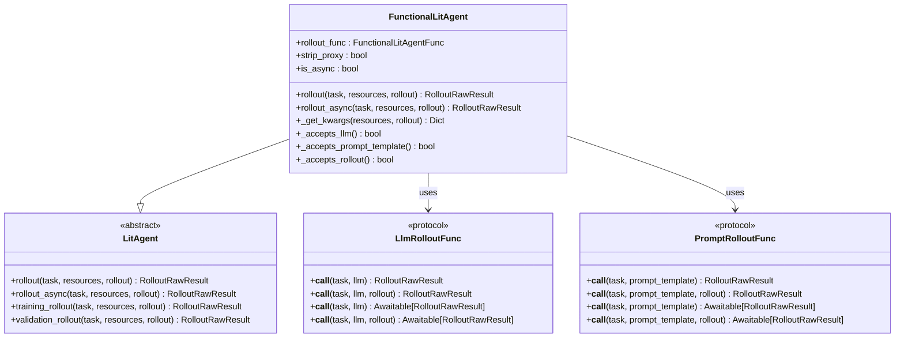
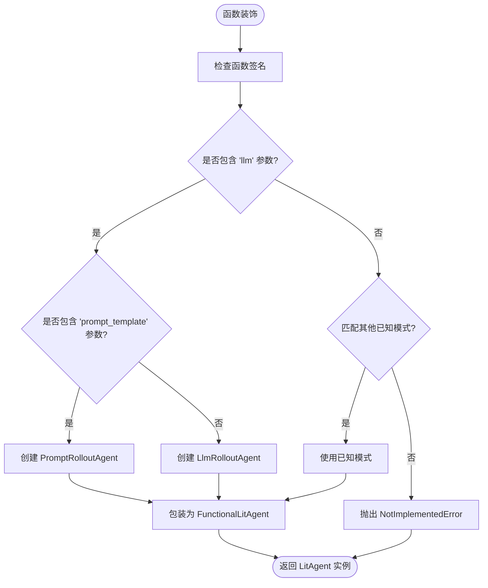
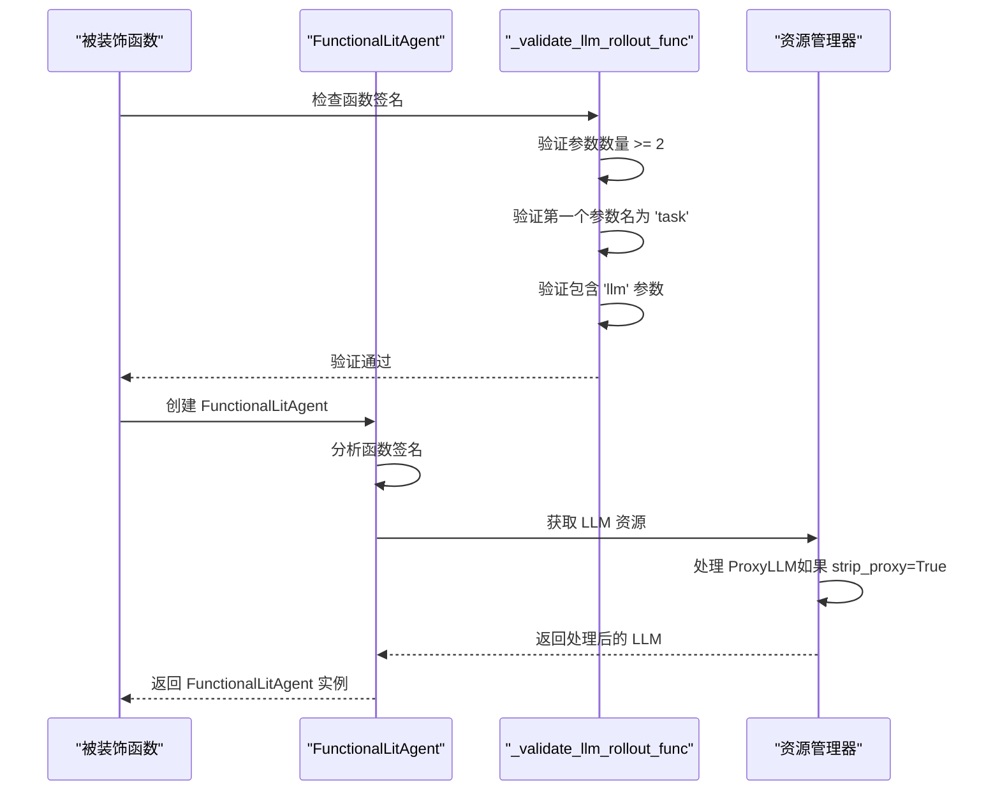
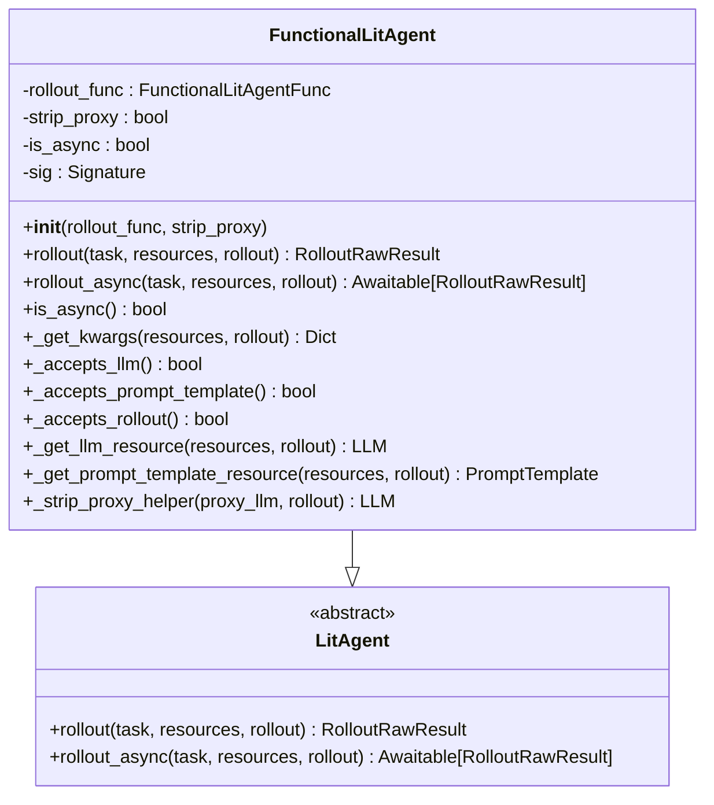
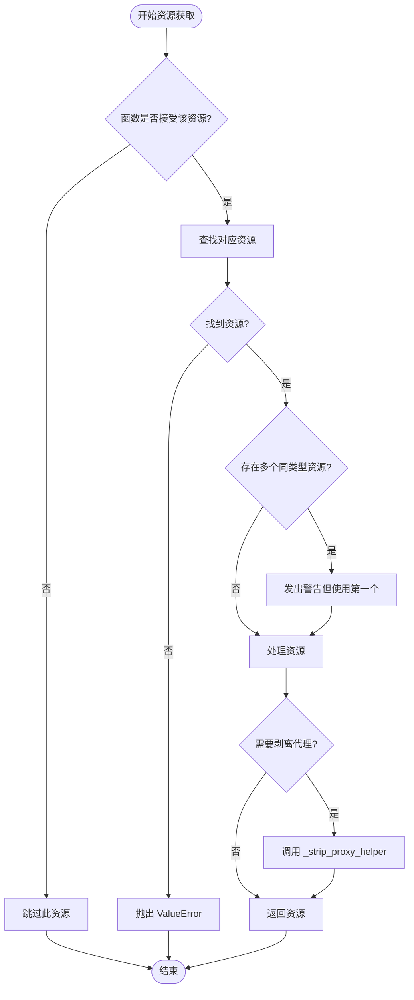
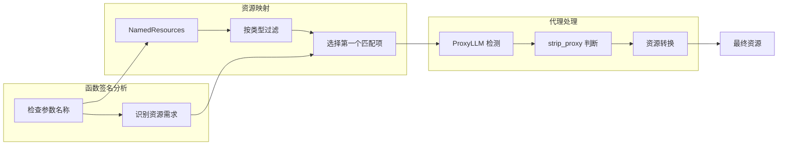
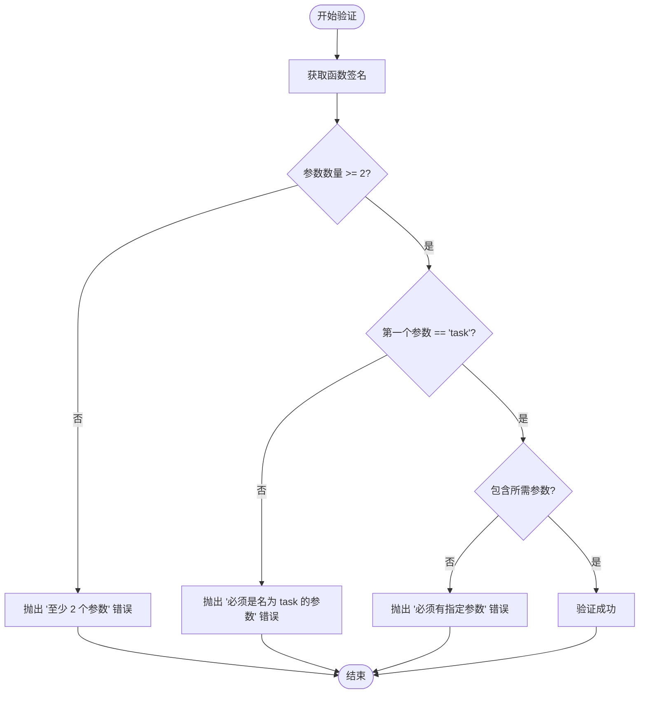

# 装饰器接口参考文档

<cite>
**本文档中引用的文件**
- [agentlightning/litagent/decorator.py](file://agentlightning/litagent/decorator.py)
- [agentlightning/litagent/litagent.py](file://agentlightning/litagent/litagent.py)
- [agentlightning/types/resources.py](file://agentlightning/types/resources.py)
- [agentlightning/algorithm/decorator.py](file://agentlightning/algorithm/decorator.py)
- [tests/litagent/test_decorator.py](file://tests/litagent/test_decorator.py)
- [agentlightning/litagent/__init__.py](file://agentlightning/litagent/__init__.py)
</cite>

## 目录
1. [简介](#简介)
2. [装饰器概览](#装饰器概览)
3. [@rollout 装饰器](#rollout-装饰器)
4. [@llm_rollout 装饰器](#llm_rollout-装饰器)
5. [@prompt_rollout 装饰器](#prompt_rollout-装饰器)
6. [FunctionalLitAgent 类](#functionallitagent-类)
7. [函数签名模式](#函数签名模式)
8. [资源注入机制](#资源注入机制)
9. [验证规则](#验证规则)
10. [常见错误与解决方案](#常见错误与解决方案)
11. [最佳实践](#最佳实践)
12. [总结](#总结)

## 简介

Agent Lightning 提供了一套强大的装饰器系统，用于将普通的 Python 函数转换为功能完整的 `LitAgent` 实例。这些装饰器简化了代理开发流程，允许开发者专注于业务逻辑而无需处理复杂的基础设施。

核心装饰器包括：
- `@rollout` - 通用装饰器，自动检测函数签名并选择合适的代理类型
- `@llm_rollout` - 专门用于 LLM 驱动的代理
- `@prompt_rollout` - 专门用于提示模板驱动的代理

## 装饰器概览



**图表来源**
- [agentlightning/litagent/decorator.py](file://agentlightning/litagent/decorator.py#L100-L150)
- [agentlightning/litagent/litagent.py](file://agentlightning/litagent/litagent.py#L50-L100)

**章节来源**
- [agentlightning/litagent/decorator.py](file://agentlightning/litagent/decorator.py#L1-L50)
- [agentlightning/litagent/__init__.py](file://agentlightning/litagent/__init__.py#L1-L10)

## @rollout 装饰器

### 功能概述

`@rollout` 是最通用的装饰器，它会自动检测函数签名并选择最适合的代理类型。该装饰器支持两种主要模式：LLM 基础代理和提示模板基础代理。

### 参数配置

| 参数 | 类型 | 默认值 | 描述 |
|------|------|--------|------|
| 无参数调用 | - | - | 自动检测函数签名 |
| 函数参数 | `Callable` | 必需 | 要包装的函数 |

### 支持的函数签名

#### LLM 基础签名
```python
# 同步版本
def agent(task: Any, llm: LLM) -> RolloutRawResult: ...
def agent(task: Any, llm: LLM, rollout: Rollout) -> RolloutRawResult: ...

# 异步版本  
async def agent(task: Any, llm: LLM) -> RolloutRawResult: ...
async def agent(task: Any, llm: LLM, rollout: Rollout) -> RolloutRawResult: ...
```

#### 提示模板基础签名
```python
# 同步版本
def agent(task: Any, prompt_template: PromptTemplate) -> RolloutRawResult: ...
def agent(task: Any, prompt_template: PromptTemplate, rollout: Rollout) -> RolloutRawResult: ...

# 异步版本
async def agent(task: Any, prompt_template: PromptTemplate) -> RolloutRawResult: ...
async def agent(task: Any, prompt_template: PromptTemplate, rollout: Rollout) -> RolloutRawResult: ...
```

### 使用示例

```python
# LLM 基础代理示例
@rollout
def llm_based_agent(task, llm):
    """使用 LLM 进行推理的代理"""
    client = OpenAI(base_url=llm.endpoint)
    response = client.chat.completions.create(
        model=llm.model,
        messages=[{"role": "user", "content": task.input}]
    )
    return response

# 提示模板基础代理示例
@rollout
def prompt_based_agent(task, prompt_template):
    """使用提示模板的代理"""
    messages = prompt_template.format(task=task.input)
    # 执行推理逻辑...
    return result
```

### 内部工作原理



**图表来源**
- [agentlightning/litagent/decorator.py](file://agentlightning/litagent/decorator.py#L480-L536)

**章节来源**
- [agentlightning/litagent/decorator.py](file://agentlightning/litagent/decorator.py#L480-L536)

## @llm_rollout 装饰器

### 功能概述

`@llm_rollout` 专门用于创建基于 LLM 的代理。它确保函数接收有效的 LLM 资源，并提供对代理 LLM 的可选支持。

### 参数配置

| 参数 | 类型 | 默认值 | 描述 |
|------|------|--------|------|
| func | `LlmRolloutFunc` | 可选 | 要包装的函数 |
| strip_proxy | `bool` | `True` | 是否将 ProxyLLM 转换为 LLM |

### strip_proxy 参数详解

当 `strip_proxy=True`（默认值）时：
- `ProxyLLM` 资源会被转换为标准的 `LLM` 实例
- 通过 `with_attempted_rollout()` 方法注入尝试元数据
- 适用于需要直接访问 LLM 实例的场景

当 `strip_proxy=False` 时：
- 保持 `ProxyLLM` 原始状态
- 允许访问代理特定的功能
- 适用于需要代理路由能力的场景

### 支持的函数签名

```python
# 基本签名
def agent(task: Any, llm: LLM) -> RolloutRawResult: ...
def agent(task: Any, llm: LLM, rollout: Rollout) -> RolloutRawResult: ...

# 异步版本
async def agent(task: Any, llm: LLM) -> RolloutRawResult: ...
async def agent(task: Any, llm: LLM, rollout: Rollout) -> RolloutRawResult: ...
```

### 使用示例

```python
# 基本用法
@llm_rollout
def basic_llm_agent(task, llm):
    """基本的 LLM 代理"""
    return llm.endpoint

# 禁用代理剥离
@llm_rollout(strip_proxy=False)
def raw_proxy_agent(task, llm):
    """保留原始 ProxyLLM 的代理"""
    return llm.model

# 包含回滚信息的代理
@llm_rollout
def agent_with_rollout_info(task, llm, rollout):
    """包含回滚信息的代理"""
    return f"Task: {task}, Model: {llm.model}, Rollout: {rollout.rollout_id}"
```

### 底层实现机制



**图表来源**
- [agentlightning/litagent/decorator.py](file://agentlightning/litagent/decorator.py#L350-L420)

**章节来源**
- [agentlightning/litagent/decorator.py](file://agentlightning/litagent/decorator.py#L350-L420)

## @prompt_rollout 装饰器

### 功能概述

`@prompt_rollout` 专门用于创建基于提示模板的代理。它确保函数接收有效的提示模板资源，并提供对模板格式化的支持。

### 参数配置

| 参数 | 类型 | 默认值 | 描述 |
|------|------|--------|------|
| func | `PromptRolloutFunc` | 可选 | 要包装的函数 |

### 支持的函数签名

```python
# 基本签名
def agent(task: Any, prompt_template: PromptTemplate) -> RolloutRawResult: ...
def agent(task: Any, prompt_template: PromptTemplate, rollout: Rollout) -> RolloutRawResult: ...

# 异步版本
async def agent(task: Any, prompt_template: PromptTemplate) -> RolloutRawResult: ...
async def agent(task: Any, prompt_template: PromptTemplate, rollout: Rollout) -> RolloutRawResult: ...
```

### 使用示例

```python
# 基本提示模板代理
@prompt_rollout
def simple_prompt_agent(task, prompt_template):
    """简单的提示模板代理"""
    messages = prompt_template.format(task=task.input)
    return messages

# 包含回滚信息的提示模板代理
@prompt_rollout
def prompt_with_context(task, prompt_template, rollout):
    """带有上下文信息的提示模板代理"""
    context = f"Rollout ID: {rollout.rollout_id}"
    formatted_prompt = prompt_template.format(
        task=task.input,
        context=context
    )
    return formatted_prompt
```

### 提示模板引擎支持

当前支持的模板引擎：
- **f-string**: 主要支持的引擎，使用 Python 的字符串格式化
- **jinja**: Jinja2 模板引擎（计划中）
- **poml**: POML 模板语言（计划中）

### 格式化示例

```python
# f-string 引擎示例
template = PromptTemplate(template="用户输入: {task}\n助手回复:", engine="f-string")
messages = template.format(task="你好")  # 输出: "用户输入: 你好\n助手回复:"
```

**章节来源**
- [agentlightning/litagent/decorator.py](file://agentlightning/litagent/decorator.py#L422-L479)

## FunctionalLitAgent 类

### 类概述

`FunctionalLitAgent` 是所有装饰器生成的代理的基础类，它将普通的函数包装成完整的 `LitAgent` 实例。

### 核心特性



**图表来源**
- [agentlightning/litagent/decorator.py](file://agentlightning/litagent/decorator.py#L100-L150)

### 关键方法详解

#### _get_kwargs 方法

动态构建函数调用参数：

```python
def _get_kwargs(self, resources: NamedResources, rollout: Rollout) -> Dict[str, Any]:
    """根据函数签名动态构建参数字典"""
    kwargs = {}
    if self._accepts_rollout():
        kwargs["rollout"] = rollout
    if self._accepts_llm():
        kwargs["llm"] = self._get_llm_resource(resources, rollout)
    if self._accepts_prompt_template():
        kwargs["prompt_template"] = self._get_prompt_template_resource(resources, rollout)
    return kwargs
```

#### 资源获取方法



**图表来源**
- [agentlightning/litagent/decorator.py](file://agentlightning/litagent/decorator.py#L200-L300)

**章节来源**
- [agentlightning/litagent/decorator.py](file://agentlightning/litagent/decorator.py#L100-L300)

## 函数签名模式

### 同步 vs 异步

所有装饰器都支持同步和异步函数：

```python
# 同步函数
@llm_rollout
def sync_agent(task, llm):
    return f"处理任务: {task}"

# 异步函数  
@llm_rollout
async def async_agent(task, llm):
    await asyncio.sleep(0.1)
    return f"异步处理: {task}"
```

### 参数数量变体

#### 2 参数模式（必需）
```python
def agent(task, llm_or_prompt): ...
def agent(task, llm_or_prompt, rollout): ...
```

#### 3 参数模式（可选）
```python
def agent(task, llm_or_prompt, rollout): ...
```

### 返回类型

支持多种返回类型：
- `RolloutRawResult`: 标准返回类型
- `float`: 奖励值
- `List[ReadableSpan]`: OpenTelemetry spans
- `List[Span]`: Agent Lightning spans
- `None`: 当追踪由运行器处理时

**章节来源**
- [agentlightning/litagent/decorator.py](file://agentlightning/litagent/decorator.py#L30-L80)

## 资源注入机制

### 自动资源发现

`FunctionalLitAgent` 通过函数签名自动确定需要哪些资源：



**图表来源**
- [agentlightning/litagent/decorator.py](file://agentlightning/litagent/decorator.py#L250-L350)

### 资源优先级

1. **LLM 资源**: 从 `NamedResources` 中查找第一个 `LLM` 或 `ProxyLLM`
2. **提示模板资源**: 查找第一个 `PromptTemplate`
3. **回滚资源**: 如果函数接受 `rollout` 参数，则注入

### 代理 LLM 处理

当遇到 `ProxyLLM` 且 `strip_proxy=True` 时：

```python
def _strip_proxy_helper(self, proxy_llm: LLM, rollout: Rollout) -> LLM:
    """将 ProxyLLM 转换为带尝试上下文的 LLM"""
    if not isinstance(rollout, AttemptedRollout):
        raise ValueError("Rollout 必须是 AttemptedRollout")
    return proxy_llm.with_attempted_rollout(rollout)
```

**章节来源**
- [agentlightning/litagent/decorator.py](file://agentlightning/litagent/decorator.py#L250-L350)

## 验证规则

### _validate_llm_rollout_func 规则

确保 LLM 代理函数符合规范：

| 验证项目 | 规则 | 错误信息 |
|----------|------|----------|
| 参数数量 | 至少 2 个参数 | "必须至少有 2 个参数" |
| 第一个参数 | 名称为 'task' | "必须是名为 'task' 的位置参数" |
| LLM 参数 | 必须包含 'llm' 参数 | "必须有名为 'llm' 的位置参数" |
| 回滚参数 | 可选，名为 'rollout' | 无限制 |

### _validate_prompt_rollout_func 规则

确保提示模板代理函数符合规范：

| 验证项目 | 规则 | 错误信息 |
|----------|------|----------|
| 参数数量 | 至少 2 个参数 | "必须至少有 2 个参数" |
| 第一个参数 | 名称为 'task' | "必须是名为 'task' 的位置参数" |
| 模板参数 | 必须包含 'prompt_template' 参数 | "必须有名为 'prompt_template' 的位置参数" |
| 回滚参数 | 可选，名为 'rollout' | 无限制 |

### 验证流程图



**图表来源**
- [agentlightning/litagent/decorator.py](file://agentlightning/litagent/decorator.py#L320-L350)

**章节来源**
- [agentlightning/litagent/decorator.py](file://agentlightning/litagent/decorator.py#L320-L350)

## 常见错误与解决方案

### 错误类型 1: 函数签名不匹配

**错误信息**: `"Function {func} must have at least 2 parameters"`

**原因**: 函数参数数量不足

**解决方案**:
```python
# 错误写法
@llm_rollout
def bad_agent():  # 缺少参数
    pass

# 正确写法
@llm_rollout
def good_agent(task, llm):  # 至少两个参数
    pass
```

### 错误类型 2: 参数命名错误

**错误信息**: `"Function {func} must be a positional parameter called 'task'"`

**原因**: 第一个参数不是名为 'task'

**解决方案**:
```python
# 错误写法
@llm_rollout
def bad_agent(input_data, llm):  # 第一个参数名错误
    pass

# 正确写法
@llm_rollout
def good_agent(task, llm):  # 第一个参数名正确
    pass
```

### 错误类型 3: 缺少必需参数

**错误信息**: `"Function {func} must have a positional parameter called 'llm'"`

**原因**: 函数缺少 'llm' 参数

**解决方案**:
```python
# 错误写法
@llm_rollout
def bad_agent(task, model):  # 参数名错误
    pass

# 正确写法
@llm_rollout
def good_agent(task, llm):  # 参数名正确
    pass
```

### 错误类型 4: 不支持的函数签名

**错误信息**: `"Function signature {sig} does not match any known agent patterns"`

**原因**: 函数签名不符合任何已知模式

**解决方案**:
```python
# 错误写法
@rollout
def bad_agent(task, unknown_param):  # 未知参数类型
    pass

# 正确写法
@rollout
def good_agent(task, llm):  # 使用已知参数类型
    pass
```

### 错误类型 5: 资源未找到

**错误信息**: `"No LLM resource found in the provided resources"`

**原因**: 运行时没有提供所需的资源

**解决方案**:
```python
# 确保提供正确的资源
resources = {
    "llm": LLM(endpoint="http://localhost:8080", model="gpt-4")
}
result = agent.rollout(task, resources, rollout)
```

### 错误类型 6: 多个相同类型资源

**警告信息**: `"Multiple LLM resources found in resources. Using the first one"`

**原因**: 提供了多个同类型的资源

**解决方案**:
```python
# 明确指定资源名称
resources = {
    "main_llm": LLM(endpoint="...", model="..."),  # 明确命名
    "backup_llm": LLM(endpoint="...", model="...")  # 备用资源
}
```

**章节来源**
- [tests/litagent/test_decorator.py](file://tests/litagent/test_decorator.py#L480-L559)

## 最佳实践

### 1. 函数设计原则

#### a. 明确的参数命名
```python
# 推荐：清晰的参数命名
@llm_rollout
def agent_with_context(task, llm, rollout):
    """包含上下文信息的代理"""
    return f"任务: {task}, 模型: {llm.model}, 回滚: {rollout.rollout_id}"

# 不推荐：模糊的参数命名
@llm_rollout
def agent(a, b, c):
    """难以理解的参数"""
    pass
```

#### b. 适当的返回类型
```python
# 推荐：明确的返回类型
@llm_rollout
def reward_agent(task, llm):
    """返回奖励值的代理"""
    response = llm.generate(task.input)
    return calculate_reward(response)

# 推荐：返回消息结构
@prompt_rollout
def structured_agent(task, prompt_template):
    """返回结构化消息的代理"""
    messages = prompt_template.format(task=task.input)
    return {"messages": messages, "metadata": {"source": "template"}}
```

### 2. 资源管理最佳实践

#### a. 明确的资源命名
```python
# 推荐：明确的资源命名
resources = {
    "main_llm": LLM(endpoint="...", model="gpt-4"),
    "system_prompt": PromptTemplate(template="...", engine="f-string"),
    "fallback_llm": LLM(endpoint="...", model="gpt-3.5-turbo")
}
```

#### b. 代理 LLM 的使用
```python
# 推荐：使用 strip_proxy=True（默认）
@llm_rollout
def agent(task, llm):
    """使用标准 LLM 实例"""
    return llm.endpoint  # 直接访问 endpoint

# 如果需要代理功能，显式设置 strip_proxy=False
@llm_rollout(strip_proxy=False)
def proxy_agent(task, llm):
    """使用代理 LLM 功能"""
    return llm.get_base_url(rollout.rollout_id, rollout.attempt.attempt_id)
```

### 3. 错误处理

#### a. 输入验证
```python
@llm_rollout
def robust_agent(task, llm):
    """包含输入验证的代理"""
    if not task or not task.input:
        return {"error": "无效的任务输入"}
    
    try:
        response = llm.generate(task.input)
        return {"response": response}
    except Exception as e:
        return {"error": f"处理失败: {str(e)}"}
```

#### b. 资源可用性检查
```python
@rollout
def safe_agent(task, llm, rollout):
    """安全的资源检查代理"""
    if not hasattr(llm, 'model'):
        return {"error": "LLM 资源不完整"}
    
    if not hasattr(rollout, 'rollout_id'):
        return {"warning": "回滚信息不可用"}
    
    return f"模型: {llm.model}, 回滚: {rollout.rollout_id}"
```

### 4. 性能优化

#### a. 异步处理
```python
@llm_rollout
async def async_agent(task, llm):
    """异步处理提升性能"""
    # 并行执行多个请求
    tasks = [llm.generate(item) for item in task.inputs]
    results = await asyncio.gather(*tasks)
    return {"results": results}
```

#### b. 缓存策略
```python
from functools import lru_cache

@llm_rollout
def cached_agent(task, llm):
    """使用缓存提升重复查询性能"""
    @lru_cache(maxsize=128)
    def cached_generate(prompt):
        return llm.generate(prompt)
    
    return cached_generate(task.input)
```

### 5. 测试策略

#### a. 单元测试
```python
def test_llm_agent():
    """测试 LLM 代理的基本功能"""
    @llm_rollout
    def test_agent(task, llm):
        return f"测试: {task}"
    
    # 测试直接调用
    result = test_agent("test", "mock_llm")
    assert "测试" in result
    
    # 测试作为 LitAgent 调用
    resources = {"llm": MockLLM()}
    result = test_agent.rollout("test", resources, MockRollout())
    assert "测试" in result
```

#### b. 集成测试
```python
def test_resource_injection():
    """测试资源注入功能"""
    @llm_rollout
    def test_agent(task, llm, rollout):
        return {"llm_type": type(llm).__name__, "rollout_id": rollout.rollout_id}
    
    resources = {"llm": LLM(endpoint="test", model="test")}
    rollout = MockAttemptedRollout()
    
    result = test_agent("test", llm, rollout)
    assert result["llm_type"] == "LLM"
    assert result["rollout_id"] == rollout.rollout_id
```

## 总结

Agent Lightning 的装饰器系统提供了强大而灵活的代理开发框架：

### 核心优势

1. **零样板代码**: 装饰器自动处理代理基础设施
2. **类型安全**: 完整的类型注解支持
3. **资源管理**: 自动注入 LLM 和提示模板资源
4. **灵活性**: 支持同步和异步函数
5. **验证保障**: 严格的函数签名验证

### 选择指南

- **@rollout**: 通用选择，自动检测函数类型
- **@llm_rollout**: 明确需要 LLM 资源的场景
- **@prompt_rollout**: 专门处理提示模板的场景

### 开发建议

1. 始终使用明确的参数命名
2. 根据需要选择合适的异步模式
3. 实现适当的错误处理和输入验证
4. 利用资源注入机制简化开发
5. 遵循最佳实践进行测试和性能优化

通过合理使用这些装饰器，开发者可以快速构建功能完整、性能优异的智能代理，专注于业务逻辑的实现而非基础设施的搭建。