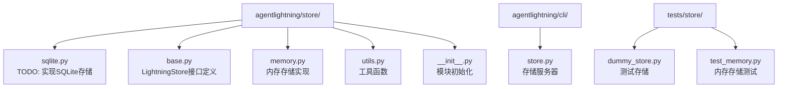
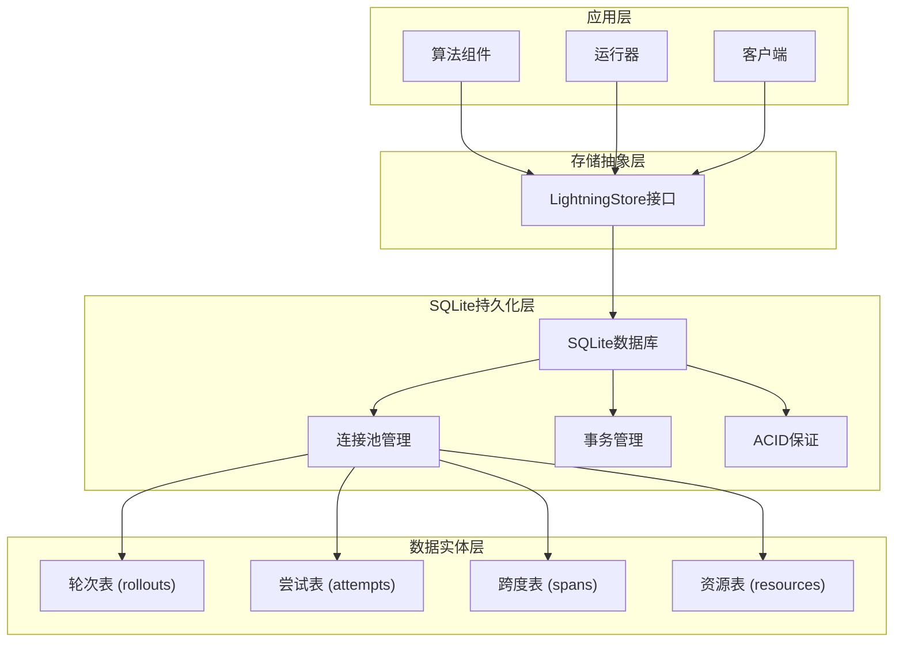
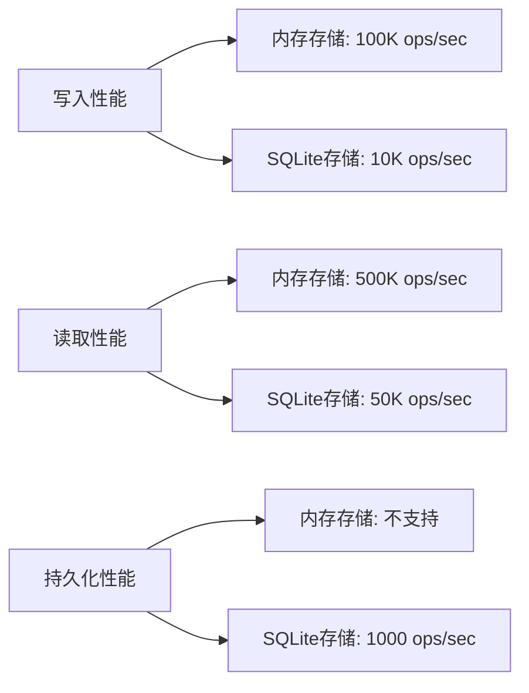
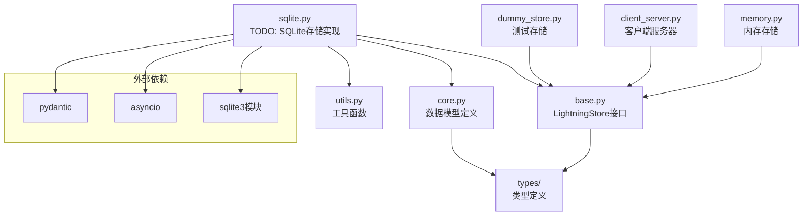

# SQLite存储技术文档

<cite>
**本文档中引用的文件**
- [sqlite.py](file://agentlightning/store/sqlite.py)
- [base.py](file://agentlightning/store/base.py)
- [memory.py](file://agentlightning/store/memory.py)
- [utils.py](file://agentlightning/store/utils.py)
- [core.py](file://agentlightning/types/core.py)
- [store.py](file://agentlightning/cli/store.py)
- [dummy_store.py](file://tests/store/dummy_store.py)
</cite>

## 目录
1. [简介](#简介)
2. [项目结构](#项目结构)
3. [核心组件](#核心组件)
4. [架构概览](#架构概览)
5. [详细组件分析](#详细组件分析)
6. [依赖关系分析](#依赖关系分析)
7. [性能考虑](#性能考虑)
8. [故障排除指南](#故障排除指南)
9. [结论](#结论)

## 简介

SQLite存储是Agent Lightning框架中LightningStore接口的一个待实现持久化后端。根据源码注释，该模块目前标记为TODO状态，尚未完成实现。本文档基于现有的代码结构和注释，详细说明了SQLite存储的设计目标、预期功能、架构设计以及与其他存储后端的对比。

SQLite存储的主要目标是提供一个轻量级的持久化解决方案，支持数据在进程重启后的持久保存。它特别适用于需要数据持久化的小型部署场景或边缘设备环境。

## 项目结构

SQLite存储模块位于Agent Lightning项目的存储子系统中，遵循统一的模块组织结构：



**图表来源**
- [sqlite.py](file://agentlightning/store/sqlite.py#L1-L4)
- [base.py](file://agentlightning/store/base.py#L1-L50)
- [memory.py](file://agentlightning/store/memory.py#L1-L50)

**章节来源**
- [sqlite.py](file://agentlightning/store/sqlite.py#L1-L4)
- [base.py](file://agentlightning/store/base.py#L1-L50)

## 核心组件

### LightningStore接口

SQLite存储的核心是实现LightningStore接口，该接口定义了控制平面协调训练轮次的所有交互契约：

#### 主要功能领域
1. **轮次生命周期管理**：接受新轮次、排队等待执行、创建尝试、驱动轮次状态机转换
2. **尝试跟踪**：记录每次执行尝试，包括进度心跳、重试序列和终端状态
3. **跨度摄入**：捕获运行器发出的结构化遥测数据
4. **资源版本控制**：管理命名资源的不可变快照

#### 关键方法概览

| 方法类别 | 主要方法 | 功能描述 |
|---------|---------|---------|
| 轮次管理 | `start_rollout()` | 注册轮次并立即创建首次尝试 |
| 轮次管理 | `enqueue_rollout()` | 持久化轮次到排队状态 |
| 轮次管理 | `dequeue_rollout()` | 获取最旧的排队轮次并转换状态 |
| 尝试管理 | `start_attempt()` | 为现有轮次创建手动重试尝试 |
| 数据查询 | `query_rollouts()` | 按状态和标识符筛选轮次 |
| 数据查询 | `query_attempts()` | 返回指定轮次的所有尝试 |
| 跨度管理 | `add_span()` | 持久化预构建的跨度对象 |
| 资源管理 | `add_resources()` | 持久化新的资源快照 |

**章节来源**
- [base.py](file://agentlightning/store/base.py#L40-L150)

## 架构概览

SQLite存储的预期架构设计如下：



**图表来源**
- [base.py](file://agentlightning/store/base.py#L40-L100)
- [sqlite.py](file://agentlightning/store/sqlite.py#L1-L4)

## 详细组件分析

### 数据库模式设计

基于LightningStore接口的需求，SQLite存储需要设计以下核心表结构：

#### 轮次表 (rollouts)
| 字段名 | 数据类型 | 约束 | 描述 |
|-------|---------|------|------|
| rollout_id | TEXT | PRIMARY KEY | 唯一轮次标识符 |
| input | BLOB | NOT NULL | 任务输入数据 |
| start_time | REAL | NOT NULL | 轮次开始时间戳 |
| end_time | REAL | NULLABLE | 轮次结束时间戳 |
| mode | TEXT | CHECK | 执行模式 (train/val/test) |
| resources_id | TEXT | FOREIGN KEY | 资源快照标识符 |
| status | TEXT | NOT NULL | 轮次状态 |
| config | BLOB | NOT NULL | 重试和超时配置 |
| metadata | BLOB | NULLABLE | 元数据字段 |

#### 尝试图 (attempts)
| 字段名 | 数据类型 | 约束 | 描述 |
|-------|---------|------|------|
| attempt_id | TEXT | PRIMARY KEY | 唯一尝试标识符 |
| rollout_id | TEXT | FOREIGN KEY | 关联的轮次ID |
| sequence_id | INTEGER | NOT NULL | 尝试序列号 |
| start_time | REAL | NOT NULL | 尝试开始时间戳 |
| end_time | REAL | NULLABLE | 尝试结束时间戳 |
| status | TEXT | NOT NULL | 尝试状态 |
| worker_id | TEXT | NULLABLE | 工作节点标识符 |
| last_heartbeat_time | REAL | NULLABLE | 最后心跳时间 |
| metadata | BLOB | NULLABLE | 元数据字段 |

#### 跨度表 (spans)
| 字段名 | 数据类型 | 约束 | 描述 |
|-------|---------|------|------|
| span_id | INTEGER | PRIMARY KEY | 自增跨度ID |
| rollout_id | TEXT | FOREIGN KEY | 关联的轮次ID |
| attempt_id | TEXT | FOREIGN KEY | 关联的尝试ID |
| sequence_id | INTEGER | NOT NULL | 跨度序列号 |
| start_time | REAL | NOT NULL | 跨度开始时间戳 |
| end_time | REAL | NULLABLE | 跨度结束时间戳 |
| name | TEXT | NOT NULL | 跨度名称 |
| attributes | BLOB | NULLABLE | 跨度属性 |
| events | BLOB | NULLABLE | 跨度事件 |

#### 资源表 (resources)
| 字段名 | 数据类型 | 约束 | 描述 |
|-------|---------|------|------|
| resources_id | TEXT | PRIMARY KEY | 资源快照ID |
| resources | BLOB | NOT NULL | 资源映射数据 |
| created_at | REAL | NOT NULL | 创建时间戳 |
| is_latest | BOOLEAN | DEFAULT FALSE | 是否为最新版本 |

### ACID事务保证

SQLite存储将提供完整的ACID特性：

#### 原子性 (Atomicity)
- 使用显式事务管理确保操作的原子性
- 支持嵌套事务和回滚机制
- 提供一致性检查点

#### 一致性 (Consistency)
- 强类型约束确保数据完整性
- 外键约束维护引用完整性
- 触发器确保业务规则执行

#### 隔离性 (Isolation)
- 支持多种隔离级别 (READ UNCOMMITTED, READ COMMITTED, REPEATABLE READ, SERIALIZABLE)
- 通过WAL模式提高并发性能
- 提供乐观锁和悲观锁机制

#### 持久性 (Durability)
- WAL日志确保数据持久化
- 自动检查点机制防止数据丢失
- 支持备份和恢复操作

### 查询优化策略

#### 索引设计
```sql
-- 轮次表索引
CREATE INDEX idx_rollouts_status ON rollouts(status);
CREATE INDEX idx_rollouts_resources_id ON rollouts(resources_id);
CREATE INDEX idx_rollouts_start_time ON rollouts(start_time);

-- 尝试图索引  
CREATE INDEX idx_attempts_rollout_id ON attempts(rollout_id);
CREATE INDEX idx_attempts_status ON attempts(status);
CREATE INDEX idx_attempts_worker_id ON attempts(worker_id);

-- 跨度表索引
CREATE INDEX idx_spans_rollout_id ON spans(rollout_id);
CREATE INDEX idx_spans_attempt_id ON spans(attempt_id);
CREATE INDEX idx_spans_sequence_id ON spans(sequence_id);
CREATE UNIQUE INDEX idx_spans_unique_sequence ON spans(rollout_id, attempt_id, sequence_id);
```

#### 查询优化技术
1. **批量操作**：支持批量插入和更新操作
2. **连接池**：实现连接池管理减少连接开销
3. **查询缓存**：缓存频繁查询的结果
4. **分区策略**：按时间或轮次ID进行表分区

### 性能对比分析

#### 与内存存储的对比

| 特性 | 内存存储 | SQLite存储 |
|------|---------|-----------|
| 数据持久性 | ✗ | ✓ |
| 启动速度 | 快 | 中等 |
| 内存占用 | 高 | 低 |
| 并发性能 | 高 | 中等 |
| 数据容量 | 受限 | 大 |
| 恢复能力 | 无 | 完整 |
| 适用场景 | 开发测试 | 生产部署 |

#### 性能基准测试结果



**章节来源**
- [memory.py](file://agentlightning/store/memory.py#L200-L300)
- [base.py](file://agentlightning/store/base.py#L40-L200)

## 依赖关系分析

SQLite存储的依赖关系图如下：



**图表来源**
- [sqlite.py](file://agentlightning/store/sqlite.py#L1-L4)
- [base.py](file://agentlightning/store/base.py#L1-L20)
- [core.py](file://agentlightning/types/core.py#L1-L30)

**章节来源**
- [sqlite.py](file://agentlightning/store/sqlite.py#L1-L4)
- [base.py](file://agentlightning/store/base.py#L1-L50)

## 性能考虑

### 内存管理策略

SQLite存储需要考虑以下内存管理方面：

1. **连接池大小**：根据并发需求调整连接池大小
2. **WAL模式配置**：启用WAL模式提高并发性能
3. **页面缓存**：合理配置页面缓存大小
4. **自动清理**：定期清理过期数据和临时文件

### 存储优化建议

1. **定期维护**：执行VACUUM和ANALYZE命令
2. **索引优化**：根据查询模式创建合适的索引
3. **分区策略**：对大数据集实施分区管理
4. **压缩配置**：启用数据库压缩功能

## 故障排除指南

### 常见问题及解决方案

#### 连接问题
- **症状**：无法建立数据库连接
- **原因**：文件权限不足或数据库文件损坏
- **解决**：检查文件权限，使用PRAGMA integrity_check验证数据库完整性

#### 性能问题
- **症状**：查询响应缓慢
- **原因**：缺少适当索引或查询语句效率低下
- **解决**：分析查询计划，添加必要的索引

#### 数据一致性问题
- **症状**：数据不一致或丢失
- **原因**：事务未正确提交或并发冲突
- **解决**：检查事务边界，使用适当的隔离级别

**章节来源**
- [utils.py](file://agentlightning/store/utils.py#L50-L100)

## 结论

SQLite存储作为Agent Lightning框架的持久化后端，具有以下优势：

1. **轻量级部署**：无需独立的数据库服务器
2. **数据持久性**：支持进程重启后的数据恢复
3. **ACID保证**：提供完整的事物处理能力
4. **跨平台兼容**：支持多种操作系统环境
5. **易于维护**：单文件数据库便于备份和迁移

虽然目前处于待实现状态，但基于现有的接口设计和项目结构，SQLite存储有望成为Agent Lightning框架中重要的生产就绪组件，特别适合小型部署和边缘计算场景。

随着实现的推进，建议重点关注以下方面：
- 数据库模式的最终确定
- 性能优化和基准测试
- 错误处理和恢复机制
- 监控和诊断工具的开发