# 共享内存执行策略深度技术文档

<cite>
**本文档引用的文件**
- [shared_memory.py](file://agentlightning/execution/shared_memory.py)
- [threading.py](file://agentlightning/store/threading.py)
- [base.py](file://agentlightning/execution/base.py)
- [events.py](file://agentlightning/execution/events.py)
- [store/base.py](file://agentlightning/store/base.py)
- [test_shared_memory.py](file://tests/execution/test_shared_memory.py)
- [registry.py](file://agentlightning/trainer/registry.py)
</cite>

## 目录
1. [简介](#简介)
2. [设计理念与架构概述](#设计理念与架构概述)
3. [核心组件分析](#核心组件分析)
4. [执行流程详解](#执行流程详解)
5. [关键方法深度解析](#关键方法深度解析)
6. [线程安全机制](#线程安全机制)
7. [配置参数与最佳实践](#配置参数与最佳实践)
8. [性能特征与适用场景](#性能特征与适用场景)
9. [故障排除指南](#故障排除指南)
10. [总结](#总结)

## 简介

SharedMemoryExecutionStrategy是Agent Lightning框架中的核心执行策略，它在单个进程中使用协作式工作线程来执行算法和运行器。该策略通过共享内存和线程间通信实现了高效的单机多核资源利用，特别适用于需要紧密协作的训练场景。

该策略的核心优势在于：
- **低延迟通信**：所有组件运行在同一进程内，避免了进程间通信开销
- **协作式停止机制**：通过全局事件系统实现优雅的资源清理
- **灵活的执行模式**：支持算法线程和运行器线程的不同角色分配
- **线程安全保障**：内置线程安全包装器确保数据一致性

## 设计理念与架构概述

### 整体架构设计

SharedMemoryExecutionStrategy采用主从架构模式，在单个进程中协调多个工作线程：

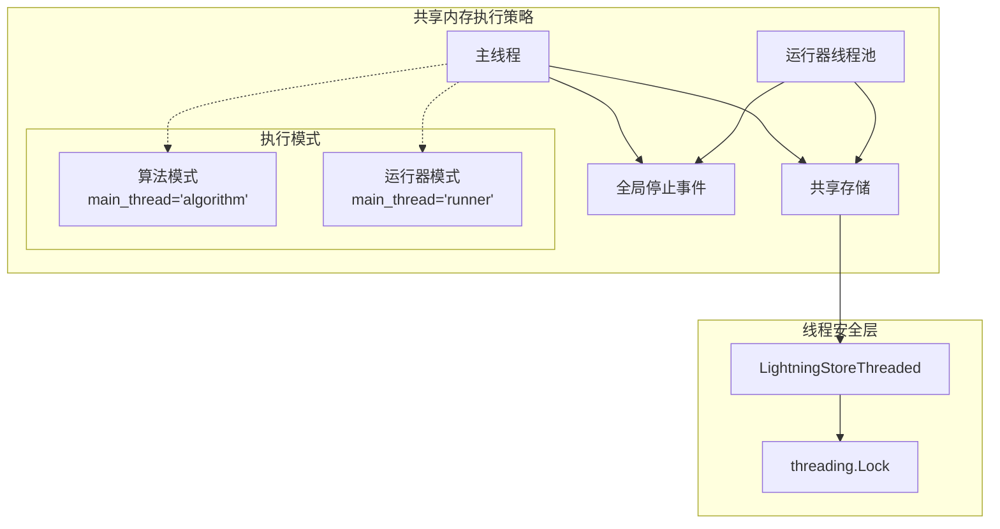

**图表来源**
- [shared_memory.py](file://agentlightning/execution/shared_memory.py#L18-L280)
- [threading.py](file://agentlightning/store/threading.py#L20-L174)

### 停止模型设计

该策略实现了优雅的停止机制，通过全局停止事件实现协调式关闭：

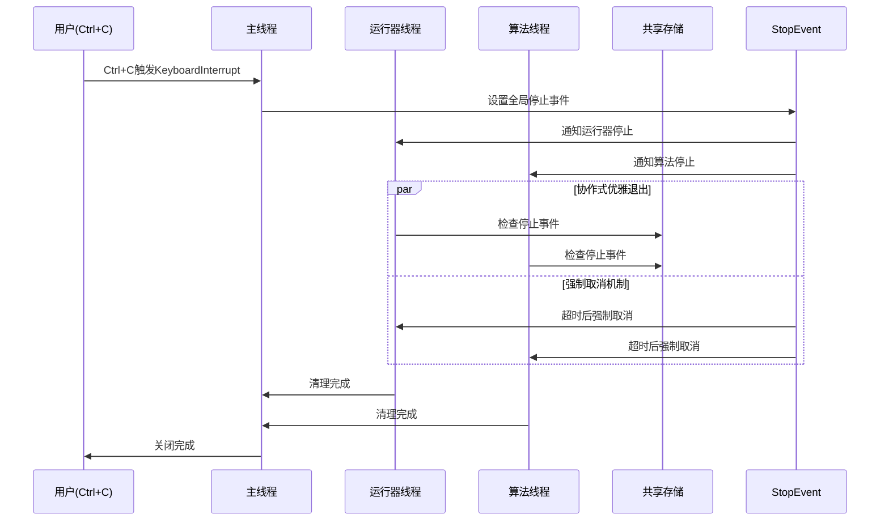

**图表来源**
- [shared_memory.py](file://agentlightning/execution/shared_memory.py#L25-L45)
- [events.py](file://agentlightning/execution/events.py#L15-L69)

**章节来源**
- [shared_memory.py](file://agentlightning/execution/shared_memory.py#L18-L45)
- [events.py](file://agentlightning/execution/events.py#L15-L69)

## 核心组件分析

### ThreadingEvent - 全局停止信号

ThreadingEvent是整个执行策略的核心同步原语，它提供了线程安全的事件通知机制：

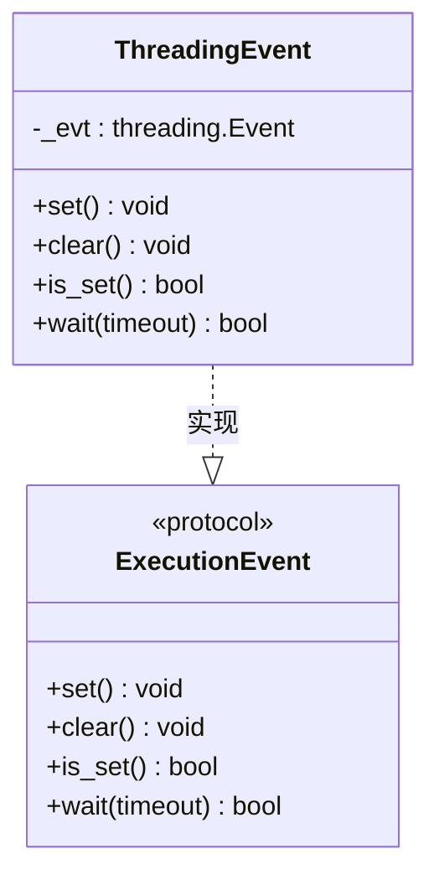

**图表来源**
- [events.py](file://agentlightning/execution/events.py#L35-L69)

ThreadingEvent的关键特性：
- **线程安全**：基于Python标准库的threading.Event
- **协作式停止**：通过检查事件状态实现优雅退出
- **非阻塞等待**：支持超时机制避免无限等待
- **幂等操作**：set()和clear()操作具有幂等性

### LightningStoreThreaded - 线程安全存储包装器

当`managed_store=True`时，系统会自动包装底层存储以提供线程安全访问：

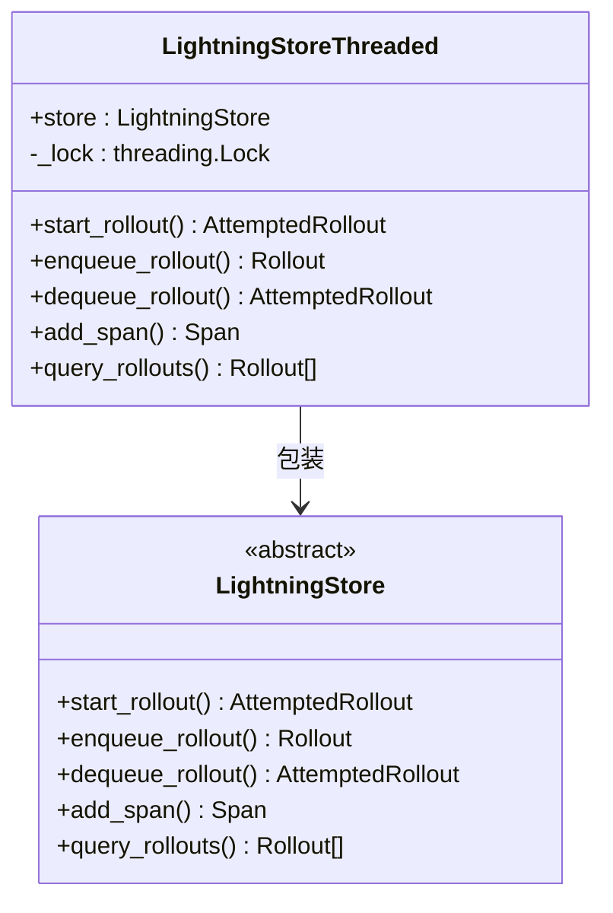

**图表来源**
- [threading.py](file://agentlightning/store/threading.py#L20-L174)
- [store/base.py](file://agentlightning/store/base.py#L60-L516)

**章节来源**
- [events.py](file://agentlightning/execution/events.py#L35-L69)
- [threading.py](file://agentlightning/store/threading.py#L20-L174)

## 执行流程详解

### 两种执行模式

SharedMemoryExecutionStrategy支持两种主要的执行模式，每种模式都有不同的线程角色分配：

#### 算法模式 (main_thread='algorithm')

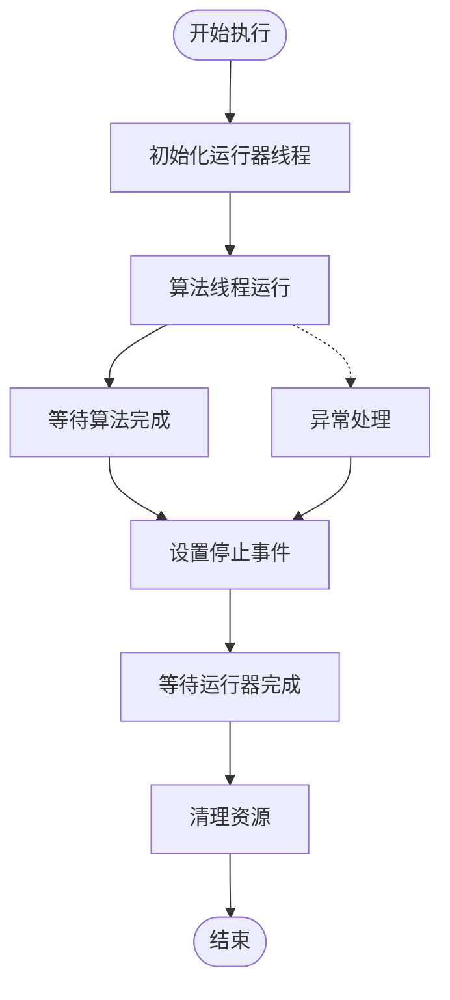

**图表来源**
- [shared_memory.py](file://agentlightning/execution/shared_memory.py#L213-L235)

#### 运行器模式 (main_thread='runner')

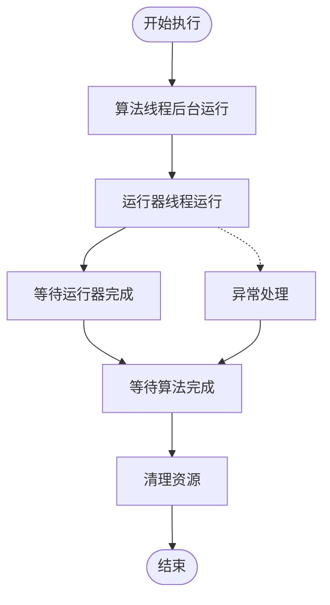

**图表来源**
- [shared_memory.py](file://agentlightning/execution/shared_memory.py#L237-L255)

### 键盘中断处理机制

系统通过捕获KeyboardInterrupt实现优雅的用户中断：

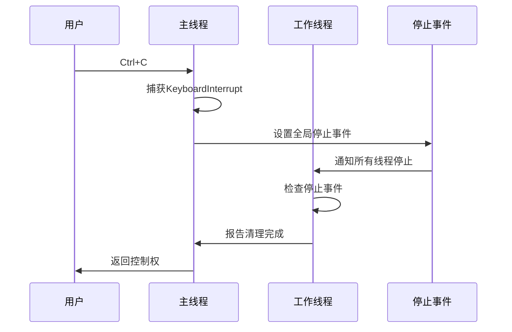

**图表来源**
- [shared_memory.py](file://agentlightning/execution/shared_memory.py#L265-L275)

**章节来源**
- [shared_memory.py](file://agentlightning/execution/shared_memory.py#L213-L275)

## 关键方法深度解析

### _run_until_completed_or_canceled 方法

这是整个执行策略的核心方法，实现了优雅的超时和取消机制：

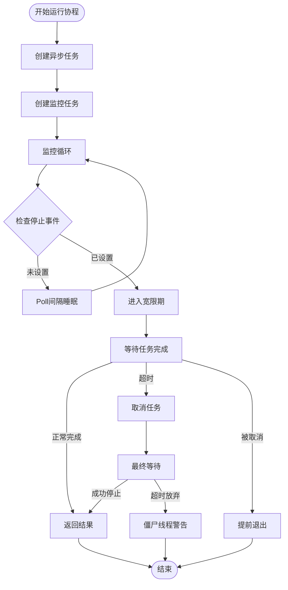

**图表来源**
- [shared_memory.py](file://agentlightning/execution/shared_memory.py#L67-L145)

#### 方法执行逻辑详解

1. **任务创建阶段**：使用`asyncio.create_task()`启动目标协程
2. **监控任务启动**：创建独立的监控任务轮询停止事件
3. **协作式退出**：当停止事件被设置时，给予宽限期让任务自然完成
4. **强制取消机制**：宽限期结束后强制取消任务
5. **最终清理**：确保任务完全停止或记录僵尸线程警告

### _run_algorithm 和 _run_runner 方法

这两个方法分别负责算法和运行器的执行，它们共享相同的错误处理和停止机制：

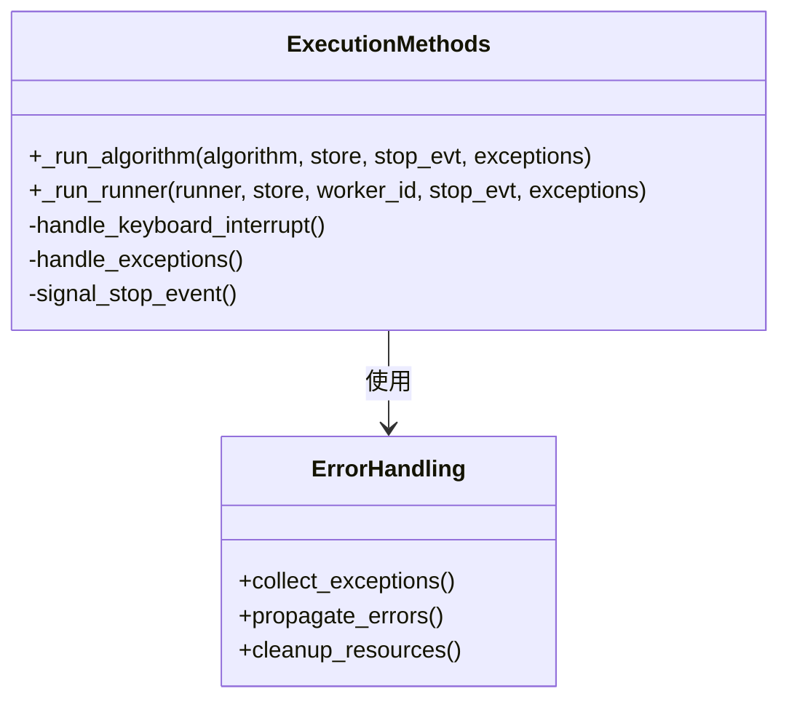

**图表来源**
- [shared_memory.py](file://agentlightning/execution/shared_memory.py#L147-L195)

**章节来源**
- [shared_memory.py](file://agentlightning/execution/shared_memory.py#L67-L195)

## 线程安全机制

### LightningStoreThreaded 实现原理

当`managed_store=True`时，系统自动应用线程安全包装器：

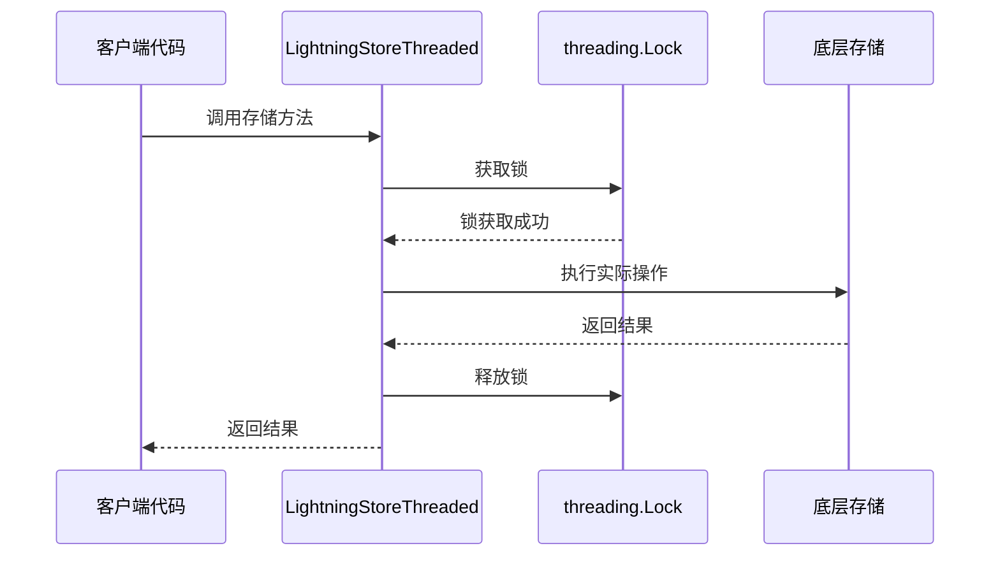

**图表来源**
- [threading.py](file://agentlightning/store/threading.py#L30-L174)

### 线程安全保证

LightningStoreThreaded通过以下机制确保线程安全：

1. **互斥锁保护**：每个存储操作都包含在锁保护块中
2. **原子性操作**：确保复合操作的原子性
3. **死锁预防**：避免嵌套锁和复杂的锁依赖关系
4. **异常安全**：即使发生异常也能正确释放锁

### 线程生命周期管理

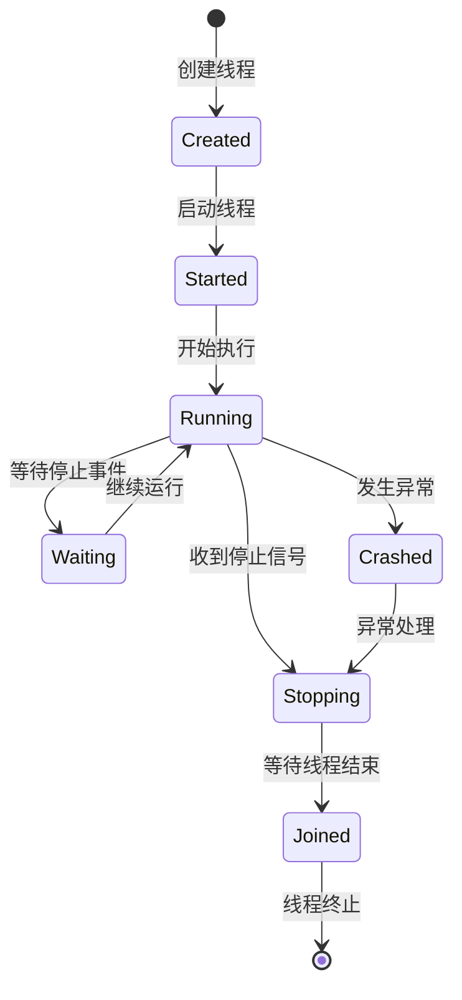

**图表来源**
- [shared_memory.py](file://agentlightning/execution/shared_memory.py#L255-L280)

**章节来源**
- [threading.py](file://agentlightning/store/threading.py#L20-L174)
- [shared_memory.py](file://agentlightning/execution/shared_memory.py#L255-L280)

## 配置参数与最佳实践

### 核心配置参数

| 参数名 | 类型 | 默认值 | 描述 | 最佳实践 |
|--------|------|--------|------|----------|
| `n_runners` | int | 1 | 运行器线程数量 | 根据CPU核心数设置，通常为CPU核心数 |
| `main_thread` | str | "runner" | 主线程执行的角色 | 算法密集型选择"algorithm"，运行器密集型选择"runner" |
| `join_timeout` | float | 15.0 | 线程连接超时时间(秒) | 根据任务复杂度调整，复杂任务可增加到30秒 |
| `graceful_delay` | float | 5.0 | 优雅关闭延迟时间(秒) | 根据清理需求调整，通常为2-10秒 |
| `poll_interval` | float | 0.05 | 事件轮询间隔(秒) | 较短间隔提高响应性，但增加CPU使用 |
| `managed_store` | bool \| None | None | 是否启用线程安全存储 | 生产环境建议启用，开发环境可禁用 |

### 环境变量配置

系统支持通过环境变量配置`managed_store`行为：

```bash
# 启用线程安全存储（默认）
export AGL_MANAGED_STORE=true

# 禁用线程安全存储
export AGL_MANAGED_STORE=false

# 其他支持的值
export AGL_MANAGED_STORE=1    # 启用
export AGL_MANAGED_STORE=yes  # 启用
export AGL_MANAGED_STORE=on   # 启用
export AGL_MANAGED_STORE=0    # 禁用
export AGL_MANAGED_STORE=no   # 禁用
export AGL_MANAGED_STORE=off  # 禁用
```

### 性能调优建议

#### CPU密集型算法
```python
strategy = SharedMemoryExecutionStrategy(
    n_runners=cpu_cores,           # 与CPU核心数匹配
    main_thread="algorithm",       # 算法在主线程执行
    graceful_delay=2.0,           # 较短的优雅延迟
    join_timeout=10.0             # 较短的连接超时
)
```

#### IO密集型运行器
```python
strategy = SharedMemoryExecutionStrategy(
    n_runners=cpu_cores * 2,      # 允许更多并发运行器
    main_thread="runner",         # 运行器在主线程执行
    graceful_delay=8.0,          # 较长的优雅延迟
    join_timeout=20.0            # 较长的连接超时
)
```

#### 内存受限环境
```python
strategy = SharedMemoryExecutionStrategy(
    n_runners=1,                  # 减少并发线程
    managed_store=False,         # 禁用线程安全包装
    graceful_delay=1.0,          # 最小化优雅延迟
    join_timeout=5.0             # 最小化连接超时
)
```

**章节来源**
- [shared_memory.py](file://agentlightning/execution/shared_memory.py#L47-L65)
- [base.py](file://agentlightning/execution/base.py#L18-L45)

## 性能特征与适用场景

### 性能特征分析

#### 优势特性

1. **零进程间通信开销**：所有组件运行在同一地址空间
2. **快速事件通知**：基于Python事件系统的低延迟通知
3. **内存共享效率**：无需序列化/反序列化数据
4. **细粒度控制**：精确的超时和取消机制

#### 性能指标

| 指标 | 数值 | 说明 |
|------|------|------|
| 启动延迟 | < 100ms | 从策略创建到开始执行 |
| 事件通知延迟 | < 1ms | 停止事件传播到所有线程 |
| 内存使用 | 基础+线程栈 | 每线程约2MB栈空间 |
| CPU开销 | 低 | 主要来自事件轮询和GIL竞争 |

### 适用场景

#### 理想应用场景

1. **单机多核训练**：充分利用本地CPU资源
2. **实时交互系统**：需要低延迟响应的场景
3. **内存敏感应用**：避免进程间数据复制开销
4. **开发调试环境**：简化部署和调试过程

#### 不适用场景

1. **分布式训练**：需要跨节点通信的场景
2. **高可用要求**：单点故障风险较高
3. **资源隔离严格**：需要强隔离的生产环境
4. **大规模集群**：不适合大规模分布式部署

### 架构对比

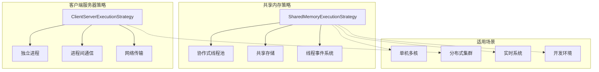

**图表来源**
- [shared_memory.py](file://agentlightning/execution/shared_memory.py#L18-L45)
- [registry.py](file://agentlightning/trainer/registry.py#L8-L11)

**章节来源**
- [shared_memory.py](file://agentlightning/execution/shared_memory.py#L18-L45)
- [registry.py](file://agentlightning/trainer/registry.py#L8-L11)

## 故障排除指南

### 常见问题与解决方案

#### 问题1：线程无法正常停止

**症状**：程序在Ctrl+C后仍然hang住
**原因**：任务没有定期检查停止事件
**解决方案**：
```python
# 在算法和运行器中添加事件检查
while not stop_event.is_set():
    # 执行工作
    await asyncio.sleep(0.01)  # 确保定期检查
```

#### 问题2：内存泄漏

**症状**：长时间运行后内存持续增长
**原因**：未正确清理资源或存在循环引用
**解决方案**：
```python
# 确保正确清理资源
try:
    # 主要业务逻辑
    await algorithm(store, stop_event)
finally:
    # 清理资源
    cleanup_resources()
```

#### 问题3：线程安全问题

**症状**：数据不一致或竞态条件
**原因**：直接使用底层存储而未启用线程安全
**解决方案**：
```python
# 启用线程安全存储
strategy = SharedMemoryExecutionStrategy(
    managed_store=True  # 自动包装线程安全
)
```

### 调试技巧

#### 启用详细日志
```python
import logging
logging.getLogger('agentlightning.execution.shared_memory').setLevel(logging.DEBUG)
```

#### 监控线程状态
```python
# 检查线程是否正常运行
for thread in threads:
    if not thread.is_alive():
        print(f"线程 {thread.name} 已停止")
```

#### 性能分析
```python
import time
start_time = time.time()
# 执行操作
elapsed = time.time() - start_time
print(f"操作耗时: {elapsed:.3f}秒")
```

**章节来源**
- [test_shared_memory.py](file://tests/execution/test_shared_memory.py#L145-L280)
- [shared_memory.py](file://agentlightning/execution/shared_memory.py#L265-L280)

## 总结

SharedMemoryExecutionStrategy代表了Agent Lightning框架中高度优化的单机执行解决方案。通过精心设计的协作式线程模型、优雅的停止机制和完善的线程安全保障，它为算法训练和运行器执行提供了高性能、可靠性的执行环境。

### 核心优势

1. **高性能执行**：零进程间通信开销，充分利用本地资源
2. **优雅关闭**：协作式停止机制确保资源正确清理
3. **线程安全**：自动化的线程安全包装器
4. **灵活配置**：丰富的配置选项适应不同场景需求

### 最佳实践要点

- 根据任务类型选择合适的执行模式
- 正确配置超时参数避免资源浪费
- 在算法中定期检查停止事件
- 启用线程安全存储确保数据一致性
- 合理设置线程数量避免过度竞争

该策略特别适合单机多核环境下的算法训练场景，为开发者提供了一个既强大又易用的执行平台。通过深入理解其设计原理和使用方法，可以充分发挥其性能优势，构建高效可靠的训练系统。