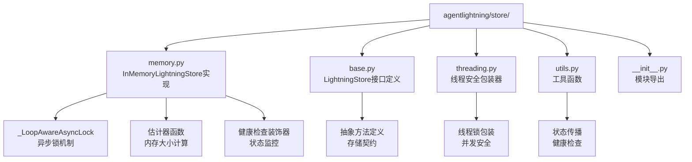
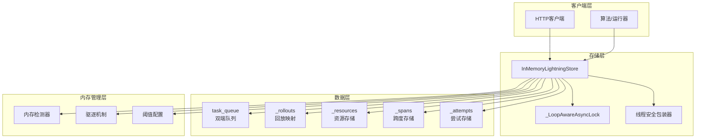
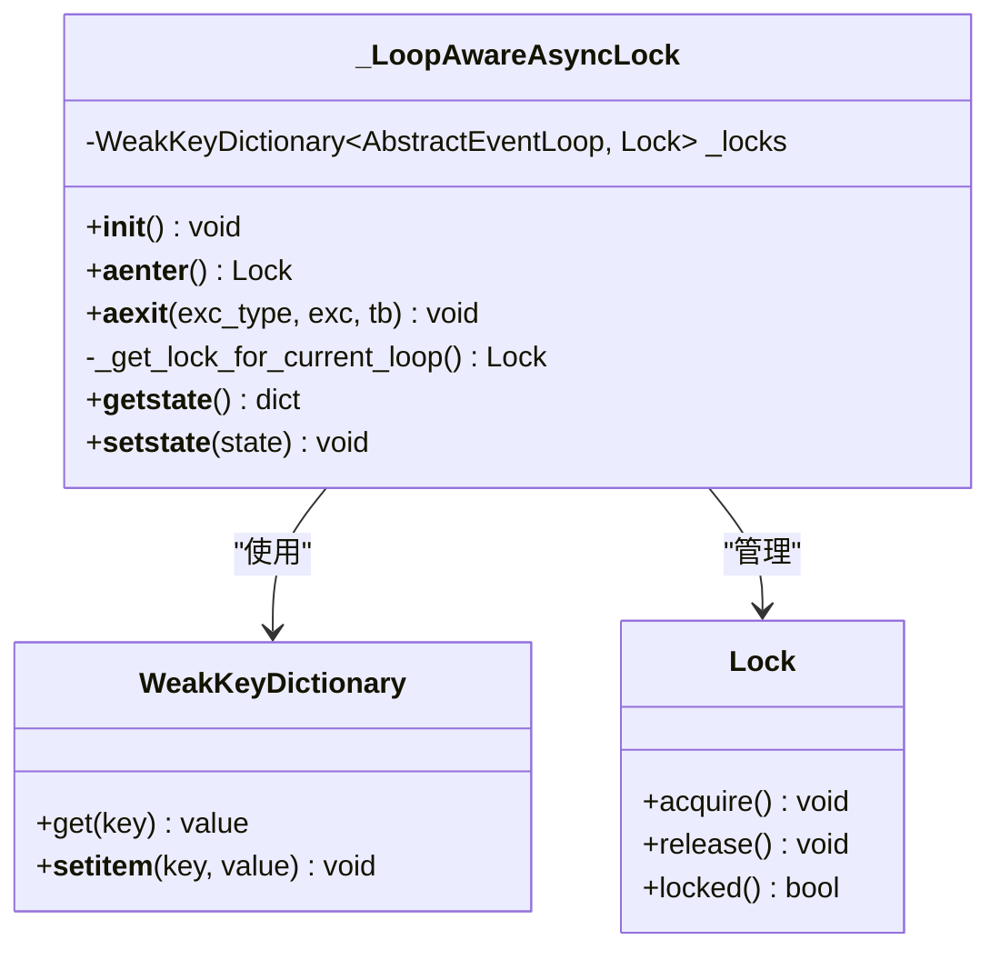
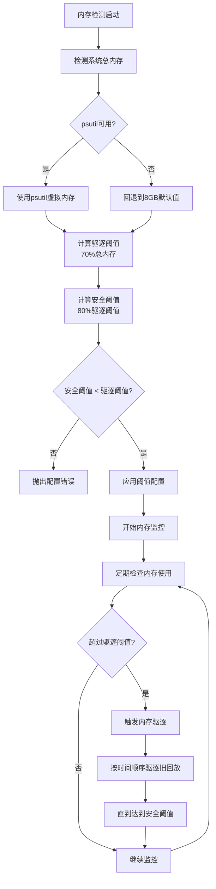
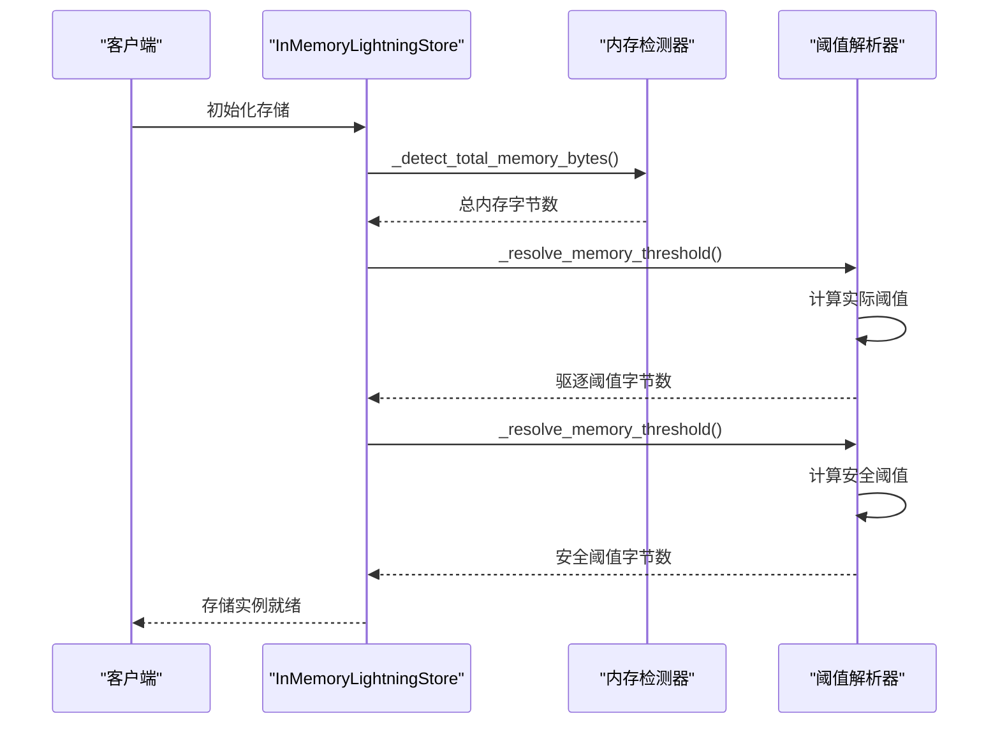
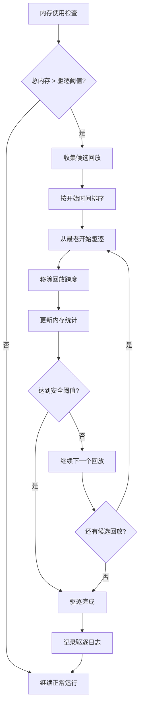
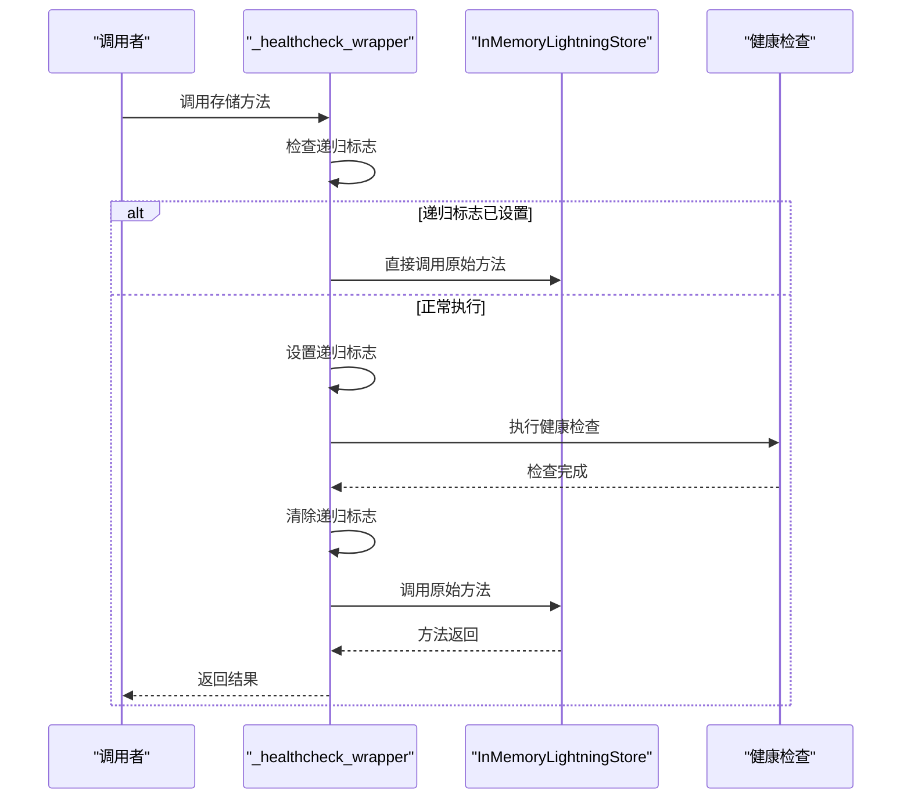
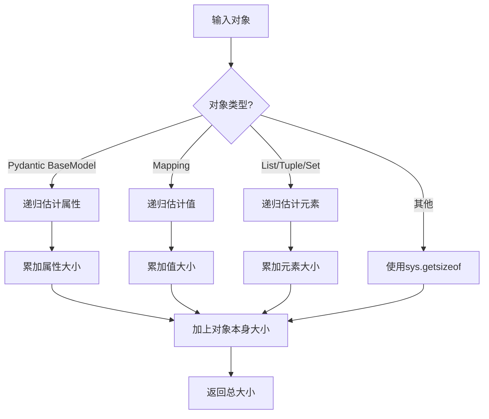
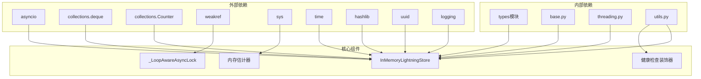

# 内存存储

<cite>
**本文档中引用的文件**
- [memory.py](file://agentlightning/store/memory.py)
- [base.py](file://agentlightning/store/base.py)
- [threading.py](file://agentlightning/store/threading.py)
- [utils.py](file://agentlightning/store/utils.py)
- [test_memory.py](file://tests/store/test_memory.py)
- [conftest.py](file://tests/store/conftest.py)
</cite>

## 目录
1. [简介](#简介)
2. [项目结构](#项目结构)
3. [核心组件](#核心组件)
4. [架构概览](#架构概览)
5. [详细组件分析](#详细组件分析)
6. [依赖关系分析](#依赖关系分析)
7. [性能考虑](#性能考虑)
8. [故障排除指南](#故障排除指南)
9. [结论](#结论)

## 简介

InMemoryLightningStore是Agent Lightning框架中的内存存储实现，提供了基于Python数据结构的高性能、线程安全和异步兼容的存储解决方案。该存储系统专为开发和测试环境设计，支持完整的训练回放生命周期管理，包括任务队列、资源版本控制、跨度跟踪和状态传播等功能。

内存存储的核心优势在于其快速的数据访问速度和简单的部署要求，特别适合需要频繁读写操作的开发测试场景。通过精心设计的内存容量检测和自动驱逐机制，它能够在有限的内存资源下高效运行。

## 项目结构

内存存储模块采用分层架构设计，主要包含以下核心文件：

**图表来源**
- [memory.py](file://agentlightning/store/memory.py#L1-L50)
- [base.py](file://agentlightning/store/base.py#L1-L50)
- [threading.py](file://agentlightning/store/threading.py#L1-L50)
- [utils.py](file://agentlightning/store/utils.py#L1-L50)

**章节来源**
- [memory.py](file://agentlightning/store/memory.py#L1-L100)
- [base.py](file://agentlightning/store/base.py#L1-L100)

## 核心组件

InMemoryLightningStore基于以下核心数据结构构建：

### 双端队列任务队列
- **类型**: `deque[Rollout]`
- **用途**: 实现FIFO任务调度，支持高效的头部和尾部插入删除操作
- **特点**: 原生支持线程安全的并发访问

### 回放映射表
- **类型**: `Dict[str, Rollout]`
- **用途**: 按ID快速查找和更新回放记录
- **键**: 回放ID (rollout_id)
- **值**: 完整的回放对象

### 资源存储
- **类型**: `Dict[str, ResourcesUpdate]`
- **用途**: 存储命名资源的版本化快照
- **最新资源ID**: `Optional[str]` - 指向当前最新版本的资源

### 跨度存储
- **类型**: `Dict[str, List[Span]]`
- **用途**: 按回放ID组织的跨度列表，支持时间序列查询
- **序列号计数器**: `Dict[str, int]` - 维护每个回放的跨度序列号
- **内存统计**: `Dict[str, int]` 和 `int` - 追踪各回放和总内存使用量

### 驱逐状态集合
- **类型**: `Set[str]`
- **用途**: 记录已被驱逐的回放ID，防止重复访问

**章节来源**
- [memory.py](file://agentlightning/store/memory.py#L196-L205)

## 架构概览

InMemoryLightningStore采用事件驱动的异步架构，结合线程安全机制确保并发访问的一致性：

**图表来源**
- [memory.py](file://agentlightning/store/memory.py#L240-L280)
- [threading.py](file://agentlightning/store/threading.py#L20-L50)

## 详细组件分析

### _LoopAwareAsyncLock 异步锁机制

_LoopAwareAsyncLock是内存存储的核心同步原语，专门设计用于处理多事件循环环境下的并发访问：

**图表来源**
- [memory.py](file://agentlightning/store/memory.py#L40-L85)

#### 工作原理
1. **事件循环感知**: 每个活跃的事件循环都有独立的锁实例
2. **弱引用管理**: 使用WeakKeyDictionary避免内存泄漏
3. **自动绑定**: 在进入异步上下文时自动绑定到当前事件循环
4. **异常安全**: 确保即使发生异常也能正确释放锁

#### 多线程兼容性
- **线程隔离**: 每个线程维护自己的事件循环锁集合
- **跨线程访问**: 不同线程可以同时访问同一个存储实例
- **序列化保护**: 确保同一时间只有一个协程能修改共享状态

**章节来源**
- [memory.py](file://agentlightning/store/memory.py#L40-L85)

### 内存容量检测与阈值配置

内存管理系统通过多层次的阈值配置实现智能的内存管理：

**图表来源**
- [memory.py](file://agentlightning/store/memory.py#L206-L240)

#### 配置参数详解

| 参数 | 类型 | 默认值 | 描述 |
|------|------|--------|------|
| `eviction_memory_threshold` | float \| int \| None | 总内存的70% | 触发内存驱逐的阈值 |
| `safe_memory_threshold` | float \| int \| None | 驱逐阈值的80% | 安全运行的内存上限 |
| `span_size_estimator` | Callable\[\] \| None | 内置估计器 | 自定义跨度大小计算函数 |

#### 内存阈值解析逻辑

**图表来源**
- [memory.py](file://agentlightning/store/memory.py#L720-L750)

**章节来源**
- [memory.py](file://agentlightning/store/memory.py#L206-L240)
- [memory.py](file://agentlightning/store/memory.py#L720-L750)

### 自动驱逐机制

内存驱逐机制采用LRU（最近最少使用）策略，优先驱逐最老的回放数据：

**图表来源**
- [memory.py](file://agentlightning/store/memory.py#L639-L664)

#### 驱逐策略特点
1. **时间优先**: 基于回放开始时间确定驱逐顺序
2. **渐进式清理**: 分批次执行驱逐，避免单次操作过大
3. **状态保持**: 驱逐后保留回放的基本信息，仅移除跨度数据
4. **性能优化**: 使用集合快速判断回放是否已被驱逐

**章节来源**
- [memory.py](file://agentlightning/store/memory.py#L639-L664)

### 健康检查装饰器

_healthcheck_wrapper提供自动化的健康状态监控，确保系统的稳定运行：

**图表来源**
- [memory.py](file://agentlightning/store/memory.py#L85-L120)

#### 防止递归调用机制
1. **标志位检查**: 在方法入口检查`_healthcheck_running`标志
2. **原子操作**: 使用简单布尔标志，不考虑并发安全性
3. **异常安全**: 即使健康检查失败也会清除标志
4. **透明处理**: 对用户完全透明，不影响正常业务逻辑

**章节来源**
- [memory.py](file://agentlightning/store/memory.py#L85-L120)

### 内存大小估计器

estimate_model_size函数提供递归的对象大小估算功能：

**图表来源**
- [memory.py](file://agentlightning/store/memory.py#L87-L105)

#### 支持的数据类型
- **Pydantic模型**: 递归计算所有字段的大小
- **映射类型**: 字典、OrderedDict等
- **序列类型**: 列表、元组、集合
- **基本类型**: 字符串、数字、布尔值等

**章节来源**
- [memory.py](file://agentlightning/store/memory.py#L87-L105)

## 依赖关系分析

内存存储模块的依赖关系体现了清晰的分层架构：

**图表来源**
- [memory.py](file://agentlightning/store/memory.py#L1-L35)
- [base.py](file://agentlightning/store/base.py#L1-L25)

### 关键依赖说明

1. **异步支持**: asyncio提供事件循环和并发原语
2. **数据结构**: collections提供高效的容器类型
3. **内存管理**: weakref防止内存泄漏
4. **类型系统**: pydantic提供数据验证和序列化
5. **工具函数**: 内置函数支持基本的内存和时间操作

**章节来源**
- [memory.py](file://agentlightning/store/memory.py#L1-L35)

## 性能考虑

### 内存存储的性能特征

| 特征 | 性能表现 | 适用场景 |
|------|----------|----------|
| **读取速度** | 极快（O(1)查找） | 频繁查询回放状态 |
| **写入速度** | 快（O(1)插入） | 高频添加新回放 |
| **内存使用** | 可控（自动驱逐） | 大量并发回放 |
| **并发性能** | 良好（锁分离） | 多线程/多协程环境 |
| **持久性** | 无（内存中） | 临时数据存储 |

### 最佳实践建议

1. **阈值配置**
   - 开发环境：使用默认阈值（70%总内存）
   - 测试环境：根据可用内存调整比例
   - 生产环境：谨慎设置，避免影响系统稳定性

2. **监控指标**
   - 内存使用率趋势
   - 驱逐频率和数量
   - 健康检查成功率

3. **扩展性考虑**
   - 适用于小到中等规模的并发回放
   - 大规模场景建议使用持久化存储
   - 考虑与其他存储后端的混合使用

### 适用场景

**推荐使用场景**：
- 开发和调试阶段
- 小规模测试环境
- 需要快速原型验证
- 短期数据缓存需求

**不推荐使用场景**：
- 生产环境大规模部署
- 需要数据持久化的场景
- 内存资源极度受限的环境

## 故障排除指南

### 常见问题及解决方案

#### 内存不足错误
**症状**: `ValueError: Detected memory capacity must be positive`
**原因**: 系统内存检测失败或返回无效值
**解决方案**: 
- 检查系统内存状态
- 安装psutil包进行准确检测
- 手动设置合理的内存阈值

#### 驱逐性能问题
**症状**: 驱逐操作耗时过长
**原因**: 大量待驱逐的回放数据
**解决方案**:
- 调整驱逐阈值比例
- 增加安全阈值缓冲区
- 考虑使用更激进的驱逐策略

#### 并发访问冲突
**症状**: 锁等待或死锁现象
**原因**: 复杂的异步调用链
**解决方案**:
- 简化调用路径
- 减少锁持有时间
- 使用线程安全包装器

**章节来源**
- [memory.py](file://agentlightning/store/memory.py#L206-L240)

### 调试技巧

1. **启用详细日志**: 设置日志级别为DEBUG查看详细操作
2. **监控内存使用**: 定期检查内存统计信息
3. **跟踪驱逐过程**: 观察驱逐候选和实际驱逐情况
4. **验证阈值配置**: 确认计算的阈值符合预期

## 结论

InMemoryLightningStore是一个设计精良的内存存储解决方案，通过巧妙的架构设计实现了高性能、高可靠性的数据管理。其核心优势包括：

1. **异步友好**: 完整的异步支持和事件循环感知
2. **线程安全**: 精确的并发控制机制
3. **智能内存管理**: 自动化的容量检测和驱逐策略
4. **易于使用**: 符合标准接口规范，开箱即用

该存储系统特别适合开发测试环境，能够满足快速迭代和高频数据操作的需求。通过合理的配置和监控，可以在保证性能的同时避免内存溢出问题。对于需要更高可靠性和持久性的生产环境，建议结合其他存储后端使用，或者在必要时迁移到持久化存储方案。