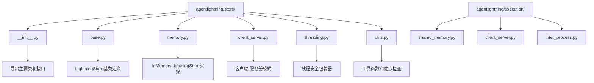
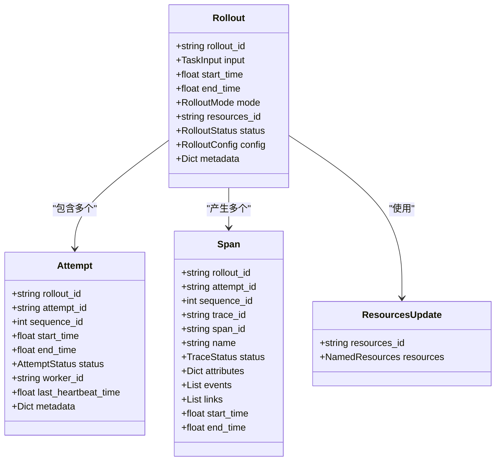
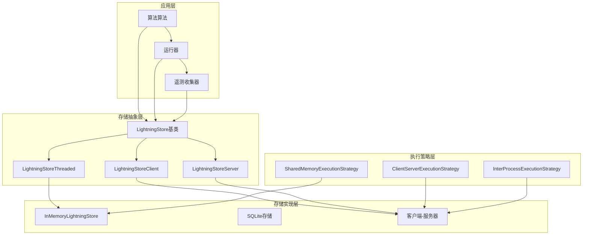
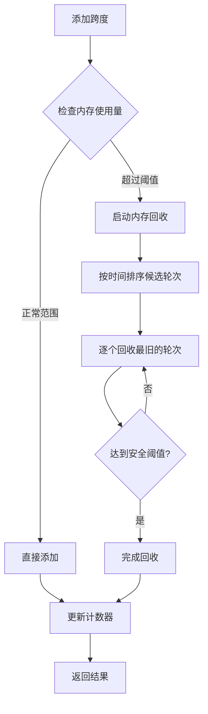
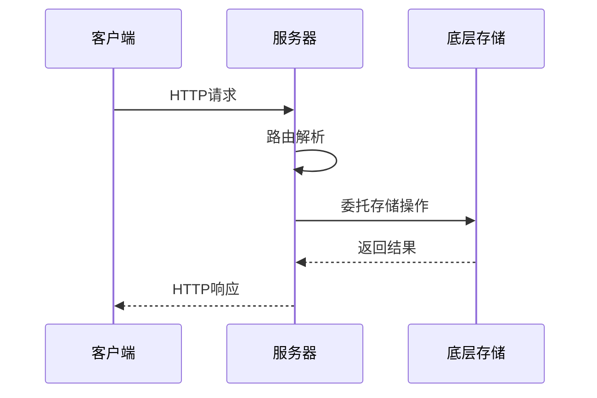
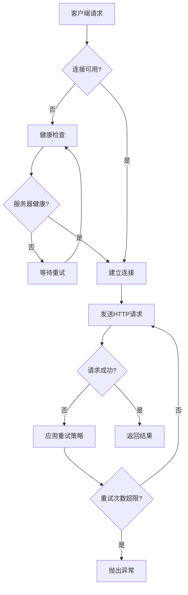
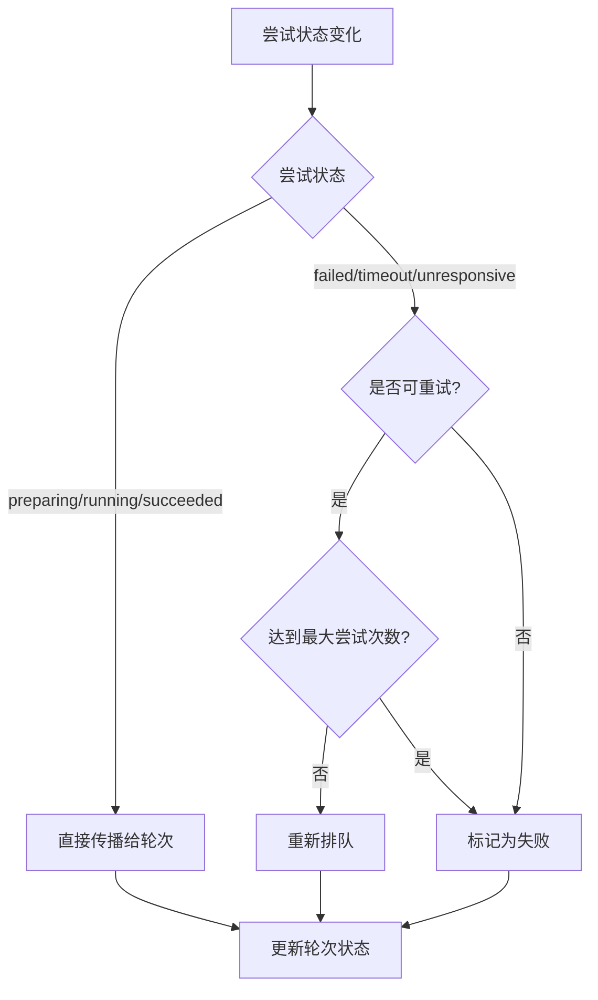
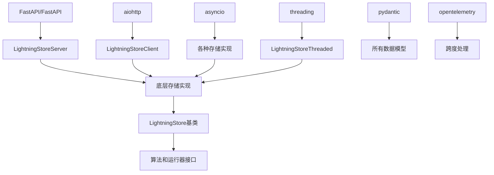

# 存储系统

<cite>
**本文档中引用的文件**
- [agentlightning/store/__init__.py](file://agentlightning/store/__init__.py)
- [agentlightning/store/base.py](file://agentlightning/store/base.py)
- [agentlightning/store/memory.py](file://agentlightning/store/memory.py)
- [agentlightning/store/client_server.py](file://agentlightning/store/client_server.py)
- [agentlightning/store/threading.py](file://agentlightning/store/threading.py)
- [agentlightning/store/utils.py](file://agentlightning/store/utils.py)
- [agentlightning/types/core.py](file://agentlightning/types/core.py)
- [agentlightning/execution/shared_memory.py](file://agentlightning/execution/shared_memory.py)
- [agentlightning/execution/client_server.py](file://agentlightning/execution/client_server.py)
- [agentlightning/execution/inter_process.py](file://agentlightning/execution/inter_process.py)
- [tests/store/test_memory.py](file://tests/store/test_memory.py)
- [tests/store/test_client_server.py](file://tests/store/test_client_server.py)
</cite>

## 目录
1. [简介](#简介)
2. [项目结构](#项目结构)
3. [核心组件](#核心组件)
4. [架构概览](#架构概览)
5. [详细组件分析](#详细组件分析)
6. [依赖关系分析](#依赖关系分析)
7. [性能考虑](#性能考虑)
8. [故障排除指南](#故障排除指南)
9. [结论](#结论)

## 简介

LightningStore是Agent Lightning框架的核心存储系统，负责协调算法与运行器之间的所有交互。该系统提供了持久化的控制平面，支持训练轮次的生命周期管理、尝试跟踪、跨度摄入和资源版本控制。系统采用模块化设计，支持多种后端实现，包括内存存储、SQLite存储和客户端-服务器模式，以满足不同的部署需求和性能要求。

## 项目结构

存储系统的核心文件组织如下：

**图表来源**
- [agentlightning/store/__init__.py](file://agentlightning/store/__init__.py#L1-L15)
- [agentlightning/store/base.py](file://agentlightning/store/base.py#L1-L50)

**章节来源**
- [agentlightning/store/__init__.py](file://agentlightning/store/__init__.py#L1-L15)

## 核心组件

### LightningStore基类

LightningStore是整个存储系统的核心抽象，定义了所有存储操作的标准接口。该类提供了以下核心功能：

- **轮次生命周期管理**：接受新轮次、排队等待执行、创建尝试并驱动轮次状态机
- **尝试跟踪**：记录每次执行尝试，包括进度心跳、重试序列和终端状态
- **跨度摄入**：捕获运行器发出的结构化遥测数据
- **资源版本控制**：管理命名资源的不可变快照

### 数据模型设计

系统使用Pydantic模型来确保类型安全和数据完整性：

**图表来源**
- [agentlightning/types/core.py](file://agentlightning/types/core.py#L100-L200)
- [agentlightning/store/base.py](file://agentlightning/store/base.py#L50-L150)

**章节来源**
- [agentlightning/store/base.py](file://agentlightning/store/base.py#L1-L516)
- [agentlightning/types/core.py](file://agentlightning/types/core.py#L1-L396)

## 架构概览

LightningStore采用分层架构设计，支持多种部署模式：

**图表来源**
- [agentlightning/store/base.py](file://agentlightning/store/base.py#L1-L100)
- [agentlightning/execution/shared_memory.py](file://agentlightning/execution/shared_memory.py#L1-L50)

## 详细组件分析

### 内存存储实现 (InMemoryLightningStore)

InMemoryLightningStore是系统的主要存储实现，提供高性能的内存存储解决方案：

#### 核心特性

- **线程安全和异步兼容**：使用自定义的`_LoopAwareAsyncLock`实现线程安全
- **内存管理**：智能的内存回收机制，防止内存泄漏
- **健康检查**：定期监控和清理未响应的尝试
- **序列化机制**：支持OpenTelemetry跨度的自动转换

#### 内存管理策略

**图表来源**
- [agentlightning/store/memory.py](file://agentlightning/store/memory.py#L600-L700)

#### 性能特征

| 特性 | 描述 | 性能影响 |
|------|------|----------|
| 内存存储 | 完全基于RAM的数据存储 | 极高读写速度，适合小到中等规模数据 |
| 异步操作 | 支持并发异步调用 | 高并发场景下的良好性能 |
| 内存回收 | 自动清理过期数据 | 防止内存无限增长 |
| 健康检查 | 定期监控系统状态 | 及时发现和处理异常 |

**章节来源**
- [agentlightning/store/memory.py](file://agentlightning/store/memory.py#L1-L944)

### 客户端-服务器模式

客户端-服务器架构支持分布式部署，允许算法和运行器在不同的进程中或机器上运行：

#### 服务器端实现

**图表来源**
- [agentlightning/store/client_server.py](file://agentlightning/store/client_server.py#L100-L200)

#### 客户端实现

客户端通过HTTP协议与服务器通信，支持重试机制和健康检查：

**图表来源**
- [agentlightning/store/client_server.py](file://agentlightning/store/client_server.py#L700-L800)

**章节来源**
- [agentlightning/store/client_server.py](file://agentlightning/store/client_server.py#L1-L1134)

### 线程安全包装器 (LightningStoreThreaded)

LightningStoreThreaded为现有的存储实现提供线程安全保证：

#### 实现原理

- **互斥锁保护**：使用`threading.Lock`确保同一时间只有一个线程可以访问存储
- **透明代理**：所有操作都通过锁进行同步
- **性能权衡**：牺牲部分并发性能换取线程安全性

**章节来源**
- [agentlightning/store/threading.py](file://agentlightning/store/threading.py#L1-L174)

### 工具函数和健康检查

系统提供了一系列工具函数来支持存储操作的可靠性和维护：

#### 状态传播机制

**图表来源**
- [agentlightning/store/utils.py](file://agentlightning/store/utils.py#L10-L50)

**章节来源**
- [agentlightning/store/utils.py](file://agentlightning/store/utils.py#L1-L128)

## 依赖关系分析

存储系统的依赖关系体现了清晰的分层架构：

**图表来源**
- [agentlightning/store/client_server.py](file://agentlightning/store/client_server.py#L1-L30)
- [agentlightning/store/memory.py](file://agentlightning/store/memory.py#L1-L50)

**章节来源**
- [agentlightning/store/base.py](file://agentlightning/store/base.py#L1-L20)
- [agentlightning/store/client_server.py](file://agentlightning/store/client_server.py#L1-L50)

## 性能考虑

### 不同存储后端的性能特征

| 存储类型 | 读取延迟 | 写入延迟 | 并发支持 | 持久化 | 适用场景 |
|----------|----------|----------|----------|--------|----------|
| InMemory | 极低 | 极低 | 高 | 否 | 开发测试、小规模生产 |
| SQLite | 低 | 中等 | 中等 | 是 | 单机部署、中小规模 |
| Client-Server | 中等 | 中等 | 高 | 是 | 分布式部署、大规模 |

### 优化建议

1. **内存管理**：
   - 合理设置内存阈值参数
   - 定期监控内存使用情况
   - 使用适当的垃圾回收策略

2. **网络优化**（仅适用于客户端-服务器模式）：
   - 使用连接池减少连接开销
   - 实施适当的重试策略
   - 监控网络延迟和丢包率

3. **并发优化**：
   - 根据工作负载选择合适的执行策略
   - 避免过度的锁竞争
   - 使用异步操作提高吞吐量

## 故障排除指南

### 常见问题及解决方案

#### 内存不足错误

**症状**：存储操作抛出内存相关的异常
**原因**：内存使用超过预设阈值
**解决方案**：
- 调整`eviction_memory_threshold`参数
- 增加系统可用内存
- 优化数据保留策略

#### 连接超时问题

**症状**：客户端-服务器通信频繁超时
**原因**：网络延迟或服务器负载过高
**解决方案**：
- 增加超时配置
- 检查网络连接质量
- 扩展服务器资源

#### 死锁问题

**症状**：系统响应缓慢或完全停止
**原因**：锁竞争或不正确的锁顺序
**解决方案**：
- 使用线程安全包装器
- 检查锁的使用模式
- 实施锁超时机制

**章节来源**
- [agentlightning/store/memory.py](file://agentlightning/store/memory.py#L800-L944)
- [agentlightning/store/client_server.py](file://agentlightning/store/client_server.py#L600-L700)

## 结论

LightningStore存储系统通过其模块化设计和多种后端实现，为Agent Lightning框架提供了灵活且强大的数据管理能力。系统的核心优势包括：

1. **统一的抽象接口**：LightningStore基类为所有存储实现提供了统一的操作接口
2. **多样化的部署选项**：从简单的内存存储到复杂的分布式架构
3. **强大的并发支持**：通过线程安全和异步操作支持高并发场景
4. **完善的监控机制**：内置的健康检查和状态传播确保系统可靠性

该系统特别适合需要高性能、低延迟数据访问的强化学习应用场景，同时通过客户端-服务器模式支持大规模分布式部署。随着框架的发展，系统将继续演进以支持更多的存储后端和执行策略，为用户提供更加灵活和高效的解决方案。