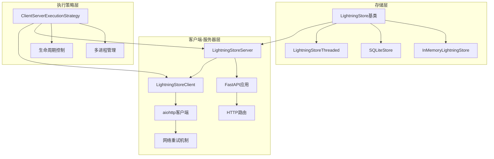
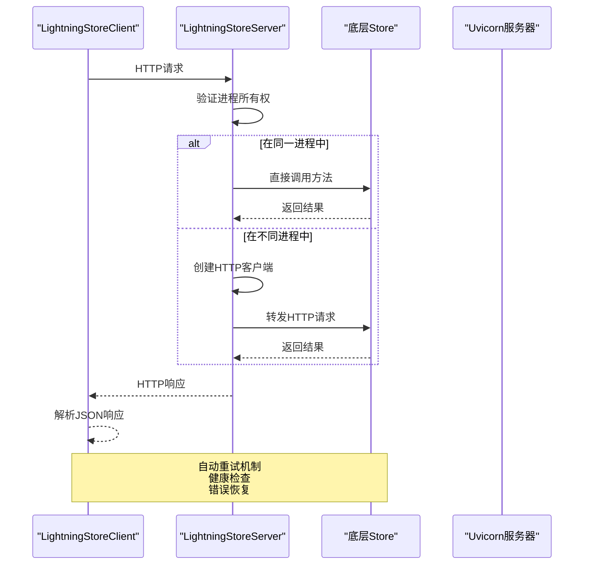
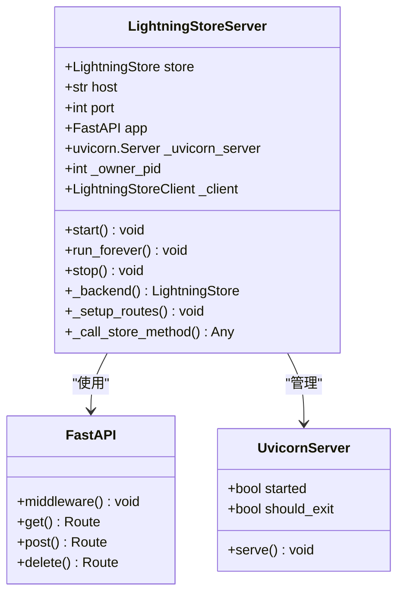
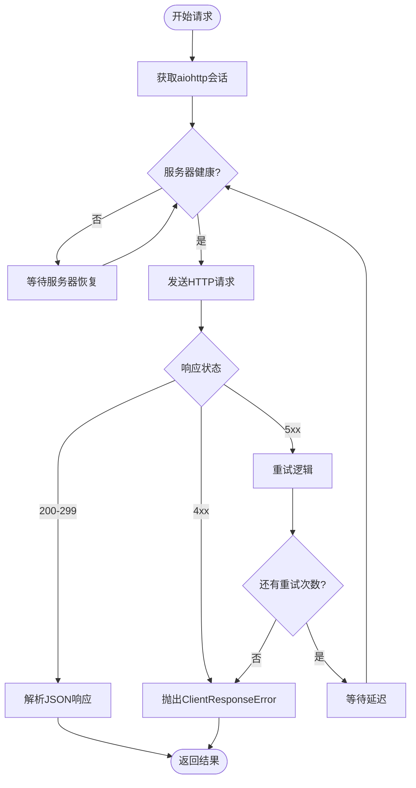
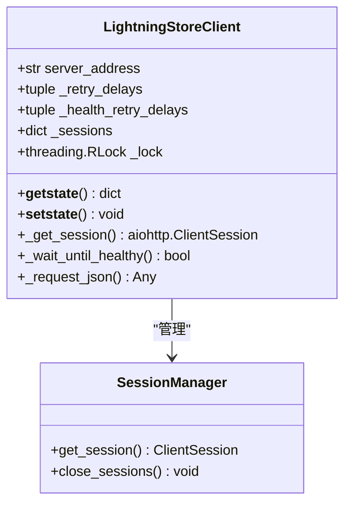
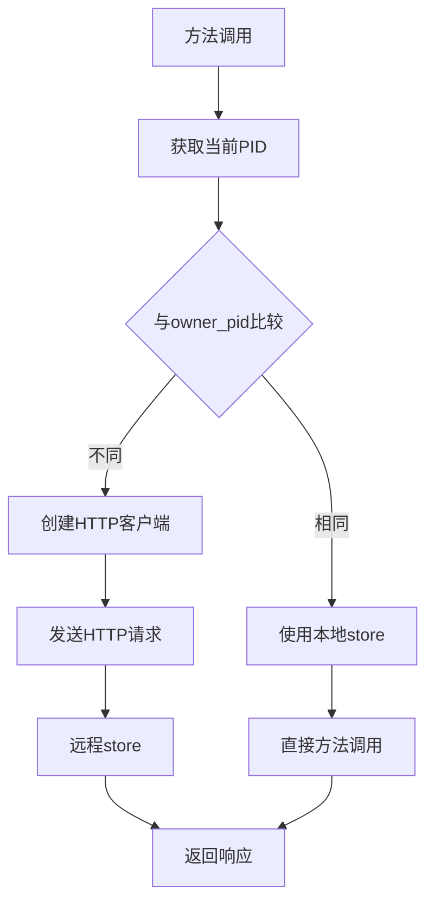
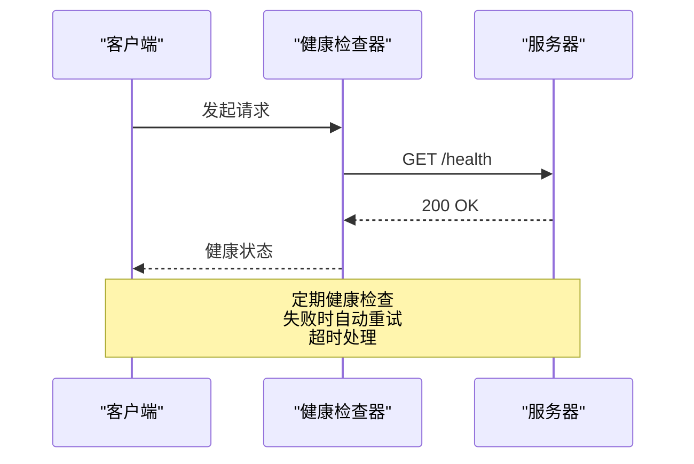
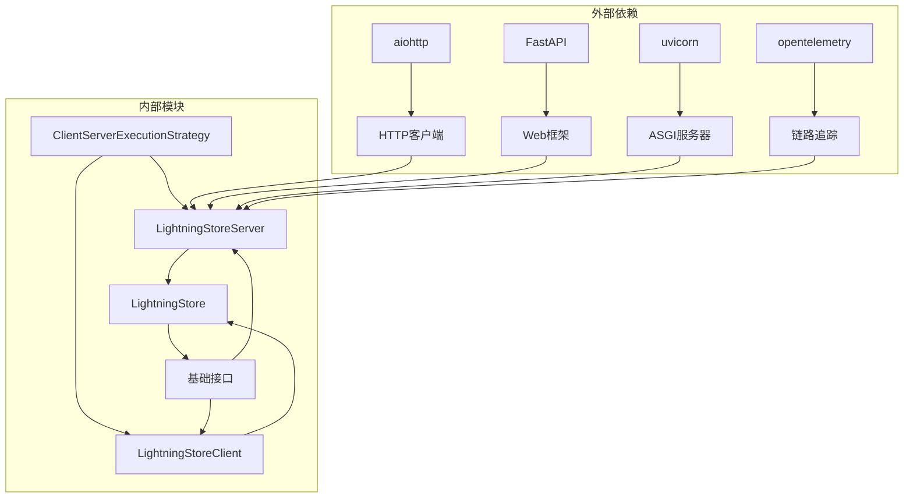
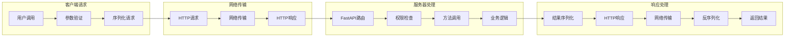

# 客户端-服务器存储模式

<cite>
**本文档中引用的文件**
- [agentlightning/store/client_server.py](file://agentlightning/store/client_server.py)
- [agentlightning/store/base.py](file://agentlightning/store/base.py)
- [agentlightning/store/__init__.py](file://agentlightning/store/__init__.py)
- [agentlightning/store/memory.py](file://agentlightning/store/memory.py)
- [agentlightning/execution/client_server.py](file://agentlightning/execution/client_server.py)
- [agentlightning/types/core.py](file://agentlightning/types/core.py)
- [agentlightning/cli/store.py](file://agentlightning/cli/store.py)
- [tests/store/test_client_server.py](file://tests/store/test_client_server.py)
- [tests/execution/test_client_server.py](file://tests/execution/test_client_server.py)
</cite>

## 目录
1. [简介](#简介)
2. [项目结构](#项目结构)
3. [核心组件](#核心组件)
4. [架构概览](#架构概览)
5. [详细组件分析](#详细组件分析)
6. [依赖关系分析](#依赖关系分析)
7. [性能考虑](#性能考虑)
8. [故障排除指南](#故障排除指南)
9. [结论](#结论)

## 简介

客户端-服务器存储模式是Agent Lightning框架中的核心架构设计，它通过LightningStoreServer和LightningStoreClient实现了分布式存储系统的统一抽象。该模式将底层的LightningStore实例（如InMemoryLightningStore）通过FastAPI封装成HTTP服务，为分布式系统提供了可靠的集中式数据管理解决方案。

这种架构特别适用于分布式训练场景，其中多个算法和运行器需要共享和协调相同的存储状态。通过HTTP协议的客户端-服务器通信，系统能够在多进程环境中保持数据一致性，同时提供强大的错误恢复和重试机制。

## 项目结构

**图表来源**
- [agentlightning/store/base.py](file://agentlightning/store/base.py#L1-L50)
- [agentlightning/store/client_server.py](file://agentlightning/store/client_server.py#L1-L100)

**章节来源**
- [agentlightning/store/__init__.py](file://agentlightning/store/__init__.py#L1-L13)

## 核心组件

### LightningStoreServer - HTTP服务器实现

LightningStoreServer是客户端-服务器架构的核心服务器组件，负责将底层的LightningStore实例封装为可访问的HTTP服务。

#### 主要特性：
- **FastAPI集成**：基于现代异步Web框架提供高性能HTTP服务
- **进程感知**：通过owner_pid机制防止跨进程状态不一致
- **生命周期管理**：支持start、run_forever和stop方法
- **健康检查**：内置健康监控和自动恢复机制

#### 关键方法：
- `start()`：启动后台服务器线程
- `run_forever()`：无限期运行服务器
- `stop()`：优雅关闭服务器
- `_backend()`：根据进程ID选择本地或远程后端

### LightningStoreClient - HTTP客户端实现

LightningStoreClient作为HTTP客户端，通过aiohttp与服务器进行异步通信，提供透明的远程调用体验。

#### 核心功能：
- **自动重试**：智能的网络错误重试机制
- **会话管理**：基于事件循环的连接池管理
- **进程隔离**：支持多进程环境下的序列化
- **健康探测**：定期检查服务器可用性

#### 重试策略：
- 默认重试延迟：1.0s, 2.0s, 5.0s
- 健康检查延迟：0.1s, 0.2s, 0.5s
- 支持自定义重试配置

**章节来源**
- [agentlightning/store/client_server.py](file://agentlightning/store/client_server.py#L100-L300)

## 架构概览

**图表来源**
- [agentlightning/store/client_server.py](file://agentlightning/store/client_server.py#L400-L500)
- [agentlightning/execution/client_server.py](file://agentlightning/execution/client_server.py#L100-L200)

## 详细组件分析

### LightningStoreServer详细分析

#### 路由设置与API端点

LightningStoreServer通过FastAPI提供了完整的RESTful API，涵盖了所有存储操作：

**图表来源**
- [agentlightning/store/client_server.py](file://agentlightning/store/client_server.py#L100-L200)

#### 异常处理中间件

服务器实现了两层异常处理机制：

1. **应用级异常处理**：将未捕获的应用异常转换为500响应
2. **传输级异常处理**：区分应用错误和网络错误

#### 日志记录机制

- **请求日志**：记录每个HTTP请求的详细信息
- **性能监控**：测量请求处理时间
- **错误追踪**：记录异常堆栈信息

**章节来源**
- [agentlightning/store/client_server.py](file://agentlightning/store/client_server.py#L300-L400)

### LightningStoreClient详细分析

#### 网络通信与重试机制

**图表来源**
- [agentlightning/store/client_server.py](file://agentlightning/store/client_server.py#L750-L850)

#### 进程间序列化机制

LightningStoreClient实现了特殊的pickle序列化机制，以支持多进程环境：

**图表来源**
- [agentlightning/store/client_server.py](file://agentlightning/store/client_server.py#L660-L690)

**章节来源**
- [agentlightning/store/client_server.py](file://agentlightning/store/client_server.py#L500-L700)

### 多进程所有权机制

#### owner_pid检测

系统通过操作系统进程ID（PID）来检测当前进程是否为服务器的所有者：

**图表来源**
- [agentlightning/store/client_server.py](file://agentlightning/store/client_server.py#L350-L400)

#### 进程隔离保护

- **Pickling安全**：只序列化必要的配置信息
- **会话隔离**：每个进程维护独立的HTTP会话
- **状态同步**：确保跨进程状态一致性

**章节来源**
- [agentlightning/store/client_server.py](file://agentlightning/store/client_server.py#L660-L700)

### 健康检查机制

#### 服务器健康监控

**图表来源**
- [agentlightning/store/client_server.py](file://agentlightning/store/client_server.py#L200-L250)

#### 错误恢复策略

- **瞬态错误重试**：网络断开、服务器重启等
- **应用错误处理**：4xx客户端错误不重试
- **服务器错误恢复**：5xx服务器错误自动重试

**章节来源**
- [agentlightning/store/client_server.py](file://agentlightning/store/client_server.py#L750-L850)

## 依赖关系分析

### 组件依赖图

**图表来源**
- [agentlightning/store/client_server.py](file://agentlightning/store/client_server.py#L1-L30)
- [agentlightning/execution/client_server.py](file://agentlightning/execution/client_server.py#L1-L20)

### 数据流分析

#### 存储操作流程

**图表来源**
- [agentlightning/store/client_server.py](file://agentlightning/store/client_server.py#L400-L500)

**章节来源**
- [agentlightning/store/client_server.py](file://agentlightning/store/client_server.py#L1-L100)

## 性能考虑

### 并发处理能力

- **异步I/O**：基于asyncio的非阻塞网络操作
- **连接池**：复用HTTP连接减少建立开销
- **事件循环隔离**：每个进程维护独立的事件循环

### 缓存策略

- **会话缓存**：基于事件循环ID的会话复用
- **健康状态缓存**：避免频繁的健康检查
- **连接复用**：长连接减少握手开销

### 扩展性设计

- **水平扩展**：支持多个服务器实例
- **负载均衡**：客户端可以配置多个服务器地址
- **故障转移**：自动检测和切换到健康的服务器

## 故障排除指南

### 常见问题诊断

#### 服务器启动失败

**症状**：服务器无法启动或端口冲突
**原因**：
- 端口已被占用
- 权限不足
- 配置错误

**解决方案**：
- 检查端口占用情况
- 使用不同的端口号
- 验证防火墙设置

#### 网络连接问题

**症状**：客户端无法连接到服务器
**原因**：
- 网络不通
- 防火墙阻止
- 服务器未启动

**解决方案**：
- 检查网络连通性
- 验证防火墙规则
- 确认服务器状态

#### 性能问题

**症状**：响应时间过长
**原因**：
- 网络延迟高
- 服务器负载过高
- 客户端重试过多

**解决方案**：
- 优化网络配置
- 增加服务器资源
- 调整重试参数

**章节来源**
- [tests/store/test_client_server.py](file://tests/store/test_client_server.py#L50-L100)

### 监控和调试

#### 日志配置

系统提供了详细的日志记录功能：

- **请求级别**：记录每个HTTP请求的详细信息
- **错误级别**：记录异常和错误信息
- **调试级别**：记录详细的调试信息

#### 性能指标

- **响应时间**：测量HTTP请求的处理时间
- **吞吐量**：统计每秒处理的请求数
- **错误率**：计算失败请求的比例

## 结论

客户端-服务器存储模式为Agent Lightning框架提供了强大而灵活的分布式存储解决方案。通过LightningStoreServer和LightningStoreClient的紧密配合，系统实现了以下关键优势：

### 技术优势

1. **统一抽象**：通过LightningStore接口隐藏了客户端-服务器通信的复杂性
2. **进程隔离**：通过owner_pid机制确保多进程环境下的数据一致性
3. **容错能力**：完善的重试机制和健康检查确保系统稳定性
4. **性能优化**：异步I/O和连接池设计提供高性能的网络通信

### 应用场景

该模式特别适用于以下场景：

- **分布式训练**：多个训练进程需要共享和协调相同的存储状态
- **微服务架构**：不同服务组件需要访问统一的数据存储
- **云原生部署**：支持容器化和动态扩缩容
- **高可用系统**：提供故障恢复和负载均衡能力

### 未来发展方向

- **协议优化**：考虑使用更高效的序列化协议
- **安全增强**：添加认证和授权机制
- **监控完善**：集成更全面的监控和告警系统
- **性能提升**：进一步优化网络通信和缓存策略

通过这种精心设计的客户端-服务器架构，Agent Lightning成功地解决了分布式系统中的数据一致性、可扩展性和可靠性挑战，为复杂的机器学习工作流提供了坚实的基础支撑。