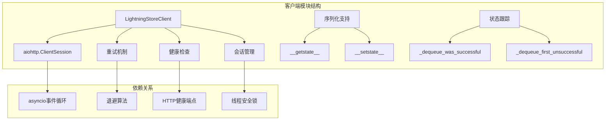
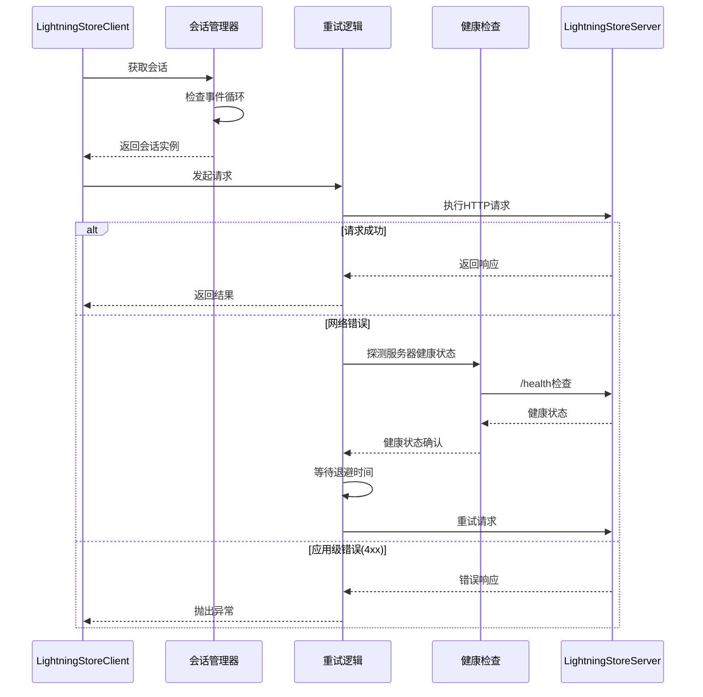
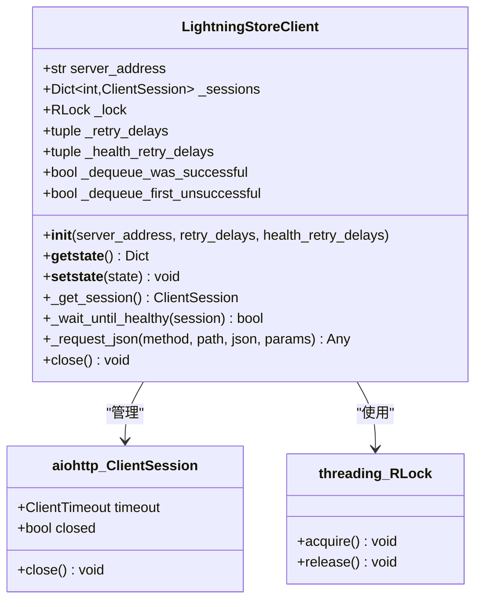
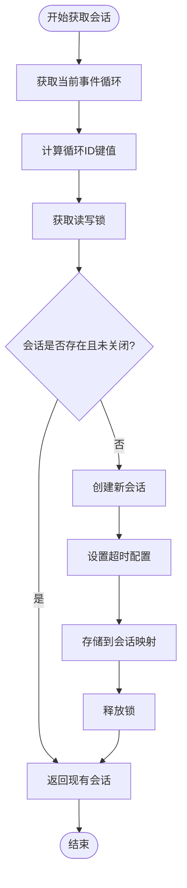
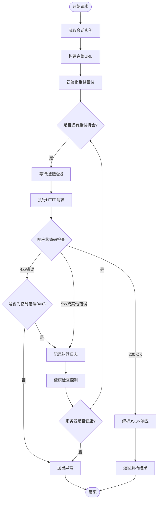
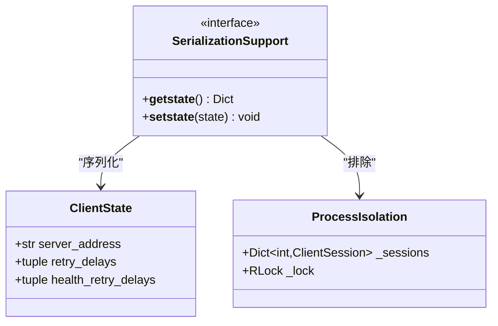
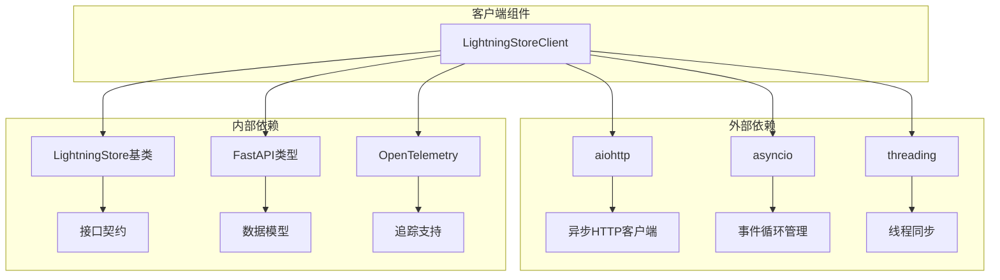

# LightningStoreClient 客户端实现技术文档

<cite>
**本文档中引用的文件**
- [agentlightning/store/client_server.py](file://agentlightning/store/client_server.py)
- [agentlightning/store/base.py](file://agentlightning/store/base.py)
- [agentlightning/client.py](file://agentlightning/client.py)
- [tests/store/test_client_server.py](file://tests/store/test_client_server.py)
- [agentlightning/store/__init__.py](file://agentlightning/store/__init__.py)
</cite>

## 目录
1. [简介](#简介)
2. [项目结构](#项目结构)
3. [核心组件](#核心组件)
4. [架构概览](#架构概览)
5. [详细组件分析](#详细组件分析)
6. [依赖关系分析](#依赖关系分析)
7. [性能考虑](#性能考虑)
8. [故障排除指南](#故障排除指南)
9. [结论](#结论)

## 简介

LightningStoreClient 是一个高性能的异步 HTTP 客户端，专门设计用于与 LightningStoreServer 进行通信。该客户端基于 aiohttp 库构建，提供了强大的重试机制、健康检查功能和事件循环感知的会话管理能力。它作为 LightningStore 接口的 HTTP 实现，为分布式系统提供了可靠的远程存储访问能力。

## 项目结构

LightningStoreClient 的实现位于 `agentlightning/store/client_server.py` 文件中，该文件包含了完整的客户端实现，包括基础类定义、异步方法和相关工具函数。

**图表来源**
- [agentlightning/store/client_server.py](file://agentlightning/store/client_server.py#L638-L693)

**章节来源**
- [agentlightning/store/client_server.py](file://agentlightning/store/client_server.py#L638-L1132)

## 核心组件

LightningStoreClient 的核心组件包括以下关键部分：

### 基础配置组件
- **服务器地址管理**：维护目标服务器的完整 URL 地址
- **重试配置**：支持自定义的退避延迟序列
- **健康检查配置**：独立的健康探测延迟设置

### 异步通信组件
- **会话管理**：基于事件循环的线程安全会话池
- **请求处理**：统一的 JSON 请求处理机制
- **错误处理**：分层的异常处理和重试逻辑

### 状态管理组件
- **队列状态跟踪**：记录出队操作的成功历史
- **序列化支持**：支持多进程环境下的对象传输
- **资源清理**：优雅的连接关闭机制

**章节来源**
- [agentlightning/store/client_server.py](file://agentlightning/store/client_server.py#L638-L693)

## 架构概览

LightningStoreClient 采用分层架构设计，确保了高可用性和可扩展性：

**图表来源**
- [agentlightning/store/client_server.py](file://agentlightning/store/client_server.py#L756-L850)

## 详细组件分析

### 初始化方法分析

LightningStoreClient 的初始化过程包含了精心设计的配置参数和状态初始化：

**图表来源**
- [agentlightning/store/client_server.py](file://agentlightning/store/client_server.py#L638-L693)

#### 重试机制配置

客户端提供了两套独立的重试配置：
- **retry_delays**：用于处理非应用级错误的退避延迟序列
- **health_retry_delays**：用于健康检查的专用延迟序列

这种分离设计允许客户端在不同类型的故障情况下采用不同的恢复策略。

#### 连接管理策略

客户端实现了基于事件循环的会话管理机制，确保每个事件循环都有独立的会话实例：

**章节来源**
- [agentlightning/store/client_server.py](file://agentlightning/store/client_server.py#L638-L693)

### 事件循环感知的会话管理

_get_session 方法是客户端的核心功能之一，实现了事件循环感知的会话管理：

**图表来源**
- [agentlightning/store/client_server.py](file://agentlightning/store/client_server.py#L695-L720)

该方法的关键特性包括：
- **事件循环隔离**：每个事件循环维护独立的会话实例
- **线程安全**：使用 RLock 确保并发访问的安全性
- **会话复用**：避免重复创建昂贵的会话对象
- **自动清理**：检测并处理已关闭的会话

**章节来源**
- [agentlightning/store/client_server.py](file://agentlightning/store/client_server.py#L695-L720)

### 容错设计的请求处理

_request_json 方法实现了复杂的容错设计，包含多层次的错误处理和重试逻辑：

**图表来源**
- [agentlightning/store/client_server.py](file://agentlightning/store/client_server.py#L756-L850)

#### 网络异常处理

客户端能够处理多种网络异常情况：
- **服务器断开连接**：ServerDisconnectedError
- **连接器错误**：ClientConnectorError  
- **客户端操作系统错误**：ClientOSError
- **超时错误**：asyncio.TimeoutError

每种异常都会触发健康检查机制，确保服务器恢复后再进行重试。

#### 自动重试逻辑

重试逻辑遵循以下优先级：
1. **立即重试**：首次失败后立即重试
2. **指数退避**：根据配置的延迟序列进行退避
3. **健康检查**：在网络异常后先进行健康检查
4. **应用级错误**：4xx 状态码被视为最终错误，不进行重试

**章节来源**
- [agentlightning/store/client_server.py](file://agentlightning/store/client_server.py#L756-L850)

### 多进程环境下的序列化行为

LightningStoreClient 提供了完整的序列化支持，确保在多进程环境中能够正确传输客户端实例：

**图表来源**
- [agentlightning/store/client_server.py](file://agentlightning/store/client_server.py#L671-L693)

#### 序列化机制

- **__getstate__ 方法**：只序列化必要的配置信息，排除会话对象
- **__setstate__ 方法**：重建基本属性并在子进程中重新初始化
- **进程隔离**：确保会话对象不会被错误地传输到其他进程

**章节来源**
- [agentlightning/store/client_server.py](file://agentlightning/store/client_server.py#L671-L693)

### 状态跟踪机制

客户端实现了智能的状态跟踪机制，特别是针对队列操作的特殊处理：

#### _dequeue_was_successful 状态

该布尔变量跟踪最近一次出队操作的成功状态：
- **初始值**：False，表示尚未进行过出队操作
- **更新时机**：每次成功的出队操作都会设置为 True
- **用途**：帮助判断后续失败是否属于首次异常

#### _dequeue_first_unsuccessful 状态

这个标志变量控制重复错误日志的输出：
- **初始值**：True，表示首次遇到失败
- **更新时机**：第一次出队失败时设置为 False
- **用途**：避免在连续失败的情况下产生大量重复日志

**章节来源**
- [agentlightning/store/client_server.py](file://agentlightning/store/client_server.py#L661-L666)

## 依赖关系分析

LightningStoreClient 的依赖关系体现了其作为基础设施组件的设计理念：

**图表来源**
- [agentlightning/store/client_server.py](file://agentlightning/store/client_server.py#L1-L30)

### 核心依赖项

1. **aiohttp**：提供异步 HTTP 客户端功能
2. **asyncio**：支持异步编程和事件循环管理
3. **threading**：提供线程安全的同步原语
4. **FastAPI 类型**：确保数据序列化的类型安全性

### 接口兼容性

LightningStoreClient 实现了 LightningStore 基类的所有方法，确保了与存储后端的一致性接口：

**章节来源**
- [agentlightning/store/base.py](file://agentlightning/store/base.py#L50-L515)
- [agentlightning/store/client_server.py](file://agentlightning/store/client_server.py#L638-L1132)

## 性能考虑

### 会话复用优化

客户端通过事件循环感知的会话管理实现了显著的性能优化：
- **减少连接开销**：避免重复建立 TCP 连接
- **保持长连接**：利用 HTTP/1.1 的连接复用特性
- **内存效率**：合理控制会话对象的数量

### 重试策略优化

退避算法的设计考虑了以下性能因素：
- **指数退避**：避免对服务器造成过大压力
- **随机抖动**：防止多个客户端同时重试导致的惊群效应
- **健康检查**：及时发现并处理服务器故障

### 内存管理

客户端采用了多种内存管理策略：
- **弱引用**：避免循环引用导致的内存泄漏
- **及时清理**：在连接关闭时立即释放资源
- **状态压缩**：只保存必要的状态信息

## 故障排除指南

### 常见问题诊断

#### 连接超时问题

**症状**：请求经常超时或返回超时异常
**原因**：网络延迟过高或服务器负载过重
**解决方案**：
- 调整 ClientTimeout 配置
- 增加重试延迟时间
- 检查网络连通性

#### 会话冲突问题

**症状**：在多线程或多进程中出现会话异常
**原因**：会话对象在不同事件循环间传递
**解决方案**：
- 使用正确的序列化机制
- 确保会话对象的生命周期管理

#### 健康检查失败

**症状**：频繁的健康检查探测失败
**原因**：服务器不稳定或网络分区
**解决方案**：
- 增加健康检查的重试次数
- 调整健康检查的间隔时间
- 检查服务器的稳定性

**章节来源**
- [agentlightning/store/client_server.py](file://agentlightning/store/client_server.py#L722-L754)

### 最佳实践建议

#### 错误处理最佳实践

1. **分层错误处理**：区分应用级错误和网络级错误
2. **适当的重试策略**：根据错误类型选择合适的重试策略
3. **监控和告警**：建立完善的监控体系

#### 性能优化技巧

1. **连接池管理**：合理配置连接池大小
2. **缓存策略**：利用本地缓存减少网络请求
3. **批量操作**：尽可能使用批量 API 减少请求次数

#### 安全考虑

1. **证书验证**：在生产环境中启用 SSL 证书验证
2. **身份认证**：实现适当的身份验证机制
3. **审计日志**：记录所有重要的操作和错误

## 结论

LightningStoreClient 作为一个专业的异步 HTTP 客户端，在设计上充分考虑了现代分布式系统的各种需求。其核心优势包括：

### 技术优势
- **事件循环感知**：完美适配 asyncio 生态系统
- **强健的容错机制**：多层次的错误处理和重试逻辑
- **高效的会话管理**：基于事件循环的会话复用
- **完善的序列化支持**：支持多进程环境下的对象传输

### 设计特点
- **模块化架构**：清晰的职责分离和接口设计
- **可配置性**：灵活的重试和超时配置
- **可观测性**：丰富的日志和监控支持
- **向后兼容**：与 LightningStore 基类的完全兼容

### 应用场景
LightningStoreClient 特别适用于需要高可靠性和高性能的分布式存储访问场景，如：
- 大规模机器学习训练作业的协调
- 分布式系统的状态管理
- 微服务架构中的数据持久化

通过深入理解这些设计原理和实现细节，开发者可以更好地利用 LightningStoreClient 构建稳定、高效的分布式应用程序。