# LightningStoreServer 服务器端实现技术文档

<cite>
**本文档中引用的文件**
- [client_server.py](file://agentlightning/store/client_server.py)
- [base.py](file://agentlightning/store/base.py)
- [types/__init__.py](file://agentlightning/types/__init__.py)
- [store.py](file://agentlightning/cli/store.py)
- [test_client_server.py](file://tests/store/test_client_server.py)
</cite>

## 目录
1. [简介](#简介)
2. [项目结构概览](#项目结构概览)
3. [核心组件分析](#核心组件分析)
4. [架构设计](#架构设计)
5. [详细组件分析](#详细组件分析)
6. [生命周期管理](#生命周期管理)
7. [RESTful API 端点](#restful-api-端点)
8. [进程所有权机制](#进程所有权机制)
9. [序列化与反序列化](#序列化与反序列化)
10. [性能优化与最佳实践](#性能优化与最佳实践)
11. [故障排除指南](#故障排除指南)
12. [总结](#总结)

## 简介

LightningStoreServer 是一个基于 FastAPI 的 HTTP 服务器，专门用于将底层的 LightningStore 实例封装为可远程访问的 Web 服务。它提供了完整的 RESTful API 接口，支持并发访问和分布式部署，是 Agent Lightning 架构中的关键组件。

该服务器采用异步编程模型，使用 Uvicorn 作为 ASGI 服务器，通过 FastAPI 提供高性能的 HTTP 服务。它实现了进程间通信的安全隔离，确保数据一致性，并提供了完善的错误处理和健康检查机制。

## 项目结构概览

LightningStoreServer 在项目中的组织结构如下：

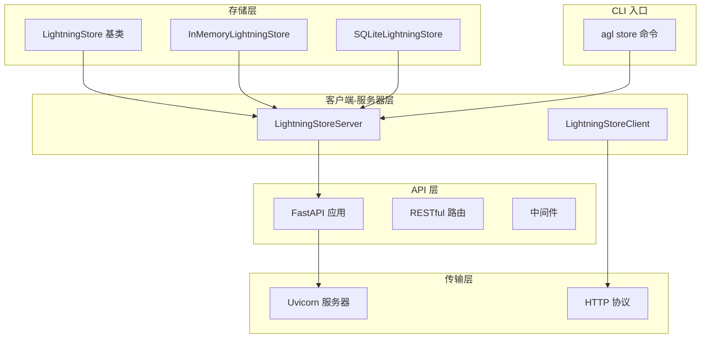
```mermaid
graph TB
subgraph "存储层"
LS[LightningStore 基类]
IMS[InMemoryLightningStore]
SQLite[SQLiteLightningStore]
end
subgraph "客户端-服务器层"
LSC[LightningStoreClient]
LSS[LightningStoreServer]
end
subgraph "API 层"
FastAPI[FastAPI 应用]
Routes[RESTful 路由]
Middleware[中间件]
end
subgraph "传输层"
Uvicorn[Uvicorn 服务器]
HTTP[HTTP 协议]
end
subgraph "CLI 入口"
CLI[agl store 命令]
end
LS --> LSS
IMS --> LSS
SQLite --> LSS
LSS --> FastAPI
FastAPI --> Uvicorn
LSC --> HTTP
CLI --> LSS
```

**图表来源**
- [client_server.py](file://agentlightning/store/client_server.py#L83-L150)
- [base.py](file://agentlightning/store/base.py#L1-L50)

**章节来源**
- [client_server.py](file://agentlightning/store/client_server.py#L1-L100)
- [base.py](file://agentlightning/store/base.py#L1-L100)

## 核心组件分析

### LightningStoreServer 类结构

LightningStoreServer 继承自 LightningStore 基类，是一个功能完整的 HTTP 服务器实现：

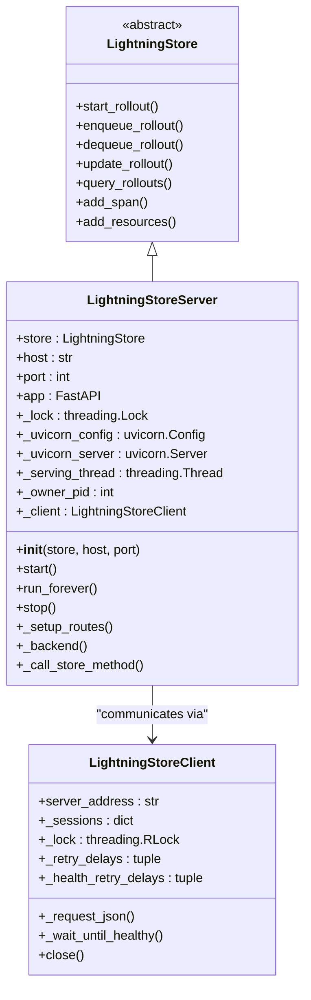
```mermaid
classDiagram
class LightningStore {
<<abstract>>
+start_rollout()
+enqueue_rollout()
+dequeue_rollout()
+update_rollout()
+query_rollouts()
+add_span()
+add_resources()
}
class LightningStoreServer {
+store : LightningStore
+host : str
+port : int
+app : FastAPI
+_lock : threading.Lock
+_uvicorn_config : uvicorn.Config
+_uvicorn_server : uvicorn.Server
+_serving_thread : threading.Thread
+_owner_pid : int
+_client : LightningStoreClient
+__init__(store, host, port)
+start()
+run_forever()
+stop()
+_setup_routes()
+_backend()
+_call_store_method()
}
class LightningStoreClient {
+server_address : str
+_sessions : dict
+_lock : threading.RLock
+_retry_delays : tuple
+_health_retry_delays : tuple
+_request_json()
+_wait_until_healthy()
+close()
}
LightningStore <|-- LightningStoreServer
LightningStoreServer --> LightningStoreClient : "communicates via"
```

**图表来源**
- [client_server.py](file://agentlightning/store/client_server.py#L83-L150)
- [base.py](file://agentlightning/store/base.py#L50-L150)

**章节来源**
- [client_server.py](file://agentlightning/store/client_server.py#L83-L200)

## 架构设计

### 整体架构图

LightningStoreServer 采用了分层架构设计，确保了良好的可维护性和扩展性：

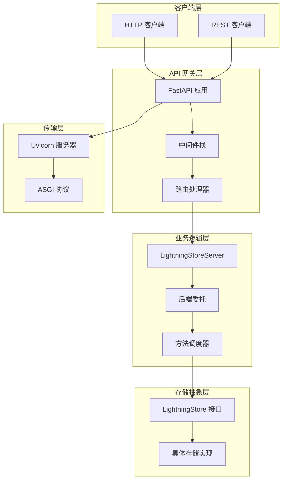
```mermaid
graph TB
subgraph "客户端层"
HTTPClient[HTTP 客户端]
RestClient[REST 客户端]
end
subgraph "API 网关层"
FastAPIApp[FastAPI 应用]
Middleware[中间件栈]
RouteHandlers[路由处理器]
end
subgraph "业务逻辑层"
ServerInstance[LightningStoreServer]
BackendDelegate[后端委托]
MethodDispatcher[方法调度器]
end
subgraph "存储抽象层"
StoreInterface[LightningStore 接口]
ConcreteStore[具体存储实现]
end
subgraph "传输层"
UvicornServer[Uvicorn 服务器]
ASGIProtocol[ASGI 协议]
end
HTTPClient --> FastAPIApp
RestClient --> FastAPIApp
FastAPIApp --> Middleware
Middleware --> RouteHandlers
RouteHandlers --> ServerInstance
ServerInstance --> BackendDelegate
BackendDelegate --> MethodDispatcher
MethodDispatcher --> StoreInterface
StoreInterface --> ConcreteStore
FastAPIApp --> UvicornServer
UvicornServer --> ASGIProtocol
```

**图表来源**
- [client_server.py](file://agentlightning/store/client_server.py#L200-L400)
- [client_server.py](file://agentlightning/store/client_server.py#L600-L800)

### 异步执行模型

服务器采用事件驱动的异步执行模型，支持高并发请求处理：

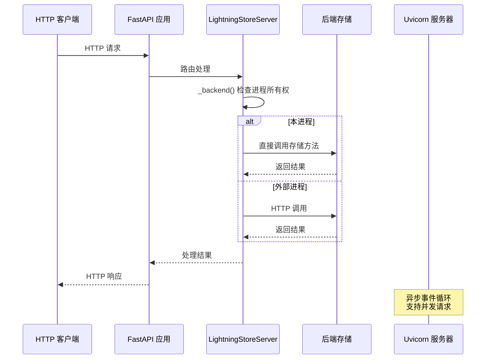
```mermaid
sequenceDiagram
participant Client as HTTP 客户端
participant FastAPI as FastAPI 应用
participant Server as LightningStoreServer
participant Backend as 后端存储
participant Uvicorn as Uvicorn 服务器
Client->>FastAPI : HTTP 请求
FastAPI->>Server : 路由处理
Server->>Server : _backend() 检查进程所有权
alt 本进程
Server->>Backend : 直接调用存储方法
Backend-->>Server : 返回结果
else 外部进程
Server->>Backend : HTTP 调用
Backend-->>Server : 返回结果
end
Server-->>FastAPI : 处理结果
FastAPI-->>Client : HTTP 响应
Note over Uvicorn : 异步事件循环<br/>支持并发请求
```

**图表来源**
- [client_server.py](file://agentlightning/store/client_server.py#L400-L500)
- [client_server.py](file://agentlightning/store/client_server.py#L600-L700)

**章节来源**
- [client_server.py](file://agentlightning/store/client_server.py#L400-L600)

## 详细组件分析

### __init__ 方法组件初始化流程

LightningStoreServer 的初始化过程包含了多个关键组件的创建和配置：

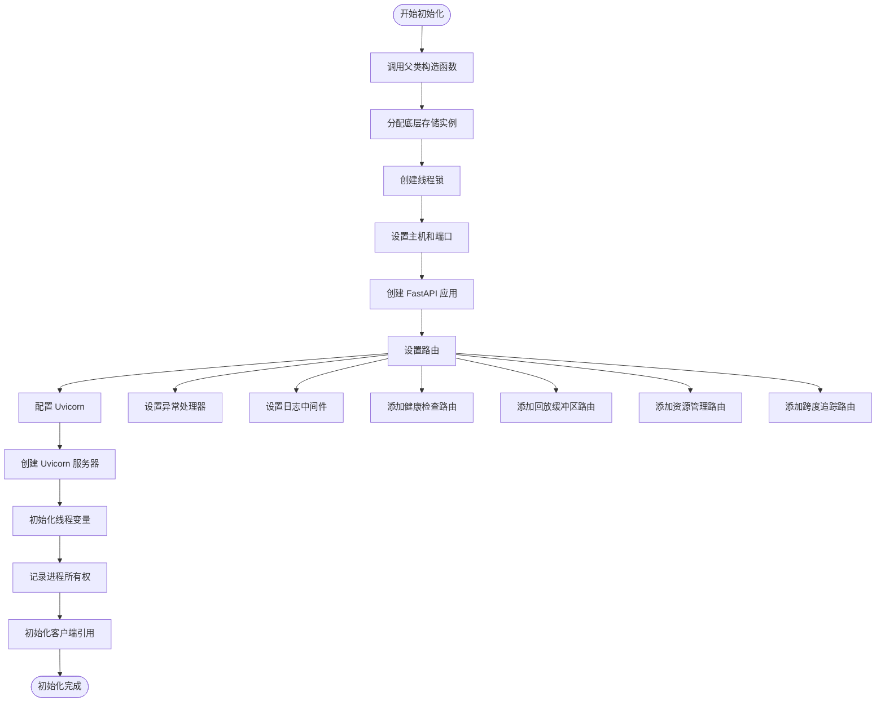
```mermaid
flowchart TD
Start([开始初始化]) --> SuperInit["调用父类构造函数"]
SuperInit --> StoreAssign["分配底层存储实例"]
StoreAssign --> LockCreate["创建线程锁"]
LockCreate --> HostPort["设置主机和端口"]
HostPort --> FastAPICreate["创建 FastAPI 应用"]
FastAPICreate --> SetupRoutes["设置路由"]
SetupRoutes --> UvicornConfig["配置 Uvicorn"]
UvicornConfig --> UvicornServer["创建 Uvicorn 服务器"]
UvicornServer --> ThreadInit["初始化线程变量"]
ThreadInit --> PIDTrack["记录进程所有权"]
PIDTrack --> ClientInit["初始化客户端引用"]
ClientInit --> End([初始化完成])
SetupRoutes --> ExceptionHandler["设置异常处理器"]
SetupRoutes --> Logger["设置日志中间件"]
SetupRoutes --> HealthRoute["添加健康检查路由"]
SetupRoutes --> RolloutRoutes["添加回放缓冲区路由"]
SetupRoutes --> ResourceRoutes["添加资源管理路由"]
SetupRoutes --> SpanRoutes["添加跨度追踪路由"]
```

**图表来源**
- [client_server.py](file://agentlightning/store/client_server.py#L95-L120)

#### FastAPI 应用配置

FastAPI 应用的配置体现了服务器的专业性和可靠性：

| 配置项 | 值 | 说明 |
|--------|-----|------|
| title | "LightningStore Server" | 应用名称标识 |
| debug | False | 生产环境禁用调试模式 |
| openapi_url | "/openapi.json" | OpenAPI 规范路径 |
| docs_url | "/docs" | Swagger UI 路径 |
| redoc_url | "/redoc" | ReDoc 文档路径 |

#### Uvicorn 服务器配置

Uvicorn 服务器的配置参数确保了生产环境的稳定性：

| 配置项 | 值 | 说明 |
|--------|-----|------|
| host | "0.0.0.0" | 监听所有网络接口 |
| port | 动态端口 | 支持自定义端口配置 |
| log_level | "error" | 错误级别日志输出 |
| workers | 1 | 单进程模式避免并发问题 |
| reload | False | 生产环境禁用自动重载 |

**章节来源**
- [client_server.py](file://agentlightning/store/client_server.py#L95-L150)

### 生命周期管理方法

#### start 方法实现机制

start 方法负责启动后台服务器线程，采用异步启动和健康检查机制：

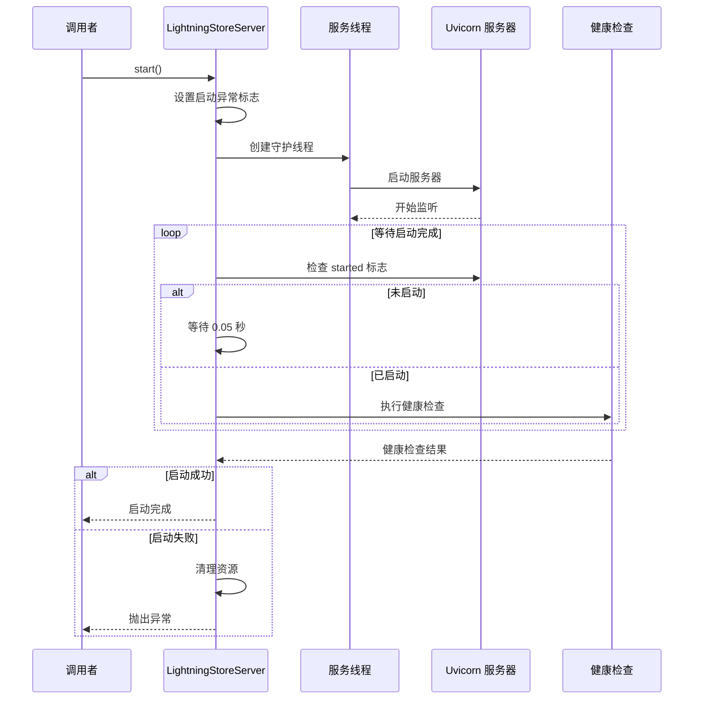
```mermaid
sequenceDiagram
participant Caller as 调用者
participant Server as LightningStoreServer
participant Thread as 服务线程
participant Uvicorn as Uvicorn 服务器
participant Health as 健康检查
Caller->>Server : start()
Server->>Server : 设置启动异常标志
Server->>Thread : 创建守护线程
Thread->>Uvicorn : 启动服务器
Uvicorn-->>Thread : 开始监听
loop 等待启动完成
Server->>Uvicorn : 检查 started 标志
alt 未启动
Server->>Server : 等待 0.05 秒
else 已启动
Server->>Health : 执行健康检查
end
end
Health-->>Server : 健康检查结果
alt 启动成功
Server-->>Caller : 启动完成
else 启动失败
Server->>Server : 清理资源
Server-->>Caller : 抛出异常
end
```

**图表来源**
- [client_server.py](file://agentlightning/store/client_server.py#L150-L200)

#### run_forever 方法异步执行模型

run_forever 方法提供了无限期运行服务器的能力，同时保持优雅的错误处理：

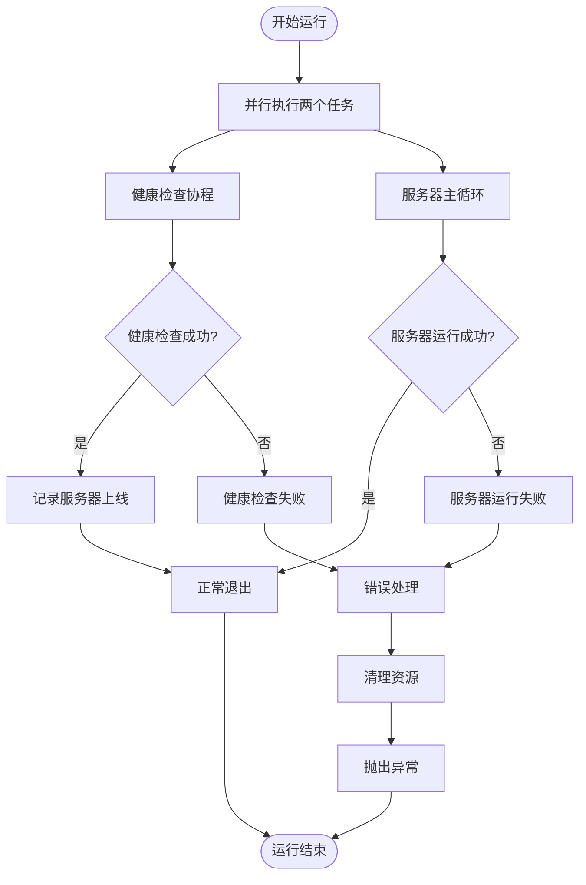
```mermaid
flowchart TD
Start([开始运行]) --> ParallelExec["并行执行两个任务"]
ParallelExec --> HealthCheck["健康检查协程"]
ParallelExec --> ServeLoop["服务器主循环"]
HealthCheck --> HealthSuccess{"健康检查成功?"}
HealthSuccess --> |是| LogOnline["记录服务器上线"]
HealthSuccess --> |否| HealthFail["健康检查失败"]
ServeLoop --> ServeSuccess{"服务器运行成功?"}
ServeSuccess --> |是| NormalExit["正常退出"]
ServeSuccess --> |否| ServeFail["服务器运行失败"]
HealthFail --> ErrorHandling["错误处理"]
ServeFail --> ErrorHandling
ErrorHandling --> Cleanup["清理资源"]
Cleanup --> RaiseException["抛出异常"]
LogOnline --> NormalExit
NormalExit --> End([运行结束])
RaiseException --> End
```

**图表来源**
- [client_server.py](file://agentlightning/store/client_server.py#L250-L300)

#### stop 方法优雅关闭机制

stop 方法确保服务器能够安全地停止，不会导致数据丢失或损坏：

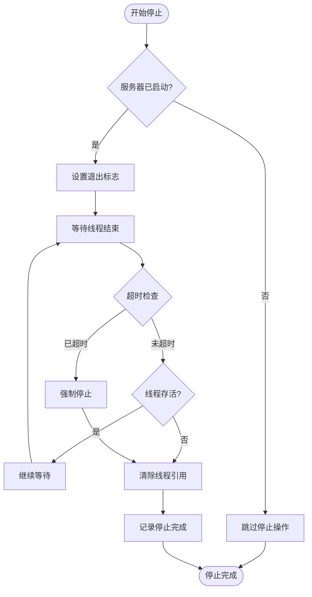
```mermaid
flowchart TD
Start([开始停止]) --> CheckStarted{"服务器已启动?"}
CheckStarted --> |否| LogSkip["跳过停止操作"]
CheckStarted --> |是| SetExitFlag["设置退出标志"]
SetExitFlag --> JoinThread["等待线程结束"]
JoinThread --> Timeout{"超时检查"}
Timeout --> |未超时| ThreadAlive{"线程存活?"}
Timeout --> |已超时| ForceStop["强制停止"]
ThreadAlive --> |是| ContinueWait["继续等待"]
ThreadAlive --> |否| ClearThread["清除线程引用"]
ContinueWait --> JoinThread
ForceStop --> ClearThread
ClearThread --> LogStopped["记录停止完成"]
LogSkip --> End([停止完成])
LogStopped --> End
```

**图表来源**
- [client_server.py](file://agentlightning/store/client_server.py#L300-L350)

**章节来源**
- [client_server.py](file://agentlightning/store/client_server.py#L150-L350)

## RESTful API 端点

### _setup_routes 方法路由定义

_setup_routes 方法定义了完整的 RESTful API 端点，涵盖了所有存储操作：

#### 中间件系统

服务器实现了两层中间件系统：

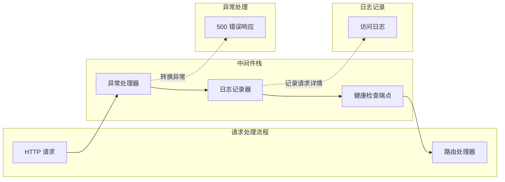
```mermaid
graph LR
subgraph "中间件栈"
ExceptionHandler["异常处理器"]
Logger["日志记录器"]
HealthEndpoint["健康检查端点"]
end
subgraph "请求处理流程"
Request[HTTP 请求] --> ExceptionHandler
ExceptionHandler --> Logger
Logger --> HealthEndpoint
HealthEndpoint --> Handler[路由处理器]
end
subgraph "异常处理"
ExceptionHandler -.->|转换异常| ErrorResponse[500 错误响应]
end
subgraph "日志记录"
Logger -.->|记录请求详情| AccessLog[访问日志]
end
```

**图表来源**
- [client_server.py](file://agentlightning/store/client_server.py#L400-L500)

#### 回放缓冲区端点

| 端点 | 方法 | 描述 | 请求模型 | 响应模型 |
|------|------|------|----------|----------|
| `/agl/v1/queues/rollouts/enqueue` | POST | 将回放缓冲区排队 | RolloutRequest | Rollout |
| `/agl/v1/queues/rollouts/dequeue` | POST | 从队列中取出回放 | 无 | AttemptedRollout |
| `/agl/v1/rollouts` | POST | 创建新的回放尝试 | RolloutRequest | AttemptedRollout |
| `/agl/v1/rollouts` | GET | 查询回放列表 | 查询参数 | List[Rollout] |
| `/agl/v1/rollouts/search` | POST | 搜索特定状态的回放 | QueryRolloutsRequest | List[Rollout] |
| `/agl/v1/rollouts/{rollout_id}` | GET | 获取指定回放 | 路径参数 | Rollout |
| `/agl/v1/rollouts/{rollout_id}` | POST | 更新回放状态 | UpdateRolloutRequest | Rollout |

#### 资源管理端点

| 端点 | 方法 | 描述 | 请求模型 | 响应模型 |
|------|------|------|----------|----------|
| `/agl/v1/resources` | POST | 添加新资源快照 | NamedResources | ResourcesUpdate |
| `/agl/v1/resources/latest` | GET | 获取最新资源快照 | 无 | ResourcesUpdate |
| `/agl/v1/resources/{resources_id}` | GET | 获取指定资源快照 | 路径参数 | ResourcesUpdate |
| `/agl/v1/resources/{resources_id}` | POST | 更新资源快照 | NamedResources | ResourcesUpdate |

#### 跨度追踪端点

| 端点 | 方法 | 描述 | 请求模型 | 响应模型 |
|------|------|------|----------|----------|
| `/agl/v1/spans` | POST | 添加跨度记录 | Span | Span |
| `/agl/v1/spans` | GET | 查询跨度记录 | 查询参数 | List[Span] |
| `/agl/v1/spans/next` | POST | 获取下一个跨度序号 | NextSequenceIdRequest | NextSequenceIdResponse |

#### 等待和查询端点

| 端点 | 方法 | 描述 | 请求模型 | 响应模型 |
|------|------|------|----------|----------|
| `/agl/v1/waits/rollouts` | POST | 等待回放完成 | WaitForRolloutsRequest | List[Rollout] |

**章节来源**
- [client_server.py](file://agentlightning/store/client_server.py#L400-L700)

### 错误处理策略

#### 异常转换机制

服务器实现了智能的异常处理策略，区分应用错误和传输错误：

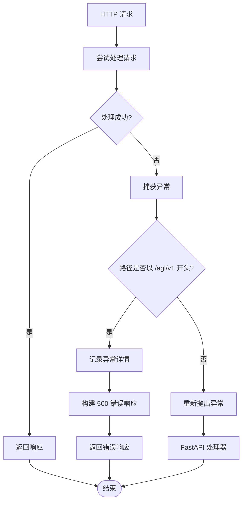
```mermaid
flowchart TD
Request[HTTP 请求] --> TryCatch["尝试处理请求"]
TryCatch --> Success{"处理成功?"}
Success --> |是| ReturnResponse["返回响应"]
Success --> |否| CatchException["捕获异常"]
CatchException --> CheckPath{"路径是否以 /agl/v1 开头?"}
CheckPath --> |否| RethrowException["重新抛出异常"]
CheckPath --> |是| LogException["记录异常详情"]
LogException --> BuildErrorResponse["构建 500 错误响应"]
BuildErrorResponse --> ReturnErrorResponse["返回错误响应"]
ReturnResponse --> End([结束])
ReturnErrorResponse --> End
RethrowException --> FastAPIHandler["FastAPI 处理器"]
FastAPIHandler --> End
```

**图表来源**
- [client_server.py](file://agentlightning/store/client_server.py#L400-L450)

#### HTTP 状态码映射

| 异常类型 | HTTP 状态码 | 说明 |
|----------|-------------|------|
| 应用级错误 (4xx) | 保留给客户端 | 不重试，客户端修正 |
| 网络错误 | 500 | 可能重试，客户端决定 |
| 服务器内部错误 | 500 | 可能重试，客户端决定 |
| 健康检查失败 | 503 | 服务不可用 |

**章节来源**
- [client_server.py](file://agentlightning/store/client_server.py#L400-L500)

## 进程所有权机制

### _owner_pid 机制设计

LightningStoreServer 实现了精密的进程所有权机制，防止跨进程状态不一致：

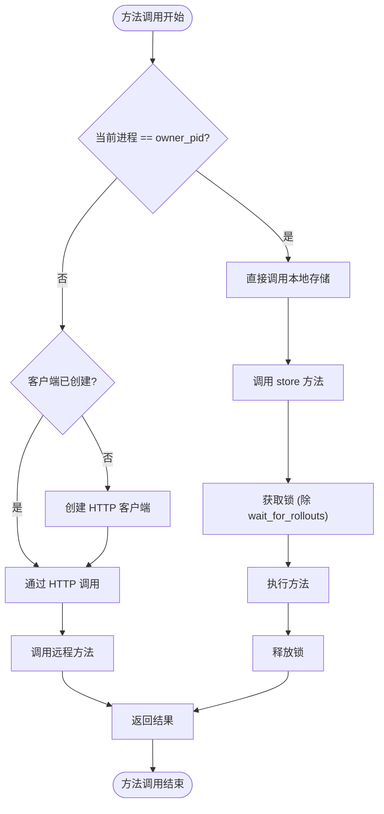
```mermaid
flowchart TD
Start([方法调用开始]) --> CheckPID{"当前进程 == owner_pid?"}
CheckPID --> |是| DirectCall["直接调用本地存储"]
CheckPID --> |否| CheckClient{"客户端已创建?"}
CheckClient --> |否| CreateClient["创建 HTTP 客户端"]
CheckClient --> |是| HTTPCall["通过 HTTP 调用"]
CreateClient --> HTTPCall
DirectCall --> LocalMethod["调用 store 方法"]
HTTPCall --> RemoteMethod["调用远程方法"]
LocalMethod --> LockAcquire["获取锁 (除 wait_for_rollouts)"]
LockAcquire --> ExecuteMethod["执行方法"]
ExecuteMethod --> ReleaseLock["释放锁"]
RemoteMethod --> ReturnResult["返回结果"]
ReleaseLock --> ReturnResult
ReturnResult --> End([方法调用结束])
```

**图表来源**
- [client_server.py](file://agentlightning/store/client_server.py#L350-L400)

### 进程隔离保护

#### 序列化限制

为了防止进程间数据污染，服务器对可序列化对象进行了严格控制：

| 对象类型 | 序列化内容 | 说明 |
|----------|------------|------|
| LightningStoreServer | store, host, port, _owner_pid | 排除 FastAPI 和 Uvicorn 实例 |
| LightningStoreClient | server_address, _retry_delays, _health_retry_delays | 排除 aiohttp 会话 |

#### 并发控制策略

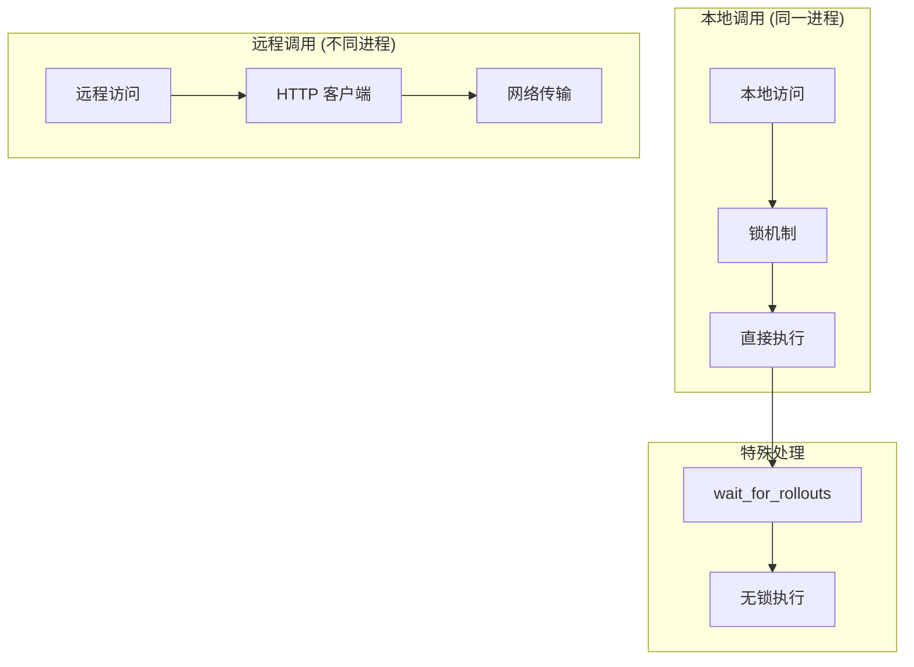
```mermaid
graph TB
subgraph "本地调用 (同一进程)"
LocalAccess[本地访问]
LockMechanism[锁机制]
DirectExecution[直接执行]
end
subgraph "远程调用 (不同进程)"
RemoteAccess[远程访问]
HTTPClient[HTTP 客户端]
NetworkTransport[网络传输]
end
subgraph "特殊处理"
WaitMethod[wait_for_rollouts]
NoLock[无锁执行]
end
LocalAccess --> LockMechanism
LockMechanism --> DirectExecution
DirectExecution --> WaitMethod
WaitMethod --> NoLock
RemoteAccess --> HTTPClient
HTTPClient --> NetworkTransport
```

**图表来源**
- [client_server.py](file://agentlightning/store/client_server.py#L700-L800)

**章节来源**
- [client_server.py](file://agentlightning/store/client_server.py#L350-L450)

## 序列化与反序列化

### __getstate__ 和 __setstate__ 实现

LightningStoreServer 和 LightningStoreClient 都实现了自定义的序列化机制：

#### LightningStoreServer 序列化

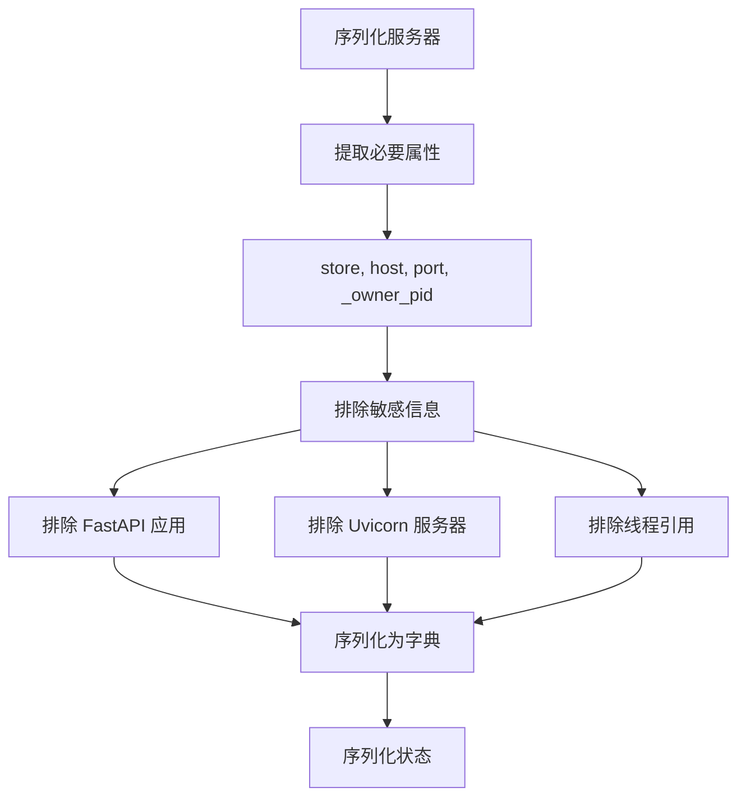
```mermaid
flowchart TD
PickleServer[序列化服务器] --> ExtractEssential["提取必要属性"]
ExtractEssential --> StoreAttr["store, host, port, _owner_pid"]
StoreAttr --> ExcludeSensitive["排除敏感信息"]
ExcludeSensitive --> FastAPIExclude["排除 FastAPI 应用"]
ExcludeSensitive --> UvicornExclude["排除 Uvicorn 服务器"]
ExcludeSensitive --> ThreadExclude["排除线程引用"]
FastAPIExclude --> SerializeDict["序列化为字典"]
UvicornExclude --> SerializeDict
ThreadExclude --> SerializeDict
SerializeDict --> SerializedState["序列化状态"]
```

**图表来源**
- [client_server.py](file://agentlightning/store/client_server.py#L120-L140)

#### LightningStoreClient 序列化

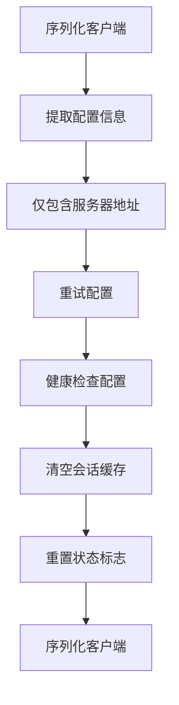
```mermaid
flowchart TD
PickleClient[序列化客户端] --> ExtractConfig["提取配置信息"]
ExtractConfig --> AddressOnly["仅包含服务器地址"]
AddressOnly --> RetryConfig["重试配置"]
RetryConfig --> HealthConfig["健康检查配置"]
HealthConfig --> ClearSessions["清空会话缓存"]
ClearSessions --> ResetFlags["重置状态标志"]
ResetFlags --> SerializeClient["序列化客户端"]
```

**图表来源**
- [client_server.py](file://agentlightning/store/client_server.py#L660-L690)

### 序列化安全性

#### 数据完整性保护

| 保护措施 | 实现方式 | 目的 |
|----------|----------|------|
| 排除敏感对象 | 不序列化 FastAPI/Uvicorn 实例 | 防止状态泄露 |
| 清空连接池 | 序列化时清空 aiohttp 会话 | 避免连接冲突 |
| 重置状态标志 | 重置成功/失败计数器 | 确保独立状态 |
| 重建客户端 | 子进程中重新创建客户端 | 避免进程间干扰 |

**章节来源**
- [client_server.py](file://agentlightning/store/client_server.py#L120-L150)
- [client_server.py](file://agentlightning/store/client_server.py#L660-L700)

## 性能优化与最佳实践

### 并发性能优化

#### 异步请求处理

服务器采用多种策略优化并发性能：

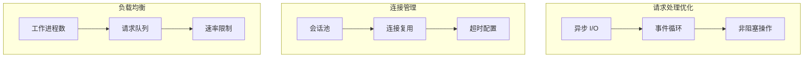
```mermaid
graph TB
subgraph "请求处理优化"
AsyncIO[异步 I/O]
EventLoop[事件循环]
NonBlocking[非阻塞操作]
end
subgraph "连接管理"
SessionPool[会话池]
ConnectionReuse[连接复用]
TimeoutConfig[超时配置]
end
subgraph "负载均衡"
WorkerCount[工作进程数]
RequestQueue[请求队列]
RateLimiting[速率限制]
end
AsyncIO --> EventLoop
EventLoop --> NonBlocking
SessionPool --> ConnectionReuse
ConnectionReuse --> TimeoutConfig
WorkerCount --> RequestQueue
RequestQueue --> RateLimiting
```

#### 性能监控指标

| 指标类别 | 监控项目 | 测量单位 | 用途 |
|----------|----------|----------|------|
| 响应时间 | 请求处理延迟 | 毫秒 | 性能评估 |
| 吞吐量 | 每秒请求数 | QPS | 容量规划 |
| 错误率 | 失败请求比例 | 百分比 | 可靠性监控 |
| 资源使用 | CPU/内存占用 | 百分比 | 资源优化 |

### 部署最佳实践

#### 生产环境配置

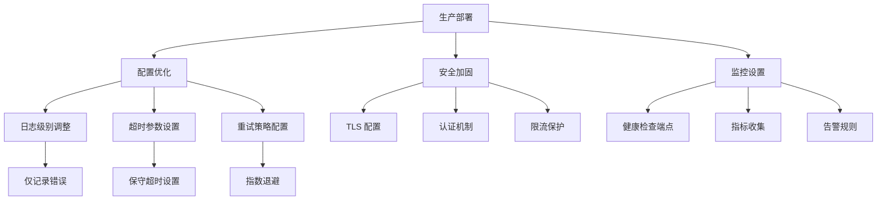
```mermaid
flowchart TD
ProductionDeploy[生产部署] --> ConfigOptimization["配置优化"]
ConfigOptimization --> LoggingLevel["日志级别调整"]
ConfigOptimization --> TimeoutSettings["超时参数设置"]
ConfigOptimization --> RetryPolicy["重试策略配置"]
LoggingLevel --> ErrorOnly["仅记录错误"]
TimeoutSettings --> ConservativeTimeout["保守超时设置"]
RetryPolicy --> ExponentialBackoff["指数退避"]
ProductionDeploy --> SecurityHardening["安全加固"]
SecurityHardening --> TLSConfig["TLS 配置"]
SecurityHardening --> AuthMechanism["认证机制"]
SecurityHardening --> RateLimiting["限流保护"]
ProductionDeploy --> MonitoringSetup["监控设置"]
MonitoringSetup --> HealthEndpoints["健康检查端点"]
MonitoringSetup --> MetricsCollection["指标收集"]
MonitoringSetup --> AlertingRules["告警规则"]
```

#### 性能调优建议

| 调优方向 | 具体建议 | 预期效果 |
|----------|----------|----------|
| 线程池配置 | 根据 CPU 核心数设置 | 提高并发处理能力 |
| 内存管理 | 合理设置 GC 参数 | 减少内存碎片 |
| 网络优化 | 启用 TCP_NODELAY | 降低延迟 |
| 缓存策略 | 实施适当的缓存 | 提高响应速度 |

### 容错与恢复

#### 自动恢复机制

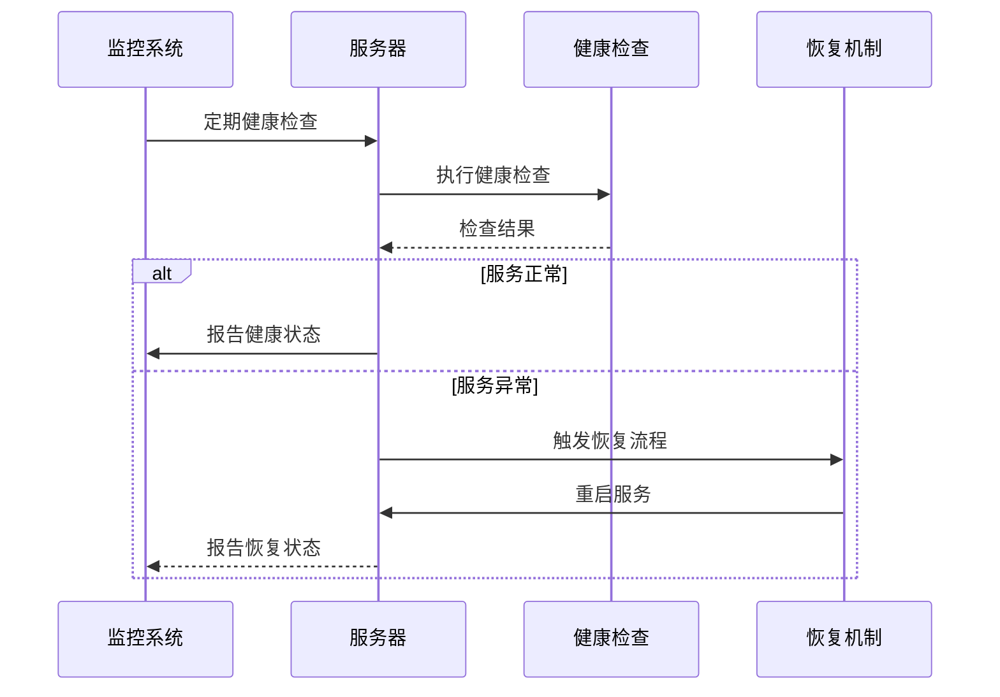
```mermaid
sequenceDiagram
participant Monitor as 监控系统
participant Server as 服务器
participant HealthCheck as 健康检查
participant Recovery as 恢复机制
Monitor->>Server : 定期健康检查
Server->>HealthCheck : 执行健康检查
HealthCheck-->>Server : 检查结果
alt 服务正常
Server->>Monitor : 报告健康状态
else 服务异常
Server->>Recovery : 触发恢复流程
Recovery->>Server : 重启服务
Server-->>Monitor : 报告恢复状态
end
```

**图表来源**
- [client_server.py](file://agentlightning/store/client_server.py#L200-L250)

## 故障排除指南

### 常见启动问题

#### 端口冲突诊断

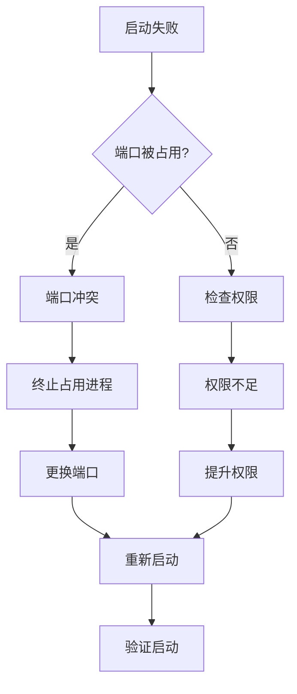
```mermaid
flowchart TD
StartupFail[启动失败] --> CheckPort{"端口被占用?"}
CheckPort --> |是| PortConflict["端口冲突"]
CheckPort --> |否| CheckPermission["检查权限"]
PortConflict --> KillProcess["终止占用进程"]
KillProcess --> ChangePort["更换端口"]
ChangePort --> RestartServer["重新启动"]
CheckPermission --> PermissionDenied["权限不足"]
PermissionDenied --> ElevatePrivileges["提升权限"]
ElevatePrivileges --> RestartServer
RestartServer --> VerifyStartup["验证启动"]
```

#### 启动失败原因分析

| 错误类型 | 可能原因 | 解决方案 |
|----------|----------|----------|
| SystemExit | 端口已被占用 | 更换端口或终止占用进程 |
| OSError | 权限不足 | 使用 sudo 或更改端口权限 |
| RuntimeError | 启动超时 | 检查网络配置和防火墙设置 |
| ImportError | 依赖缺失 | 安装缺失的 Python 包 |

### 运行时问题诊断

#### 性能问题排查

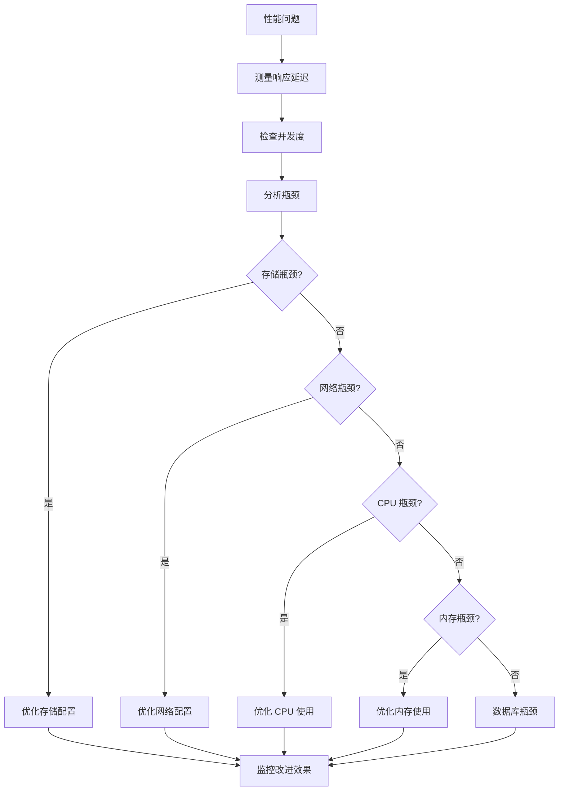
```mermaid
flowchart TD
PerformanceIssue[性能问题] --> MeasureLatency["测量响应延迟"]
MeasureLatency --> CheckConcurrency["检查并发度"]
CheckConcurrency --> AnalyzeBottleneck["分析瓶颈"]
AnalyzeBottleneck --> StorageBottleneck{"存储瓶颈?"}
StorageBottleneck --> |是| OptimizeStorage["优化存储配置"]
StorageBottleneck --> |否| NetworkBottleneck{"网络瓶颈?"}
NetworkBottleneck --> |是| OptimizeNetwork["优化网络配置"]
NetworkBottleneck --> |否| CPUBottleneck{"CPU 瓶颈?"}
CPUBottleneck --> |是| OptimizeCPU["优化 CPU 使用"]
CPUBottleneck --> |否| MemoryBottleneck{"内存瓶颈?"}
MemoryBottleneck --> |是| OptimizeMemory["优化内存使用"]
MemoryBottleneck --> |否| DatabaseBottleneck["数据库瓶颈"]
OptimizeStorage --> MonitorImprovement["监控改进效果"]
OptimizeNetwork --> MonitorImprovement
OptimizeCPU --> MonitorImprovement
OptimizeMemory --> MonitorImprovement
DatabaseBottleneck --> MonitorImprovement
```

#### 错误日志分析

| 日志级别 | 关键词 | 处理建议 |
|----------|--------|----------|
| ERROR | "Server failed to start" | 检查配置和依赖 |
| WARNING | "dequeue_rollout failed" | 检查网络连接 |
| DEBUG | "Unhandled application error" | 检查应用程序逻辑 |

### 监控和维护

#### 健康检查配置

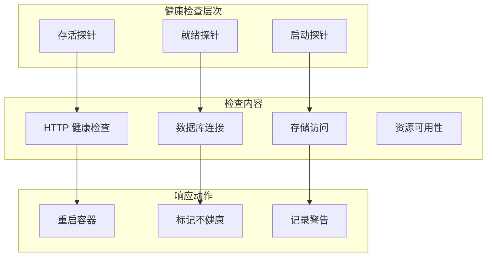
```mermaid
graph TB
subgraph "健康检查层次"
LivenessProbe["存活探针"]
ReadinessProbe["就绪探针"]
StartupProbe["启动探针"]
end
subgraph "检查内容"
HTTPHealth["HTTP 健康检查"]
DatabaseConnect["数据库连接"]
StorageAccess["存储访问"]
ResourceAvailability["资源可用性"]
end
subgraph "响应动作"
RestartContainer["重启容器"]
MarkUnhealthy["标记不健康"]
LogWarning["记录警告"]
end
LivenessProbe --> HTTPHealth
ReadinessProbe --> DatabaseConnect
StartupProbe --> StorageAccess
HTTPHealth --> RestartContainer
DatabaseConnect --> MarkUnhealthy
StorageAccess --> LogWarning
```

**章节来源**
- [client_server.py](file://agentlightning/store/client_server.py#L200-L350)
- [test_client_server.py](file://tests/store/test_client_server.py#L50-L100)

## 总结

LightningStoreServer 是一个设计精良的 HTTP 服务器实现，具有以下核心优势：

### 技术特点

1. **异步架构**：基于 FastAPI 和 Uvicorn 的高性能异步处理
2. **进程安全**：完善的进程所有权机制防止状态不一致
3. **容错设计**：多层次的错误处理和恢复机制
4. **可扩展性**：模块化的架构支持功能扩展
5. **生产就绪**：完整的监控、日志和运维支持

### 架构优势

- **清晰的分层**：从客户端到存储层的明确职责分离
- **灵活的配置**：支持多种存储后端和部署模式
- **强大的 API**：完整的 RESTful 接口覆盖所有业务需求
- **安全可靠**：进程隔离和数据完整性保护

### 最佳实践建议

1. **部署前准备**：充分测试配置和依赖关系
2. **监控设置**：建立完善的监控和告警体系
3. **性能优化**：根据实际负载调整资源配置
4. **安全考虑**：实施适当的安全防护措施
5. **维护计划**：制定定期维护和升级策略

LightningStoreServer 为 Agent Lightning 生态系统提供了稳定可靠的存储服务基础设施，是构建大规模分布式 AI 应用的重要组件。