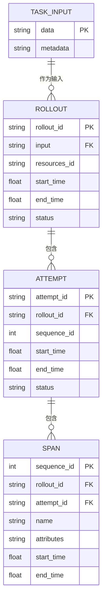
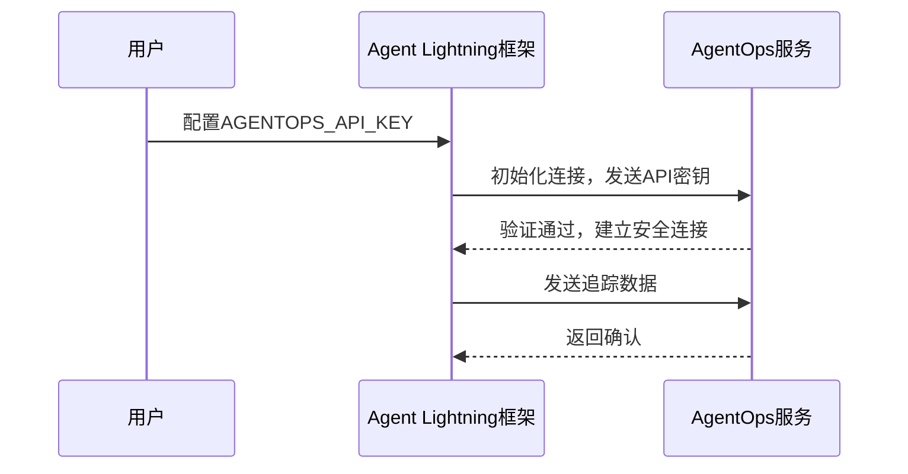
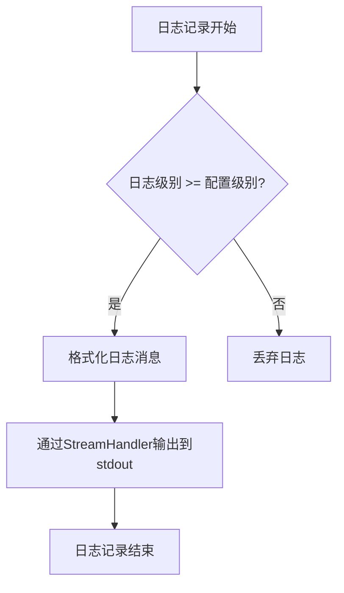

# 安全与合规

<cite>
**本文档中引用的文件**  
- [SECURITY.md](file://SECURITY.md)
- [RAI_README.md](file://RAI_README.md)
- [README.md](file://README.md)
- [pyproject.toml](file://pyproject.toml)
- [agentlightning/tracer/agentops.py](file://agentlightning/tracer/agentops.py)
- [agentlightning/instrumentation/agentops.py](file://agentlightning/instrumentation/agentops.py)
- [agentlightning/store/base.py](file://agentlightning/store/base.py)
- [agentlightning/config.py](file://agentlightning/config.py)
- [agentlightning/logging.py](file://agentlightning/logging.py)
- [agentlightning/types/core.py](file://agentlightning/types/core.py)
</cite>

## 目录
1. [引言](#引言)
2. [数据隐私保护](#数据隐私保护)
3. [系统安全措施](#系统安全措施)
4. [监控系统集成安全](#监控系统集成安全)
5. [负责任AI实践](#负责任ai实践)
6. [漏洞报告与应急响应](#漏洞报告与应急响应)

## 引言

Agent Lightning 是一个灵活且可扩展的框架，旨在为任何现有的智能体框架实现无缝的智能体优化。该框架支持多种数据驱动技术，包括模型微调、提示优化和模型选择等，以提升智能体在特定场景下的性能。本安全与合规文档详细阐述了框架在数据隐私、系统安全、监控集成和负责任AI方面的设计原则与实施措施，确保其在研究和开发环境中的安全可靠使用。

**Section sources**
- [README.md](file://README.md#L0-L109)
- [RAI_README.md](file://RAI_README.md#L0-L77)

## 数据隐私保护

Agent Lightning 框架本身不直接收集或存储用户敏感数据。数据处理和存储的责任主要由框架的使用者承担。框架的设计遵循最小权限原则，仅在必要时通过可配置的组件与外部系统（如数据库、API）进行交互。

数据隐私保护的核心在于用户对数据生命周期的控制。框架通过 `LightningStore` 组件管理训练过程中的任务、资源和追踪数据。所有数据的存储和访问都依赖于用户配置的后端实现，例如内存存储、SQLite 或客户端-服务器模式。用户必须确保所选存储后端符合相关的数据保护法规（如GDPR、CCPA），并对存储的数据进行适当的加密和访问控制。

框架通过 `TaskInput` 和 `Rollout` 等数据模型定义了任务输入和执行记录的结构。这些模型允许用户定义任意的负载（`Any` 类型），这意味着用户有责任确保输入数据不包含个人身份信息（PII）或敏感信息。如果必须处理敏感数据，建议在输入到框架前进行匿名化或脱敏处理。

**Diagram sources**
- [agentlightning/types/core.py](file://agentlightning/types/core.py#L0-L395)
- [agentlightning/store/base.py](file://agentlightning/store/base.py#L0-L515)

## 系统安全措施

### 认证与授权
Agent Lightning 框架本身不提供内置的认证和授权机制。其安全性依赖于部署环境和集成的外部服务。例如，当使用 `AgentOps` 进行监控时，认证由 `AgentOps` 服务处理，用户需要通过 `AGENTOPS_API_KEY` 环境变量提供API密钥。框架代码中包含对这些环境变量的设置逻辑，确保密钥在运行时被正确传递。

**Diagram sources**
- [agentlightning/tracer/agentops.py](file://agentlightning/tracer/agentops.py#L0-L373)

### 输入验证与安全
框架对用户输入的验证主要集中在配置层面。`config.py` 文件中的 `lightning_cli` 函数负责解析命令行参数，并通过类型检查和自定义转换函数（如 `nullable_str`, `_str_to_bool`）来确保输入值的合法性。这有助于防止因格式错误的输入导致的意外行为。

对于智能体执行过程中可能产生的恶意输出（如SQL注入、命令注入），框架本身不提供直接的防护。防护责任在于智能体的开发者和所集成的工具。例如，在 `examples/spider` 示例中，`sql_agent.py` 通过 `init_chat_model` 创建LLM实例，并依赖于LLM服务自身的安全过滤机制。开发者应选择具备强大安全防护能力的LLM服务（如Azure OpenAI），并实施输出验证和清理策略。

**Section sources**
- [agentlightning/config.py](file://agentlightning/config.py#L0-L348)
- [examples/spider/sql_agent.py](file://examples/spider/sql_agent.py#L185-L224)

### 安全日志与审计
框架通过 `logging.py` 模块提供统一的日志记录功能。`configure_logger` 函数创建了一个格式化一致的命名空间日志记录器，所有组件（如 `client`, `server`, `llm_proxy`）都使用此日志器。日志级别可配置，支持 `INFO` 和 `DEBUG` 等级别，便于调试和审计。日志信息包含时间戳、进程ID、日志级别和消息内容，有助于追踪系统行为和排查问题。

**Diagram sources**
- [agentlightning/logging.py](file://agentlightning/logging.py#L0-L54)

## 监控系统集成安全

Agent Lightning 框架集成了 AgentOps 和 OpenTelemetry (OTel) 作为其核心监控系统，用于追踪智能体的执行过程、收集性能指标和生成训练数据。

### AgentOps 集成
`agentlightning/tracer/agentops.py` 模块实现了 `AgentOpsTracer` 类，负责与 AgentOps 服务的集成。该集成的安全考虑包括：
- **API密钥管理**：API密钥通过环境变量 `AGENTOPS_API_KEY` 注入，避免了在代码中硬编码密钥。
- **本地服务器**：框架提供了 `agentops_local_server` 函数，可以启动一个本地Flask服务器用于测试集成，避免在开发阶段暴露生产密钥。
- **自动注入**：`instrument_all` 函数会自动为支持的库（如OpenAI）打补丁以捕获调用，此过程通过 `instrument_agentops` 函数实现，确保了追踪的完整性。

### OpenTelemetry 集成
`agentlightning/tracer/otel.py` 模块提供了 `OtelTracer` 类，用于基本的OpenTelemetry追踪。它利用 `opentelemetry-sdk` 创建 `TracerProvider` 并添加自定义的 `LightningSpanProcessor` 来处理和存储追踪数据。OTel的集成允许将追踪数据导出到各种后端（如Jaeger、Zipkin），其安全性依赖于这些后端的配置，例如使用TLS加密传输和基于角色的访问控制。

两种监控系统都通过 `LightningSpanProcessor` 将 `ReadableSpan` 对象持久化到 `LightningStore` 中，确保了追踪数据的集中管理和安全存储。

**Section sources**
- [agentlightning/tracer/agentops.py](file://agentlightning/tracer/agentops.py#L0-L373)
- [agentlightning/tracer/otel.py](file://agentlightning/tracer/otel.py#L0-L95)
- [agentlightning/instrumentation/agentops.py](file://agentlightning/instrumentation/agentops.py#L170-L213)

## 负责任AI实践

Agent Lightning 框架的设计和发布遵循微软的负责任AI标准，旨在促进AI技术的安全、公平和透明使用。

### 设计原则
根据 `RAI_README.md`，框架的设计原则包括：
- **明确的使用范围**：框架专为AI智能体研究人员和开发者设计，不适用于不熟悉机器学习概念的用户。
- **非商业用途**：框架主要用于研究目的，不推荐在商业或现实世界应用中直接使用，需经过进一步的测试和开发。
- **高风险领域规避**：明确不推荐在执法、法律、金融或医疗等高风险决策领域使用，以防止不准确的输出对个人造成伤害。

### 偏见缓解
框架本身不直接提供偏见缓解算法。偏见缓解的责任主要在于：
1.  **基础模型选择**：开发者应谨慎选择基础大语言模型（LLM），优先考虑那些经过良好训练、偏见较小的模型。
2.  **训练数据质量**：训练数据的质量和代表性对最终模型的公平性至关重要。用户有责任确保数据集的合法性和伦理性，避免包含有偏见或歧视性内容。
3.  **算法设计**：在实现自定义优化算法时，可以融入公平性约束或去偏见技术。

### 透明度与可解释性
框架通过强大的追踪系统实现了高度的透明度和可解释性：
- **完整追踪**：通过集成 AgentOps 和 OTel，框架能够捕获智能体执行过程中的每一个步骤，包括提示、工具调用、LLM响应和奖励计算。
- **结构化数据**：所有追踪数据以结构化的 `Span` 对象形式存储在 `LightningStore` 中，便于查询、分析和可视化。
- **可追溯性**：每个 `Rollout` 和 `Attempt` 都有唯一的ID，可以将最终的决策结果追溯到完整的执行轨迹，这对于调试和理解模型行为至关重要。

**Section sources**
- [RAI_README.md](file://RAI_README.md#L0-L77)
- [agentlightning/store/base.py](file://agentlightning/store/base.py#L0-L515)

## 漏洞报告与应急响应

### 漏洞报告流程
Agent Lightning 项目高度重视其软件产品的安全性。根据 `SECURITY.md` 文件的明确指示：
- **切勿通过公开的GitHub Issues报告安全漏洞**。公开披露漏洞可能会使系统和用户面临不必要的风险。
- 所有安全漏洞的报告应遵循微软官方仓库的最新指导方针。请访问 [https://aka.ms/SECURITY.md](https://aka.ms/SECURITY.md) 获取安全报告信息、位置、联系信息和相关政策。

### 应急响应机制
虽然代码库中未详细描述内部应急响应流程，但作为微软的开源项目，它遵循微软成熟的安全事件响应标准。一旦收到通过正确渠道报告的严重安全问题，项目团队将：
1.  **确认与评估**：迅速确认漏洞的存在和严重性。
2.  **修复与测试**：在隔离环境中开发修复补丁，并进行全面测试。
3.  **发布更新**：尽快发布安全更新（如新版本的PyPI包）。
4.  **通知用户**：通过项目文档（如 `SECURITY.md`）和发布说明通知用户安全更新，并提供升级指南。

**Section sources**
- [SECURITY.md](file://SECURITY.md#L0-L14)