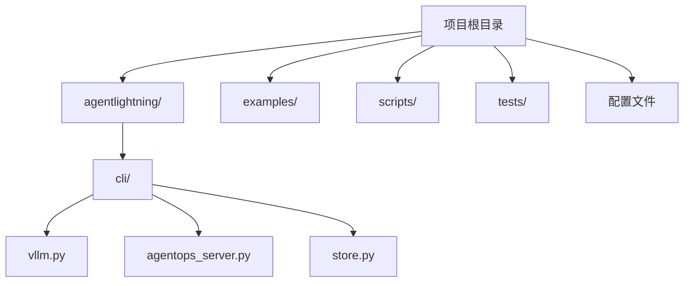
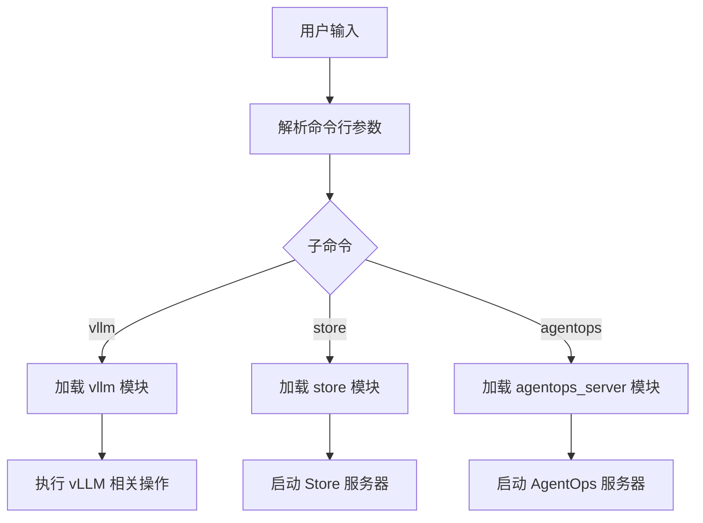
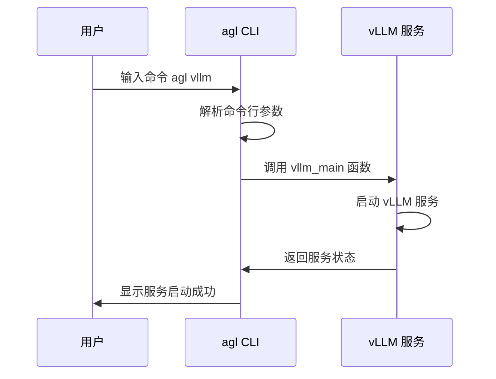
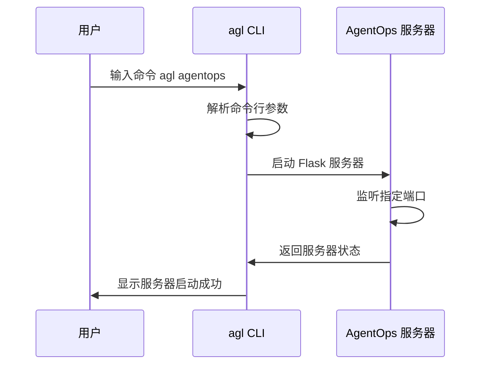
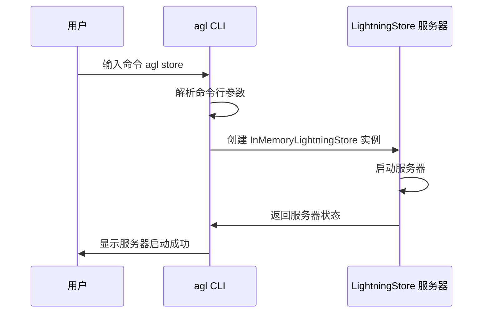
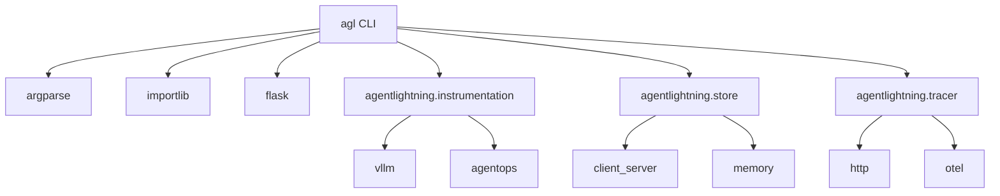

# CLI工具配置

<cite>
**本文档中引用的文件**  
- [pyproject.toml](file://pyproject.toml)
- [agentlightning/cli/__init__.py](file://agentlightning/cli/__init__.py)
- [agentlightning/cli/vllm.py](file://agentlightning/cli/vllm.py)
- [agentlightning/cli/agentops_server.py](file://agentlightning/cli/agentops_server.py)
- [agentlightning/cli/store.py](file://agentlightning/cli/store.py)
- [agentlightning/config.py](file://agentlightning/config.py)
- [agentlightning/instrumentation/vllm.py](file://agentlightning/instrumentation/vllm.py)
- [agentlightning/instrumentation/agentops.py](file://agentlightning/instrumentation/agentops.py)
</cite>

## 目录
1. [简介](#简介)
2. [项目结构](#项目结构)
3. [核心组件](#核心组件)
4. [架构概述](#架构概述)
5. [详细组件分析](#详细组件分析)
6. [依赖分析](#依赖分析)
7. [性能考虑](#性能考虑)
8. [故障排除指南](#故障排除指南)
9. [结论](#结论)

## 简介
`agl` 是 Agent Lightning 项目的命令行接口（CLI）工具，提供了一种便捷的方式来启动和管理各种服务。该工具通过 `pyproject.toml` 文件中的 `[project.scripts]` 配置项定义了入口点，允许用户通过简单的命令行调用执行复杂的操作。`agl` 支持多个子命令，包括 vLLM 集成、AgentOps 服务器和 Store 服务器，每个子命令都有特定的功能和使用场景。此外，CLI 工具与 `lightning_cli` 机制协同工作，实现了组件的命令行化配置与实例化，使得开发者可以轻松地通过命令行参数来配置和启动不同的组件。

## 项目结构
Agent Lightning 项目的目录结构清晰，主要分为以下几个部分：
- `agentlightning/`：核心代码库，包含所有主要模块和功能实现。
- `examples/`：示例代码，展示了如何使用 Agent Lightning 进行各种任务。
- `scripts/`：脚本文件，用于构建、测试和部署项目。
- `tests/`：测试代码，确保项目的稳定性和可靠性。
- 根目录下的配置文件，如 `pyproject.toml`、`README.md` 等，提供了项目的基本信息和依赖管理。

`agentlightning/cli/` 目录下包含了 CLI 工具的具体实现，每个子命令对应一个独立的 Python 文件。这些文件通过 `importlib` 动态加载并执行相应的功能。



**Diagram sources**
- [pyproject.toml](file://pyproject.toml)
- [agentlightning/cli/__init__.py](file://agentlightning/cli/__init__.py)

## 核心组件
`agl` CLI 工具的核心组件包括主入口点 `main` 函数和三个主要的子命令模块：`vllm`、`store` 和 `agentops`。这些组件共同构成了 CLI 工具的基础，提供了丰富的功能和灵活的配置选项。

**Section sources**
- [agentlightning/cli/__init__.py](file://agentlightning/cli/__init__.py)
- [agentlightning/cli/vllm.py](file://agentlightning/cli/vllm.py)
- [agentlightning/cli/agentops_server.py](file://agentlightning/cli/agentops_server.py)
- [agentlightning/cli/store.py](file://agentlightning/cli/store.py)

## 架构概述
`agl` CLI 工具的架构设计简洁而高效。主入口点 `main` 函数负责解析命令行参数，并根据用户输入的子命令动态加载相应的模块。每个子命令模块都实现了 `main` 函数，该函数负责具体的业务逻辑处理。通过这种方式，`agl` 实现了高度的模块化和可扩展性。



**Diagram sources**
- [agentlightning/cli/__init__.py](file://agentlightning/cli/__init__.py)
- [agentlightning/cli/vllm.py](file://agentlightning/cli/vllm.py)
- [agentlightning/cli/agentops_server.py](file://agentlightning/cli/agentops_server.py)
- [agentlightning/cli/store.py](file://agentlightning/cli/store.py)

## 详细组件分析
### vLLM 子命令分析
`vllm` 子命令用于运行 vLLM CLI 并集成 Agent Lightning 的监控功能。它通过 `instrument_vllm` 函数对 vLLM 进行插桩，捕获生成的 token ID，并将其传递给 Agent Lightning 的追踪系统。

#### 功能与使用场景
- **功能**：启动 vLLM 服务，同时启用 Agent Lightning 的监控和日志记录功能。
- **使用场景**：适用于需要对 vLLM 生成的文本进行详细分析和优化的场景，例如强化学习训练、自动提示优化等。

#### 参数列表
- `--help`：显示帮助信息。
- `--model`：指定要使用的模型路径。
- `--port`：指定服务监听的端口，默认为 8000。

#### 使用示例
```bash
agl vllm --model /path/to/model --port 8000
```



**Diagram sources**
- [agentlightning/cli/vllm.py](file://agentlightning/cli/vllm.py)
- [agentlightning/instrumentation/vllm.py](file://agentlightning/instrumentation/vllm.py)

### AgentOps 服务器子命令分析
`agentops` 子命令用于启动 AgentOps 服务器，该服务器可以作为本地代理，绕过在线服务，提供更灵活的开发和测试环境。

#### 功能与使用场景
- **功能**：启动一个本地的 AgentOps 服务器，用于测试和开发。
- **使用场景**：适用于需要在离线环境中进行开发和调试的场景，或者希望减少对外部服务依赖的情况。

#### 参数列表
- `--help`：显示帮助信息。
- `--daemon`：以守护进程模式运行服务器。
- `--port`：指定服务器监听的端口，默认为 8002。

#### 使用示例
```bash
agl agentops --daemon --port 8002
```



**Diagram sources**
- [agentlightning/cli/agentops_server.py](file://agentlightning/cli/agentops_server.py)
- [agentlightning/instrumentation/agentops.py](file://agentlightning/instrumentation/agentops.py)

### Store 服务器子命令分析
`store` 子命令用于启动 LightningStore 服务器，该服务器提供了一个持久化的存储解决方案，支持多进程访问。

#### 功能与使用场景
- **功能**：启动一个 LightningStore 服务器，用于存储和共享数据。
- **使用场景**：适用于需要在多个进程之间共享数据的场景，例如分布式训练、多代理系统等。

#### 参数列表
- `--help`：显示帮助信息。
- `--port`：指定服务器监听的端口，默认为 4747。

#### 使用示例
```bash
agl store --port 4747
```



**Diagram sources**
- [agentlightning/cli/store.py](file://agentlightning/cli/store.py)
- [agentlightning/store/client_server.py](file://agentlightning/store/client_server.py)
- [agentlightning/store/memory.py](file://agentlightning/store/memory.py)

## 依赖分析
`agl` CLI 工具依赖于多个外部库和内部模块。主要依赖包括 `argparse` 用于命令行参数解析，`importlib` 用于动态加载模块，以及 `flask` 用于启动 HTTP 服务器。此外，`agl` 还依赖于 `agentlightning` 包内的多个模块，如 `instrumentation`、`store` 和 `tracer`，这些模块提供了核心功能支持。



**Diagram sources**
- [pyproject.toml](file://pyproject.toml)
- [agentlightning/cli/__init__.py](file://agentlightning/cli/__init__.py)
- [agentlightning/instrumentation/vllm.py](file://agentlightning/instrumentation/vllm.py)
- [agentlightning/instrumentation/agentops.py](file://agentlightning/instrumentation/agentops.py)
- [agentlightning/store/client_server.py](file://agentlightning/store/client_server.py)
- [agentlightning/store/memory.py](file://agentlightning/store/memory.py)
- [agentlightning/tracer/http.py](file://agentlightning/tracer/http.py)
- [agentlightning/tracer/otel.py](file://agentlightning/tracer/otel.py)

## 性能考虑
`agl` CLI 工具在设计时充分考虑了性能因素。通过使用异步 I/O 和多进程技术，`agl` 能够高效地处理大量并发请求。此外，`agl` 还支持配置缓存和日志级别，以进一步优化性能。在实际使用中，建议根据具体需求调整相关参数，以达到最佳性能表现。

## 故障排除指南
### 常见问题
- **问题**：启动 `agl` 时出现 `ModuleNotFoundError` 错误。
  - **解决方案**：确保已正确安装 `agentlightning` 包及其所有依赖项。
- **问题**：`agl` 无法连接到指定的端口。
  - **解决方案**：检查端口是否已被其他进程占用，或尝试使用其他端口号。
- **问题**：`agl` 启动后立即退出。
  - **解决方案**：查看日志输出，确认是否有错误信息，并根据提示进行修复。

**Section sources**
- [agentlightning/cli/__init__.py](file://agentlightning/cli/__init__.py)
- [agentlightning/cli/vllm.py](file://agentlightning/cli/vllm.py)
- [agentlightning/cli/agentops_server.py](file://agentlightning/cli/agentops_server.py)
- [agentlightning/cli/store.py](file://agentlightning/cli/store.py)

## 结论
`agl` CLI 工具是 Agent Lightning 项目的重要组成部分，提供了便捷的命令行接口，支持多种子命令和丰富的配置选项。通过 `pyproject.toml` 中的 `[project.scripts]` 配置项，`agl` 实现了灵活的入口点定义，使得用户可以轻松地启动和管理各种服务。结合 `lightning_cli` 机制，`agl` 还支持组件的命令行化配置与实例化，极大地提高了开发效率和灵活性。未来，`agl` 将继续优化性能，增加更多实用功能，为用户提供更好的使用体验。