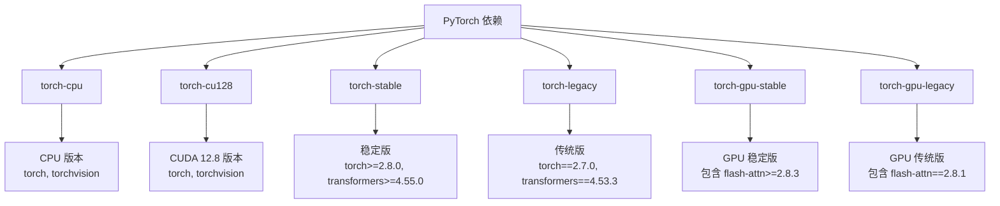
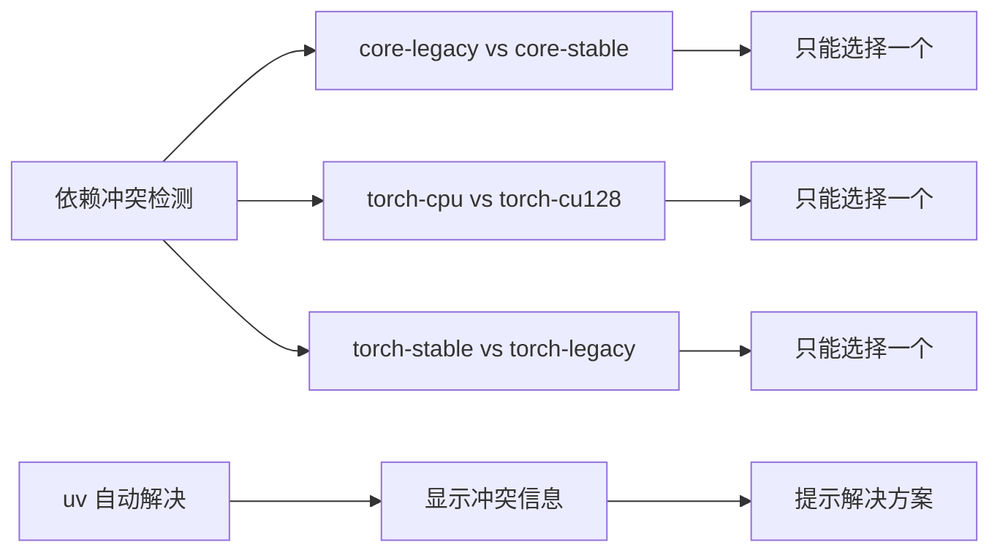
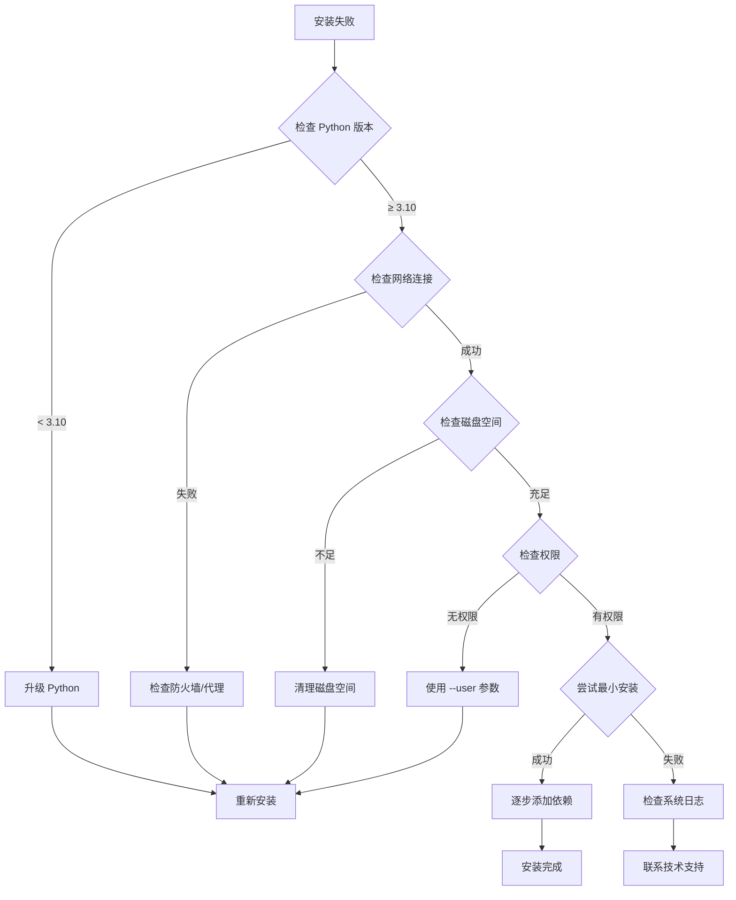

# 环境安装指南

<cite>
**本文档中引用的文件**
- [pyproject.toml](file://pyproject.toml)
- [README.md](file://README.md)
- [setup_stable.sh](file://scripts/setup_stable.sh)
- [setup_latest.sh](file://scripts/setup_latest.sh)
- [setup_stable_gpu.sh](file://scripts/setup_stable_gpu.sh)
- [setup_latest_gpu.sh](file://scripts/setup_latest_gpu.sh)
- [base.Dockerfile](file://scripts/base.Dockerfile)
- [build_vm_image.sh](file://scripts/build_vm_image.sh)
- [check_python_headers.py](file://scripts/check_python_headers.py)
- [litellm_sanity_check.py](file://scripts/litellm_sanity_check.py)
- [test_client.py](file://tests/test_client.py)
- [test_config.py](file://tests/test_config.py)
</cite>

## 目录
1. [简介](#简介)
2. [系统要求](#系统要求)
3. [安装前准备](#安装前准备)
4. [CPU环境安装](#cpu环境安装)
5. [GPU环境安装](#gpu环境安装)
6. [依赖分组详解](#依赖分组详解)
7. [安装验证](#安装验证)
8. [常见问题解决](#常见问题解决)
9. [故障排除指南](#故障排除指南)
10. [总结](#总结)

## 简介

Agent Lightning 是一个强大的 AI 代理训练框架，支持零代码变更的优化能力。本指南详细介绍了如何在不同环境下安装 Agent Lightning，包括 CPU 和 GPU 环境、稳定版和最新版的安装流程。

Agent Lightning 支持多种安装方式：
- 使用 `pip` 或 `uv` 包管理器
- 基于依赖分组机制的灵活安装
- 针对不同操作系统（Linux/macOS/Windows）的专门配置

## 系统要求

### 最低系统要求
- **Python 版本**: ≥ 3.10
- **操作系统**: Linux/macOS/Windows
- **内存**: 至少 4GB RAM
- **存储空间**: 至少 2GB 可用空间

### 推荐配置
- **Python 版本**: Python 3.11 或更高版本
- **内存**: 8GB 或更多 RAM
- **存储空间**: 10GB 或更多可用空间
- **网络**: 稳定的互联网连接用于下载依赖

### GPU 要求（仅限 GPU 安装）
- **CUDA 版本**: 12.8（推荐）
- **显存**: 至少 4GB VRAM（8GB 推荐）
- **GPU 架构**: 支持 CUDA 的 NVIDIA GPU

## 安装前准备

### 环境检查

在开始安装之前，请确保您的系统满足以下要求：

```bash
# 检查 Python 版本
python --version
# 或
python3 --version

# 检查 pip 版本
pip --version
# 或
pip3 --version

# 检查系统架构
uname -m  # Linux/macOS
```

### 包管理器选择

Agent Lightning 支持两种包管理器：
- **pip**: 标准 Python 包管理器
- **uv**: 高性能替代方案（推荐）

```bash
# 安装 uv（推荐）
pip install uv

# 或使用标准 pip
pip install --upgrade pip
```

### 创建虚拟环境（推荐）

```bash
# 创建虚拟环境
python -m venv agentlightning-env
source agentlightning-env/bin/activate  # Linux/macOS
# 或
agentlightning-env\Scripts\activate  # Windows

# 在虚拟环境中安装
pip install agentlightning
```

## CPU环境安装

### 稳定版安装

对于生产环境和稳定性要求较高的场景，推荐使用稳定版安装：

```bash
# 使用 pip 安装稳定版
pip install agentlightning

# 或使用 uv 安装
uv pip install agentlightning
```

### 最新版安装

对于需要最新功能和特性的用户：

```bash
# 安装最新版本
pip install agentlightning --upgrade

# 或使用 uv
uv pip install agentlightning --upgrade
```

### 核心依赖安装

如果只需要核心功能，可以安装特定的依赖组：

```bash
# 安装核心依赖（不含训练功能）
pip install agentlightning[core-stable]

# 安装完整功能（包括代理框架集成）
pip install agentlightning[agent,apo]
```

### 依赖组说明

| 依赖组 | 描述 | 包含内容 |
|--------|------|----------|
| `core-stable` | 稳定的核心依赖 | agentops>=0.4.21, openai>=2.0.0 |
| `core-legacy` | 传统兼容依赖 | agentops<=0.4.18, openai<2.0.0 |
| `apo` | APO 算法支持 | poml |
| `agent` | 代理框架集成 | autogen, langchain, anthropic 等 |
| `dev` | 开发工具 | pytest, black, flake8 等 |

**节来源**
- [pyproject.toml](file://pyproject.toml#L25-L45)
- [setup_stable.sh](file://scripts/setup_stable.sh#L1-L4)

## GPU环境安装

### CUDA 版本要求

Agent Lightning 支持多种 CUDA 版本，但推荐使用 CUDA 12.8：

```bash
# 检查 CUDA 版本
nvcc --version
nvidia-smi
```

### GPU 稳定版安装

```bash
# 安装 GPU 版本（稳定版）
pip install agentlightning[torch-stable,torch-cu128]

# 或使用 uv
uv pip install agentlightning[torch-stable,torch-cu128]
```

### GPU 最新版安装

```bash
# 安装最新 GPU 版本
pip install agentlightning[torch-gpu-stable]

# 或使用 uv
uv pip install agentlightning[torch-gpu-stable]
```

### 手动安装 GPU 依赖

如果需要更精细的控制：

```bash
# 安装 PyTorch CUDA 12.8
pip install torch torchvision --index-url https://download.pytorch.org/whl/cu128

# 安装 flash-attn（需要 CUDA 工具链）
pip install flash-attn --no-build-isolation

# 安装其他 GPU 依赖
pip install agentlightning[torch-stable,apo]
```

### Docker GPU 支持

使用官方 Docker 镜像：

```bash
# 拉取 GPU 支持镜像
docker pull mcr.microsoft.com/agent-lightning:latest-gpu

# 运行容器
docker run --gpus all -it mcr.microsoft.com/agent-lightning:latest-gpu
```

**节来源**
- [base.Dockerfile](file://scripts/base.Dockerfile#L1-L18)
- [setup_stable_gpu.sh](file://scripts/setup_stable_gpu.sh#L1-L14)
- [setup_latest_gpu.sh](file://scripts/setup_latest_gpu.sh#L1-L18)

## 依赖分组详解

### PyTorch 依赖组

Agent Lightning 提供了灵活的 PyTorch 依赖分组机制：



**图表来源**
- [pyproject.toml](file://pyproject.toml#L55-L95)

### 关键依赖组说明

| 依赖组 | 版本要求 | 适用场景 | 注意事项 |
|--------|----------|----------|----------|
| `torch-cpu` | torch, torchvision | CPU 计算 | 不包含 CUDA 依赖 |
| `torch-cu128` | torch, torchvision | GPU 计算 | 针对 CUDA 12.8 |
| `torch-stable` | ≥2.8.0 | 生产环境 | 兼容性更好 |
| `torch-legacy` | 2.7.0 | 向后兼容 | 包含特定版本依赖 |
| `torch-gpu-stable` | 包含 flash-attn | 高性能训练 | 需要 CUDA 工具链 |
| `torch-gpu-legacy` | 固定版本 | 特殊需求 | 兼容旧系统 |

### 冲突处理机制

pyproject.toml 中定义了明确的冲突规则：



**图表来源**
- [pyproject.toml](file://pyproject.toml#L105-L115)

**节来源**
- [pyproject.toml](file://pyproject.toml#L55-L115)

## 安装验证

### 基础导入测试

验证安装是否成功：

```python
# 基础导入测试
try:
    import agentlightning
    from agentlightning import AgentLightningClient, AgentLightningServer
    print("✓ Agent Lightning 安装成功")
    print(f"版本: {agentlightning.__version__}")
except ImportError as e:
    print(f"✗ 导入失败: {e}")
```

### 功能完整性测试

运行基础功能测试：

```python
# 测试客户端功能
from agentlightning import AgentLightningClient

try:
    client = AgentLightningClient()
    print("✓ 客户端初始化成功")
except Exception as e:
    print(f"✗ 客户端初始化失败: {e}")

# 测试服务器功能
from agentlightning import AgentLightningServer

try:
    server = AgentLightningServer()
    print("✓ 服务器初始化成功")
except Exception as e:
    print(f"✗ 服务器初始化失败: {e}")
```

### 环境兼容性检查

```python
# 检查 Python 版本
import sys
print(f"Python 版本: {sys.version}")

# 检查 PyTorch 安装
try:
    import torch
    print(f"PyTorch 版本: {torch.__version__}")
    print(f"CUDA 可用: {torch.cuda.is_available()}")
    if torch.cuda.is_available():
        print(f"CUDA 版本: {torch.version.cuda}")
except ImportError:
    print("PyTorch 未安装")

# 检查 LiteLLM 代理
try:
    import litellm
    print(f"LiteLLM 版本: {litellm.__version__}")
except ImportError:
    print("LiteLLM 未安装")
```

### 自动化验证脚本

使用项目提供的验证脚本：

```bash
# Python 头部检查
python scripts/check_python_headers.py

# LiteLLM 代理检查
python scripts/litellm_sanity_check.py
```

**节来源**
- [check_python_headers.py](file://scripts/check_python_headers.py#L1-L78)
- [litellm_sanity_check.py](file://scripts/litellm_sanity_check.py#L1-L56)

## 常见问题解决

### CUDA 版本不匹配

**问题描述**: 安装时出现 CUDA 版本不匹配错误

**解决方案**:
```bash
# 检查当前 CUDA 版本
nvidia-smi

# 安装对应版本的 PyTorch
pip install torch torchvision --index-url https://download.pytorch.org/whl/cu128  # CUDA 12.8
# 或
pip install torch torchvision --index-url https://download.pytorch.org/whl/cu118  # CUDA 11.8
```

### flash-attn 编译失败

**问题描述**: flash-attn 编译过程中出现错误

**解决方案**:
```bash
# 方法 1: 使用预编译版本
pip install flash-attn --no-build-isolation

# 方法 2: 安装构建工具
# Ubuntu/Debian
sudo apt-get install build-essential

# CentOS/RHEL
sudo yum install gcc gcc-c++ make

# macOS
xcode-select --install

# 方法 3: 使用 conda（如果可用）
conda install -c conda-forge flash-attn
```

### 内存不足错误

**问题描述**: 安装过程中出现内存不足错误

**解决方案**:
```bash
# 增加虚拟内存
# Linux
sudo sysctl vm.max_map_count=262144

# 减少 pip 缓存
pip install agentlightning --no-cache-dir

# 分步安装
pip install agentlightning[core-stable]
pip install agentlightning[apo]
```

### 权限问题

**问题描述**: 安装时出现权限错误

**解决方案**:
```bash
# 使用用户目录安装
pip install --user agentlightning

# 或使用虚拟环境
python -m venv myenv
source myenv/bin/activate
pip install agentlightning

# Windows
pip install --user agentlightning
```

### 依赖冲突

**问题描述**: 不同依赖之间存在版本冲突

**解决方案**:
```bash
# 使用 uv 解决冲突
uv pip install agentlightning --resolution=lowest-direct

# 强制重新安装
pip uninstall agentlightning -y
pip install agentlightning

# 指定兼容版本
pip install agentlightning==0.2.1
```

## 故障排除指南

### 安装诊断流程



### 性能优化建议

1. **使用 uv 替代 pip**
   ```bash
   pip install uv
   uv pip install agentlightning
   ```

2. **启用并行安装**
   ```bash
   pip install --parallel 4 agentlightning
   ```

3. **使用本地缓存**
   ```bash
   pip install --cache-dir ~/.pip_cache agentlightning
   ```

4. **选择最快的镜像源**
   ```bash
   pip install agentlightning -i https://pypi.tuna.tsinghua.edu.cn/simple
   ```

### 升级策略

```bash
# 检查当前版本
pip show agentlightning

# 升级到最新版本
pip install agentlightning --upgrade

# 升级到特定版本
pip install agentlightning==0.2.1

# 清理旧版本
pip uninstall agentlightning -y
pip install agentlightning
```

### 卸载程序

```bash
# 卸载 Agent Lightning
pip uninstall agentlightning -y

# 清理残留文件
rm -rf ~/.agentlightning
rm -rf ~/agentlightning-env
```

**节来源**
- [test_client.py](file://tests/test_client.py#L1-L50)
- [test_config.py](file://tests/test_config.py#L1-L50)

## 总结

本指南涵盖了 Agent Lightning 的完整安装流程，从系统要求到高级故障排除。关键要点包括：

1. **灵活的安装方式**: 支持 pip 和 uv，提供多种依赖组合选项
2. **环境适配**: 针对 CPU 和 GPU 环境提供专门的安装方案
3. **版本管理**: 支持稳定版和最新版，满足不同使用场景需求
4. **依赖分组**: 基于 pyproject.toml 的智能依赖管理
5. **验证机制**: 提供完整的安装验证和故障排除工具

通过遵循本指南，您可以成功安装并配置 Agent Lightning，为 AI 代理训练提供强大的基础设施支持。如遇到任何问题，请参考故障排除部分或联系技术支持团队。