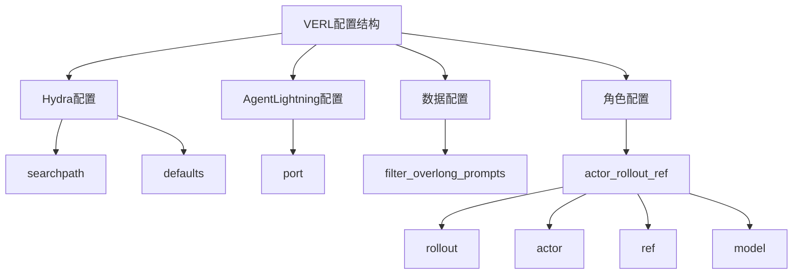
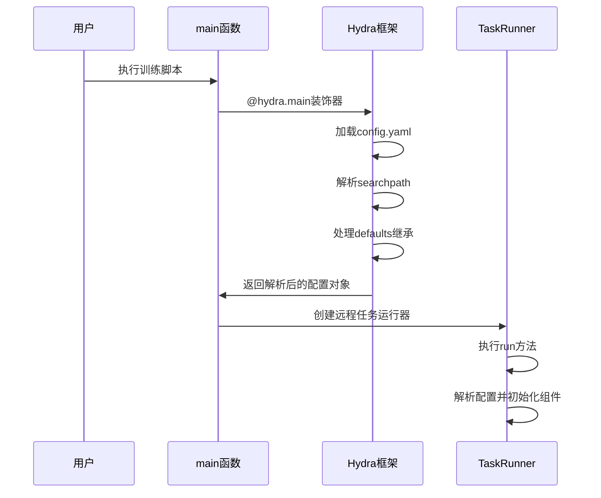

# VERL专用配置

<cite>
**本文档中引用的文件**   
- [config.yaml](file://agentlightning/verl/config.yaml)
- [entrypoint.py](file://agentlightning/verl/entrypoint.py)
- [trainer.py](file://agentlightning/verl/trainer.py)
- [async_server.py](file://agentlightning/verl/async_server.py)
- [daemon.py](file://agentlightning/verl/daemon.py)
</cite>

## 目录
1. [简介](#简介)
2. [配置结构分析](#配置结构分析)
3. [Hydra配置机制](#hydra配置机制)
4. [核心配置字段解析](#核心配置字段解析)
5. [异步服务器实现配置](#异步服务器实现配置)
6. [数据集与训练超参数配置](#数据集与训练超参数配置)
7. [配置覆盖与命令行修改](#配置覆盖与命令行修改)
8. [配置解析流程](#配置解析流程)
9. [模块化配置的隔离性与灵活性](#模块化配置的隔离性与灵活性)

## 简介
本文档详细解析agentlightning/verl/config.yaml中基于Hydra框架的模块专用配置结构。重点说明hydra.searchpath的路径映射机制、defaults列表中的配置继承关系，以及agentlightning.port、data.filter_overlong_prompts等关键字段的业务含义。解释如何通过配置文件指定异步服务器实现、数据集路径和训练超参数。提供配置覆盖示例，展示如何通过命令行动态修改reward_function或rollout_batch_size。结合verl/entrypoint.py中的加载逻辑，说明配置文件的解析流程和作用域限制，帮助用户理解模块化配置的隔离性与灵活性。

## 配置结构分析
VERL配置文件采用分层结构组织，主要包含Hydra框架配置、AgentLightning专用配置、数据配置和角色配置等部分。配置结构设计遵循模块化原则，通过Hydra的defaults机制实现配置继承和组合。



**Diagram sources**
- [config.yaml](file://agentlightning/verl/config.yaml#L1-L20)

**Section sources**
- [config.yaml](file://agentlightning/verl/config.yaml#L1-L20)

## Hydra配置机制
VERL配置系统基于Hydra框架构建，利用其强大的配置管理功能实现模块化和可扩展的配置结构。

### Hydra搜索路径机制
配置文件中的hydra.searchpath字段定义了配置搜索路径，采用pkg://协议指定Python包内的相对路径：

```yaml
hydra:
  searchpath:
    - pkg://verl/trainer/config
```

该配置将verl/trainer/config目录添加到Hydra的配置搜索路径中，使得该目录下的配置文件可以被自动发现和加载。这种机制实现了配置文件的模块化组织，不同模块的配置可以独立存放和管理。

### Defaults配置继承
defaults列表定义了配置的继承关系和加载顺序：

```yaml
defaults:
  - ppo_trainer
  - _self_
```

- **ppo_trainer**: 指定基础配置模板，通常包含PPO训练算法的默认参数
- **_self_**: 表示当前配置文件本身，确保当前文件中的配置能够覆盖基础配置

这种继承机制允许用户在保持基础配置不变的情况下，通过覆盖特定字段来定制化配置，实现了配置的可复用性和灵活性。

**Section sources**
- [config.yaml](file://agentlightning/verl/config.yaml#L1-L10)

## 核心配置字段解析
配置文件中的各个字段具有明确的业务含义，控制着VERL系统的不同方面。

### AgentLightning专用配置
```yaml
agentlightning:
  port: 9999
```

- **port**: 指定AgentLightning服务监听的端口号，用于与其他组件通信。默认值为9999，可根据部署环境需求进行调整。

### 数据配置
```yaml
data:
  filter_overlong_prompts: false
```

- **filter_overlong_prompts**: 控制是否过滤过长的提示词。当设置为true时，系统会自动过滤掉长度超过模型限制的提示词，避免处理异常；设置为false时则保留所有提示词，由后续处理逻辑决定如何处理。

### 角色配置
```yaml
actor_rollout_ref:
  rollout:
    mode: async
    agent:
      custom_async_server:
        path: pkg://agentlightning.verl.async_server
        name: PatchedvLLMServer
```

- **mode**: 指定rollout模式，async表示异步模式，可提高训练效率
- **custom_async_server.path**: 自定义异步服务器的Python包路径
- **custom_async_server.name**: 自定义异步服务器的类名

**Section sources**
- [config.yaml](file://agentlightning/verl/config.yaml#L11-L20)

## 异步服务器实现配置
VERL系统支持通过配置文件指定异步服务器的实现，提供了高度的可定制性。

### 异步服务器配置结构
异步服务器配置通过actor_rollout_ref.rollout.agent.custom_async_server字段指定：

```yaml
actor_rollout_ref:
  rollout:
    mode: async
    agent:
      custom_async_server:
        path: pkg://agentlightning.verl.async_server
        name: PatchedvLLMServer
```

这种配置方式允许用户：
1. 通过path指定自定义服务器实现的Python包路径
2. 通过name指定具体的服务器类名
3. 实现与vLLM等推理引擎的无缝集成

### 异步服务器实现原理
在代码层面，异步服务器的配置在entrypoint.py中被解析和实例化：

```python
if config.actor_rollout_ref.rollout.mode == "async":
    actor_rollout_cls = AsyncActorRolloutRefWorker
```

系统根据配置中的mode字段决定使用同步还是异步的工作类，实现了配置驱动的行为切换。

**Section sources**
- [config.yaml](file://agentlightning/verl/config.yaml#L15-L20)
- [entrypoint.py](file://agentlightning/verl/entrypoint.py#L91-L120)

## 数据集与训练超参数配置
虽然基础配置文件中未直接包含数据集和训练超参数，但通过配置继承机制，这些参数可以从基础配置模板中获取。

### 数据集配置
通过继承ppo_trainer配置模板，系统可以获得数据集相关的配置：

- **train_files**: 训练数据文件路径
- **val_files**: 验证数据文件路径
- **train_batch_size**: 训练批次大小
- **max_prompt_length**: 最大提示词长度
- **max_response_length**: 最大响应长度

### 训练超参数
训练过程的关键超参数通过配置文件进行管理：

- **total_epochs**: 总训练轮数
- **save_freq**: 检查点保存频率
- **test_freq**: 验证频率
- **n_gpus_per_node**: 每节点GPU数量
- **nnodes**: 节点数量

这些参数共同决定了训练过程的行为和资源使用。

**Section sources**
- [trainer.py](file://agentlightning/verl/trainer.py#L320-L344)
- [entrypoint.py](file://agentlightning/verl/entrypoint.py#L152-L181)

## 配置覆盖与命令行修改
VERL系统支持通过命令行动态修改配置，提供了极大的灵活性。

### 配置覆盖语法
Hydra框架支持通过命令行参数覆盖配置文件中的值，语法格式为：

```
key=value
```

### 常见覆盖示例
#### 修改奖励函数
```bash
python train.py reward_function=custom_rm
```

#### 调整rollout批次大小
```bash
python train.py actor_rollout_ref.rollout.n=8
```

#### 指定数据集路径
```bash
python train.py data.train_files=/path/to/new/dataset.parquet
```

#### 调整训练超参数
```bash
python train.py trainer.total_epochs=5 trainer.save_freq=20
```

这种动态配置能力使得用户可以在不修改配置文件的情况下快速实验不同的配置组合。

**Section sources**
- [entrypoint.py](file://agentlightning/verl/entrypoint.py#L0-L46)
- [trainer.py](file://agentlightning/verl/trainer.py#L343-L377)

## 配置解析流程
VERL系统的配置解析流程在entrypoint.py中实现，遵循Hydra框架的标准模式。

### 配置加载流程


### 关键解析步骤
1. **配置装饰器**: `@hydra.main`装饰器指定配置路径和文件名
2. **路径解析**: 使用pkg://协议解析配置搜索路径
3. **继承处理**: 按defaults列表顺序合并配置
4. **对象解析**: 将配置字典转换为可执行的对象
5. **组件初始化**: 根据配置初始化各个训练组件

**Diagram sources**
- [entrypoint.py](file://agentlightning/verl/entrypoint.py#L47-L48)

**Section sources**
- [entrypoint.py](file://agentlightning/verl/entrypoint.py#L47-L48)

## 模块化配置的隔离性与灵活性
VERL的配置系统设计体现了良好的隔离性和灵活性，支持复杂的训练场景。

### 配置隔离性
通过Hydra的配置分组机制，不同模块的配置相互隔离：

- **算法配置**: 算法相关的参数独立管理
- **数据配置**: 数据处理相关的参数独立管理
- **资源配置**: 计算资源相关的参数独立管理
- **服务配置**: 服务相关的参数独立管理

这种隔离性确保了配置的清晰性和可维护性。

### 配置灵活性
系统通过多种机制提供配置灵活性：

1. **继承机制**: 通过defaults实现配置模板的复用
2. **覆盖机制**: 支持命令行动态覆盖
3. **模块化路径**: searchpath支持多级配置查找
4. **条件加载**: 根据配置值条件性加载组件

### 配置作用域限制
配置的作用域受到严格限制，确保了系统的稳定性和可预测性：

- **局部作用域**: 某些配置仅在特定组件内有效
- **全局作用域**: 关键配置影响整个训练流程
- **运行时作用域**: 部分配置在运行时才被解析和应用

这种作用域管理机制避免了配置冲突和意外行为。

**Section sources**
- [config.yaml](file://agentlightning/verl/config.yaml#L1-L20)
- [entrypoint.py](file://agentlightning/verl/entrypoint.py#L0-L207)