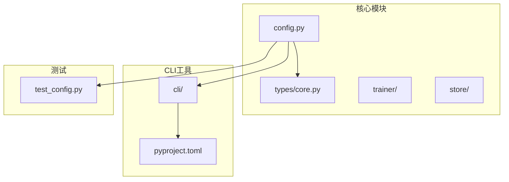
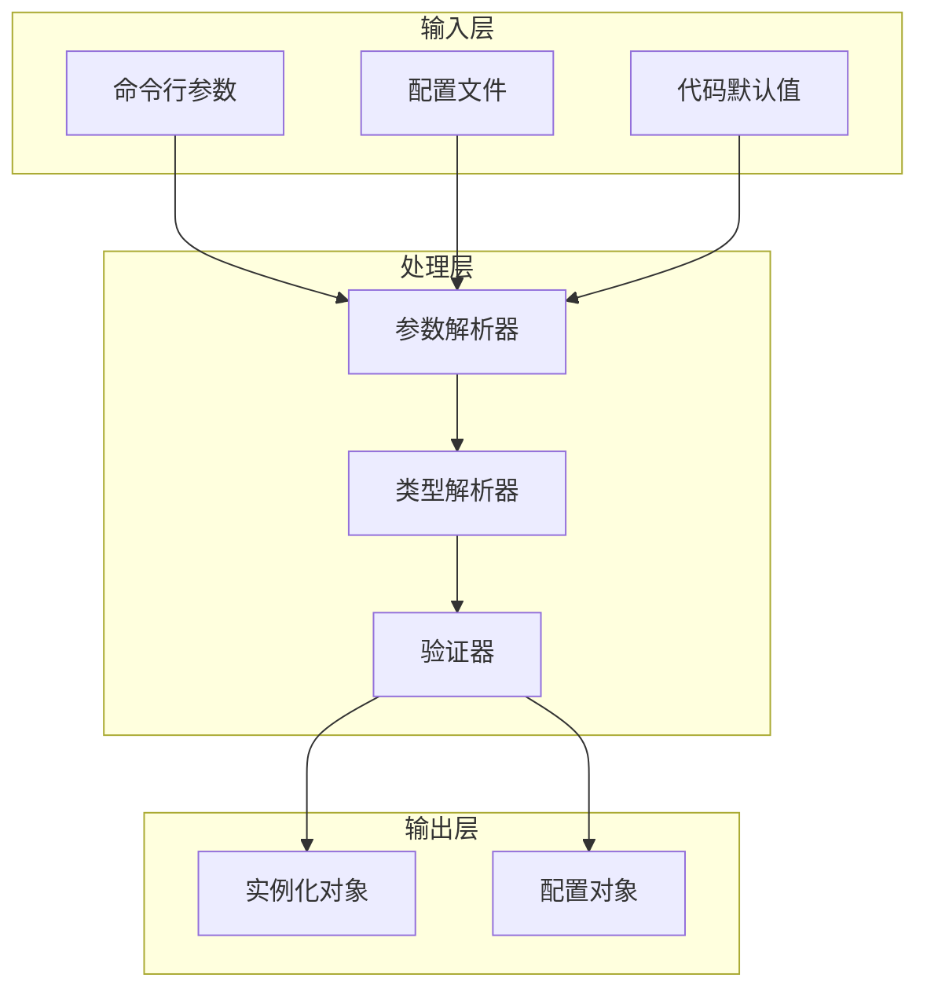
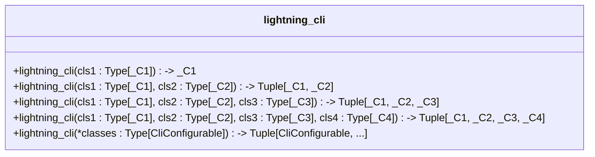
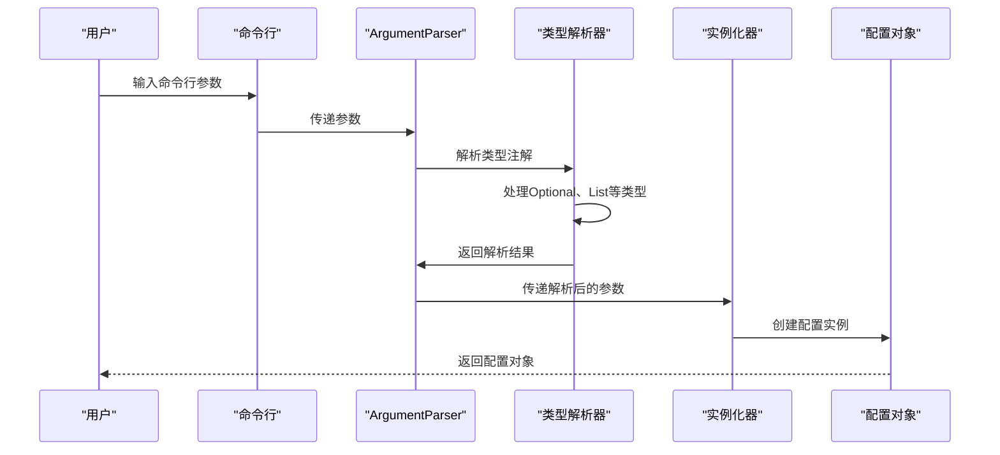
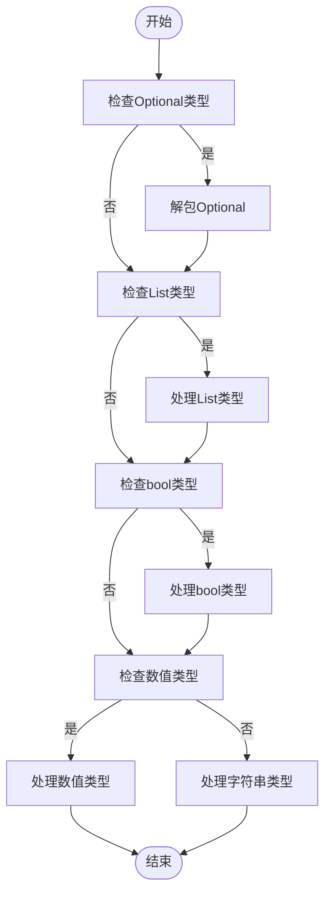

# 全局配置详解

<cite>
**本文档中引用的文件**   
- [config.py](file://agentlightning/config.py)
- [pyproject.toml](file://pyproject.toml)
- [test_config.py](file://tests/test_config.py)
- [__init__.py](file://agentlightning/__init__.py)
- [core.py](file://agentlightning/types/core.py)
</cite>

## 目录
1. [简介](#简介)
2. [项目结构](#项目结构)
3. [核心组件](#核心组件)
4. [架构概述](#架构概述)
5. [详细组件分析](#详细组件分析)
6. [依赖分析](#依赖分析)
7. [性能考虑](#性能考虑)
8. [故障排除指南](#故障排除指南)
9. [结论](#结论)
10. [附录](#附录)（如有必要）

## 简介
本文档深入解析agentlightning/config.py中基于Pydantic的全局配置体系，重点阐述lightning_cli如何通过类型注解实现命令行参数的自动解析与类型转换。详细说明配置优先级机制：代码默认值 < 配置文件定义 < 命令行参数覆盖。结合pyproject.toml中的项目元数据和依赖配置，解释如何通过CLI设置服务端口、日志级别、默认存储后端等核心参数。提供实际代码示例，展示如何在初始化Trainer或Runner时传入自定义配置，以及如何扩展Config类以支持新参数。分析配置验证机制和错误处理流程，指导用户避免常见配置错误。

## 项目结构
agentlightning项目的目录结构清晰地组织了各个功能模块，包括适配器、算法、CLI工具、执行器、存储、追踪器、训练器等。核心配置功能位于agentlightning/config.py文件中，该文件实现了基于Pydantic的全局配置体系和lightning_cli命令行接口。



**Diagram sources**
- [config.py](file://agentlightning/config.py)
- [pyproject.toml](file://pyproject.toml)
- [test_config.py](file://tests/test_config.py)

**Section sources**
- [config.py](file://agentlightning/config.py)
- [pyproject.toml](file://pyproject.toml)

## 核心组件
agentlightning/config.py文件中的核心组件包括lightning_cli函数、类型解析工具和参数处理函数。这些组件共同实现了基于类型注解的命令行参数自动解析与类型转换功能。

**Section sources**
- [config.py](file://agentlightning/config.py)

## 架构概述
agentlightning的配置体系采用分层架构，从底层的类型解析到上层的命令行接口，形成了完整的配置管理解决方案。系统通过lightning_cli函数将命令行参数与类的__init__方法参数进行映射，实现了配置的自动解析和实例化。



**Diagram sources**
- [config.py](file://agentlightning/config.py)

## 详细组件分析

### lightning_cli函数分析
lightning_cli函数是agentlightning配置体系的核心，它通过类型注解实现命令行参数的自动解析与类型转换。

#### 函数签名和重载


**Diagram sources**
- [config.py](file://agentlightning/config.py#L301-L336)

#### 参数解析流程


**Diagram sources**
- [config.py](file://agentlightning/config.py#L227-L251)

#### 类型处理逻辑


**Diagram sources**
- [config.py](file://agentlightning/config.py#L143-L168)

### 配置优先级机制
agentlightning实现了清晰的配置优先级机制，确保配置值的正确性和可预测性。


**Diagram sources**
- [config.py](file://agentlightning/config.py#L170-L200)

### 配置验证与错误处理
系统提供了完善的配置验证和错误处理机制，确保配置的正确性和系统的稳定性。

```mermaid
stateDiagram-v2
[*] --> Parsing
Parsing --> Validation : "参数解析完成"
Validation --> Success : "验证通过"
Validation --> Error : "验证失败"
Error --> Logging : "记录错误"
Logging --> Exit : "退出程序"
Success --> Instantiation : "实例化对象"
Instantiation --> [*]
note right of Error
包括类型不匹配、
必需参数缺失等
end
```

**Diagram sources**
- [config.py](file://agentlightning/config.py#L254-L277)

## 依赖分析
agentlightning的配置体系依赖于多个Python标准库和第三方库，形成了完整的依赖关系网络。

```mermaid
erDiagram
CONFIG {
string name PK
string version
string description
string requires_python
}
DEPENDENCY {
string name PK
string version
string category
}
GROUP_DEPENDENCY {
string group PK
string dependency PK
}
CONFIG ||--o{ DEPENDENCY : "requires"
DEPENDENCY }o--|| GROUP_DEPENDENCY : "in"
GROUP_DEPENDENCY }|--|| CONFIG : "belongs to"
CONFIG {
name: "agentlightning"
version: "0.2.1"
description: "Agent-lightning is the absolute trainer to light up AI agents."
requires_python: ">=3.10"
}
DEPENDENCY {
name: "pydantic"
version: ">=2.11"
category: "core"
}
DEPENDENCY {
name: "argparse"
version: "built-in"
category: "standard"
}
```

**Diagram sources**
- [pyproject.toml](file://pyproject.toml)
- [config.py](file://agentlightning/config.py)

## 性能考虑
配置系统的性能主要体现在参数解析速度和内存使用效率上。通过优化类型解析算法和减少不必要的对象创建，可以显著提升配置系统的性能。

## 故障排除指南
当遇到配置相关问题时，可以按照以下步骤进行排查：

1. 检查命令行参数格式是否正确
2. 验证类型注解是否准确
3. 确认默认值设置是否合理
4. 查看日志输出以获取详细错误信息

**Section sources**
- [config.py](file://agentlightning/config.py#L254-L277)
- [test_config.py](file://tests/test_config.py#L433-L469)

## 结论
agentlightning的全局配置体系通过lightning_cli函数实现了基于类型注解的命令行参数自动解析与类型转换，提供了清晰的配置优先级机制和完善的错误处理流程。该系统设计合理，易于扩展，能够满足复杂AI应用的配置管理需求。

## 附录
### 配置示例
```python
# 示例：初始化Trainer时传入自定义配置
from agentlightning import Trainer, lightning_cli

class MyConfig:
    def __init__(self, port: int = 8000, log_level: str = "INFO"):
        self.port = port
        self.log_level = log_level

config = lightning_cli(MyConfig)
trainer = Trainer(config=config)
```

### 扩展Config类
```python
# 示例：扩展Config类以支持新参数
class ExtendedConfig(MyConfig):
    def __init__(self, port: int = 8000, log_level: str = "INFO", storage_backend: str = "memory"):
        super().__init__(port, log_level)
        self.storage_backend = storage_backend
```