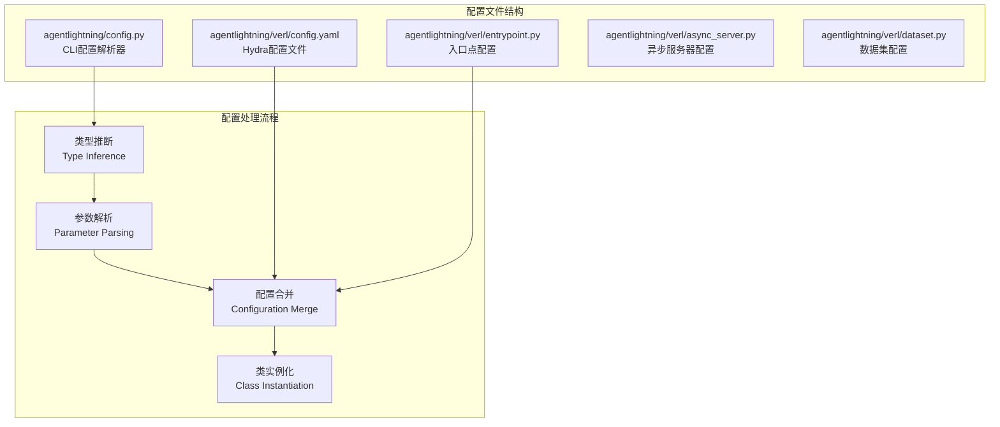
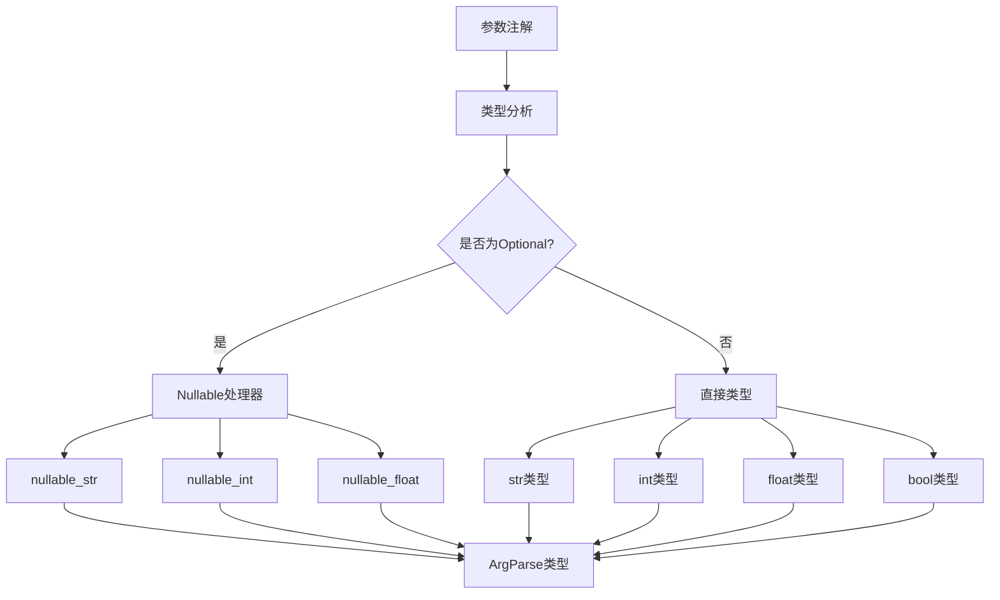
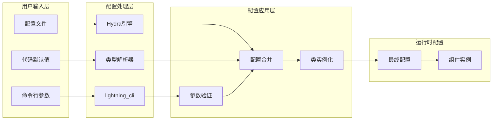
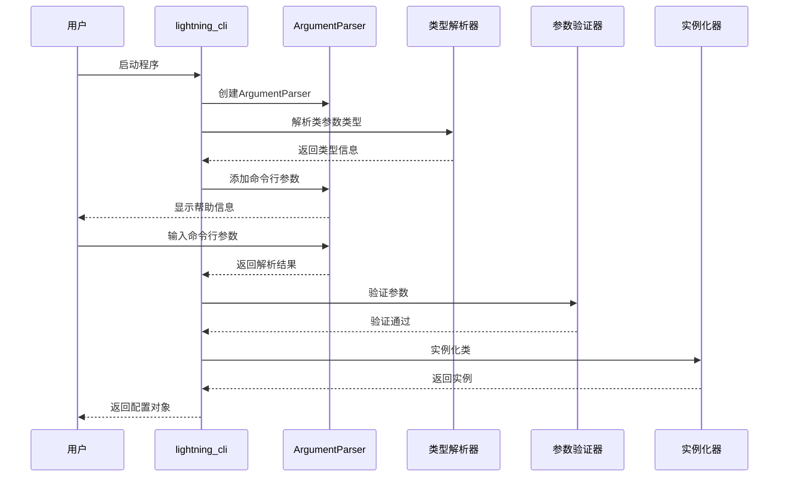
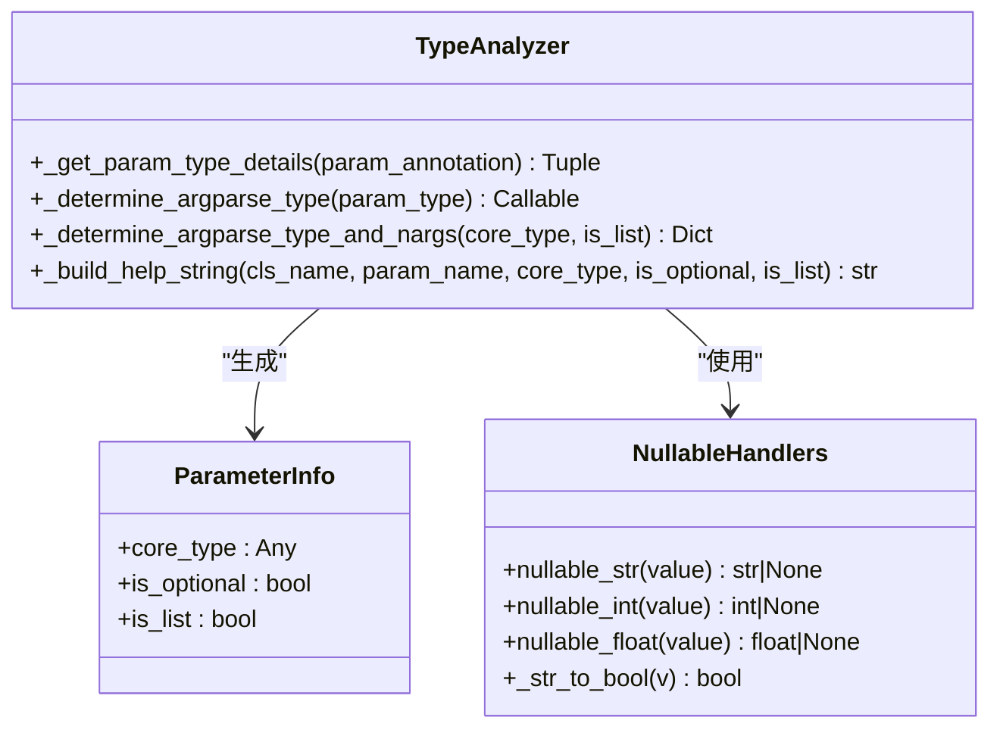
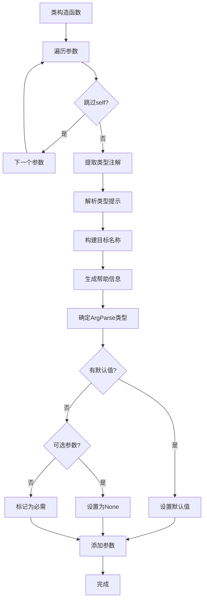
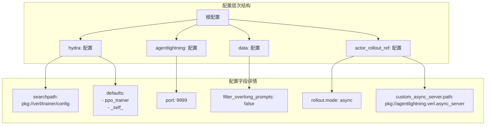
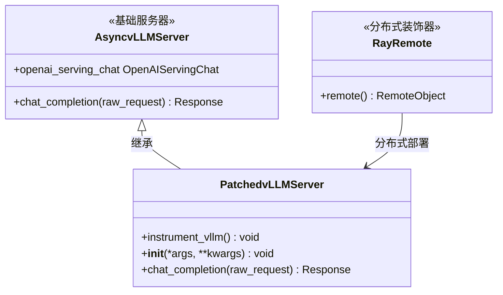
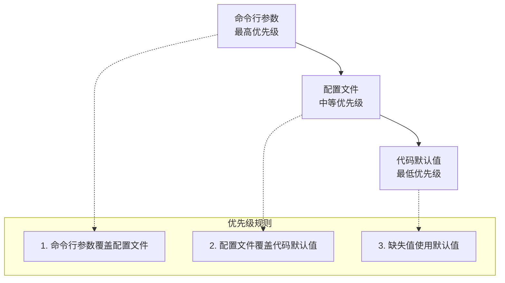
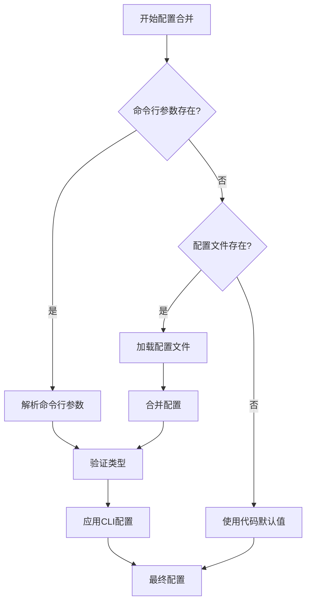

# 配置文件详解

<cite>
**本文档引用的文件**
- [agentlightning/config.py](file://agentlightning/config.py)
- [agentlightning/verl/config.yaml](file://agentlightning/verl/config.yaml)
- [agentlightning/verl/async_server.py](file://agentlightning/verl/async_server.py)
- [agentlightning/verl/entrypoint.py](file://agentlightning/verl/entrypoint.py)
- [agentlightning/verl/dataset.py](file://agentlightning/verl/dataset.py)
- [tests/test_config.py](file://tests/test_config.py)
</cite>

## 目录
1. [简介](#简介)
2. [项目结构概览](#项目结构概览)
3. [核心配置组件](#核心配置组件)
4. [配置体系架构](#配置体系架构)
5. [详细组件分析](#详细组件分析)
6. [配置优先级机制](#配置优先级机制)
7. [实践示例](#实践示例)
8. [故障排除指南](#故障排除指南)
9. [总结](#总结)

## 简介

Agent Lightning框架采用了一套先进的配置系统，通过`lightning_cli`工具实现自动化的类型推断和参数解析，并结合Hydra配置管理框架，提供了灵活且强大的配置能力。该配置体系支持从代码默认值到命令行参数的多层级配置覆盖，确保了系统的可配置性和易用性。

## 项目结构概览



**图表来源**
- [agentlightning/config.py](file://agentlightning/config.py#L1-L50)
- [agentlightning/verl/config.yaml](file://agentlightning/verl/config.yaml#L1-L22)

## 核心配置组件

### lightning_cli函数

`lightning_cli`是框架的核心配置解析器，它能够自动分析类的构造函数参数并生成相应的命令行接口。

#### 主要特性

1. **类型推断机制**：自动识别参数类型并转换为合适的命令行格式
2. **参数验证**：确保必需参数的存在和可选参数的正确性
3. **帮助信息生成**：为每个参数生成详细的帮助文档
4. **多类支持**：支持同时配置多个类实例

#### 类型处理系统



**图表来源**
- [agentlightning/config.py](file://agentlightning/config.py#L49-L85)
- [agentlightning/config.py](file://agentlightning/config.py#L120-L142)

**章节来源**
- [agentlightning/config.py](file://agentlightning/config.py#L1-L349)

### Hydra配置系统

Hydra配置系统提供了基于YAML的配置管理，支持配置文件的层次化组织和动态加载。

#### 配置文件结构

| 字段 | 类型 | 默认值 | 描述 |
|------|------|--------|------|
| hydra.searchpath | List[str] | - | 配置搜索路径，用于定位相关配置文件 |
| defaults | List[str] | - | 默认配置模块列表 |
| agentlightning.port | int | 9999 | 服务端口配置 |
| data.filter_overlong_prompts | bool | false | 是否过滤过长的提示词 |
| actor_rollout_ref.rollout.mode | str | async | 演出模式配置 |
| actor_rollout_ref.rollout.agent.custom_async_server | Dict | - | 自定义异步服务器配置 |

**章节来源**
- [agentlightning/verl/config.yaml](file://agentlightning/verl/config.yaml#L1-L22)

## 配置体系架构

### 整体架构设计



**图表来源**
- [agentlightning/config.py](file://agentlightning/config.py#L301-L349)
- [agentlightning/verl/entrypoint.py](file://agentlightning/verl/entrypoint.py#L20-L30)

### 配置解析流程



**图表来源**
- [agentlightning/config.py](file://agentlightning/config.py#L254-L300)
- [agentlightning/config.py](file://agentlightning/config.py#L301-L349)

**章节来源**
- [agentlightning/config.py](file://agentlightning/config.py#L254-L349)

## 详细组件分析

### 类型推断机制

#### 参数类型分析

类型推断系统能够处理各种复杂的类型组合，包括可选类型、列表类型和嵌套类型。



**图表来源**
- [agentlightning/config.py](file://agentlightning/config.py#L86-L120)
- [agentlightning/config.py](file://agentlightning/config.py#L49-L85)

#### 支持的类型转换

| Python类型 | CLI格式 | 转换函数 | 示例 |
|------------|---------|----------|------|
| str | 直接字符串 | str | "hello" |
| int | 数字字符串 | int | "42" |
| float | 浮点数字符串 | float | "3.14" |
| bool | 布尔字符串 | _str_to_bool | "true", "yes", "1" |
| Optional[str] | 可空字符串 | nullable_str | "None", "null" |
| Optional[int] | 可空整数 | nullable_int | "None" |
| List[str] | 多个字符串 | str (nargs="*") | "a" "b" "c" |
| List[int] | 多个整数 | int (nargs="*") | "1" "2" "3" |

**章节来源**
- [agentlightning/config.py](file://agentlightning/config.py#L49-L85)
- [agentlightning/config.py](file://agentlightning/config.py#L120-L142)

### 参数解析机制

#### 命令行参数生成规则

参数解析器根据Python类的构造函数自动生成对应的命令行参数：



**图表来源**
- [agentlightning/config.py](file://agentlightning/config.py#L227-L251)
- [agentlightning/config.py](file://agentlightning/config.py#L170-L200)

**章节来源**
- [agentlightning/config.py](file://agentlightning/config.py#L170-L251)

### Hydra配置系统

#### 配置文件结构分析

Hydra配置系统通过YAML文件提供分层配置管理：



**图表来源**
- [agentlightning/verl/config.yaml](file://agentlightning/verl/config.yaml#L1-L22)

#### 配置字段详解

| 字段路径 | 类型 | 默认值 | 作用描述 |
|----------|------|--------|----------|
| `hydra.searchpath` | List[str] | - | 定义Hydra搜索配置文件的路径 |
| `defaults` | List[str] | - | 指定默认加载的配置模块 |
| `agentlightning.port` | int | 9999 | 设置Agent Lightning服务监听端口 |
| `data.filter_overlong_prompts` | bool | false | 控制是否过滤长度超过限制的提示词 |
| `actor_rollout_ref.rollout.mode` | str | async | 指定演员回放的执行模式 |
| `actor_rollout_ref.rollout.agent.custom_async_server.path` | str | pkg://agentlightning.verl.async_server | 自定义异步服务器的导入路径 |

**章节来源**
- [agentlightning/verl/config.yaml](file://agentlightning/verl/config.yaml#L1-L22)

### 异步服务器配置

#### 自定义异步服务器实现

框架支持通过配置替换默认的异步服务器实现：



**图表来源**
- [agentlightning/verl/async_server.py](file://agentlightning/verl/async_server.py#L15-L46)

**章节来源**
- [agentlightning/verl/async_server.py](file://agentlightning/verl/async_server.py#L1-L47)

## 配置优先级机制

### 优先级顺序

配置系统遵循以下优先级顺序（从高到低）：



### 配置合并策略

#### 类型安全的配置合并



**图表来源**
- [agentlightning/config.py](file://agentlightning/config.py#L254-L300)

#### 配置验证机制

| 验证阶段 | 检查内容 | 错误处理 |
|----------|----------|----------|
| 类型检查 | 参数类型匹配 | 抛出ArgumentTypeError |
| 必需参数检查 | 缺失必需参数 | argparse退出并显示错误 |
| 默认值验证 | 默认值类型正确性 | 使用类型转换后的值 |
| 实例化验证 | 构造函数调用成功 | 记录错误日志并抛出异常 |

**章节来源**
- [agentlightning/config.py](file://agentlightning/config.py#L278-L300)

## 实践示例

### 修改服务端口配置

#### 方法一：通过命令行参数

```bash
# 直接在命令行中指定端口
python -m agentlightning.verl.entrypoint agentlightning.port=8888
```

#### 方法二：通过配置文件

```yaml
# 在config.yaml中修改
agentlightning:
  port: 8888
```

#### 方法三：通过代码配置

```python
from agentlightning.config import lightning_cli
from agentlightning.verl.entrypoint import main

# 直接修改配置
config.agentlightning.port = 8888
main(config)
```

### 调整数据过滤策略

#### 启用长提示词过滤

```yaml
# config.yaml
data:
  filter_overlong_prompts: true
```

#### 自定义过滤阈值

```python
# 通过代码实现自定义过滤逻辑
from agentlightning.verl.dataset import AgentDataset

class CustomAgentDataset(AgentDataset):
    def __init__(self, *args, max_prompt_length=1000, **kwargs):
        super().__init__(*args, **kwargs)
        self.max_prompt_length = max_prompt_length
    
    def __getitem__(self, item):
        row = super().__getitem__(item)
        # 自定义过滤逻辑
        if len(row['prompt']) > self.max_prompt_length:
            return None  # 过滤掉过长的提示词
        return row
```

### 替换异步服务器实现

#### 配置自定义服务器

```yaml
# config.yaml
actor_rollout_ref:
  rollout:
    mode: async
    agent:
      custom_async_server:
        path: pkg://my_package.custom_server
        name: MyCustomServer
```

#### 实现自定义服务器类

```python
from verl.workers.rollout.vllm_rollout.vllm_async_server import AsyncvLLMServer

class MyCustomServer(AsyncvLLMServer):
    def __init__(self, *args, **kwargs):
        super().__init__(*args, **kwargs)
        # 自定义初始化逻辑
        self.custom_config = kwargs.get('custom_config', {})
    
    async def chat_completion(self, raw_request):
        # 自定义聊天完成逻辑
        request_data = await raw_request.json()
        # 处理请求...
        return await super().chat_completion(raw_request)
```

### 复杂配置场景示例

#### 多类配置示例

```bash
# 同时配置多个类
python -m agentlightning.verl.entrypoint \
    agentlightning.port=9999 \
    data.filter_overlong_prompts=true \
    actor_rollout_ref.rollout.mode=sync \
    actor_rollout_ref.rollout.agent.custom_async_server.path=pkg://custom.server
```

#### YAML配置文件示例

```yaml
# complete_config.yaml
hydra:
  searchpath:
    - pkg://verl/trainer/config
    - pkg://custom/config

defaults:
  - ppo_trainer
  - _self_

agentlightning:
  port: 9999

data:
  filter_overlong_prompts: true
  max_sequence_length: 2048
  batch_size: 32

actor_rollout_ref:
  rollout:
    mode: async
    agent:
      custom_async_server:
        path: pkg://custom.server.MyServer
        name: MyServer
        timeout: 30

trainer:
  learning_rate: 1e-5
  batch_size: 64
  gradient_accumulation_steps: 4
```

**章节来源**
- [tests/test_config.py](file://tests/test_config.py#L542-L577)

## 故障排除指南

### 常见配置问题

#### 1. 类型转换错误

**问题症状**：
```
argparse.ArgumentTypeError: Invalid integer value: 'not_a_number'
```

**解决方案**：
- 检查命令行参数格式是否正确
- 确认参数类型与提供的值匹配
- 使用正确的布尔值表示：`true`/`false` 或 `yes`/`no`

#### 2. 必需参数缺失

**问题症状**：
```
error: the following arguments are required: --classname.param-name
```

**解决方案**：
- 提供所有必需参数
- 检查参数名称拼写是否正确
- 使用`--help`查看参数详情

#### 3. 配置文件加载失败

**问题症状**：
```
ModuleNotFoundError: No module named 'agentlightning.verl.config'
```

**解决方案**：
- 确认配置文件路径正确
- 检查Python包路径设置
- 验证配置文件语法

### 调试技巧

#### 启用详细日志

```python
import logging
logging.basicConfig(level=logging.DEBUG)
```

#### 查看配置解析过程

```python
from agentlightning.config import lightning_cli
from agentlightning.verl.entrypoint import main

# 启用调试模式
import os
os.environ['HYDRA_FULL_ERROR'] = '1'

# 运行配置解析
main()
```

#### 验证配置结构

```python
from omegaconf import OmegaConf
from hydra import compose, initialize

# 加载配置进行验证
with initialize(version_base=None, config_path="agentlightning/verl"):
    cfg = compose(config_name="config")
    print(OmegaConf.to_yaml(cfg))
```

**章节来源**
- [tests/test_config.py](file://tests/test_config.py#L440-L469)

## 总结

Agent Lightning框架的配置体系通过`lightning_cli`和Hydra的结合，提供了一个强大而灵活的配置管理解决方案。主要特点包括：

1. **自动化类型推断**：自动识别Python类型并生成相应的命令行接口
2. **多层级配置支持**：支持代码默认值、配置文件和命令行参数的分层配置
3. **类型安全保障**：严格的类型检查和转换机制确保配置的正确性
4. **灵活的扩展性**：支持自定义服务器、数据处理和训练策略
5. **完善的错误处理**：提供详细的错误信息和调试支持

这套配置体系不仅简化了复杂系统的配置过程，还保证了配置的一致性和可靠性，为Agent Lightning框架的稳定运行提供了坚实的基础。