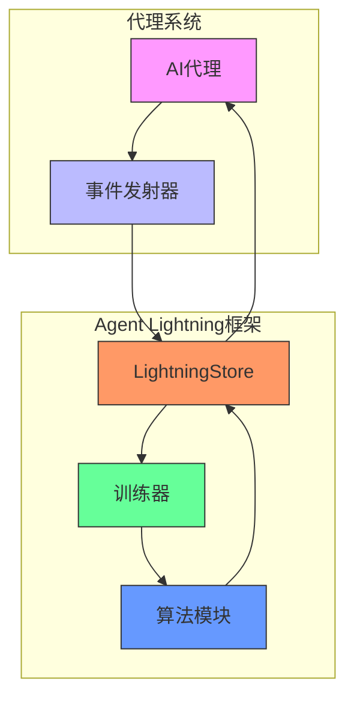

# 快速入门

<cite>
**本文档中引用的文件**  
- [README.md](file://README.md)
- [pyproject.toml](file://pyproject.toml)
- [agentlightning/__init__.py](file://agentlightning/__init__.py)
- [agentlightning/client.py](file://agentlightning/client.py)
- [agentlightning/server.py](file://agentlightning/server.py)
- [agentlightning/config.py](file://agentlightning/config.py)
- [agentlightning/store/base.py](file://agentlightning/store/base.py)
- [agentlightning/trainer/trainer.py](file://agentlightning/trainer/trainer.py)
- [agentlightning/runner/base.py](file://agentlightning/runner/base.py)
- [examples/calc_x/README.md](file://examples/calc_x/README.md)
- [examples/rag/README.md](file://examples/rag/README.md)
- [examples/calc_x/calc_agent.py](file://examples/calc_x/calc_agent.py)
</cite>

## 目录
1. [简介](#简介)
2. [安装与环境配置](#安装与环境配置)
3. [核心架构与组件交互](#核心架构与组件交互)
4. [第一个代理训练流程](#第一个代理训练流程)
5. [端到端使用案例](#端到端使用案例)
6. [常见问题与验证方法](#常见问题与验证方法)
7. [从示例迁移到自定义应用](#从示例迁移到自定义应用)

## 简介

Agent Lightning 是一个革命性的AI代理训练框架，其核心理念是通过**零代码变更**的方式优化任何AI代理系统。该框架允许开发者在不修改现有代理代码的前提下，将其转变为可优化的智能体，支持多种代理框架（如LangChain、OpenAI Agent SDK、AutoGen、CrewAI等）或无框架的Python OpenAI实现。用户可以选择性地优化多代理系统中的一个或多个代理，并支持强化学习、自动提示优化、监督微调等多种算法。

本快速入门指南将详细介绍如何安装配置Agent Lightning，启动第一个代理训练流程，并通过实际示例（如calc_x、rag）展示如何集成现有代理系统。

**Section sources**
- [README.md](file://README.md#L1-L110)

## 安装与环境配置

### 基础安装

Agent Lightning可以通过pip包管理器轻松安装：

```bash
pip install agentlightning
```

该命令会安装框架的核心依赖，包括graphviz、psutil、flask、agentops、litellm等。对于特定功能，可以安装可选依赖组：

```bash
# 安装自动提示优化(APO)相关依赖
pip install "agentlightning[apo]"

# 安装VERL训练相关依赖
pip install "agentlightning[verl]"

# 安装与特定代理框架的集成
pip install "agentlightning[agents]"
```

### 环境准备

对于calc_x示例，需要准备以下环境：

1. **硬件要求**：至少一个40GB显存的GPU
2. **代理框架依赖**：
   ```bash
   pip install "autogen-agentchat" "autogen-ext[openai]" "mcp>=1.10.0"
   ```
3. **数据集**：从指定链接下载Calc-X数据集并解压到data文件夹
   ```bash
   unzip calc-x-data.zip -d data
   ```
4. **Ray集群**：启动Ray分布式计算框架
   ```bash
   bash scripts/restart_ray.sh
   ```

### 验证安装

安装完成后，可以通过运行调试脚本验证环境配置是否正确：

```python
python examples/calc_x/calc_agent.py
```

如果环境配置正确，该脚本将成功运行并输出代理的响应结果。

**Section sources**
- [README.md](file://README.md#L111-L130)
- [pyproject.toml](file://pyproject.toml#L1-L284)
- [examples/calc_x/README.md](file://examples/calc_x/README.md#L1-L75)

## 核心架构与组件交互

Agent Lightning采用极简架构设计，确保用户可以专注于创意而非基础设施。其核心组件包括事件发射器、数据存储、训练器调度器和算法模块，这些组件通过清晰的交互关系协同工作。



**Diagram sources**
- [agentlightning/__init__.py](file://agentlightning/__init__.py#L1-L20)
- [agentlightning/store/base.py](file://agentlightning/store/base.py#L1-L516)

### 组件交互流程

1. **事件发射**：代理系统通过`agl.emit_xxx()`辅助函数或追踪器收集每个提示、工具调用和奖励，这些事件被转换为结构化的跨度（spans）并流入LightningStore
2. **数据存储**：LightningStore作为中央枢纽，同步任务、资源和追踪数据，为算法提供可靠的数据源
3. **训练器调度**：训练器负责协调整个训练循环，将数据集流式传输给运行器，管理资源在存储和算法之间的传递，并在改进落地时更新推理引擎
4. **算法学习**：算法模块读取跨度数据，从中学习并发布更新后的资源（如优化的提示模板或新的策略权重）

这种设计实现了零代码变更的优化理念，因为代理系统本身无需修改，只需通过轻量级的发射器与框架交互。

**Section sources**
- [README.md](file://README.md#L211-L240)
- [agentlightning/trainer/trainer.py](file://agentlightning/trainer/trainer.py#L1-L557)

## 第一个代理训练流程

### 训练器初始化

训练器（Trainer）是Agent Lightning的高级协调层，负责连接算法、运行器和存储。其初始化过程如下：

```python
from agentlightning import Trainer

trainer = Trainer(
    n_runners=4,  # 并行运行器数量
    max_rollouts=100,  # 每个运行器的最大rollout数量
    tracer=None,  # 追踪器配置
    adapter=None,  # 适配器配置
    store=None,  # 存储配置
    runner=None,  # 运行器配置
    strategy=None,  # 执行策略
    algorithm=None,  # 算法配置
    llm_proxy=None,  # LLM代理配置
    hooks=None,  # 钩子函数
)
```

### 训练流程执行

训练流程通过`fit()`方法启动，该方法包装了算法和运行器包，并将其交给执行策略：

```python
trainer.fit(
    agent=calc_agent,  # 代理实例
    train_dataset=train_dataset,  # 训练数据集
    val_dataset=val_dataset,  # 验证数据集
)
```

训练器会自动处理以下任务：
- 实例化算法并绑定依赖（存储、适配器、初始资源）
- 创建运行器实例并初始化代理
- 启动执行策略，在算法和运行器之间协调训练循环

### 开发模式

对于调试和快速迭代，可以使用`dev()`方法，该方法使用同步快速算法保持循环响应性：

```python
trainer.dev(
    agent=calc_agent,
    train_dataset=train_dataset,
    val_dataset=val_dataset,
)
```

**Section sources**
- [agentlightning/trainer/trainer.py](file://agentlightning/trainer/trainer.py#L1-L557)
- [agentlightning/runner/base.py](file://agentlightning/runner/base.py#L1-L183)

## 端到端使用案例

### calc_x数学推理代理

calc_x示例展示了如何使用VERL算法和AutoGen框架训练数学推理代理：

```python
@agl.rollout
async def calc_agent(task: MathProblem, llm: agl.LLM) -> None:
    """Calc-X代理rollout函数"""
    async with McpWorkbench(calculator_mcp_server) as workbench:
        calc_agent = autogen_assistant_agent(
            llm.model,
            llm.endpoint,
            llm.sampling_parameters.get("temperature", 0.7),
            workbench,
        )
        try:
            prompt = task["question"] + " " + output_format
            result = await calc_agent.run(task=prompt)
            # 提取答案并评估
            answer = extract_answer(result)
            reward = await evaluate(answer, str(task["result"]))
            agl.emit_reward(reward)  # 发射奖励
        except Exception as e:
            print("Failure:", str(e))
            answer = "None"
```

训练过程：
1. 启动Ray集群
2. 运行训练脚本：`python train_calc_agent.py --train-file data/train.parquet --val-file data/test.parquet`
3. 代理工作者执行数学问题rollout，训练服务器应用VERL算法优化模型

### RAG检索增强生成代理

RAG示例展示了如何训练具有维基百科检索能力的代理：

```python
# 1. 准备检索语料库
# - FAISS索引文件 (.index)
# - 文本块列表文件 (.pkl)

# 2. 启动维基检索MCP服务器
python wiki_retriever_mcp.py

# 3. 启动训练
bash train.sh
```

该代理通过检索和推理维基百科段落来回答多跳问题，使用MuSiQue数据集进行训练。

**Section sources**
- [examples/calc_x/README.md](file://examples/calc_x/README.md#L1-L75)
- [examples/rag/README.md](file://examples/rag/README.md#L1-L125)
- [examples/calc_x/calc_agent.py](file://examples/calc_x/calc_agent.py#L1-L159)

## 常见问题与验证方法

### 常见安装问题

1. **代理挂起**：最常见的问题是代理无限期挂起，通常是由于环境配置不当。验证`uv`和MCP计算器服务器是否正确安装：
   ```bash
   python examples/calc_x/tests/test_mcp_calculator.py
   ```

2. **依赖冲突**：由于框架依赖多个第三方库，可能出现版本冲突。建议使用虚拟环境隔离依赖。

3. **GPU内存不足**：calc_x示例需要至少40GB显存的GPU。如果内存不足，考虑使用更小的模型或减少批量大小。

### 验证安装成功

1. **运行调试脚本**：
   ```bash
   python examples/calc_x/calc_agent.py
   ```

2. **检查Ray状态**：
   ```bash
   ray status
   ```

3. **查看日志输出**：成功安装后，训练过程会产生详细的日志输出，包括任务接收、资源获取和奖励发射等信息。

### 故障排除

- **检查环境变量**：确保`OPENAI_API_KEY`和`OPENAI_API_BASE`等必要环境变量已设置
- **验证MCP服务器**：确保MCP计算器服务器正常运行
- **检查数据路径**：确认数据集已正确下载并放置在指定目录

**Section sources**
- [examples/calc_x/README.md](file://examples/calc_x/README.md#L60-L75)
- [examples/rag/README.md](file://examples/rag/README.md#L1-L125)

## 从示例迁移到自定义应用

### 自定义代理集成

要将现有代理系统集成到Agent Lightning，遵循以下步骤：

1. **定义任务结构**：创建TypedDict定义训练样本结构
   ```python
   class CustomTask(TypedDict):
       id: str
       input: str
       expected_output: str
   ```

2. **创建rollout函数**：使用`@agl.rollout`装饰器包装代理逻辑
   ```python
   @agl.rollout
   async def custom_agent(task: CustomTask, llm: agl.LLM) -> None:
       # 代理执行逻辑
       result = await execute_task(task, llm)
       reward = calculate_reward(result, task["expected_output"])
       agl.emit_reward(reward)
   ```

3. **配置训练器**：根据需求调整训练器参数
   ```python
   trainer = Trainer(
       n_runners=2,
       max_rollouts=50,
       # 其他配置
   )
   ```

### 核心原则

- **最小代码变更**：尽量保持原有代理代码不变，只添加必要的发射器调用
- **渐进式集成**：先从简单示例开始，逐步迁移到复杂系统
- **模块化设计**：将代理逻辑、奖励计算和资源管理分离，提高可维护性

通过遵循这些原则，开发者可以轻松地将Agent Lightning集成到现有项目中，实现零代码变更的AI代理优化。

**Section sources**
- [examples/calc_x/calc_agent.py](file://examples/calc_x/calc_agent.py#L1-L159)
- [agentlightning/emitter/message.py](file://agentlightning/emitter/message.py#L1-L34)