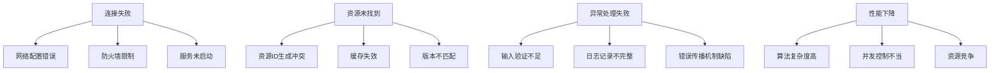
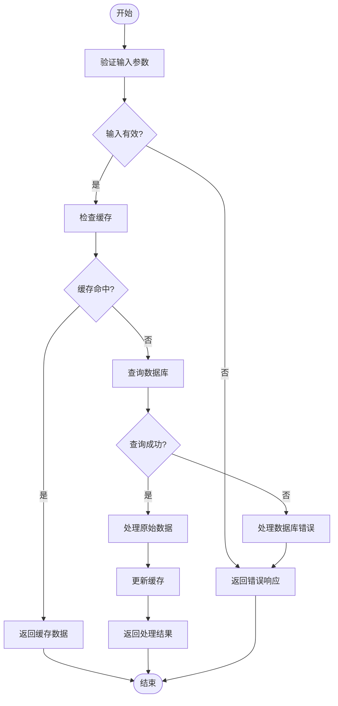
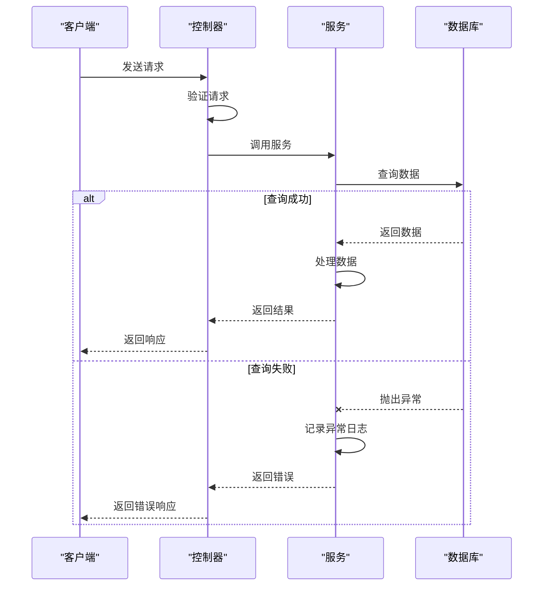
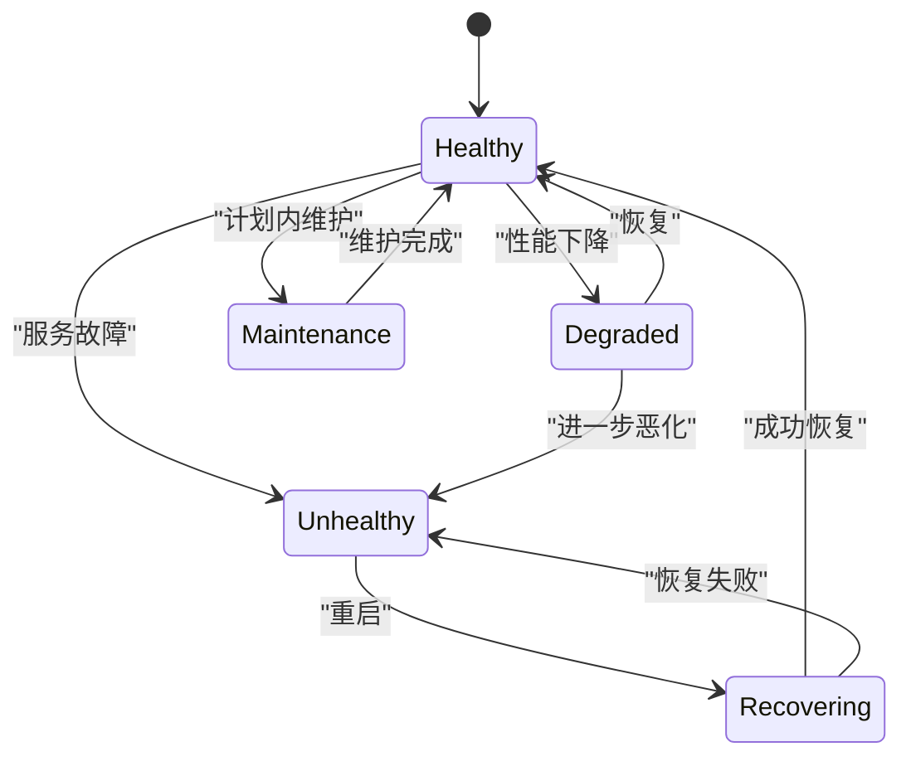

# 故障排除

<cite>
**本文档中引用的文件**   
- [agentlightning/emitter/exception.py](file://agentlightning/emitter/exception.py)
- [agentlightning/logging.py](file://agentlightning/logging.py)
- [agentlightning/store/base.py](file://agentlightning/store/base.py)
- [agentlightning/store/client_server.py](file://agentlightning/store/client_server.py)
- [agentlightning/server.py](file://agentlightning/server.py)
- [agentlightning/config.py](file://agentlightning/config.py)
- [agentlightning/tracer/http.py](file://agentlightning/tracer/http.py)
- [tests/store/test_client_server.py](file://tests/store/test_client_server.py)
- [tests/store/test_utils.py](file://tests/store/test_utils.py)
</cite>

## 目录
1. [简介](#简介)
2. [常见问题与错误症状](#常见问题与错误症状)
3. [根本原因分析](#根本原因分析)
4. [解决方案与修复方法](#解决方案与修复方法)
5. [日志分析方法](#日志分析方法)
6. [调试工具使用指南](#调试工具使用指南)
7. [错误代码对照表](#错误代码对照表)
8. [异常处理最佳实践](#异常处理最佳实践)
9. [监控指标解读](#监控指标解读)
10. [健康检查流程](#健康检查流程)

## 简介
本故障排除指南旨在为Agent Lightning系统提供全面的故障诊断和解决方案。该系统是一个用于训练AI代理的框架，支持多种代理框架和算法。本指南将系统性地列出安装问题、运行时错误、性能瓶颈和集成故障等各类问题，并提供详细的日志分析方法和调试工具使用指南。

## 常见问题与错误症状

### 安装问题
- **依赖冲突**：在安装过程中可能出现与其他Python包的版本冲突。
- **网络连接问题**：由于网络限制，无法从PyPI下载包。
- **权限错误**：在某些系统上安装时可能遇到权限不足的问题。

### 运行时错误
- **连接失败**：客户端无法连接到服务器，出现网络超时或连接被拒绝的错误。
- **资源未找到**：请求的资源ID不存在，导致404错误。
- **无效输入**：传递给`emit_message`或`emit_exception`的参数类型不正确，如非字符串或非异常实例。
- **序列化错误**：在处理OpenTelemetry跨度时出现序列化问题。

### 性能瓶颈
- **高延迟**：请求响应时间过长，特别是在处理大量数据时。
- **内存泄漏**：长时间运行后内存使用量持续增加。
- **CPU占用过高**：某些操作导致CPU使用率异常升高。

### 集成故障
- **跨服务通信失败**：在分布式环境中，不同组件之间的通信出现问题。
- **认证失败**：API调用因认证信息不正确而被拒绝。
- **数据不一致**：不同组件间的数据状态不同步。

**Section sources**
- [agentlightning/client.py](file://agentlightning/client.py)
- [agentlightning/server.py](file://agentlightning/server.py)

## 根本原因分析

### 连接问题
连接问题的根本原因通常包括：
- **网络配置错误**：服务器地址或端口配置不正确。
- **防火墙限制**：网络防火墙阻止了必要的端口通信。
- **服务未启动**：目标服务器服务没有正确启动。

### 资源管理问题
资源管理问题的根本原因可能涉及：
- **资源ID生成冲突**：多个实例同时生成相同的资源ID。
- **缓存失效**：客户端缓存了过期的资源信息。
- **版本不匹配**：使用的资源版本与预期不符。

### 异常处理问题
异常处理问题的根本原因包括：
- **输入验证不足**：函数未充分验证输入参数类型。
- **日志记录不完整**：异常发生时未能记录足够的上下文信息。
- **错误传播机制缺陷**：子进程中的异常未能正确传递回主进程。

### 性能问题
性能问题的根本原因可能有：
- **算法复杂度高**：某些操作的时间复杂度较高，导致处理大量数据时性能下降。
- **并发控制不当**：多线程或多进程环境下缺乏有效的同步机制。
- **资源竞争**：多个组件同时访问共享资源导致性能瓶颈。



**Diagram sources**
- [agentlightning/store/client_server.py](file://agentlightning/store/client_server.py#L756-L769)
- [agentlightning/tracer/http.py](file://agentlightning/tracer/http.py#L385-L392)

## 解决方案与修复方法

### 连接问题解决方案
- **检查网络配置**：确认服务器地址和端口配置正确。
- **调整防火墙设置**：确保必要的端口在防火墙中开放。
- **验证服务状态**：使用健康检查接口确认服务是否正常运行。

### 资源管理问题解决方案
- **改进ID生成算法**：使用更可靠的唯一ID生成策略，如结合时间戳和随机数。
- **实现缓存刷新机制**：定期刷新客户端缓存，确保获取最新资源信息。
- **加强版本控制**：在资源更新时明确标记版本号，并提供版本兼容性检查。

### 异常处理问题解决方案
- **增强输入验证**：在函数入口处添加严格的类型检查。
- **完善日志记录**：记录异常发生时的完整上下文信息，包括堆栈跟踪。
- **优化错误传播**：确保子进程中的异常能够正确传递并重新抛出。

### 性能问题解决方案
- **算法优化**：重构高复杂度算法，采用更高效的数据结构和算法。
- **并发控制**：使用锁或其他同步机制避免资源竞争。
- **资源池化**：对频繁使用的资源实现池化管理，减少创建和销毁开销。



**Diagram sources**
- [agentlightning/store/memory.py](file://agentlightning/store/memory.py#L124-L161)
- [agentlightning/store/utils.py](file://agentlightning/store/utils.py#L104-L126)

## 日志分析方法

### 日志级别配置
通过`configure_logger`函数可以设置日志级别，支持`DEBUG`、`INFO`、`WARNING`、`ERROR`和`CRITICAL`五个级别。建议在开发和调试阶段使用`DEBUG`级别，在生产环境中使用`INFO`或更高级别。

### 日志格式解析
日志条目采用统一格式：
```
%(asctime)s [%(levelname)s] (Process-%(process)d %(name)s)   %(message)s
```
其中包含时间戳、日志级别、进程ID、模块名称和消息内容。通过分析这些字段可以快速定位问题发生的上下文。

### 关键日志模式
- **连接尝试日志**：记录每次连接尝试的时间和结果。
- **资源操作日志**：记录资源的创建、更新和删除操作。
- **异常堆栈日志**：记录异常发生时的完整堆栈信息。
- **性能监控日志**：记录关键操作的执行时间和资源消耗。

### 日志聚合分析
使用集中式日志管理系统（如ELK Stack）收集所有组件的日志，通过关联ID将分布式系统中的相关日志串联起来，形成完整的请求链路视图。

**Section sources**
- [agentlightning/logging.py](file://agentlightning/logging.py)
- [agentlightning/emitter/exception.py](file://agentlightning/emitter/exception.py)

## 调试工具使用指南

### 内置调试功能
系统提供了多种内置调试工具：
- **健康检查接口**：通过`/health`端点检查服务状态。
- **实时监控面板**：提供关键指标的可视化展示。
- **动态配置更新**：支持运行时修改配置参数。

### 外部调试工具
推荐使用以下外部工具进行深入调试：
- **Python调试器(pdb)**：用于逐行调试代码。
- **性能分析器(cProfile)**：分析代码执行性能。
- **内存分析器(memory_profiler)**：检测内存使用情况。

### 调试模式启动
可以通过命令行参数启动调试模式：
```python
python -m debugpy --listen 5678 --wait-for-client your_script.py
```
这将启动调试服务器，等待IDE连接进行远程调试。

### 分布式调试
对于分布式环境，建议使用分布式追踪系统（如OpenTelemetry）来跟踪请求在不同服务间的流转过程，帮助识别性能瓶颈和错误源头。

**Section sources**
- [agentlightning/tracer/http.py](file://agentlightning/tracer/http.py)
- [agentlightning/execution/client_server.py](file://agentlightning/execution/client_server.py)

## 错误代码对照表

| 错误代码 | 错误类型 | 描述 | 建议解决方案 |
|---------|--------|------|-------------|
| 400 | Bad Request | 请求格式不正确 | 检查请求体格式和参数类型 |
| 401 | Unauthorized | 认证失败 | 验证认证凭据是否正确 |
| 403 | Forbidden | 权限不足 | 检查用户权限配置 |
| 404 | Not Found | 资源不存在 | 确认资源ID是否正确 |
| 408 | Request Timeout | 请求超时 | 增加超时时间或优化网络 |
| 429 | Too Many Requests | 请求过于频繁 | 实施限流策略 |
| 500 | Internal Server Error | 服务器内部错误 | 检查服务日志获取详细信息 |
| 502 | Bad Gateway | 网关错误 | 检查后端服务状态 |
| 503 | Service Unavailable | 服务不可用 | 检查服务是否正常运行 |
| 504 | Gateway Timeout | 网关超时 | 增加网关超时时间 |

**Section sources**
- [agentlightning/server.py](file://agentlightning/server.py)
- [tests/store/test_client_server.py](file://tests/store/test_client_server.py)

## 异常处理最佳实践

### 统一异常处理框架
建立统一的异常处理框架，确保所有异常都通过标准化的方式被捕获和处理。使用`emit_exception`函数记录所有异常，保证异常信息的一致性和完整性。

### 分层异常处理
实施分层异常处理策略：
- **底层**：捕获具体的技术异常，如网络错误、数据库错误等。
- **业务层**：将技术异常转换为有意义的业务异常。
- **接口层**：向客户端返回友好的错误信息，同时记录详细的错误日志。

### 异常分类管理
根据异常的性质进行分类管理：
- **可恢复异常**：如网络超时，可以通过重试解决。
- **不可恢复异常**：如认证失败，需要用户干预。
- **系统异常**：如内存溢出，需要重启服务。

### 异常上下文记录
在捕获异常时，记录完整的上下文信息，包括：
- 发生时间
- 相关请求ID
- 用户身份信息
- 操作参数
- 系统状态



**Diagram sources**
- [agentlightning/emitter/exception.py](file://agentlightning/emitter/exception.py)
- [tests/emitter/test_emitter.py](file://tests/emitter/test_emitter.py)

## 监控指标解读

### 关键性能指标(KPI)
- **请求延迟**：衡量系统响应速度，应保持在可接受范围内。
- **错误率**：监控失败请求的比例，及时发现潜在问题。
- **吞吐量**：单位时间内处理的请求数量，反映系统处理能力。
- **资源利用率**：CPU、内存、磁盘等资源的使用情况。

### 业务指标
- **任务完成率**：成功完成的任务占总任务的比例。
- **平均处理时间**：每个任务的平均处理时长。
- **重试次数**：任务需要重试的平均次数。
- **资源更新频率**：资源更新的频次，反映系统活跃度。

### 健康度指标
- **服务可用性**：服务正常运行的时间比例。
- **心跳间隔**：组件间通信的心跳频率。
- **队列长度**：待处理任务队列的长度。
- **连接数**：当前活跃的客户端连接数量。

### 指标阈值设置
为各项指标设置合理的预警阈值：
- **警告级别**：当指标接近极限时触发，提醒运维人员关注。
- **严重级别**：当指标超出安全范围时触发，需要立即处理。
- **紧急级别**：当系统面临崩溃风险时触发，需要紧急响应。

**Section sources**
- [agentlightning/store/base.py](file://agentlightning/store/base.py)
- [agentlightning/verl/daemon.py](file://agentlightning/verl/daemon.py)

## 健康检查流程

### 健康检查机制
系统实现了自动化的健康检查机制，定期检测各个组件的状态。健康检查包括：
- **连接性测试**：验证与其他服务的网络连接。
- **资源可用性**：检查关键资源是否可访问。
- **性能基准**：评估系统性能是否在正常范围内。
- **数据一致性**：验证数据存储的完整性和一致性。

### 健康检查频率
根据组件的重要性和变化频率设置不同的检查间隔：
- **核心服务**：每10秒检查一次。
- **辅助服务**：每30秒检查一次。
- **外部依赖**：每60秒检查一次。
- **批处理任务**：在任务开始前进行检查。

### 健康检查响应
当健康检查发现问题时，系统会采取相应措施：
- **临时降级**：将有问题的服务从负载均衡中移除。
- **自动重启**：尝试重启故障服务。
- **告警通知**：通过邮件、短信等方式通知相关人员。
- **日志记录**：详细记录健康检查的结果和采取的措施。

### 自定义健康检查
允许用户定义自定义的健康检查逻辑，以满足特定需求。通过继承`HealthChecker`类并实现`check`方法，可以添加特定的检查项。



**Diagram sources**
- [tests/store/test_utils.py](file://tests/store/test_utils.py)
- [agentlightning/store/memory.py](file://agentlightning/store/memory.py)