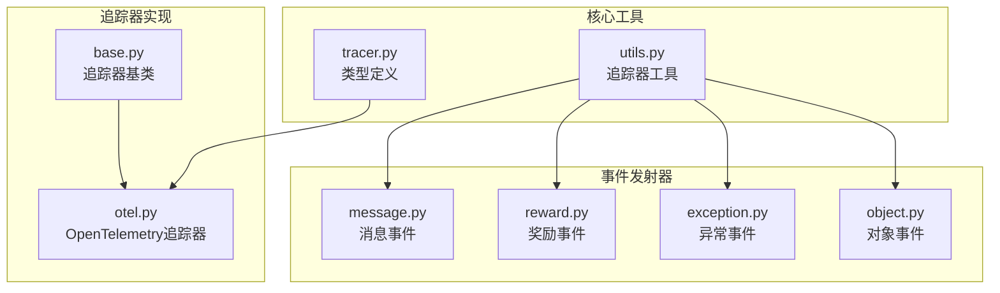
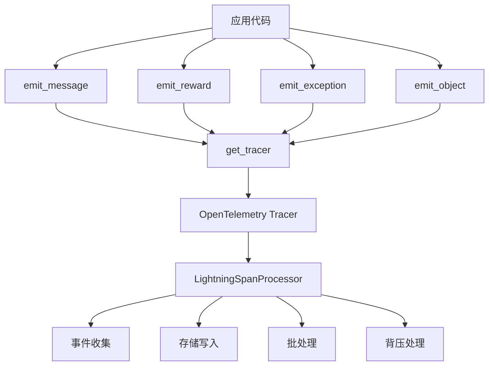
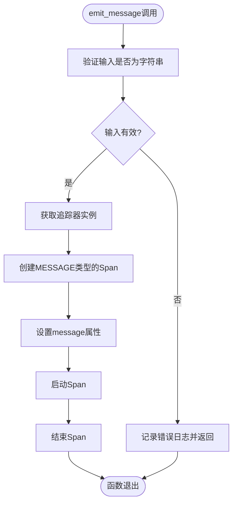
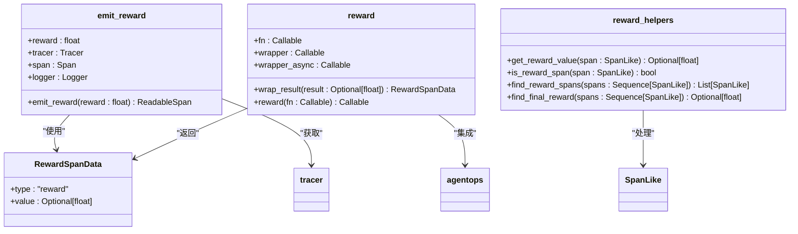
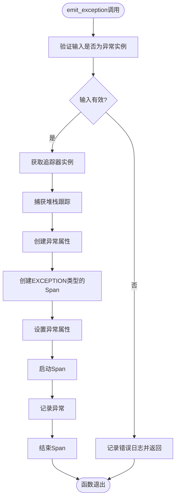
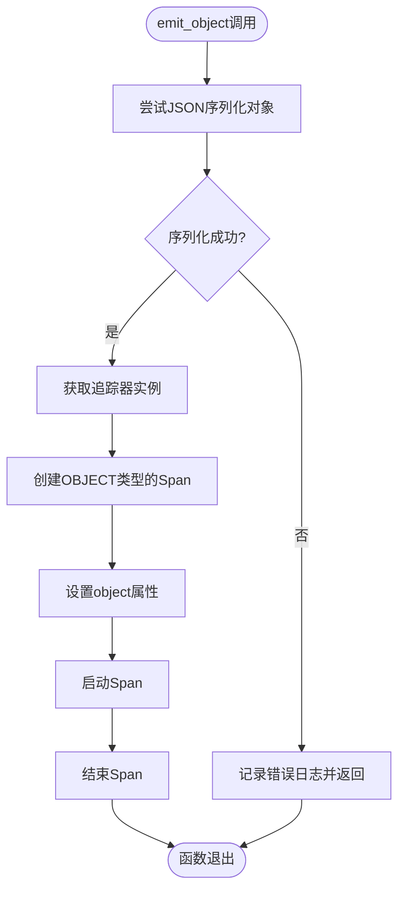
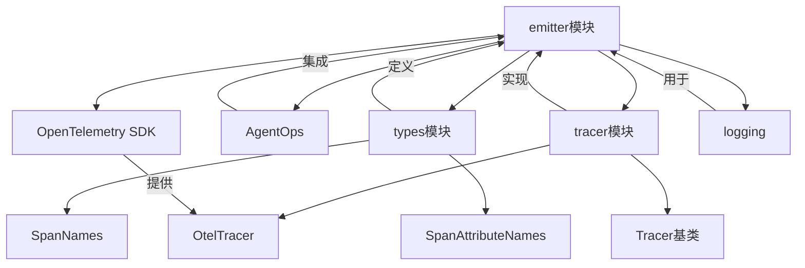

# 事件发射系统

<cite>
**本文档中引用的文件**  
- [message.py](file://agentlightning/emitter/message.py)
- [reward.py](file://agentlightning/emitter/reward.py)
- [exception.py](file://agentlightning/emitter/exception.py)
- [object.py](file://agentlightning/emitter/object.py)
- [utils.py](file://agentlightning/emitter/utils.py)
- [tracer.py](file://agentlightning/types/tracer.py)
- [otel.py](file://agentlightning/tracer/otel.py)
- [base.py](file://agentlightning/tracer/base.py)
</cite>

## 目录
1. [简介](#简介)
2. [项目结构](#项目结构)
3. [核心组件](#核心组件)
4. [架构概述](#架构概述)
5. [详细组件分析](#详细组件分析)
6. [依赖分析](#依赖分析)
7. [性能考虑](#性能考虑)
8. [故障排除指南](#故障排除指南)
9. [结论](#结论)

## 简介
本文档深入解析事件发射系统的设计与实现，涵盖消息、奖励、异常等各类事件的发射机制。系统基于OpenTelemetry标准构建，提供统一的遥测数据收集框架，支持与主流监控系统的互操作性。文档详细说明emit_message、emit_reward等API的使用方法、参数约束和内部处理流程，并讨论事件采样策略、批处理优化和背压处理机制。

## 项目结构
事件发射系统位于agentlightning/emitter目录下，包含多个专门化的发射器模块，每个模块负责特定类型事件的发射。系统通过统一的工具模块获取追踪器实例，并与OpenTelemetry SDK集成。类型定义位于types模块中，而追踪器实现位于tracer模块中。

**Diagram sources**
- [agentlightning/emitter/message.py](file://agentlightning/emitter/message.py)
- [agentlightning/emitter/reward.py](file://agentlightning/emitter/reward.py)
- [agentlightning/emitter/exception.py](file://agentlightning/emitter/exception.py)
- [agentlightning/emitter/object.py](file://agentlightning/emitter/object.py)
- [agentlightning/emitter/utils.py](file://agentlightning/emitter/utils.py)
- [agentlightning/types/tracer.py](file://agentlightning/types/tracer.py)
- [agentlightning/tracer/otel.py](file://agentlightning/tracer/otel.py)
- [agentlightning/tracer/base.py](file://agentlightning/tracer/base.py)

**Section sources**
- [agentlightning/emitter/__init__.py](file://agentlightning/emitter/__init__.py)

## 核心组件
事件发射系统的核心组件包括消息发射器、奖励发射器、异常发射器和对象发射器。这些组件通过统一的API将不同类型的事件转换为OpenTelemetry兼容的Span格式。系统使用get_tracer工具函数获取配置好的追踪器实例，并确保所有发射的事件都带有正确的属性和元数据。

**Section sources**
- [agentlightning/emitter/message.py](file://agentlightning/emitter/message.py#L1-L34)
- [agentlightning/emitter/reward.py](file://agentlightning/emitter/reward.py#L1-L239)
- [agentlightning/emitter/exception.py](file://agentlightning/emitter/exception.py#L1-L47)
- [agentlightning/emitter/object.py](file://agentlightning/emitter/object.py#L1-L38)

## 架构概述
事件发射系统采用分层架构设计，上层为特定事件类型的发射器，中层为通用工具函数，底层为OpenTelemetry追踪器。当应用程序调用emit_message、emit_reward等函数时，这些函数会通过get_tracer获取追踪器实例，创建相应的Span，并设置适当的属性。所有发射的事件最终都会被LightningSpanProcessor收集和处理。

**Diagram sources**
- [agentlightning/emitter/utils.py](file://agentlightning/emitter/utils.py#L1-L23)
- [agentlightning/tracer/otel.py](file://agentlightning/tracer/otel.py#L1-L96)

## 详细组件分析

### 消息事件发射器分析
消息事件发射器负责将文本消息作为OpenTelemetry Span发射。该组件确保消息内容被正确地作为Span属性附加，并提供适当的日志记录和错误处理。

**Diagram sources**
- [agentlightning/emitter/message.py](file://agentlightning/emitter/message.py#L1-L34)

**Section sources**
- [agentlightning/emitter/message.py](file://agentlightning/emitter/message.py#L1-L34)

### 奖励事件发射器分析
奖励事件发射器是系统中最复杂的组件，它不仅提供emit_reward函数，还包含reward装饰器和一系列辅助函数用于奖励值的提取和查询。该组件支持与AgentOps的集成，并处理同步和异步函数的装饰。

**Diagram sources**
- [agentlightning/emitter/reward.py](file://agentlightning/emitter/reward.py#L1-L239)

**Section sources**
- [agentlightning/emitter/reward.py](file://agentlightning/emitter/reward.py#L1-L239)

### 异常事件发射器分析
异常事件发射器负责将异常信息作为OpenTelemetry Span发射。该组件不仅记录异常的基本信息，还捕获完整的堆栈跟踪，并将其作为Span属性附加。

**Diagram sources**
- [agentlightning/emitter/exception.py](file://agentlightning/emitter/exception.py#L1-L47)

**Section sources**
- [agentlightning/emitter/exception.py](file://agentlightning/emitter/exception.py#L1-L47)

### 对象事件发射器分析
对象事件发射器负责将任意对象的序列化表示作为OpenTelemetry Span发射。该组件使用JSON序列化对象，并处理序列化失败的情况。

**Diagram sources**
- [agentlightning/emitter/object.py](file://agentlightning/emitter/object.py#L1-L38)

**Section sources**
- [agentlightning/emitter/object.py](file://agentlightning/emitter/object.py#L1-L38)

## 依赖分析
事件发射系统依赖于OpenTelemetry SDK和AgentOps库。系统通过types模块定义了与OpenTelemetry兼容的类型，如SpanNames和SpanAttributeNames。追踪器实现依赖于tracer模块中的基类和具体实现。所有发射器都依赖于utils模块中的get_tracer函数来获取追踪器实例。

**Diagram sources**
- [agentlightning/types/tracer.py](file://agentlightning/types/tracer.py#L1-L427)
- [agentlightning/tracer/otel.py](file://agentlightning/tracer/otel.py#L1-L96)
- [agentlightning/tracer/base.py](file://agentlightning/tracer/base.py#L1-L141)

**Section sources**
- [agentlightning/emitter/utils.py](file://agentlightning/emitter/utils.py#L1-L23)

## 性能考虑
事件发射系统在高并发场景下通过多种机制优化性能。LightningSpanProcessor使用独立的事件循环线程处理异步操作，避免阻塞主应用线程。系统支持事件采样策略，可以过滤掉未采样的Span。批处理机制将多个Span写入操作合并，减少I/O开销。背压处理机制通过内存阈值和队列限制防止内存溢出。

**Section sources**
- [agentlightning/tracer/otel.py](file://agentlightning/tracer/otel.py#L1-L96)
- [tests/tracer/test_otel.py](file://tests/tracer/test_otel.py#L1-L414)

## 故障排除指南
当事件发射系统出现问题时，首先检查OpenTelemetry是否已正确初始化。如果get_tracer抛出RuntimeError，说明追踪器未初始化。检查日志输出以确定事件是否被正确发射。对于奖励事件，确保数值可以转换为浮点数。对于对象事件，确保对象是JSON可序列化的。在分布式环境中，验证LightningSpanProcessor的跨进程行为是否符合预期。

**Section sources**
- [agentlightning/emitter/utils.py](file://agentlightning/emitter/utils.py#L1-L23)
- [agentlightning/emitter/reward.py](file://agentlightning/emitter/reward.py#L1-L239)
- [tests/tracer/test_otel.py](file://tests/tracer/test_otel.py#L1-L414)

## 结论
事件发射系统提供了一套完整的机制，用于将消息、奖励、异常和对象等事件转换为OpenTelemetry兼容的Span格式。系统设计考虑了可扩展性、性能和可靠性，支持与主流监控系统的互操作性。通过统一的API和灵活的配置选项，开发者可以轻松地将遥测功能集成到他们的应用中，同时确保在高并发场景下的稳定性能。