# 事件发射系统

<cite>
**本文档中引用的文件**
- [agentlightning/emitter/__init__.py](file://agentlightning/emitter/__init__.py)
- [agentlightning/emitter/message.py](file://agentlightning/emitter/message.py)
- [agentlightning/emitter/reward.py](file://agentlightning/emitter/reward.py)
- [agentlightning/emitter/exception.py](file://agentlightning/emitter/exception.py)
- [agentlightning/emitter/object.py](file://agentlightning/emitter/object.py)
- [agentlightning/emitter/utils.py](file://agentlightning/emitter/utils.py)
- [agentlightning/types/tracer.py](file://agentlightning/types/tracer.py)
- [agentlightning/tracer/base.py](file://agentlightning/tracer/base.py)
- [agentlightning/tracer/otel.py](file://agentlightning/tracer/otel.py)
- [agentlightning/tracer/agentops.py](file://agentlightning/tracer/agentops.py)
- [agentlightning/execution/events.py](file://agentlightning/execution/events.py)
- [tests/emitter/test_emitter.py](file://tests/emitter/test_emitter.py)
</cite>

## 目录
1. [简介](#简介)
2. [系统架构概览](#系统架构概览)
3. [核心事件类型](#核心事件类型)
4. [Emitter组件设计](#emitter组件设计)
5. [上下文管理与装饰器集成](#上下文管理与装饰器集成)
6. [事件过滤与采样机制](#事件过滤与采样机制)
7. [批量发送与性能优化](#批量发送与性能优化)
8. [高并发处理与背压保护](#高并发处理与背压保护)
9. [自定义事件类型扩展](#自定义事件类型扩展)
10. [调试与验证指南](#调试与验证指南)
11. [最佳实践与故障排除](#最佳实践与故障排除)

## 简介

事件发射系统是Agent Lightning框架的核心监控组件，负责采集、封装和分发各种类型的事件数据。该系统通过统一的接口支持消息、奖励和异常事件的透明监控，为LLM调用、工具执行和用户交互提供完整的可观测性支持。

系统采用OpenTelemetry标准作为底层基础设施，确保与主流监控生态系统的兼容性。通过精心设计的架构，事件发射系统能够在不影响业务逻辑的前提下，实现对代理执行流程的无缝集成。

## 系统架构概览

事件发射系统采用分层架构设计，从底层的OpenTelemetry基础设施到上层的应用接口，形成了完整的事件处理链路。

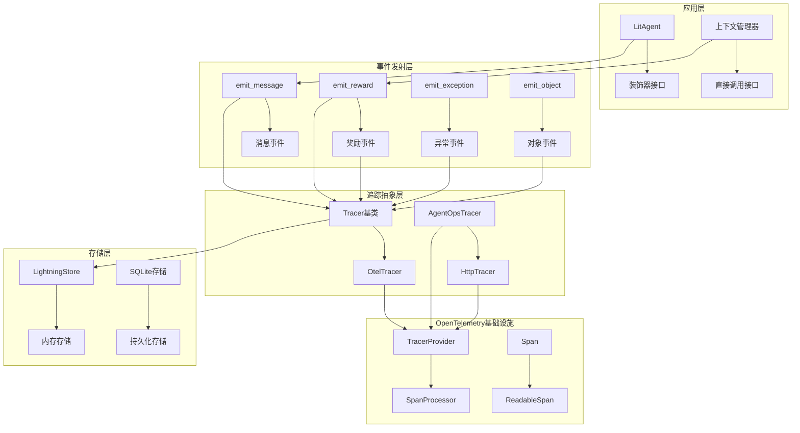
```mermaid
graph TB
subgraph "应用层"
A[LitAgent] --> B[装饰器接口]
C[上下文管理器] --> D[直接调用接口]
end
subgraph "事件发射层"
E[emit_message] --> F[消息事件]
G[emit_reward] --> H[奖励事件]
I[emit_exception] --> J[异常事件]
K[emit_object] --> L[对象事件]
end
subgraph "追踪抽象层"
M[Tracer基类] --> N[OtelTracer]
O[AgentOpsTracer] --> P[HttpTracer]
end
subgraph "存储层"
Q[LightningStore] --> R[内存存储]
S[SQLite存储] --> T[持久化存储]
end
subgraph "OpenTelemetry基础设施"
U[TracerProvider] --> V[SpanProcessor]
W[Span] --> X[ReadableSpan]
end
A --> E
C --> G
E --> M
G --> M
H --> M
J --> M
L --> M
M --> Q
N --> U
O --> U
P --> U
```

**图表来源**
- [agentlightning/tracer/base.py](file://agentlightning/tracer/base.py#L1-L141)
- [agentlightning/emitter/__init__.py](file://agentlightning/emitter/__init__.py#L1-L26)

**章节来源**
- [agentlightning/tracer/base.py](file://agentlightning/tracer/base.py#L1-L141)
- [agentlightning/emitter/__init__.py](file://agentlightning/emitter/__init__.py#L1-L26)

## 核心事件类型

事件发射系统支持四种主要的事件类型，每种类型都有特定的用途和数据结构。

### 消息事件 (Message Events)

消息事件用于记录文本信息，通常包含人类可读的消息内容。

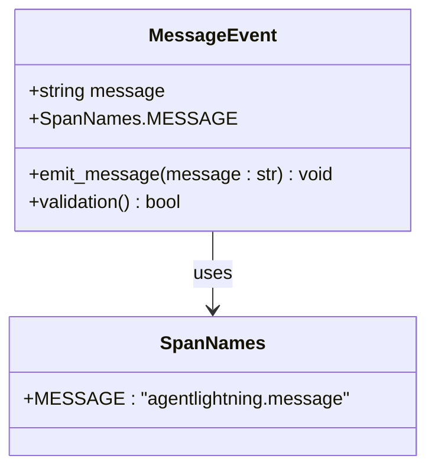
```mermaid
classDiagram
class MessageEvent {
+string message
+SpanNames.MESSAGE
+emit_message(message : str) void
+validation() bool
}
class SpanNames {
+MESSAGE : "agentlightning.message"
}
MessageEvent --> SpanNames : uses
```

**图表来源**
- [agentlightning/emitter/message.py](file://agentlightning/emitter/message.py#L1-L34)
- [agentlightning/types/tracer.py](file://agentlightning/types/tracer.py#L400-L420)

### 奖励事件 (Reward Events)

奖励事件专门用于记录强化学习中的奖励值，支持同步和异步函数的装饰器模式。

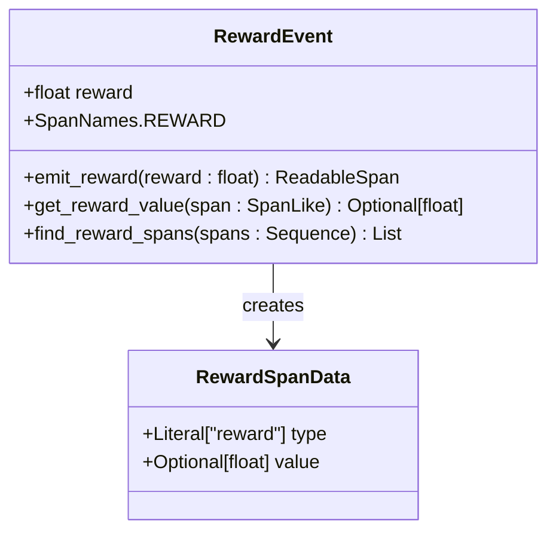
```mermaid
classDiagram
class RewardEvent {
+float reward
+SpanNames.REWARD
+emit_reward(reward : float) ReadableSpan
+get_reward_value(span : SpanLike) Optional[float]
+find_reward_spans(spans : Sequence) List
}
class RewardSpanData {
+Literal["reward"] type
+Optional[float] value
}
RewardEvent --> RewardSpanData : creates
```

**图表来源**
- [agentlightning/emitter/reward.py](file://agentlightning/emitter/reward.py#L1-L239)
- [agentlightning/types/tracer.py](file://agentlightning/types/tracer.py#L400-L420)

### 异常事件 (Exception Events)

异常事件捕获和记录程序运行时发生的异常，提供完整的堆栈跟踪信息。

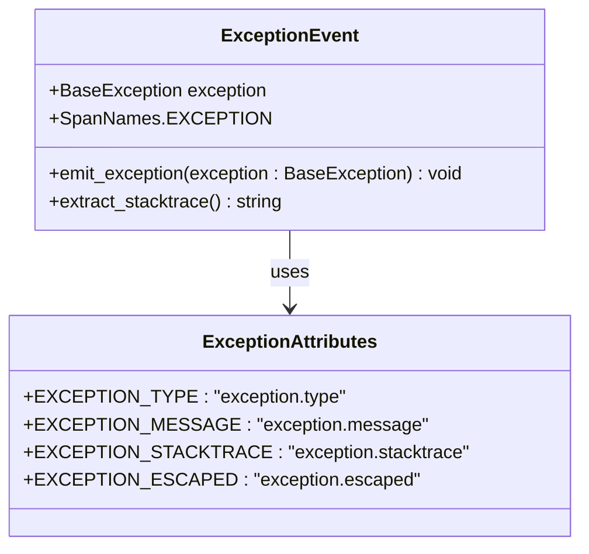
```mermaid
classDiagram
class ExceptionEvent {
+BaseException exception
+SpanNames.EXCEPTION
+emit_exception(exception : BaseException) void
+extract_stacktrace() string
}
class ExceptionAttributes {
+EXCEPTION_TYPE : "exception.type"
+EXCEPTION_MESSAGE : "exception.message"
+EXCEPTION_STACKTRACE : "exception.stacktrace"
+EXCEPTION_ESCAPED : "exception.escaped"
}
ExceptionEvent --> ExceptionAttributes : uses
```

**图表来源**
- [agentlightning/emitter/exception.py](file://agentlightning/emitter/exception.py#L1-L47)
- [agentlightning/types/tracer.py](file://agentlightning/types/tracer.py#L400-L420)

### 对象事件 (Object Events)

对象事件序列化任意Python对象并记录其JSON表示形式。

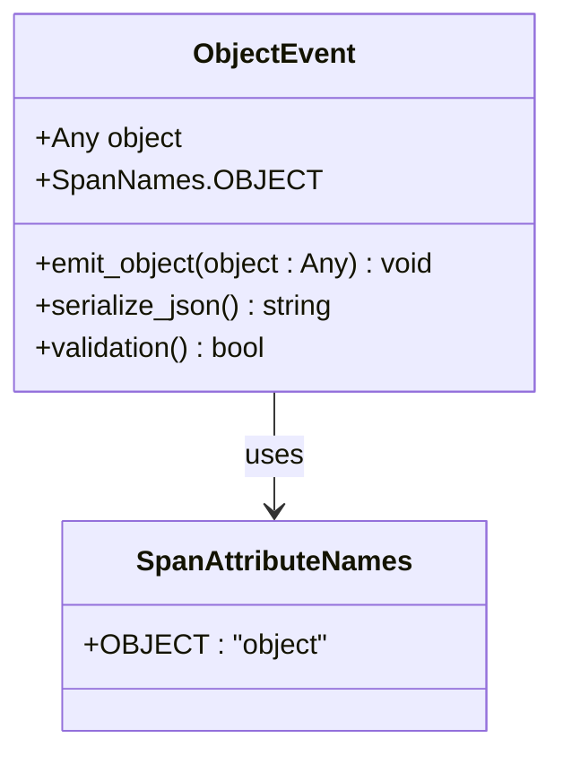
```mermaid
classDiagram
class ObjectEvent {
+Any object
+SpanNames.OBJECT
+emit_object(object : Any) void
+serialize_json() string
+validation() bool
}
class SpanAttributeNames {
+OBJECT : "object"
}
ObjectEvent --> SpanAttributeNames : uses
```

**图表来源**
- [agentlightning/emitter/object.py](file://agentlightning/emitter/object.py#L1-L38)
- [agentlightning/types/tracer.py](file://agentlightning/types/tracer.py#L400-L420)

**章节来源**
- [agentlightning/emitter/message.py](file://agentlightning/emitter/message.py#L1-L34)
- [agentlightning/emitter/reward.py](file://agentlightning/emitter/reward.py#L1-L239)
- [agentlightning/emitter/exception.py](file://agentlightning/emitter/exception.py#L1-L47)
- [agentlightning/emitter/object.py](file://agentlightning/emitter/object.py#L1-L38)

## Emitter组件设计

Emitter组件采用模块化设计，每个事件类型都有独立的实现模块，确保功能的清晰分离和维护性。

### 组件架构

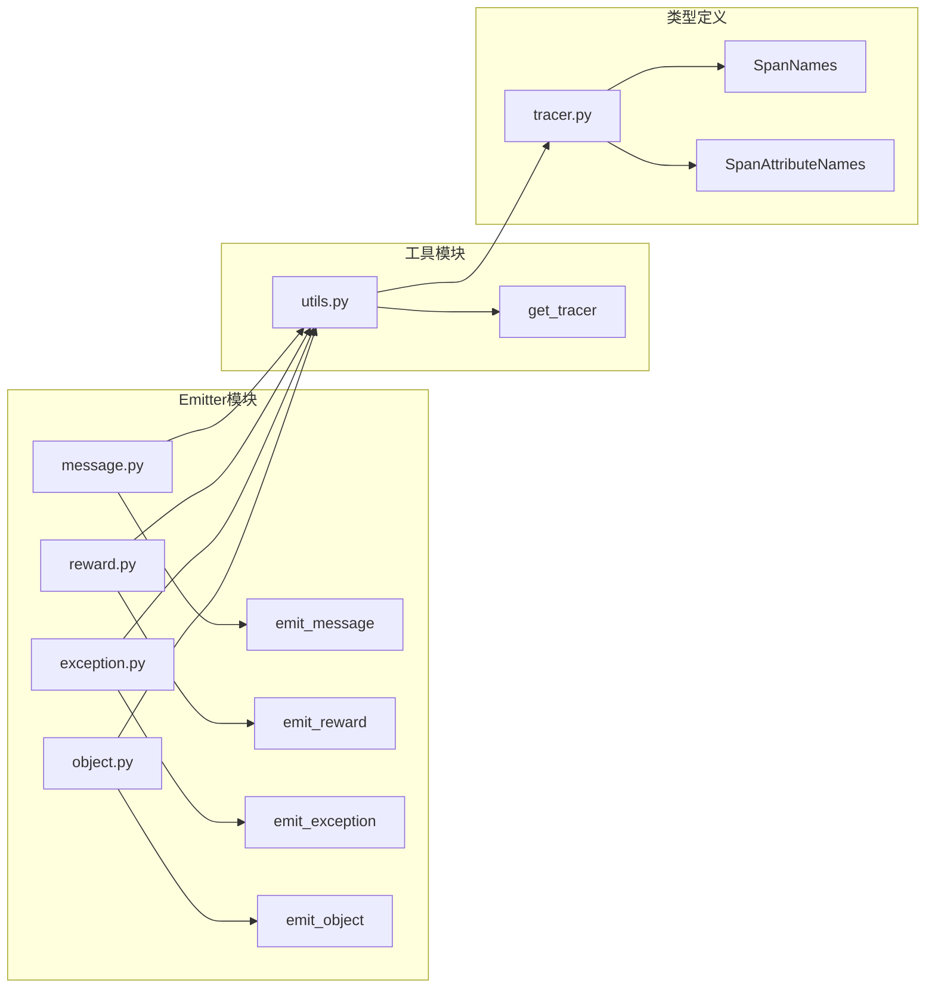
```mermaid
graph LR
subgraph "Emitter模块"
A[message.py] --> B[emit_message]
C[reward.py] --> D[emit_reward]
E[exception.py] --> F[emit_exception]
G[object.py] --> H[emit_object]
end
subgraph "工具模块"
I[utils.py] --> J[get_tracer]
end
subgraph "类型定义"
K[tracer.py] --> L[SpanNames]
K --> M[SpanAttributeNames]
end
A --> I
C --> I
E --> I
G --> I
I --> K
```

**图表来源**
- [agentlightning/emitter/__init__.py](file://agentlightning/emitter/__init__.py#L1-L26)
- [agentlightning/emitter/utils.py](file://agentlightning/emitter/utils.py#L1-L23)

### 通用接口设计

所有Emitter组件都遵循相同的接口模式，提供一致的使用体验：

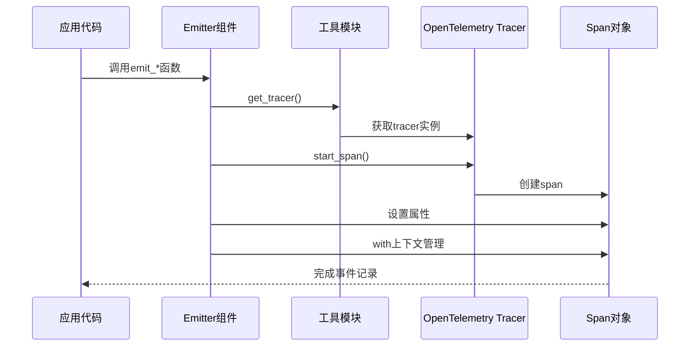
```mermaid
sequenceDiagram
participant App as 应用代码
participant Emitter as Emitter组件
participant Utils as 工具模块
participant Tracer as OpenTelemetry Tracer
participant Span as Span对象
App->>Emitter : 调用emit_*函数
Emitter->>Utils : get_tracer()
Utils->>Tracer : 获取tracer实例
Emitter->>Tracer : start_span()
Tracer->>Span : 创建span
Emitter->>Span : 设置属性
Emitter->>Span : with上下文管理
Span-->>App : 完成事件记录
```

**图表来源**
- [agentlightning/emitter/utils.py](file://agentlightning/emitter/utils.py#L10-L23)
- [agentlightning/emitter/message.py](file://agentlightning/emitter/message.py#L15-L30)

**章节来源**
- [agentlightning/emitter/__init__.py](file://agentlightning/emitter/__init__.py#L1-L26)
- [agentlightning/emitter/utils.py](file://agentlightning/emitter/utils.py#L1-L23)

## 上下文管理与装饰器集成

事件发射系统通过上下文管理器和装饰器两种方式无缝集成到代理执行流程中。

### 上下文管理器模式

上下文管理器提供了最灵活的事件监控方式，适用于复杂的业务逻辑场景。

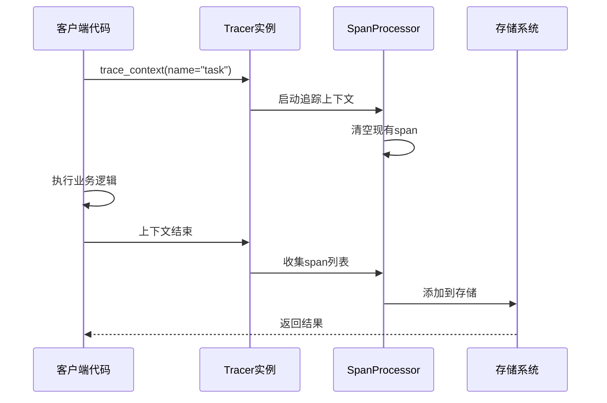
```mermaid
sequenceDiagram
participant Client as 客户端代码
participant Tracer as Tracer实例
participant Processor as SpanProcessor
participant Store as 存储系统
Client->>Tracer : trace_context(name="task")
Tracer->>Processor : 启动追踪上下文
Processor->>Processor : 清空现有span
Client->>Client : 执行业务逻辑
Client->>Tracer : 上下文结束
Tracer->>Processor : 收集span列表
Processor->>Store : 添加到存储
Store-->>Client : 返回结果
```

**图表来源**
- [agentlightning/tracer/base.py](file://agentlightning/tracer/base.py#L40-L80)
- [agentlightning/tracer/otel.py](file://agentlightning/tracer/otel.py#L50-L95)

### 装饰器模式

装饰器为函数级别的事件监控提供了简洁的语法糖，特别适合奖励函数的监控。

```mermaid
flowchart TD
A[定义奖励函数] --> B[应用@reward装饰器]
B --> C{检查AgentOps状态}
C --> |已初始化| D[使用AgentOps装饰器]
C --> |未初始化| E[使用内置装饰器]
D --> F[包装异步函数]
E --> G[包装同步函数]
F --> H[执行函数并记录奖励]
G --> H
H --> I[返回原始结果]
```

**图表来源**
- [agentlightning/emitter/reward.py](file://agentlightning/emitter/reward.py#L50-L120)

### 自动集成机制

系统能够自动检测AgentOps环境并在可用时进行集成：

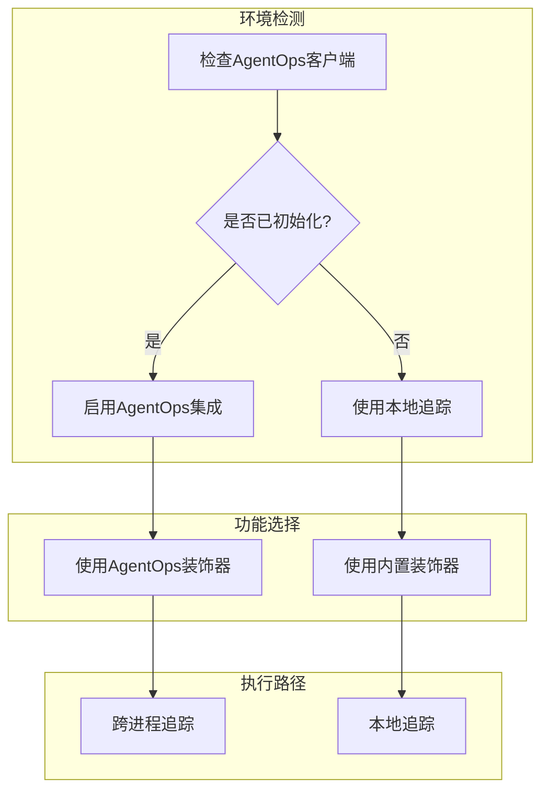
```mermaid
graph TB
subgraph "环境检测"
A[检查AgentOps客户端] --> B{是否已初始化?}
B --> |是| C[启用AgentOps集成]
B --> |否| D[使用本地追踪]
end
subgraph "功能选择"
C --> E[使用AgentOps装饰器]
D --> F[使用内置装饰器]
end
subgraph "执行路径"
E --> G[跨进程追踪]
F --> H[本地追踪]
end
```

**图表来源**
- [agentlightning/emitter/reward.py](file://agentlightning/emitter/reward.py#L60-L80)

**章节来源**
- [agentlightning/tracer/base.py](file://agentlightning/tracer/base.py#L40-L141)
- [agentlightning/emitter/reward.py](file://agentlightning/emitter/reward.py#L50-L120)

## 事件过滤与采样机制

事件发射系统实现了智能的过滤和采样机制，以优化性能并减少不必要的事件传输。

### 过滤策略

系统根据多个维度对事件进行过滤：

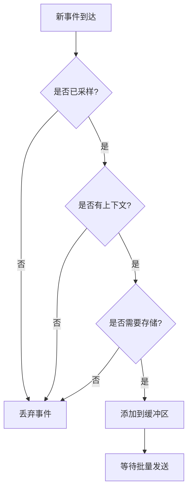
```mermaid
flowchart TD
A[新事件到达] --> B{是否已采样?}
B --> |否| C[丢弃事件]
B --> |是| D{是否有上下文?}
D --> |否| C
D --> |是| E{是否需要存储?}
E --> |否| C
E --> |是| F[添加到缓冲区]
F --> G[等待批量发送]
```

**图表来源**
- [agentlightning/tracer/agentops.py](file://agentlightning/tracer/agentops.py#L340-L370)

### 采样率控制

系统支持动态调整采样率以平衡监控精度和性能开销：

| 配置参数 | 类型 | 默认值 | 描述 |
|---------|------|--------|------|
| sample_rate | float | 1.0 | 事件采样率，范围0.0-1.0 |
| memory_threshold | int | 100MB | 内存阈值，超过时触发清理 |
| batch_size | int | 100 | 批量发送大小 |
| flush_interval | float | 5.0 | 刷新间隔（秒） |

### 条件过滤

系统实现了多种条件过滤规则：

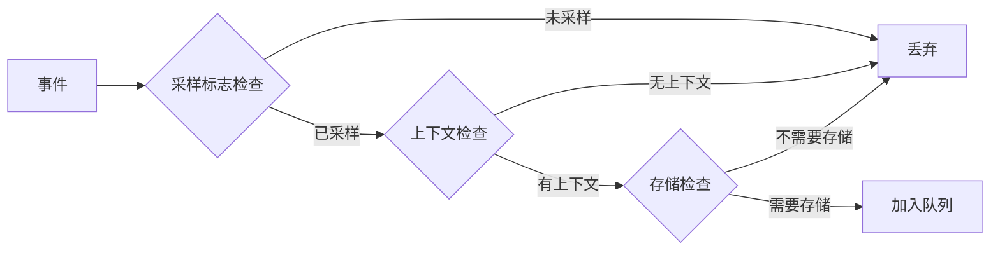
```mermaid
graph LR
A[事件] --> B{采样标志检查}
B --> |未采样| C[丢弃]
B --> |已采样| D{上下文检查}
D --> |无上下文| C
D --> |有上下文| E{存储检查}
E --> |不需要存储| C
E --> |需要存储| F[加入队列]
```

**图表来源**
- [agentlightning/tracer/agentops.py](file://agentlightning/tracer/agentops.py#L347-L372)

**章节来源**
- [agentlightning/tracer/agentops.py](file://agentlightning/tracer/agentops.py#L340-L372)

## 批量发送与性能优化

事件发射系统采用批量发送策略来提高网络效率和系统吞吐量。

### 批量处理架构

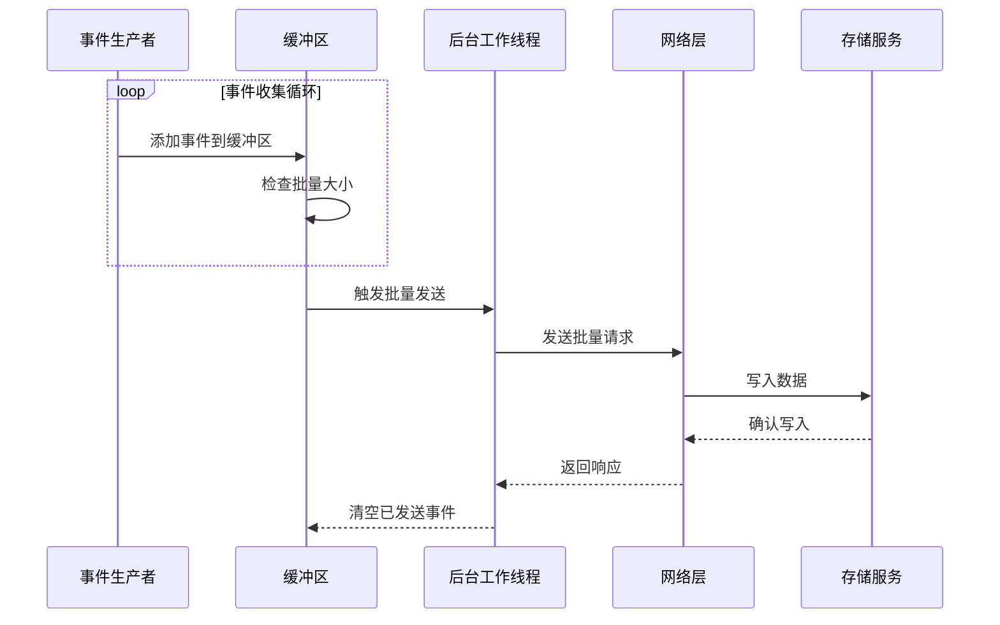
```mermaid
sequenceDiagram
participant Producer as 事件生产者
participant Buffer as 缓冲区
participant Worker as 后台工作线程
participant Network as 网络层
participant Storage as 存储服务
loop 事件收集循环
Producer->>Buffer : 添加事件到缓冲区
Buffer->>Buffer : 检查批量大小
end
Buffer->>Worker : 触发批量发送
Worker->>Network : 发送批量请求
Network->>Storage : 写入数据
Storage-->>Network : 确认写入
Network-->>Worker : 返回响应
Worker-->>Buffer : 清空已发送事件
```

**图表来源**
- [agentlightning/tracer/agentops.py](file://agentlightning/tracer/agentops.py#L310-L340)

### 性能优化策略

系统采用了多种性能优化技术：

| 优化技术 | 实现方式 | 性能提升 |
|---------|----------|----------|
| 异步处理 | asyncio事件循环 | 减少I/O阻塞 |
| 批量压缩 | gzip压缩算法 | 减少网络传输 |
| 内存池 | 对象复用机制 | 降低GC压力 |
| 连接池 | HTTP连接复用 | 减少连接开销 |

### 背压处理

当系统负载过高时，采用背压处理机制防止内存溢出：

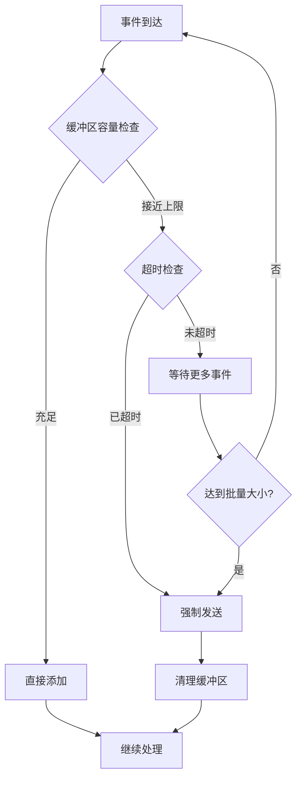
```mermaid
flowchart TD
A[事件到达] --> B{缓冲区容量检查}
B --> |充足| C[直接添加]
B --> |接近上限| D{超时检查}
D --> |未超时| E[等待更多事件]
D --> |已超时| F[强制发送]
C --> G[继续处理]
E --> H{达到批量大小?}
H --> |是| F
H --> |否| A
F --> I[清理缓冲区]
I --> G
```

**图表来源**
- [agentlightning/tracer/agentops.py](file://agentlightning/tracer/agentops.py#L310-L340)

**章节来源**
- [agentlightning/tracer/agentops.py](file://agentlightning/tracer/agentops.py#L310-L374)

## 高并发处理与背压保护

在高并发场景下，事件发射系统通过多种机制确保系统的稳定性和可靠性。

### 并发控制机制

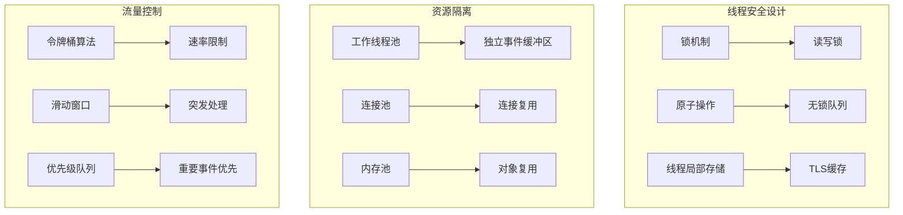
```mermaid
graph TB
subgraph "线程安全设计"
A[锁机制] --> B[读写锁]
C[原子操作] --> D[无锁队列]
E[线程局部存储] --> F[TLS缓存]
end
subgraph "资源隔离"
G[工作线程池] --> H[独立事件缓冲区]
I[连接池] --> J[连接复用]
K[内存池] --> L[对象复用]
end
subgraph "流量控制"
M[令牌桶算法] --> N[速率限制]
O[滑动窗口] --> P[突发处理]
Q[优先级队列] --> R[重要事件优先]
end
```

**图表来源**
- [agentlightning/tracer/agentops.py](file://agentlightning/tracer/agentops.py#L310-L340)

### 事件丢失防护

系统实现了多层次的事件丢失防护机制：

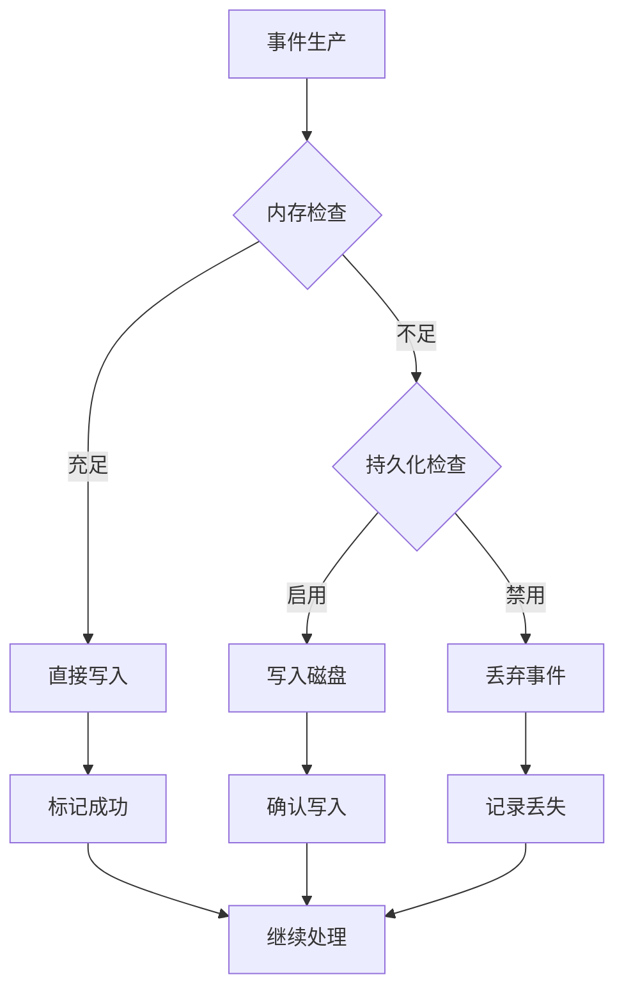
```mermaid
flowchart TD
A[事件生产] --> B{内存检查}
B --> |充足| C[直接写入]
B --> |不足| D{持久化检查}
D --> |启用| E[写入磁盘]
D --> |禁用| F[丢弃事件]
C --> G[标记成功]
E --> H[确认写入]
F --> I[记录丢失]
G --> J[继续处理]
H --> J
I --> J
```

**图表来源**
- [agentlightning/store/memory.py](file://agentlightning/store/memory.py#L639-L664)

### 资源监控与告警

系统实时监控关键资源指标：

| 监控指标 | 阈值 | 处理动作 |
|---------|------|----------|
| 内存使用率 | >80% | 触发垃圾回收 |
| CPU使用率 | >90% | 降低采样率 |
| 网络延迟 | >1s | 切换备用服务器 |
| 错误率 | >5% | 记录错误日志 |

**章节来源**
- [agentlightning/store/memory.py](file://agentlightning/store/memory.py#L639-L664)
- [agentlightning/tracer/agentops.py](file://agentlightning/tracer/agentops.py#L310-L374)

## 自定义事件类型扩展

事件发射系统提供了灵活的扩展机制，允许开发者定义自定义事件类型。

### 扩展接口设计

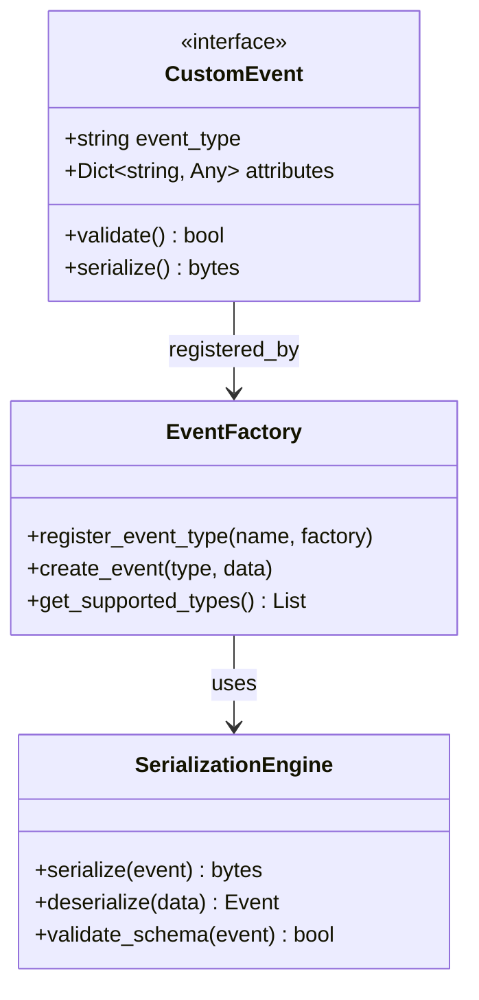
```mermaid
classDiagram
class CustomEvent {
<<interface>>
+string event_type
+Dict~string, Any~ attributes
+validate() bool
+serialize() bytes
}
class EventFactory {
+register_event_type(name, factory)
+create_event(type, data)
+get_supported_types() List
}
class SerializationEngine {
+serialize(event) bytes
+deserialize(data) Event
+validate_schema(event) bool
}
CustomEvent --> EventFactory : registered_by
EventFactory --> SerializationEngine : uses
```

**图表来源**
- [agentlightning/emitter/__init__.py](file://agentlightning/emitter/__init__.py#L1-L26)

### 自定义事件实现

开发者可以通过以下步骤实现自定义事件：

1. **定义事件类型**：继承基础事件类或实现事件接口
2. **注册事件处理器**：将事件类型注册到系统中
3. **实现序列化逻辑**：定义事件的序列化和反序列化方法
4. **配置过滤规则**：设置事件的过滤和采样规则

### 扩展示例

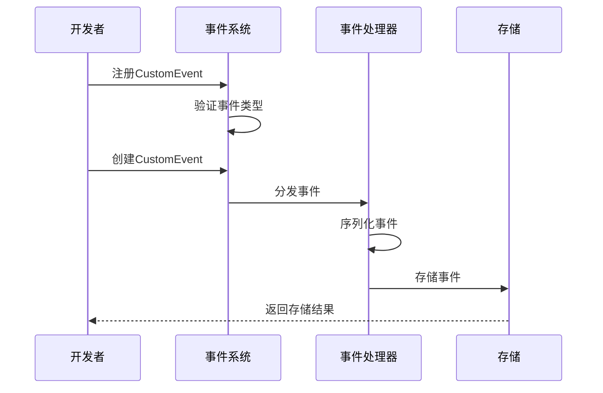
```mermaid
sequenceDiagram
participant Dev as 开发者
participant System as 事件系统
participant Handler as 事件处理器
participant Storage as 存储
Dev->>System : 注册CustomEvent
System->>System : 验证事件类型
Dev->>System : 创建CustomEvent
System->>Handler : 分发事件
Handler->>Handler : 序列化事件
Handler->>Storage : 存储事件
Storage-->>Dev : 返回存储结果
```

**图表来源**
- [agentlightning/emitter/__init__.py](file://agentlightning/emitter/__init__.py#L1-L26)

**章节来源**
- [agentlightning/emitter/__init__.py](file://agentlightning/emitter/__init__.py#L1-L26)

## 调试与验证指南

事件发射系统的调试和验证对于确保监控数据的完整性和准确性至关重要。

### 调试工具集

系统提供了丰富的调试工具来帮助开发者验证事件采集：

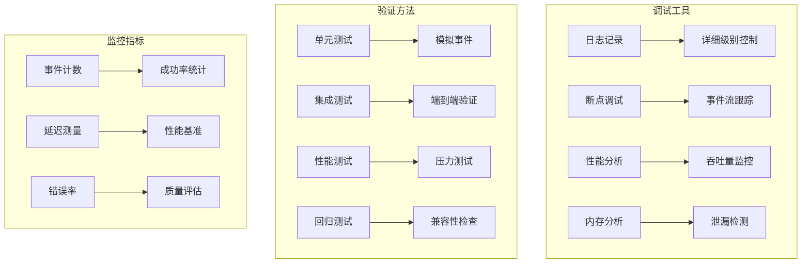
```mermaid
graph TB
subgraph "调试工具"
A[日志记录] --> B[详细级别控制]
C[断点调试] --> D[事件流跟踪]
E[性能分析] --> F[吞吐量监控]
G[内存分析] --> H[泄漏检测]
end
subgraph "验证方法"
I[单元测试] --> J[模拟事件]
K[集成测试] --> L[端到端验证]
M[性能测试] --> N[压力测试]
O[回归测试] --> P[兼容性检查]
end
subgraph "监控指标"
Q[事件计数] --> R[成功率统计]
S[延迟测量] --> T[性能基准]
U[错误率] --> V[质量评估]
end
```

**图表来源**
- [tests/emitter/test_emitter.py](file://tests/emitter/test_emitter.py#L1-L106)

### 数据完整性验证

系统实现了多层数据完整性验证机制：

| 验证层级 | 验证内容 | 实现方式 |
|---------|----------|----------|
| 传输层 | 网络包完整性 | CRC校验 |
| 协议层 | 协议格式正确性 | JSON Schema验证 |
| 应用层 | 业务逻辑正确性 | 业务规则检查 |
| 存储层 | 数据持久化完整性 | 校验和验证 |

### 常见问题诊断

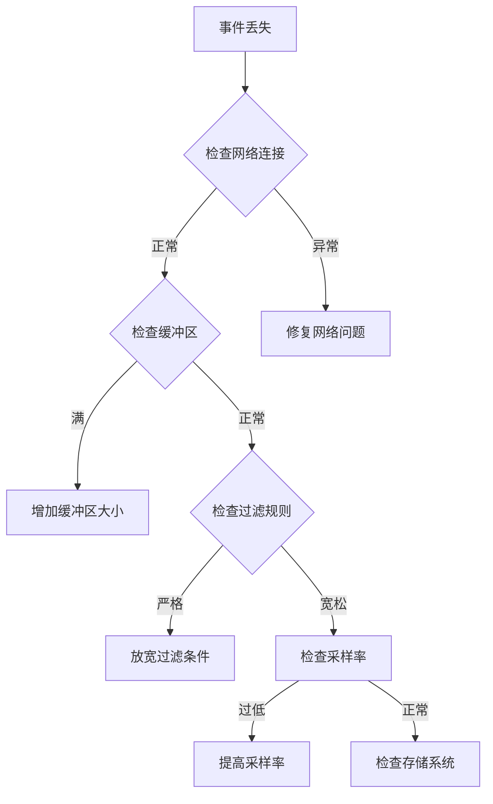
```mermaid
flowchart TD
A[事件丢失] --> B{检查网络连接}
B --> |正常| C{检查缓冲区}
B --> |异常| D[修复网络问题]
C --> |满| E[增加缓冲区大小]
C --> |正常| F{检查过滤规则}
F --> |严格| G[放宽过滤条件]
F --> |宽松| H[检查采样率]
H --> |过低| I[提高采样率]
H --> |正常| J[检查存储系统]
```

**图表来源**
- [tests/emitter/test_emitter.py](file://tests/emitter/test_emitter.py#L45-L105)

### 性能基准测试

系统提供了标准化的性能基准测试套件：

```mermaid
sequenceDiagram
participant Test as 测试框架
participant System as 事件系统
participant Monitor as 性能监控
participant Report as 报告生成
Test->>System : 启动基准测试
System->>Monitor : 开始性能监控
Test->>System : 发送测试事件
System->>System : 处理事件
System->>Monitor : 记录性能指标
Test->>System : 结束测试
Monitor->>Report : 生成性能报告
Report-->>Test : 返回测试结果
```

**图表来源**
- [tests/emitter/test_emitter.py](file://tests/emitter/test_emitter.py#L1-L106)

**章节来源**
- [tests/emitter/test_emitter.py](file://tests/emitter/test_emitter.py#L1-L106)

## 最佳实践与故障排除

基于实际部署经验，以下是事件发射系统的最佳实践和常见故障排除指南。

### 部署最佳实践

1. **资源配置优化**
   - 根据预期事件量配置合适的内存和CPU资源
   - 设置合理的缓冲区大小和刷新间隔
   - 配置适当的采样率以平衡监控精度和性能

2. **网络配置**
   - 使用专用网络连接减少网络延迟
   - 配置负载均衡和故障转移机制
   - 实施SSL/TLS加密保护数据传输

3. **监控配置**
   - 设置关键指标的告警阈值
   - 配置日志轮转和归档策略
   - 实施定期健康检查

### 常见故障排除

| 故障现象 | 可能原因 | 解决方案 |
|---------|----------|----------|
| 事件丢失严重 | 缓冲区溢出 | 增加缓冲区大小或提高处理速度 |
| 性能下降 | 网络延迟高 | 优化网络配置或切换备用服务器 |
| 内存泄漏 | 对象未及时释放 | 检查对象生命周期管理和垃圾回收 |
| 重复事件 | 重试机制问题 | 检查幂等性处理逻辑 |

### 性能调优建议

```mermaid
graph LR
A[性能瓶颈识别] --> B[CPU密集型]
A --> C[内存密集型]
A --> D[I/O密集型]
B --> E[优化算法复杂度]
C --> F[增加内存分配]
D --> G[使用异步I/O]
E --> H[性能测试验证]
F --> H
G --> H
H --> I[部署优化配置]
```

### 安全考虑

1. **数据隐私保护**
   - 实施数据脱敏和匿名化处理
   - 配置访问权限和审计日志
   - 使用加密技术保护敏感数据

2. **系统安全加固**
   - 定期更新依赖库和框架
   - 实施输入验证和输出编码
   - 配置防火墙和入侵检测系统

通过遵循这些最佳实践和故障排除指南，可以确保事件发射系统在生产环境中稳定高效地运行，为代理系统的可观测性提供可靠保障。