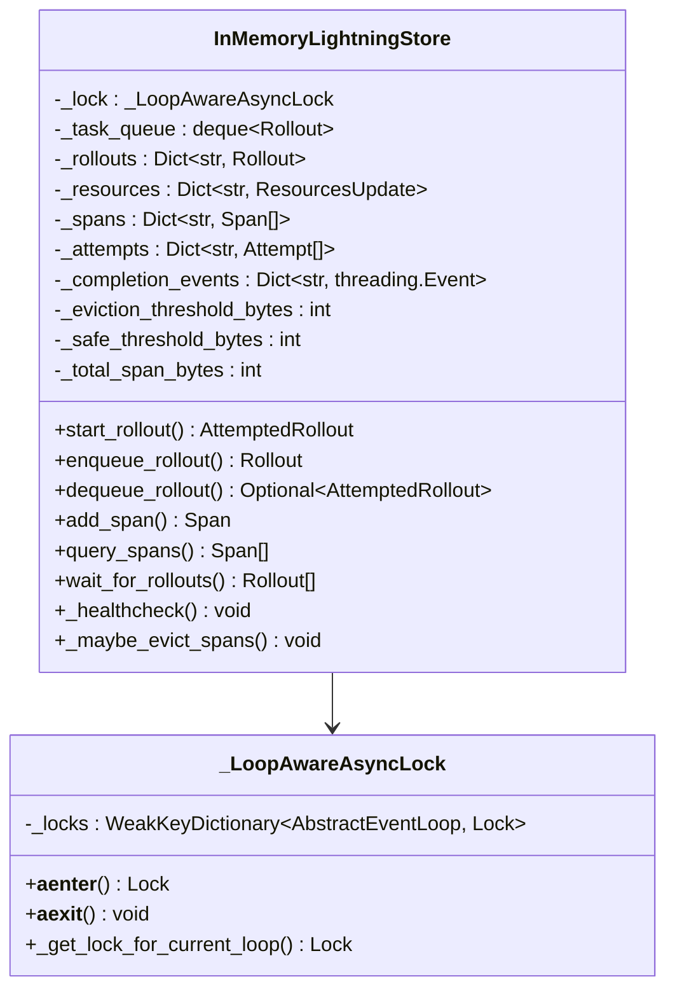

# 存储交互机制

<cite>
**本文档引用的文件**
- [agentlightning/store/base.py](file://agentlightning/store/base.py)
- [agentlightning/store/memory.py](file://agentlightning/store/memory.py)
- [agentlightning/store/client_server.py](file://agentlightning/store/client_server.py)
- [agentlightning/store/utils.py](file://agentlightning/store/utils.py)
- [agentlightning/trainer/trainer.py](file://agentlightning/trainer/trainer.py)
- [agentlightning/types/core.py](file://agentlightning/types/core.py)
- [agentlightning/emitter/message.py](file://agentlightning/emitter/message.py)
- [agentlightning/cli/store.py](file://agentlightning/cli/store.py)
- [tests/store/test_memory.py](file://tests/store/test_memory.py)
</cite>

## 目录
1. [概述](#概述)
2. [存储架构设计](#存储架构设计)
3. [核心数据结构](#核心数据结构)
4. [存储层交互流程](#存储层交互流程)
5. [多实现存储方案](#多实现存储方案)
6. [数据一致性模型](#数据一致性模型)
7. [性能优化策略](#性能优化策略)
8. [故障恢复机制](#故障恢复机制)
9. [部署场景适配](#部署场景适配)
10. [扩展性挑战与解决方案](#扩展性挑战与解决方案)

## 概述

Agent Lightning 的存储交互机制是一个高度模块化和可扩展的系统，负责协调算法与运行器之间的所有持久化交互。该系统通过统一的 `LightningStore` 接口抽象，支持多种存储后端实现，包括内存存储、SQLite 数据库和客户端-服务器架构，以满足不同部署场景的需求。

存储系统的核心职责包括：
- **滚动生命周期管理**：注册新滚动、排队等待执行、创建尝试并驱动滚动状态机
- **尝试跟踪**：记录每次执行尝试，包括进度心跳、重试序列和终端状态
- **跨度摄入**：捕获运行器发出的结构化遥测数据
- **资源版本控制**：管理命名资源的不可变快照

## 存储架构设计

### 核心接口设计


**图表来源**
- [agentlightning/store/base.py](file://agentlightning/store/base.py#L40-L516)
- [agentlightning/store/memory.py](file://agentlightning/store/memory.py#L180-L944)
- [agentlightning/store/client_server.py](file://agentlightning/store/client_server.py#L80-L1134)

### 设计原则

存储抽象接口遵循以下设计原则：

1. **线程安全/异步安全**：每个协程调用在并发情况下都应表现原子性
2. **无共享引用泄漏**：默认复制配置和元数据以避免意外修改
3. **明确错误处理**：缺失标识符应导致 `ValueError` 异常
4. **灵活配置**：支持多种存储后端和部署模式

**章节来源**
- [agentlightning/store/base.py](file://agentlightning/store/base.py#L40-L100)

## 核心数据结构

### 滚动与尝试模型


**图表来源**
- [agentlightning/types/core.py](file://agentlightning/types/core.py#L100-L200)

### 状态转换机制

存储系统实现了复杂的滚动状态转换机制：


**图表来源**
- [agentlightning/types/core.py](file://agentlightning/types/core.py#L60-L90)

**章节来源**
- [agentlightning/types/core.py](file://agentlightning/types/core.py#L60-L150)

## 存储层交互流程

### Emitter 到 Store 的数据写入

Emitter 组件负责生成和发送跨度数据到存储系统：


**图表来源**
- [agentlightning/emitter/message.py](file://agentlightning/emitter/message.py#L10-L34)
- [agentlightning/store/base.py](file://agentlightning/store/base.py#L200-L250)

### Trainer 对历史数据的读取

Trainer 通过存储接口查询和管理历史数据：


**图表来源**
- [agentlightning/trainer/trainer.py](file://agentlightning/trainer/trainer.py#L400-L500)

**章节来源**
- [agentlightning/trainer/trainer.py](file://agentlightning/trainer/trainer.py#L100-L200)

## 多实现存储方案

### 内存存储实现

内存存储是默认的开发和测试存储实现：



**图表来源**
- [agentlightning/store/memory.py](file://agentlightning/store/memory.py#L180-L300)

内存存储的关键特性：

1. **内存管理**：自动内存回收和阈值控制
2. **异步锁**：支持事件循环感知的异步锁
3. **健康检查**：定期检查和清理过期数据
4. **序列化**：支持对象大小估算和序列化

**章节来源**
- [agentlightning/store/memory.py](file://agentlightning/store/memory.py#L180-L400)

### 客户端-服务器架构

客户端-服务器模式支持跨进程和跨网络的存储访问：


**图表来源**
- [agentlightning/store/client_server.py](file://agentlightning/store/client_server.py#L200-L300)

客户端-服务器实现的关键组件：

1. **FastAPI 服务器**：提供 RESTful API 接口
2. **健康检查**：定期验证服务器可用性
3. **重试机制**：网络故障时自动重试
4. **会话管理**：维护多个事件循环的连接

**章节来源**
- [agentlightning/store/client_server.py](file://agentlightning/store/client_server.py#L80-L200)

## 数据一致性模型

### 事务边界定义

存储系统通过以下机制确保数据一致性：


### 故障恢复机制

存储系统实现了多层次的故障恢复机制：

1. **健康检查**：定期监控运行中的滚动
2. **超时检测**：自动标记超时的尝试
3. **未响应检测**：识别长时间无心跳的任务
4. **重试策略**：根据配置自动重试失败的尝试


**图表来源**
- [agentlightning/store/utils.py](file://agentlightning/store/utils.py#L50-L127)

**章节来源**
- [agentlightning/store/utils.py](file://agentlightning/store/utils.py#L1-L127)

## 性能优化策略

### 内存管理优化

内存存储实现了智能的内存管理策略：

| 参数 | 默认值 | 描述 |
|------|--------|------|
| `eviction_memory_threshold` | 70% 总内存 | 触发内存回收的阈值 |
| `safe_memory_threshold` | 80% 回收阈值 | 安全使用内存的阈值 |
| `span_size_estimator` | 系统大小估算器 | 跨度大小估算函数 |

### 索引设计与查询优化

存储系统支持多种查询模式以优化性能：


### 分页加载策略

对于大量数据的查询，存储系统支持分页加载：

1. **游标分页**：使用序列号作为游标
2. **批量查询**：支持批量获取多个滚动的状态
3. **延迟加载**：按需加载跨度数据

**章节来源**
- [agentlightning/store/memory.py](file://agentlightning/store/memory.py#L600-L700)

## 故障恢复机制

### 自动恢复策略

存储系统实现了自动故障恢复机制：


### 错误处理与隔离

系统采用以下错误处理策略：

1. **隔离机制**：单个操作失败不影响其他操作
2. **重试策略**：网络错误自动重试
3. **降级服务**：部分功能失效时提供基础服务
4. **日志记录**：详细的错误日志用于诊断

**章节来源**
- [agentlightning/store/client_server.py](file://agentlightning/store/client_server.py#L700-L800)

## 部署场景适配

### 开发环境配置

开发环境推荐使用内存存储：

```python
# 开发环境配置示例
store = InMemoryLightningStore(
    eviction_memory_threshold=0.5,  # 50% 内存阈值
    safe_memory_threshold=0.4,       # 40% 安全阈值
    span_size_estimator=lambda span: 100  # 自定义大小估算
)
```

### 生产环境配置

生产环境建议使用客户端-服务器架构：

```python
# 生产环境配置示例
server = LightningStoreServer(store, host="0.0.0.0", port=4747)
await server.start()
```

### 高可用部署

高可用部署考虑以下因素：

1. **负载均衡**：多个服务器实例分担负载
2. **数据备份**：定期备份重要数据
3. **监控告警**：实时监控系统状态
4. **故障转移**：自动切换到备用服务器

**章节来源**
- [agentlightning/cli/store.py](file://agentlightning/cli/store.py#L1-L38)

## 扩展性挑战与解决方案

### 大规模数据集处理

面对大规模数据集时，存储系统面临以下挑战：

1. **内存压力**：大量跨度数据占用内存
2. **查询性能**：复杂查询的响应时间
3. **并发访问**：高并发场景下的性能瓶颈

### 解决方案

#### 内存优化策略


#### 查询优化技术

1. **索引优化**：为常用查询字段建立索引
2. **缓存机制**：缓存频繁查询的结果
3. **并行处理**：利用多核CPU并行处理
4. **数据分区**：按时间或滚动ID分区存储

#### 可扩展性架构


### 性能监控与调优

持续监控和调优是保证系统性能的关键：

1. **关键指标监控**：内存使用率、查询响应时间、并发请求数
2. **性能基准测试**：定期进行压力测试
3. **容量规划**：根据业务增长预测资源需求
4. **自动化调优**：基于监控数据自动调整参数

**章节来源**
- [agentlightning/store/memory.py](file://agentlightning/store/memory.py#L600-L800)

## 结论

Agent Lightning 的存储交互机制通过精心设计的抽象接口和多种实现方案，为不同的部署场景提供了灵活而强大的数据管理能力。系统的核心优势包括：

1. **统一抽象**：通过 `LightningStore` 接口提供一致的编程模型
2. **多实现支持**：内存、客户端-服务器等多种存储后端
3. **高可用性**：完善的故障检测和恢复机制
4. **性能优化**：智能内存管理和查询优化策略
5. **可扩展性**：支持从小规模开发到大规模生产的各种需求

这种设计使得 Agent Lightning 能够适应从原型开发到企业级生产的各种应用场景，同时保持代码的简洁性和可维护性。