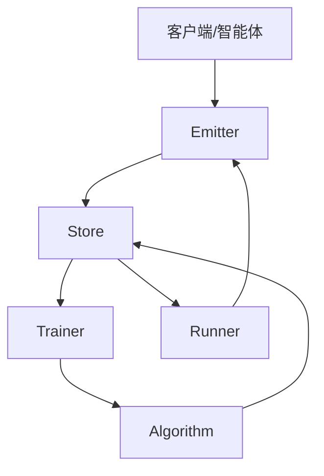
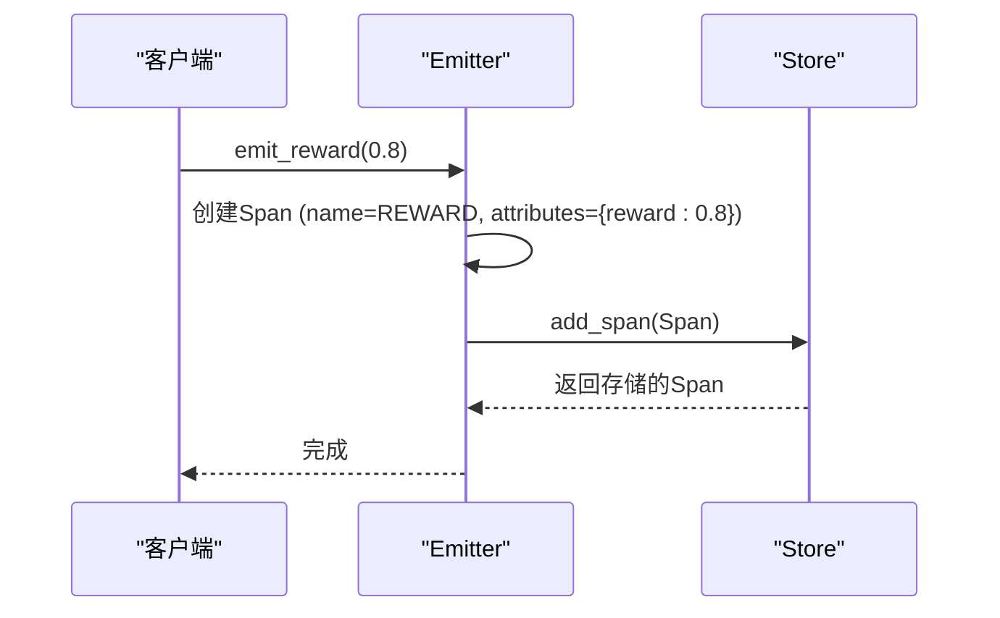
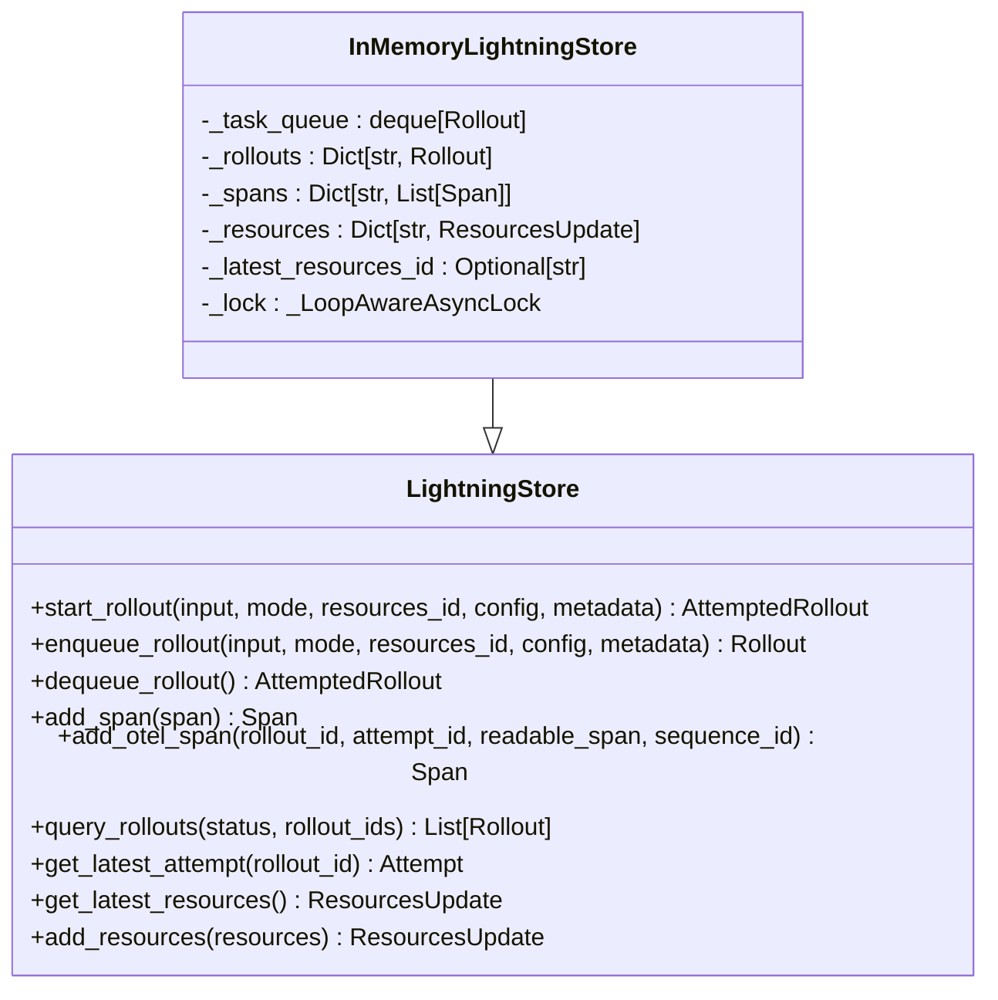
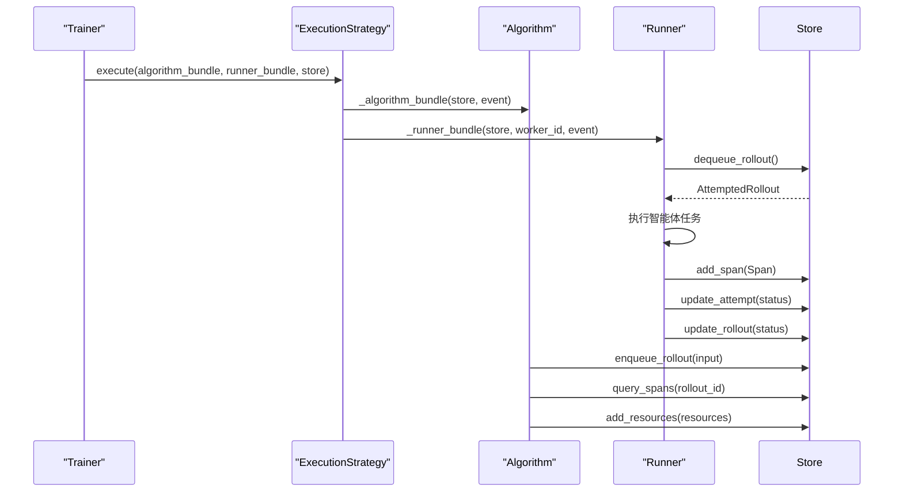
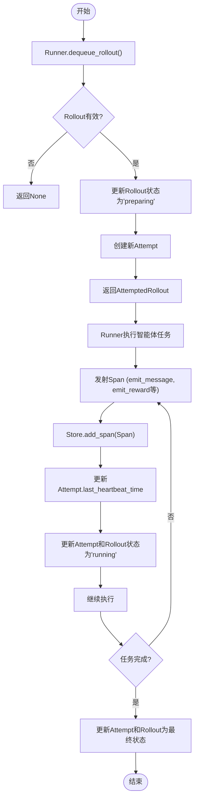
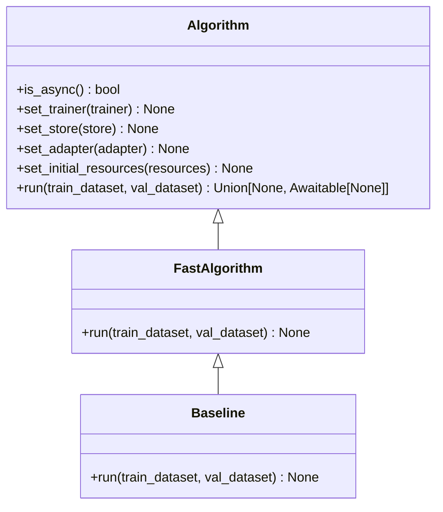

# 数据流架构

<cite>
**本文档中引用的文件**  
- [client.py](file://agentlightning/client.py)
- [emitter/message.py](file://agentlightning/emitter/message.py)
- [emitter/reward.py](file://agentlightning/emitter/reward.py)
- [store/base.py](file://agentlightning/store/base.py)
- [store/memory.py](file://agentlightning/store/memory.py)
- [trainer/trainer.py](file://agentlightning/trainer/trainer.py)
- [algorithm/base.py](file://agentlightning/algorithm/base.py)
- [types/core.py](file://agentlightning/types/core.py)
- [execution/events.py](file://agentlightning/execution/events.py)
- [runner/base.py](file://agentlightning/runner/base.py)
</cite>

## 目录
1. [引言](#引言)
2. [核心组件与数据流概述](#核心组件与数据流概述)
3. [事件发射机制](#事件发射机制)
4. [数据存储与管理](#数据存储与管理)
5. [训练器与执行策略](#训练器与执行策略)
6. [Rollout数据采集与处理](#rollout数据采集与处理)
7. [算法与资源更新](#算法与资源更新)
8. [组件协作与通信模式](#组件协作与通信模式)
9. [性能特征与流控策略](#性能特征与流控策略)
10. [容错与数据一致性](#容错与数据一致性)
11. [结论](#结论)

## 引言
Agent Lightning是一个用于训练和管理智能体的框架，其核心在于构建一个从事件发射到资源更新的完整数据流闭环。该系统通过Emitter、Store、Trainer、Algorithm和Runner等组件协同工作，实现Rollout数据的采集、存储、训练触发和优化资源生成。本文档将深入解析这一数据流架构，详细描述各组件间的协作关系，包括同步与异步处理模式，并提供实际数据流跟踪示例，分析关键路径的性能特征，讨论数据一致性、容错机制和流控策略。

## 核心组件与数据流概述
Agent Lightning的数据流架构围绕几个核心组件构建：Emitter负责事件发射，Store作为持久化控制平面协调训练Rollout，Trainer负责高层编排，Algorithm实现训练策略，Runner执行智能体任务。数据流始于客户端或智能体产生的事件，通过Emitter发射到系统，由Store进行持久化存储和管理。Trainer协调Algorithm和Runner，Algorithm从Store获取数据进行训练，生成新的优化资源，再通过Store更新，形成闭环。

**Diagram sources**
- [client.py](file://agentlightning/client.py)
- [store/base.py](file://agentlightning/store/base.py)
- [trainer/trainer.py](file://agentlightning/trainer/trainer.py)

## 事件发射机制
Emitter组件负责将各种事件（如消息、对象、异常和奖励）作为OpenTelemetry Span发射到系统中。`emit_message`函数用于发射文本消息，`emit_reward`函数用于发射奖励值。这些发射的事件被转换为结构化的Span对象，包含`rollout_id`、`attempt_id`和`sequence_id`等关键属性，确保事件能够与特定的Rollout执行关联。

**Diagram sources**
- [emitter/reward.py](file://agentlightning/emitter/reward.py)
- [store/base.py](file://agentlightning/store/base.py)

**Section sources**
- [emitter/reward.py](file://agentlightning/emitter/reward.py#L150-L200)
- [emitter/message.py](file://agentlightning/emitter/message.py#L15-L30)

## 数据存储与管理
Store组件是整个系统的核心，作为持久化控制平面协调训练Rollout。它管理Rollout的生命周期、尝试跟踪、Span摄取和资源版本控制。`InMemoryLightningStore`是其内存实现，使用线程和异步安全的锁来保证并发访问的正确性。Store通过`enqueue_rollout`将新Rollout加入队列，通过`dequeue_rollout`让Runner获取任务，通过`add_span`存储执行过程中产生的Span。

**Diagram sources**
- [store/base.py](file://agentlightning/store/base.py#L50-L100)
- [store/memory.py](file://agentlightning/store/memory.py#L150-L200)

**Section sources**
- [store/base.py](file://agentlightning/store/base.py#L50-L150)
- [store/memory.py](file://agentlightning/store/memory.py#L150-L300)

## 训练器与执行策略
Trainer是高层编排层，负责将Algorithm、Runner和Store等组件连接起来。它通过`fit`方法执行完整的训练循环，通过`dev`方法进行快速同步调试。Trainer使用`ExecutionStrategy`（如`ClientServerExecutionStrategy`）来管理进程，决定是通过共享内存还是HTTP边界进行通信。`_algorithm_bundle`和`_runner_bundle`是Trainer内部的协程入口点，分别在策略的进程/线程中执行算法和Runner逻辑。

**Diagram sources**
- [trainer/trainer.py](file://agentlightning/trainer/trainer.py#L200-L300)
- [execution/base.py](file://agentlightning/execution/base.py#L50-L100)

**Section sources**
- [trainer/trainer.py](file://agentlightning/trainer/trainer.py#L100-L400)
- [execution/base.py](file://agentlightning/execution/base.py#L50-L107)

## Rollout数据采集与处理
Rollout数据的采集始于Runner通过`dequeue_rollout`从Store获取任务。Runner执行智能体任务，期间通过Emitter发射各种Span（如消息、奖励）。这些Span通过`add_span`或`add_otel_span`方法被Store持久化，并更新尝试和Rollout的状态。`query_spans`方法允许Algorithm查询特定Rollout的Span，用于训练。Store还实现了内存流控，当Span占用内存超过阈值时，会自动驱逐旧的Span以释放内存。

**Section sources**
- [store/base.py](file://agentlightning/store/base.py#L200-L300)
- [store/memory.py](file://agentlightning/store/memory.py#L500-L600)

## 算法与资源更新
Algorithm组件是训练策略的实现者。它从Store获取Rollout数据（通过`query_spans`），计算新的优化策略，并通过`add_resources`或`update_resources`将新的资源（如模型检查点）发布到Store。`get_latest_resources`方法允许Runner获取最新的资源快照。Algorithm通过`set_store`、`set_adapter`等方法与Store和适配器绑定，确保能够访问所需的数据和工具。

**Diagram sources**
- [algorithm/base.py](file://agentlightning/algorithm/base.py#L50-L100)

**Section sources**
- [algorithm/base.py](file://agentlightning/algorithm/base.py#L1-L160)
- [types/core.py](file://agentlightning/types/core.py#L200-L300)

## 组件协作与通信模式
系统中的组件通过Store进行松耦合的通信。Trainer通过ExecutionStrategy启动Algorithm和多个Runner进程。Runner通过同步或异步方式与Store交互，获取任务并提交结果。Algorithm通过Store查询历史数据并发布新资源。`ExecutionEvent`协议用于在Algorithm和Runner之间传递协同停止信号，确保在中断时能够优雅地关闭。这种设计支持同步和异步处理模式，Runner的`iter`方法是异步的，而`step`方法可用于同步执行单个任务。

**Section sources**
- [execution/events.py](file://agentlightning/execution/events.py#L1-L70)
- [runner/base.py](file://agentlightning/runner/base.py#L100-L150)

## 性能特征与流控策略
Store的`InMemoryLightningStore`实现通过`_LoopAwareAsyncLock`确保线程和异步安全。系统实现了基于内存的流控策略：`_eviction_threshold_bytes`和`_safe_threshold_bytes`定义了内存驱逐的阈值。当Span占用的总内存超过驱逐阈值时，系统会按时间顺序驱逐最旧Rollout的Span，直到内存使用量低于安全阈值。这确保了系统在高负载下仍能稳定运行，避免内存溢出。

**Section sources**
- [store/memory.py](file://agentlightning/store/memory.py#L700-L800)

## 容错与数据一致性
系统通过多种机制保证容错和数据一致性。Store的`_healthcheck_wrapper`装饰器在执行关键方法前运行健康检查，防止在不健康状态下进行操作。`wait_for_rollouts`方法允许等待Rollout完成，支持超时机制，避免无限等待。`_completion_events`字典用于跨循环跟踪Rollout的完成状态。此外，所有关键操作都在锁的保护下执行，确保了数据的一致性。

**Section sources**
- [store/memory.py](file://agentlightning/store/memory.py#L400-L500)

## 结论
Agent Lightning的数据流架构设计精巧，通过Emitter、Store、Trainer、Algorithm和Runner等组件的紧密协作，实现了从事件发射到资源更新的完整闭环。Store作为核心枢纽，管理着Rollout的生命周期和数据持久化。Trainer负责高层编排，Algorithm实现智能训练策略。系统支持同步和异步处理模式，具备内存流控和容错机制，确保了高性能和高可靠性。这一架构为智能体的训练和优化提供了一个强大而灵活的平台。