# 核心数据模型

<cite>
**本文档中引用的文件**
- [agentlightning/types/core.py](file://agentlightning/types/core.py)
- [agentlightning/types/resources.py](file://agentlightning/types/resources.py)
- [agentlightning/types/tracer.py](file://agentlightning/types/tracer.py)
- [agentlightning/adapter/triplet.py](file://agentlightning/adapter/triplet.py)
- [agentlightning/store/base.py](file://agentlightning/store/base.py)
- [agentlightning/runner/base.py](file://agentlightning/runner/base.py)
- [agentlightning/emitter/object.py](file://agentlightning/emitter/object.py)
- [examples/calc_x/calc_agent.py](file://examples/calc_x/calc_agent.py)
- [examples/spider/sql_agent.py](file://examples/spider/sql_agent.py)
</cite>

## 目录
1. [简介](#简介)
2. [核心数据模型概览](#核心数据模型概览)
3. [Rollout数据模型](#rollout数据模型)
4. [Triplet数据模型](#triplet数据模型)
5. [Task数据模型](#task数据模型)
6. [Resources资源模型](#resources资源模型)
7. [Span追踪模型](#span追踪模型)
8. [序列化与反序列化机制](#序列化与反序列化机制)
9. [零代码变更优化机制](#零代码变更优化机制)
10. [数据模型扩展最佳实践](#数据模型扩展最佳实践)
11. [实际应用场景](#实际应用场景)
12. [总结](#总结)

## 简介

Agent Lightning框架采用了一套精心设计的核心数据模型体系，这些模型支撑着整个框架的代理优化流程。该体系以Pydantic为基础，提供了强类型的数据验证和序列化能力，同时确保了跨组件传输时的结构一致性。核心数据模型的设计理念是实现"零代码变更"的代理优化，即在不修改原始代理代码的情况下注入训练所需的元数据。

## 核心数据模型概览

Agent Lightning框架的核心数据模型围绕以下几个关键实体构建：

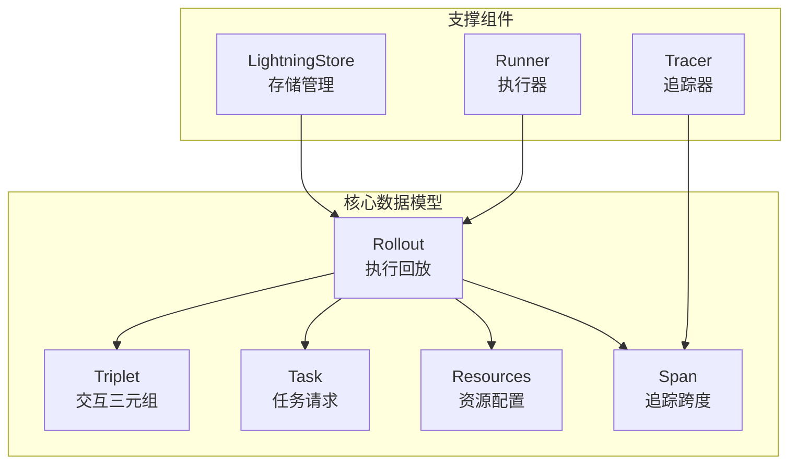

**图表来源**
- [agentlightning/types/core.py](file://agentlightning/types/core.py#L1-L396)
- [agentlightning/types/resources.py](file://agentlightning/types/resources.py#L1-L199)
- [agentlightning/types/tracer.py](file://agentlightning/types/tracer.py#L1-L427)

## Rollout数据模型

Rollout是Agent Lightning框架中最核心的数据模型之一，它代表了一个完整的代理执行回放过程。

### 字段定义与业务含义

| 字段名 | 数据类型 | 业务含义 | 默认值 |
|--------|----------|----------|--------|
| rollout_id | str | 唯一标识符 | 必填 |
| input | TaskInput | 任务输入数据 | 必填 |
| start_time | float | 回放开始时间戳 | 必填 |
| end_time | Optional[float] | 回放结束时间戳 | None |
| mode | Optional[RolloutMode] | 执行模式(train/val/test) | None |
| resources_id | Optional[str] | 资源标识符 | None |
| status | RolloutStatus | 回放状态 | "queuing" |
| config | RolloutConfig | 重试配置 | RolloutConfig() |
| metadata | Optional[Dict[str, Any]] | 额外元数据 | None |

### 状态机设计

Rollout遵循严格的状态转换机制：

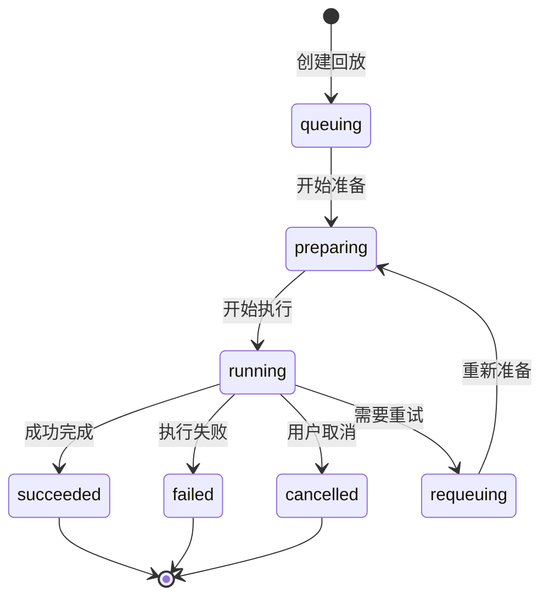

**图表来源**
- [agentlightning/types/core.py](file://agentlightning/types/core.py#L100-L110)

### 在优化流程中的作用

Rollout作为代理优化的基础单元，在以下环节发挥关键作用：

1. **任务调度**: 将算法生成的任务封装为Rollout对象
2. **执行跟踪**: 记录整个执行过程的状态变化
3. **结果收集**: 汇总执行过程中的所有中间结果
4. **重试控制**: 提供灵活的重试策略配置

**章节来源**
- [agentlightning/types/core.py](file://agentlightning/types/core.py#L120-L180)

## Triplet数据模型

Triplet代表强化学习中的单次交互回合，包含prompt、response和reward三个核心要素。

### 结构组成

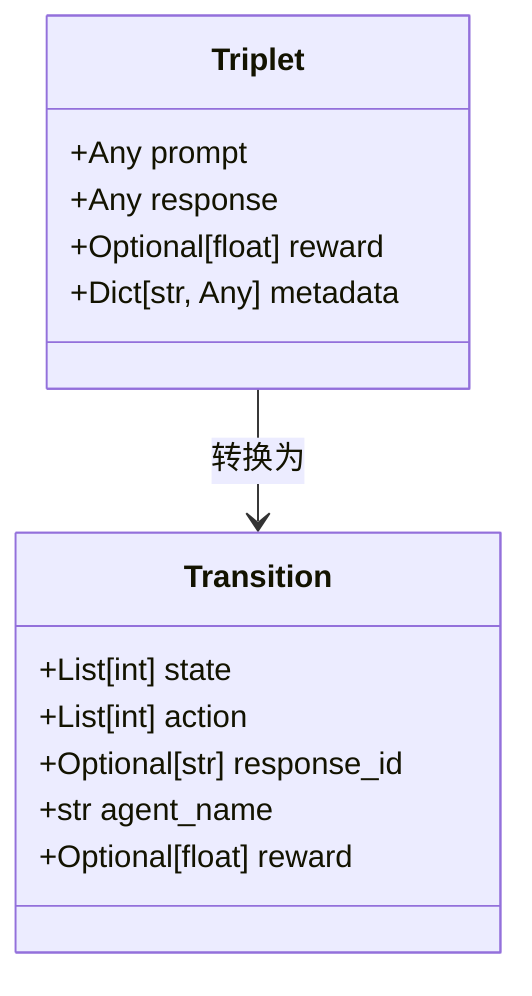

**图表来源**
- [agentlightning/types/core.py](file://agentlightning/types/core.py#L50-L60)
- [agentlightning/adapter/triplet.py](file://agentlightning/adapter/triplet.py#L20-L35)

### 字段详解

| 字段名 | 数据类型 | 描述 | 示例 |
|--------|----------|------|------|
| prompt | Any | 模型输入状态 | {"token_ids": [1, 2, 3]} |
| response | Any | 模型输出动作 | {"token_ids": [4, 5, 6], "logprobs": [...]}} |
| reward | Optional[float] | 标量奖励值 | 0.8 |
| metadata | Dict[str, Any] | 元数据信息 | {"response_id": "uuid", "agent_name": "agent1"} |

### 在轨迹重建中的应用

Triplet通过TraceTree类实现复杂的轨迹重建功能：

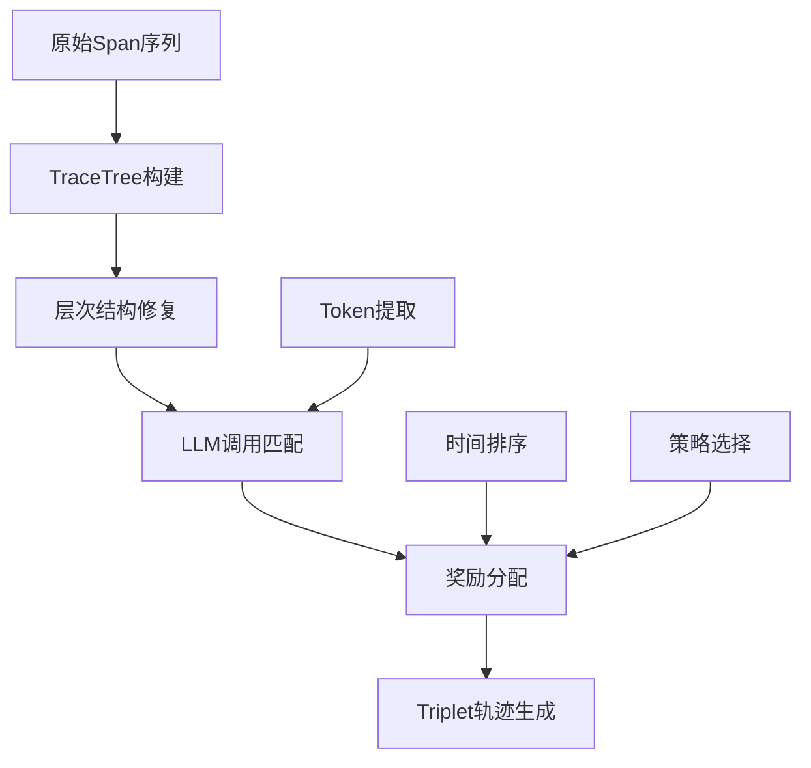

**图表来源**
- [agentlightning/adapter/triplet.py](file://agentlightning/adapter/triplet.py#L400-L500)

**章节来源**
- [agentlightning/types/core.py](file://agentlightning/types/core.py#L50-L60)
- [agentlightning/adapter/triplet.py](file://agentlightning/adapter/triplet.py#L20-L100)

## Task数据模型

Task是传递给客户端代理的原始任务请求，承载着具体的执行指令。

### 设计特点

Task模型采用了向后兼容的设计理念，支持任意类型的输入数据：

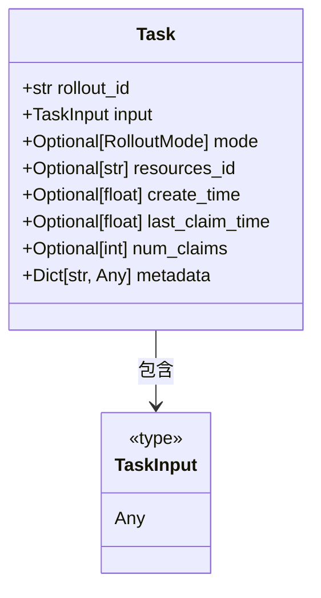

**图表来源**
- [agentlightning/types/core.py](file://agentlightning/types/core.py#L200-L230)

### 生命周期管理

Task在Agent Lightning框架中有明确的生命周期：

1. **创建阶段**: 由算法生成并提交到存储
2. **调度阶段**: 运行器从队列中获取任务
3. **执行阶段**: 客户端代理处理任务
4. **完成阶段**: 返回结果并更新状态

**章节来源**
- [agentlightning/types/core.py](file://agentlightning/types/core.py#L200-L230)

## Resources资源模型

Resources系统提供了统一的资源配置管理，支持多种类型的资源抽象。

### 资源类型层次

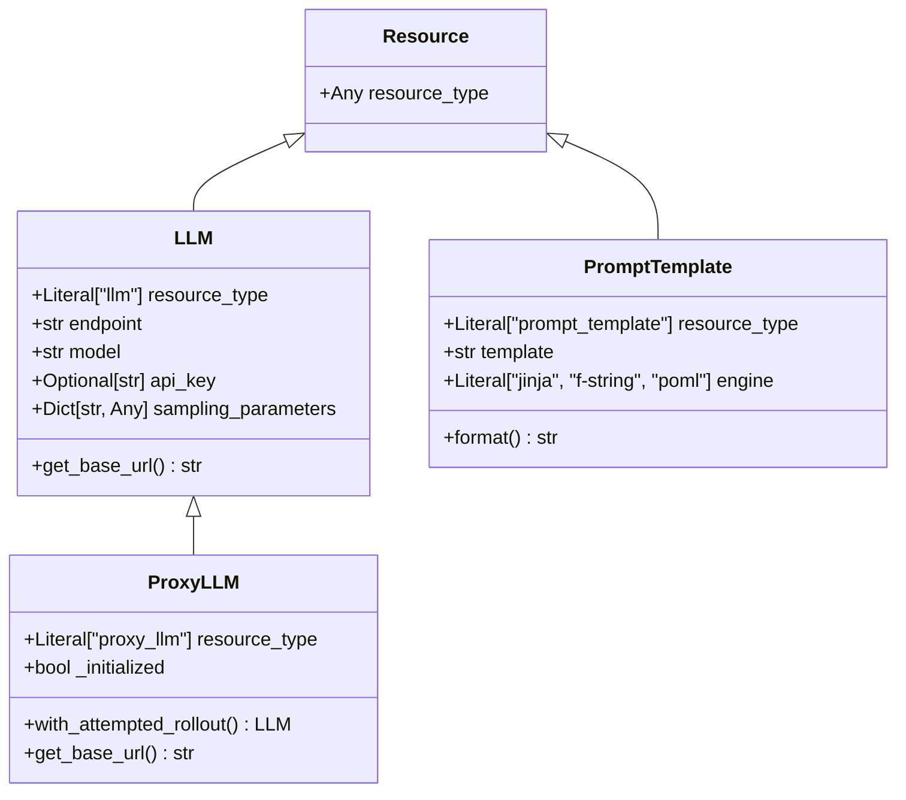

**图表来源**
- [agentlightning/types/resources.py](file://agentlightning/types/resources.py#L30-L150)

### ProxyLLM的特殊机制

ProxyLLM通过端点重写实现了动态路由：

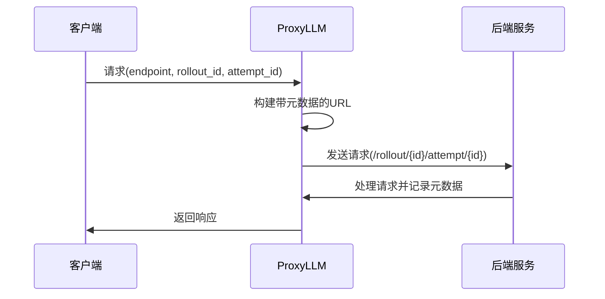

**图表来源**
- [agentlightning/types/resources.py](file://agentlightning/types/resources.py#L70-L120)

### 资源版本控制

ResourcesUpdate提供了资源快照和版本控制机制：

| 字段名 | 类型 | 描述 |
|--------|------|------|
| resources_id | str | 资源快照标识符 |
| resources | NamedResources | 资源映射 |

**章节来源**
- [agentlightning/types/resources.py](file://agentlightning/types/resources.py#L30-L199)

## Span追踪模型

Span模型是Agent Lightning框架追踪系统的核心，完全兼容OpenTelemetry规范。

### 核心属性结构

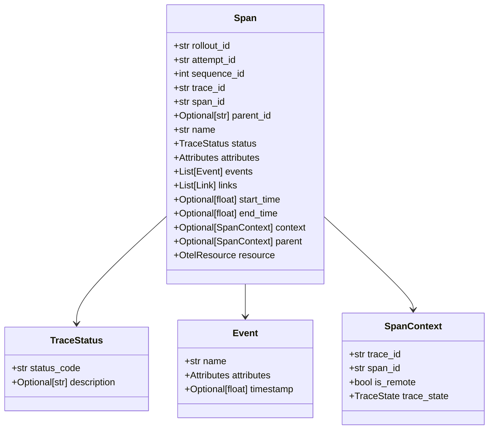

**图表来源**
- [agentlightning/types/tracer.py](file://agentlightning/types/tracer.py#L200-L350)

### 跨格式转换

Span模型支持多种输入格式的统一转换：

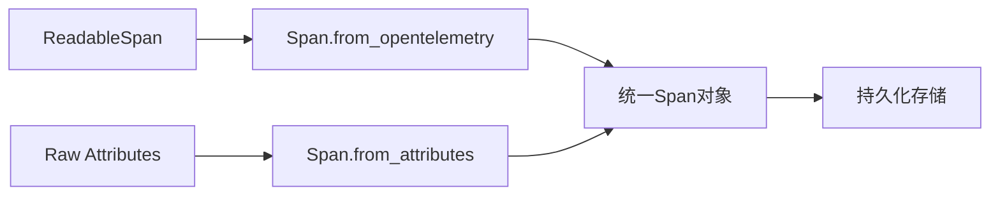

**图表来源**
- [agentlightning/types/tracer.py](file://agentlightning/types/tracer.py#L300-L400)

### 自动化追踪

框架提供了自动化的追踪机制，无需修改代理代码即可收集执行数据：

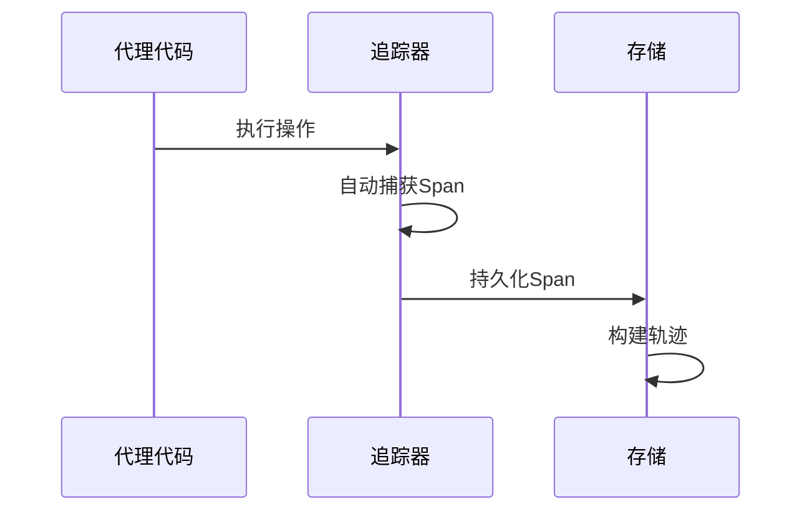

**章节来源**
- [agentlightning/types/tracer.py](file://agentlightning/types/tracer.py#L200-L427)

## 序列化与反序列化机制

Agent Lightning框架采用Pydantic的内置序列化机制，确保数据的一致性和完整性。

### Pydantic序列化特性

框架充分利用Pydantic的序列化能力：

1. **自动类型验证**: 运行时类型检查和转换
2. **JSON兼容性**: 内置JSON序列化支持
3. **模式验证**: 支持复杂嵌套结构的验证
4. **性能优化**: 编译后的验证逻辑

### 序列化流程

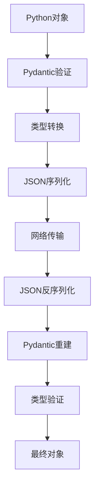

### 跨组件传输保障

为了确保跨组件传输时的数据一致性，框架实施了以下机制：

1. **版本控制**: 通过字段版本管理兼容性
2. **默认值处理**: 明确的默认值定义
3. **可选字段**: 向后兼容的可选字段设计
4. **类型注解**: 严格的类型约束

**章节来源**
- [agentlightning/store/base.py](file://agentlightning/store/base.py#L1-L516)
- [agentlightning/emitter/object.py](file://agentlightning/emitter/object.py#L1-L38)

## 零代码变更优化机制

Agent Lightning框架的核心创新在于实现了"零代码变更"的代理优化能力。

### 机制原理

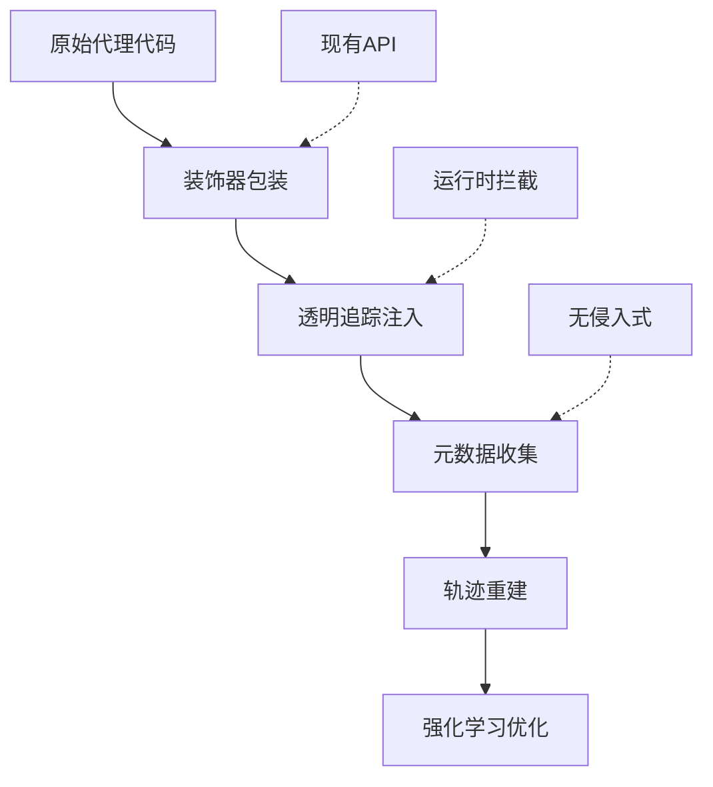

### 元数据注入策略

框架通过以下方式实现元数据的透明注入：

1. **追踪拦截**: 在运行时自动捕获执行轨迹
2. **奖励信号**: 通过emit_reward函数注入奖励信号
3. **资源配置**: 通过资源管理系统动态注入配置
4. **状态管理**: 通过Rollout对象管理执行状态

### 兼容性保证

零代码变更机制通过以下设计确保与原始代理框架的兼容性：

1. **接口适配**: 提供与原生接口一致的API
2. **行为模拟**: 模拟原始代理的行为模式
3. **错误处理**: 保持原始错误处理逻辑
4. **性能影响**: 最小化额外的性能开销

**章节来源**
- [examples/calc_x/calc_agent.py](file://examples/calc_x/calc_agent.py#L50-L100)
- [examples/spider/sql_agent.py](file://examples/spider/sql_agent.py#L300-L400)

## 数据模型扩展最佳实践

### 自定义字段添加

扩展数据模型时应遵循以下原则：

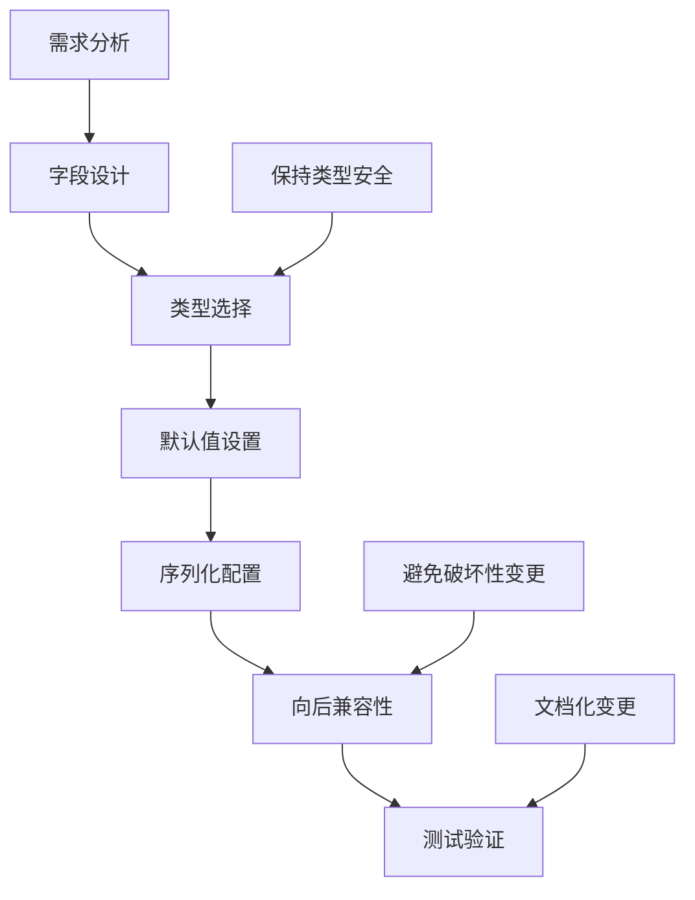

### 扩展策略

1. **继承扩展**: 通过继承现有模型添加新字段
2. **组合扩展**: 使用现有模型作为复合字段
3. **协议扩展**: 定义新的协议接口
4. **插件机制**: 通过钩子函数扩展功能

### 性能考虑

扩展数据模型时需要考虑的性能因素：

| 方面 | 考虑因素 | 建议 |
|------|----------|------|
| 序列化性能 | 字段数量和复杂度 | 控制嵌套深度 |
| 内存占用 | 对象大小和生命周期 | 使用懒加载 |
| 查询效率 | 索引和查询模式 | 合理设计索引 |
| 网络传输 | 数据包大小 | 压缩和分片 |

**章节来源**
- [agentlightning/types/core.py](file://agentlightning/types/core.py#L1-L396)

## 实际应用场景

### 数学问题求解

在数学问题求解场景中，Agent Lightning框架展示了其强大的数据模型能力：

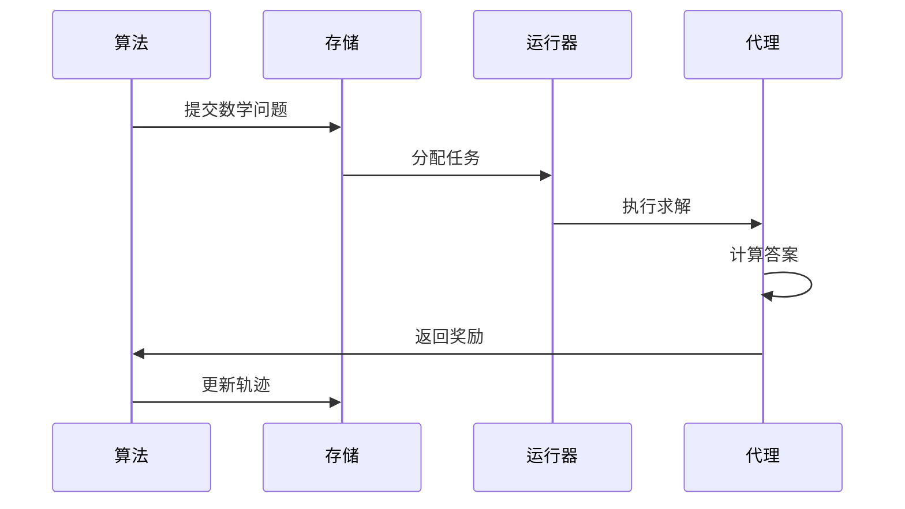

**图表来源**
- [examples/calc_x/calc_agent.py](file://examples/calc_x/calc_agent.py#L50-L100)

### SQL查询优化

在SQL查询优化场景中，框架通过复杂的轨迹重建实现了精确的奖励分配：

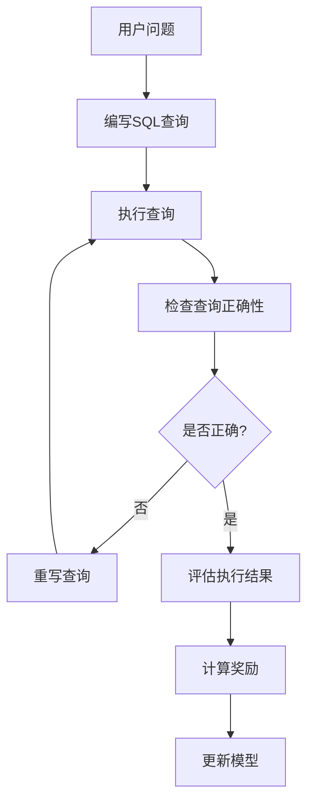

**图表来源**
- [examples/spider/sql_agent.py](file://examples/spider/sql_agent.py#L400-L500)

### 数据结构演进路径

随着应用场景的发展，Agent Lightning框架的数据模型经历了以下演进：

1. **基础版本**: 支持基本的追踪和奖励
2. **增强版本**: 添加了更丰富的元数据字段
3. **优化版本**: 引入了更高效的序列化机制
4. **扩展版本**: 支持自定义资源和配置

**章节来源**
- [examples/calc_x/calc_agent.py](file://examples/calc_x/calc_agent.py#L1-L159)
- [examples/spider/sql_agent.py](file://examples/spider/sql_agent.py#L1-L546)

## 总结

Agent Lightning框架的核心数据模型体系体现了现代软件架构设计的最佳实践：

1. **类型安全**: 基于Pydantic的强类型验证确保数据完整性
2. **扩展性**: 模块化设计支持灵活的功能扩展
3. **兼容性**: 零代码变更机制保持与现有系统的兼容
4. **性能**: 优化的序列化机制保证高效的数据传输
5. **可维护性**: 清晰的职责分离便于长期维护

这套数据模型不仅支撑了Agent Lightning框架的核心功能，也为未来的功能扩展奠定了坚实的基础。通过合理的抽象和设计，它成功地平衡了功能完整性、性能要求和开发效率之间的关系。