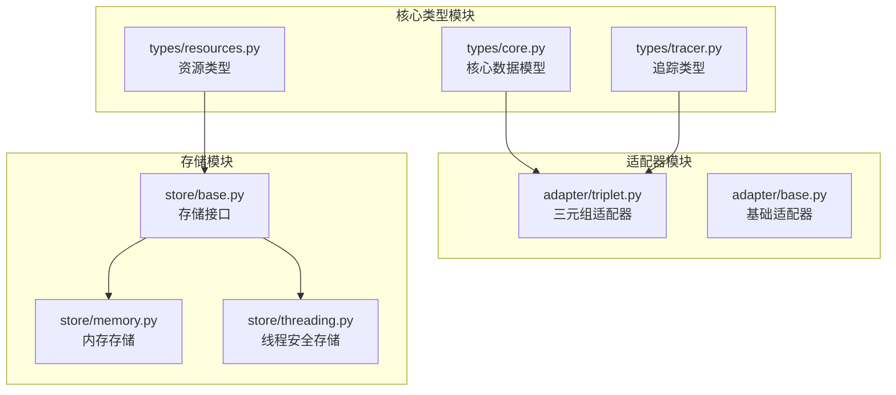
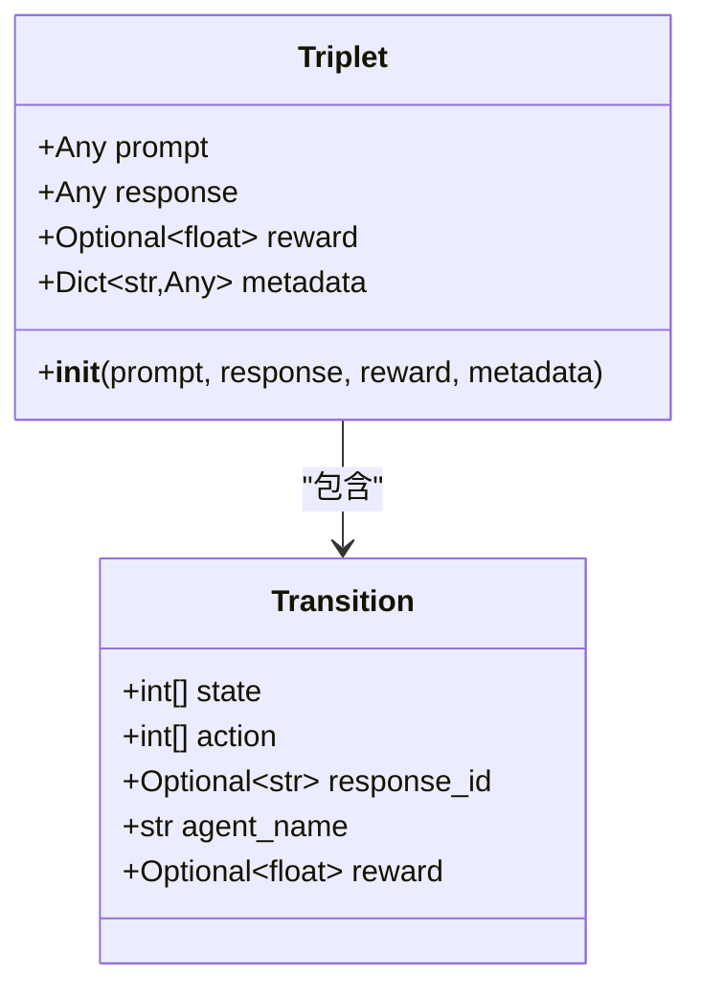
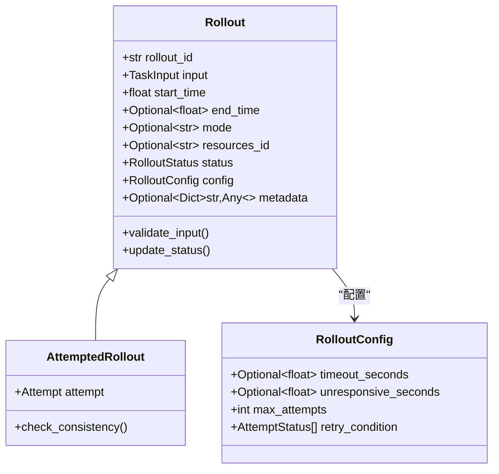
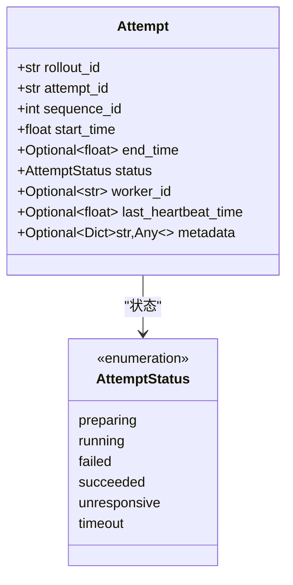
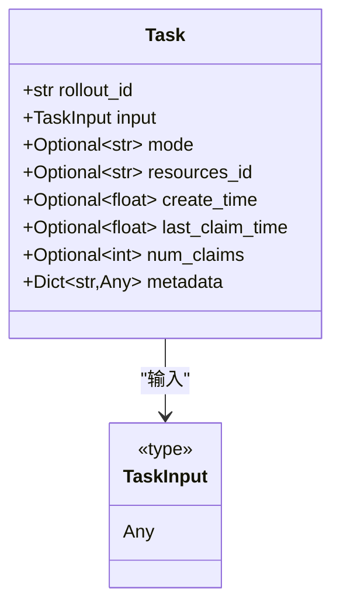
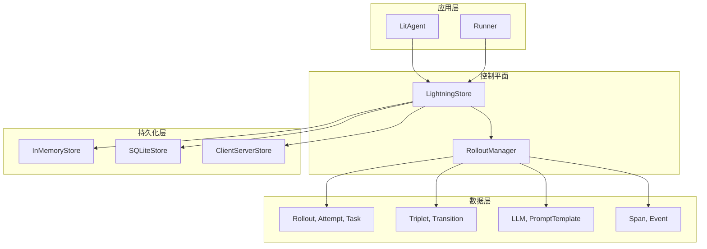
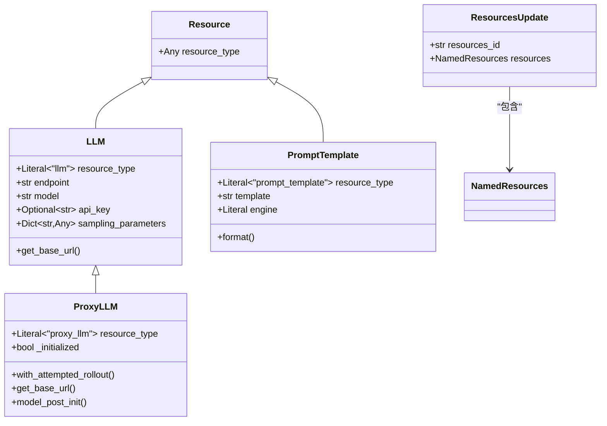
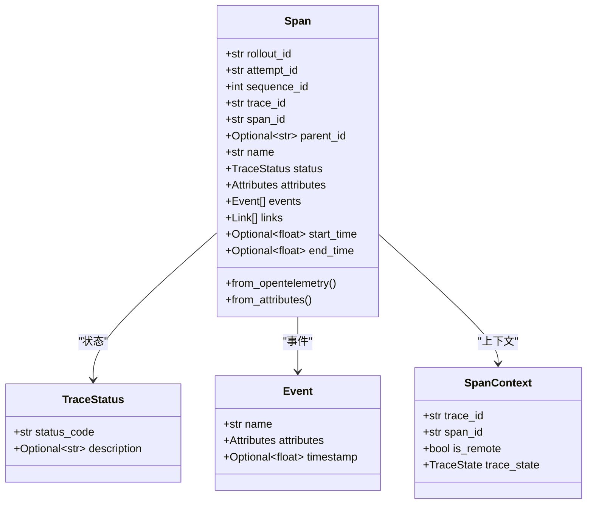
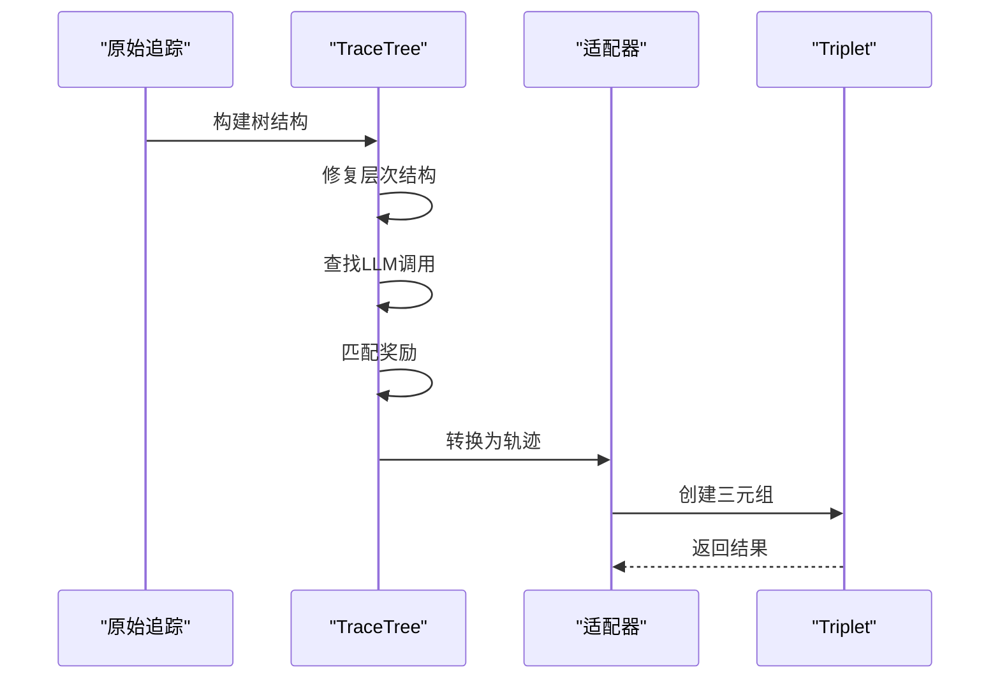
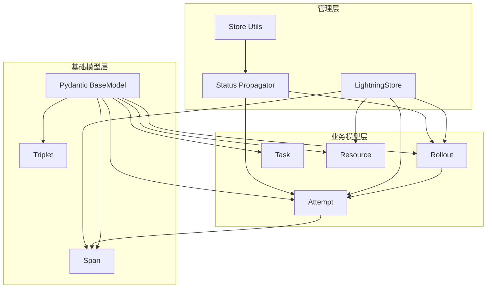

# 核心数据模型

<cite>
**本文档中引用的文件**
- [agentlightning/types/core.py](file://agentlightning/types/core.py)
- [agentlightning/adapter/triplet.py](file://agentlightning/adapter/triplet.py)
- [agentlightning/types/resources.py](file://agentlightning/types/resources.py)
- [agentlightning/types/tracer.py](file://agentlightning/types/tracer.py)
- [agentlightning/store/base.py](file://agentlightning/store/base.py)
- [agentlightning/store/memory.py](file://agentlightning/store/memory.py)
- [agentlightning/store/utils.py](file://agentlightning/store/utils.py)
</cite>

## 目录
1. [简介](#简介)
2. [项目结构概览](#项目结构概览)
3. [核心数据模型](#核心数据模型)
4. [架构概览](#架构概览)
5. [详细组件分析](#详细组件分析)
6. [依赖关系分析](#依赖关系分析)
7. [性能考虑](#性能考虑)
8. [故障排除指南](#故障排除指南)
9. [结论](#结论)

## 简介

Agent Lightning是一个用于强化学习训练的分布式系统，其核心数据模型设计围绕着Rollout、Triplet、Attempt和Task等关键实体构建。这些模型不仅定义了系统的数据结构，还实现了复杂的状态转换逻辑和资源版本管理机制。本文档将深入分析这些核心数据模型的设计理念、实现细节和相互关系。

## 项目结构概览

Agent Lightning采用模块化架构，核心数据模型分布在以下关键模块中：



**图表来源**
- [agentlightning/types/core.py](file://agentlightning/types/core.py#L1-L50)
- [agentlightning/adapter/triplet.py](file://agentlightning/adapter/triplet.py#L1-L50)
- [agentlightning/store/base.py](file://agentlightning/store/base.py#L1-L50)

## 核心数据模型

### Triplet（三元组）模型

Triplet是强化学习中的基本交互单元，表示单次对话或推理过程的完整轨迹。



**图表来源**
- [agentlightning/types/core.py](file://agentlightning/types/core.py#L50-L60)
- [agentlightning/adapter/triplet.py](file://agentlightning/adapter/triplet.py#L20-L35)

**字段含义：**
- `prompt`: 模型输入的令牌标识符列表
- `response`: 模型输出的令牌标识符列表
- `reward`: 关联的标量奖励值（可选）
- `metadata`: 包含响应ID和代理名称等附加信息的字典

### Rollout（执行轮次）模型

Rollout代表一次完整的任务执行尝试，包含了从开始到结束的整个生命周期。



**图表来源**
- [agentlightning/types/core.py](file://agentlightning/types/core.py#L120-L180)

**状态转换逻辑：**
- `queuing` → `preparing` → `running` → `{succeeded, failed, cancelled}`
- 支持重试机制，根据配置的条件决定是否重新排队

### Attempt（尝试）模型

Attempt表示Rollout的一次具体执行尝试，包含详细的元数据和状态信息。



**图表来源**
- [agentlightning/types/core.py](file://agentlightning/types/core.py#L90-L120)

### Task（任务）模型

Task是传递给客户端代理的执行请求，承载了任务的具体输入和上下文信息。



**图表来源**
- [agentlightning/types/core.py](file://agentlightning/types/core.py#L180-L210)

**节来源**
- [agentlightning/types/core.py](file://agentlightning/types/core.py#L50-L210)

## 架构概览

Agent Lightning的核心数据模型遵循分层架构设计，确保了良好的可扩展性和维护性：



**图表来源**
- [agentlightning/store/base.py](file://agentlightning/store/base.py#L50-L100)
- [agentlightning/types/core.py](file://agentlightning/types/core.py#L1-L50)

## 详细组件分析

### 资源管理系统

资源管理系统负责管理可调优的资源，如LLM端点、提示模板等。



**图表来源**
- [agentlightning/types/resources.py](file://agentlightning/types/resources.py#L30-L150)

**资源版本管理机制：**
- 使用不可变快照确保资源的一致性
- 支持通过`resources_id`进行版本控制
- 提供`add_resources()`和`update_resources()`方法

### 追踪系统

追踪系统捕获和管理执行过程中的所有操作记录。



**图表来源**
- [agentlightning/types/tracer.py](file://agentlightning/types/tracer.py#L200-L350)

### 三元组转换器

三元组转换器负责将原始追踪数据转换为强化学习可用的轨迹格式。



**图表来源**
- [agentlightning/adapter/triplet.py](file://agentlightning/adapter/triplet.py#L400-L600)

**节来源**
- [agentlightning/types/resources.py](file://agentlightning/types/resources.py#L30-L199)
- [agentlightning/types/tracer.py](file://agentlightning/types/tracer.py#L200-L427)
- [agentlightning/adapter/triplet.py](file://agentlightning/adapter/triplet.py#L400-L879)

## 依赖关系分析

核心数据模型之间存在复杂的依赖关系，形成了清晰的层次结构：



**图表来源**
- [agentlightning/store/base.py](file://agentlightning/store/base.py#L1-L50)
- [agentlightning/store/utils.py](file://agentlightning/store/utils.py#L1-L30)

**节来源**
- [agentlightning/store/base.py](file://agentlightning/store/base.py#L1-L516)

## 性能考虑

### 序列化/反序列化优化

系统采用多种策略优化Pydantic模型的序列化性能：

1. **延迟加载**：仅在需要时解析复杂对象
2. **缓存机制**：缓存频繁访问的模型实例
3. **批量处理**：支持批量序列化减少开销

### 内存管理

- 使用弱引用避免循环引用
- 实现对象池减少GC压力
- 支持流式处理大型数据集

### 并发安全

- 原子操作确保状态一致性
- 读写锁优化并发访问
- 无锁数据结构提升性能

## 故障排除指南

### 常见验证错误

**Rollout ID不一致错误：**
```python
# 错误场景
attempt.rollout_id != rollout.rollout_id

# 解决方案
# 确保Attempt和Rollout使用相同的rollout_id
```

**状态转换无效错误：**
```python
# 错误场景
attempt.status = "invalid_status"

# 解决方案
# 使用预定义的状态枚举
from agentlightning.types import AttemptStatus
attempt.status = AttemptStatus.running
```

### 数据完整性检查

系统提供了健康检查机制来验证数据完整性：

```python
# 自动健康检查
await healthcheck([rollout], update_rollout_mock, update_attempt_mock)
```

**节来源**
- [agentlightning/store/utils.py](file://agentlightning/store/utils.py#L1-L29)
- [agentlightning/store/memory.py](file://agentlightning/store/memory.py#L845-L907)

## 结论

Agent Lightning的核心数据模型设计体现了现代软件架构的最佳实践：

1. **类型安全**：使用Pydantic确保数据验证和类型安全
2. **状态管理**：清晰的状态转换逻辑支持复杂的业务流程
3. **扩展性**：模块化设计便于功能扩展和定制
4. **性能优化**：多层次的优化策略确保系统高效运行
5. **向后兼容**：精心设计的版本管理机制保证系统稳定性

这些核心数据模型不仅支撑了Agent Lightning的强大功能，也为构建类似的强化学习系统提供了宝贵的参考。通过深入理解这些模型的设计理念和实现细节，开发者可以更好地利用Agent Lightning的强大能力，构建高质量的强化学习应用。