# 核心概念

<cite>
**本文档中引用的文件**
- [agentlightning/__init__.py](file://agentlightning/__init__.py)
- [agentlightning/types/core.py](file://agentlightning/types/core.py)
- [agentlightning/types/resources.py](file://agentlightning/types/resources.py)
- [agentlightning/adapter/triplet.py](file://agentlightning/adapter/triplet.py)
- [agentlightning/emitter/object.py](file://agentlightning/emitter/object.py)
- [agentlightning/litagent/litagent.py](file://agentlightning/litagent/litagent.py)
- [agentlightning/runner/base.py](file://agentlightning/runner/base.py)
- [agentlightning/instrumentation/agentops_langchain.py](file://agentlightning/instrumentation/agentops_langchain.py)
- [agentlightning/store/base.py](file://agentlightning/store/base.py)
- [agentlightning/algorithm/base.py](file://agentlightning/algorithm/base.py)
- [agentlightning/execution/events.py](file://agentlightning/execution/events.py)
- [agentlightning/tracer/base.py](file://agentlightning/tracer/base.py)
- [examples/tinker/agl_tinker/env.py](file://examples/tinker/agl_tinker/env.py)
- [examples/tinker/agl_tinker/rollout.py](file://examples/tinker/agl_tinker/rollout.py)
- [README.md](file://README.md)
</cite>

## 目录
1. [简介](#简介)
2. [项目架构概览](#项目架构概览)
3. [核心概念体系](#核心概念体系)
4. [零代码变更机制](#零代码变更机制)
5. [选择性优化原理](#选择性优化原理)
6. [数据流架构](#数据流架构)
7. [核心术语定义](#核心术语定义)
8. [第三方框架集成](#第三方框架集成)
9. [事件驱动架构](#事件驱动架构)
10. [组件协作关系](#组件协作关系)
11. [实际代码示例](#实际代码示例)
12. [总结](#总结)

## 简介

Agent Lightning是一个革命性的AI代理训练框架，它通过创新的事件驱动架构实现了对现有代理系统的"零代码变更"优化。该框架的核心理念是让现有的代理系统保持原有运行逻辑不变，同时通过轻量级的事件发射器和追踪器捕获关键行为数据，为强化学习、自动提示优化等算法提供丰富的训练信号。

Agent Lightning的独特之处在于其能够无缝集成各种主流代理框架，包括LangChain、AutoGen、CrewAI等，而无需修改用户已有的代理代码。这种设计使得企业可以平滑地升级其AI代理系统，逐步引入先进的优化算法，而不会影响现有业务流程的稳定性。

## 项目架构概览

Agent Lightning采用模块化的分层架构设计，主要包含以下核心层次：

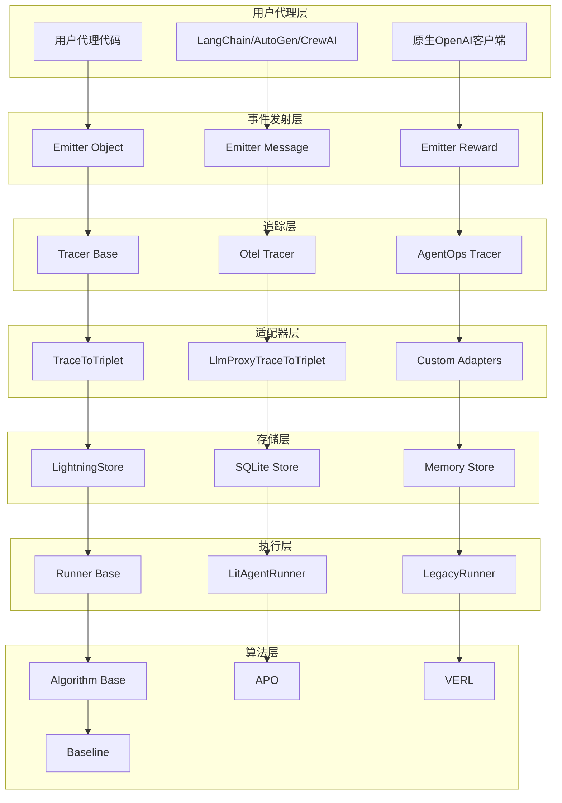

**图表来源**
- [agentlightning/__init__.py](file://agentlightning/__init__.py#L1-L20)
- [agentlightning/tracer/base.py](file://agentlightning/tracer/base.py#L1-L50)
- [agentlightning/store/base.py](file://agentlightning/store/base.py#L1-L100)

## 核心概念体系

### 事件发射机制

Agent Lightning的核心创新在于其事件发射机制，该机制允许在不修改用户代理代码的情况下捕获关键行为数据。

#### 对象事件发射

对象事件发射是最基础的事件类型，用于捕获任意可序列化对象的状态信息：

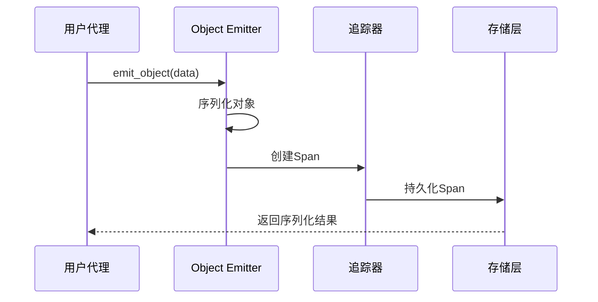

**图表来源**
- [agentlightning/emitter/object.py](file://agentlightning/emitter/object.py#L15-L35)

#### 消息事件发射

消息事件发射专门用于捕获代理之间的对话内容，支持多轮对话的完整记录：

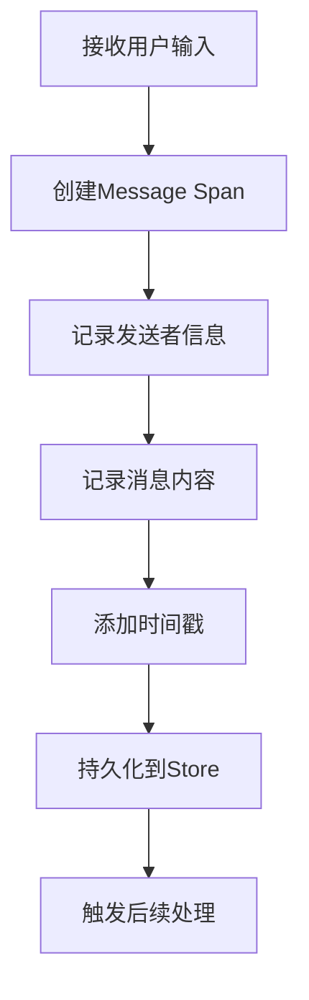

#### 奖励事件发射

奖励事件发射用于捕获代理行为的评估信号，这是强化学习训练的关键数据源：

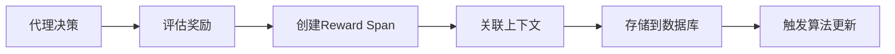

**段落来源**
- [agentlightning/emitter/object.py](file://agentlightning/emitter/object.py#L1-L38)

### 追踪系统

Agent Lightning的追踪系统基于OpenTelemetry标准，提供了统一的跨框架追踪能力：

#### 追踪上下文管理

追踪上下文确保所有相关操作都在同一个追踪范围内进行：

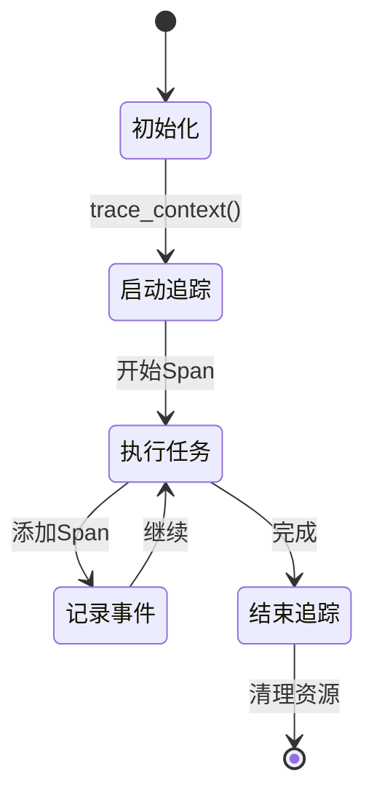

#### 多框架兼容性

Agent Lightning通过适配器模式支持多种代理框架：

| 框架 | 支持状态 | 特殊处理 |
|------|----------|----------|
| LangChain | ✅ 完全支持 | 自动回调处理器 |
| AutoGen | ✅ 完全支持 | 团队协作追踪 |
| CrewAI | ✅ 完全支持 | 任务分解追踪 |
| OpenAI SDK | ✅ 完全支持 | 原生支持 |
| AgentOps | ✅ 完全支持 | 集成式追踪 |

**段落来源**
- [agentlightning/tracer/base.py](file://agentlightning/tracer/base.py#L1-L141)
- [agentlightning/instrumentation/agentops_langchain.py](file://agentlightning/instrumentation/agentops_langchain.py#L1-L46)

## 零代码变更机制

Agent Lightning的"零代码变更"特性是其最重要的创新之一。这一机制通过以下方式实现：

### 透明事件捕获

系统在底层拦截所有重要的代理交互事件，无需用户修改任何现有代码：

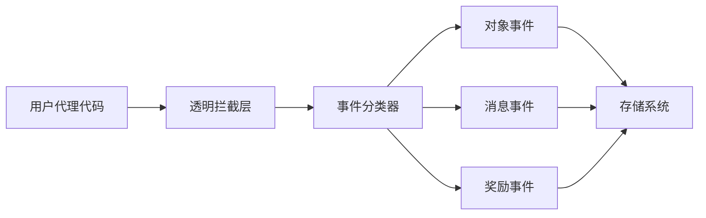

### 自动适配器生成

系统能够根据不同的代理框架自动生成相应的适配器：

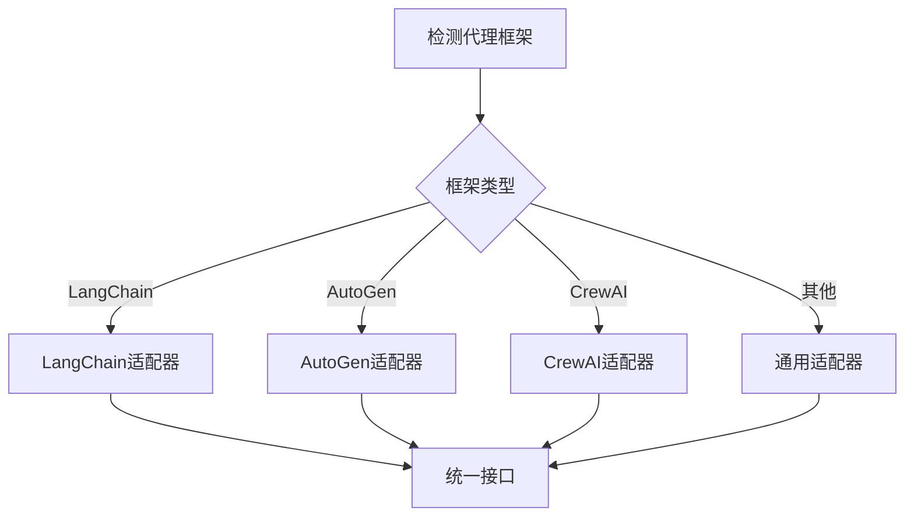

### 无侵入性集成

零代码变更机制确保：
- 现有业务逻辑不受影响
- 性能开销最小化
- 向后兼容性保证
- 渐进式部署支持

**段落来源**
- [agentlightning/adapter/triplet.py](file://agentlightning/adapter/triplet.py#L1-L100)

## 选择性优化原理

Agent Lightning支持对多代理系统中的特定代理进行选择性优化，这为复杂的多智能体场景提供了灵活的解决方案。

### 代理识别机制

系统通过多种方式识别和区分不同的代理：

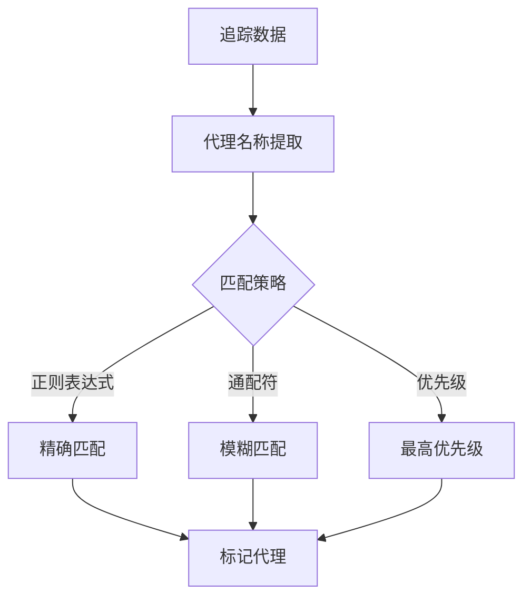

### 资源隔离

每个代理可以使用独立的资源配置，实现真正的选择性优化：

| 配置项 | 全局配置 | 代理特定配置 | 效果 |
|--------|----------|--------------|------|
| LLM模型 | 全局默认 | 代理专属 | 不同代理使用不同模型 |
| 提示模板 | 全局模板 | 代理模板 | 个性化提示工程 |
| 采样参数 | 全局设置 | 代理设置 | 不同推理策略 |
| 资源版本 | 最新版本 | 版本锁定 | 控制更新风险 |

### 动态路由

系统支持动态路由到不同的代理实例：

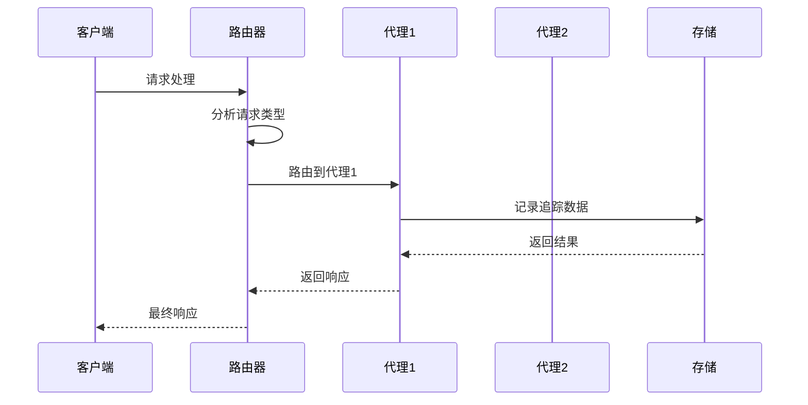

**段落来源**
- [agentlightning/types/resources.py](file://agentlightning/types/resources.py#L1-L199)

## 数据流架构

Agent Lightning的数据流架构形成了一个完整的闭环，从事件发射到资源更新：

### 完整数据流循环

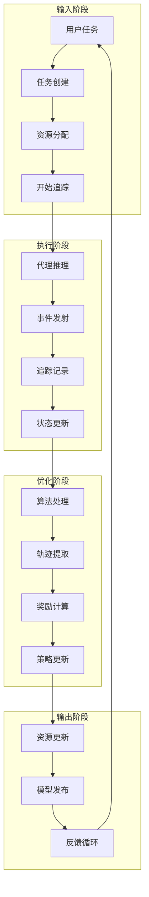

### 数据转换管道

系统通过多个适配器层实现数据格式的转换：

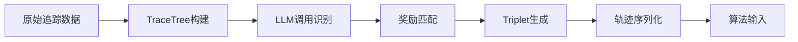

### 实时处理能力

系统支持实时数据处理和批量处理两种模式：

| 处理模式 | 延迟 | 吞吐量 | 适用场景 |
|----------|------|--------|----------|
| 实时处理 | 低 | 中等 | 在线优化 |
| 批量处理 | 高 | 高 | 离线训练 |
| 混合模式 | 中等 | 高 | 生产环境 |

**段落来源**
- [agentlightning/adapter/triplet.py](file://agentlightning/adapter/triplet.py#L400-L600)

## 核心术语定义

### Rollout（回放）

Rollout是Agent Lightning中的核心概念，代表一次完整的代理执行过程：

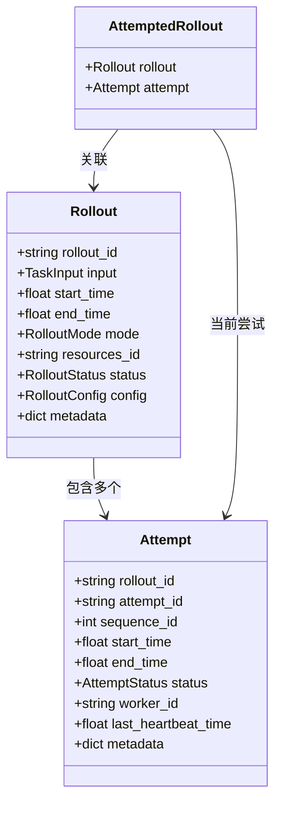

**图表来源**
- [agentlightning/types/core.py](file://agentlightning/types/core.py#L100-L200)

### Triplet（三元组）

Triplet是强化学习训练的基本单元，包含提示、响应和奖励信息：

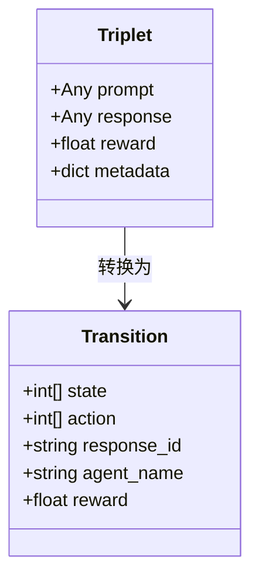

### Resources（资源）

Resources定义了代理执行所需的各类配置和模型：

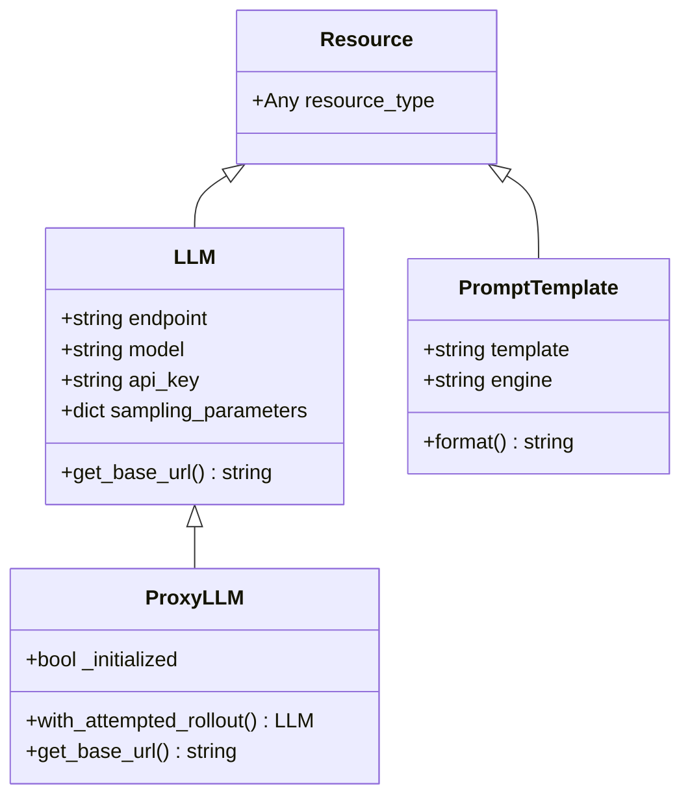

**图表来源**
- [agentlightning/types/resources.py](file://agentlightning/types/resources.py#L30-L150)

### Task（任务）

Task是传递给代理的具体工作单元：

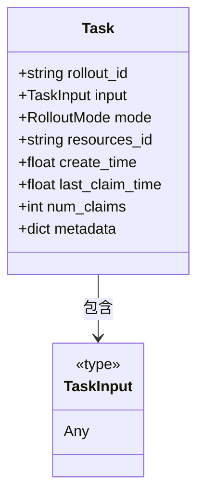

**段落来源**
- [agentlightning/types/core.py](file://agentlightning/types/core.py#L250-L350)

## 第三方框架集成

Agent Lightning通过精心设计的集成层支持各种主流代理框架：

### LangChain集成

LangChain集成为Agent Lightning提供了强大的自然语言处理能力：

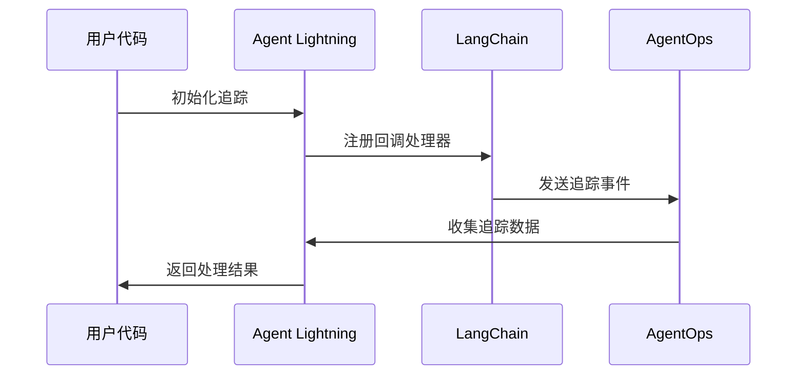

### AutoGen集成

AutoGen团队协作框架的集成支持多智能体系统的复杂交互：

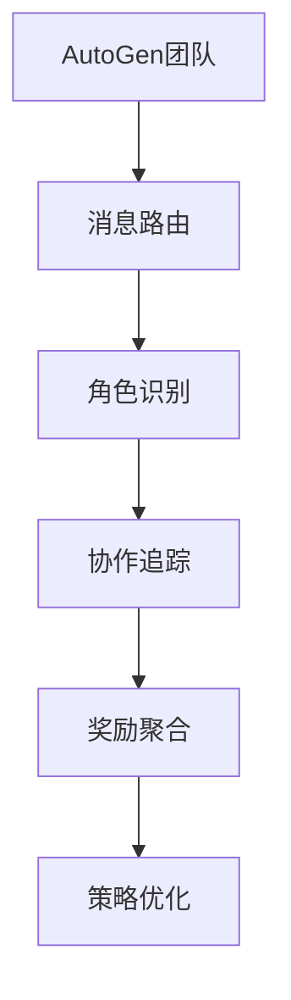

### CrewAI集成

CrewAI项目管理框架的集成提供了任务分解和协调能力：

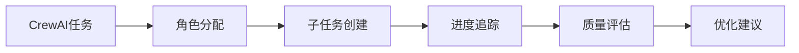

### 集成配置表

| 框架 | 集成方式 | 主要特性 | 性能影响 |
|------|----------|----------|----------|
| LangChain | 回调处理器 | 流式处理、链式调用 | 低 |
| AutoGen | 团队追踪 | 多角色协作 | 中等 |
| CrewAI | 任务追踪 | 项目管理 | 中等 |
| OpenAI SDK | 原生支持 | 直接集成 | 极低 |
| AgentOps | 集成库 | 企业级追踪 | 低 |

**段落来源**
- [agentlightning/instrumentation/agentops_langchain.py](file://agentlightning/instrumentation/agentops_langchain.py#L1-L46)

## 事件驱动架构

Agent Lightning采用事件驱动架构，实现了高度解耦和可扩展的系统设计：

### 事件类型体系

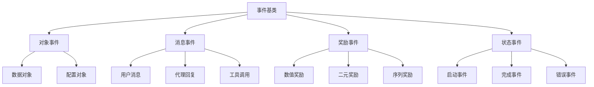

### 事件传播机制

事件通过多层处理器进行传播和转换：

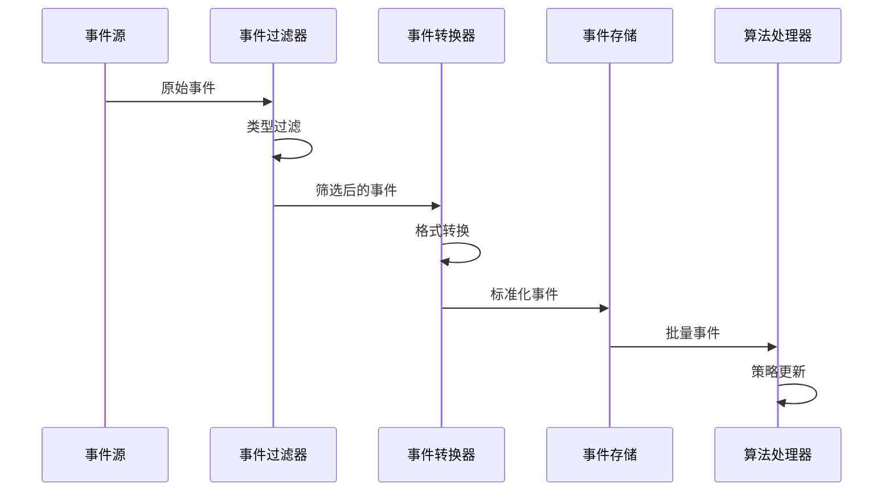

### 异步处理能力

系统支持异步事件处理，提高并发性能：

```mermaid
flowchart LR
A[事件队列] --> B[消费者1]
A --> C[消费者2]
A --> D[消费者3]
B --> E[并行处理]
C --> E
D --> E
E --> F[结果聚合]
```

**段落来源**
- [agentlightning/execution/events.py](file://agentlightning/execution/events.py#L1-L70)

## 组件协作关系

Agent Lightning的各个组件通过清晰的接口和协议进行协作：

### 核心组件交互图

```mermaid
graph TB
subgraph "控制层"
A[Trainer] --> B[Runner]
B --> C[Algorithm]
end
subgraph "数据层"
D[LightningStore] --> E[Span存储]
D --> F[资源管理]
D --> G[任务队列]
end
subgraph "追踪层"
H[Tracer] --> I[Span生成]
I --> J[追踪上下文]
end
subgraph "适配层"
K[TraceAdapter] --> L[Triplet转换]
L --> M[轨迹提取]
end
A --> D
B --> H
C --> K
D --> I
H --> K
```

### 生命周期管理

各组件遵循标准化的生命周期管理模式：

```mermaid
stateDiagram-v2
[*] --> 初始化
初始化 --> 准备就绪 : init()
准备就绪 --> 运行中 : start()
运行中 --> 暂停 : pause()
暂停 --> 运行中 : resume()
运行中 --> 完成 : stop()
运行中 --> 错误 : error()
错误 --> 重试 : retry()
重试 --> 运行中 : retry()
完成 --> [*]
```

### 依赖注入机制

系统通过依赖注入实现组件间的松耦合：

| 组件 | 依赖项 | 注入方式 | 生命周期 |
|------|--------|----------|----------|
| Runner | Agent | 构造函数注入 | 单例 |
| Algorithm | Store | 属性注入 | 工厂模式 |
| Tracer | Store | 方法注入 | 上下文 |
| Adapter | Tracer | 回调注入 | 事件驱动 |

**段落来源**
- [agentlightning/runner/base.py](file://agentlightning/runner/base.py#L1-L183)
- [agentlightning/algorithm/base.py](file://agentlightning/algorithm/base.py#L1-L163)

## 实际代码示例

### 基础使用示例

以下是Agent Lightning的基础使用模式：

```python
# 基础代理定义
class MyAgent(LitAgent):
    async def rollout(self, task, resources, rollout):
        # 代理核心逻辑
        result = await self.process_task(task, resources)
        return result

# 创建训练器
trainer = Trainer()
trainer.add_agent(MyAgent())

# 开始训练
await trainer.run(train_dataset, val_dataset)
```

### 多框架集成示例

```python
# LangChain集成
from langchain.agents import initialize_agent

agent = initialize_agent(...)
# Agent Lightning自动捕获所有交互

# AutoGen集成
from autogen import AssistantAgent, UserProxyAgent

assistant = AssistantAgent(...)
user_proxy = UserProxyAgent(...)
# 多智能体协作自动追踪
```

### 自定义适配器示例

```python
# 自定义轨迹提取器
class CustomAdapter(TraceAdapter):
    def adapt(self, spans):
        # 自定义轨迹提取逻辑
        return custom_trajectory_format(spans)
```

### 算法集成示例

```python
# APO算法集成
from agentlightning.algorithm.apo import APO

apo = APO()
apo.set_store(store)
apo.set_adapter(adapter)

# VERL算法集成
from agentlightning.algorithm.verl import VERL

verl = VERL()
verl.set_store(store)
verl.set_adapter(adapter)
```

**段落来源**
- [examples/tinker/agl_tinker/rollout.py](file://examples/tinker/agl_tinker/rollout.py#L1-L100)

## 总结

Agent Lightning通过其创新的核心概念体系，为AI代理训练提供了一个强大而灵活的平台。其主要优势包括：

### 技术创新点

1. **零代码变更机制**：通过透明事件捕获实现对现有系统的无缝集成
2. **选择性优化原理**：支持多代理系统中的精细化优化控制
3. **事件驱动架构**：实现高度解耦和可扩展的系统设计
4. **多框架兼容性**：统一支持各种主流代理框架

### 应用价值

- **降低部署成本**：无需重构现有系统即可获得先进优化能力
- **提升开发效率**：简化AI代理的训练和优化流程
- **增强系统稳定性**：渐进式部署策略减少风险
- **促进技术创新**：为新的训练算法提供基础设施支持

### 发展前景

Agent Lightning代表了AI代理训练领域的重要发展方向，其设计理念和技术实现为未来的智能系统优化奠定了坚实基础。随着人工智能技术的不断发展，Agent Lightning将继续演进，为构建更智能、更高效的AI代理系统提供强有力的支持。

通过深入理解和掌握这些核心概念，开发者可以更好地利用Agent Lightning的强大功能，快速构建和优化自己的AI代理系统，在竞争激烈的AI应用开发中占据先机。