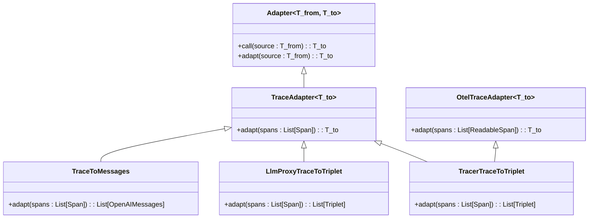
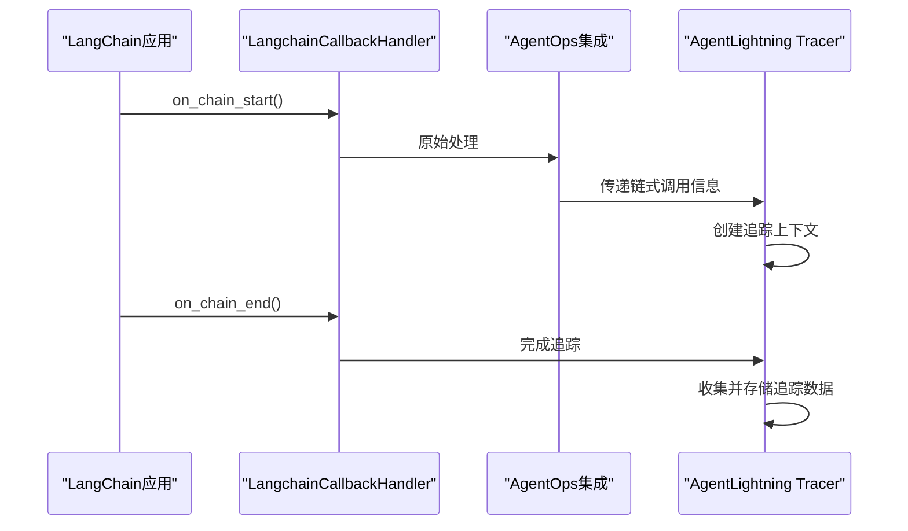
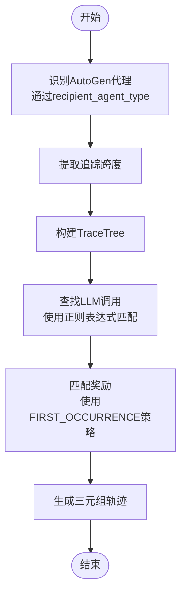
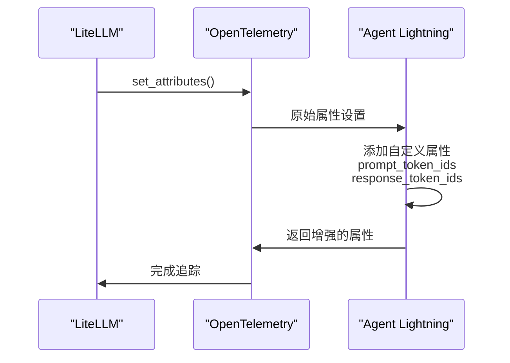
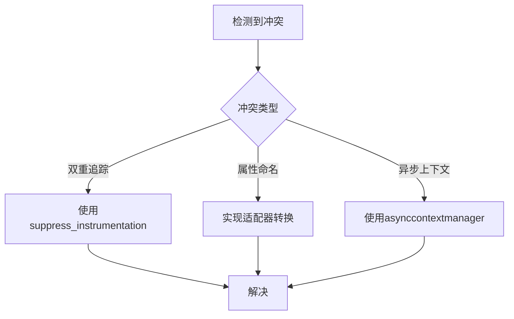
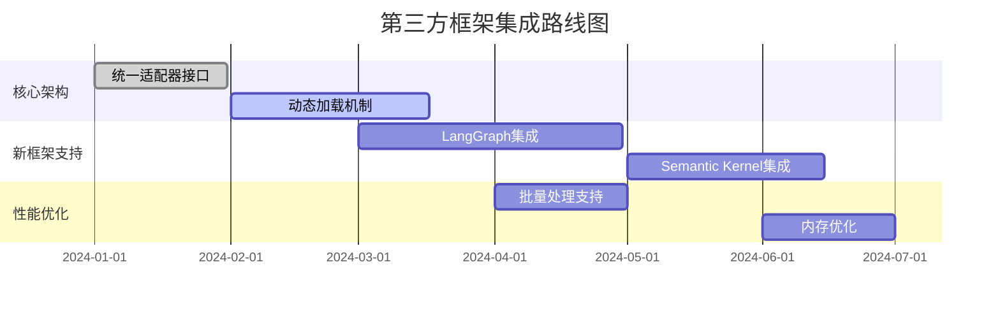

# 第三方框架集成机制

<cite>
**本文档引用的文件**
- [agentops.py](file://agentlightning/instrumentation/agentops.py)
- [litellm.py](file://agentlightning/instrumentation/litellm.py)
- [vllm.py](file://agentlightning/instrumentation/vllm.py)
- [agentops_langchain.py](file://agentlightning/instrumentation/agentops_langchain.py)
- [base.py](file://agentlightning/adapter/base.py)
- [triplet.py](file://agentlightning/adapter/triplet.py)
- [messages.py](file://agentlightning/adapter/messages.py)
- [agentops.py](file://agentlightning/tracer/agentops.py)
- [otel.py](file://agentlightning/tracer/otel.py)
- [__init__.py](file://agentlightning/instrumentation/__init__.py)
</cite>

## 目录
1. [集成概述](#集成概述)
2. [适配器模式与跨框架兼容性](#适配器模式与跨框架兼容性)
3. [与LangChain的集成](#与langchain的集成)
4. [与AutoGen的集成](#与autogen的集成)
5. [与LiteLLM的集成](#与litellm的集成)
6. [配置方法与启用步骤](#配置方法与启用步骤)
7. [兼容性矩阵](#兼容性矩阵)
8. [集成冲突与解决方案](#集成冲突与解决方案)
9. [未来扩展路线图](#未来扩展路线图)

## 集成概述

Agent Lightning通过适配器模式和追踪器机制实现了与LangChain、AutoGen、LiteLLM等第三方框架的无缝集成。系统通过`instrumentation`模块中的特定适配器来捕获和转换不同框架的调用数据，确保消息格式、调用链追踪和上下文传播的一致性。集成机制的核心在于动态修补（patching）目标框架的API调用，以捕获必要的追踪信息。

**Section sources**
- [__init__.py](file://agentlightning/instrumentation/__init__.py#L1-L114)

## 适配器模式与跨框架兼容性

Agent Lightning采用适配器模式实现跨框架兼容性，通过`Adapter`基类和其具体实现来转换不同框架的数据格式。`Adapter`类定义了通用的转换协议，允许将一种数据格式转换为另一种格式，同时保持接口的一致性。



**Diagram sources**
- [base.py](file://agentlightning/adapter/base.py#L1-L95)
- [triplet.py](file://agentlightning/adapter/triplet.py#L1-L879)
- [messages.py](file://agentlightning/adapter/messages.py#L1-L271)

**Section sources**
- [base.py](file://agentlightning/adapter/base.py#L1-L95)
- [triplet.py](file://agentlightning/adapter/triplet.py#L1-L879)
- [messages.py](file://agentlightning/adapter/messages.py#L1-L271)

## 与LangChain的集成

Agent Lightning通过`agentops_langchain`模块实现与LangChain的深度集成。该集成通过修补LangChain的回调处理器来捕获执行轨迹，同时解决AgentOps与LangChain之间的兼容性问题。



集成的关键在于`instrument_agentops_langchain()`函数，它通过重写`LangchainCallbackHandler.on_chain_start`方法来确保正确的序列化数据传递，同时临时移除AgentOps对LangGraph的原生支持以避免冲突。

**Diagram sources**
- [agentops_langchain.py](file://agentlightning/instrumentation/agentops_langchain.py#L1-L44)

**Section sources**
- [agentops_langchain.py](file://agentlightning/instrumentation/agentops_langchain.py#L1-L44)

## 与AutoGen的集成

Agent Lightning通过通用的追踪机制与AutoGen集成，利用`TraceTree`类来解析和重构多代理系统的执行轨迹。系统通过识别AutoGen特有的属性（如`recipient_agent_type`）来确定代理角色，并构建完整的调用链。



**Diagram sources**
- [triplet.py](file://agentlightning/adapter/triplet.py#L1-L879)

**Section sources**
- [triplet.py](file://agentlightning/adapter/triplet.py#L1-L879)

## 与LiteLLM的集成

Agent Lightning通过`litellm`模块实现与LiteLLM的集成，主要通过修补LiteLLM的OpenTelemetry集成来捕获令牌ID等关键信息。



集成通过`instrument_litellm()`函数实现，该函数修补`OpenTelemetry.set_attributes`方法，在原始属性设置的基础上添加令牌ID等额外信息。

**Diagram sources**
- [litellm.py](file://agentlightning/instrumentation/litellm.py#L1-L40)

**Section sources**
- [litellm.py](file://agentlightning/instrumentation/litellm.py#L1-L40)

## 配置方法与启用步骤

### 基本配置

```mermaid
flowchart TD
A[安装Agent Lightning] --> B[导入instrument_all]
B --> C[调用instrument_all()]
C --> D[创建Tracer实例]
D --> E[初始化Tracer]
E --> F[开始追踪上下文]
F --> G[执行代理任务]
G --> H[获取追踪数据]
```

### 具体启用步骤

1. **安装依赖**：确保已安装目标框架（LangChain、AutoGen、LiteLLM等）
2. **导入模块**：从`agentlightning.instrumentation`导入相关模块
3. **启用集成**：调用`instrument_all()`或特定框架的`instrument_*`函数
4. **配置追踪器**：创建并初始化适当的Tracer（如`AgentOpsTracer`）
5. **执行任务**：在追踪上下文中运行代理应用

**Section sources**
- [__init__.py](file://agentlightning/instrumentation/__init__.py#L1-L114)
- [agentops.py](file://agentlightning/tracer/agentops.py#L1-L374)
- [otel.py](file://agentlightning/tracer/otel.py#L1-L96)

## 兼容性矩阵

| 框架 | 支持状态 | 主要功能 | 限制 |
|------|---------|---------|------|
| **LangChain** | 完全支持 | 调用链追踪、上下文传播、奖励捕获 | 需要修补回调处理器 |
| **AutoGen** | 完全支持 | 多代理追踪、角色识别、奖励匹配 | 依赖属性命名约定 |
| **LiteLLM** | 完全支持 | 令牌ID捕获、请求/响应追踪 | 需要OpenTelemetry集成 |
| **vLLM** | 完全支持 | 引擎级令牌ID捕获、完整响应追踪 | 需要v0.10.2+版本 |
| **OpenAI SDK** | 完全支持 | 原生API追踪、流式响应处理 | 依赖特定属性格式 |

**Section sources**
- [__init__.py](file://agentlightning/instrumentation/__init__.py#L1-L114)
- [agentops.py](file://agentlightning/instrumentation/agentops.py#L1-L316)
- [litellm.py](file://agentlightning/instrumentation/litellm.py#L1-L40)
- [vllm.py](file://agentlightning/instrumentation/vllm.py#L1-L82)

## 集成冲突与解决方案

### 常见冲突

1. **双重追踪冲突**：当多个框架同时启用追踪时可能导致数据重复
2. **属性命名冲突**：不同框架使用不同的属性命名约定
3. **异步执行冲突**：异步任务中的追踪上下文丢失

### 解决方案



主要解决方案包括：
- 使用`suppress_instrumentation`上下文管理器临时禁用特定追踪
- 通过适配器模式转换不同框架的属性格式
- 利用异步上下文管理器确保追踪上下文的正确传播

**Section sources**
- [agentops.py](file://agentlightning/instrumentation/agentops.py#L1-L316)
- [agentops.py](file://agentlightning/tracer/agentops.py#L1-L374)
- [otel.py](file://agentlightning/tracer/otel.py#L1-L96)

## 未来扩展路线图



未来的技术路线图包括：
1. **统一适配器接口**：为所有第三方框架提供一致的适配器API
2. **动态加载机制**：支持运行时动态加载和卸载框架集成
3. **新框架支持**：扩展对LangGraph、Semantic Kernel等新兴框架的支持
4. **性能优化**：实现批量处理和内存优化以提高大规模应用的性能

**Section sources**
- [base.py](file://agentlightning/adapter/base.py#L1-L95)
- [__init__.py](file://agentlightning/instrumentation/__init__.py#L1-L114)