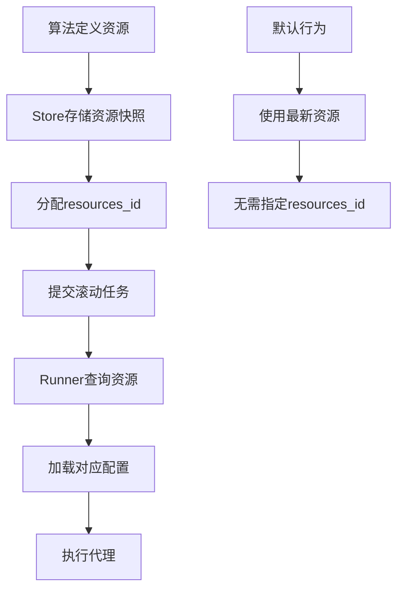
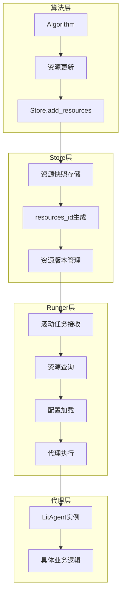
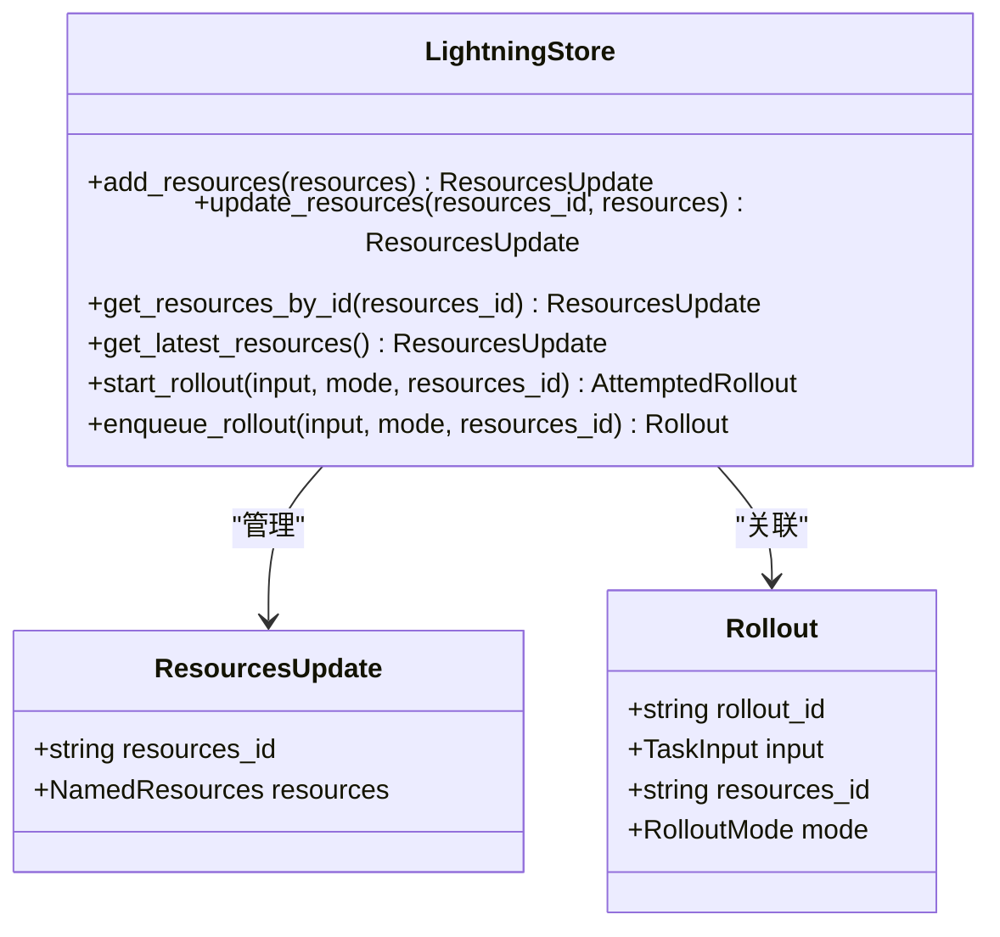
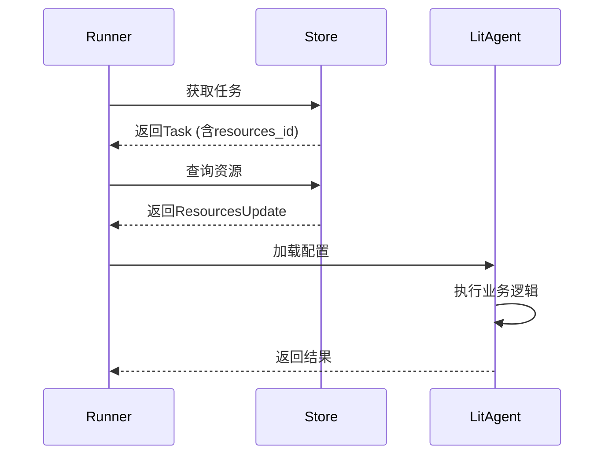
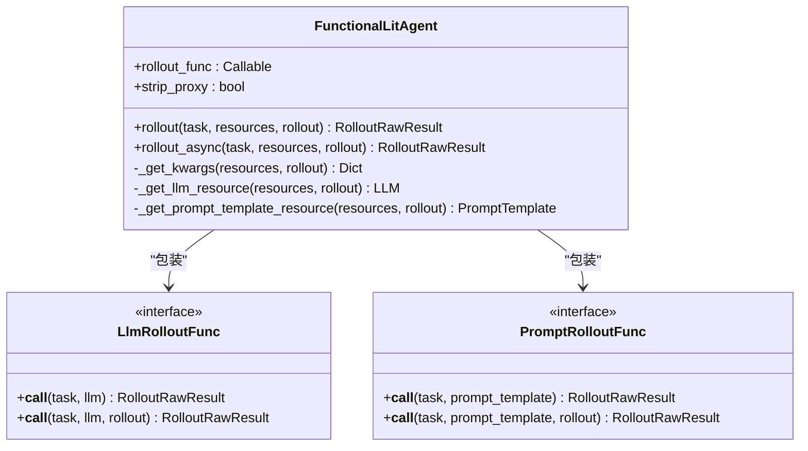
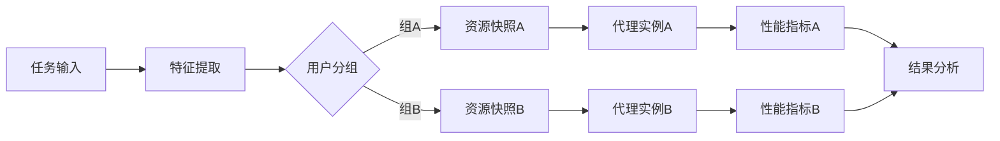
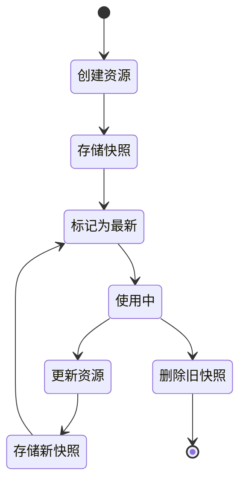

# Agent Lightning选择性优化原理

<cite>
**本文档引用的文件**
- [resources.py](file://agentlightning/types/resources.py)
- [decorator.py](file://agentlightning/litagent/decorator.py)
- [litagent.py](file://agentlightning/litagent/litagent.py)
- [base.py](file://agentlightning/runner/base.py)
- [core.py](file://agentlightning/types/core.py)
- [base.py](file://agentlightning/store/base.py)
- [fast.py](file://agentlightning/algorithm/fast.py)
- [apo_custom_algorithm.py](file://examples/apo/apo_custom_algorithm.py)
- [calc_agent.py](file://examples/calc_x/calc_agent.py)
</cite>

## 目录
1. [引言](#引言)
2. [核心概念](#核心概念)
3. [资源标识符机制](#资源标识符机制)
4. [架构概览](#架构概览)
5. [详细组件分析](#详细组件分析)
6. [A/B测试实现](#ab测试实现)
7. [配置方法与生命周期管理](#配置方法与生命周期管理)
8. [Store组件交互](#store组件交互)
9. [实际用例分析](#实际用例分析)
10. [性能考虑与扩展性](#性能考虑与扩展性)
11. [故障排除指南](#故障排除指南)
12. [结论](#结论)

## 引言

Agent Lightning的选择性优化原理是其核心功能之一，通过资源标识符（resources_id）实现了对特定代理实例的精准控制。这一机制允许在同一系统中混合运行优化中和已优化的代理版本，并通过动态资源切换支持A/B测试等高级应用场景。

选择性优化的核心思想是将代理的配置参数（如模型端点、采样参数、提示模板等）抽象为可版本化的资源集合，每个资源集合通过唯一的resources_id进行标识。这种设计使得算法能够精确控制哪些代理实例应该使用哪种配置，从而实现精细化的实验管理和部署策略。

## 核心概念

### 资源（Resources）

在Agent Lightning中，资源是可配置的组件，包括：
- **LLM资源**：语言模型端点和配置
- **提示模板**：可参数化的文本模板
- **代理配置**：各种代理相关的参数设置

### 资源更新（ResourcesUpdate）

每次资源变更都会产生一个新的ResourcesUpdate对象，包含：
- `resources_id`：唯一标识符
- `resources`：资源配置映射

### 滚动尝试（AttemptedRollout）

滚动尝试是资源选择机制的核心，它将滚动请求与具体的资源快照关联起来。

## 资源标识符机制

### 基本工作原理

资源标识符机制通过以下步骤实现选择性优化：

**图表来源**
- [base.py](file://agentlightning/store/base.py#L80-L120)
- [core.py](file://agentlightning/types/core.py#L150-L180)

### 资源选择逻辑

Runner在处理滚动任务时遵循以下优先级：

1. **明确指定**：如果任务包含`resources_id`，使用指定的资源
2. **默认资源**：如果没有指定，使用最新的资源快照
3. **错误处理**：如果找不到对应资源，记录错误并跳过

**段落来源**
- [base.py](file://agentlightning/store/base.py#L80-L120)

## 架构概览

Agent Lightning的选择性优化架构采用分层设计：

**图表来源**
- [base.py](file://agentlightning/store/base.py#L400-L450)
- [base.py](file://agentlightning/runner/base.py#L50-L100)

## 详细组件分析

### Store组件的资源管理

Store组件负责资源的持久化和版本控制：

**图表来源**
- [base.py](file://agentlightning/store/base.py#L400-L500)
- [resources.py](file://agentlightning/types/resources.py#L180-L199)

### Runner的资源加载机制

Runner通过以下流程加载资源：

**图表来源**
- [base.py](file://agentlightning/runner/base.py#L150-L183)

**段落来源**
- [base.py](file://agentlightning/runner/base.py#L150-L183)

### LitAgent装饰器的资源注入

LitAgent装饰器提供了灵活的资源注入机制：

**图表来源**
- [decorator.py](file://agentlightning/litagent/decorator.py#L100-L200)

**段落来源**
- [decorator.py](file://agentlightning/litagent/decorator.py#L100-L200)

## A/B测试实现

### A/B测试的基本原理

Agent Lightning的A/B测试通过资源隔离实现：

1. **资源分割**：为不同组别创建独立的资源快照
2. **流量路由**：根据用户或任务特征分配到不同组
3. **结果对比**：收集各组的性能指标进行比较

### 实现示例

以下是A/B测试的典型实现模式：

**图表来源**
- [apo_custom_algorithm.py](file://examples/apo/apo_custom_algorithm.py#L50-L100)

### 动态资源切换

系统支持运行时动态切换资源，实现无缝的A/B测试：

**段落来源**
- [apo_custom_algorithm.py](file://examples/apo/apo_custom_algorithm.py#L50-L100)

## 配置方法与生命周期管理

### 资源配置的最佳实践

1. **命名规范**：使用描述性的resources_id
2. **版本控制**：为重要变更创建新的资源快照
3. **回滚机制**：保留历史资源快照以支持快速回滚

### 生命周期管理

**图表来源**
- [base.py](file://agentlightning/store/base.py#L450-L500)

**段落来源**
- [base.py](file://agentlightning/store/base.py#L450-L500)

## Store组件交互

### 核心API接口

Store组件提供了完整的资源管理API：

| 方法 | 描述 | 参数 |
|------|------|------|
| `add_resources` | 添加新的资源快照 | `resources: NamedResources` |
| `update_resources` | 更新现有资源快照 | `resources_id: str, resources: NamedResources` |
| `get_resources_by_id` | 获取指定资源快照 | `resources_id: str` |
| `get_latest_resources` | 获取最新资源快照 | 无 |
| `start_rollout` | 启动带资源的滚动 | `input, mode, resources_id` |

### 并发安全保证

Store组件确保资源操作的并发安全性：

**段落来源**
- [base.py](file://agentlightning/store/base.py#L400-L500)

## 实际用例分析

### 提示优化场景

在提示优化中，算法可以动态切换不同的提示模板：

**段落来源**
- [apo_custom_algorithm.py](file://examples/apo/apo_custom_algorithm.py#L50-L100)

### 计算代理场景

计算代理展示了如何使用自定义资源配置：

**段落来源**
- [calc_agent.py](file://examples/calc_x/calc_agent.py#L80-L120)

### 快速算法集成

快速算法展示了资源初始化的标准流程：

**段落来源**
- [fast.py](file://agentlightning/algorithm/fast.py#L196-L214)

## 性能考虑与扩展性

### 扩展性设计

1. **水平扩展**：Store组件支持分布式部署
2. **缓存机制**：频繁访问的资源快照会被缓存
3. **异步处理**：所有Store操作都是异步的

### 性能优化策略

1. **批量操作**：支持批量资源更新
2. **连接池**：Store客户端使用连接池
3. **压缩传输**：大型资源快照会自动压缩

### 大规模系统的考虑

对于大规模部署，建议：

1. **资源预热**：提前加载常用资源快照
2. **监控告警**：监控资源加载延迟
3. **容量规划**：根据资源快照大小规划存储容量

## 故障排除指南

### 常见问题及解决方案

| 问题 | 症状 | 解决方案 |
|------|------|----------|
| 资源未找到 | Runner无法加载配置 | 检查resources_id是否正确 |
| 并发冲突 | 资源更新失败 | 使用适当的重试机制 |
| 内存泄漏 | 长时间运行后内存增长 | 定期清理历史资源快照 |

### 调试技巧

1. **日志分析**：启用详细的Store日志
2. **状态检查**：定期检查资源快照状态
3. **性能监控**：监控资源加载时间

**段落来源**
- [base.py](file://agentlightning/store/base.py#L400-L500)

## 结论

Agent Lightning的选择性优化原理通过资源标识符机制实现了精细化的代理控制。这一设计不仅支持在同一系统中混合运行不同版本的代理，还为A/B测试、渐进式部署等高级场景提供了坚实的基础。

关键优势包括：

1. **精确控制**：通过resources_id实现对代理配置的精确控制
2. **版本管理**：完整的资源快照版本控制系统
3. **灵活性**：支持动态资源切换和A/B测试
4. **可扩展性**：良好的架构设计支持大规模部署

随着Agent Lightning生态系统的不断发展，选择性优化原理将继续发挥重要作用，为构建更加智能和可控的代理系统提供强大的技术支撑。