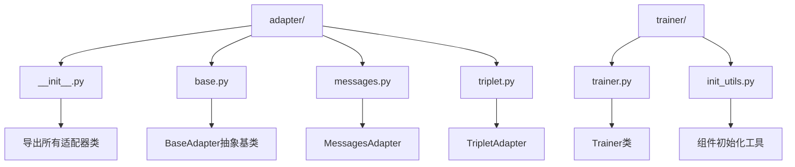
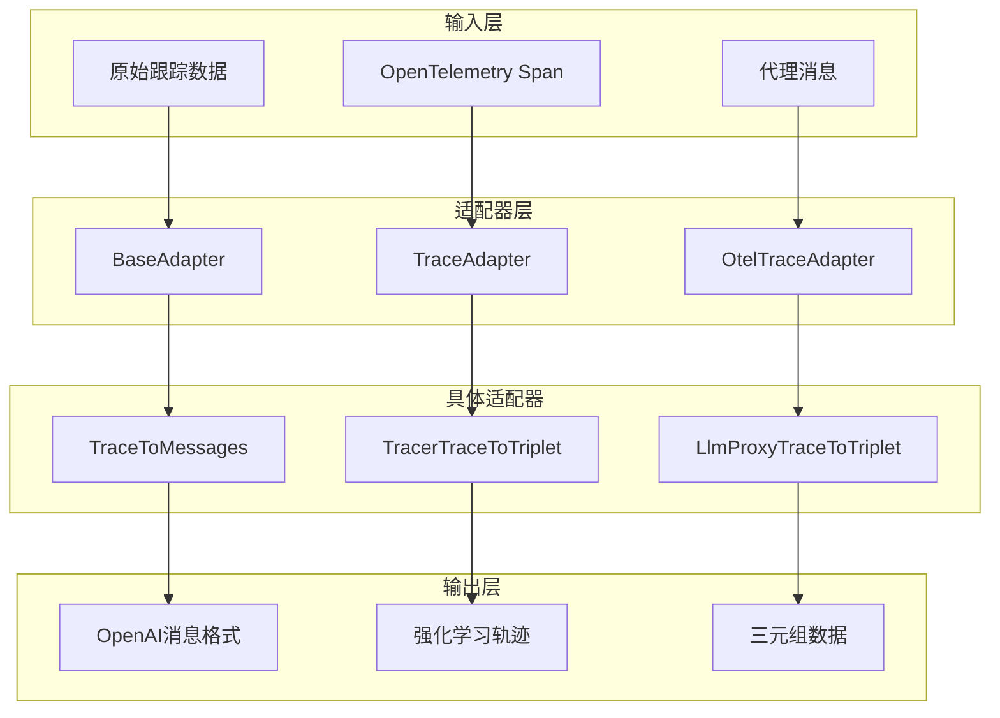
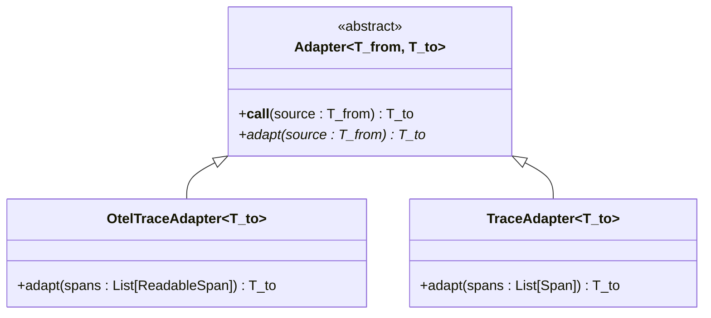
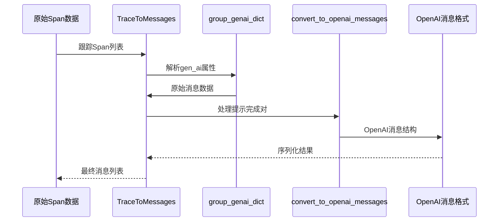
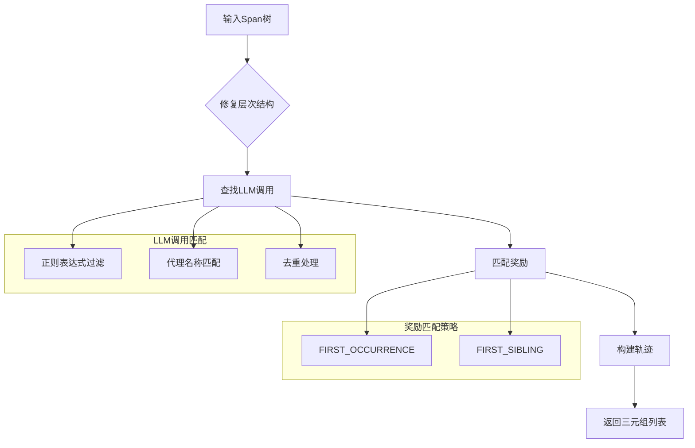
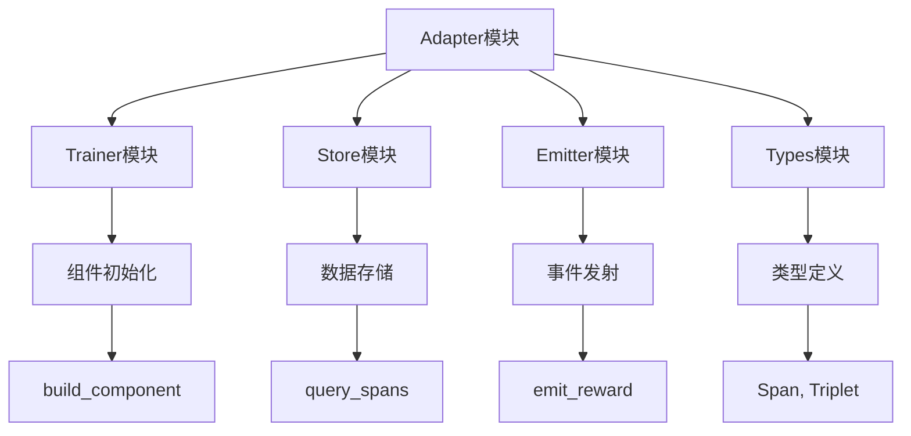

# Adapter模块

<cite>
**本文档中引用的文件**
- [agentlightning/adapter/__init__.py](file://agentlightning/adapter/__init__.py)
- [agentlightning/adapter/base.py](file://agentlightning/adapter/base.py)
- [agentlightning/adapter/messages.py](file://agentlightning/adapter/messages.py)
- [agentlightning/adapter/triplet.py](file://agentlightning/adapter/triplet.py)
- [agentlightning/trainer/trainer.py](file://agentlightning/trainer/trainer.py)
- [agentlightning/trainer/init_utils.py](file://agentlightning/trainer/init_utils.py)
- [tests/adapter/test_messages_adapter.py](file://tests/adapter/test_messages_adapter.py)
- [tests/trainer/test_trainer_init.py](file://tests/trainer/test_trainer_init.py)
</cite>

## 目录
1. [简介](#简介)
2. [项目结构](#项目结构)
3. [核心组件](#核心组件)
4. [架构概览](#架构概览)
5. [详细组件分析](#详细组件分析)
6. [依赖关系分析](#依赖关系分析)
7. [性能考虑](#性能考虑)
8. [故障排除指南](#故障排除指南)
9. [结论](#结论)

## 简介

Adapter模块是Agent Lightning框架中的核心数据转换和协议适配层，负责在不同系统间进行数据格式转换和协议适配。该模块提供了统一的接口来处理来自各种代理框架和数据源的跟踪数据，并将其转换为算法可消费的标准化格式。

Adapter模块的主要职责包括：
- 将跟踪数据从原始格式转换为标准化的三元组格式（提示-响应-奖励）
- 处理代理消息的序列化与反序列化
- 支持多种数据格式和协议的适配
- 提供灵活的扩展机制以支持新的代理框架

## 项目结构

Adapter模块采用分层设计，包含以下核心文件：



**图表来源**
- [agentlightning/adapter/__init__.py](file://agentlightning/adapter/__init__.py#L1-L16)
- [agentlightning/adapter/base.py](file://agentlightning/adapter/base.py#L1-L95)
- [agentlightning/adapter/messages.py](file://agentlightning/adapter/messages.py#L1-L271)
- [agentlightning/adapter/triplet.py](file://agentlightning/adapter/triplet.py#L1-L879)

**章节来源**
- [agentlightning/adapter/__init__.py](file://agentlightning/adapter/__init__.py#L1-L16)

## 核心组件

Adapter模块包含三个主要的适配器类型：

### BaseAdapter抽象基类
BaseAdapter是所有适配器的基础抽象类，定义了统一的数据转换接口。它采用泛型设计，支持类型安全的数据转换。

### MessagesAdapter
专门处理代理消息的序列化与反序列化，将跟踪数据转换为OpenAI兼容的消息格式，用于模型微调和训练。

### TripletAdapter
负责构建提示-响应-奖励三元组，这是强化学习训练的核心数据结构。

**章节来源**
- [agentlightning/adapter/base.py](file://agentlightning/adapter/base.py#L10-L95)
- [agentlightning/adapter/messages.py](file://agentlightning/adapter/messages.py#L250-L271)
- [agentlightning/adapter/triplet.py](file://agentlightning/adapter/triplet.py#L600-L620)

## 架构概览

Adapter模块采用插件化架构，通过统一的接口实现不同类型数据格式之间的转换：



**图表来源**
- [agentlightning/adapter/base.py](file://agentlightning/adapter/base.py#L10-L50)
- [agentlightning/adapter/messages.py](file://agentlightning/adapter/messages.py#L250-L271)
- [agentlightning/adapter/triplet.py](file://agentlightning/adapter/triplet.py#L600-L650)

## 详细组件分析

### BaseAdapter抽象基类设计

BaseAdapter采用函数式编程风格，通过`__call__`方法提供类似函数的调用体验，同时保持类型安全的泛型接口。



**图表来源**
- [agentlightning/adapter/base.py](file://agentlightning/adapter/base.py#L10-L95)

#### 设计原理

1. **泛型设计**：使用TypeVar实现类型安全的数据转换
2. **函数式接口**：通过`__call__`方法提供简洁的调用语法
3. **抽象约束**：强制子类实现具体的转换逻辑

#### 扩展方式

开发者可以通过继承BaseAdapter来创建自定义适配器：

```python
class CustomAdapter(Adapter[InputType, OutputType]):
    def adapt(self, source: InputType) -> OutputType:
        # 实现自定义转换逻辑
        pass
```

**章节来源**
- [agentlightning/adapter/base.py](file://agentlightning/adapter/base.py#L10-L95)

### MessagesAdapter详细分析

MessagesAdapter负责将跟踪数据转换为OpenAI兼容的消息格式，支持工具调用和函数定义的完整序列化。



**图表来源**
- [agentlightning/adapter/messages.py](file://agentlightning/adapter/messages.py#L250-L271)
- [agentlightning/adapter/messages.py](file://agentlightning/adapter/messages.py#L80-L120)

#### 核心功能

1. **属性解析**：使用`group_genai_dict`函数将扁平化的跟踪属性重组为嵌套结构
2. **工具调用处理**：支持多工具调用场景和工具响应的正确序列化
3. **消息格式转换**：将内部表示转换为OpenAI Functions格式

#### 数据流处理

MessagesAdapter通过以下步骤处理数据：

1. **属性分组**：将`gen_ai.prompt`、`gen_ai.completion`等属性重组为结构化数据
2. **工具提取**：从子Span中提取工具调用信息
3. **消息构建**：按照OpenAI格式构建对话消息
4. **工具定义**：生成函数调用规范

**章节来源**
- [agentlightning/adapter/messages.py](file://agentlightning/adapter/messages.py#L80-L200)
- [agentlightning/adapter/messages.py](file://agentlightning/adapter/messages.py#L250-L271)

### TripletAdapter详细分析

TripletAdapter是最复杂的适配器，负责构建强化学习训练所需的提示-响应-奖励三元组。



**图表来源**
- [agentlightning/adapter/triplet.py](file://agentlightning/adapter/triplet.py#L600-L650)
- [agentlightning/adapter/triplet.py](file://agentlightning/adapter/triplet.py#L400-L500)

#### 核心算法

1. **Span树构建**：使用`TraceTree.from_spans`方法构建层次化的Span树
2. **LLM调用识别**：通过正则表达式匹配和代理名称过滤识别LLM调用
3. **奖励匹配**：支持两种奖励匹配策略：首次出现和首个兄弟节点
4. **轨迹生成**：将匹配的Span转换为标准化的三元组格式

#### 高级特性

- **层次结构修复**：自动修复混合跟踪系统的缺失父子关系
- **智能去重**：基于响应ID的重复检测和去重
- **灵活匹配**：支持正则表达式和代理名称的组合匹配
- **可视化支持**：提供Graphviz可视化调试功能

**章节来源**
- [agentlightning/adapter/triplet.py](file://agentlightning/adapter/triplet.py#L200-L400)
- [agentlightning/adapter/triplet.py](file://agentlightning/adapter/triplet.py#L600-L700)

## 依赖关系分析

Adapter模块与系统其他部分存在密切的依赖关系：



**图表来源**
- [agentlightning/trainer/trainer.py](file://agentlightning/trainer/trainer.py#L1-L50)
- [agentlightning/trainer/init_utils.py](file://agentlightning/trainer/init_utils.py#L1-L50)

### 与Trainer的数据交互

Trainer模块通过统一的接口管理适配器的生命周期：

1. **初始化**：使用`build_component`函数动态创建适配器实例
2. **配置**：支持字符串路径、字典配置等多种初始化方式
3. **注入**：将适配器注入到算法和运行器中

### 与Store的数据交互

Store模块提供适配器所需的数据源：

1. **数据查询**：适配器调用`store.query_spans`获取跟踪数据
2. **数据转换**：将原始Span数据转换为适配器可用格式
3. **错误处理**：处理数据缺失和格式不匹配的情况

**章节来源**
- [agentlightning/trainer/trainer.py](file://agentlightning/trainer/trainer.py#L100-L200)
- [agentlightning/trainer/init_utils.py](file://agentlightning/trainer/init_utils.py#L137-L177)

## 性能考虑

Adapter模块在设计时充分考虑了性能优化：

### 内存效率
- 使用生成器模式处理大量Span数据
- 延迟加载和按需解析
- 及时释放中间计算结果

### 计算优化
- 正则表达式预编译
- 缓存频繁访问的计算结果
- 批量处理减少函数调用开销

### 并发支持
- 支持异步操作
- 非阻塞的数据处理
- 合理的并发度控制

## 故障排除指南

### 常见问题及解决方案

#### 适配器初始化失败
**症状**：适配器无法正确创建或配置
**原因**：参数格式错误或依赖缺失
**解决方案**：
- 检查配置字典的`type`字段
- 验证导入路径的正确性
- 确认所有必需参数已提供

#### 数据转换错误
**症状**：适配器抛出类型错误或值错误
**原因**：输入数据格式不符合预期
**解决方案**：
- 验证Span数据的完整性
- 检查gen_ai属性的存在性和格式
- 确认代理框架的兼容性

#### 性能问题
**症状**：适配器处理速度慢或内存占用高
**原因**：数据量过大或算法复杂度过高
**解决方案**：
- 启用数据采样和批处理
- 优化正则表达式匹配
- 使用更高效的数据结构

### 调试技巧

1. **启用详细日志**：设置适当的日志级别查看详细执行信息
2. **使用可视化工具**：利用`TraceTree.visualize`方法调试Span树结构
3. **单元测试验证**：编写针对性的单元测试验证特定场景
4. **性能分析**：使用性能分析工具识别瓶颈

**章节来源**
- [tests/adapter/test_messages_adapter.py](file://tests/adapter/test_messages_adapter.py#L353-L392)
- [agentlightning/adapter/triplet.py](file://agentlightning/adapter/triplet.py#L150-L200)

## 结论

Adapter模块是Agent Lightning框架中的关键基础设施，通过提供统一的数据转换接口，实现了不同代理框架和数据格式之间的无缝集成。其模块化设计、类型安全的接口和丰富的扩展能力，使得开发者能够轻松地将新的代理框架和数据源集成到训练流水线中。

### 主要优势

1. **统一接口**：提供一致的适配器接口，简化集成复杂度
2. **类型安全**：基于泛型的类型系统确保编译时类型检查
3. **灵活扩展**：支持自定义适配器开发和第三方框架集成
4. **高性能**：优化的数据处理算法和内存管理
5. **易于调试**：内置的可视化和诊断工具

### 发展方向

随着Agent Lightning生态系统的不断发展，Adapter模块将继续演进以支持更多类型的代理框架和数据格式。未来的改进可能包括：

- 更多内置适配器的支持
- 实时数据流处理能力
- 分布式适配器集群
- 自动化适配器发现和配置

通过深入理解和合理使用Adapter模块，开发者可以构建更加灵活和强大的代理训练系统，推动人工智能代理技术的发展和应用。