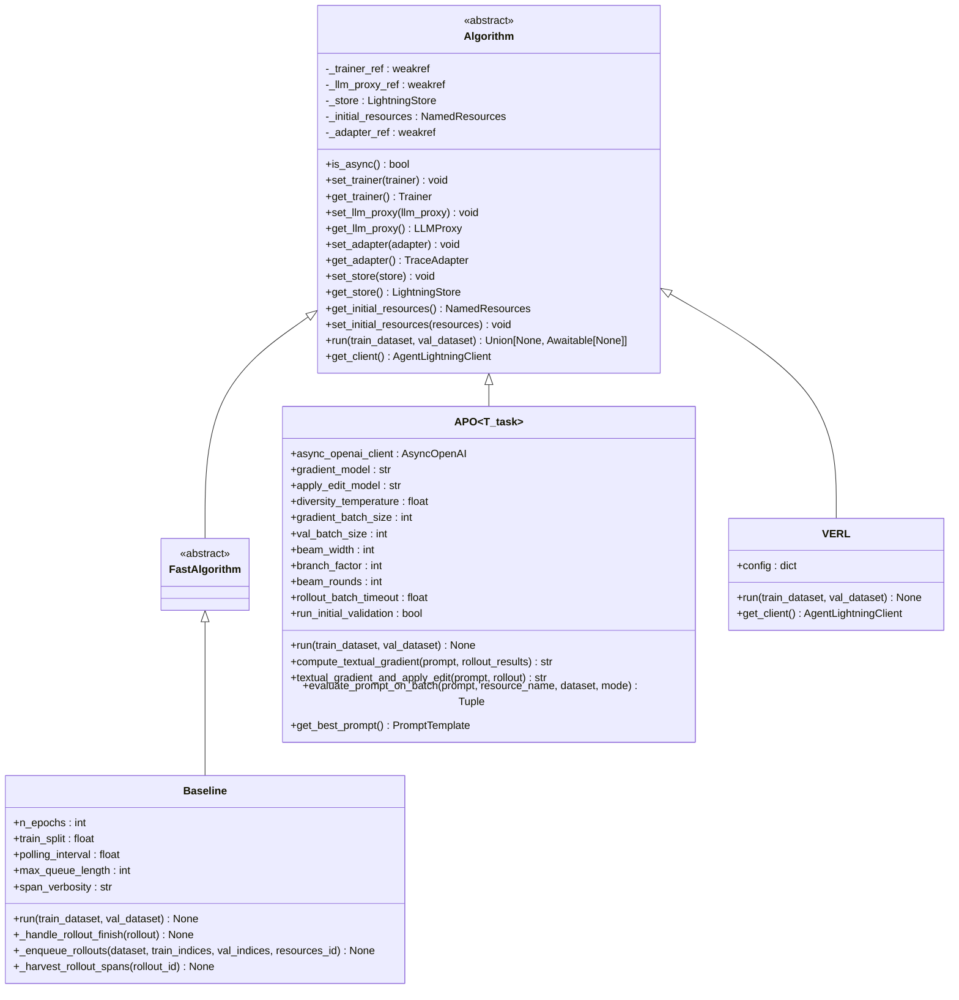
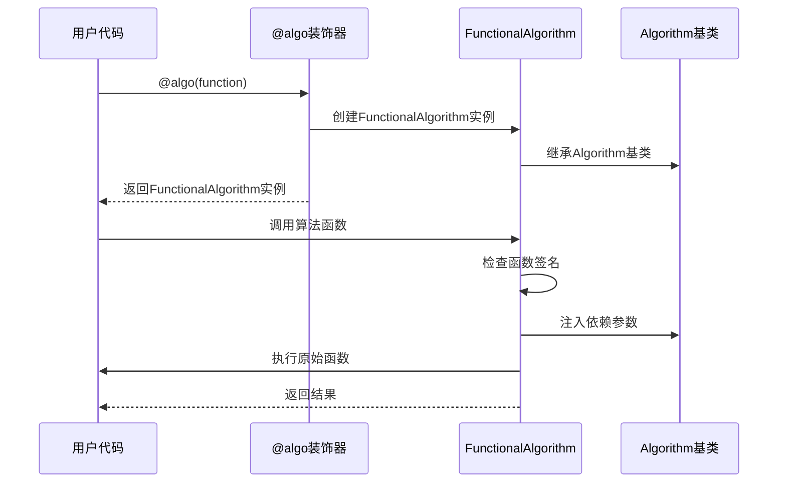
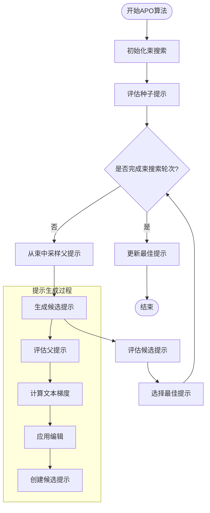
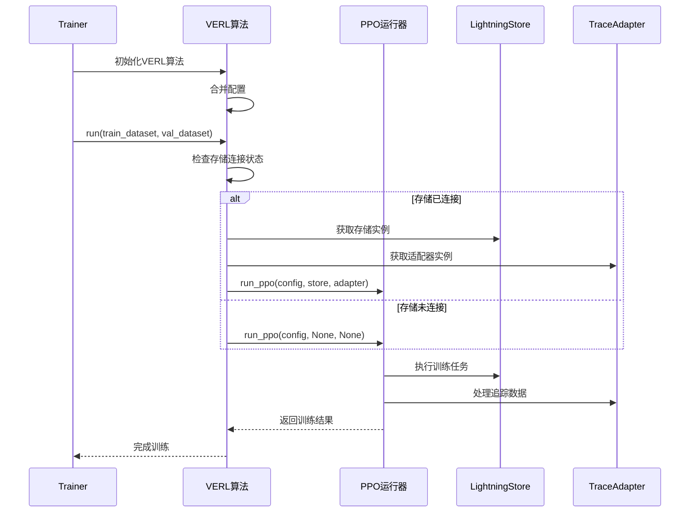
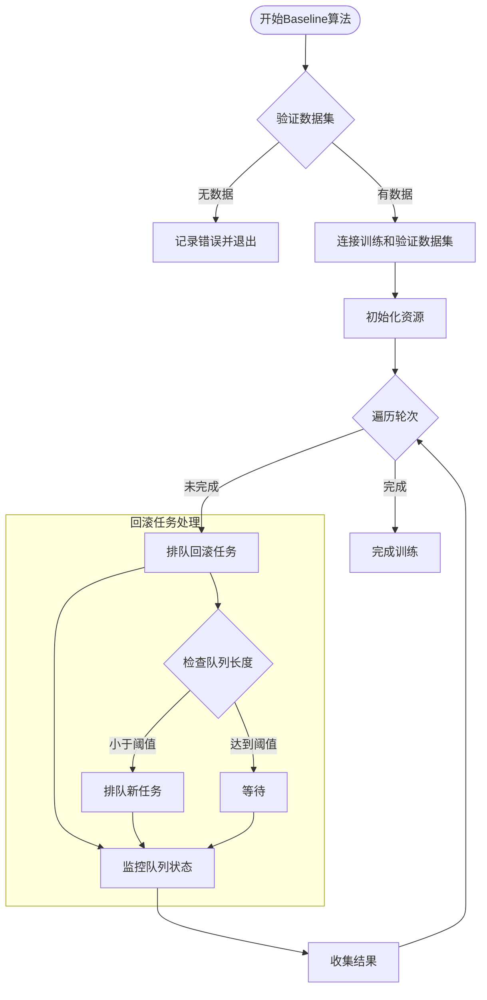
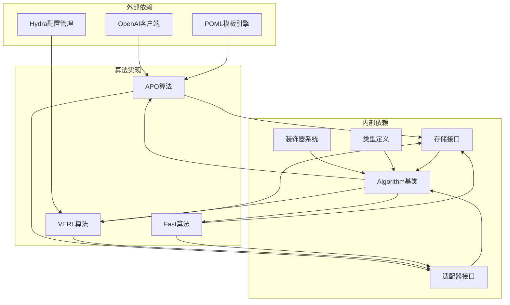

# Algorithm模块

<cite>
**本文档中引用的文件**
- [base.py](file://agentlightning/algorithm/base.py)
- [decorator.py](file://agentlightning/algorithm/decorator.py)
- [fast.py](file://agentlightning/algorithm/fast.py)
- [apo.py](file://agentlightning/algorithm/apo/apo.py)
- [interface.py](file://agentlightning/algorithm/verl/interface.py)
- [__init__.py](file://agentlightning/algorithm/__init__.py)
- [trainer.py](file://agentlightning/trainer/trainer.py)
- [apo_custom_algorithm.py](file://examples/apo/apo_custom_algorithm.py)
- [apo_custom_algorithm_trainer.py](file://examples/apo/apo_custom_algorithm_trainer.py)
</cite>

## 目录
1. [简介](#简介)
2. [项目结构](#项目结构)
3. [核心组件](#核心组件)
4. [架构概览](#架构概览)
5. [详细组件分析](#详细组件分析)
6. [依赖关系分析](#依赖关系分析)
7. [性能考虑](#性能考虑)
8. [故障排除指南](#故障排除指南)
9. [结论](#结论)

## 简介

Algorithm模块是Agent-Lightning框架的核心训练算法组件，提供了统一的算法接口规范和多种先进的训练算法实现。该模块采用面向对象的设计模式，通过BaseAlgorithm抽象类定义了标准的算法接口，并实现了APO（自动提示优化）和VERL（向量增强强化学习）等核心算法。

模块的主要特性包括：
- 统一的算法接口规范和生命周期管理
- 高性能算法执行路径优化
- 动态算法注册与加载机制
- 算法与Trainer模块的无缝集成
- 完整的异常处理和资源管理

## 项目结构

Algorithm模块采用分层架构设计，主要包含以下组件：

```mermaid
graph TB
subgraph "Algorithm模块结构"
Base[BaseAlgorithm抽象类]
Decorator[@algorithm装饰器]
Fast[高性能算法]
APO[APO算法实现]
VERL[VERL算法接口]
Base --> Fast
Base --> APO
Base --> VERL
Decorator --> Base
subgraph "支持组件"
Store[LightningStore]
Adapter[TraceAdapter]
LLMProxy[LLM代理]
end
Fast --> Store
APO --> Store
VERL --> Store
Fast --> Adapter
APO --> Adapter
VERL --> Adapter
end
```

**图表来源**
- [base.py](file://agentlightning/algorithm/base.py#L1-L163)
- [decorator.py](file://agentlightning/algorithm/decorator.py#L1-L265)
- [fast.py](file://agentlightning/algorithm/fast.py#L1-L242)

**章节来源**
- [base.py](file://agentlightning/algorithm/base.py#L1-L163)
- [decorator.py](file://agentlightning/algorithm/decorator.py#L1-L265)
- [fast.py](file://agentlightning/algorithm/fast.py#L1-L242)

## 核心组件

### BaseAlgorithm抽象类

BaseAlgorithm是所有算法的基础抽象类，定义了算法的标准接口和生命周期管理机制：



**图表来源**
- [base.py](file://agentlightning/algorithm/base.py#L25-L163)
- [fast.py](file://agentlightning/algorithm/fast.py#L15-L242)
- [apo.py](file://agentlightning/algorithm/apo/apo.py#L80-L200)
- [interface.py](file://agentlightning/algorithm/verl/interface.py#L10-L153)

### @algorithm装饰器系统

@algorithm装饰器提供了灵活的算法注册和动态加载机制：



**图表来源**
- [decorator.py](file://agentlightning/algorithm/decorator.py#L150-L265)

**章节来源**
- [base.py](file://agentlightning/algorithm/base.py#L25-L163)
- [decorator.py](file://agentlightning/algorithm/decorator.py#L150-L265)

## 架构概览

Algorithm模块采用插件化架构设计，支持多种算法类型的统一管理和执行：

```mermaid
graph LR
subgraph "Trainer模块"
Trainer[Trainer]
Strategy[ExecutionStrategy]
end
subgraph "Algorithm模块"
Base[Algorithm基类]
Decorator[@algo装饰器]
Fast[FastAlgorithm]
APO[APO算法]
VERL[VERL算法]
end
subgraph "基础设施"
Store[LightningStore]
Adapter[TraceAdapter]
LLMProxy[LLMProxy]
end
Trainer --> Strategy
Strategy --> Base
Base --> Fast
Base --> APO
Base --> VERL
Decorator --> Base
Fast --> Store
APO --> Store
VERL --> Store
Fast --> Adapter
APO --> Adapter
VERL --> Adapter
Fast --> LLMProxy
APO --> LLMProxy
VERL --> LLMProxy
```

**图表来源**
- [trainer.py](file://agentlightning/trainer/trainer.py#L30-L100)
- [base.py](file://agentlightning/algorithm/base.py#L25-L80)

## 详细组件分析

### APO（自动提示优化）算法

APO算法实现了基于文本梯度的自动提示优化机制，采用束搜索策略进行迭代优化：

#### 核心算法流程



**图表来源**
- [apo.py](file://agentlightning/algorithm/apo/apo.py#L700-L898)

#### 关键配置参数

| 参数名称 | 类型 | 默认值 | 描述 |
|---------|------|--------|------|
| gradient_model | str | "gpt-5-mini" | 计算文本梯度的模型 |
| apply_edit_model | str | "gpt-4.1-mini" | 应用编辑的模型 |
| diversity_temperature | float | 1.0 | 控制LLM调用多样性的温度参数 |
| gradient_batch_size | int | 4 | 梯度计算的批处理大小 |
| val_batch_size | int | 16 | 验证集评估的批处理大小 |
| beam_width | int | 4 | 束搜索宽度 |
| branch_factor | int | 4 | 分支因子 |
| beam_rounds | int | 3 | 束搜索轮次 |
| rollout_batch_timeout | float | 3600.0 | 回滚批处理超时时间 |

**章节来源**
- [apo.py](file://agentlightning/algorithm/apo/apo.py#L80-L200)

### VERL（向量增强强化学习）算法

VERL算法通过委托训练到VERL PPO运行器来实现高级强化学习功能：

#### VERL集成架构



**图表来源**
- [interface.py](file://agentlightning/algorithm/verl/interface.py#L80-L153)

#### 配置参数结构

VERL算法接受类似于VERL CLI的配置字典，支持深度定制：

```python
config = {
    "algorithm": {
        "adv_estimator": "grpo",
        "use_kl_in_reward": False,
    },
    "data": {
        "train_batch_size": 32,
        "max_prompt_length": 4096,
        "max_response_length": 2048,
    },
    "actor_rollout_ref": {
        "rollout": {
            "tensor_model_parallel_size": 1,
            "n": 4,
            "log_prob_micro_batch_size_per_gpu": 4,
            "multi_turn": {"format": "hermes"},
            "name": "vllm",
            "gpu_memory_utilization": 0.6,
        },
        "actor": {
            "ppo_mini_batch_size": 32,
            "ppo_micro_batch_size_per_gpu": 4,
            "optim": {"lr": 1e-6},
            "use_kl_loss": False,
            "kl_loss_coef": 0.0,
            "entropy_coeff": 0,
            "clip_ratio_low": 0.2,
            "clip_ratio_high": 0.3,
            "fsdp_config": {
                "param_offload": True,
                "optimizer_offload": True,
            },
        },
    },
}
```

**章节来源**
- [interface.py](file://agentlightning/algorithm/verl/interface.py#L10-L153)

### FastAlgorithm高性能执行路径

FastAlgorithm及其子类Baseline提供了针对开发工作流优化的轻量级算法实现：

#### Baseline算法执行流程



**图表来源**
- [fast.py](file://agentlightning/algorithm/fast.py#L180-L242)

#### 性能优化策略

Baseline算法采用了多项性能优化策略：

1. **队列长度控制**：通过`max_queue_length`参数限制并发回滚任务数量
2. **批量处理**：使用`polling_interval`参数控制轮询间隔
3. **异步处理**：完全异步的执行模型，避免阻塞
4. **资源管理**：智能的资源分配和回收机制

**章节来源**
- [fast.py](file://agentlightning/algorithm/fast.py#L15-L242)

### 自定义算法开发示例

以下是自定义算法开发的完整示例，展示了如何实现符合Algorithm接口规范的算法：

#### 基础算法实现

```python
from agentlightning.algorithm.decorator import algo
from agentlightning.types import Dataset, NamedResources, PromptTemplate

@algo
async def custom_algorithm(*, store: LightningStore, train_dataset: Dataset, val_dataset: Dataset) -> None:
    """自定义算法实现示例"""
    
    # 1. 设置初始资源
    initial_resources: NamedResources = {
        "custom_prompt": PromptTemplate(template="你是一个有用的助手。{question}", engine="f-string")
    }
    await store.update_resources("initial", initial_resources)
    
    # 2. 遍历训练数据集
    for i, sample in enumerate(train_dataset):
        # 3. 排队回滚任务
        rollout = await store.enqueue_rollout(
            input=sample,
            mode="train",
            resources_id="initial"
        )
        
        # 4. 等待任务完成
        completed_rollouts = await store.wait_for_rollouts(
            rollout_ids=[rollout.rollout_id],
            timeout=30.0
        )
        
        # 5. 处理结果
        if completed_rollouts:
            spans = await store.query_spans(completed_rollouts[0].rollout_id)
            final_reward = calculate_reward(spans)
            
            # 6. 更新最佳资源
            if final_reward > current_best_reward:
                new_resources: NamedResources = {
                    "custom_prompt": PromptTemplate(
                        template=f"改进后的提示：{improved_prompt}",
                        engine="f-string"
                    )
                }
                await store.update_resources("current", new_resources)
```

#### 算法与Trainer集成

```python
from agentlightning import Trainer, configure_logger

# 创建自定义算法
custom_algorithm_decorated = algo(custom_algorithm)

# 配置并运行Trainer
trainer = Trainer(
    n_workers=4,
    algorithm=custom_algorithm_decorated
)

# 开始训练
trainer.fit(
    agent=your_agent,
    train_dataset=training_data,
    val_dataset=validation_data
)
```

**章节来源**
- [apo_custom_algorithm.py](file://examples/apo/apo_custom_algorithm.py#L30-L100)
- [apo_custom_algorithm_trainer.py](file://examples/apo/apo_custom_algorithm_trainer.py#L20-L45)

## 依赖关系分析

Algorithm模块与其他核心组件之间的依赖关系：



**图表来源**
- [apo.py](file://agentlightning/algorithm/apo/apo.py#L1-L50)
- [interface.py](file://agentlightning/algorithm/verl/interface.py#L1-L20)
- [base.py](file://agentlightning/algorithm/base.py#L1-L30)

**章节来源**
- [apo.py](file://agentlightning/algorithm/apo/apo.py#L1-L50)
- [interface.py](file://agentlightning/algorithm/verl/interface.py#L1-L20)
- [base.py](file://agentlightning/algorithm/base.py#L1-L30)

## 性能考虑

### 算法性能优化策略

1. **异步执行**：所有算法都支持异步执行，避免I/O阻塞
2. **资源池化**：通过弱引用管理资源，减少内存占用
3. **批处理优化**：支持批量数据处理，提高吞吐量
4. **缓存机制**：智能缓存中间结果，减少重复计算

### 内存管理

- 使用弱引用避免循环引用导致的内存泄漏
- 及时清理临时资源和中间结果
- 支持大容量数据集的流式处理

### 并发控制

- 通过队列长度控制并发度
- 支持多进程和分布式执行
- 提供优雅的停止和恢复机制

## 故障排除指南

### 常见问题及解决方案

#### 算法初始化失败

**问题症状**：算法无法正确初始化或设置依赖

**解决方案**：
1. 检查`initial_resources`是否正确设置
2. 验证`store`、`adapter`等依赖是否已正确注入
3. 确认算法参数配置的完整性

#### APO算法性能问题

**问题症状**：APO算法运行缓慢或内存占用过高

**解决方案**：
1. 调整`gradient_batch_size`和`val_batch_size`参数
2. 优化`beam_width`和`branch_factor`配置
3. 检查网络连接和API调用频率限制

#### VERL算法配置错误

**问题症状**：VERL算法启动失败或训练异常

**解决方案**：
1. 验证配置字典的结构和参数有效性
2. 检查所需的第三方库版本兼容性
3. 确认存储和适配器的连接状态

### 调试技巧

1. **启用详细日志**：设置适当的日志级别以获取详细的执行信息
2. **监控资源使用**：定期检查CPU、内存和网络使用情况
3. **性能分析**：使用内置的计时器和指标收集功能
4. **单元测试**：为自定义算法编写全面的单元测试

**章节来源**
- [apo.py](file://agentlightning/algorithm/apo/apo.py#L200-L300)
- [fast.py](file://agentlightning/algorithm/fast.py#L100-L150)

## 结论

Algorithm模块为Agent-Lightning框架提供了强大而灵活的算法训练能力。通过统一的接口设计、丰富的算法实现和完善的工具链支持，开发者可以轻松地扩展和定制自己的训练算法。

### 主要优势

1. **统一接口**：BaseAlgorithm抽象类提供了标准化的算法接口
2. **灵活扩展**：@algorithm装饰器支持函数式和类式的算法实现
3. **高性能**：FastAlgorithm系列提供了针对不同场景的优化实现
4. **易于集成**：与Trainer模块无缝集成，简化了算法部署流程
5. **可扩展性**：支持自定义算法的快速开发和部署

### 最佳实践建议

1. **选择合适的算法**：根据具体需求选择最适合的算法实现
2. **合理配置参数**：根据硬件资源和数据特点调整算法参数
3. **监控性能指标**：建立完善的性能监控和日志记录机制
4. **测试和验证**：在生产环境部署前充分测试算法稳定性
5. **持续优化**：根据实际运行情况不断优化算法配置和实现

通过深入理解和正确使用Algorithm模块，开发者可以构建出高效、稳定且可扩展的智能体训练系统。