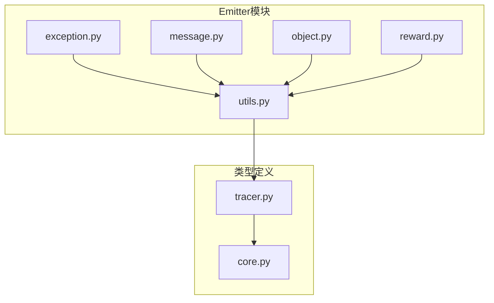
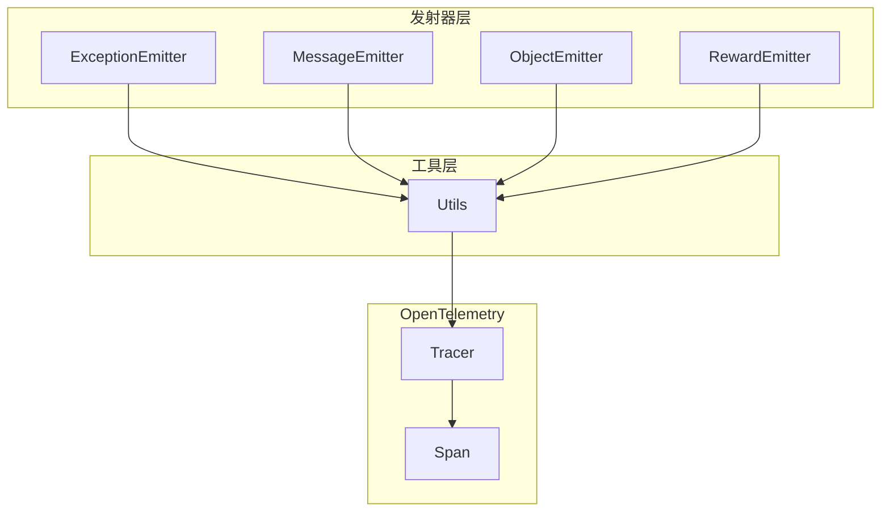
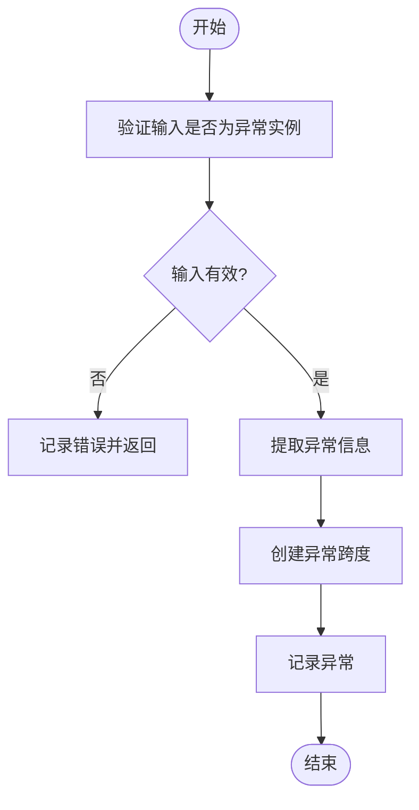
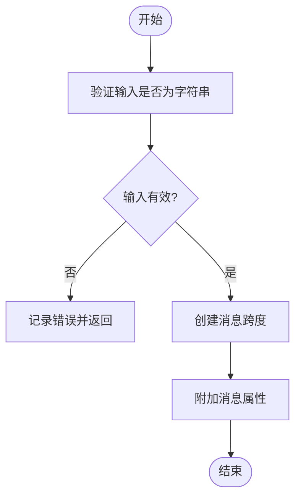
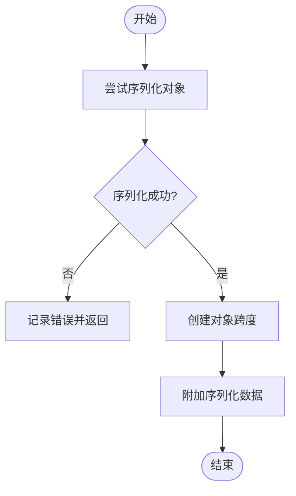
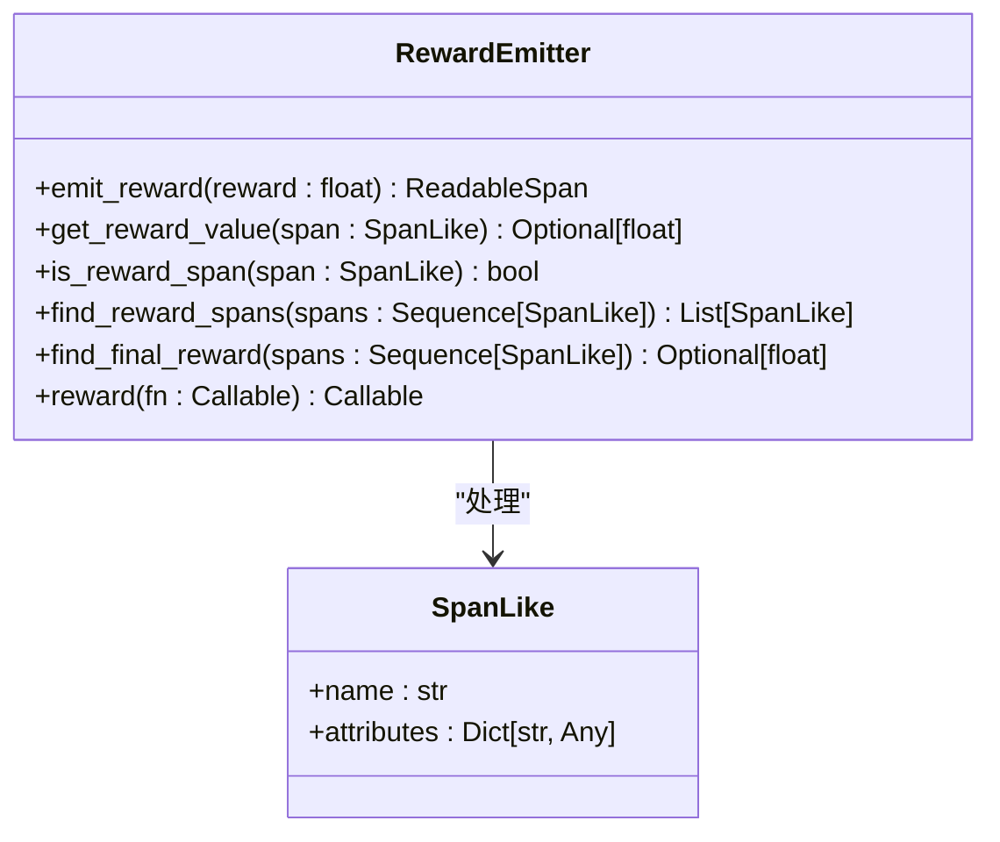
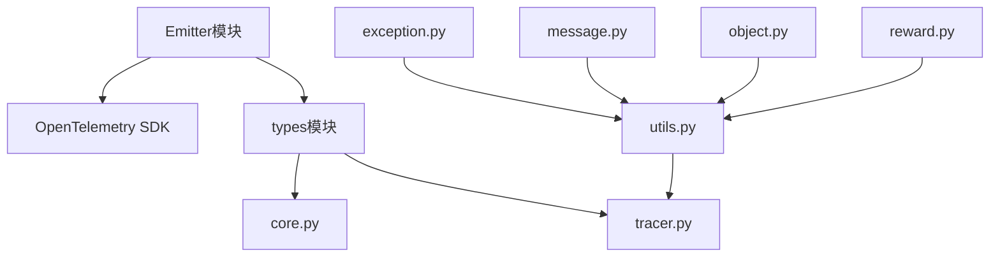

# Emitter模块

<cite>
**本文档中引用的文件**   
- [exception.py](file://agentlightning/emitter/exception.py)
- [message.py](file://agentlightning/emitter/message.py)
- [object.py](file://agentlightning/emitter/object.py)
- [reward.py](file://agentlightning/emitter/reward.py)
- [utils.py](file://agentlightning/emitter/utils.py)
- [core.py](file://agentlightning/types/core.py)
- [tracer.py](file://agentlightning/types/tracer.py)
- [shared_memory.py](file://agentlightning/execution/shared_memory.py)
</cite>

## 目录
1. [引言](#引言)
2. [项目结构](#项目结构)
3. [核心组件](#核心组件)
4. [架构概述](#架构概述)
5. [详细组件分析](#详细组件分析)
6. [依赖分析](#依赖分析)
7. [性能考虑](#性能考虑)
8. [故障排除指南](#故障排除指南)
9. [结论](#结论)

## 引言
Emitter模块是Agent Lightning框架中事件驱动架构的核心组件，负责在代理执行过程中收集和发布关键信号。该模块通过OpenTelemetry标准实现事件发布-订阅机制，支持四种主要的发射器类型：ExceptionEmitter、MessageEmitter、ObjectEmitter和RewardEmitter。这些发射器分别用于记录异常、文本消息、序列化对象和奖励值，为训练过程提供必要的监控和分析数据。本文档将全面阐述Emitter模块的设计与实现，包括其内部工作原理、事件序列化格式、传输协议选择以及高级主题如事件流监控和故障恢复机制。

## 项目结构
Emitter模块位于`agentlightning/emitter/`目录下，包含多个专门化的发射器实现文件和一个公共工具模块。每个发射器文件负责特定类型的事件发射，而`utils.py`提供了共享的实用功能。该模块与`types`包中的核心数据模型紧密集成，特别是`SpanNames`和`SpanAttributeNames`枚举，用于标准化事件名称和属性。

**Diagram sources**
- [exception.py](file://agentlightning/emitter/exception.py#L1-L47)
- [message.py](file://agentlightning/emitter/message.py#L1-L34)
- [object.py](file://agentlightning/emitter/object.py#L1-L38)
- [reward.py](file://agentlightning/emitter/reward.py#L1-L239)
- [utils.py](file://agentlightning/emitter/utils.py#L1-L23)
- [tracer.py](file://agentlightning/types/tracer.py#L1-L427)
- [core.py](file://agentlightning/types/core.py#L1-L396)

**Section sources**
- [exception.py](file://agentlightning/emitter/exception.py#L1-L47)
- [message.py](file://agentlightning/emitter/message.py#L1-L34)
- [object.py](file://agentlightning/emitter/object.py#L1-L38)
- [reward.py](file://agentlightning/emitter/reward.py#L1-L239)
- [utils.py](file://agentlightning/emitter/utils.py#L1-L23)

## 核心组件
Emitter模块的核心组件包括四个专门化的发射器和一个公共工具模块。ExceptionEmitter负责记录异常信息，包括异常类型、消息和堆栈跟踪；MessageEmitter用于发射文本消息，保持所有遥测数据在单一数据存储中；ObjectEmitter将任意对象序列化为JSON格式并作为事件发射；RewardEmitter则专门处理奖励值的发射和解析，支持与AgentOps集成。这些组件通过`get_tracer`工具函数获取OpenTelemetry追踪器实例，确保事件能够正确地被收集和处理。

**Section sources**
- [exception.py](file://agentlightning/emitter/exception.py#L1-L47)
- [message.py](file://agentlightning/emitter/message.py#L1-L34)
- [object.py](file://agentlightning/emitter/object.py#L1-L38)
- [reward.py](file://agentlightning/emitter/reward.py#L1-L239)
- [utils.py](file://agentlightning/emitter/utils.py#L1-L23)

## 架构概述
Emitter模块采用分层架构设计，上层是四个专门化的发射器实现，下层是共享的工具模块。所有发射器都遵循相同的模式：验证输入、获取追踪器、创建带有特定名称和属性的跨度（span），然后在上下文中执行操作。这种设计确保了代码的可维护性和一致性。事件发布-订阅机制基于OpenTelemetry标准实现，允许事件在分布式系统中被可靠地传输和处理。

**Diagram sources**
- [exception.py](file://agentlightning/emitter/exception.py#L1-L47)
- [message.py](file://agentlightning/emitter/message.py#L1-L34)
- [object.py](file://agentlightning/emitter/object.py#L1-L38)
- [reward.py](file://agentlightning/emitter/reward.py#L1-L239)
- [utils.py](file://agentlightning/emitter/utils.py#L1-L23)

## 详细组件分析
### ExceptionEmitter分析
ExceptionEmitter负责将异常信息转换为OpenTelemetry跨度。它验证输入是否为异常实例，然后提取异常类型、消息和堆栈跟踪，将其作为属性附加到跨度中。这种设计确保了异常信息能够被完整地记录和分析。

**Diagram sources**
- [exception.py](file://agentlightning/emitter/exception.py#L1-L47)

### MessageEmitter分析
MessageEmitter将文本消息作为OpenTelemetry跨度发射。它验证输入是否为字符串，然后将消息作为属性附加到跨度中。这种设计保持了所有Agent Lightning遥测数据在单一数据存储中，便于分析。

**Diagram sources**
- [message.py](file://agentlightning/emitter/message.py#L1-L34)

### ObjectEmitter分析
ObjectEmitter将任意对象序列化为JSON格式并作为事件发射。它尝试将对象序列化为JSON，如果失败则记录错误。这种设计允许复杂数据结构被完整地记录和分析。

**Diagram sources**
- [object.py](file://agentlightning/emitter/object.py#L1-L38)

### RewardEmitter分析
RewardEmitter专门处理奖励值的发射和解析。它支持与AgentOps集成，提供装饰器模式来追踪奖励函数的输出。该组件还提供了一系列辅助函数来查找和解析奖励跨度。

**Diagram sources**
- [reward.py](file://agentlightning/emitter/reward.py#L1-L239)

## 依赖分析
Emitter模块依赖于OpenTelemetry SDK和Agent Lightning的类型系统。`utils.py`模块提供了获取追踪器的公共接口，确保所有发射器使用相同的配置。`types/tracer.py`中的`SpanNames`和`SpanAttributeNames`枚举为事件命名提供了标准化的基础。

**Diagram sources**
- [utils.py](file://agentlightning/emitter/utils.py#L1-L23)
- [tracer.py](file://agentlightning/types/tracer.py#L1-L427)
- [core.py](file://agentlightning/types/core.py#L1-L396)

**Section sources**
- [utils.py](file://agentlightning/emitter/utils.py#L1-L23)
- [tracer.py](file://agentlightning/types/tracer.py#L1-L427)
- [core.py](file://agentlightning/types/core.py#L1-L396)

## 性能考虑
Emitter模块的设计考虑了性能影响。所有发射器操作都是轻量级的，主要开销在于OpenTelemetry跨度的创建和序列化。对于高频率事件，建议使用批量处理或采样策略来减少性能影响。共享内存执行策略可以有效减少进程间通信开销，提高整体性能。

## 故障排除指南
当Emitter模块出现问题时，首先检查OpenTelemetry是否已正确初始化。未初始化的追踪器会导致运行时错误。其次，验证输入数据的类型是否符合预期，不正确的输入类型会被忽略并记录错误。对于奖励值处理，确保数值能够正确转换为浮点数。

**Section sources**
- [utils.py](file://agentlightning/emitter/utils.py#L1-L23)
- [reward.py](file://agentlightning/emitter/reward.py#L1-L239)

## 结论
Emitter模块作为Agent Lightning框架的事件驱动核心，提供了强大而灵活的事件收集和发布机制。通过标准化的发射器设计和OpenTelemetry集成，该模块能够有效地支持各种监控和分析需求。其分层架构和清晰的职责划分确保了代码的可维护性和扩展性，为构建可靠的代理系统提供了坚实的基础。