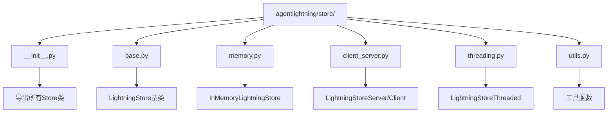
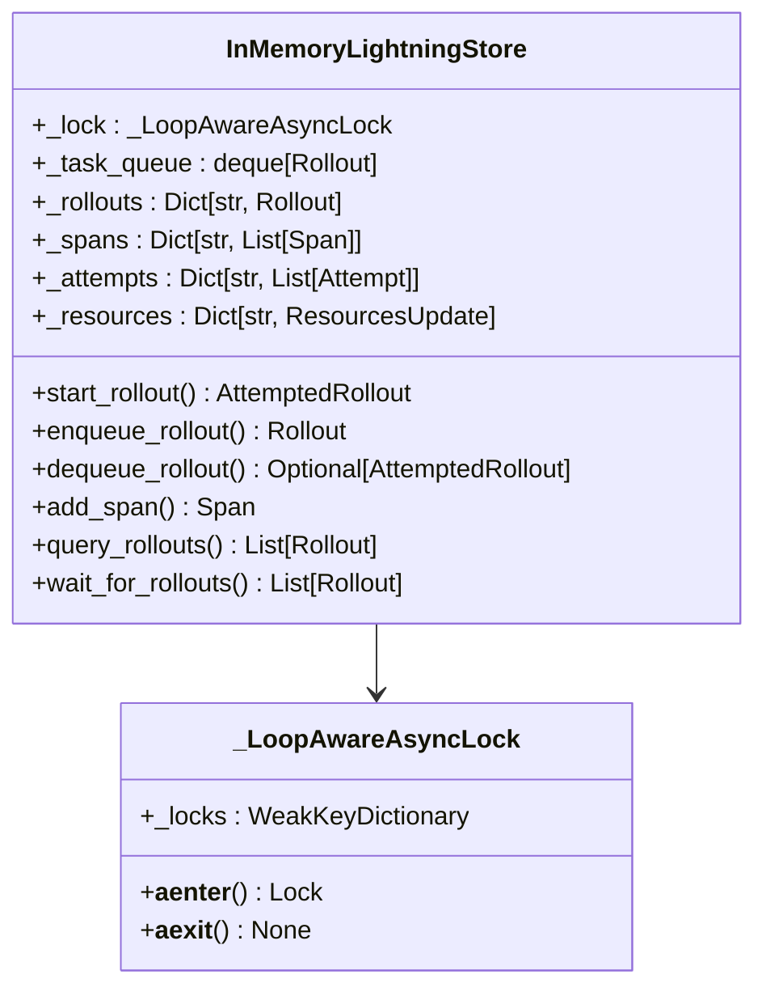
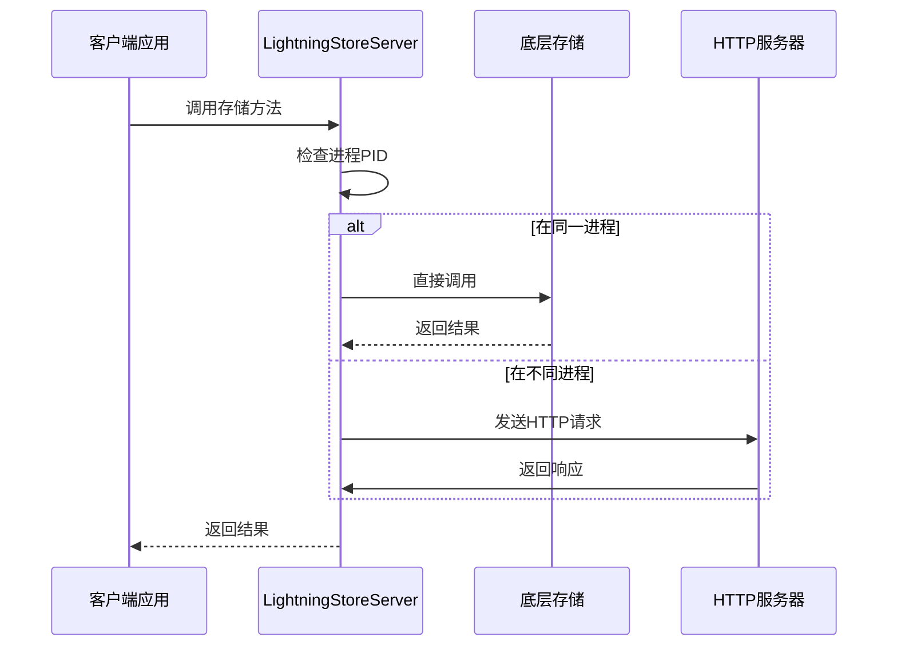
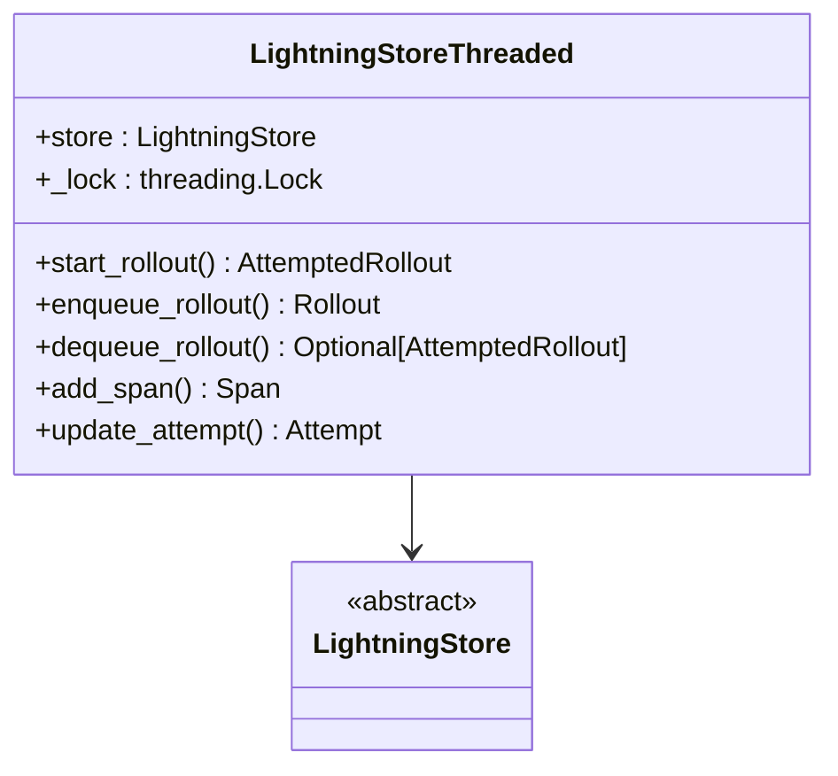
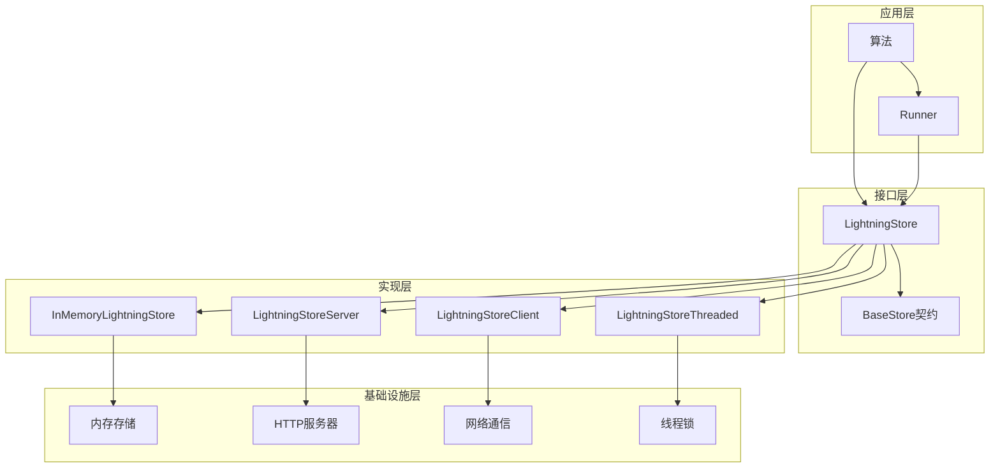
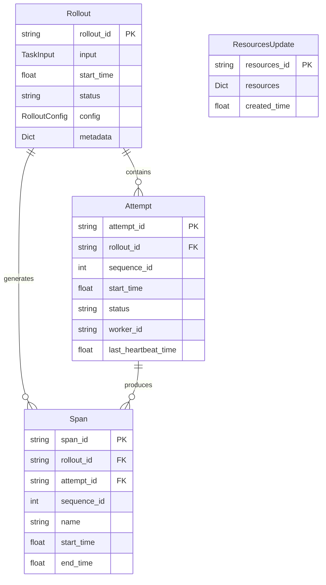
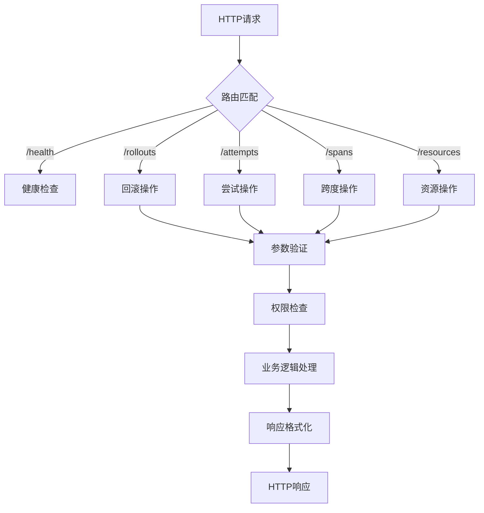
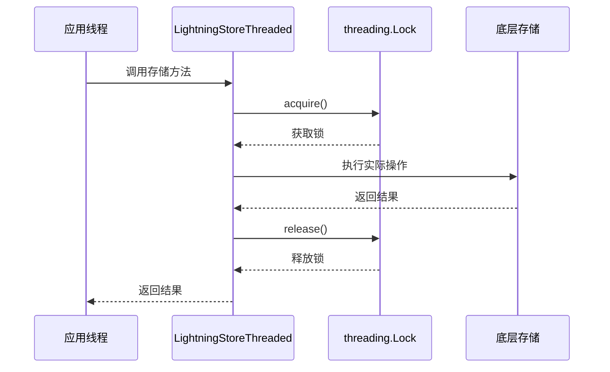
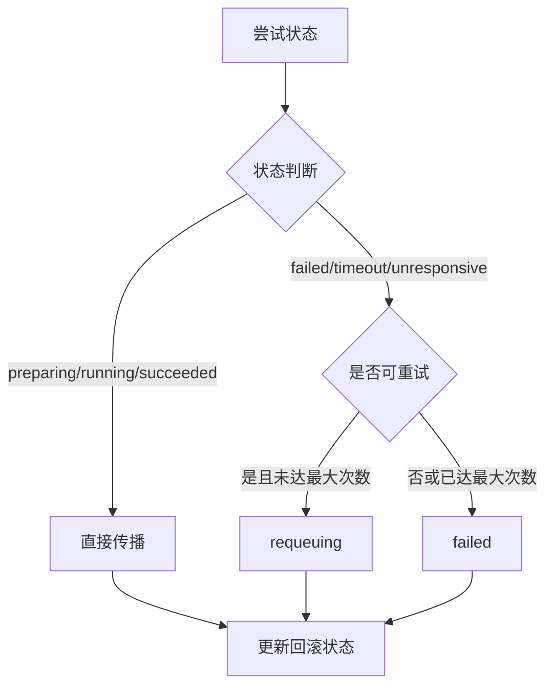
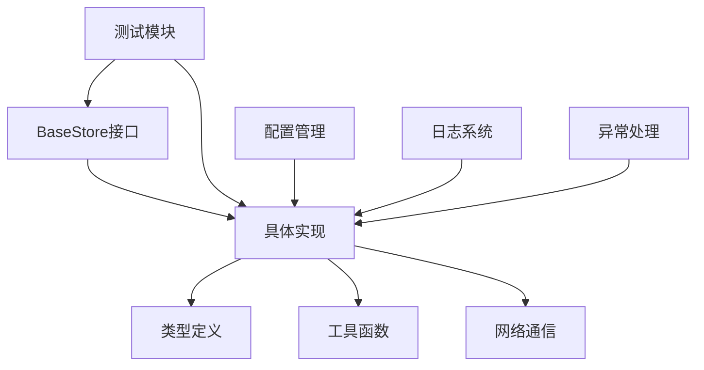

# Store模块技术文档

<cite>
**本文档中引用的文件**
- [agentlightning/store/__init__.py](file://agentlightning/store/__init__.py)
- [agentlightning/store/base.py](file://agentlightning/store/base.py)
- [agentlightning/store/memory.py](file://agentlightning/store/memory.py)
- [agentlightning/store/client_server.py](file://agentlightning/store/client_server.py)
- [agentlightning/store/threading.py](file://agentlightning/store/threading.py)
- [agentlightning/store/utils.py](file://agentlightning/store/utils.py)
- [agentlightning/types/core.py](file://agentlightning/types/core.py)
- [tests/store/test_memory.py](file://tests/store/test_memory.py)
- [tests/store/test_client_server.py](file://tests/store/test_client_server.py)
- [tests/store/test_threading.py](file://tests/store/test_threading.py)
</cite>

## 目录
1. [简介](#简介)
2. [项目结构](#项目结构)
3. [核心组件](#核心组件)
4. [架构概览](#架构概览)
5. [详细组件分析](#详细组件分析)
6. [依赖关系分析](#依赖关系分析)
7. [性能考虑](#性能考虑)
8. [故障排除指南](#故障排除指南)
9. [结论](#结论)

## 简介

Store模块是Agent Lightning系统的核心数据枢纽，负责协调算法与执行器之间的所有交互。该模块提供了统一的数据访问接口，支持多种存储后端，包括内存存储、持久化存储和分布式存储，确保在多线程和分布式环境下的数据一致性和可靠性。

Store模块的设计遵循了以下核心原则：
- **统一契约**：通过BaseStore抽象接口定义标准的CRUD操作契约
- **多后端支持**：提供内存、SQLite、客户端-服务器等多种存储实现
- **线程安全**：确保在并发环境下的数据一致性
- **可扩展性**：支持自定义存储实现和插件化架构

## 项目结构

Store模块采用模块化设计，主要包含以下核心文件：

**图表来源**
- [agentlightning/store/__init__.py](file://agentlightning/store/__init__.py#L1-L15)
- [agentlightning/store/base.py](file://agentlightning/store/base.py#L1-L50)

**章节来源**
- [agentlightning/store/__init__.py](file://agentlightning/store/__init__.py#L1-L15)

## 核心组件

### BaseStore抽象接口

LightningStore是整个Store模块的核心抽象，定义了控制平面的持久化契约。该接口涵盖了训练回滚生命周期管理的所有关键操作：

#### 主要功能域

1. **回滚生命周期管理**
   - 注册新回滚并立即创建初始尝试
   - 将回滚放入队列等待执行
   - 驱动回滚状态机转换

2. **尝试跟踪**
   - 记录每次执行尝试
   - 包括进度心跳、重试序列和终端状态

3. **跨度摄入**
   - 捕获执行器发出的结构化遥测数据
   - 支持原生Span对象和OpenTelemetry格式

4. **资源版本控制**
   - 管理命名资源的不可变快照
   - 提供最新的资源快照供执行器获取

**章节来源**
- [agentlightning/store/base.py](file://agentlightning/store/base.py#L40-L80)

### 存储后端实现

#### MemoryStore（内存存储）

InMemoryLightningStore是基于Python数据结构的内存实现，提供高性能的临时存储能力：

**图表来源**
- [agentlightning/store/memory.py](file://agentlightning/store/memory.py#L150-L200)

#### ClientServerStore（分布式存储）

LightningStoreServer和LightningStoreClient提供了客户端-服务器模式的数据同步机制：

**图表来源**
- [agentlightning/store/client_server.py](file://agentlightning/store/client_server.py#L400-L500)

#### ThreadingStore（线程安全包装器）

LightningStoreThreaded为任何存储实现提供线程安全保障：

**图表来源**
- [agentlightning/store/threading.py](file://agentlightning/store/threading.py#L20-L50)

**章节来源**
- [agentlightning/store/memory.py](file://agentlightning/store/memory.py#L150-L300)
- [agentlightning/store/client_server.py](file://agentlightning/store/client_server.py#L100-L200)
- [agentlightning/store/threading.py](file://agentlightning/store/threading.py#L20-L80)

## 架构概览

Store模块的整体架构体现了分层设计思想，从上到下包括接口层、实现层和基础设施层：

**图表来源**
- [agentlightning/store/base.py](file://agentlightning/store/base.py#L40-L100)
- [agentlightning/store/memory.py](file://agentlightning/store/memory.py#L150-L250)

## 详细组件分析

### BaseStore接口设计

BaseStore接口定义了完整的CRUD操作契约，每个方法都经过精心设计以满足分布式系统的特殊需求：

#### 核心CRUD操作

| 操作类型 | 方法名 | 功能描述 | 并发特性 |
|---------|--------|----------|----------|
| 创建 | `start_rollout()` | 注册回滚并创建初始尝试 | 异步原子操作 |
| 创建 | `enqueue_rollout()` | 将回滚放入队列 | FIFO顺序保证 |
| 读取 | `query_rollouts()` | 查询符合条件的回滚 | 支持过滤和分页 |
| 更新 | `update_rollout()` | 更新回滚元数据 | 支持部分更新 |
| 删除 | `wait_for_rollouts()` | 等待回滚完成 | 非阻塞等待 |

#### 高级功能

1. **资源管理**
   - `add_resources()`: 添加新的资源快照
   - `update_resources()`: 更新现有资源快照
   - `get_latest_resources()`: 获取最新资源快照

2. **追踪管理**
   - `add_span()`: 持久化预构建跨度
   - `add_otel_span()`: 转换并持久化OpenTelemetry跨度
   - `query_spans()`: 查询指定范围内的跨度

3. **状态管理**
   - `start_attempt()`: 创建手动重试尝试
   - `update_attempt()`: 更新尝试状态和元数据
   - `get_latest_attempt()`: 获取最新的尝试记录

**章节来源**
- [agentlightning/store/base.py](file://agentlightning/store/base.py#L80-L515)

### 内存存储实现详解

InMemoryLightningStore是Store模块中最复杂的实现，需要处理多个并发问题和内存管理挑战：

#### 数据结构设计

**图表来源**
- [agentlightning/types/core.py](file://agentlightning/types/core.py#L150-L200)

#### 内存管理策略

InMemoryLightningStore实现了智能的内存管理机制：

1. **内存阈值配置**
   - `eviction_memory_threshold`: 淘汰阈值，默认为总内存的70%
   - `safe_memory_threshold`: 安全阈值，默认为淘汰阈值的80%

2. **自动垃圾回收**
   - 基于时间戳的LRU淘汰策略
   - 支持自定义大小估算函数
   - 防止内存泄漏的监控机制

3. **健康检查集成**
   - 自动检测和恢复机制
   - 支持递归健康检查防护
   - 进程感知的状态管理

**章节来源**
- [agentlightning/store/memory.py](file://agentlightning/store/memory.py#L200-L400)

### 客户端-服务器架构

#### 服务端实现

LightningStoreServer提供了完整的RESTful API，支持所有BaseStore操作：

**图表来源**
- [agentlightning/store/client_server.py](file://agentlightning/store/client_server.py#L300-L400)

#### 客户端实现

LightningStoreClient提供了健壮的网络通信能力：

1. **重试机制**
   - 可配置的退避延迟策略
   - 健康检查驱动的重试
   - 网络错误透明处理

2. **会话管理**
   - 多事件循环支持
   - 连接池优化
   - 超时配置灵活

3. **进程感知**
   - 自动检测子进程环境
   - 透明的本地/远程调用切换
   - 进程间状态同步

**章节来源**
- [agentlightning/store/client_server.py](file://agentlightning/store/client_server.py#L500-L700)

### 线程安全机制

#### 锁策略设计

LightningStoreThreaded采用了多层次的锁策略：

**图表来源**
- [agentlightning/store/threading.py](file://agentlightning/store/threading.py#L30-L80)

#### 并发控制

1. **细粒度锁**
   - 每个操作独立加锁
   - 避免长时间持有锁
   - 支持异步上下文管理

2. **死锁预防**
   - 统一的锁获取顺序
   - 超时机制保护
   - 锁状态监控

**章节来源**
- [agentlightning/store/threading.py](file://agentlightning/store/threading.py#L20-L174)

### 工具函数库

#### 状态传播机制

propagate_status函数实现了尝试状态到回滚状态的智能传播：

**图表来源**
- [agentlightning/store/utils.py](file://agentlightning/store/utils.py#L15-L50)

#### 健康检查机制

healthcheck函数提供了全面的运行时监控：

1. **超时检测**
   - 基于开始时间的全局超时
   - 基于心跳时间的响应超时

2. **无响应检测**
   - 心跳缺失检测
   - 初始准备阶段的状态提升

3. **状态同步**
   - 自动状态更新
   - 回滚状态传播

**章节来源**
- [agentlightning/store/utils.py](file://agentlightning/store/utils.py#L50-L128)

## 依赖关系分析

Store模块的依赖关系体现了清晰的分层架构：

**图表来源**
- [agentlightning/store/base.py](file://agentlightning/store/base.py#L1-L20)
- [agentlightning/store/memory.py](file://agentlightning/store/memory.py#L1-L50)

### 外部依赖

1. **核心依赖**
   - `pydantic`: 数据模型验证
   - `opentelemetry-sdk`: 遥测数据处理
   - `fastapi`: Web服务框架
   - `aiohttp`: 异步HTTP客户端

2. **可选依赖**
   - `psutil`: 系统内存检测
   - `uvicorn`: ASGI服务器

**章节来源**
- [agentlightning/store/memory.py](file://agentlightning/store/memory.py#L1-L30)
- [agentlightning/store/client_server.py](file://agentlightning/store/client_server.py#L1-L30)

## 性能考虑

### 存储后端性能特征

| 后端类型 | 读取性能 | 写入性能 | 内存占用 | 持久化 | 适用场景 |
|---------|----------|----------|----------|--------|----------|
| MemoryStore | 极高 | 极高 | 中等 | 否 | 开发测试、临时缓存 |
| SQLiteStore | 高 | 中等 | 低 | 是 | 生产部署、数据持久化 |
| ClientServer | 中等 | 中等 | 低 | 是 | 分布式系统、微服务架构 |

### 优化策略

1. **内存优化**
   - 对象池化减少GC压力
   - 字符串驻留优化
   - 缓存策略优化

2. **网络优化**
   - 连接复用
   - 请求批处理
   - 压缩传输

3. **并发优化**
   - 读写分离
   - 无锁数据结构
   - 异步处理

## 故障排除指南

### 常见问题诊断

#### 内存不足问题

**症状**: 程序崩溃或性能下降
**原因**: 内存使用超过阈值
**解决方案**: 
- 调整内存阈值配置
- 实施更积极的垃圾回收
- 使用外部存储替代

#### 网络连接问题

**症状**: 客户端请求超时或失败
**原因**: 网络不稳定或服务器不可用
**解决方案**:
- 配置重试机制
- 实施健康检查
- 使用连接池

#### 死锁问题

**症状**: 程序挂起无响应
**原因**: 锁获取顺序不一致
**解决方案**:
- 统一锁获取顺序
- 使用超时机制
- 实施锁监控

**章节来源**
- [tests/store/test_memory.py](file://tests/store/test_memory.py#L1-L100)
- [tests/store/test_client_server.py](file://tests/store/test_client_server.py#L1-L100)

## 结论

Store模块作为Agent Lightning系统的核心数据枢纽，成功地平衡了功能性、性能和可维护性的要求。通过提供统一的抽象接口和多样化的实现选项，该模块能够适应不同的应用场景和性能需求。

### 主要优势

1. **架构灵活性**: 清晰的分层设计支持多种存储后端
2. **并发安全性**: 完善的锁机制和线程安全保证
3. **可扩展性**: 插件化架构便于功能扩展
4. **容错能力**: 健壮的错误处理和恢复机制

### 最佳实践建议

1. **开发阶段**: 使用MemoryStore进行快速原型开发
2. **测试阶段**: 配置适当的内存阈值和超时设置
3. **生产部署**: 选择SQLiteStore或ClientServerStore
4. **监控运维**: 实施健康检查和性能监控

Store模块的设计充分体现了现代软件架构的最佳实践，为Agent Lightning系统的可靠运行提供了坚实的数据基础。