# Tracer模块

<cite>
**本文档中引用的文件**
- [agentlightning/tracer/__init__.py](file://agentlightning/tracer/__init__.py)
- [agentlightning/tracer/base.py](file://agentlightning/tracer/base.py)
- [agentlightning/tracer/http.py](file://agentlightning/tracer/http.py)
- [agentlightning/tracer/otel.py](file://agentlightning/tracer/otel.py)
- [agentlightning/tracer/agentops.py](file://agentlightning/tracer/agentops.py)
- [agentlightning/types/tracer.py](file://agentlightning/types/tracer.py)
- [tests/tracer/test_http.py](file://tests/tracer/test_http.py)
- [tests/tracer/test_otel.py](file://tests/tracer/test_otel.py)
- [tests/tracer/test_integration.py](file://tests/tracer/test_integration.py)
- [agentlightning/store/base.py](file://agentlightning/store/base.py)
</cite>

## 目录
1. [简介](#简介)
2. [项目结构](#项目结构)
3. [核心组件](#核心组件)
4. [架构概览](#架构概览)
5. [详细组件分析](#详细组件分析)
6. [依赖关系分析](#依赖关系分析)
7. [性能考虑](#性能考虑)
8. [故障排除指南](#故障排除指南)
9. [结论](#结论)

## 简介

Tracer模块是Agent Lightning系统中负责可观测性的核心组件，提供了统一的跟踪接口规范和多种跟踪实现。该模块支持分布式追踪、性能监控、错误诊断和系统行为分析，为代理执行路径中的每个操作提供详细的执行轨迹。

Tracer模块的设计遵循OpenTelemetry标准，同时集成了AgentOps等第三方监控平台，实现了从本地开发到生产环境的无缝观测能力。通过标准化的跟踪接口，开发者可以在不同环境中灵活切换跟踪后端，而无需修改业务代码。

## 项目结构

Tracer模块位于`agentlightning/tracer/`目录下，包含以下核心文件：

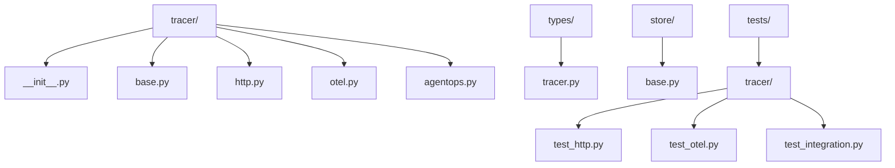

**图表来源**
- [agentlightning/tracer/__init__.py](file://agentlightning/tracer/__init__.py#L1-L8)
- [agentlightning/tracer/base.py](file://agentlightning/tracer/base.py#L1-L141)
- [agentlightning/tracer/http.py](file://agentlightning/tracer/http.py#L1-L394)
- [agentlightning/tracer/otel.py](file://agentlightning/tracer/otel.py#L1-L96)
- [agentlightning/tracer/agentops.py](file://agentlightning/tracer/agentops.py#L1-L374)

**章节来源**
- [agentlightning/tracer/__init__.py](file://agentlightning/tracer/__init__.py#L1-L8)
- [agentlightning/tracer/base.py](file://agentlightning/tracer/base.py#L1-L141)

## 核心组件

Tracer模块的核心由三个主要组件构成：基础抽象类、HTTP跟踪器和OpenTelemetry集成器，以及AgentOps第三方平台对接器。

### 基础跟踪接口

`Tracer`抽象基类定义了所有跟踪器必须实现的标准接口，包括上下文管理、跨度收集和语言模型回调处理功能。

### HTTP跟踪器

`HttpTracer`专门用于捕获HTTP请求和响应，通过httpdbg库钩子技术实现对Python HTTP库的透明拦截。

### OpenTelemetry集成器

`OtelTracer`提供与OpenTelemetry生态系统的完整兼容性，支持标准的追踪协议和导出机制。

### AgentOps对接器

`AgentOpsTracer`实现了与AgentOps监控平台的深度集成，提供企业级的可观测性解决方案。

**章节来源**
- [agentlightning/tracer/base.py](file://agentlightning/tracer/base.py#L15-L141)
- [agentlightning/tracer/http.py](file://agentlightning/tracer/http.py#L25-L394)
- [agentlightning/tracer/otel.py](file://agentlightning/tracer/otel.py#L15-L96)
- [agentlightning/tracer/agentops.py](file://agentlightning/tracer/agentops.py#L20-L374)

## 架构概览

Tracer模块采用分层架构设计，通过统一的接口规范实现多种跟踪后端的无缝切换：

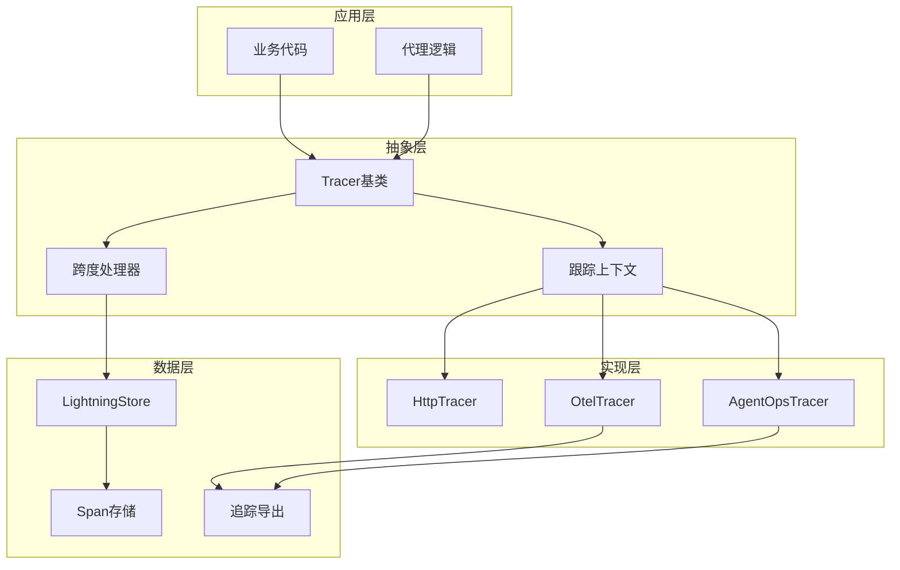

**图表来源**
- [agentlightning/tracer/base.py](file://agentlightning/tracer/base.py#L15-L141)
- [agentlightning/tracer/http.py](file://agentlightning/tracer/http.py#L25-L394)
- [agentlightning/tracer/otel.py](file://agentlightning/tracer/otel.py#L15-L96)
- [agentlightning/tracer/agentops.py](file://agentlightning/tracer/agentops.py#L20-L374)

## 详细组件分析

### BaseTracer - 跟踪接口规范

BaseTracer定义了跟踪系统的核心接口契约，确保所有跟踪实现具有一致的行为模式：

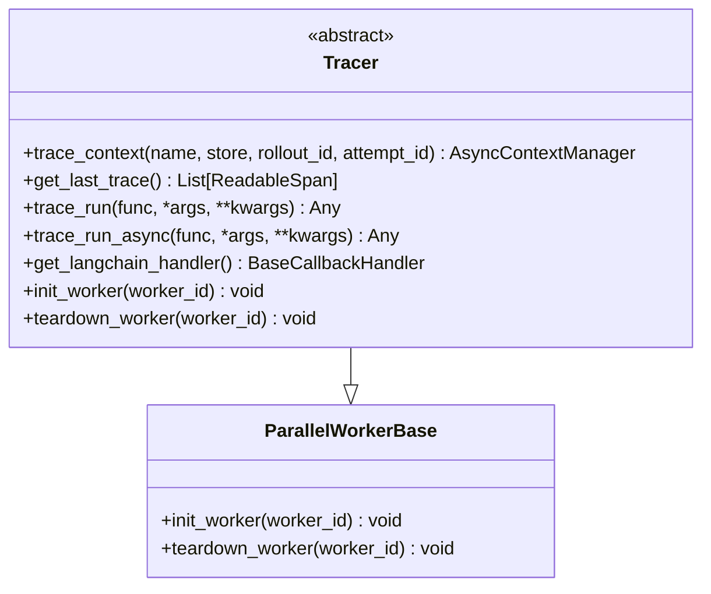

**图表来源**
- [agentlightning/tracer/base.py](file://agentlightning/tracer/base.py#L15-L141)

#### 核心功能特性

1. **异步上下文管理**：通过`trace_context`上下文管理器确保跟踪的正确开始和结束
2. **跨度收集**：提供`get_last_trace`方法获取最近一次跟踪的所有跨度
3. **函数包装**：支持同步和异步函数的便捷跟踪包装
4. **语言模型集成**：提供LangChain回调处理器以集成到语言模型框架中

#### 工作进程生命周期

跟踪器支持多进程环境下的工作进程初始化和清理：

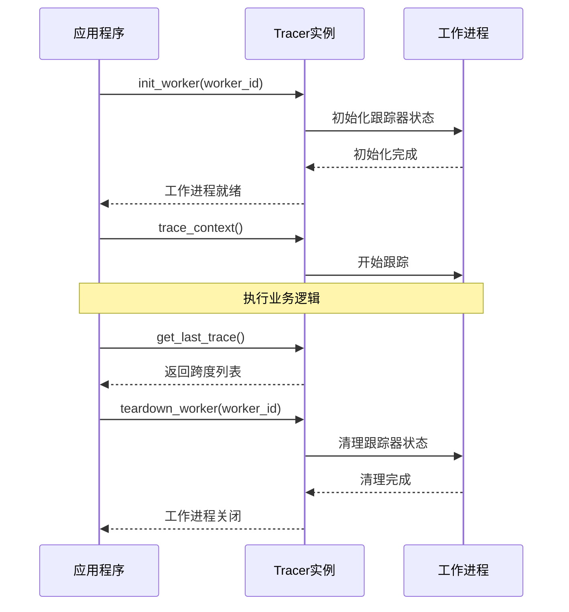

**图表来源**
- [agentlightning/tracer/base.py](file://agentlightning/tracer/base.py#L40-L141)

**章节来源**
- [agentlightning/tracer/base.py](file://agentlightning/tracer/base.py#L15-L141)

### HTTPTracer - API调用链路拦截

HTTPTracer通过httpdbg库实现对HTTP请求的透明拦截和记录，为API调用链路提供详细的跟踪数据：

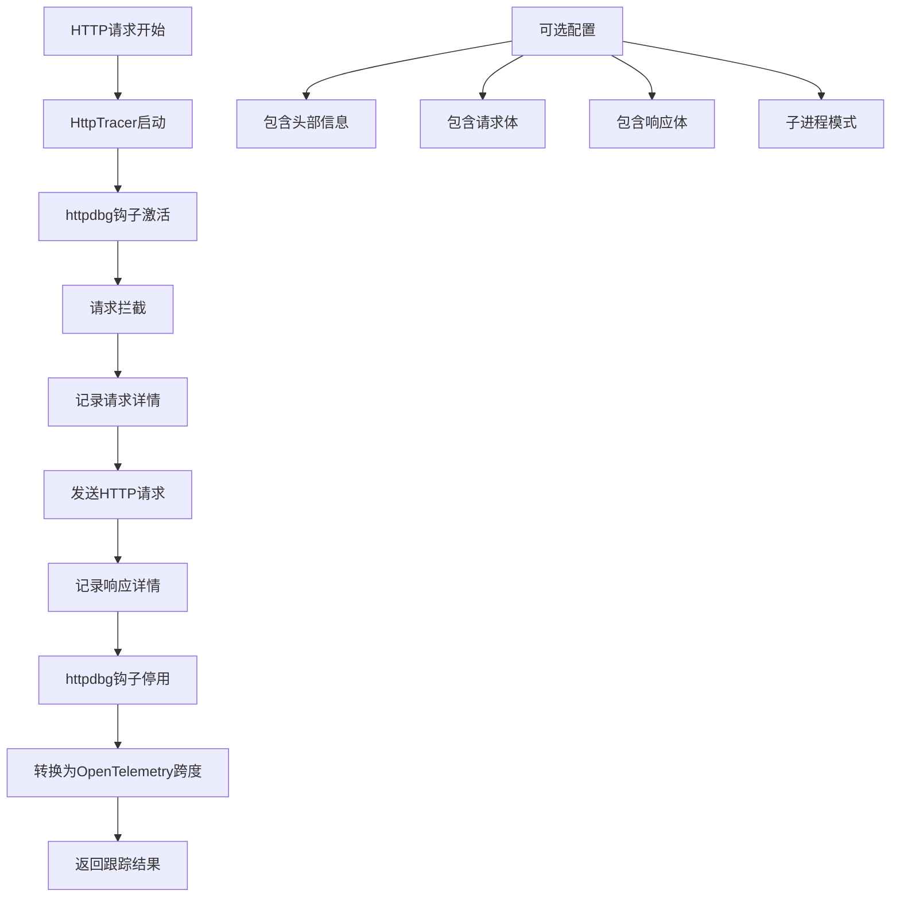

**图表来源**
- [agentlightning/tracer/http.py](file://agentlightning/tracer/http.py#L25-L394)

#### 配置选项详解

| 配置项 | 类型 | 默认值 | 描述 |
|--------|------|--------|------|
| `include_headers` | bool | False | 是否包含HTTP头部信息（可能包含敏感信息） |
| `include_body` | bool | False | 是否包含请求和响应体（可能体积较大且包含敏感信息） |
| `include_agentlightning_requests` | bool | False | 是否包含AgentLightning自身的请求 |
| `subprocess_mode` | bool | True | 是否在隔离子进程中执行跟踪以避免钩子污染 |
| `subprocess_timeout` | float | 3600.0 | 子进程执行超时时间（秒） |

#### 数据隐私保护措施

HTTPTracer实现了多层次的数据隐私保护：

1. **选择性数据收集**：默认不包含敏感信息，需要显式启用相关选项
2. **子进程隔离**：通过子进程模式防止HTTP钩子影响主进程状态
3. **头部过滤**：自动过滤AgentLightning专用头部信息

**章节来源**
- [agentlightning/tracer/http.py](file://agentlightning/tracer/http.py#L25-L394)

### OTEL（OpenTelemetry）集成模块

OtelTracer提供与OpenTelemetry生态系统的完整兼容性，支持标准的追踪协议和导出机制：

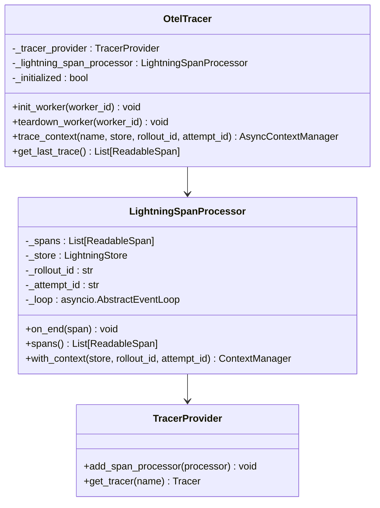

**图表来源**
- [agentlightning/tracer/otel.py](file://agentlightning/tracer/otel.py#L15-L96)
- [agentlightning/tracer/agentops.py](file://agentlightning/tracer/agentops.py#L200-L374)

#### 分布式追踪数据导出

OtelTracer通过LightningSpanProcessor实现高效的分布式追踪数据导出：

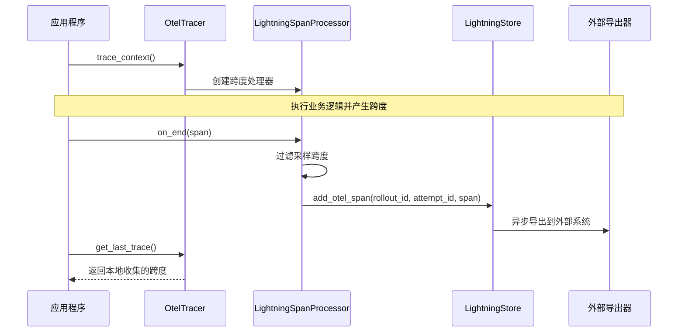

**图表来源**
- [agentlightning/tracer/otel.py](file://agentlightning/tracer/otel.py#L40-L96)
- [agentlightning/tracer/agentops.py](file://agentlightning/tracer/agentops.py#L200-L374)

#### 性能开销控制

OtelTracer实现了多层次的性能优化：

1. **异步事件循环**：使用独立的异步事件循环处理跨度导出
2. **线程安全**：通过锁机制确保多线程环境下的数据一致性
3. **批量导出**：支持批量写入以减少I/O开销
4. **内存管理**：及时清理已完成的跨度以控制内存使用

**章节来源**
- [agentlightning/tracer/otel.py](file://agentlightning/tracer/otel.py#L15-L96)
- [agentlightning/tracer/agentops.py](file://agentlightning/tracer/agentops.py#L200-L374)

### AgentOpsTracer - 第三方监控平台对接

AgentOpsTracer实现了与AgentOps监控平台的深度集成，提供企业级的可观测性解决方案：

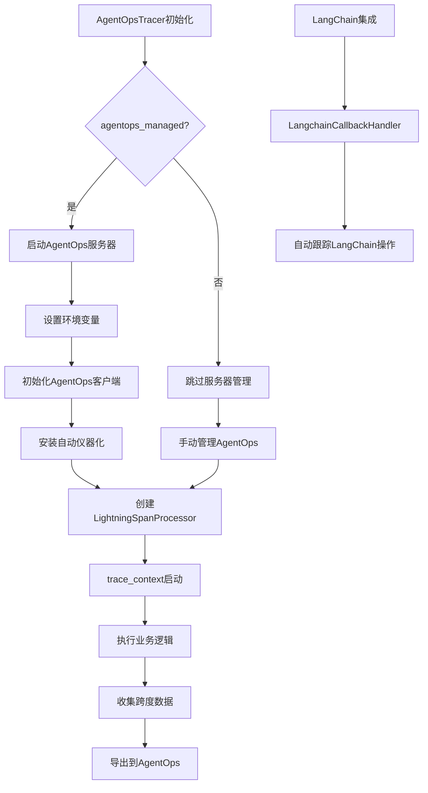

**图表来源**
- [agentlightning/tracer/agentops.py](file://agentlightning/tracer/agentops.py#L20-L374)

#### 跟踪上下文传播

AgentOpsTracer支持复杂的跟踪上下文传播机制：

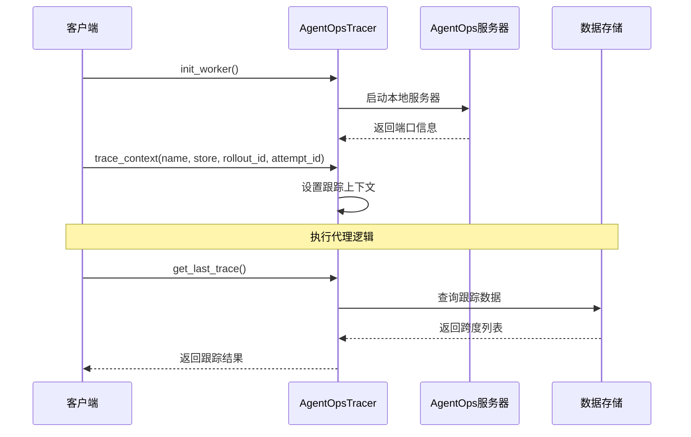

**图表来源**
- [agentlightning/tracer/agentops.py](file://agentlightning/tracer/agentops.py#L80-L374)

#### 采样策略配置

AgentOpsTracer支持灵活的采样策略配置：

| 配置项 | 类型 | 默认值 | 描述 |
|--------|------|--------|------|
| `agentops_managed` | bool | True | 是否自动管理AgentOps客户端 |
| `instrument_managed` | bool | True | 是否自动管理仪器化 |
| `daemon` | bool | True | AgentOps服务器是否作为守护进程运行 |

**章节来源**
- [agentlightning/tracer/agentops.py](file://agentlightning/tracer/agentops.py#L20-L374)

### 跨度数据模型

Tracer模块使用标准化的跨度数据模型确保跨平台兼容性：

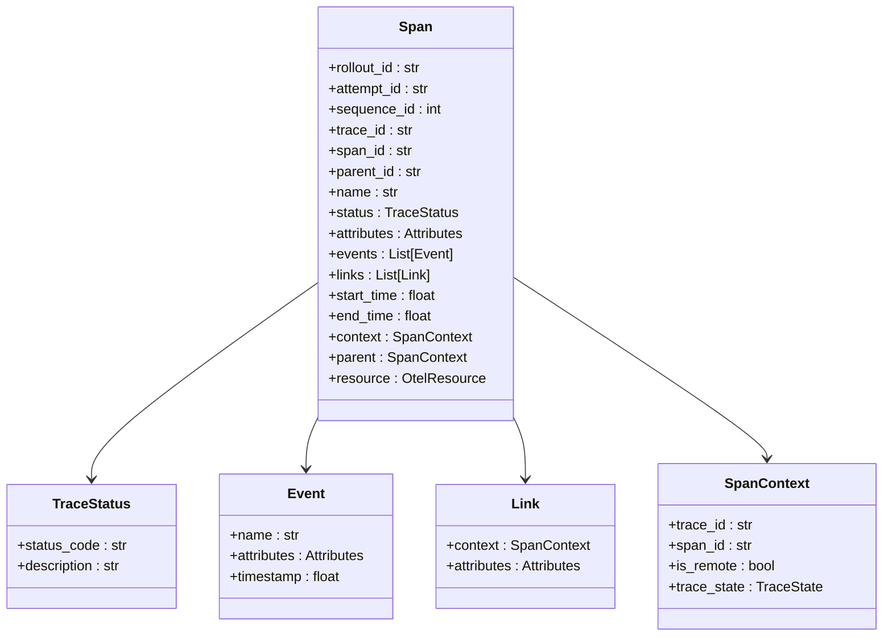

**图表来源**
- [agentlightning/types/tracer.py](file://agentlightning/types/tracer.py#L150-L427)

**章节来源**
- [agentlightning/types/tracer.py](file://agentlightning/types/tracer.py#L150-L427)

## 依赖关系分析

Tracer模块的依赖关系体现了清晰的分层架构：

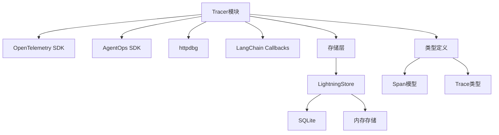

**图表来源**
- [agentlightning/tracer/base.py](file://agentlightning/tracer/base.py#L1-L15)
- [agentlightning/tracer/agentops.py](file://agentlightning/tracer/agentops.py#L1-L25)

### 关键依赖说明

1. **OpenTelemetry SDK**：提供标准的追踪和指标收集功能
2. **AgentOps SDK**：实现与第三方监控平台的集成
3. **httpdbg**：HTTP请求拦截和记录工具
4. **LangChain Callbacks**：语言模型框架集成支持

**章节来源**
- [agentlightning/tracer/base.py](file://agentlightning/tracer/base.py#L1-L15)
- [agentlightning/tracer/agentops.py](file://agentlightning/tracer/agentops.py#L1-L25)

## 性能考虑

### 高吞吐量场景优化

1. **异步处理**：所有I/O密集型操作都采用异步模式
2. **批量导出**：支持批量写入以减少网络往返
3. **内存管理**：及时清理已完成的跨度数据
4. **连接池**：复用数据库和网络连接

### 内存使用优化

- **跨度限制**：可配置最大跨度数量以控制内存使用
- **延迟清理**：在适当时机清理已完成的跟踪数据
- **压缩存储**：对大型跨度数据进行压缩存储

### 网络优化

- **连接复用**：重用HTTP连接减少握手开销
- **背压控制**：当导出速度跟不上生成速度时实施背压
- **故障恢复**：自动重试失败的导出操作

## 故障排除指南

### 常见问题及解决方案

#### 1. 跟踪数据丢失

**症状**：调用`get_last_trace()`返回空列表

**原因**：
- 跟踪上下文未正确启动
- 跟踪器未正确初始化
- 跨度被采样过滤掉

**解决方案**：
```python
# 确保正确使用上下文管理器
async with tracer.trace_context(name="my_operation"):
    # 执行业务逻辑
    pass

# 检查跟踪器初始化状态
if hasattr(tracer, '_lightning_span_processor'):
    spans = tracer.get_last_trace()
    print(f"收集到 {len(spans)} 个跨度")
```

#### 2. 性能问题

**症状**：应用性能显著下降

**原因**：
- 过度包含敏感信息
- 子进程模式导致额外开销
- 导出频率过高

**解决方案**：
```python
# 优化配置
tracer = HttpTracer(
    include_headers=False,      # 不包含头部信息
    include_body=False,         # 不包含请求体
    subprocess_mode=False,      # 在单进程模式下运行
)

# 或者使用更轻量的OtelTracer
tracer = OtelTracer()
```

#### 3. AgentOps集成问题

**症状**：AgentOps数据无法正常导出

**原因**：
- 服务器启动失败
- 环境变量配置错误
- 网络连接问题

**解决方案**：
```python
# 检查AgentOps服务器状态
tracer = AgentOpsTracer(agentops_managed=True)
tracer.init()
print(f"AgentOps服务器端口: {tracer._agentops_server_port_val}")

# 手动检查客户端状态
import agentops
client = agentops.get_client()
print(f"AgentOps客户端已初始化: {client.initialized}")
```

**章节来源**
- [tests/tracer/test_http.py](file://tests/tracer/test_http.py#L1-L219)
- [tests/tracer/test_otel.py](file://tests/tracer/test_otel.py#L1-L523)

## 结论

Tracer模块为Agent Lightning系统提供了全面而灵活的可观测性解决方案。通过统一的接口设计和多样化的实现选择，开发者可以根据具体需求选择最适合的跟踪方案。

### 主要优势

1. **统一接口**：所有跟踪实现都遵循相同的接口规范
2. **多后端支持**：支持HTTP、OpenTelemetry和AgentOps等多种跟踪后端
3. **性能优化**：异步处理和批量导出确保高性能
4. **企业级功能**：完整的采样策略和数据隐私保护
5. **易于集成**：与主流APM工具和语言模型框架无缝集成

### 最佳实践建议

1. **开发阶段**：使用HttpTracer进行本地调试
2. **测试阶段**：切换到OtelTracer进行性能测试
3. **生产环境**：部署AgentOpsTracer获得企业级可观测性
4. **数据保护**：谨慎配置敏感信息包含选项
5. **性能监控**：定期检查跟踪系统的性能影响

Tracer模块的设计充分体现了现代可观测性系统的核心原则：标准化、可扩展性和易用性，为构建可靠的AI代理系统奠定了坚实的基础。