# Trainer模块深度解析：训练流程控制中心架构与实现

<cite>
**本文档引用的文件**
- [agentlightning/trainer/__init__.py](file://agentlightning/trainer/__init__.py)
- [agentlightning/trainer/trainer.py](file://agentlightning/trainer/trainer.py)
- [agentlightning/trainer/init_utils.py](file://agentlightning/trainer/init_utils.py)
- [agentlightning/trainer/registry.py](file://agentlightning/trainer/registry.py)
- [agentlightning/trainer/legacy.py](file://agentlightning/trainer/legacy.py)
- [agentlightning/algorithm/base.py](file://agentlightning/algorithm/base.py)
- [agentlightning/runner/base.py](file://agentlightning/runner/base.py)
- [agentlightning/execution/base.py](file://agentlightning/execution/base.py)
- [agentlightning/store/base.py](file://agentlightning/store/base.py)
- [tests/trainer/test_trainer_init.py](file://tests/trainer/test_trainer_init.py)
- [tests/trainer/test_init_utils.py](file://tests/trainer/test_init_utils.py)
- [examples/apo/apo_custom_algorithm_trainer.py](file://examples/apo/apo_custom_algorithm_trainer.py)
</cite>

## 目录
1. [引言](#引言)
2. [项目结构概览](#项目结构概览)
3. [核心组件架构](#核心组件架构)
4. [Trainer类详细分析](#trainer类详细分析)
5. [init_utils.py初始化机制](#init_utilspy初始化机制)
6. [Registry注册机制](#registry注册机制)
7. [Legacy兼容性设计](#legacy兼容性设计)
8. [训练生命周期管理](#训练生命周期管理)
9. [资源配置与调度](#资源配置与调度)
10. [故障检测与恢复](#故障检测与恢复)
11. [性能优化与最佳实践](#性能优化与最佳实践)
12. [故障排除指南](#故障排除指南)
13. [总结](#总结)

## 引言

Trainer模块是Agent-Lightning框架中的训练流程控制中心，负责协调算法执行、数据采集和模型更新的完整生命周期。作为整个训练系统的核心枢纽，Trainer通过精心设计的架构实现了高度可配置性和扩展性，支持多种执行策略、分布式训练和实时监控。

本文档将深入解析Trainer模块的架构设计、实现细节和最佳实践，帮助开发者理解和掌握这一关键组件的工作原理。

## 项目结构概览

Trainer模块位于`agentlightning/trainer/`目录下，包含以下核心文件：

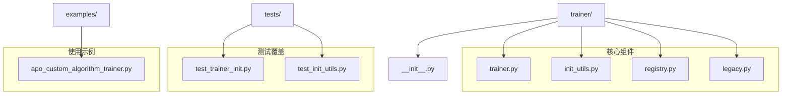

**图表来源**
- [agentlightning/trainer/__init__.py](file://agentlightning/trainer/__init__.py#L1-L7)
- [agentlightning/trainer/trainer.py](file://agentlightning/trainer/trainer.py#L1-L50)

**章节来源**
- [agentlightning/trainer/__init__.py](file://agentlightning/trainer/__init__.py#L1-L7)

## 核心组件架构

Trainer模块采用分层架构设计，通过组件化的方式实现高度的灵活性和可扩展性：

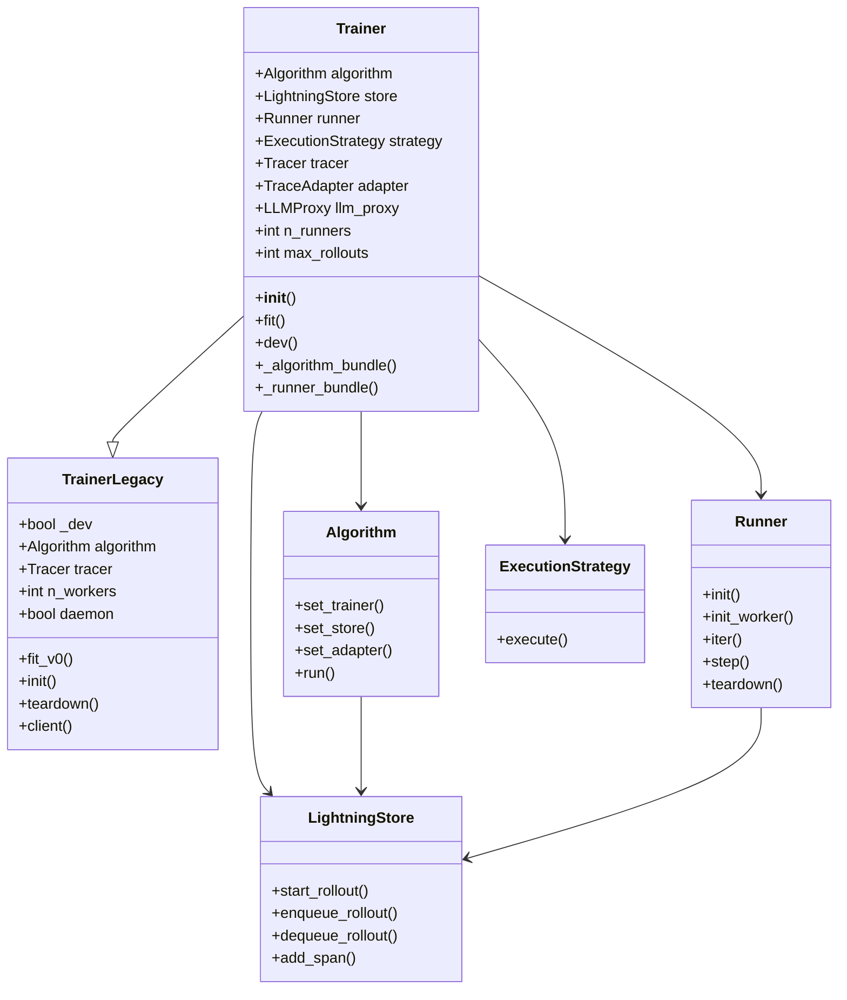

**图表来源**
- [agentlightning/trainer/trainer.py](file://agentlightning/trainer/trainer.py#L35-L150)
- [agentlightning/trainer/legacy.py](file://agentlightning/trainer/legacy.py#L25-L50)
- [agentlightning/algorithm/base.py](file://agentlightning/algorithm/base.py#L20-L80)
- [agentlightning/runner/base.py](file://agentlightning/runner/base.py#L25-L80)

**章节来源**
- [agentlightning/trainer/trainer.py](file://agentlightning/trainer/trainer.py#L35-L150)
- [agentlightning/algorithm/base.py](file://agentlightning/algorithm/base.py#L20-L163)
- [agentlightning/runner/base.py](file://agentlightning/runner/base.py#L25-L183)

## Trainer类详细分析

### 类定义与继承关系

Trainer类继承自TrainerLegacy，提供了现代化的训练接口和增强的功能：

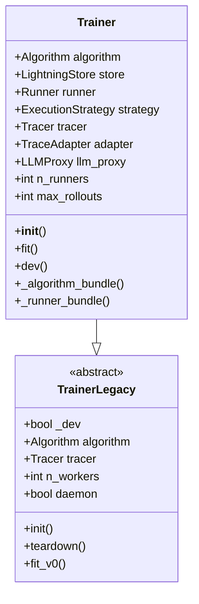

**图表来源**
- [agentlightning/trainer/trainer.py](file://agentlightning/trainer/trainer.py#L35-L50)
- [agentlightning/trainer/legacy.py](file://agentlightning/trainer/legacy.py#L25-L50)

### 核心属性与配置

Trainer类维护多个关键属性来协调训练流程：

| 属性名 | 类型 | 描述 | 默认值 |
|--------|------|------|--------|
| algorithm | Optional[Algorithm] | 训练算法实例 | None |
| store | LightningStore | 数据存储后端 | InMemoryLightningStore |
| runner | Runner[Any] | 代理运行器 | LitAgentRunner |
| strategy | ExecutionStrategy | 执行策略 | ClientServerExecutionStrategy |
| tracer | Tracer | 追踪器实例 | AgentOpsTracer |
| adapter | TraceAdapter[Any] | 追踪适配器 | TracerTraceToTriplet |
| llm_proxy | Optional[LLMProxy] | LLM代理实例 | None |
| n_runners | int | 并行运行器数量 | 1 |
| max_rollouts | Optional[int] | 最大轮次限制 | None |

### 初始化流程

Trainer的初始化过程通过灵活的组件构建机制实现：

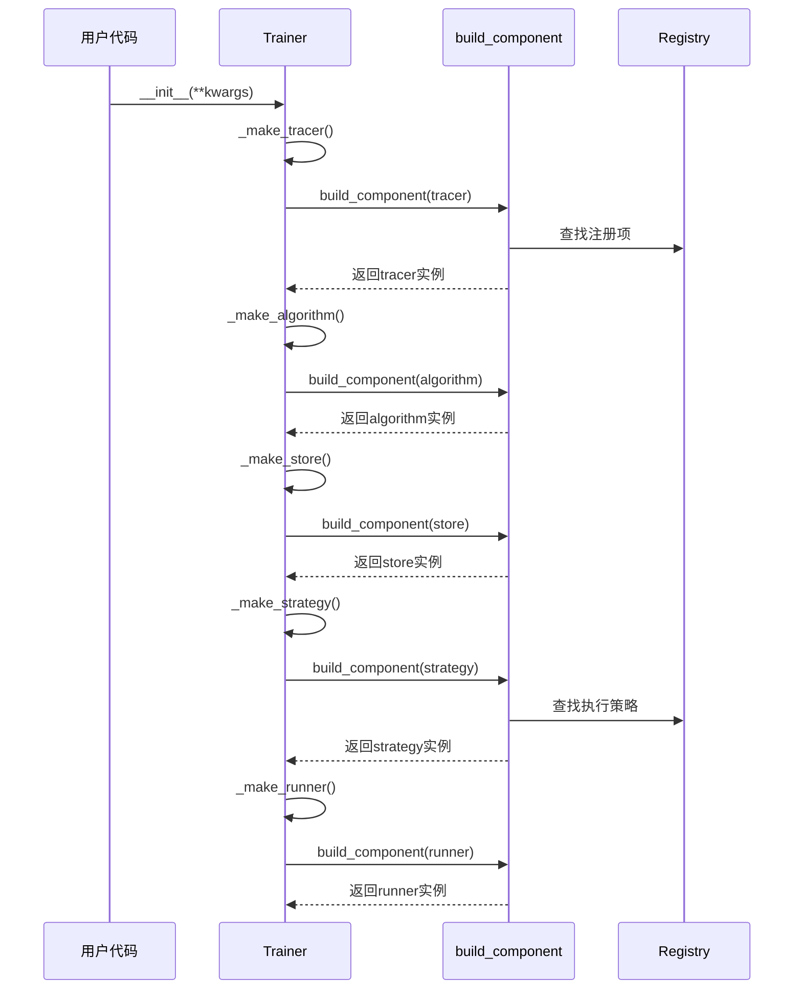

**图表来源**
- [agentlightning/trainer/trainer.py](file://agentlightning/trainer/trainer.py#L150-L250)
- [agentlightning/trainer/init_utils.py](file://agentlightning/trainer/init_utils.py#L100-L200)

**章节来源**
- [agentlightning/trainer/trainer.py](file://agentlightning/trainer/trainer.py#L150-L350)

## init_utils.py初始化机制

init_utils模块提供了强大的组件动态初始化能力，支持多种规格格式：

### 核心函数架构

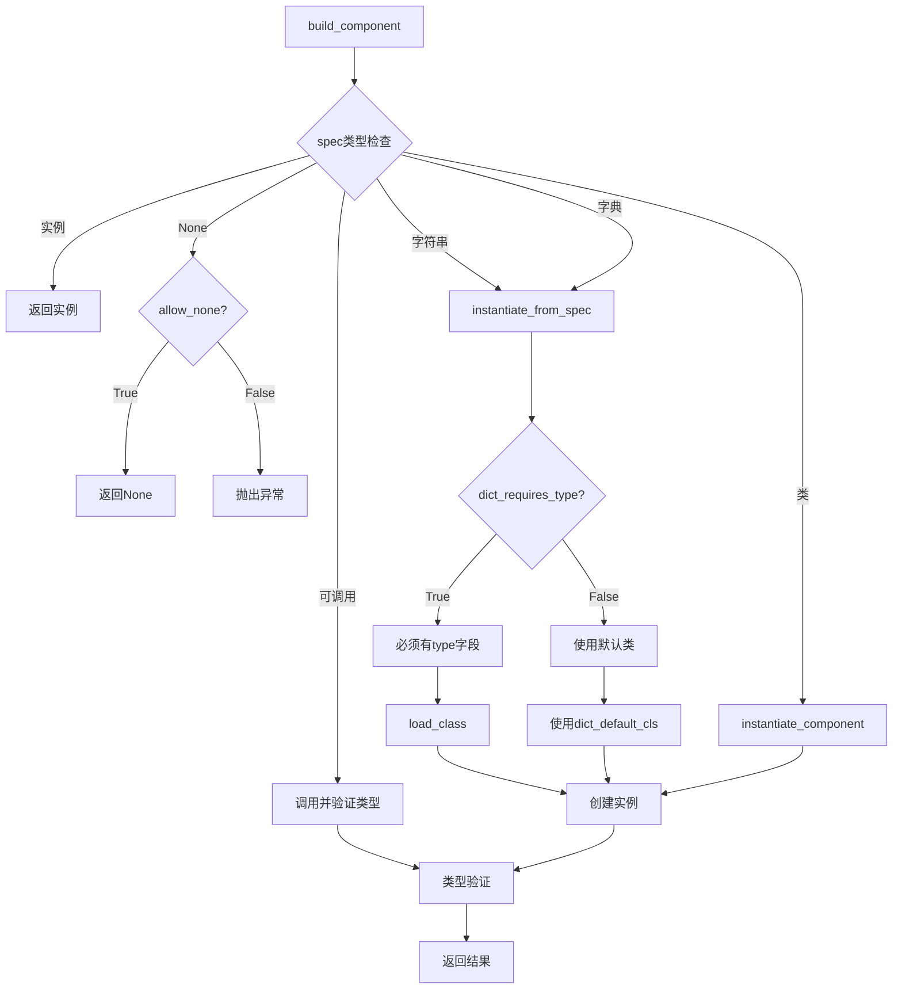

**图表来源**
- [agentlightning/trainer/init_utils.py](file://agentlightning/trainer/init_utils.py#L100-L264)

### 组件规格支持

init_utils支持以下组件规格格式：

| 规格类型 | 示例 | 描述 |
|----------|------|------|
| 实例 | `Tracer()` | 已经创建的对象实例 |
| 字符串路径 | `"module.Class"` | 完全限定的导入路径 |
| 字典规格 | `{"type": "module.Class", "param": value}` | 包含类型和参数的字典 |
| 类类型 | `MyClass` | 类本身（将被实例化） |
| 工厂函数 | `lambda: MyClass(param)` | 返回实例的工厂函数 |
| 注册键 | `"my_component"` | 通过注册表映射的简短名称 |

### 动态组件构建流程

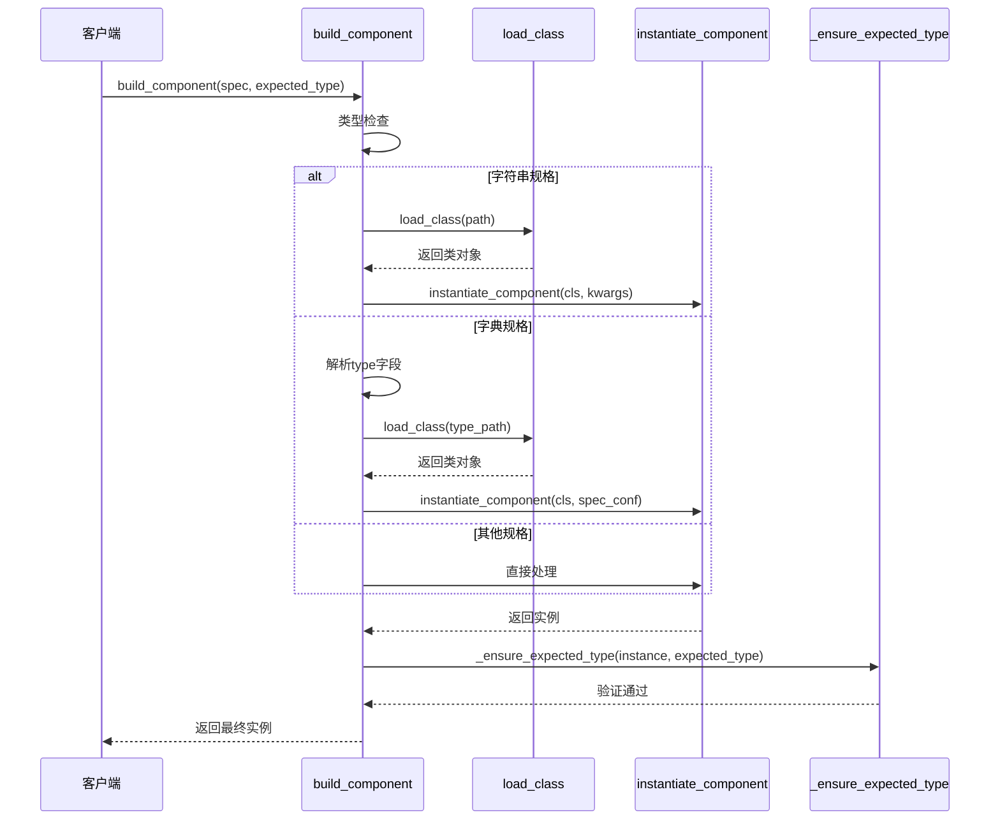

**图表来源**
- [agentlightning/trainer/init_utils.py](file://agentlightning/trainer/init_utils.py#L100-L264)

**章节来源**
- [agentlightning/trainer/init_utils.py](file://agentlightning/trainer/init_utils.py#L100-L264)

## Registry注册机制

Registry机制为Trainer提供了组件的动态注册与发现能力：

### ExecutionStrategyRegistry

当前主要注册了两种执行策略：

| 短名称 | 完整路径 | 描述 |
|--------|----------|------|
| `shm` | `SharedMemoryExecutionStrategy` | 共享内存执行策略 |
| `cs` | `ClientServerExecutionStrategy` | 客户端-服务器执行策略 |

### 注册机制工作原理

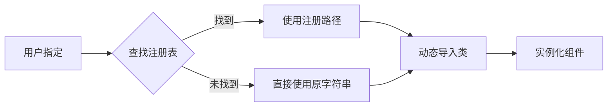

**图表来源**
- [agentlightning/trainer/registry.py](file://agentlightning/trainer/registry.py#L8-L12)

**章节来源**
- [agentlightning/trainer/registry.py](file://agentlightning/trainer/registry.py#L1-L13)

## Legacy兼容性设计

Legacy模块提供了向后兼容的训练接口，确保旧版本代码的正常运行：

### TrainerLegacy类结构

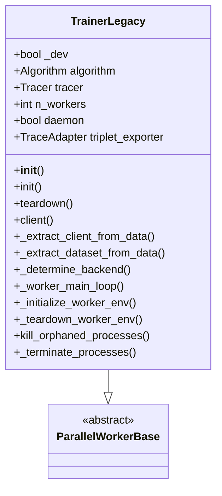

**图表来源**
- [agentlightning/trainer/legacy.py](file://agentlightning/trainer/legacy.py#L25-L50)

### 兼容性设计考量

Legacy模块的设计考虑了以下关键因素：

1. **向后兼容性**：保持与v0.1版本的API兼容
2. **渐进迁移**：新旧接口可以共存，逐步迁移到新架构
3. **功能分离**：将传统训练逻辑与现代架构分离
4. **错误处理**：提供清晰的迁移指导和警告信息

**章节来源**
- [agentlightning/trainer/legacy.py](file://agentlightning/trainer/legacy.py#L25-L100)

## 训练生命周期管理

Trainer模块实现了完整的训练生命周期管理，包括初始化、执行、监控和清理：

### 训练流程架构

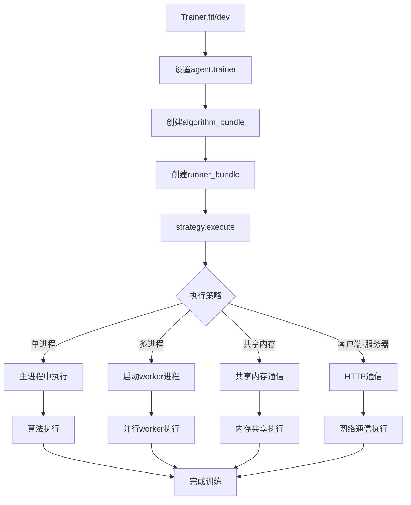

**图表来源**
- [agentlightning/trainer/trainer.py](file://agentlightning/trainer/trainer.py#L400-L500)

### 算法包(bundle)机制

Trainer使用bundle机制来封装算法和运行器的执行逻辑：

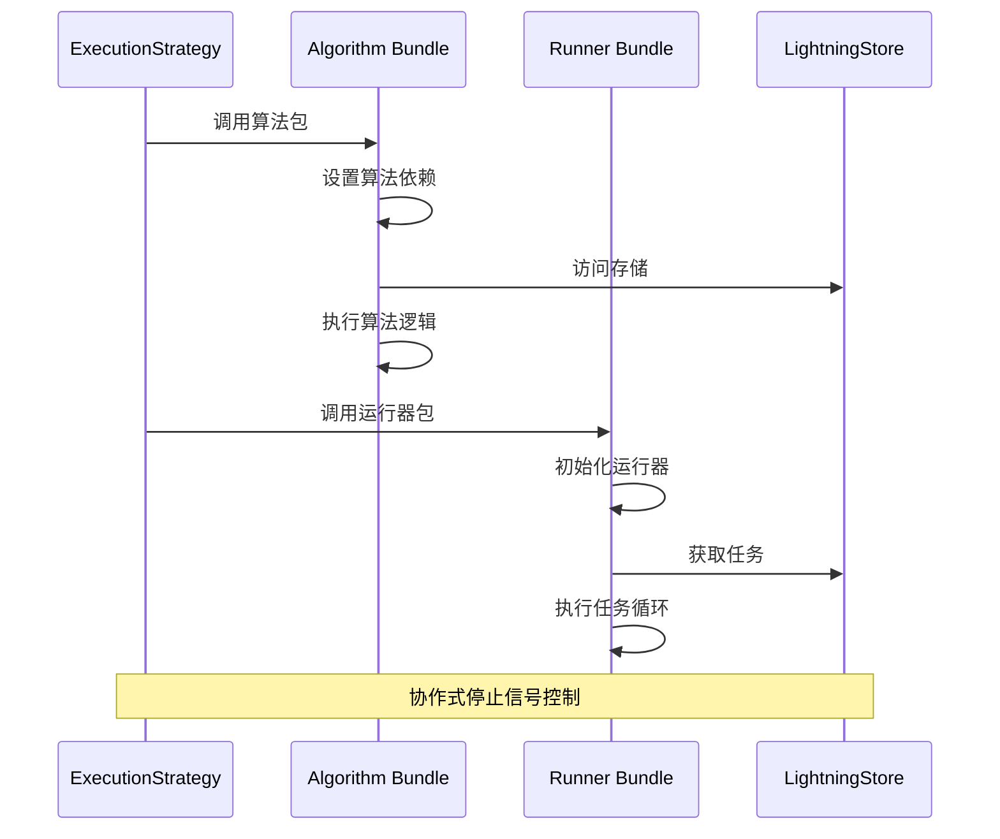

**图表来源**
- [agentlightning/trainer/trainer.py](file://agentlightning/trainer/trainer.py#L500-L557)

### 开发模式(dev)特性

开发模式提供了快速调试和验证的能力：

| 特性 | 描述 | 实现方式 |
|------|------|----------|
| 同步执行 | 阻塞事件循环以获得更好的调试体验 | 使用同步算法执行 |
| 快速响应 | 保持循环响应性用于调试 | FastAlgorithm基类 |
| 默认算法 | 自动使用Baseline算法 | 内置默认实现 |
| 资源隔离 | 独立的执行环境 | 独立的执行策略 |

**章节来源**
- [agentlightning/trainer/trainer.py](file://agentlightning/trainer/trainer.py#L450-L500)

## 资源配置与调度

### 执行策略配置

Trainer支持多种执行策略，每种都有特定的配置选项：

```mermaid
graph TD
A[ExecutionStrategy] --> B[SharedMemoryExecutionStrategy]
A --> C[ClientServerExecutionStrategy]
A --> D[InterProcessExecutionStrategy]
B --> E[main_thread: algorithm|runner]
B --> F[managed_store: bool]
B --> G[n_runners: int]
C --> H[server_port: int]
C --> I[host: str]
C --> J[protocol: str]
D --> K[IPC通信机制]
```

**图表来源**
- [agentlightning/trainer/registry.py](file://agentlightning/trainer/registry.py#L8-L12)

### 分布式训练配置

分布式训练通过以下机制实现：

| 配置项 | 类型 | 描述 | 示例值 |
|--------|------|------|--------|
| n_runners | int | 并行运行器数量 | 8 |
| strategy | str/dict | 执行策略 | "cs" 或 {"type": "cs", "server_port": 9999} |
| port | int | 服务器端口 | 8080 |
| daemon | bool | 是否守护进程 | True |
| max_rollouts | int | 最大轮次 | 1000 |

### 批量处理参数调优

批量处理的关键参数配置：

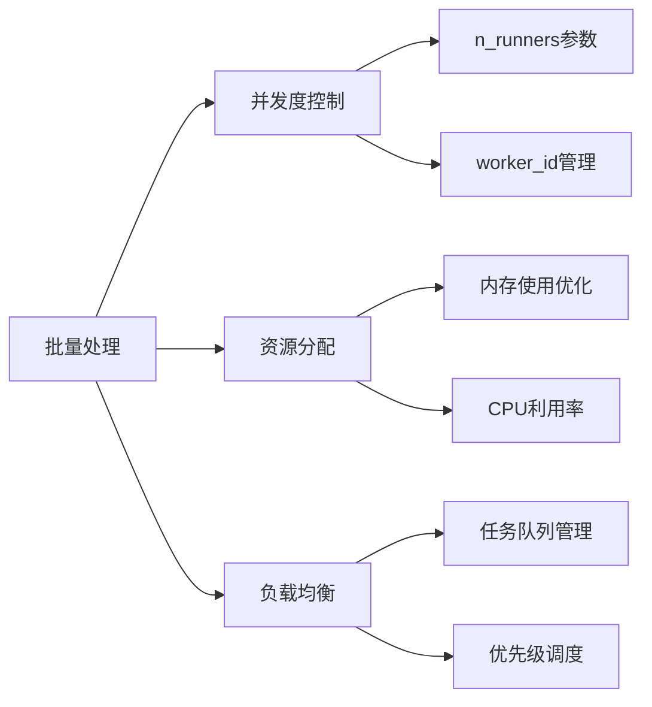

**章节来源**
- [agentlightning/trainer/trainer.py](file://agentlightning/trainer/trainer.py#L250-L350)

## 故障检测与恢复

### 容错机制设计

Trainer模块实现了多层次的容错机制：

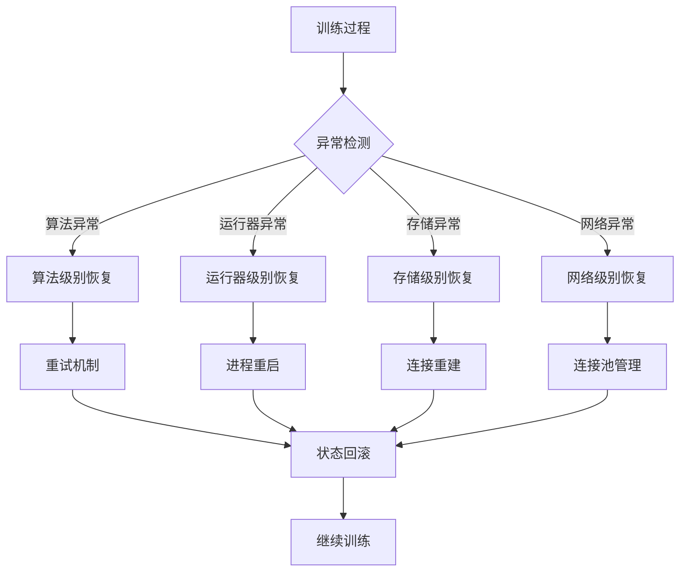

### 进程监控与管理

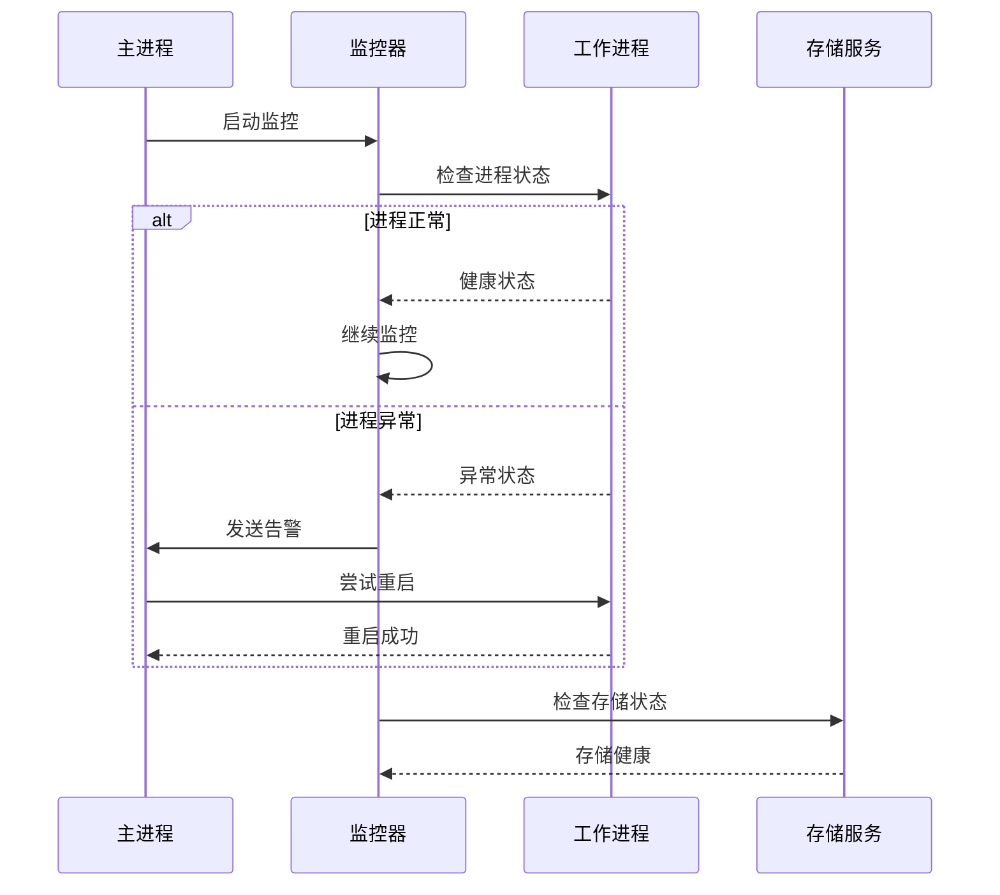

**图表来源**
- [agentlightning/trainer/legacy.py](file://agentlightning/trainer/legacy.py#L300-L367)

### 资源监控指标

关键监控指标包括：

| 指标类别 | 具体指标 | 监控方法 | 告警阈值 |
|----------|----------|----------|----------|
| 进程状态 | CPU使用率、内存占用 | 系统监控API | CPU > 80%, 内存 > 90% |
| 网络状态 | 连接数、延迟 | 网络监控工具 | 连接超时、延迟 > 1s |
| 存储状态 | 磁盘空间、I/O性能 | 文件系统监控 | 空间 < 10%、I/O > 100ms |
| 训练进度 | 轮次完成率、成功率 | 应用层指标 | 完成率 < 95% |

**章节来源**
- [agentlightning/trainer/legacy.py](file://agentlightning/trainer/legacy.py#L300-L367)

## 性能优化与最佳实践

### 训练性能优化策略

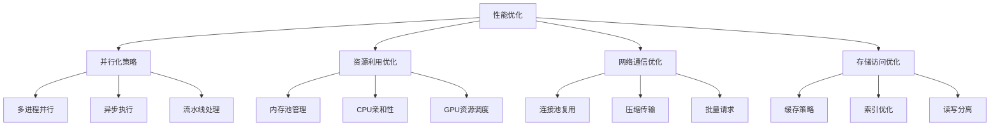

### 配置最佳实践

推荐的配置模式：

| 场景 | 推荐配置 | 说明 |
|------|----------|------|
| 开发调试 | `n_runners=1, dev=True` | 单进程同步执行 |
| 小规模训练 | `n_runners=4, strategy="shm"` | 共享内存策略 |
| 大规模训练 | `n_runners=8+, strategy="cs"` | 客户端-服务器策略 |
| 分布式训练 | `n_runners=16+, port=9999` | 多节点部署 |

### 性能监控建议

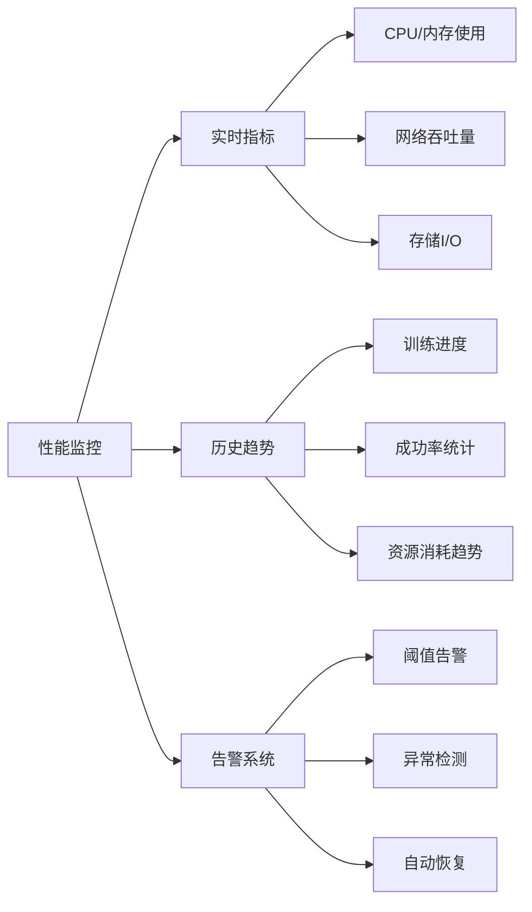

**章节来源**
- [tests/trainer/test_trainer_init.py](file://tests/trainer/test_trainer_init.py#L1-L159)

## 故障排除指南

### 常见训练失败场景

#### 1. 组件初始化失败

**症状**：Trainer无法正确初始化某个组件
**原因**：组件规格配置错误或依赖缺失
**解决方案**：
- 检查组件规格格式是否正确
- 验证所需依赖是否已安装
- 查看详细的错误堆栈信息

#### 2. 执行策略冲突

**症状**：多进程模式下出现端口冲突
**原因**：多个Trainer实例使用相同端口
**解决方案**：
```python
# 不同实例使用不同端口
trainer1 = Trainer(port=8080)
trainer2 = Trainer(port=8081)
```

#### 3. 资源耗尽

**症状**：训练过程中出现内存不足或CPU过载
**原因**：并发度设置过高或资源限制不当
**解决方案**：
- 降低`n_runners`参数
- 增加系统资源
- 优化算法内存使用

#### 4. 网络连接问题

**症状**：客户端-服务器模式下连接超时
**原因**：防火墙阻止、网络不稳定或服务器未启动
**解决方案**：
- 检查防火墙设置
- 验证网络连通性
- 确认服务器进程状态

### 调试技巧

#### 1. 启用详细日志

```python
import logging
logging.basicConfig(level=logging.DEBUG)
```

#### 2. 使用开发模式

```python
trainer = Trainer(dev=True)
trainer.dev(agent, dataset)
```

#### 3. 监控资源使用

```python
import psutil
print(f"CPU使用率: {psutil.cpu_percent()}%")
print(f"内存使用率: {psutil.virtual_memory().percent}%")
```

### 性能诊断工具

| 工具 | 用途 | 使用方法 |
|------|------|----------|
| `trainer.fit()` | 正式训练 | `trainer.fit(agent, train_dataset)` |
| `trainer.dev()` | 快速调试 | `trainer.dev(agent, dataset)` |
| `psutil` | 系统监控 | 监控CPU和内存使用 |
| `logging` | 日志记录 | 启用DEBUG级别日志 |

**章节来源**
- [agentlightning/trainer/legacy.py](file://agentlightning/trainer/legacy.py#L300-L367)

## 总结

Trainer模块作为Agent-Lightning框架的核心训练控制中心，通过精心设计的架构实现了以下关键特性：

### 架构优势

1. **高度可配置性**：支持多种组件规格格式和动态配置
2. **强扩展性**：通过Registry机制实现组件的动态注册与发现
3. **向后兼容**：Legacy模块确保旧版本代码的平滑迁移
4. **容错能力强**：多层次的异常处理和恢复机制
5. **性能优化**：支持多种执行策略和资源调度优化

### 设计亮点

- **组件化架构**：清晰的职责分离和松耦合设计
- **异步支持**：全面的异步执行能力和协程管理
- **监控集成**：内置的追踪和监控机制
- **测试覆盖**：完善的单元测试和集成测试

### 最佳实践建议

1. **合理配置并发度**：根据硬件资源调整`n_runners`参数
2. **选择合适的执行策略**：根据训练规模选择SHM或CS策略
3. **启用监控和日志**：及时发现问题并进行调试
4. **定期备份配置**：保存重要的训练配置以便复现
5. **关注资源使用**：监控系统资源避免过载

Trainer模块的设计充分体现了现代软件架构的最佳实践，为Agent-Lightning框架提供了稳定、高效和可扩展的训练基础设施。通过深入理解其架构和实现细节，开发者可以更好地利用这个强大的工具来构建和训练智能代理系统。