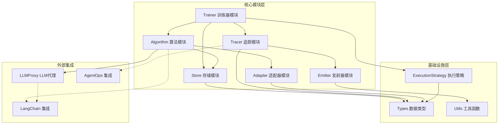
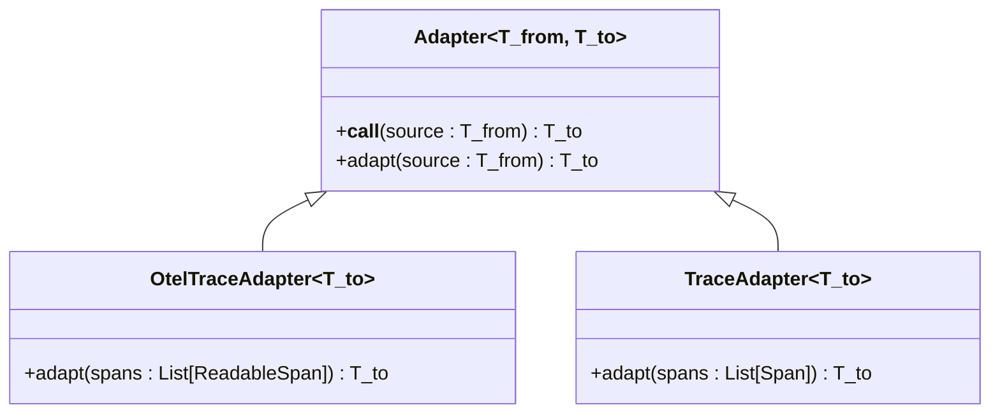
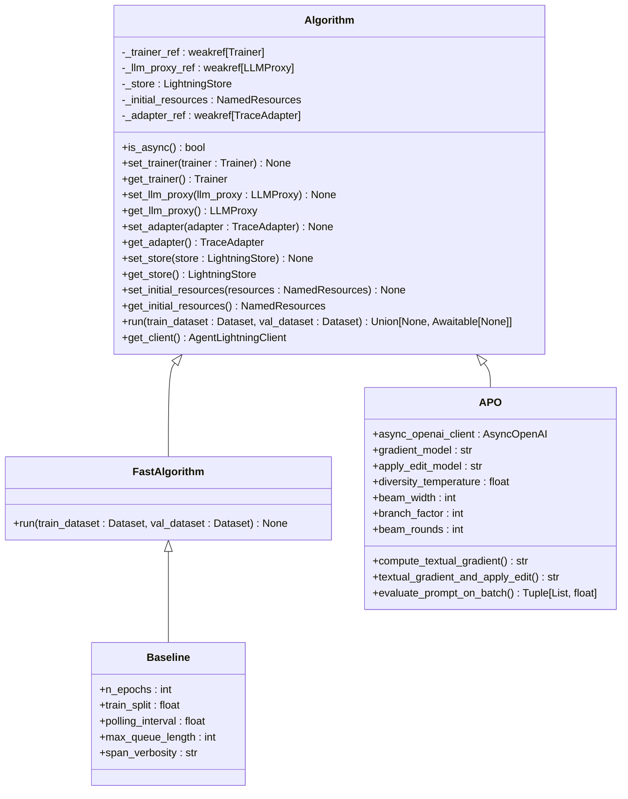
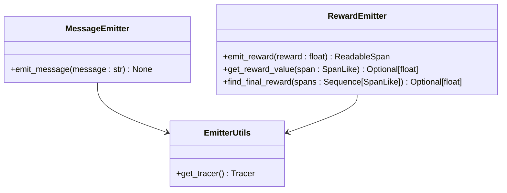
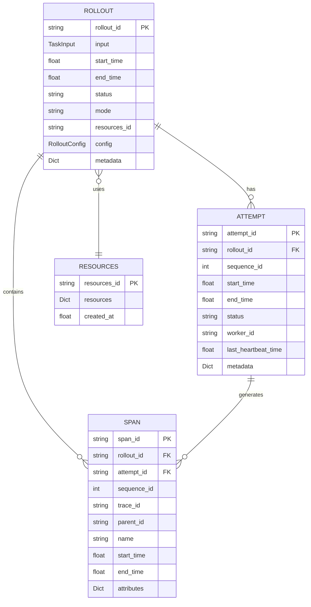
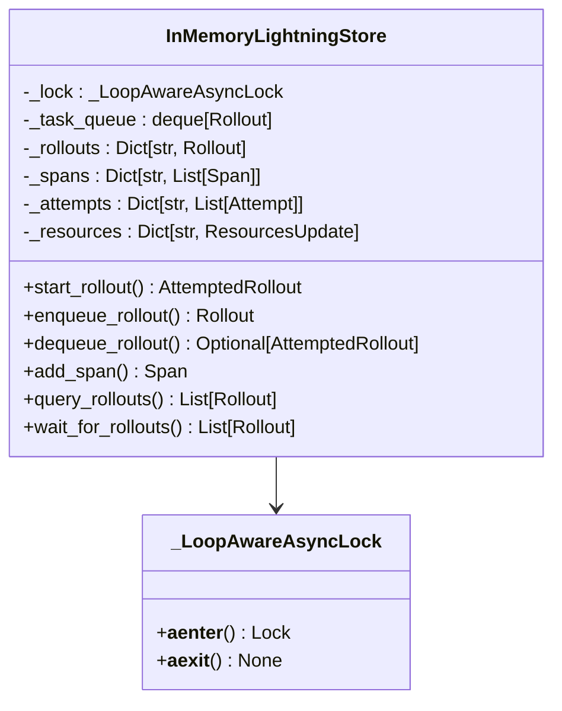
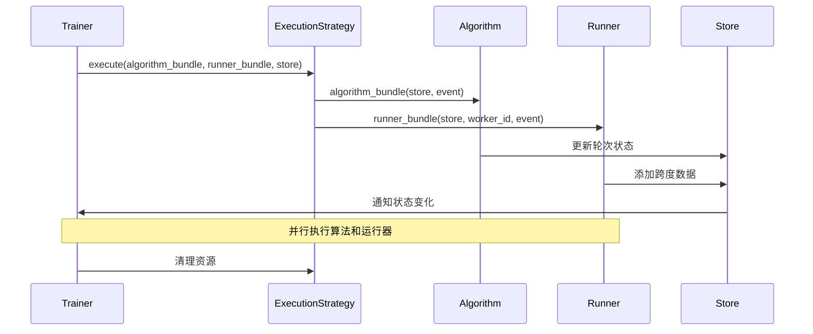
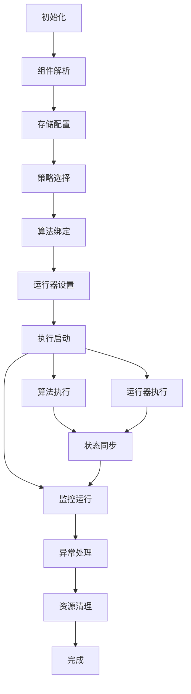
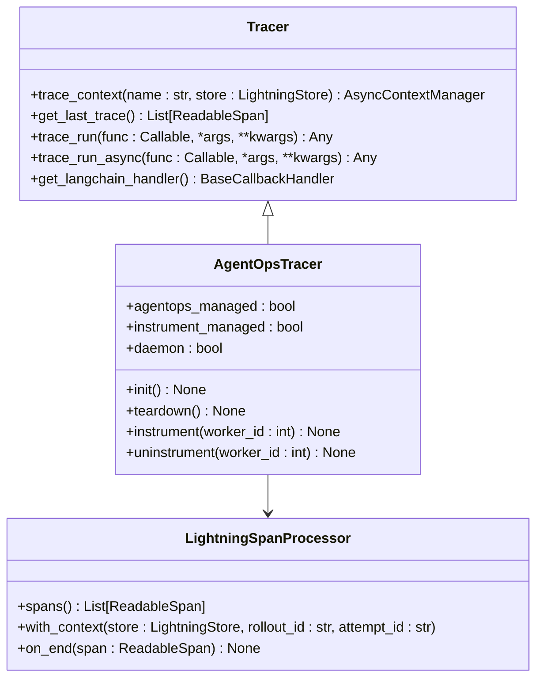
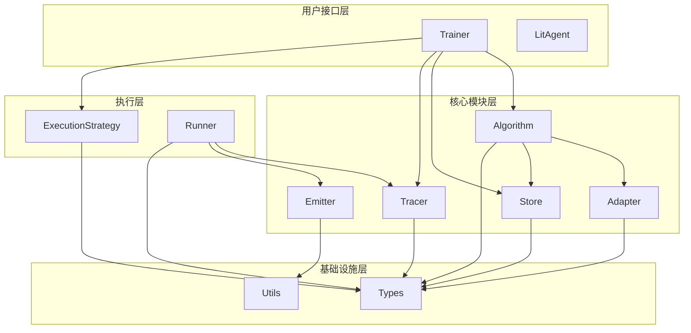

# 核心模块

<cite>
**本文档中引用的文件**
- [agentlightning/__init__.py](file://agentlightning/__init__.py)
- [agentlightning/adapter/base.py](file://agentlightning/adapter/base.py)
- [agentlightning/algorithm/base.py](file://agentlightning/algorithm/base.py)
- [agentlightning/emitter/message.py](file://agentlightning/emitter/message.py)
- [agentlightning/emitter/reward.py](file://agentlightning/emitter/reward.py)
- [agentlightning/emitter/utils.py](file://agentlightning/emitter/utils.py)
- [agentlightning/store/base.py](file://agentlightning/store/base.py)
- [agentlightning/store/memory.py](file://agentlightning/store/memory.py)
- [agentlightning/trainer/trainer.py](file://agentlightning/trainer/trainer.py)
- [agentlightning/trainer/registry.py](file://agentlightning/trainer/registry.py)
- [agentlightning/tracer/base.py](file://agentlightning/tracer/base.py)
- [agentlightning/tracer/agentops.py](file://agentlightning/tracer/agentops.py)
- [agentlightning/adapter/messages.py](file://agentlightning/adapter/messages.py)
- [agentlightning/adapter/triplet.py](file://agentlightning/adapter/triplet.py)
- [agentlightning/algorithm/apo/apo.py](file://agentlightning/algorithm/apo/apo.py)
- [agentlightning/algorithm/fast.py](file://agentlightning/algorithm/fast.py)
- [agentlightning/types/core.py](file://agentlightning/types/core.py)
- [agentlightning/execution/base.py](file://agentlightning/execution/base.py)
</cite>

## 目录
1. [概述](#概述)
2. [模块架构总览](#模块架构总览)
3. [Adapter 模块](#adapter-模块)
4. [Algorithm 模块](#algorithm-模块)
5. [Emitter 模块](#emitter-模块)
6. [Store 模块](#store-模块)
7. [Trainer 模块](#trainer-模块)
8. [Tracer 模块](#tracer-模块)
9. [模块间依赖关系](#模块间依赖关系)
10. [扩展点与自定义开发](#扩展点与自定义开发)
11. [性能考量](#性能考量)
12. [故障排查指南](#故障排查指南)
13. [最佳实践](#最佳实践)

## 概述

Agent Lightning 是一个面向智能体训练的框架，提供了完整的基础设施来支持强化学习算法的开发和部署。该框架采用模块化设计，通过六个核心模块（Adapter、Algorithm、Emitter、Store、Trainer 和 Tracer）实现高度可扩展的架构。

### 核心设计理念

- **模块化架构**：每个模块承担特定职责，通过标准化接口进行交互
- **可扩展性**：提供丰富的扩展点，支持自定义组件开发
- **异步优先**：充分利用异步编程模型提升并发性能
- **可观测性**：内置完整的追踪和监控机制
- **生产就绪**：支持多种执行策略和存储后端

## 模块架构总览



**图表来源**
- [agentlightning/trainer/trainer.py](file://agentlightning/trainer/trainer.py#L1-L50)
- [agentlightning/algorithm/base.py](file://agentlightning/algorithm/base.py#L1-L50)
- [agentlightning/store/base.py](file://agentlightning/store/base.py#L1-L50)

## Adapter 模块

Adapter 模块负责在不同数据格式之间进行转换，是连接各种组件的桥梁。

### 核心类与接口

#### Adapter 基础类



**图表来源**
- [agentlightning/adapter/base.py](file://agentlightning/adapter/base.py#L15-L95)

#### 主要适配器实现

1. **TraceToMessages**：将追踪数据转换为 OpenAI 兼容的消息格式
2. **TracerTraceToTriplet**：将追踪数据转换为强化学习三元组
3. **LlmProxyTraceToTriplet**：将 LLM 代理数据转换为三元组

### 使用场景示例

- **文本生成任务**：将智能体输出转换为对话消息格式
- **强化学习训练**：将轨迹数据转换为算法可用的三元组格式
- **模型微调**：将训练数据转换为指定格式用于模型微调

### 自定义开发指南

开发者可以通过继承 `Adapter` 类来创建自定义适配器：

```python
class CustomAdapter(Adapter[SourceType, TargetType]):
    def adapt(self, source: SourceType) -> TargetType:
        # 实现自定义转换逻辑
        pass
```

**章节来源**
- [agentlightning/adapter/base.py](file://agentlightning/adapter/base.py#L1-L95)
- [agentlightning/adapter/messages.py](file://agentlightning/adapter/messages.py#L1-L50)
- [agentlightning/adapter/triplet.py](file://agentlightning/adapter/triplet.py#L1-L100)

## Algorithm 模块

Algorithm 模块定义了训练算法的抽象接口，是整个框架的核心计算引擎。

### 核心架构



**图表来源**
- [agentlightning/algorithm/base.py](file://agentlightning/algorithm/base.py#L20-L163)
- [agentlightning/algorithm/fast.py](file://agentlightning/algorithm/fast.py#L15-L242)
- [agentlightning/algorithm/apo/apo.py](file://agentlightning/algorithm/apo/apo.py#L80-L200)

### 主要算法实现

#### Baseline 算法
- **特点**：轻量级基准算法，适合快速验证
- **用途**：开发调试、系统测试
- **性能**：同步执行，适合小规模实验

#### APO 算法
- **特点**：自动提示优化算法，基于文本梯度
- **核心功能**：
  - 文本梯度计算
  - 提示模板优化
  - 束搜索策略
- **适用场景**：提示工程优化、智能体提示改进

### 异步与同步支持

算法模块同时支持同步和异步执行模式：

```python
# 同步算法
class SyncAlgorithm(Algorithm):
    def run(self, train_dataset, val_dataset):
        # 同步执行逻辑
        
# 异步算法  
class AsyncAlgorithm(Algorithm):
    async def run(self, train_dataset, val_dataset):
        # 异步执行逻辑
```

**章节来源**
- [agentlightning/algorithm/base.py](file://agentlightning/algorithm/base.py#L1-L163)
- [agentlightning/algorithm/fast.py](file://agentlightning/algorithm/fast.py#L1-L242)
- [agentlightning/algorithm/apo/apo.py](file://agentlightning/algorithm/apo/apo.py#L1-L200)

## Emitter 模块

Emitter 模块负责生成和传播各种类型的事件和指标，是系统可观测性的基础。

### 核心组件



**图表来源**
- [agentlightning/emitter/message.py](file://agentlightning/emitter/message.py#L10-L34)
- [agentlightning/emitter/reward.py](file://agentlightning/emitter/reward.py#L15-L50)
- [agentlightning/emitter/utils.py](file://agentlightning/emitter/utils.py#L10-L23)

### 消息发射器

消息发射器提供统一的日志记录和事件传播机制：

- **语义化消息**：将普通文本转换为结构化跟踪跨度
- **类型安全**：确保消息格式的一致性和可解析性
- **集成支持**：与 OpenTelemetry 生态系统无缝集成

### 奖励发射器

奖励发射器专门处理强化学习中的奖励信号：

#### 核心功能
1. **奖励值提取**：从各种源提取数值型奖励
2. **格式标准化**：统一不同来源的奖励格式
3. **历史追踪**：维护奖励序列的历史记录

#### 支持的数据源
- AgentOps 装饰器标记的奖励
- 显式奖励发射器
- 自定义奖励函数

### 使用示例

```python
# 发射消息
emit_message("训练过程开始")

# 发射奖励
reward_value = 0.8
emit_reward(reward_value)

# 获取最终奖励
final_reward = find_final_reward(spans)
```

**章节来源**
- [agentlightning/emitter/message.py](file://agentlightning/emitter/message.py#L1-L34)
- [agentlightning/emitter/reward.py](file://agentlightning/emitter/reward.py#L1-L239)
- [agentlightning/emitter/utils.py](file://agentlightning/emitter/utils.py#L1-L23)

## Store 模块

Store 模块提供持久化的控制平面，协调算法和运行器之间的交互。

### 核心数据模型



**图表来源**
- [agentlightning/store/base.py](file://agentlightning/store/base.py#L50-L150)
- [agentlightning/types/core.py](file://agentlightning/types/core.py#L100-L200)

### 核心操作接口

#### 轮次生命周期管理
- **启动轮次**：立即创建初始尝试并开始执行
- **入队轮次**：将轮次放入调度队列等待处理
- **出队轮次**：从队列中取出最老的轮次进行处理

#### 尝试跟踪
- **尝试创建**：为现有轮次创建新的执行尝试
- **状态更新**：跟踪尝试的进度和状态变化
- **心跳机制**：定期更新活动状态防止超时

#### 跨度摄入
- **原始跨度**：直接存储预构建的跨度对象
- **OTEL 跨度**：转换并存储 OpenTelemetry 跨度
- **序列管理**：维护跨度过滤和排序

### 内存存储实现



**图表来源**
- [agentlightning/store/memory.py](file://agentlightning/store/memory.py#L150-L300)

### 性能特性

#### 内存管理
- **阈值控制**：基于内存使用情况的自动清理机制
- **LRU 策略**：最近最少使用的轮次优先被清理
- **容量检测**：动态检测系统内存容量

#### 并发安全
- **异步锁**：线程安全的异步锁实现
- **弱引用**：避免循环引用导致的内存泄漏
- **原子操作**：保证关键操作的原子性

**章节来源**
- [agentlightning/store/base.py](file://agentlightning/store/base.py#L1-L516)
- [agentlightning/store/memory.py](file://agentlightning/store/memory.py#L1-L300)

## Trainer 模块

Trainer 模块是高层编排层，将 Algorithm、Runner、Store 等组件整合到统一的训练流程中。

### 核心架构



**图表来源**
- [agentlightning/trainer/trainer.py](file://agentlightning/trainer/trainer.py#L400-L500)

### 组件配置系统

Trainer 使用灵活的组件配置系统，支持多种初始化方式：

#### 配置规范类型
1. **实例对象**：直接传入已创建的对象
2. **类类型**：传入类构造函数
3. **工厂函数**：传入返回对象的函数
4. **字符串标识**：通过注册表查找组件
5. **字典配置**：包含类型和其他参数的配置字典

### 训练模式

#### fit() 方法
- **完整训练**：执行完整的算法/运行器训练循环
- **数据集驱动**：基于提供的训练和验证数据集
- **异步执行**：支持异步算法和运行器

#### dev() 方法
- **快速调试**：使用同步算法进行快速验证
- **开发模式**：专为开发者工作流优化
- **基准测试**：作为系统功能的基准测试

### 生命周期管理



**图表来源**
- [agentlightning/trainer/trainer.py](file://agentlightning/trainer/trainer.py#L200-L300)

### 扩展点

#### 钩子系统
- **trace_start**：跟踪开始时触发
- **trace_end**：跟踪结束时触发  
- **rollout_start**：轮次开始时触发
- **rollout_end**：轮次结束时触发

#### 自定义组件
开发者可以扩展以下组件：
- **执行策略**：自定义进程/线程管理
- **运行器**：自定义智能体执行逻辑
- **适配器**：自定义数据转换逻辑
- **追踪器**：自定义观测性集成

**章节来源**
- [agentlightning/trainer/trainer.py](file://agentlightning/trainer/trainer.py#L1-L557)
- [agentlightning/trainer/registry.py](file://agentlightning/trainer/registry.py#L1-L13)

## Tracer 模块

Tracer 模块提供统一的代码执行追踪能力，捕获执行过程中的所有相关信息。

### 核心接口



**图表来源**
- [agentlightning/tracer/base.py](file://agentlightning/tracer/base.py#L20-L141)
- [agentlightning/tracer/agentops.py](file://agentlightning/tracer/agentops.py#L30-L150)

### 上下文管理

Tracer 提供强大的上下文管理功能：

#### 异步上下文
```python
async with tracer.trace_context(name="my_task"):
    # 执行需要追踪的代码
    await my_agent_function()
```

#### 同步上下文
```python
with tracer.trace_context(name="my_task"):
    # 执行需要追踪的代码
    my_agent_function()
```

### AgentOps 集成

AgentOpsTracer 提供与 AgentOps 平台的深度集成：

#### 自动化特性
- **客户端管理**：自动初始化 AgentOps 客户端
- **服务器管理**：自动启动本地 AgentOps 服务器
- **环境配置**：自动设置必要的环境变量
- **处理器集成**：自动添加跨度处理器

#### 多线程支持
- **事件循环**：为每个线程维护独立的事件循环
- **守护进程**：可配置的守护进程模式
- **线程安全**：确保多线程环境下的安全性

### LangChain 集成

Tracer 提供专门的 LangChain 回调处理器：

```python
handler = tracer.get_langchain_handler(tags=["my_agent"])
# 在 LangChain 中使用
agent = initialize_agent(handler=handler)
```

### 性能优化

#### 异步处理
- **后台线程**：跨度处理在专用线程中进行
- **非阻塞**：避免影响主执行流程
- **批量处理**：支持批量写入存储

#### 内存管理
- **缓冲区**：使用缓冲区减少 I/O 操作
- **延迟写入**：批量提交跨度数据
- **资源清理**：自动清理临时资源

**章节来源**
- [agentlightning/tracer/base.py](file://agentlightning/tracer/base.py#L1-L141)
- [agentlightning/tracer/agentops.py](file://agentlightning/tracer/agentops.py#L1-L200)

## 模块间依赖关系

### 依赖图谱



**图表来源**
- [agentlightning/__init__.py](file://agentlightning/__init__.py#L1-L20)
- [agentlightning/trainer/trainer.py](file://agentlightning/trainer/trainer.py#L1-L50)

### 数据流向

#### 训练流程数据流
1. **输入数据** → Store.enqueue_rollout()
2. **轮次分配** → Runner.dequeue_rollout()
3. **执行追踪** → Tracer.trace_context()
4. **结果收集** → Store.add_span()
5. **算法处理** → Algorithm.run()
6. **适配转换** → Adapter.adapt()
7. **存储持久化** → Store.update_rollout()

#### 关键依赖关系

| 模块对 | 依赖方向 | 数据流向 | 作用 |
|--------|----------|----------|------|
| Trainer ↔ Algorithm | 双向 | 配置传递 | 算法配置和状态管理 |
| Algorithm ↔ Store | 单向 | 数据读写 | 轮次和资源管理 |
| Algorithm ↔ Adapter | 单向 | 数据转换 | 轨迹格式化 |
| Runner ↔ Tracer | 单向 | 追踪数据 | 执行过程监控 |
| Runner ↔ Store | 单向 | 状态更新 | 轮次状态同步 |
| Tracer ↔ Emitter | 单向 | 事件传播 | 观测性数据 |

### 循环依赖处理

框架采用弱引用和延迟初始化来避免循环依赖：

- **弱引用**：在 Algorithm 和 Trainer 之间使用弱引用
- **延迟绑定**：组件在运行时才建立具体连接
- **接口隔离**：通过抽象接口解耦具体实现

**章节来源**
- [agentlightning/algorithm/base.py](file://agentlightning/algorithm/base.py#L30-L80)
- [agentlightning/trainer/trainer.py](file://agentlightning/trainer/trainer.py#L100-L200)

## 扩展点与自定义开发

### Adapter 扩展

#### 创建自定义适配器
```python
class CustomDataAdapter(Adapter[InputType, OutputType]):
    def adapt(self, source: InputType) -> OutputType:
        # 实现自定义转换逻辑
        return transformed_data
```

#### 适配器注册
```python
# 在 Trainer 中使用
trainer = Trainer(adapter=CustomDataAdapter())
```

### Algorithm 扩展

#### 自定义算法基类
```python
class CustomAlgorithm(Algorithm):
    def run(self, train_dataset, val_dataset):
        # 实现自定义训练逻辑
        pass
```

#### 快速算法扩展
```python
class CustomFastAlgorithm(FastAlgorithm):
    def run(self, train_dataset, val_dataset):
        # 实现自定义快速算法逻辑
        pass
```

### Tracer 扩展

#### 自定义追踪器
```python
class CustomTracer(Tracer):
    def trace_context(self, name, store=None, rollout_id=None, attempt_id=None):
        # 实现自定义追踪逻辑
        pass
```

### Store 扩展

#### 自定义存储后端
```python
class CustomStore(LightningStore):
    def add_span(self, span):
        # 实现自定义存储逻辑
        pass
```

### Runner 扩展

#### 自定义运行器
```python
class CustomRunner(Runner):
    def iter(self, event):
        # 实现自定义执行逻辑
        pass
```

### 扩展开发最佳实践

#### 接口一致性
- 遵循标准接口定义
- 正确处理异常情况
- 实现适当的资源清理

#### 性能考虑
- 异步优先设计
- 最小化内存占用
- 高效的并发处理

#### 测试策略
- 单元测试覆盖
- 集成测试验证
- 性能基准测试

**章节来源**
- [agentlightning/adapter/base.py](file://agentlightning/adapter/base.py#L15-L50)
- [agentlightning/algorithm/base.py](file://agentlightning/algorithm/base.py#L20-L80)
- [agentlightning/tracer/base.py](file://agentlightning/tracer/base.py#L20-L80)

## 性能考量

### 并发性能优化

#### 异步执行模型
- **非阻塞 I/O**：所有 I/O 操作都支持异步
- **事件驱动**：基于事件循环的高效调度
- **协程池**：合理利用协程进行并发控制

#### 内存管理优化
- **对象池**：重用频繁创建的对象
- **弱引用**：避免内存泄漏
- **垃圾回收**：及时释放不再使用的资源

### 存储性能优化

#### 内存存储优化
- **分页加载**：大数据集的分页处理
- **压缩存储**：跨度数据的压缩存储
- **缓存策略**：热点数据的缓存机制

#### 并发控制
- **读写分离**：读操作和写操作的分离
- **乐观锁**：减少锁竞争
- **批量操作**：合并多个操作以提高效率

### 网络通信优化

#### 执行策略选择
- **共享内存**：同一进程内的零拷贝通信
- **客户端-服务器**：进程间通信的优化
- **混合模式**：根据场景选择最优策略

#### 数据传输优化
- **序列化优化**：高效的序列化格式
- **压缩传输**：网络传输的数据压缩
- **批量传输**：减少网络往返次数

### 监控和诊断

#### 性能指标
- **吞吐量**：每秒处理的轮次数
- **延迟**：从请求到响应的时间
- **资源利用率**：CPU、内存、网络使用率

#### 调优建议
- **资源配置**：根据负载调整资源分配
- **缓存策略**：合理设置缓存大小和策略
- **并发度控制**：平衡并发度和资源消耗

**章节来源**
- [agentlightning/store/memory.py](file://agentlightning/store/memory.py#L200-L400)
- [agentlightning/execution/base.py](file://agentlightning/execution/base.py#L50-L107)

## 故障排查指南

### 常见问题诊断

#### 连接问题
**症状**：无法连接到存储或追踪服务
**排查步骤**：
1. 检查网络连接状态
2. 验证服务端口是否开放
3. 确认防火墙设置
4. 检查认证凭据

**解决方案**：
```python
# 增加连接超时时间
store = LightningStore(timeout=30.0)

# 使用备用存储后端
store = SQLiteStore(path="/tmp/agentlightning.db")
```

#### 内存不足
**症状**：程序崩溃或性能急剧下降
**排查步骤**：
1. 监控内存使用情况
2. 检查内存泄漏
3. 分析大对象占用
4. 查看垃圾回收日志

**解决方案**：
```python
# 调整内存阈值
store = InMemoryLightningStore(
    eviction_memory_threshold=0.5,  # 50% 内存阈值
    safe_memory_threshold=0.4       # 40% 安全阈值
)

# 启用垃圾回收
import gc
gc.collect()
```

#### 性能问题
**症状**：训练速度慢或响应延迟高
**排查步骤**：
1. 分析 CPU 使用率
2. 检查 I/O 瓶颈
3. 监控网络延迟
4. 分析算法复杂度

**解决方案**：
```python
# 使用更快的执行策略
trainer = Trainer(strategy="shm")  # 共享内存策略

# 调整批处理大小
trainer = Trainer(max_rollouts=100)

# 启用异步执行
algorithm = AsyncAlgorithm()
```

### 日志和调试

#### 日志级别配置
```python
import logging
logging.getLogger("agentlightning").setLevel(logging.DEBUG)
```

#### 调试工具
- **跨度可视化**：使用 `TraceTree.visualize()` 生成树状图
- **状态检查**：查询存储状态和轮次信息
- **性能分析**：监控关键路径的执行时间

#### 错误恢复
```python
try:
    trainer.fit(algorithm, dataset)
except Exception as e:
    logger.error(f"训练失败: {e}")
    # 实施恢复策略
    trainer = Trainer(dev=True)  # 切换到开发模式
```

### 监控和告警

#### 关键指标监控
- **轮次状态分布**：监控成功、失败、重试的比例
- **资源使用率**：CPU、内存、磁盘使用情况
- **网络健康状态**：连接数、延迟、错误率

#### 告警配置
```python
# 设置健康检查间隔
store.healthcheck_interval = 30.0

# 配置告警阈值
store.memory_warning_threshold = 0.8
store.timeout_warning_threshold = 60.0
```

**章节来源**
- [agentlightning/store/base.py](file://agentlightning/store/base.py#L400-L516)
- [agentlightning/tracer/agentops.py](file://agentlightning/tracer/agentops.py#L200-L374)

## 最佳实践

### 开发阶段最佳实践

#### 项目结构组织
```
my_agent_project/
├── configs/
│   ├── development.yaml
│   └── production.yaml
├── src/
│   ├── agents/
│   ├── algorithms/
│   ├── adapters/
│   └── utils/
├── tests/
└── examples/
```

#### 配置管理
```python
# 使用配置文件管理
from agentlightning.config import load_config

config = load_config("configs/development.yaml")
trainer = Trainer(**config.trainer)
```

#### 版本控制
- **语义化版本**：遵循语义化版本控制
- **变更日志**：维护详细的变更日志
- **分支策略**：使用 Git Flow 或类似策略

### 生产环境最佳实践

#### 部署策略
- **容器化部署**：使用 Docker 容器化应用
- **Kubernetes 部署**：利用 Kubernetes 进行编排
- **蓝绿部署**：零停机时间的部署策略

#### 监控和运维
```python
# 集成监控系统
import prometheus_client

# 注册指标
training_duration = prometheus_client.Histogram(
    'training_duration_seconds',
    'Training duration in seconds'
)

@training_duration.time()
def train_model():
    # 训练逻辑
    pass
```

#### 安全考虑
- **访问控制**：实施严格的访问控制
- **数据加密**：敏感数据的加密存储
- **审计日志**：完整的操作审计日志

### 性能优化最佳实践

#### 算法优化
- **批处理**：合理设置批处理大小
- **缓存策略**：实现智能缓存机制
- **并行化**：充分利用多核处理器

#### 存储优化
```python
# 选择合适的存储后端
if large_scale_training:
    store = SQLiteStore(path="/data/agentlightning.db")
else:
    store = InMemoryLightningStore()
```

#### 网络优化
- **连接池**：复用网络连接
- **压缩传输**：启用数据压缩
- **CDN 加速**：静态资源 CDN 加速

### 团队协作最佳实践

#### 代码规范
- **类型注解**：使用完整的类型注解
- **文档字符串**：为公共接口编写文档
- **单元测试**：保持高覆盖率的测试

#### 版本控制
- **提交规范**：使用约定式提交格式
- **分支命名**：清晰的分支命名约定
- **代码审查**：实施强制代码审查流程

#### 文档维护
- **API 文档**：自动生成 API 文档
- **使用指南**：提供详细的使用指南
- **最佳实践**：总结团队的最佳实践

**章节来源**
- [agentlightning/trainer/trainer.py](file://agentlightning/trainer/trainer.py#L500-L557)
- [agentlightning/algorithm/fast.py](file://agentlightning/algorithm/fast.py#L50-L150)