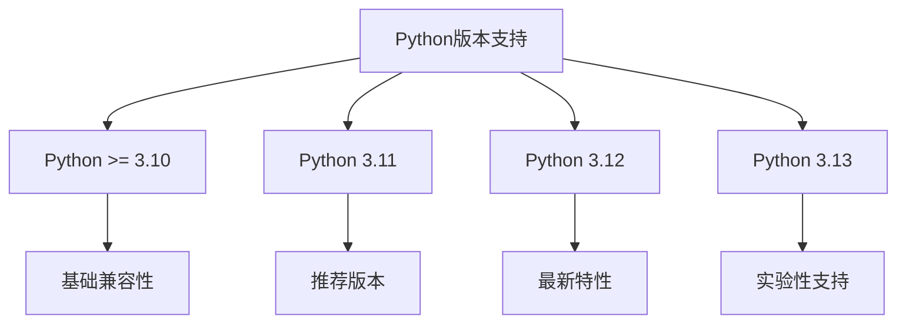
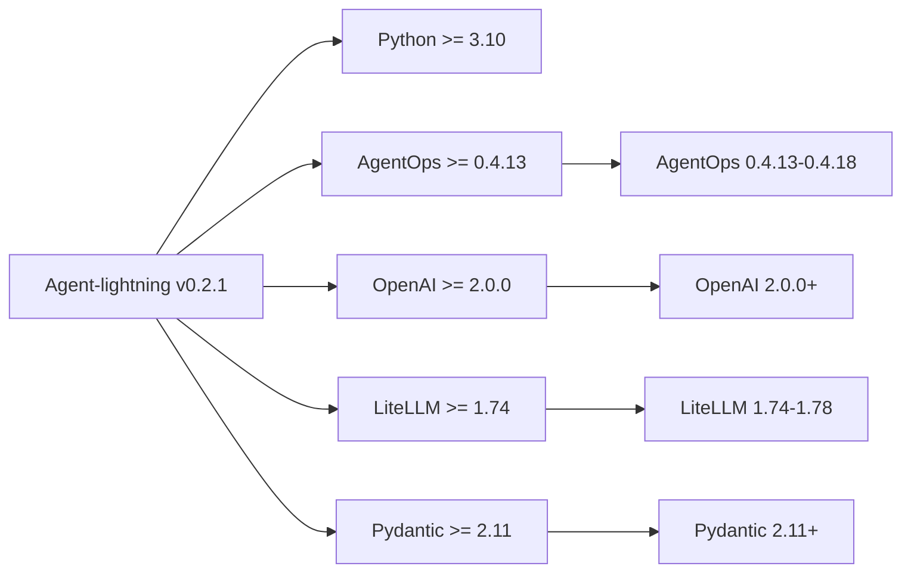
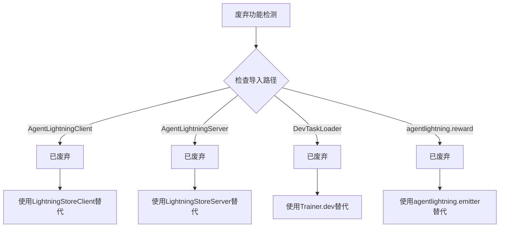
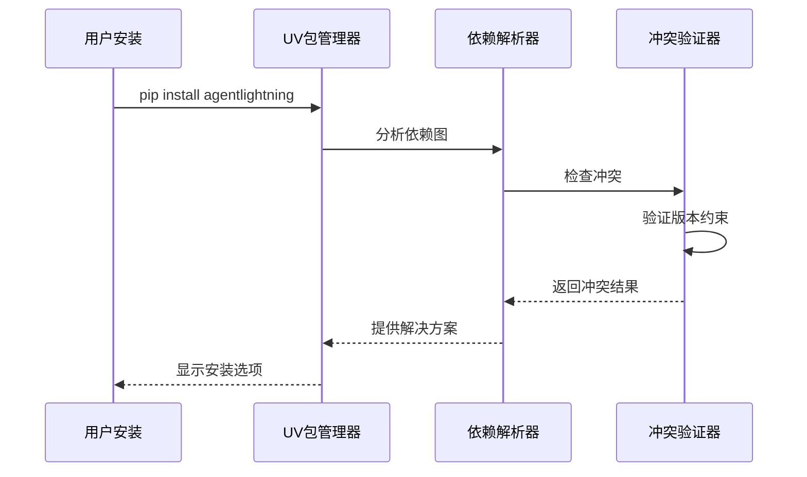
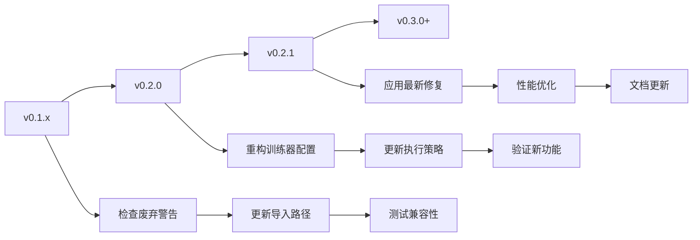
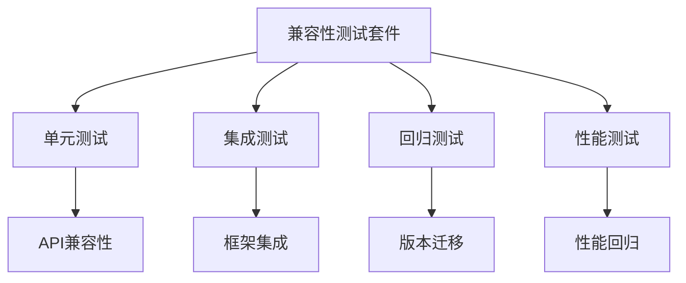

# 版本与兼容性

<cite>
**本文档中引用的文件**
- [pyproject.toml](file://pyproject.toml)
- [agentlightning/__init__.py](file://agentlightning/__init__.py)
- [docs/changelog.md](file://docs/changelog.md)
- [scripts/bump_version.sh](file://scripts/bump_version.sh)
- [README.md](file://README.md)
- [mkdocs.yml](file://mkdocs.yml)
- [pyrightconfig.json](file://pyrightconfig.json)
- [pyrightconfig.fast.json](file://pyrightconfig.fast.json)
- [agentlightning/runner/legacy.py](file://agentlightning/runner/legacy.py)
- [agentlightning/client.py](file://agentlightning/client.py)
- [agentlightning/server.py](file://agentlightning/server.py)
- [examples/README.md](file://examples/README.md)
</cite>

## 目录
1. [简介](#简介)
2. [版本管理策略](#版本管理策略)
3. [版本发布历史](#版本发布历史)
4. [版本兼容性矩阵](#版本兼容性矩阵)
5. [废弃功能与迁移指南](#废弃功能与迁移指南)
6. [依赖关系管理](#依赖关系管理)
7. [版本升级路径](#版本升级路径)
8. [向后兼容性保证](#向后兼容性保证)
9. [故障排除指南](#故障排除指南)
10. [最佳实践建议](#最佳实践建议)

## 简介

Agent-lightning采用语义化版本控制（Semantic Versioning）和Python PEP 440标准，确保版本间的兼容性和可预测性。本文档详细记录了版本发布历史、功能变更、废弃政策以及版本兼容性信息，为用户提供清晰的版本升级路径和迁移指南。

## 版本管理策略

### 版本命名规则

Agent-lightning遵循以下版本命名规范：

- **主版本号**：重大架构变更或不兼容更新
- **次版本号**：新功能添加，保持向后兼容
- **修订版本号**：错误修复和小改进
- **预发布标识**：alpha(a)、beta(b)、候选版(rc)、开发版(dev)
- **发布后标识**：post版本用于发布后的微调

### 支持的Python版本

根据项目配置，Agent-lightning支持以下Python版本：



**图表来源**
- [pyproject.toml](file://pyproject.toml#L5-L6)
- [pyrightconfig.json](file://pyrightconfig.json#L8-L10)

### 版本验证机制

系统使用PEP 440合规的版本格式验证器：

**节来源**
- [scripts/bump_version.sh](file://scripts/bump_version.sh#L20-L25)

## 版本发布历史

### 当前稳定版本 (v0.2.1)

Agent-lightning v0.2.1是v0.2.0的稳定化版本，包含以下改进：

#### 主要改进
- **Bug修复**：
  - 修复LiteLLM在同进程多次重启的问题 (#174, #206)
  - 解决多服务器使用相同模型时的模型名称选择问题 (#197)
  - 修复存储端口冲突处理 (#227)

- **新功能**：
  - 添加训练器端口选项用于客户端-服务器策略 (#198)

- **文档改进**：
  - 添加跨机器启动工作节点教程 (#213)
  - 增加VERL框架链接 (#210)
  - 增加vLLM博客链接 (#215)

**节来源**
- [docs/changelog.md](file://docs/changelog.md#L1-L25)

### v0.2.0 核心版本

v0.2.0引入了重大框架改进和新执行策略：

#### 核心增强
- **Lightning Store**：统一的Agent-lightning核心存储接口
- **Emitter**：将任意对象作为跨度发射到存储
- **Adapter和Tracer**：适配OpenAI类似消息和OpenTelemetry虚拟跟踪器
- **LLM代理**：LLM代理成为Agent-lightning的一等公民
- **Agent Runner**：提供更模块化和健壮的运行器设计
- **嵌入式算法**：算法直接嵌入训练器以简化操作
- **新执行策略**：引入客户端-服务器和共享内存执行模型

#### 开发者体验
- 迁移到1ES构建和CI管道
- 采用uv作为依赖管理器
- 添加GPU测试工作流
- 增强调试用户体验

**节来源**
- [docs/changelog.md](file://docs/changelog.md#L27-L85)

### v0.1.x 初始版本系列

#### v0.1.2 (2025年8月12日)
- 基础文档添加
- RAG示例实现

#### v0.1.1 (2025年8月6日)
- 禁用HTTP跟踪器测试
- 修复v0.1中的训练器错误

#### v0.1.0 (2025年8月4日)
- 首个发布版本
- 提供零代码更改的AI代理优化能力
- 支持多种代理框架集成

**节来源**
- [docs/changelog.md](file://docs/changelog.md#L87-L107)

## 版本兼容性矩阵

### Python版本兼容性

| 功能组件 | Python 3.10 | Python 3.11 | Python 3.12 | Python 3.13 |
|----------|-------------|-------------|-------------|-------------|
| 核心功能 | ✅ 完全支持 | ✅ 推荐 | ✅ 最佳 | ⚠️ 实验性 |
| 性能优化 | ✅ 基础 | ✅ 优化 | ✅ 最优 | ⚠️ 可能不稳定 |
| 类型检查 | ✅ 基础 | ✅ 完整 | ✅ 最新 | ⚠️ 部分支持 |
| 并发支持 | ✅ 标准 | ✅ 改进 | ✅ 异步优化 | ⚠️ 新特性 |

### 依赖库版本兼容性



**图表来源**
- [pyproject.toml](file://pyproject.toml#L7-L20)

### 第三方框架兼容性

| 框架类型 | 兼容版本 | 状态 | 注意事项 |
|----------|----------|------|----------|
| LangChain | < 1.0 | ✅ 完全兼容 | 需要langchain-community |
| AutoGen | 最新版 | ✅ 完全兼容 | 支持agentchat |
| CrewAI | >= 1.2.0 | ✅ 完全兼容 | 包含tools模块 |
| Anthropic | 最新版 | ✅ 完全兼容 | Claude模型支持 |
| OpenAI SDK | >= 2.0.0 | ✅ 完全兼容 | 向后兼容性好 |
| Agent Framework | 最新版 | ✅ 完全兼容 | 微软官方支持 |

**节来源**
- [pyproject.toml](file://pyproject.toml#L100-L130)

## 废弃功能与迁移指南

### 已废弃的功能

Agent-lightning维护详细的废弃功能列表，确保用户能够平滑迁移：

#### 核心API废弃



**图表来源**
- [agentlightning/__init__.py](file://agentlightning/__init__.py#L6-L14)
- [agentlightning/client.py](file://agentlightning/client.py#L60)
- [agentlightning/server.py](file://agentlightning/server.py#L220)

#### 具体废弃项

1. **AgentLightningClient**：已废弃，使用`LightningStoreClient`替代
2. **AgentLightningServer**：已废弃，使用`LightningStoreServer`替代  
3. **DevTaskLoader**：已废弃，使用`Trainer.dev`替代
4. **agentlightning.reward**：已废弃，使用`agentlightning.emitter`替代
5. **emit_reward装饰器**：已废弃，使用[`emit_reward`][agentlightning.emit_reward]替代

**节来源**
- [agentlightning/client.py](file://agentlightning/client.py#L60)
- [agentlightning/server.py](file://agentlightning/server.py#L220)
- [agentlightning/emitter/reward.py](file://agentlightning/emitter/reward.py#L63)
- [agentlightning/reward.py](file://agentlightning/reward.py#L6)

### 迁移时间线

| 版本 | 废弃日期 | 迁移截止 | 支持状态 |
|------|----------|----------|----------|
| v0.1.x | 发布时 | v0.2.0 | ✅ 完全支持 |
| v0.2.0 | 2025-10-22 | v0.3.0 | ⚠️ 警告模式 |
| v0.3.0 | 2025-12-01 | v0.4.0 | ❌ 移除 |

### 迁移步骤

#### 1. 更新导入路径

```python
# 旧代码
from agentlightning import AgentLightningClient
from agentlightning import AgentLightningServer
from agentlightning import DevTaskLoader

# 新代码
from agentlightning.store import LightningStoreClient
from agentlightning.store import LightningStoreServer
from agentlightning.trainer import Trainer
```

#### 2. 更新配置参数

```python
# 旧配置
trainer = Trainer(
    n_workers=4,
    max_tasks=100,
    triplet_exporter=adapter
)

# 新配置  
trainer = Trainer(
    n_runners=4,
    max_rollouts=100,
    adapter=adapter
)
```

**节来源**
- [agentlightning/trainer/trainer.py](file://agentlightning/trainer/trainer.py#L160-L180)

## 依赖关系管理

### 核心依赖组

Agent-lightning定义了多个依赖组以满足不同使用场景：

```mermaid
graph TB
A[依赖组管理] --> B[核心依赖]
A --> C[可选依赖]
A --> D[开发依赖]
A --> E[实验性依赖]
B --> F[基础功能]
C --> G[特定框架支持]
D --> H[开发工具]
E --> I[前沿功能]
F --> J[agentops>=0.4.13<br/>openai>=2.0.0<br/>litellm[proxy]>=1.74]
G --> K[langchain<br/>autogen<br/>crewai]
H --> L[pytest<br/>black<br/>pyright]
I --> M[tinker>=0.2.2<br/>trl<br/>unsloth]
```

**图表来源**
- [pyproject.toml](file://pyproject.toml#L7-L130)

### 版本约束策略

#### 稳定版本组
- **core-stable**：稳定的生产环境依赖
- **torch-stable**：PyTorch稳定版本组合
- **agents**：主流代理框架集成包

#### 传统版本组
- **core-legacy**：向后兼容的传统版本
- **torch-legacy**：PyTorch传统版本组合

**节来源**
- [pyproject.toml](file://pyproject.toml#L40-L85)

### 冲突解决机制

系统内置冲突检测和解决机制：



**图表来源**
- [pyproject.toml](file://pyproject.toml#L132-L145)

## 版本升级路径

### 升级策略

#### 渐进式升级路径



#### 自动化升级脚本

系统提供版本升级自动化脚本：

**节来源**
- [scripts/bump_version.sh](file://scripts/bump_version.sh#L1-L66)

### 升级检查清单

#### 预升级检查
- [ ] 备份当前配置和数据
- [ ] 检查Python版本兼容性
- [ ] 验证现有依赖版本
- [ ] 测试环境隔离

#### 升级执行
- [ ] 停止所有Agent-lightning服务
- [ ] 更新包版本
- [ ] 运行兼容性测试
- [ ] 验证功能正常

#### 后升级验证
- [ ] 检查废弃警告
- [ ] 验证性能指标
- [ ] 更新文档和配置
- [ ] 通知团队成员

## 向后兼容性保证

### 兼容性级别

Agent-lightning采用分层兼容性保证：

#### API兼容性
- **主要版本间**：不保证向后兼容
- **次要版本间**：保证向后兼容
- **修订版本间**：完全兼容

#### 数据兼容性
- **存储格式**：长期向后兼容
- **协议版本**：渐进式升级
- **配置格式**：版本化支持

### 兼容性测试



**节来源**
- [examples/README.md](file://examples/README.md#L1-L16)

## 故障排除指南

### 常见兼容性问题

#### 1. Python版本不兼容

**症状**：ImportError或SyntaxError
**解决方案**：
- 检查Python版本：`python --version`
- 升级到支持的版本
- 使用虚拟环境隔离

#### 2. 依赖版本冲突

**症状**：PackageNotFoundError或版本不匹配
**解决方案**：
- 使用uv包管理器：`uv pip install agentlightning`
- 检查依赖组：`pip install agentlightning[agents]`
- 清理缓存：`pip cache purge`

#### 3. 废弃API调用

**症状**：DeprecationWarning或ImportError
**解决方案**：
- 查看废弃警告信息
- 更新导入路径
- 参考迁移指南

### 兼容性诊断工具

#### 版本检查命令

```bash
# 检查Agent-lightning版本
python -c "import agentlightning; print(agentlightning.__version__)"

# 检查Python版本
python --version

# 检查依赖版本
pip list | grep agentlightning
```

#### 兼容性验证脚本

```python
import sys
import agentlightning
from packaging import version

# 检查最小版本要求
MIN_VERSION = "0.2.0"
current_version = agentlightning.__version__

if version.parse(current_version) < version.parse(MIN_VERSION):
    print(f"警告：当前版本{current_version}低于最低要求{MIN_VERSION}")
else:
    print(f"✓ Agent-lightning版本兼容：{current_version}")
```

## 最佳实践建议

### 版本管理最佳实践

#### 1. 版本锁定策略
- 在生产环境中使用精确版本号
- 使用requirements.txt或pyproject.toml锁定版本
- 定期审查和更新依赖版本

#### 2. 渐进式升级
- 在测试环境中先行验证
- 使用蓝绿部署策略
- 准备回滚计划

#### 3. 监控和告警
- 监控版本兼容性指标
- 设置废弃功能使用告警
- 建立版本升级流程

### 开发环境配置

#### 推荐的开发环境设置

```toml
# pyproject.toml
[tool.uv]
required-version = ">=0.9.5"

[dependency-groups]
dev = [
    "pytest",
    "black",
    "pyright",
    "agentlightning[dev]"
]
```

#### 类型检查配置

**节来源**
- [pyrightconfig.json](file://pyrightconfig.json#L1-L18)
- [pyrightconfig.fast.json](file://pyrightconfig.fast.json#L1-L24)

### 生产环境部署

#### 版本验证清单
- [ ] 所有测试通过
- [ ] 性能基准测试达标
- [ ] 兼容性验证完成
- [ ] 文档更新同步
- [ ] 团队培训完成

#### 监控指标
- 版本使用分布
- 兼容性问题报告
- 性能回归检测
- 用户反馈收集

通过遵循这些最佳实践，用户可以确保Agent-lightning系统的稳定运行和持续演进，同时最大化利用新功能带来的价值。