# APO算法示例深度解析

<cite>
**本文档引用的文件**
- [room_selector.py](file://examples/apo/room_selector.py)
- [room_selector_apo.py](file://examples/apo/room_selector_apo.py)
- [apo_custom_algorithm.py](file://examples/apo/apo_custom_algorithm.py)
- [apo_custom_algorithm_trainer.py](file://examples/apo/apo_custom_algorithm_trainer.py)
- [legacy_apo_server.py](file://examples/apo/legacy_apo_server.py)
- [legacy_apo_client.py](file://examples/apo/legacy_apo_client.py)
- [apo_debug.py](file://examples/apo/apo_debug.py)
- [apo.py](file://agentlightning/algorithm/apo/apo.py)
- [README.md](file://examples/apo/README.md)
</cite>

## 目录
1. [引言](#引言)
2. [项目结构概览](#项目结构概览)
3. [核心组件分析](#核心组件分析)
4. [架构设计](#架构设计)
5. [详细组件分析](#详细组件分析)
6. [工作流程详解](#工作流程详解)
7. [自定义算法扩展](#自定义算法扩展)
8. [调试与优化](#调试与优化)
9. [性能考量](#性能考量)
10. [故障排除指南](#故障排除指南)
11. [总结](#总结)

## 引言

APO（Automatic Prompt Optimization）算法是Agent-Lightning框架中的核心自动提示词优化技术，它通过文本梯度和束搜索算法实现提示词的自动化优化，显著提升代理任务的完成率。本示例展示了如何在房间选择场景中应用APO算法，通过迭代优化提示词模板来提高代理的决策准确性。

APO算法体现了元优化的思想，即使用LLM生成的文本梯度来指导提示词的改进过程。这种自适应机制使得代理能够根据具体任务需求自动调整其行为策略，无需人工干预即可获得更好的性能表现。

## 项目结构概览

APO示例项目包含多个互补的教程文件，每个都展示了Agent-Lightning的不同方面：

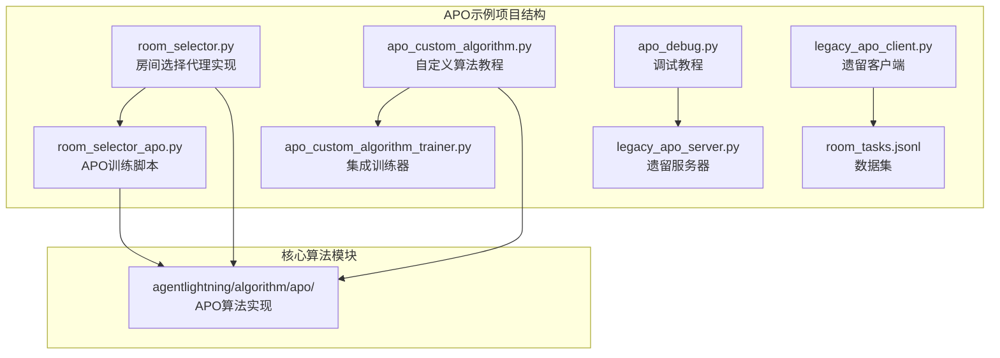

**图表来源**
- [room_selector.py](file://examples/apo/room_selector.py#L1-L50)
- [room_selector_apo.py](file://examples/apo/room_selector_apo.py#L1-L30)
- [apo_custom_algorithm.py](file://examples/apo/apo_custom_algorithm.py#L1-L40)

**章节来源**
- [README.md](file://examples/apo/README.md#L1-L95)

## 核心组件分析

### 房间选择代理系统

房间选择代理是一个基于函数调用的复杂代理系统，它需要处理多种约束条件来做出最优决策：

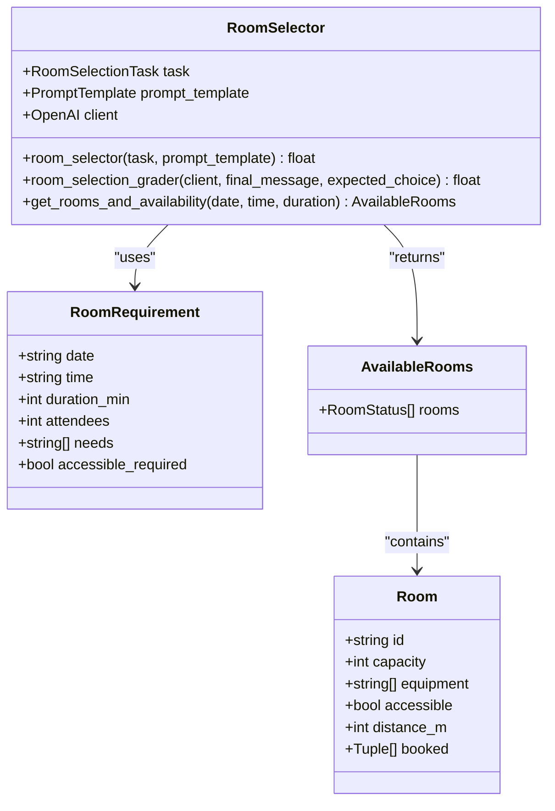

**图表来源**
- [room_selector.py](file://examples/apo/room_selector.py#L43-L90)
- [room_selector.py](file://examples/apo/room_selector.py#L305-L334)

### APO算法核心架构

APO算法采用束搜索（Beam Search）策略，结合文本梯度生成来优化提示词模板：

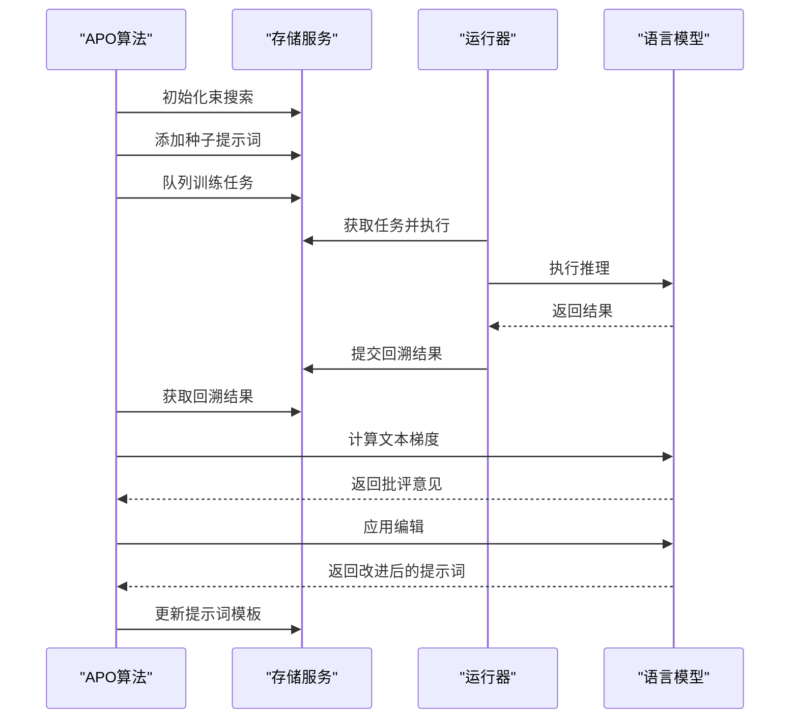

**图表来源**
- [apo.py](file://agentlightning/algorithm/apo/apo.py#L100-L200)
- [room_selector_apo.py](file://examples/apo/room_selector_apo.py#L30-L60)

**章节来源**
- [room_selector.py](file://examples/apo/room_selector.py#L125-L200)
- [apo.py](file://agentlightning/algorithm/apo/apo.py#L100-L300)

## 架构设计

### 系统整体架构

APO算法系统采用分层架构设计，包含算法层、执行层和存储层：

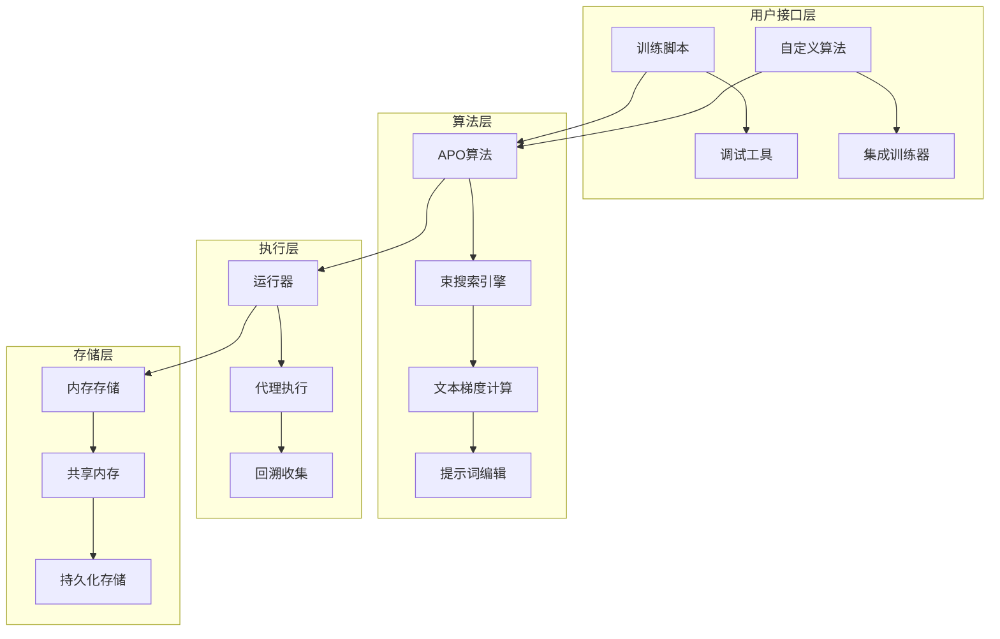

**图表来源**
- [room_selector_apo.py](file://examples/apo/room_selector_apo.py#L30-L50)
- [apo_custom_algorithm_trainer.py](file://examples/apo/apo_custom_algorithm_trainer.py#L20-L40)

### 客户端-服务器交互协议

APO算法支持两种部署模式：现代分布式架构和传统客户端-服务器模式：

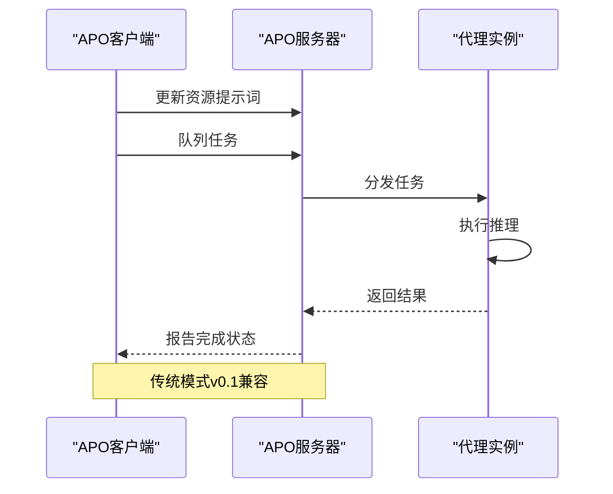

**图表来源**
- [legacy_apo_server.py](file://examples/apo/legacy_apo_server.py#L15-L45)
- [legacy_apo_client.py](file://examples/apo/legacy_apo_client.py#L20-L40)

**章节来源**
- [legacy_apo_server.py](file://examples/apo/legacy_apo_server.py#L1-L59)
- [legacy_apo_client.py](file://examples/apo/legacy_apo_client.py#L1-L50)

## 详细组件分析

### 束搜索优化引擎

APO算法的核心是束搜索优化引擎，它维护一个提示词束来跟踪最佳候选方案：

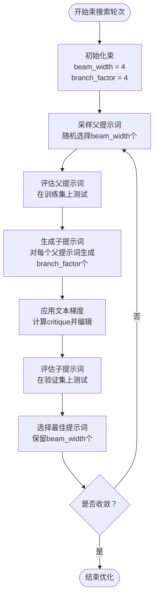

**图表来源**
- [apo.py](file://agentlightning/algorithm/apo/apo.py#L600-L700)

### 文本梯度计算机制

文本梯度计算是APO算法的关键创新，它利用LLM生成的批评意见来指导提示词改进：

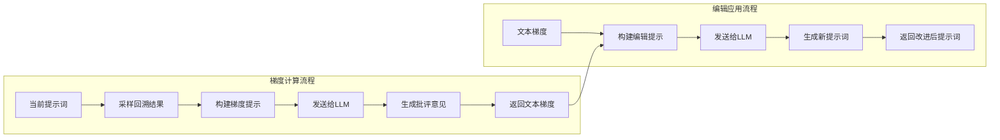

**图表来源**
- [apo.py](file://agentlightning/algorithm/apo/apo.py#L350-L450)

### 数据收集与处理管道

房间选择场景的数据收集管道负责从JSONL文件加载任务数据并进行预处理：

| 数据字段 | 类型 | 描述 | 示例值 |
|---------|------|------|--------|
| id | string | 任务唯一标识符 | "s01" |
| task_input.date | string | 日期格式YYYY-MM-DD | "2025-10-13" |
| task_input.time | string | 时间格式HH:MM 24小时制 | "16:30" |
| task_input.duration_min | integer | 会议时长（分钟） | 30 |
| task_input.attendees | integer | 参会人数 | 12 |
| task_input.needs | List[string] | 设备需求列表 | ["projector", "confphone"] |
| task_input.accessible_required | boolean | 是否需要无障碍设施 | true |
| expected_choice | string | 预期选择的房间ID | "Nova" |

**章节来源**
- [room_selector.py](file://examples/apo/room_selector.py#L335-L363)

## 工作流程详解

### 完整训练工作流程

APO算法的完整训练工作流程包括初始化、迭代优化和最终评估三个阶段：

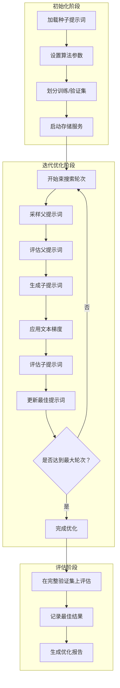

**图表来源**
- [room_selector_apo.py](file://examples/apo/room_selector_apo.py#L40-L70)
- [apo.py](file://agentlightning/algorithm/apo/apo.py#L750-L850)

### 自定义算法扩展点

APO算法提供了丰富的扩展点，允许开发者实现自定义的优化策略：

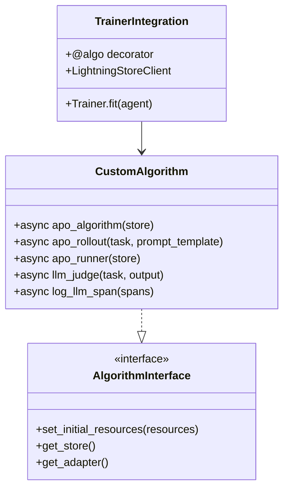

**图表来源**
- [apo_custom_algorithm.py](file://examples/apo/apo_custom_algorithm.py#L40-L80)
- [apo_custom_algorithm_trainer.py](file://examples/apo/apo_custom_algorithm_trainer.py#L20-L45)

**章节来源**
- [apo_custom_algorithm.py](file://examples/apo/apo_custom_algorithm.py#L1-L186)
- [apo_custom_algorithm_trainer.py](file://examples/apo/apo_custom_algorithm_trainer.py#L1-L45)

## 自定义算法扩展

### 算法模式与运行器模式

APO自定义算法支持两种运行模式，提供了灵活的部署选项：

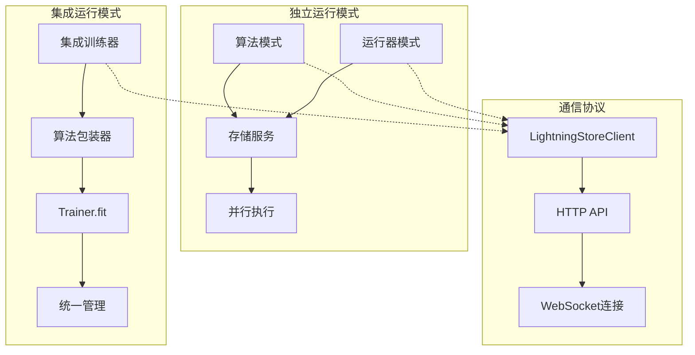

**图表来源**
- [apo_custom_algorithm.py](file://examples/apo/apo_custom_algorithm.py#L150-L186)
- [apo_custom_algorithm_trainer.py](file://examples/apo/apo_custom_algorithm_trainer.py#L25-L45)

### 参数配置与调优

APO算法提供了丰富的配置参数来控制优化过程：

| 参数名称 | 默认值 | 描述 | 调优建议 |
|---------|--------|------|----------|
| beam_width | 4 | 束搜索宽度 | 增大以提高搜索质量，但增加计算成本 |
| branch_factor | 4 | 分支因子 | 平衡探索与效率，通常设置为2-8 |
| gradient_batch_size | 4 | 梯度计算批次大小 | 增大以提高梯度质量，受限于内存 |
| val_batch_size | 16 | 验证批次大小 | 平衡评估速度与稳定性 |
| beam_rounds | 3 | 束搜索轮数 | 根据任务复杂度调整，通常2-5轮 |
| diversity_temperature | 1.0 | 多样性温度 | 控制生成多样性，影响搜索范围 |

**章节来源**
- [apo.py](file://agentlightning/algorithm/apo/apo.py#L120-L180)

## 调试与优化

### 多种调试方法

APO算法提供了三种不同的调试方法，满足不同场景的需求：

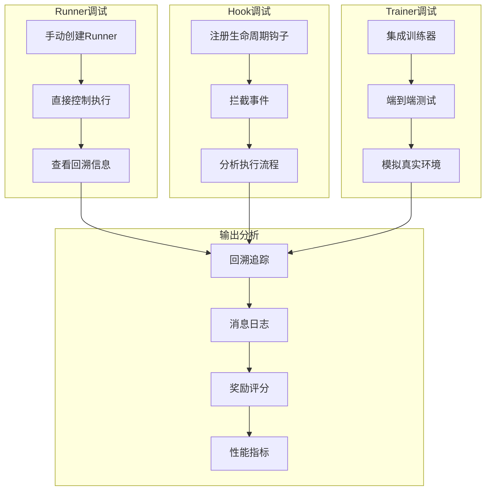

**图表来源**
- [apo_debug.py](file://examples/apo/apo_debug.py#L15-L80)

### 性能监控与分析

调试工具提供了全面的性能监控功能：

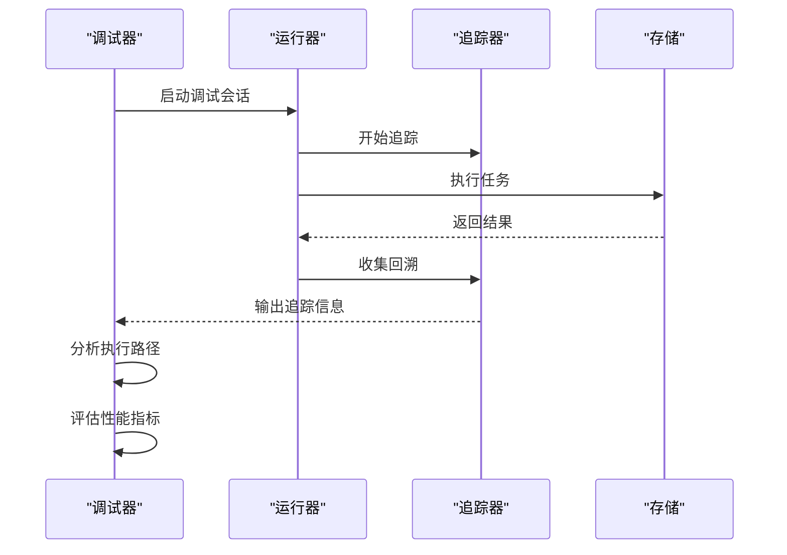

**图表来源**
- [apo_debug.py](file://examples/apo/apo_debug.py#L80-L128)

**章节来源**
- [apo_debug.py](file://examples/apo/apo_debug.py#L1-L128)

## 性能考量

### 计算复杂度分析

APO算法的计算复杂度主要来源于束搜索和文本梯度计算：

- **时间复杂度**: O(R × B × V × T)，其中R为轮次数，B为束宽度，V为验证集大小，T为提示词长度
- **空间复杂度**: O(B × T)，主要用于存储束中的提示词模板
- **I/O复杂度**: 主要取决于LLM API调用频率和批处理大小

### 内存优化策略

为了应对大规模优化任务，APO算法实现了多种内存优化策略：

- **增量式批处理**: 动态调整批次大小以适应可用内存
- **延迟加载**: 只在需要时加载数据集和模型
- **缓存机制**: 缓存频繁访问的回溯结果和梯度计算
- **垃圾回收**: 及时释放不再需要的中间结果

## 故障排除指南

### 常见问题与解决方案

| 问题类型 | 症状 | 可能原因 | 解决方案 |
|---------|------|----------|----------|
| 训练不收敛 | 提示词分数停滞不前 | 束宽度太小或分支因子不足 | 增加beam_width和branch_factor |
| 内存溢出 | 运行时内存耗尽 | 批次大小过大或束宽度过高 | 减少gradient_batch_size和beam_width |
| API调用失败 | LLM响应超时或错误 | 网络问题或配额限制 | 增加重试次数和调整超时设置 |
| 梯度质量差 | 文本梯度无意义 | 模型能力不足或提示词设计不当 | 更换gradient_model或优化提示词 |

### 调试技巧

1. **启用详细日志**: 设置适当的日志级别来跟踪算法执行过程
2. **可视化束搜索**: 使用图表工具展示束的演化过程
3. **对比实验**: 对比不同参数设置下的性能差异
4. **单元测试**: 针对关键组件编写单元测试

**章节来源**
- [apo.py](file://agentlightning/algorithm/apo/apo.py#L200-L300)

## 总结

APO算法示例展示了Agent-Lightning框架中自动提示词优化的强大能力。通过束搜索和文本梯度技术，该算法能够自动发现和改进有效的提示词模板，显著提升代理任务的完成率。

### 核心优势

1. **自动化程度高**: 无需人工干预即可完成提示词优化
2. **效果显著**: 在房间选择等复杂任务中表现出色
3. **可扩展性强**: 支持自定义算法和多种部署模式
4. **易于调试**: 提供多种调试工具和分析方法

### 应用前景

APO算法不仅适用于房间选择这样的具体任务，还可以扩展到其他领域，如对话系统、代码生成、数据分析等。其元优化的思想为开发更复杂的自适应代理系统提供了重要参考。

### 最佳实践建议

1. **合理设置参数**: 根据任务复杂度和计算资源调整算法参数
2. **充分利用调试工具**: 在开发过程中积极使用各种调试方法
3. **监控性能指标**: 持续跟踪优化过程中的关键性能指标
4. **迭代改进**: 基于实验结果不断调整和优化算法配置

通过深入理解和正确应用APO算法，开发者可以构建更加智能和高效的代理系统，为实际应用场景提供强有力的技术支撑。