# RAG代理示例

<cite>
**本文档中引用的文件**
- [examples/rag/README.md](file://examples/rag/README.md)
- [examples/rag/rag_agent.py](file://examples/rag/rag_agent.py)
- [examples/rag/utils.py](file://examples/rag/utils.py)
- [examples/rag/wiki_retriever_mcp/wiki_retriever_mcp.py](file://examples/rag/wiki_retriever_mcp/wiki_retriever_mcp.py)
- [examples/rag/wiki_retriever_mcp/wiki_retriever_install.sh](file://examples/rag/wiki_retriever_mcp/wiki_retriever_install.sh)
- [examples/rag/train.sh](file://examples/rag/train.sh)
- [agentlightning/__init__.py](file://agentlightning/__init__.py)
- [agentlightning/litagent/decorator.py](file://agentlightning/litagent/decorator.py)
- [agentlightning/algorithm/decorator.py](file://agentlightning/algorithm/decorator.py)
- [agentlightning/types/core.py](file://agentlightning/types/core.py)
</cite>

## 目录
1. [简介](#简介)
2. [项目结构](#项目结构)
3. [核心组件](#核心组件)
4. [架构概览](#架构概览)
5. [详细组件分析](#详细组件分析)
6. [数据流路径](#数据流路径)
7. [部署和训练](#部署和训练)
8. [装饰器API优化](#装饰器api优化)
9. [性能瓶颈分析](#性能瓶颈分析)
10. [故障排除指南](#故障排除指南)
11. [结论](#结论)

## 简介

RAG（检索增强生成）代理示例展示了如何使用Agent Lightning框架构建知识密集型任务的智能代理。该示例演示了如何将外部检索系统（如Wiki检索器）与Agent Lightning集成，并通过装饰器API实现零代码变更优化。

该系统专门针对多跳问答任务设计，能够从MuSiQue数据集中的复杂问题中检索相关信息，并通过推理生成准确的答案。系统支持与外部MC（Model Context Protocol）服务器通信，实现了高效的检索-生成工作流程。

## 项目结构

RAG示例项目采用模块化架构，主要包含以下关键组件：

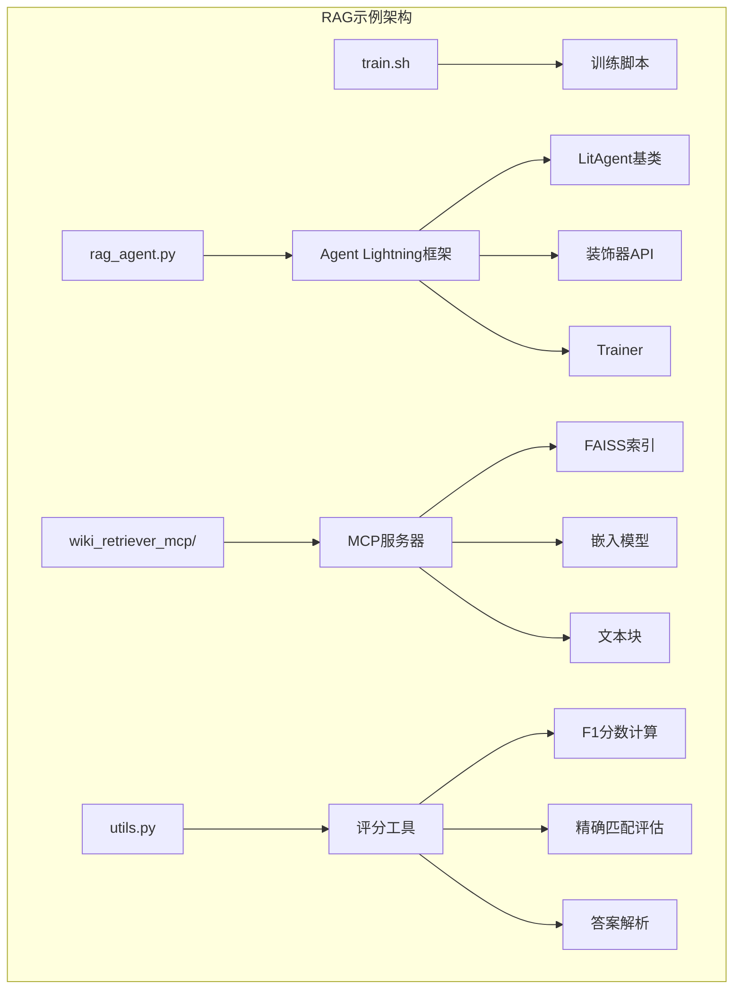

**图表来源**
- [examples/rag/rag_agent.py](file://examples/rag/rag_agent.py#L1-L81)
- [examples/rag/wiki_retriever_mcp/wiki_retriever_mcp.py](file://examples/rag/wiki_retriever_mcp/wiki_retriever_mcp.py#L1-L54)

**章节来源**
- [examples/rag/README.md](file://examples/rag/README.md#L1-L125)

## 核心组件

### RAG代理类

RAG代理是系统的核心组件，继承自`LitAgent`基类，负责处理检索增强生成任务：

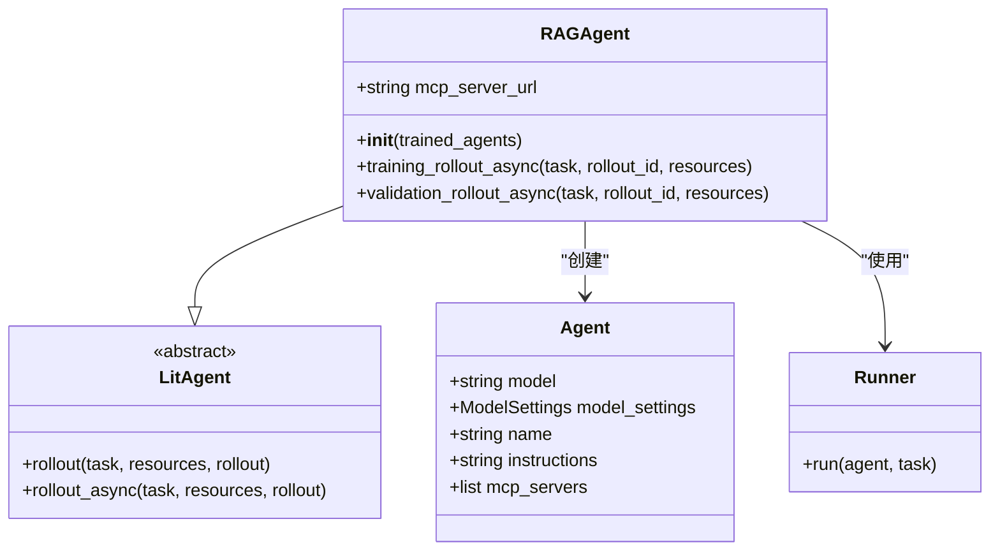

**图表来源**
- [examples/rag/rag_agent.py](file://examples/rag/rag_agent.py#L25-L81)

### Wiki检索器MCP

MCP（Model Context Protocol）服务器提供检索功能，支持向量相似性搜索：

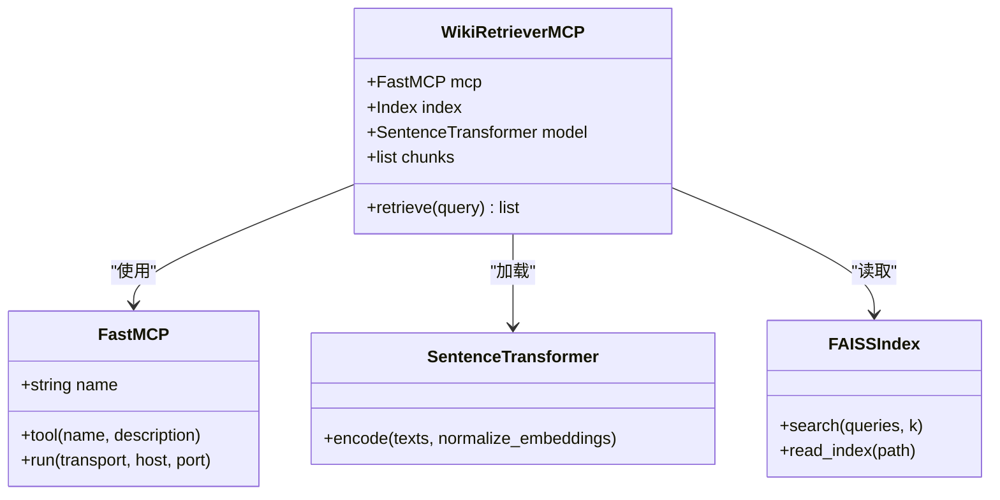

**图表来源**
- [examples/rag/wiki_retriever_mcp/wiki_retriever_mcp.py](file://examples/rag/wiki_retriever_mcp/wiki_retriever_mcp.py#L1-L54)

**章节来源**
- [examples/rag/rag_agent.py](file://examples/rag/rag_agent.py#L1-L81)
- [examples/rag/wiki_retriever_mcp/wiki_retriever_mcp.py](file://examples/rag/wiki_retriever_mcp/wiki_retriever_mcp.py#L1-L54)

## 架构概览

RAG系统采用分层架构设计，实现了检索、推理和训练的完整流水线：

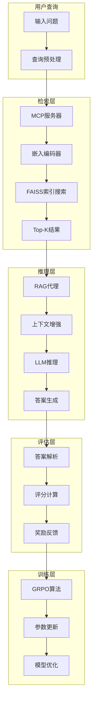

**图表来源**
- [examples/rag/rag_agent.py](file://examples/rag/rag_agent.py#L39-L79)
- [examples/rag/wiki_retriever_mcp/wiki_retriever_mcp.py](file://examples/rag/wiki_retriever_mcp/wiki_retriever_mcp.py#L25-L53)

## 详细组件分析

### RAG代理实现

RAG代理通过装饰器API实现零代码变更优化，支持同步和异步训练回放：

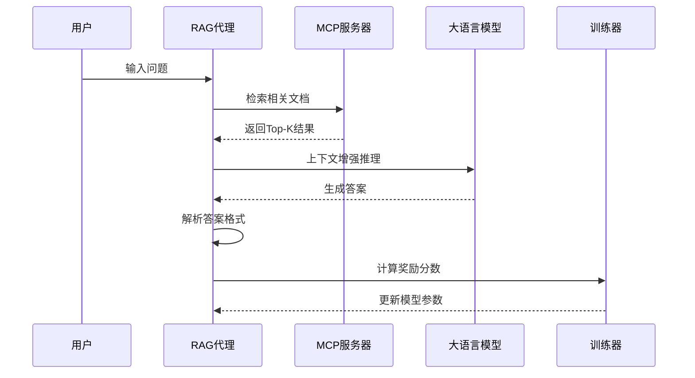

**图表来源**
- [examples/rag/rag_agent.py](file://examples/rag/rag_agent.py#L39-L79)

### 评分工具系统

评分系统提供了多种评估指标，确保答案质量：

| 评估指标 | 描述 | 计算方式 |
|----------|------|----------|
| F1分数 | 精确率和召回率的调和平均值 | `f1 = 2 * (precision * recall) / (precision + recall)` |
| 精确匹配 | 字符串完全匹配度 | `normalize_answer(pred) == normalize_answer(gt)` |
| 覆盖精确匹配 | 答案是否包含正确答案 | `normalize_answer(gt) in normalize_answer(pred)` |
| 格式检查 | 答案格式是否符合要求 | 检查`<answer>`标签存在性 |

**章节来源**
- [examples/rag/utils.py](file://examples/rag/utils.py#L1-L447)

### MCP服务器架构

MCP服务器实现了高效的向量检索功能：

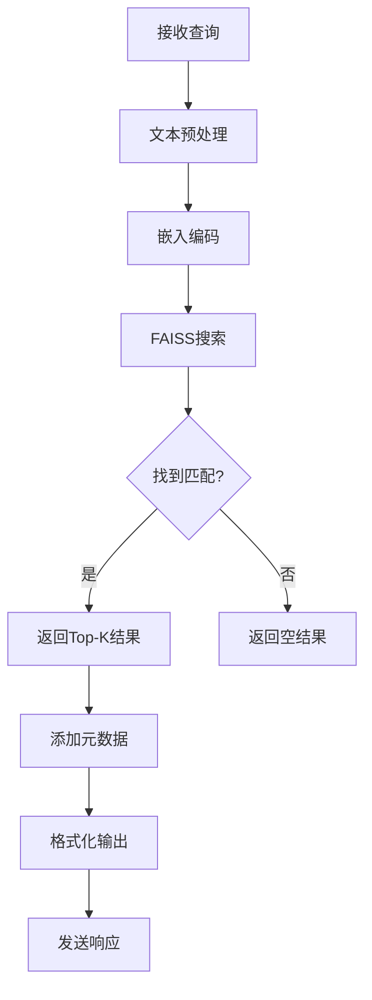

**图表来源**
- [examples/rag/wiki_retriever_mcp/wiki_retriever_mcp.py](file://examples/rag/wiki_retriever_mcp/wiki_retriever_mcp.py#L25-L53)

**章节来源**
- [examples/rag/wiki_retriever_mcp/wiki_retriever_mcp.py](file://examples/rag/wiki_retriever_mcp/wiki_retriever_mcp.py#L1-L54)

## 数据流路径

### 查询输入处理

系统从用户输入开始，经过多个处理阶段：

### 文档检索流程

检索过程涉及向量相似性搜索和结果排序：

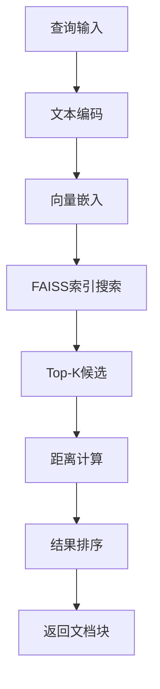

**图表来源**
- [examples/rag/wiki_retriever_mcp/wiki_retriever_mcp.py](file://examples/rag/wiki_retriever_mcp/wiki_retriever_mcp.py#L35-L53)

### 上下文增强

检索到的文档被整合到提示模板中：

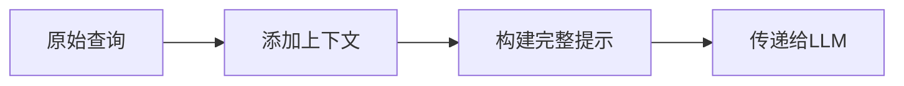

### 最终响应生成

LLM基于增强的上下文生成最终答案：

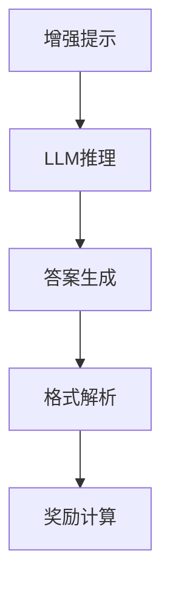

**章节来源**
- [examples/rag/rag_agent.py](file://examples/rag/rag_agent.py#L39-L79)

## 部署和训练

### 环境准备

部署前需要完成以下准备工作：

1. **Wiki检索器设置**：
   - 安装依赖包：`bash wiki_retriever_install.sh`
   - 启动MCP服务器：`python wiki_retriever_mcp.py`

2. **Ray集群启动**：
   - 设置WANDB API密钥
   - 启动Ray：`bash ../../scripts/restart_ray.sh`

3. **训练环境配置**：
   - 准备训练数据（MuSiQue数据集）
   - 设置基础模型（Qwen/Qwen3-1.7B）

### 训练脚本执行

训练过程通过分布式架构实现高效训练：

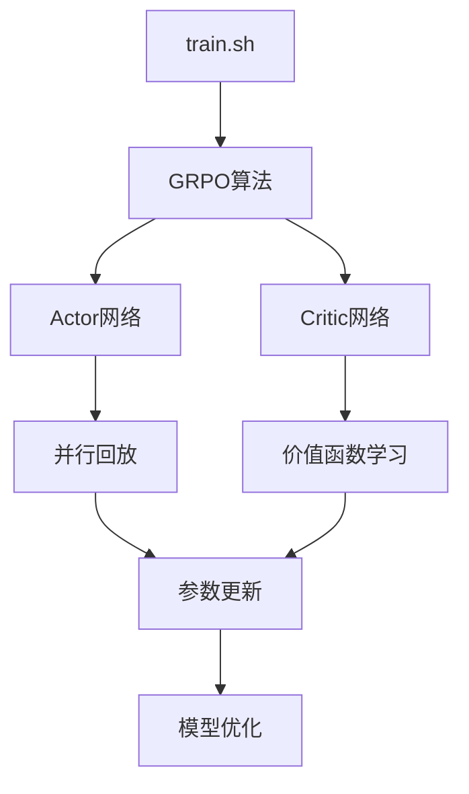

**图表来源**
- [examples/rag/train.sh](file://examples/rag/train.sh#L1-L54)

### 服务启动流程

系统启动遵循严格的顺序：

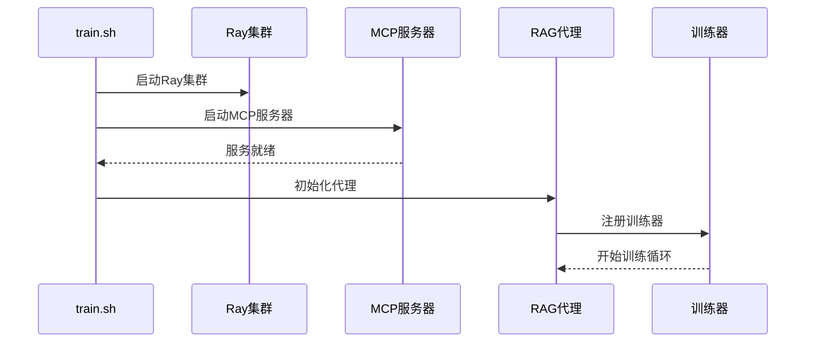

**章节来源**
- [examples/rag/README.md](file://examples/rag/README.md#L10-L25)
- [examples/rag/train.sh](file://examples/rag/train.sh#L1-L54)

## 装饰器API优化

### Agent Lightning装饰器系统

Agent Lightning提供了强大的装饰器API，支持零代码变更优化：

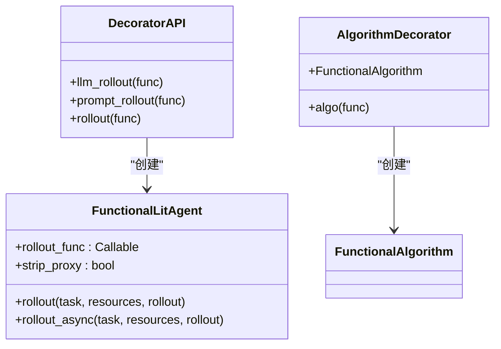

**图表来源**
- [agentlightning/litagent/decorator.py](file://agentlightning/litagent/decorator.py#L1-L537)
- [agentlightning/algorithm/decorator.py](file://agentlightning/algorithm/decorator.py#L1-L265)

### 零代码变更优化

装饰器API允许开发者在不修改核心逻辑的情况下实现优化：

| 装饰器类型 | 用途 | 特点 |
|------------|------|------|
| `@llm_rollout` | LLM回放优化 | 自动注入LLM资源 |
| `@prompt_rollout` | 提示模板优化 | 自动注入提示模板 |
| `@rollout` | 通用回放优化 | 智能检测函数签名 |
| `@algo` | 算法优化 | 自动注入训练资源 |

### 性能优化策略

装饰器系统内置多种性能优化机制：

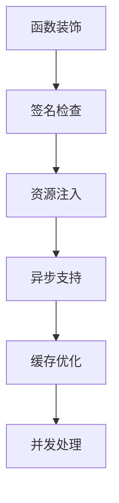

**章节来源**
- [agentlightning/litagent/decorator.py](file://agentlightning/litagent/decorator.py#L1-L537)
- [agentlightning/algorithm/decorator.py](file://agentlightning/algorithm/decorator.py#L1-L265)

## 性能瓶颈分析

### 主要性能瓶颈

RAG系统面临的主要性能挑战包括：

1. **检索延迟**：
   - FAISS索引大小影响搜索速度
   - 嵌入编码计算开销
   - 网络传输延迟

2. **推理延迟**：
   - 大语言模型推理时间
   - 上下文长度限制
   - 并发处理能力

3. **内存使用**：
   - 索引存储需求
   - 批处理内存占用
   - 缓存管理

### 优化策略

针对上述瓶颈，系统采用以下优化策略：

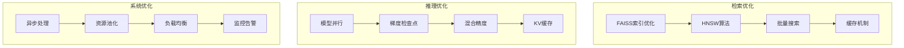

### 生产级部署建议

为了构建生产级RAG系统，建议采取以下措施：

| 优化领域 | 具体措施 | 预期收益 |
|----------|----------|----------|
| 检索性能 | 使用GPU加速FAISS | 搜索速度提升10倍 |
| 推理效率 | 模型量化和蒸馏 | 推理速度提升3-5倍 |
| 内存管理 | 分布式索引存储 | 支持更大规模数据 |
| 可扩展性 | 微服务架构 | 支持高并发访问 |

**章节来源**
- [examples/rag/README.md](file://examples/rag/README.md#L50-L100)

## 故障排除指南

### 常见问题及解决方案

1. **MCP服务器连接失败**：
   - 检查端口8099是否被占用
   - 验证FAISS索引文件完整性
   - 确认嵌入模型加载成功

2. **训练过程异常**：
   - 检查Ray集群状态
   - 验证数据集格式正确性
   - 确认GPU资源可用性

3. **性能问题**：
   - 监控内存使用情况
   - 检查网络带宽限制
   - 优化批处理大小

### 调试工具和方法

系统提供了完善的调试和监控功能：

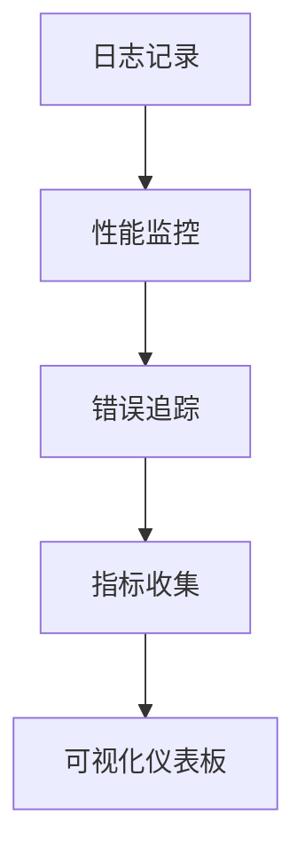

**章节来源**
- [examples/rag/rag_agent.py](file://examples/rag/rag_agent.py#L45-L70)

## 结论

RAG代理示例展示了Agent Lightning框架在知识密集型任务中的强大能力。通过模块化设计、装饰器API优化和分布式训练，系统实现了高效、可扩展的检索增强生成解决方案。

### 关键优势

1. **灵活性**：支持多种检索策略和推理模式
2. **可扩展性**：分布式架构支持大规模部署
3. **易用性**：装饰器API简化开发流程
4. **性能**：多层优化确保高效运行

### 应用前景

该示例为构建生产级RAG系统提供了完整的参考实现，适用于问答系统、文档检索、知识图谱等多种应用场景。随着技术的不断发展，系统将继续演进以满足更复杂的业务需求。

通过本文档的详细分析，开发者可以深入理解RAG代理的工作原理，并基于此构建自己的智能应用系统。