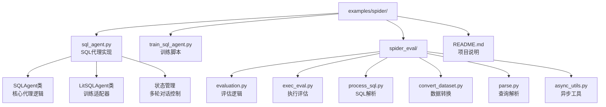
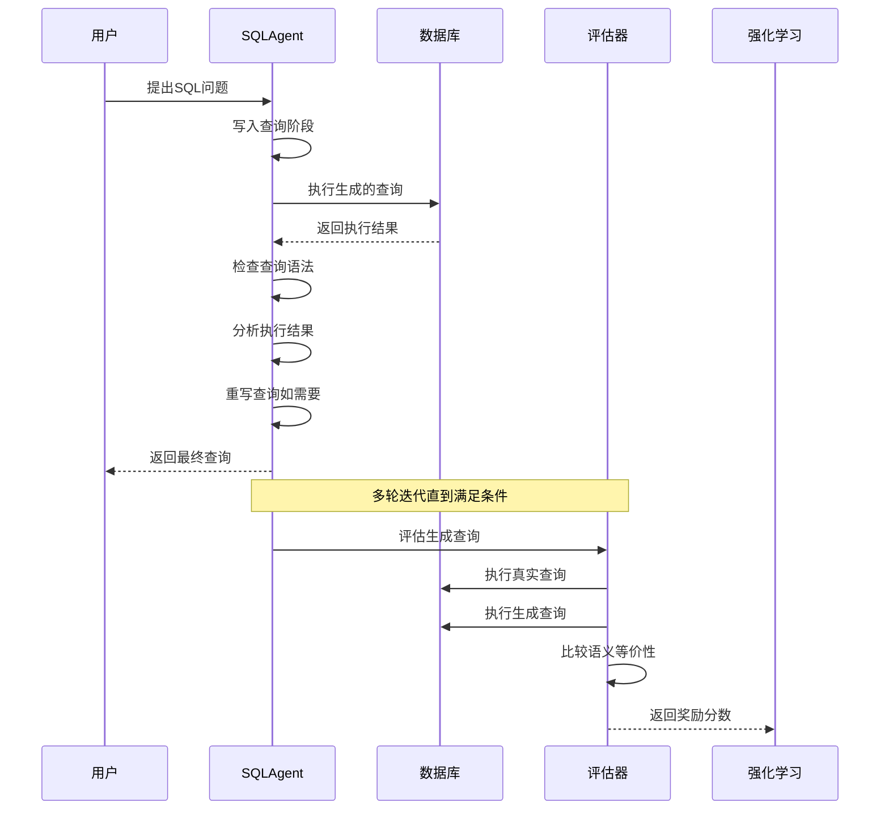
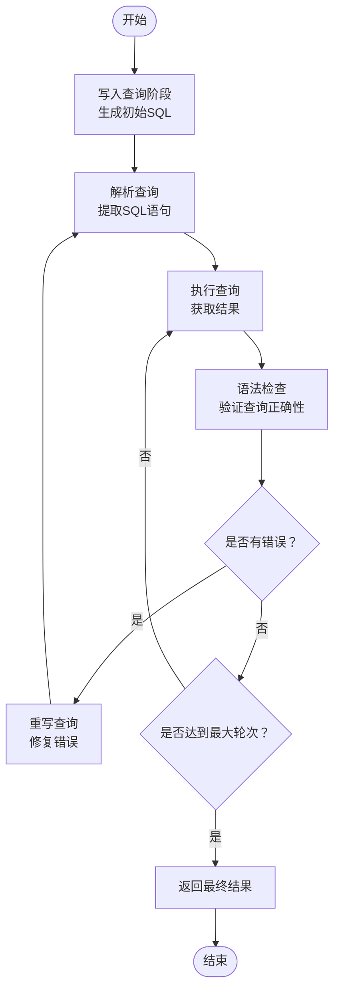
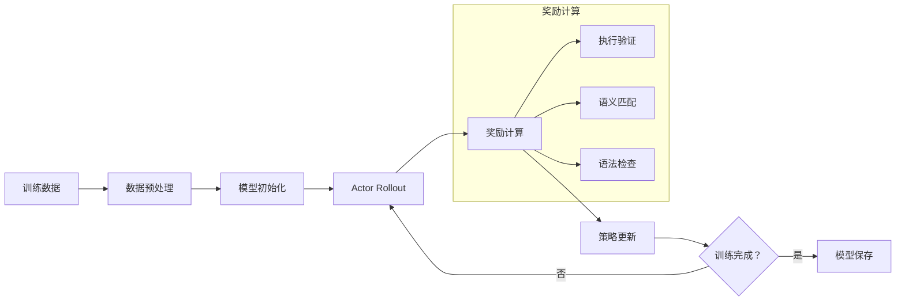
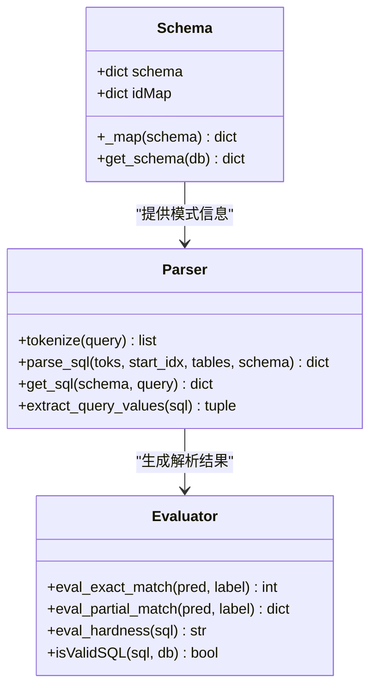
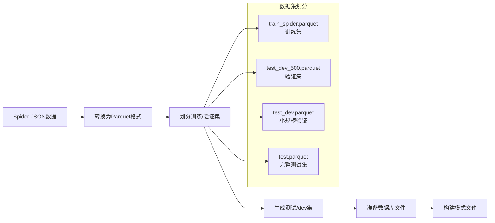

# SQL代理示例

<cite>
**本文档中引用的文件**
- [README.md](file://examples/spider/README.md)
- [sql_agent.py](file://examples/spider/sql_agent.py)
- [train_sql_agent.py](file://examples/spider/train_sql_agent.py)
- [evaluation.py](file://examples/spider/spider_eval/evaluation.py)
- [exec_eval.py](file://examples/spider/spider_eval/exec_eval.py)
- [process_sql.py](file://examples/spider/spider_eval/process_sql.py)
- [convert_dataset.py](file://examples/spider/spider_eval/convert_dataset.py)
- [parse.py](file://examples/spider/spider_eval/parse.py)
- [async_utils.py](file://examples/spider/spider_eval/async_utils.py)
</cite>

## 目录
1. [简介](#简介)
2. [项目结构](#项目结构)
3. [核心组件](#核心组件)
4. [架构概览](#架构概览)
5. [详细组件分析](#详细组件分析)
6. [评估机制](#评估机制)
7. [训练流程](#训练流程)
8. [最佳实践](#最佳实践)
9. [故障排除指南](#故障排除指南)
10. [结论](#结论)

## 简介

SQL代理示例展示了如何使用Agent-Lightning框架在Spider基准数据集上训练一个文本到SQL转换代理。该示例通过强化学习技术提升SQL查询生成的准确性，提供了完整的端到端解决方案，包括数据预处理、模型训练、评估验证等关键环节。

该项目的核心创新在于：
- 基于LangGraph和LangChain构建的多轮对话式SQL生成代理
- 利用VERL框架实现的强化学习训练策略
- 完整的SQL执行验证和奖励计算机制
- 针对复杂数据库交互场景的优化实践

## 项目结构

**图表来源**
- [sql_agent.py](file://examples/spider/sql_agent.py#L1-L50)
- [train_sql_agent.py](file://examples/spider/train_sql_agent.py#L1-L30)
- [evaluation.py](file://examples/spider/spider_eval/evaluation.py#L1-L50)

**章节来源**
- [README.md](file://examples/spider/README.md#L1-L49)

## 核心组件

### SQLAgent类

SQLAgent是整个系统的核心组件，负责管理多轮对话式的SQL查询生成过程。它采用状态机模式，通过四个主要阶段完成查询生成：

1. **写入查询阶段**：根据用户问题生成初始SQL查询
2. **执行查询阶段**：在目标数据库中执行生成的查询
3. **检查查询阶段**：验证查询语法正确性和潜在错误
4. **重写查询阶段**：根据反馈修正查询

### LitSQLAgent类

LitSQLAgent继承自Agent-Lightning的LitAgent基类，专门用于强化学习训练。它实现了rollout方法，负责：
- 数据库连接和模式加载
- 查询生成和执行
- 奖励计算和性能评估
- 训练与验证模式的区分

### 评估模块

评估模块包含多个独立的组件，每个都承担特定的评估职责：

- **evaluation.py**：提供完整的SQL匹配评估逻辑
- **exec_eval.py**：实现语义等价性检查和执行验证
- **process_sql.py**：SQL语法解析和结构化处理
- **parse.py**：查询值提取和插值处理

**章节来源**
- [sql_agent.py](file://examples/spider/sql_agent.py#L415-L519)
- [evaluation.py](file://examples/spider/spider_eval/evaluation.py#L1-L100)

## 架构概览

**图表来源**
- [sql_agent.py](file://examples/spider/sql_agent.py#L200-L350)
- [exec_eval.py](file://examples/spider/spider_eval/exec_eval.py#L150-L250)

该架构的核心特点：
- **模块化设计**：每个组件职责明确，便于维护和扩展
- **状态驱动**：通过状态机模式管理复杂的多轮对话流程
- **验证机制**：双重验证确保生成查询的准确性和安全性
- **强化学习集成**：与Agent-Lightning框架无缝集成

## 详细组件分析

### SQL查询生成流程

**图表来源**
- [sql_agent.py](file://examples/spider/sql_agent.py#L250-L400)

### 强化学习训练管道

**图表来源**
- [train_sql_agent.py](file://examples/spider/train_sql_agent.py#L50-L150)

**章节来源**
- [sql_agent.py](file://examples/spider/sql_agent.py#L200-L450)
- [train_sql_agent.py](file://examples/spider/train_sql_agent.py#L1-L100)

## 评估机制

### 执行验证算法

执行验证是评估系统的核心功能，它不仅检查SQL语法正确性，更重要的是验证查询的语义等价性。该机制采用以下策略：

1. **语义等价性检测**：比较两个查询结果的"包语义"（bag semantics）
2. **多数据库验证**：在所有相关数据库上验证查询等价性
3. **超时保护**：防止长时间运行的查询影响评估进度
4. **异常处理**：优雅处理执行过程中的各种异常情况

### 评估指标体系

评估系统提供多层次的指标评估：

| 指标类型 | 具体指标 | 描述 |
|---------|---------|------|
| 执行准确率 | Execution Accuracy | 查询能否成功执行并返回正确结果 |
| 精确匹配 | Exact Match | 查询语法完全匹配 |
| 部分匹配 | Partial Match | 查询在某些方面正确 |
| 困难度分类 | Easy/Medium/Hard | 基于查询复杂度的分类评估 |
| 转折点评估 | Turn-based Accuracy | 多轮对话中的准确性评估 |

### SQL解析和处理

**图表来源**
- [process_sql.py](file://examples/spider/spider_eval/process_sql.py#L50-L150)
- [evaluation.py](file://examples/spider/spider_eval/evaluation.py#L400-L500)

**章节来源**
- [exec_eval.py](file://examples/spider/spider_eval/exec_eval.py#L1-L250)
- [evaluation.py](file://examples/spider/spider_eval/evaluation.py#L1-L800)

## 训练流程

### 数据准备和转换

训练流程的第一步是数据准备，系统自动处理Spider数据集的转换：

**图表来源**
- [convert_dataset.py](file://examples/spider/spider_eval/convert_dataset.py#L10-L35)

### 强化学习配置

系统支持三种不同的训练配置：

1. **Fast配置**：专为CI测试优化，减少训练轮次和数据量
2. **Qwen配置**：标准配置，使用Qwen-2.5-Coder-1.5B-Instruct模型
3. **Llama配置**：使用LLaMA-3.2-1B-Instruct模型，支持JSON格式

每种配置都有针对性的参数调优，包括：
- 学习率和批次大小
- KL散度系数和熵系数
- 微批次大小和梯度累积
- 内存优化策略

### 训练监控和日志

训练过程中系统提供全面的监控和日志记录：

- **实时指标**：损失函数、奖励分布、学习率变化
- **模型检查点**：定期保存最佳模型权重
- **性能分析**：训练速度、内存使用、GPU利用率
- **调试信息**：详细的推理过程和错误追踪

**章节来源**
- [train_sql_agent.py](file://examples/spider/train_sql_agent.py#L50-L193)
- [convert_dataset.py](file://examples/spider/spider_eval/convert_dataset.py#L1-L36)

## 最佳实践

### 模型选择和配置

1. **模型尺寸权衡**：根据硬件资源和性能要求选择合适的模型尺寸
2. **温度参数调优**：在创造性vs稳定性之间找到平衡点
3. **批次大小优化**：根据GPU内存容量调整批次大小
4. **学习率调度**：采用适当的衰减策略提升训练效果

### 数据质量保证

1. **数据清洗**：确保训练数据的准确性和一致性
2. **多样性和代表性**：覆盖不同难度级别的查询类型
3. **验证集划分**：合理划分验证集以避免过拟合
4. **测试环境隔离**：使用独立的测试数据库确保评估公正性

### 性能优化策略

1. **内存管理**：启用参数卸载和优化器卸载
2. **并行处理**：充分利用多GPU资源加速训练
3. **缓存机制**：缓存频繁访问的数据和中间结果
4. **异步执行**：使用异步I/O提高系统响应性

### 错误处理和容错

1. **异常捕获**：全面捕获和处理各种异常情况
2. **回退机制**：在失败时提供合理的默认行为
3. **日志记录**：详细记录错误信息便于调试
4. **健康检查**：定期检查系统状态确保稳定运行

## 故障排除指南

### 常见问题和解决方案

| 问题类型 | 症状 | 可能原因 | 解决方案 |
|---------|------|---------|---------|
| 训练不收敛 | 损失函数不下降 | 学习率过高或过低 | 调整学习率参数 |
| 内存溢出 | CUDA out of memory | 批次大小过大 | 减少批次大小或启用梯度检查点 |
| 数据加载失败 | 文件找不到 | 数据路径配置错误 | 检查数据目录和文件权限 |
| 评估超时 | 评估进程卡住 | 查询过于复杂 | 设置合理的超时时间 |
| 模型加载失败 | 权重文件损坏 | 下载不完整 | 重新下载模型文件 |

### 调试技巧

1. **启用调试模式**：设置debug参数获取详细输出
2. **单步执行**：逐步验证每个组件的功能
3. **日志分析**：仔细分析日志文件定位问题
4. **单元测试**：编写测试用例验证核心功能

### 性能调优

1. **硬件优化**：确保GPU驱动和CUDA版本兼容
2. **软件配置**：优化Python环境和依赖版本
3. **网络配置**：确保模型下载和数据传输正常
4. **系统监控**：监控CPU、内存、GPU使用情况

**章节来源**
- [sql_agent.py](file://examples/spider/sql_agent.py#L500-L546)

## 结论

SQL代理示例展示了如何构建一个完整的文本到SQL转换系统，通过结合先进的强化学习技术和完善的评估机制，实现了高精度的SQL查询生成。该示例的主要贡献包括：

1. **技术创新**：提出了基于多轮对话的状态机架构，有效处理复杂的SQL生成任务
2. **评估完善**：建立了全面的评估体系，涵盖语法、语义和执行等多个维度
3. **工程实践**：提供了可复用的框架和工具，便于快速部署和扩展
4. **性能优化**：通过多种优化策略显著提升了训练效率和生成质量

该示例为构建高精度SQL生成系统提供了宝贵的参考，其设计理念和实现方法可以广泛应用于其他自然语言到代码的转换任务中。随着大语言模型技术的不断发展，这种基于强化学习的训练方法将在更多领域发挥重要作用。