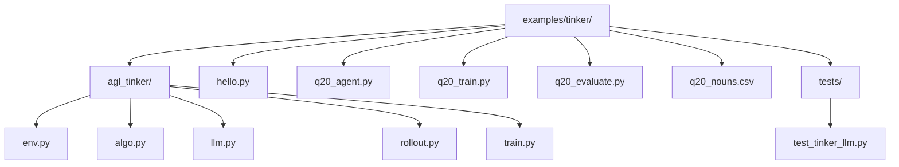
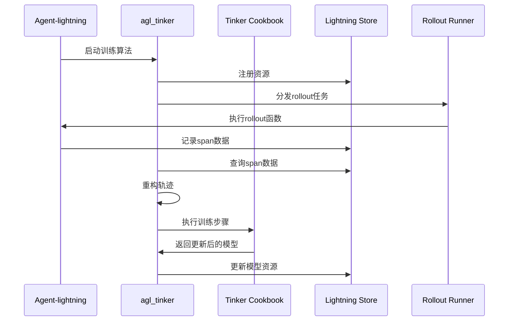
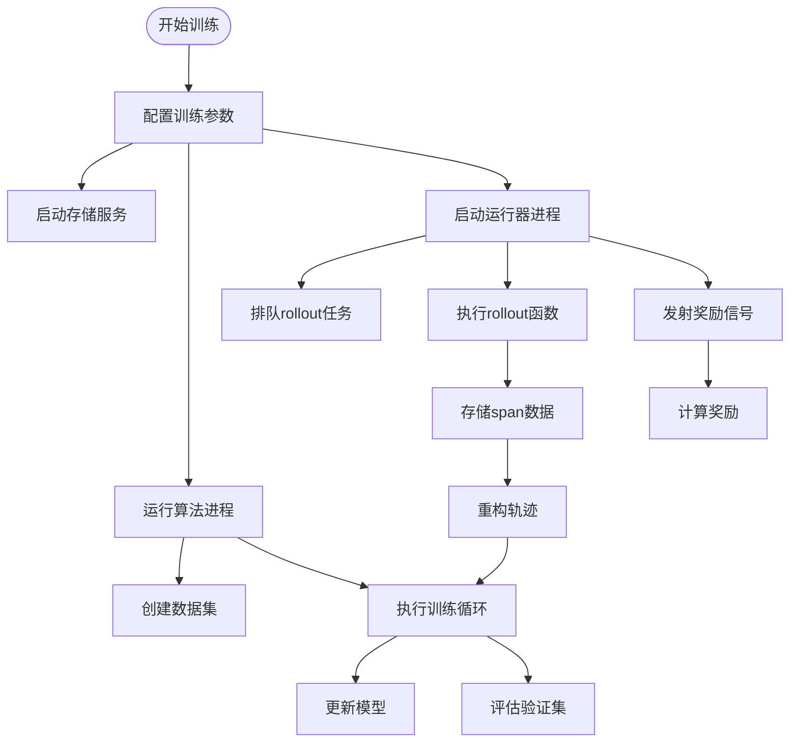
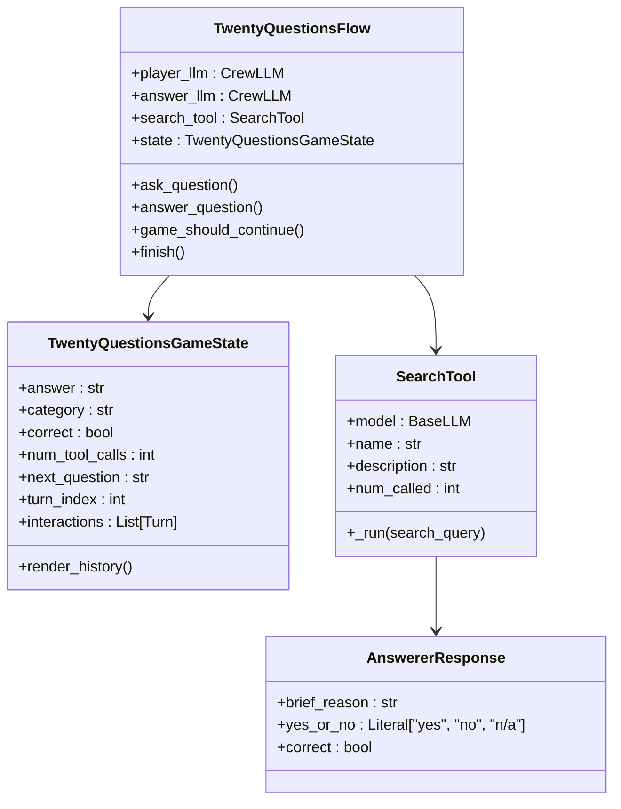
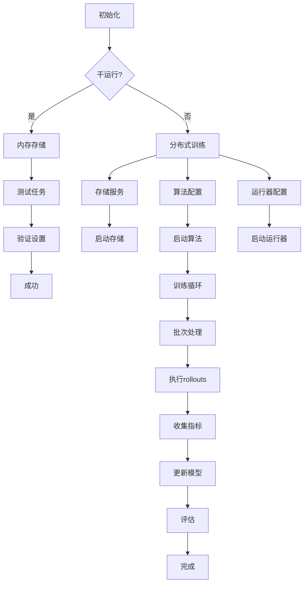
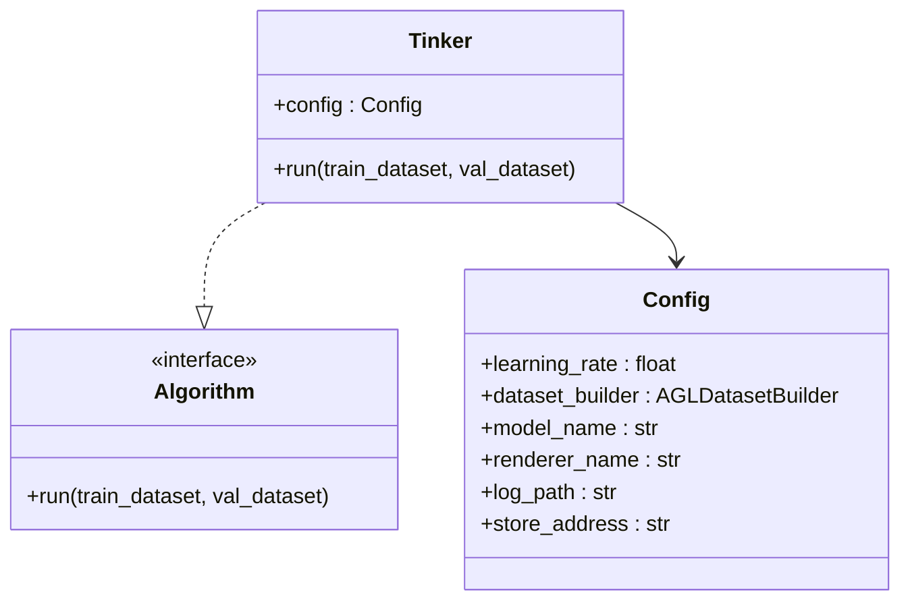
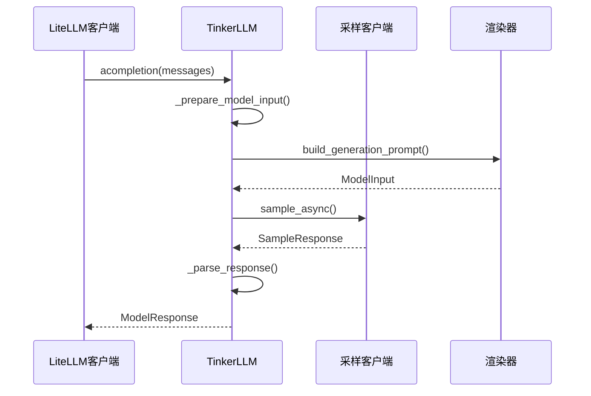
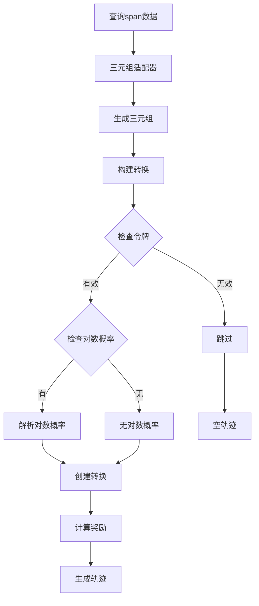

# Tinker实验平台示例

<cite>
**本文档中引用的文件**
- [README.md](file://examples/tinker/README.md)
- [hello.py](file://examples/tinker/hello.py)
- [q20_agent.py](file://examples/tinker/q20_agent.py)
- [q20_train.py](file://examples/tinker/q20_train.py)
- [q20_evaluate.py](file://examples/tinker/q20_evaluate.py)
- [q20_nouns.csv](file://examples/tinker/q20_nouns.csv)
- [agl_tinker/__init__.py](file://examples/tinker/agl_tinker/__init__.py)
- [agl_tinker/env.py](file://examples/tinker/agl_tinker/env.py)
- [agl_tinker/algo.py](file://examples/tinker/agl_tinker/algo.py)
- [agl_tinker/llm.py](file://examples/tinker/agl_tinker/llm.py)
- [agl_tinker/rollout.py](file://examples/tinker/agl_tinker/rollout.py)
- [agl_tinker/train.py](file://examples/tinker/agl_tinker/train.py)
- [tests/test_tinker_llm.py](file://examples/tinker/tests/test_tinker_llm.py)
</cite>

## 目录
1. [简介](#简介)
2. [项目结构](#项目结构)
3. [核心组件](#核心组件)
4. [架构概览](#架构概览)
5. [详细组件分析](#详细组件分析)
6. [使用教程](#使用教程)
7. [调试与故障排除](#调试与故障排除)
8. [性能优化](#性能优化)
9. [总结](#总结)

## 简介

Tinker实验平台示例是Agent-lightning框架与Thinking Machines实验室的Tinker强化学习基础设施之间的集成桥梁。该平台设计用于支持快速原型开发和算法验证，特别针对Q20代理（20 Questions游戏代理）的实现逻辑进行了优化。

### 主要特性

- **无缝集成**：将Tinker的强化学习基础设施与Agent-lightning的分布式执行框架相结合
- **快速原型**：提供从简单'Hello World'示例到复杂任务训练的渐进式开发路径
- **算法验证**：支持自定义算法开发和性能基准测试
- **灵活实验**：为高级用户提供可扩展的实验框架
- **调试友好**：内置调试技巧和日志分析方法

## 项目结构

Tinker实验平台示例位于`examples/tinker/`目录下，包含以下核心组件：



**图表来源**
- [README.md](file://examples/tinker/README.md#L1-L183)
- [agl_tinker/__init__.py](file://examples/tinker/agl_tinker/__init__.py#L1-L2)

**章节来源**
- [README.md](file://examples/tinker/README.md#L1-L183)

## 核心组件

### agl_tinker模块

agl_tinker模块是整个平台的核心桥接层，负责连接Agent-lightning和Tinker生态系统：

#### 环境封装 (env.py)
- **AGLDatasetBuilder**: 将Agent-lightning数据集转换为Tinker期望的格式
- **AGLDummyEnv**: 提供轻量级环境接口，避免实际环境模拟
- **轨迹重建**: 从Agent-lightning追踪数据重建Tinker轨迹

#### LLM接口抽象 (llm.py)
- **TinkerLLM**: 实现LiteLLM的CustomLLM接口，桥接Tinker采样客户端
- **模型配置**: 支持温度、top-k、top-p等采样参数
- **令牌化处理**: 集成HuggingFace分词器和渲染器

#### Rollout管理机制 (rollout.py)
- **轨迹重构**: 将Agent-lightning跨度转换为Tinker轨迹
- **批量处理**: 支持并发rollout执行和结果聚合
- **状态管理**: 维护rollout生命周期和状态跟踪

**章节来源**
- [agl_tinker/env.py](file://examples/tinker/agl_tinker/env.py#L1-L267)
- [agl_tinker/llm.py](file://examples/tinker/agl_tinker/llm.py#L1-L308)
- [agl_tinker/rollout.py](file://examples/tinker/agl_tinker/rollout.py#L1-L347)

## 架构概览

Tinker实验平台采用分层架构设计，实现了Agent-lightning与Tinker的深度集成：



**图表来源**
- [agl_tinker/algo.py](file://examples/tinker/agl_tinker/algo.py#L1-L87)
- [agl_tinker/rollout.py](file://examples/tinker/agl_tinker/rollout.py#L1-L347)

### 关键设计原则

1. **接口兼容性**: 保持Tinker Cookbook的API接口不变
2. **数据流映射**: 在Agent-lightning追踪数据和Tinker轨迹之间建立映射关系
3. **异步处理**: 支持并发rollout执行和结果聚合
4. **资源管理**: 统一管理LLM资源和模型版本控制

## 详细组件分析

### Hello世界示例 (hello.py)

Hello示例展示了最简单的Agent-lightning + Tinker集成模式：



**图表来源**
- [hello.py](file://examples/tinker/hello.py#L1-L201)

#### 核心功能

- **身份字符串微调**: 训练模型学会重复给定的身份字符串
- **端到端流程**: 展示从数据准备到模型训练的完整工作流
- **分布式部署**: 支持存储、算法和运行器的分离部署

**章节来源**
- [hello.py](file://examples/tinker/hello.py#L1-L201)

### Q20代理实现 (q20_agent.py)

Q20代理是一个复杂的多智能体系统，实现了20 Questions游戏的核心逻辑：



**图表来源**
- [q20_agent.py](file://examples/tinker/q20_agent.py#L1-L321)

#### 游戏机制

1. **玩家代理**: 使用二分搜索策略提出问题
2. **回答代理**: 基于秘密实体的真实答案回答
3. **搜索工具**: 模拟网络搜索以获取事实信息
4. **奖励机制**: 正确猜测获得奖励，超时或错误获得惩罚

**章节来源**
- [q20_agent.py](file://examples/tinker/q20_agent.py#L1-L321)

### 训练流程 (q20_train.py)

Q20训练脚本提供了完整的强化学习训练管道：



**图表来源**
- [q20_train.py](file://examples/tinker/q20_train.py#L1-L267)

#### 数据集管理

训练使用预定义的实体分类数据集，包含：
- **动物类别**: Dog, Cat, Fish等
- **角色类别**: Batman, Superman等
- **物品类别**: Piano, Chair等
- **名人类别**: Albert Einstein, Nelson Mandela等

**章节来源**
- [q20_train.py](file://examples/tinker/q20_train.py#L1-L267)
- [q20_nouns.csv](file://examples/tinker/q20_nouns.csv#L1-L202)

### 算法包装器 (algo.py)

Tinker算法包装器实现了Agent-lightning的Algorithm接口：



**图表来源**
- [agl_tinker/algo.py](file://examples/tinker/agl_tinker/algo.py#L1-L87)

**章节来源**
- [agl_tinker/algo.py](file://examples/tinker/agl_tinker/algo.py#L1-L87)

### LLM代理 (llm.py)

TinkerLLM类实现了LiteLLM的CustomLLM协议：



**图表来源**
- [agl_tinker/llm.py](file://examples/tinker/agl_tinker/llm.py#L1-L308)

#### 核心功能

- **消息转换**: 将LiteLLM消息格式转换为Tinker输入格式
- **响应解析**: 解析Tinker采样响应并转换为标准格式
- **参数映射**: 支持温度、top-k、top-p等采样参数
- **工具调用**: 处理函数调用和工具使用

**章节来源**
- [agl_tinker/llm.py](file://examples/tinker/agl_tinker/llm.py#L1-L308)

### Rollout管理 (rollout.py)

rollout模块负责Agent-lightning轨迹到Tinker轨迹的转换：



**图表来源**
- [agl_tinker/rollout.py](file://examples/tinker/agl_tinker/rollout.py#L1-L347)

#### 并发控制

- **信号量限制**: 控制同时执行的rollout数量
- **异步等待**: 使用异步轮询监控rollout完成状态
- **错误处理**: 完善的失败检测和恢复机制

**章节来源**
- [agl_tinker/rollout.py](file://examples/tinker/agl_tinker/rollout.py#L1-L347)

## 使用教程

### 基础设置

1. **安装依赖**:
```bash
uv sync --frozen --extra apo --group dev --group agents --group tinker
```

2. **配置环境变量**:
```bash
cp examples/tinker/.env.example examples/tinker/.env
```

3. **填写必要凭据**:
- `OPENAI_API_KEY` / `OPENAI_BASE_URL`: 助手代理路由
- `TINKER_API_KEY`: Tinker服务认证
- `WANDB_API_KEY`: 可选的Weights & Biases集成

### Hello世界示例

#### 一键运行模式
```bash
dotenv run python hello.py oneclick
```

#### 分布式运行模式
```bash
# 终端1: 启动存储服务
agl store --port 4747

# 终端2: 运行算法
dotenv run python hello.py algo

# 终端3: 运行运行器
dotenv run python hello.py runner
```

### Q20代理训练

#### 干运行测试
```bash
dotenv run python q20_train.py dryrun
```

#### 分布式训练
```bash
# 启动存储服务
agl store --port 4747

# 启动算法
dotenv run python q20_train.py algo --search --model qwen30b

# 启动运行器
dotenv run python q20_train.py runner --n-runners 4
```

### 模型评估

```bash
dotenv run python q20_evaluate.py \
  --model Qwen/Qwen3-30B-A3B-Instruct-2507 \
  --output-file logs/twenty_questions_results.jsonl \
  --search
```

**章节来源**
- [README.md](file://examples/tinker/README.md#L1-L183)

## 调试与故障排除

### 常见问题及解决方案

#### Triplet缺少token_ids
**症状**: 日志显示`Triplet has no token_ids`
**原因**: LiteLLM代理未返回对数概率和令牌ID
**解决**: 确保代理配置正确，启用logprobs和token ID输出

#### CrewAI遥测冲突
**症状**: 追踪数据不一致
**解决**: 设置`CREWAI_DISABLE_TELEMETRY=true`环境变量

#### 超参数敏感性
**建议**: 
- 学习率: 1e-5 到 1e-4
- 批次大小: 16 到 32
- 组大小: 4 到 16

### 调试技巧

#### 启用追踪
```python
# 在配置中启用追踪
config = Config(enable_trace=True, ...)
```

#### 日志分析
- 查看`examples/tinker/logs/`目录下的日志文件
- 使用Chrome浏览器的chrome://tracing查看追踪事件
- 分析奖励分布和轨迹质量

#### 性能监控
- 监控rollout执行时间和成功率
- 跟踪训练损失和验证指标
- 检查内存使用和GPU利用率

**章节来源**
- [README.md](file://examples/tinker/README.md#L170-L183)

## 性能优化

### 并发优化

1. **运行器数量**: 根据可用资源调整`n_runners`参数
2. **批处理大小**: 平衡内存使用和训练效率
3. **网络延迟**: 优化存储服务和LLM代理的网络配置

### 内存管理

1. **轨迹缓存**: 合理配置轨迹存储和清理策略
2. **模型加载**: 使用梯度检查点减少内存占用
3. **数据预取**: 实现异步数据加载机制

### 算法调优

1. **奖励设计**: 优化奖励函数以提高学习效率
2. **探索策略**: 平衡探索与利用
3. **学习率调度**: 实现动态学习率调整

## 总结

Tinker实验平台示例为Agent-lightning用户提供了强大的强化学习实验能力。通过深度集成Tinker的训练基础设施，该平台实现了：

### 主要优势

1. **无缝集成**: 保持Tinker Cookbook的API接口不变
2. **开发效率**: 提供从简单示例到复杂应用的完整开发路径
3. **实验灵活性**: 支持多种算法和模型的快速验证
4. **生产就绪**: 兼容分布式部署和大规模训练

### 应用场景

- **算法研究**: 快速验证新的强化学习算法
- **模型微调**: 在特定任务上微调大型语言模型
- **系统评估**: 对比不同模型和策略的性能
- **教学演示**: 展示强化学习在对话系统中的应用

### 发展方向

随着Agent-lightning生态系统的不断发展，Tinker实验平台将继续演进，为研究人员和开发者提供更加强大和易用的强化学习工具链。