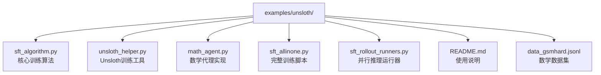
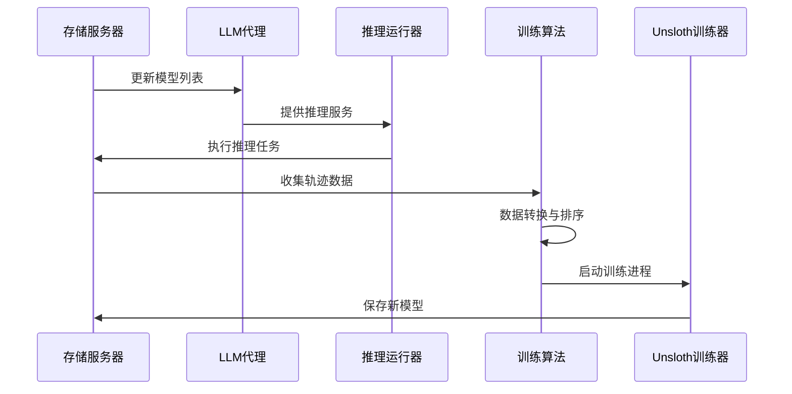
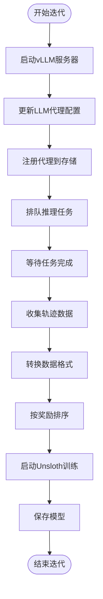
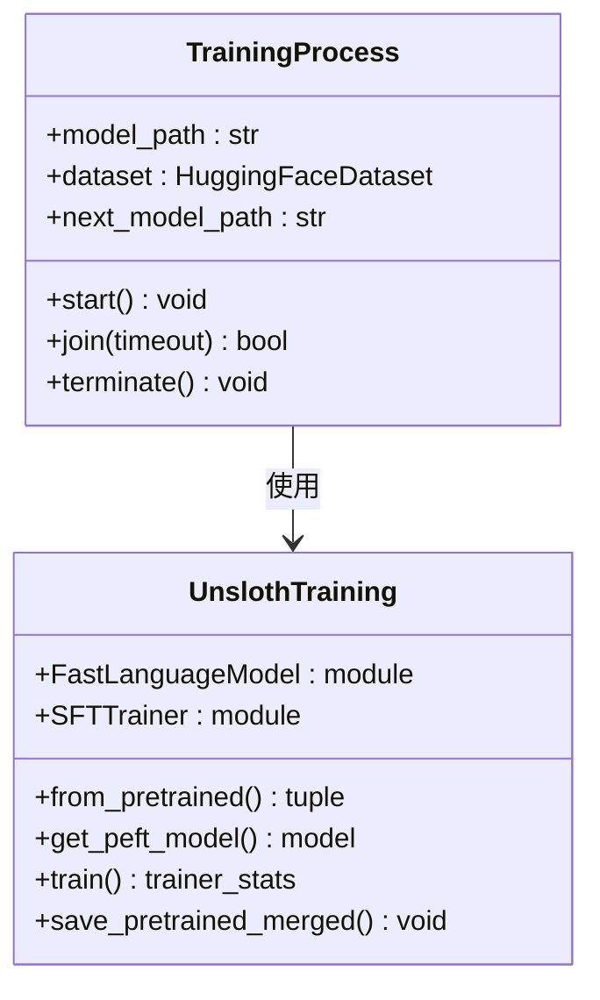
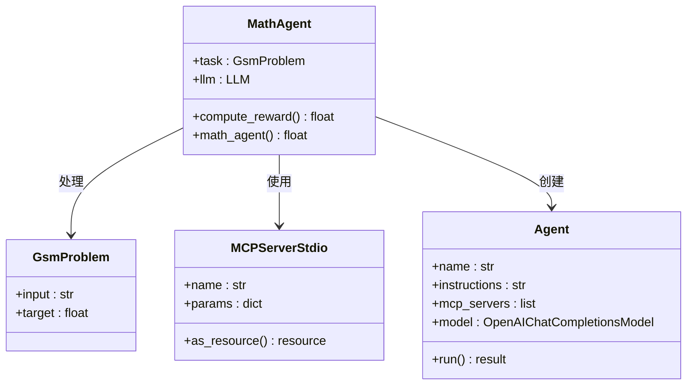
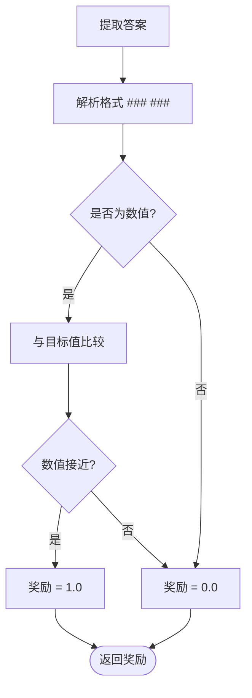
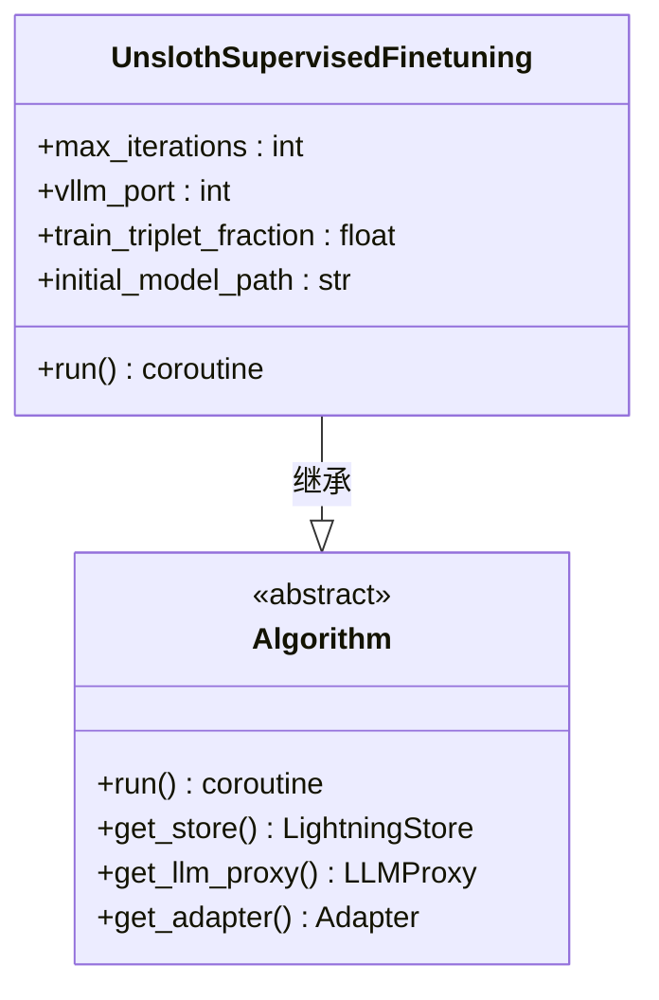
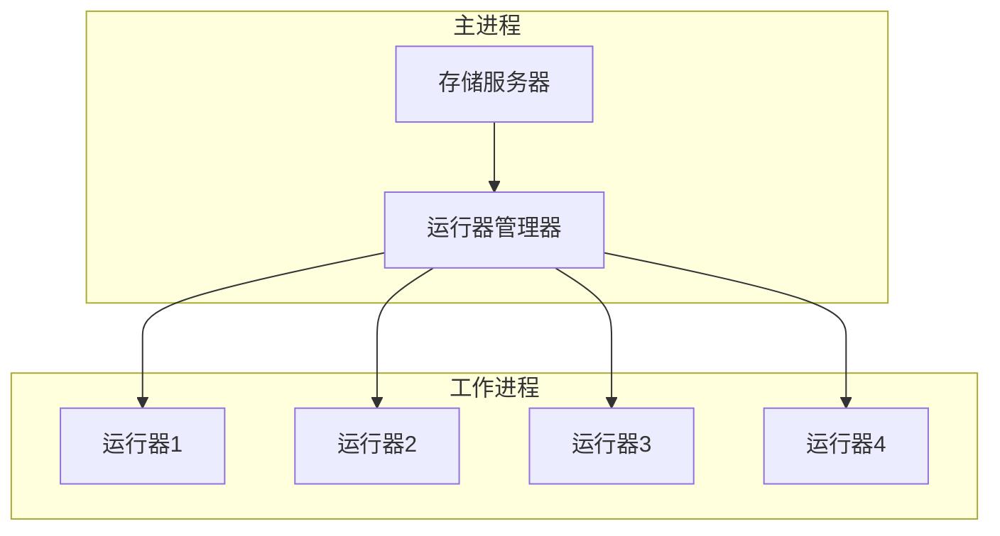
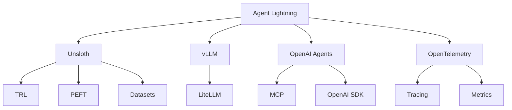

# Unsloth SFT示例系统化文档

<cite>
**本文档中引用的文件**
- [sft_algorithm.py](file://examples/unsloth/sft_algorithm.py)
- [unsloth_helper.py](file://examples/unsloth/unsloth_helper.py)
- [math_agent.py](file://examples/unsloth/math_agent.py)
- [sft_allinone.py](file://examples/unsloth/sft_allinone.py)
- [sft_rollout_runners.py](file://examples/unsloth/sft_rollout_runners.py)
- [README.md](file://examples/unsloth/README.md)
- [unsloth-sft.md](file://docs/how-to/unsloth-sft.md)
- [store.md](file://docs/deep-dive/store.md)
- [pyproject.toml](file://pyproject.toml)
</cite>

## 目录
1. [简介](#简介)
2. [项目结构](#项目结构)
3. [核心组件](#核心组件)
4. [架构概览](#架构概览)
5. [详细组件分析](#详细组件分析)
6. [依赖关系分析](#依赖关系分析)
7. [性能考虑](#性能考虑)
8. [故障排除指南](#故障排除指南)
9. [结论](#结论)

## 简介

Unsloth SFT示例展示了如何将Agent Lightning与高效的微调库Unsloth集成，实现快速数学代理训练。该示例使用监督微调(SFT)技术，通过迭代优化循环提升数学问题解决能力，特别针对GSM-hard数据集进行了优化。

### 主要特性

- **内存高效训练**：使用4位量化和LoRA技术减少GPU内存需求
- **迭代优化**：通过奖励机制选择高质量训练样本
- **分布式执行**：支持多进程并行推理和训练
- **端到端流水线**：从数据收集到模型部署的完整流程

## 项目结构

Unsloth SFT示例包含以下核心文件：

**图表来源**
- [sft_algorithm.py](file://examples/unsloth/sft_algorithm.py#L1-L50)
- [unsloth_helper.py](file://examples/unsloth/unsloth_helper.py#L1-L30)
- [math_agent.py](file://examples/unsloth/math_agent.py#L1-L40)

**章节来源**
- [README.md](file://examples/unsloth/README.md#L1-L78)

## 核心组件

### 数据准备模块

数学代理使用GSM-hard数据集，该数据集包含需要数值推理的数学问题。数据格式定义如下：

| 字段 | 类型 | 描述 |
|------|------|------|
| input | string | 数学问题描述 |
| target | float | 正确答案数值 |

### 模型微调引擎

Unsloth训练助手提供了优化的微调功能：

- **4位量化**：减少GPU内存占用
- **LoRA适配器**：低秩适应技术
- **梯度检查点**：平衡内存与计算

### 推理优化器

vLLM服务器提供高效的推理服务，支持：
- 自动工具选择
- Hermes工具调用解析
- 高并发请求处理

**章节来源**
- [math_agent.py](file://examples/unsloth/math_agent.py#L25-L50)
- [unsloth_helper.py](file://examples/unsloth/unsloth_helper.py#L15-L45)

## 架构概览

Unsloth SFT示例采用迭代训练架构，包含以下主要阶段：

**图表来源**
- [sft_algorithm.py](file://examples/unsloth/sft_algorithm.py#L100-L200)
- [sft_rollout_runners.py](file://examples/unsloth/sft_rollout_runners.py#L20-L50)

## 详细组件分析

### 核心训练算法 (sft_algorithm.py)

#### 数据收集阶段

算法首先启动vLLM服务器并配置LLM代理：

**图表来源**
- [sft_algorithm.py](file://examples/unsloth/sft_algorithm.py#L120-L280)

#### 数据转换机制

算法将代理轨迹转换为HuggingFace格式：

| 字段 | 类型 | 描述 |
|------|------|------|
| input_ids | List[int] | 完整输入序列的token ID |
| attention_mask | List[int] | 注意力掩码（全1） |
| labels | List[int] | 训练标签（提示部分为-100，响应部分为实际token ID） |
| reward | float | 与此样本关联的奖励值 |

#### 内存管理策略

训练过程在独立进程中执行以确保GPU内存正确释放：

**图表来源**
- [sft_algorithm.py](file://examples/unsloth/sft_algorithm.py#L350-L388)
- [unsloth_helper.py](file://examples/unsloth/unsloth_helper.py#L15-L95)

**章节来源**
- [sft_algorithm.py](file://examples/unsloth/sft_algorithm.py#L100-L388)

### Unsloth训练助手 (unsloth_helper.py)

#### LoRA配置参数

| 参数 | 值 | 说明 |
|------|-----|------|
| r | 32 | LoRA秩大小 |
| target_modules | ["q_proj", "k_proj", "v_proj", "o_proj", "gate_proj", "up_proj", "down_proj"] | 目标模块列表 |
| lora_alpha | 32 | LoRA缩放因子 |
| lora_dropout | 0 | Dropout率 |
| bias | "none" | 偏置处理方式 |

#### 训练配置

| 参数 | 值 | 说明 |
|------|-----|------|
| per_device_train_batch_size | 2 | 每设备训练批次大小 |
| gradient_accumulation_steps | 4 | 梯度累积步数 |
| max_steps | 60 | 最大训练步数 |
| learning_rate | 2e-4 | 学习率 |
| optim | "adamw_8bit" | 优化器类型 |

**章节来源**
- [unsloth_helper.py](file://examples/unsloth/unsloth_helper.py#L15-L95)

### 数学代理 (math_agent.py)

#### 代理架构

**图表来源**
- [math_agent.py](file://examples/unsloth/math_agent.py#L70-L120)

#### 奖励计算机制

代理使用数值比较计算奖励：

**图表来源**
- [math_agent.py](file://examples/unsloth/math_agent.py#L120-L150)

**章节来源**
- [math_agent.py](file://examples/unsloth/math_agent.py#L70-L178)

### 完整训练脚本 (sft_allinone.py)

#### 算法类设计

**图表来源**
- [sft_allinone.py](file://examples/unsloth/sft_allinone.py#L25-L80)

**章节来源**
- [sft_allinone.py](file://examples/unsloth/sft_allinone.py#L25-L116)

### 并行推理运行器 (sft_rollout_runners.py)

#### 运行器架构

**图表来源**
- [sft_rollout_runners.py](file://examples/unsloth/sft_rollout_runners.py#L40-L73)

**章节来源**
- [sft_rollout_runners.py](file://examples/unsloth/sft_rollout_runners.py#L20-L73)

## 依赖关系分析

### 核心依赖栈

**图表来源**
- [pyproject.toml](file://pyproject.toml#L150-L180)

### 版本兼容性

| 库 | 推荐版本 | 兼容版本范围 | 说明 |
|----|----------|--------------|------|
| torch | 2.8.0+ | 2.7.0+ | PyTorch版本要求 |
| vllm | 0.10.2 | 0.8.4-0.11.0 | 推理服务 |
| unsloth | 2025.10.1 | 2025.10.1, !=2025.10.2-2025.10.8 | 微调库 |
| trl | 最新 | 最新 | 训练库 |

**章节来源**
- [pyproject.toml](file://pyproject.toml#L150-L180)
- [README.md](file://examples/unsloth/README.md#L15-L30)

## 性能考虑

### 内存优化策略

1. **4位量化**：将模型权重从FP16降低到INT4
2. **LoRA适配器**：仅训练少量参数
3. **梯度检查点**：权衡内存与计算
4. **进程隔离**：确保内存及时释放

### 训练效率指标

| 阶段 | 时间复杂度 | 内存复杂度 | 优化策略 |
|------|------------|------------|----------|
| 数据收集 | O(n×m) | O(1) | 并行推理 |
| 数据转换 | O(n×m) | O(n×m) | 流式处理 |
| 训练 | O(n×steps) | O(k) | 4位量化+LoRA |
| 推理 | O(m) | O(1) | vLLM优化 |

### 硬件要求

- **GPU内存**：至少16GB（推荐32GB）
- **CPU**：多核处理器
- **存储**：SSD存储用于快速模型加载
- **网络**：高速网络连接（可选）

## 故障排除指南

### 常见问题及解决方案

#### GPU内存不足
- 减少批处理大小
- 使用更小的模型
- 增加梯度累积步数

#### 训练进程挂起
- 检查CUDA初始化
- 验证模型路径
- 监控GPU使用率

#### 数据转换错误
- 验证数据格式
- 检查token化设置
- 确认奖励计算逻辑

**章节来源**
- [sft_algorithm.py](file://examples/unsloth/sft_algorithm.py#L350-L388)

## 结论

Unsloth SFT示例展示了Agent Lightning与Unsloth库的完美集成，实现了高效的数学代理训练。通过内存优化、并行处理和智能采样策略，该方案能够在资源受限环境下实现快速模型迭代。

### 主要优势

1. **内存效率**：4位量化和LoRA技术显著降低内存需求
2. **训练速度**：并行推理和优化的训练流程
3. **易用性**：完整的端到端解决方案
4. **扩展性**：支持多种硬件配置和训练场景

### 适用场景

- 资源受限的开发环境
- 快速原型验证
- 小规模专业领域训练
- 教育和研究用途

该示例为希望在Agent Lightning框架下进行高效微调的开发者提供了实用的参考实现，展示了现代大语言模型训练的最佳实践。