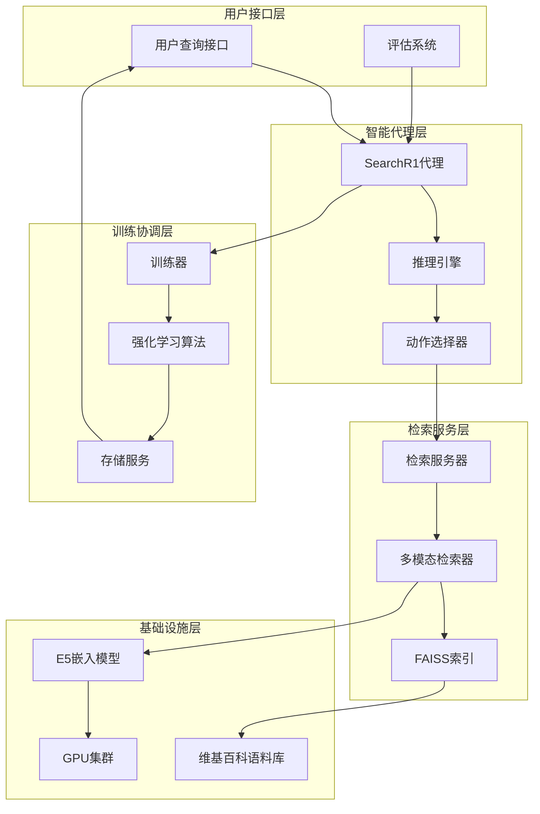
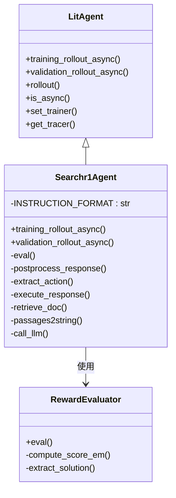
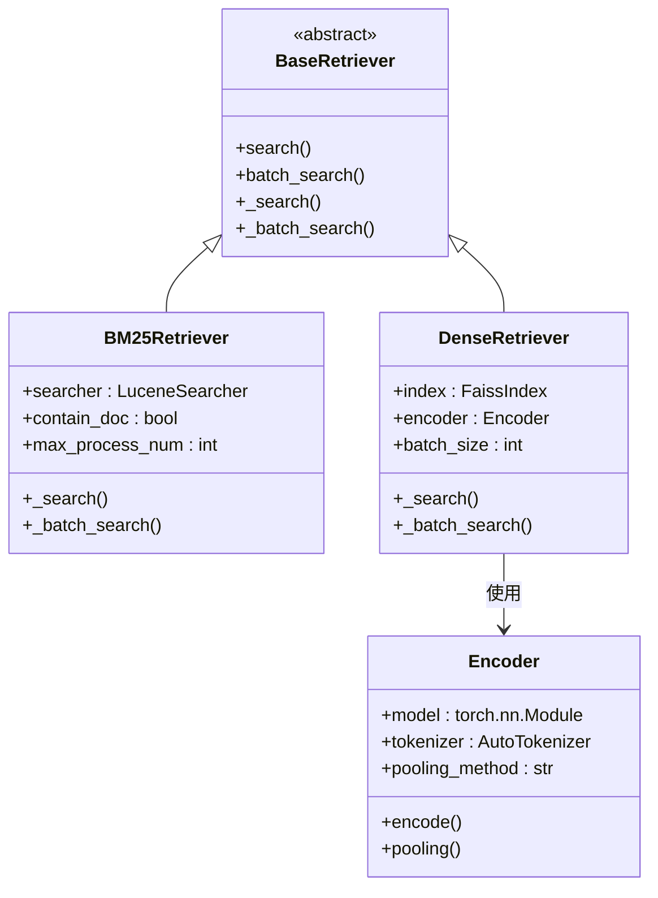
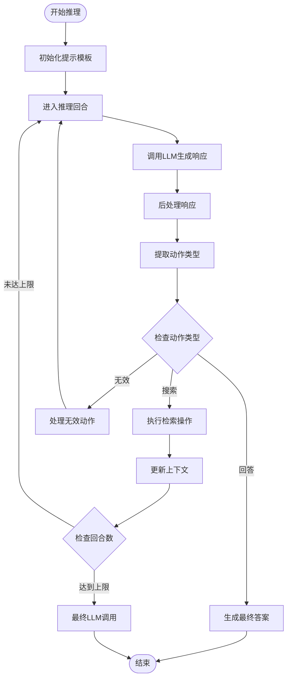
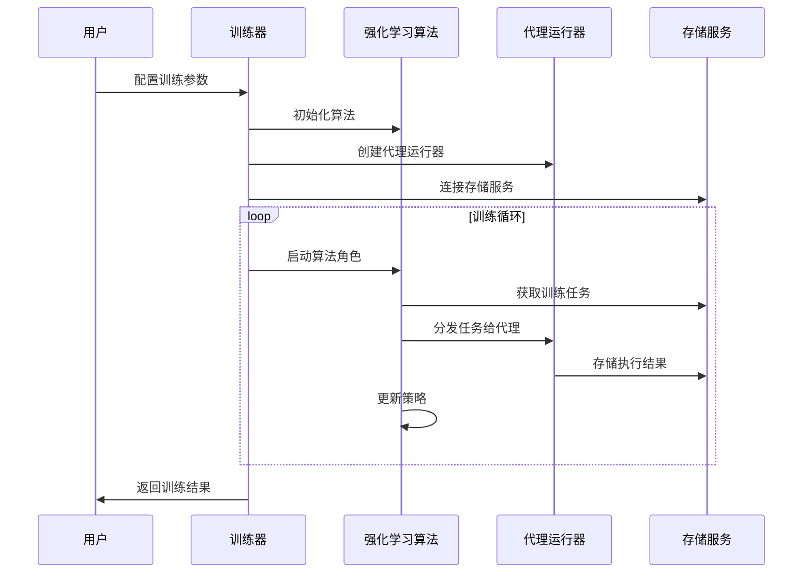
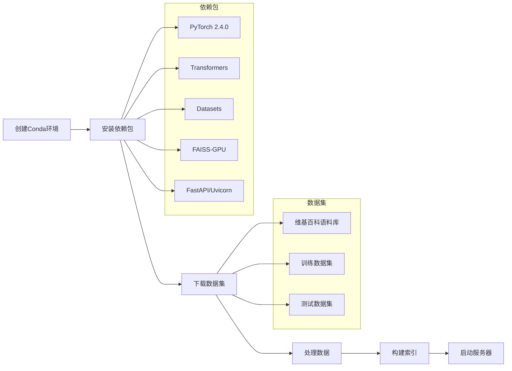
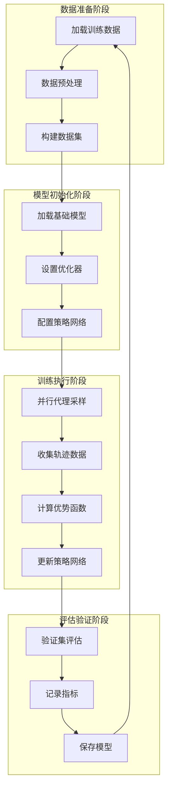
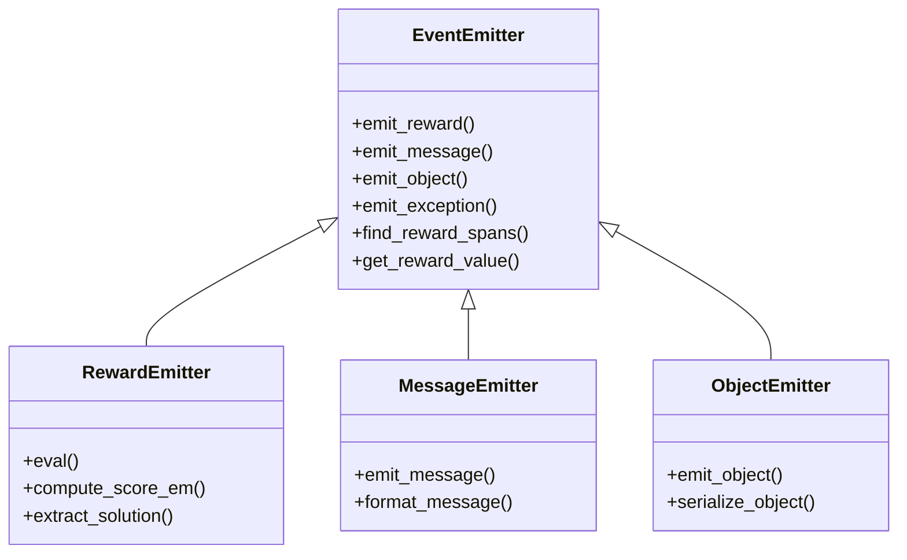
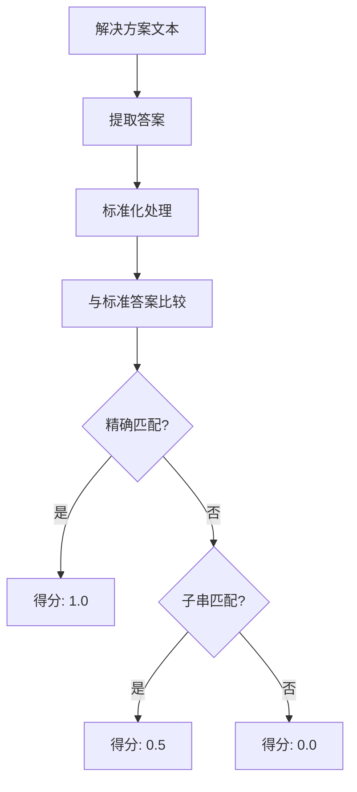

# 搜索代理示例：深入解析 Agent Lightning 框架中的复杂信息检索优化

<cite>
**本文档中引用的文件**
- [examples/search_r1/README.md](file://examples/search_r1/README.md)
- [examples/search_r1/search_r1_agent.py](file://examples/search_r1/search_r1_agent.py)
- [examples/search_r1/retrieval_server.py](file://examples/search_r1/retrieval_server.py)
- [examples/search_r1/train.sh](file://examples/search_r1/train.sh)
- [examples/search_r1/data_process.sh](file://examples/search_r1/data_process.sh)
- [examples/search_r1/qa_em.py](file://examples/search_r1/qa_em.py)
- [examples/search_r1/retrieval_launch.sh](file://examples/search_r1/retrieval_launch.sh)
- [agentlightning/__init__.py](file://agentlightning/__init__.py)
- [agentlightning/litagent/litagent.py](file://agentlightning/litagent/litagent.py)
- [agentlightning/trainer/trainer.py](file://agentlightning/trainer/trainer.py)
- [agentlightning/emitter/__init__.py](file://agentlightning/emitter/__init__.py)
- [agentlightning/tracer/base.py](file://agentlightning/tracer/base.py)
</cite>

## 目录
1. [项目概述](#项目概述)
2. [系统架构](#系统架构)
3. [核心组件分析](#核心组件分析)
4. [多跳推理与动态检索策略](#多跳推理与动态检索策略)
5. [Agent Lightning 框架集成](#agent-lightning-框架集成)
6. [检索服务器部署](#检索服务器部署)
7. [训练流程与优化](#训练流程与优化)
8. [事件发射器与数据捕获](#事件发射器与数据捕获)
9. [端到端运行示例](#端到端运行示例)
10. [可扩展性建议](#可扩展性建议)
11. [总结](#总结)

## 项目概述

搜索代理示例（search_r1）是 Agent Lightning 框架中的一个完整实现，展示了如何构建复杂的多跳信息检索系统。该示例不仅演示了端到端的强化学习训练管道，还提供了框架无关的训练架构，完全兼容 Agent Lightning v0.1.x 版本。

### 主要特性

- **多跳推理能力**：支持多次检索循环，逐步构建知识图谱
- **动态检索策略**：根据上下文动态调整检索参数和策略
- **框架无关训练**：不依赖特定框架的完整训练流水线
- **高性能检索**：基于 FAISS 和 E5 模型的高效向量检索
- **完整的评估体系**：精确匹配（EM）和子串匹配评估指标

**章节来源**
- [examples/search_r1/README.md](file://examples/search_r1/README.md#L1-L91)

## 系统架构

搜索代理系统采用分层架构设计，包含检索服务层、智能代理层和训练协调层。



**图表来源**
- [examples/search_r1/search_r1_agent.py](file://examples/search_r1/search_r1_agent.py#L1-L168)
- [examples/search_r1/retrieval_server.py](file://examples/search_r1/retrieval_server.py#L1-L464)

### 架构层次说明

1. **用户接口层**：处理用户输入和结果输出
2. **智能代理层**：执行推理逻辑和决策制定
3. **检索服务层**：提供高效的文档检索功能
4. **训练协调层**：管理强化学习训练过程
5. **基础设施层**：支撑整个系统的计算和存储需求

## 核心组件分析

### SearchR1 代理类

SearchR1 代理是系统的核心组件，继承自 `LitAgent` 基类，实现了完整的推理和检索流程。



**图表来源**
- [agentlightning/litagent/litagent.py](file://agentlightning/litagent/litagent.py#L40-L252)
- [examples/search_r1/search_r1_agent.py](file://examples/search_r1/search_r1_agent.py#L60-L168)

#### 关键方法分析

1. **training_rollout_async 方法**：执行训练时的推理循环
2. **validation_rollout_async 方法**：执行验证时的确定性推理
3. **retrieve_doc 方法**：调用检索服务器获取相关信息
4. **eval 方法**：使用奖励函数评估生成答案的质量

**章节来源**
- [examples/search_r1/search_r1_agent.py](file://examples/search_r1/search_r1_agent.py#L60-L168)

### 检索服务器架构

检索服务器提供高性能的文档检索服务，支持多种检索策略。



**图表来源**
- [examples/search_r1/retrieval_server.py](file://examples/search_r1/retrieval_server.py#L200-L464)

#### 检索策略对比

| 检索类型 | 优势 | 劣势 | 适用场景 |
|---------|------|------|----------|
| BM25检索 | 快速、准确、无需训练 | 对语义理解有限 | 结构化查询、关键词匹配 |
| 密集检索 | 强大的语义理解能力 | 计算成本高、需要索引 | 复杂语义查询、模糊匹配 |

**章节来源**
- [examples/search_r1/retrieval_server.py](file://examples/search_r1/retrieval_server.py#L200-L464)

## 多跳推理与动态检索策略

### 推理循环机制

SearchR1 实现了智能的多跳推理机制，通过迭代的搜索-思考-行动循环提升检索准确性。



**图表来源**
- [examples/search_r1/search_r1_agent.py](file://examples/search_r1/search_r1_agent.py#L100-L150)

### 动态检索策略

系统实现了智能的检索策略调整机制：

1. **检索参数动态调整**：根据当前上下文调整 top-k 参数
2. **检索时机判断**：智能识别何时需要额外信息
3. **检索质量评估**：基于历史反馈优化检索策略

**章节来源**
- [examples/search_r1/search_r1_agent.py](file://examples/search_r1/search_r1_agent.py#L70-L100)

## Agent Lightning 框架集成

### 训练器配置

Agent Lightning 提供了灵活的训练配置系统，支持多种执行策略和算法组合。



**图表来源**
- [agentlightning/trainer/trainer.py](file://agentlightning/trainer/trainer.py#L400-L556)

### 组件注册与配置

Agent Lightning 支持灵活的组件注册和配置机制：

| 组件类型 | 默认实现 | 可替换选项 | 配置方式 |
|---------|----------|------------|----------|
| 执行策略 | ClientServerExecutionStrategy | SharedMemoryExecutionStrategy | 字符串标识或字典配置 |
| 跟踪器 | AgentOpsTracer | OtelTracer, HttpTracer | 类名字符串或实例 |
| 存储服务 | InMemoryLightningStore | SQLiteStore, MemoryStore | 工厂函数或实例 |
| 适配器 | TracerTraceToTriplet | 自定义适配器 | 回调函数或类 |

**章节来源**
- [agentlightning/trainer/trainer.py](file://agentlightning/trainer/trainer.py#L200-L400)

## 检索服务器部署

### 环境准备

检索服务器的部署需要完整的环境配置和数据准备：



**图表来源**
- [examples/search_r1/data_process.sh](file://examples/search_r1/data_process.sh#L1-L32)

### 服务器启动流程

检索服务器采用 FastAPI 框架，提供 RESTful API 接口：

1. **配置加载**：解析命令行参数和配置文件
2. **模型初始化**：加载 E5 嵌入模型和分词器
3. **索引构建**：加载 FAISS 向量索引
4. **服务启动**：启动 Uvicorn 服务器监听请求

**章节来源**
- [examples/search_r1/retrieval_launch.sh](file://examples/search_r1/retrieval_launch.sh#L1-L15)
- [examples/search_r1/retrieval_server.py](file://examples/search_r1/retrieval_server.py#L450-L464)

## 训练流程与优化

### 强化学习训练管道

系统采用 GRPO（Guided Replay Policy Optimization）算法进行强化学习训练：



**图表来源**
- [examples/search_r1/train.sh](file://examples/search_r1/train.sh#L1-L57)

### 训练参数优化

关键训练参数配置：

| 参数类别 | 参数名称 | 默认值 | 说明 |
|---------|----------|--------|------|
| 模型参数 | BASE_MODEL | meta-llama/Llama-3.2-3B | 基础语言模型 |
| 批次大小 | train_batch_size | 512 | 训练批次大小 |
| 微批次大小 | ppo_micro_batch_size | 4 | PPO微批次大小 |
| 学习率 | lr | 1e-6 | 优化器学习率 |
| KL散度系数 | kl_loss_coef | 0.001 | KL散度正则化系数 |
| 截断比率 | clip_ratio | 0.2-0.3 | PPO裁剪比率范围 |

**章节来源**
- [examples/search_r1/train.sh](file://examples/search_r1/train.sh#L10-L50)

## 事件发射器与数据捕获

### 事件发射器架构

Agent Lightning 提供了完整的事件发射器系统，用于捕获和存储代理行为数据。



**图表来源**
- [agentlightning/emitter/__init__.py](file://agentlightning/emitter/__init__.py#L1-L26)

### 数据捕获流程

事件发射器通过装饰器模式自动捕获代理行为：

1. **奖励信号捕获**：通过 `@reward` 装饰器自动记录奖励值
2. **消息流捕获**：记录代理与环境交互的消息流
3. **对象状态捕获**：保存关键对象的状态信息
4. **异常处理捕获**：记录运行时异常和错误信息

**章节来源**
- [examples/search_r1/search_r1_agent.py](file://examples/search_r1/search_r1_agent.py#L30-L50)

### LightningStore 数据存储

所有捕获的数据最终存储在 LightningStore 中，支持多种存储后端：

- **内存存储**：快速访问，适合开发调试
- **SQLite存储**：持久化存储，支持复杂查询
- **分布式存储**：支持大规模训练场景

## 端到端运行示例

### 完整部署流程

以下是完整的部署和运行流程：

```bash
# 1. 准备环境和数据
bash data_process.sh

# 2. 启动检索服务器（后台运行）
bash retrieval_launch.sh

# 3. 启动Ray集群
bash ../../scripts/restart_ray.sh

# 4. 启动训练代理
python search_r1_agent.py

# 5. 启动训练服务器
bash train.sh
```

### 评估指标计算

系统提供了精确的评估指标计算功能：



**图表来源**
- [examples/search_r1/qa_em.py](file://examples/search_r1/qa_em.py#L1-L135)

**章节来源**
- [examples/search_r1/README.md](file://examples/search_r1/README.md#L60-L91)

## 可扩展性建议

### 架构扩展点

1. **检索策略扩展**：
   - 添加更多嵌入模型支持（如 BGE、DPR）
   - 实现混合检索策略
   - 支持多模态检索（文本+图像）

2. **推理机制增强**：
   - 实现更复杂的多跳推理算法
   - 添加记忆机制和上下文窗口管理
   - 支持并行推理和异步处理

3. **训练优化改进**：
   - 集成更多强化学习算法（PPO、A2C等）
   - 实现在线学习和持续训练
   - 添加分布式训练支持

### 性能优化建议

1. **检索性能优化**：
   - 实现检索结果缓存机制
   - 添加检索质量预筛选
   - 优化批量处理和并发控制

2. **训练效率提升**：
   - 实现梯度累积和混合精度训练
   - 添加早停机制和学习率调度
   - 优化数据加载和预处理流程

3. **系统资源管理**：
   - 实现动态资源分配和负载均衡
   - 添加监控和告警系统
   - 支持容器化部署和自动化运维

### 应用场景扩展

该架构可以应用于多种检索增强生成（RAG）场景：

- **问答系统**：构建智能客服和知识问答平台
- **文档检索**：企业知识库和学术文献检索
- **代码辅助**：编程助手和代码生成工具
- **医疗诊断**：医学知识检索和诊断辅助系统

## 总结

搜索代理示例（search_r1）展示了 Agent Lightning 框架的强大能力和灵活性。通过多跳推理、动态检索策略和强化学习训练，该系统实现了高质量的信息检索和生成能力。

### 核心优势

1. **框架无关性**：完全独立于特定框架的训练管道
2. **模块化设计**：清晰的组件分离和可插拔架构
3. **高性能实现**：基于 FAISS 和现代嵌入模型的高效检索
4. **完整的训练闭环**：从数据准备到模型部署的全流程支持

### 技术创新

- **智能推理循环**：通过迭代的搜索-思考-行动循环提升检索准确性
- **动态检索策略**：根据上下文智能调整检索参数和策略
- **事件驱动架构**：完整的数据捕获和存储机制
- **强化学习集成**：基于 GRPO 算法的端到端训练优化

该示例为构建复杂的检索增强生成系统提供了完整的参考实现，具有很高的实用价值和扩展潜力。开发者可以根据具体需求，在此基础上进行定制化开发和优化。