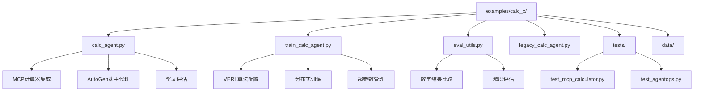
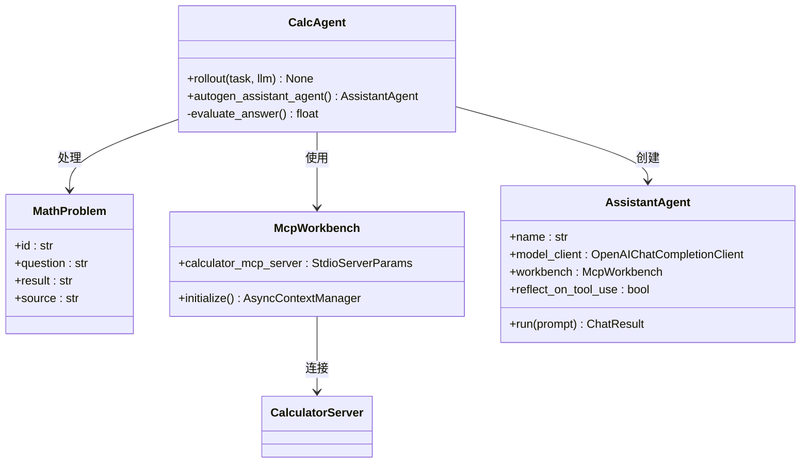
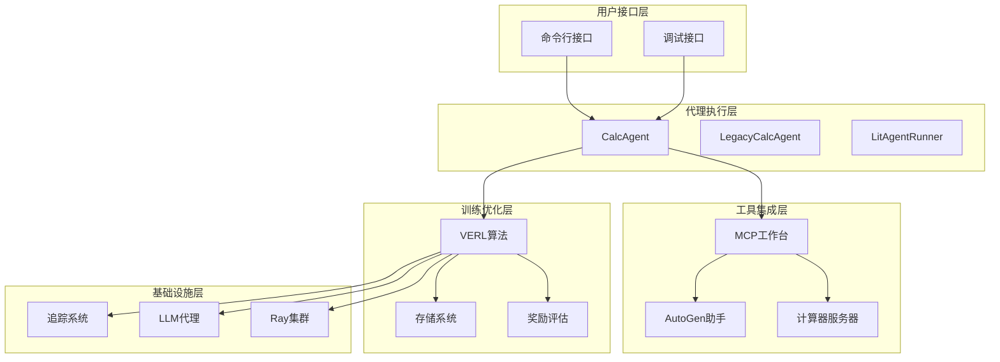
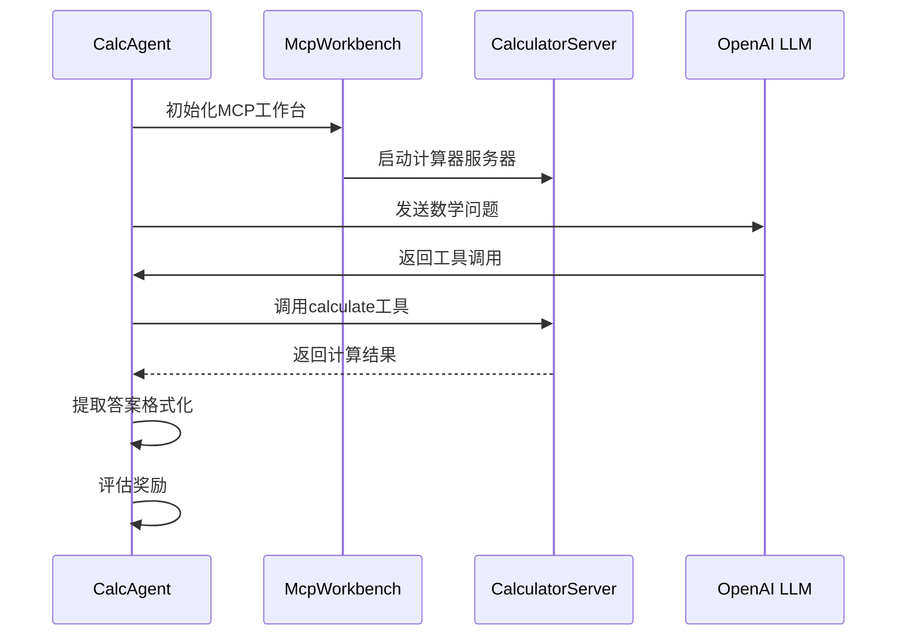
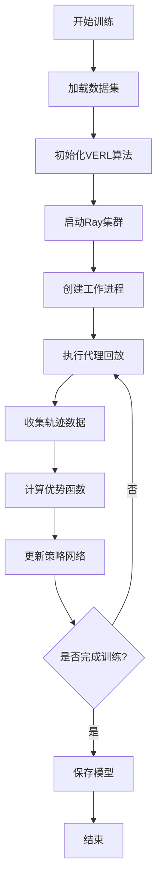
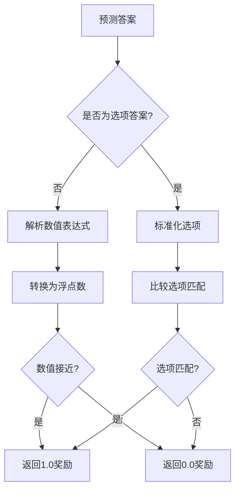
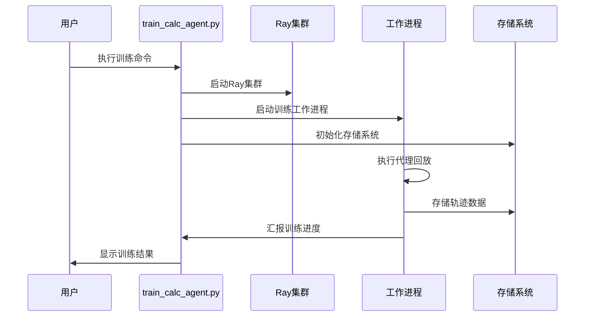
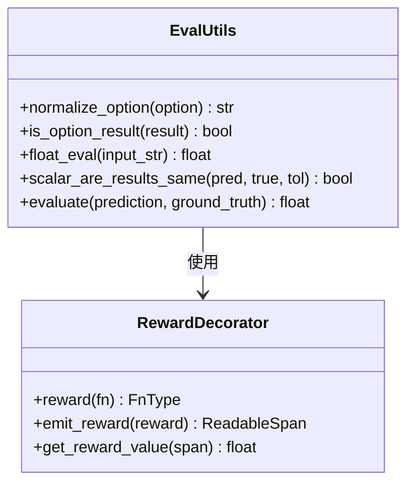

# 数学计算代理示例

<cite>
**本文档中引用的文件**
- [examples/calc_x/README.md](file://examples/calc_x/README.md)
- [examples/calc_x/calc_agent.py](file://examples/calc_x/calc_agent.py)
- [examples/calc_x/train_calc_agent.py](file://examples/calc_x/train_calc_agent.py)
- [examples/calc_x/eval_utils.py](file://examples/calc_x/eval_utils.py)
- [examples/calc_x/legacy_calc_agent.py](file://examples/calc_x/legacy_calc_agent.py)
- [examples/calc_x/tests/test_mcp_calculator.py](file://examples/calc_x/tests/test_mcp_calculator.py)
- [examples/calc_x/tests/test_agentops.py](file://examples/calc_x/tests/test_agentops.py)
- [examples/calc_x/legacy_calc_agent_debug.py](file://examples/calc_x/legacy_calc_agent_debug.py)
- [examples/calc_x/legacy_train.sh](file://examples/calc_x/legacy_train.sh)
- [agentlightning/trainer/trainer.py](file://agentlightning/trainer/trainer.py)
- [agentlightning/litagent/litagent.py](file://agentlightning/litagent/litagent.py)
- [agentlightning/emitter/reward.py](file://agentlightning/emitter/reward.py)
</cite>

## 目录
1. [简介](#简介)
2. [项目结构](#项目结构)
3. [核心组件](#核心组件)
4. [架构概览](#架构概览)
5. [详细组件分析](#详细组件分析)
6. [训练流程](#训练流程)
7. [性能评估](#性能评估)
8. [部署指南](#部署指南)
9. [故障排除](#故障排除)
10. [总结](#总结)

## 简介

数学计算代理（Calc-X）示例是Agent Lightning框架的一个重要演示项目，展示了如何使用强化学习技术训练数学推理代理。该项目基于VERL算法和AutoGen框架，通过模型上下文协议（MCP）访问计算器工具来解决数学问题。

### 主要特性

- **零代码变更优化**：通过Agent Lightning框架对数学推理代理进行优化
- **MCP集成**：与计算器服务器的无缝集成
- **强化学习训练**：使用VERL算法进行端到端训练
- **多版本兼容**：支持新旧两种API版本
- **性能监控**：集成AgentOps和LiteLLM进行跟踪

## 项目结构



**图表来源**
- [examples/calc_x/calc_agent.py](file://examples/calc_x/calc_agent.py#L1-L159)
- [examples/calc_x/train_calc_agent.py](file://examples/calc_x/train_calc_agent.py#L1-L233)
- [examples/calc_x/eval_utils.py](file://examples/calc_x/eval_utils.py#L1-L70)

**章节来源**
- [examples/calc_x/README.md](file://examples/calc_x/README.md#L1-L75)

## 核心组件

### 数学问题定义

项目使用`MathProblem`类型定义数学问题的数据结构：

```python
class MathProblem(TypedDict):
    id: str          # 问题ID
    question: str    # 数学问题描述
    chain: str       # 解题步骤（训练时不使用）
    result: str      # 真实答案
    source: str      # 数据源
```

### 代理架构



**图表来源**
- [examples/calc_x/calc_agent.py](file://examples/calc_x/calc_agent.py#L15-L159)

**章节来源**
- [examples/calc_x/calc_agent.py](file://examples/calc_x/calc_agent.py#L15-L159)

## 架构概览

数学计算代理采用分层架构设计，包含以下主要层次：



**图表来源**
- [examples/calc_x/train_calc_agent.py](file://examples/calc_x/train_calc_agent.py#L41-L233)
- [agentlightning/trainer/trainer.py](file://agentlightning/trainer/trainer.py#L40-L199)

## 详细组件分析

### 计算器MCP集成

项目通过MCP（Model Context Protocol）实现与计算器服务器的集成：



**图表来源**
- [examples/calc_x/calc_agent.py](file://examples/calc_x/calc_agent.py#L74-L103)
- [examples/calc_x/tests/test_mcp_calculator.py](file://examples/calc_x/tests/test_mcp_calculator.py#L15-L65)

### 强化学习训练流程

VERL算法的训练流程包含以下关键步骤：



**图表来源**
- [examples/calc_x/train_calc_agent.py](file://examples/calc_x/train_calc_agent.py#L82-L233)

### 奖励评估机制

项目实现了智能的奖励评估系统：



**图表来源**
- [examples/calc_x/eval_utils.py](file://examples/calc_x/eval_utils.py#L25-L69)

**章节来源**
- [examples/calc_x/eval_utils.py](file://examples/calc_x/eval_utils.py#L1-L70)

## 训练流程

### 环境配置

训练前需要准备以下环境：

1. **硬件要求**：至少一个40GB GPU的单节点
2. **软件依赖**：
   ```bash
   pip install "autogen-agentchat" "autogen-ext[openai]" "mcp>=1.10.0"
   ```
3. **数据准备**：
   ```bash
   unzip calc-x-data.zip -d data
   ```

### 训练脚本执行



**图表来源**
- [examples/calc_x/train_calc_agent.py](file://examples/calc_x/train_calc_agent.py#L82-L233)

### 超参数配置

VERL算法的关键配置参数：

| 参数类别 | 配置项 | 默认值 | 说明 |
|----------|--------|--------|------|
| 算法参数 | adv_estimator | grpo | 优势估计器类型 |
| 算法参数 | use_kl_in_reward | false | 是否在奖励中使用KL散度 |
| 数据参数 | train_batch_size | 32 | 训练批次大小 |
| 数据参数 | max_prompt_length | 4096 | 最大提示长度 |
| 数据参数 | max_response_length | 2048 | 最大响应长度 |
| Actor参数 | ppo_mini_batch_size | 32 | PPO迷你批次大小 |
| Actor参数 | ppo_micro_batch_size_per_gpu | 4 | GPU微批次大小 |
| Actor参数 | lr | 1e-6 | 学习率 |
| 模型参数 | path | Qwen/Qwen2.5-1.5B-Instruct | 基础模型路径 |

**章节来源**
- [examples/calc_x/train_calc_agent.py](file://examples/calc_x/train_calc_agent.py#L41-L80)

## 性能评估

### 评估指标

项目使用多种指标评估代理性能：

1. **准确率**：正确回答的比例
2. **数值精度**：数值计算的准确性
3. **选项匹配**：选择题的选项正确率
4. **推理质量**：解题过程的质量评估

### 评估工具



**图表来源**
- [examples/calc_x/eval_utils.py](file://examples/calc_x/eval_utils.py#L10-L70)
- [agentlightning/emitter/reward.py](file://agentlightning/emitter/reward.py#L40-L239)

**章节来源**
- [examples/calc_x/eval_utils.py](file://examples/calc_x/eval_utils.py#L1-L70)

## 部署指南

### 快速开始

1. **安装依赖**：
   ```bash
   pip install agentlightning
   ```

2. **下载数据**：
   ```bash
   unzip calc-x-data.zip -d data
   ```

3. **启动训练**：
   ```bash
   bash ../../scripts/restart_ray.sh
   python train_calc_agent.py --train-file data/train.parquet --val-file data/test.parquet
   ```

### 调试模式

```bash
python calc_agent.py
```

### 实验室版本

对于旧版本兼容性：

```bash
bash legacy_train.sh
python legacy_calc_agent.py
```

**章节来源**
- [examples/calc_x/README.md](file://examples/calc_x/README.md#L40-L75)

## 故障排除

### 常见问题

1. **MCP计算器连接失败**
   - 确保`uvx`和MCP计算器服务器已正确安装
   - 检查环境变量配置
   - 运行测试脚本验证连接

2. **GPU内存不足**
   - 调整`gpu_memory_utilization`参数
   - 减少批次大小或微批次大小
   - 使用梯度检查点

3. **训练不收敛**
   - 检查学习率设置
   - 验证奖励信号质量
   - 调整KL散度系数

### 性能调优建议

1. **内存优化**
   - 启用参数卸载和优化器卸载
   - 使用梯度检查点
   - 调整批次大小

2. **计算优化**
   - 使用张量并行处理
   - 优化GPU内存利用率
   - 并行化训练过程

3. **训练稳定性**
   - 监控KL散度变化
   - 调整裁剪比率
   - 使用适当的奖励缩放

**章节来源**
- [examples/calc_x/README.md](file://examples/calc_x/README.md#L60-L75)

## 总结

数学计算代理示例展示了Agent Lightning框架在强化学习领域的强大能力。通过零代码变更优化、MCP集成和VERL算法，该项目成功实现了数学推理代理的自动化训练。

### 关键优势

1. **零代码变更优化**：无需修改代理代码即可获得性能提升
2. **模块化设计**：清晰的组件分离便于维护和扩展
3. **强大的工具集成**：MCP协议提供了灵活的工具访问机制
4. **完善的评估体系**：多层次的评估确保了训练效果

### 应用前景

该示例为数学教育、智能问答系统和科学计算等领域提供了可参考的解决方案，展示了强化学习在复杂推理任务中的应用潜力。