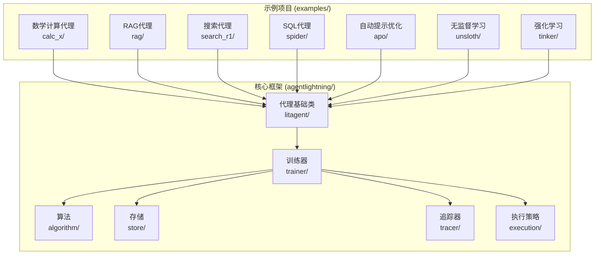
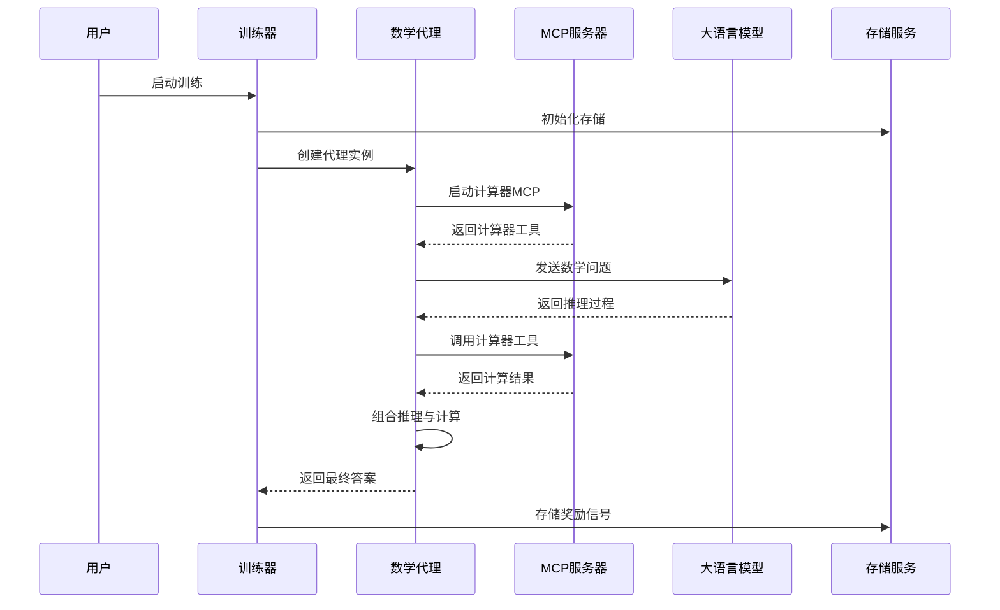
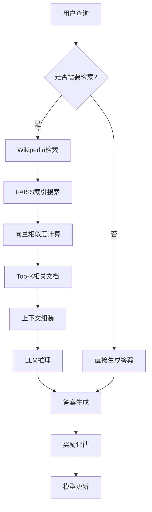
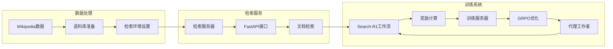
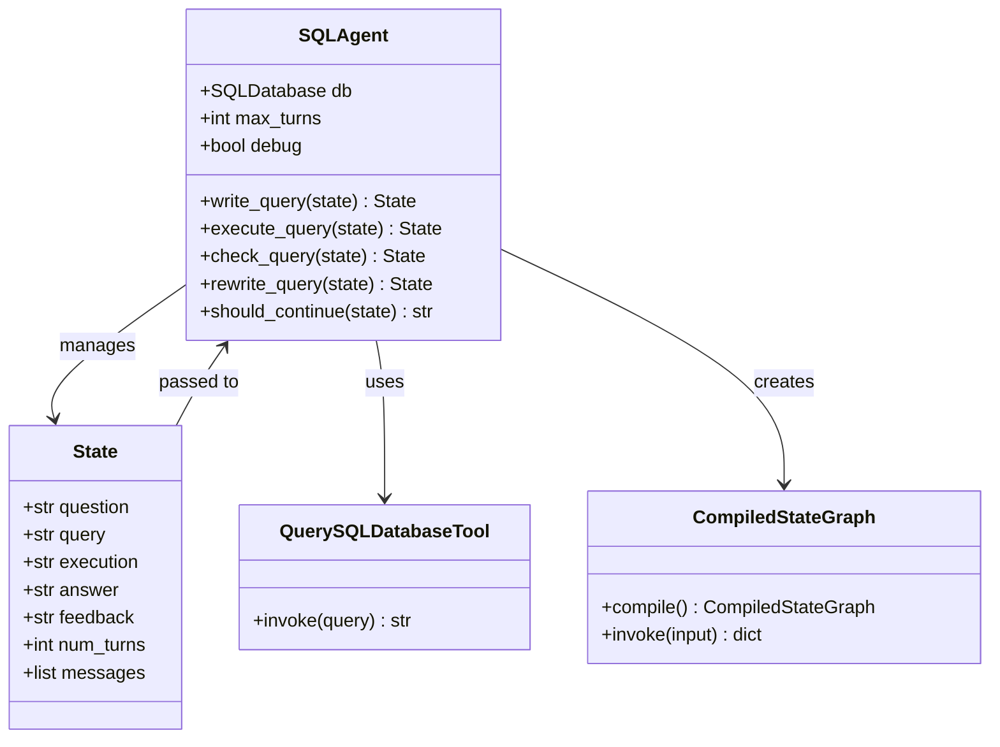
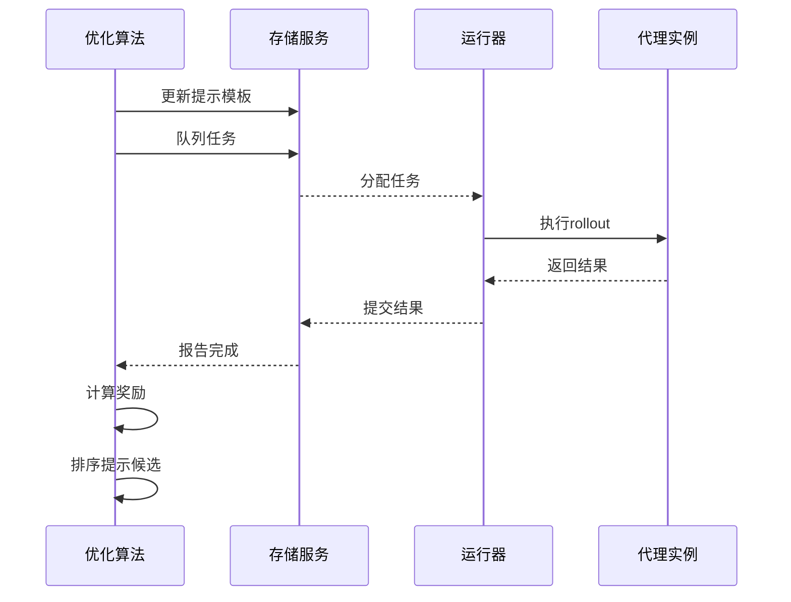
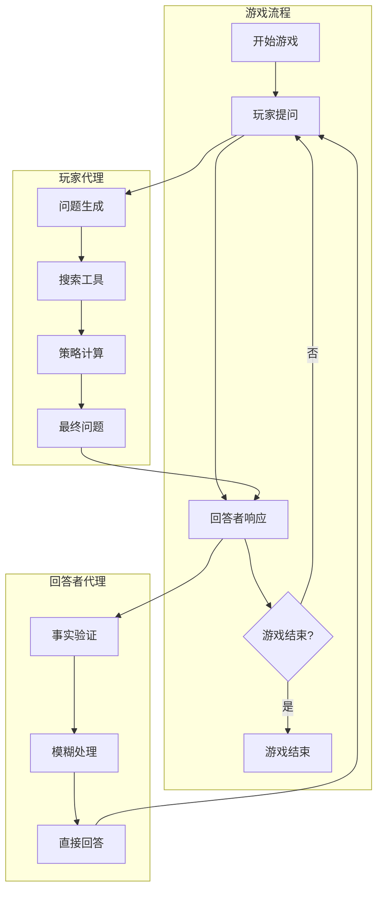
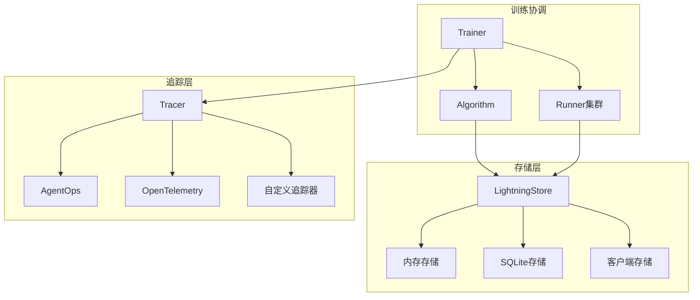

# 示例与用例

<cite>
**本文档中引用的文件**
- [examples/README.md](file://examples/README.md)
- [examples/calc_x/README.md](file://examples/calc_x/README.md)
- [examples/calc_x/calc_agent.py](file://examples/calc_x/calc_agent.py)
- [examples/calc_x/train_calc_agent.py](file://examples/calc_x/train_calc_agent.py)
- [examples/rag/README.md](file://examples/rag/README.md)
- [examples/rag/rag_agent.py](file://examples/rag/rag_agent.py)
- [examples/search_r1/README.md](file://examples/search_r1/README.md)
- [examples/search_r1/search_r1_agent.py](file://examples/search_r1/search_r1_agent.py)
- [examples/spider/README.md](file://examples/spider/README.md)
- [examples/spider/sql_agent.py](file://examples/spider/sql_agent.py)
- [examples/unsloth/math_agent.py](file://examples/unsloth/math_agent.py)
- [examples/tinker/q20_agent.py](file://examples/tinker/q20_agent.py)
- [examples/apo/apo_custom_algorithm.py](file://examples/apo/apo_custom_algorithm.py)
- [agentlightning/__init__.py](file://agentlightning/__init__.py)
- [agentlightning/litagent/litagent.py](file://agentlightning/litagent/litagent.py)
- [agentlightning/trainer/trainer.py](file://agentlightning/trainer/trainer.py)
</cite>

## 目录
1. [简介](#简介)
2. [项目结构概览](#项目结构概览)
3. [核心示例分类](#核心示例分类)
4. [数学计算代理示例](#数学计算代理示例)
5. [检索增强生成(RAG)代理示例](#检索增强生成rag代理示例)
6. [搜索代理示例](#搜索代理示例)
7. [SQL代理示例](#sql代理示例)
8. [自动提示优化(APO)示例](#自动提示优化apo示例)
9. [高级用例示例](#高级用例示例)
10. [最佳实践与设计模式](#最佳实践与设计模式)
11. [性能基准测试与优化](#性能基准测试与优化)
12. [扩展到生产级应用](#扩展到生产级应用)
13. [故障排除指南](#故障排除指南)
14. [总结](#总结)

## 简介

Agent Lightning 是一个灵活且可扩展的框架，旨在实现任何现有代理框架的无缝代理优化。该框架通过各种数据驱动技术定制代理以获得更好的性能，包括但不限于模型微调、提示调优和模型选择。本文档系统化地整理和文档化了所有示例项目，涵盖了数学计算代理、RAG代理、搜索代理、SQL代理等典型用例。

Agent Lightning 框架的核心优势在于：
- **灵活性**：支持多种代理框架（AutoGen、LangChain、CrewAI等）
- **可扩展性**：模块化设计，易于扩展新功能
- **高性能**：基于VERL算法的强化学习训练
- **易用性**：简洁的API设计，降低使用门槛

## 项目结构概览

Agent Lightning 项目采用清晰的分层架构，主要包含以下核心组件：



**图表来源**
- [examples/README.md](file://examples/README.md#L1-L16)
- [agentlightning/__init__.py](file://agentlightning/__init__.py#L1-L20)

**章节来源**
- [examples/README.md](file://examples/README.md#L1-L16)
- [agentlightning/__init__.py](file://agentlightning/__init__.py#L1-L20)

## 核心示例分类

Agent Lightning 的示例项目按功能和应用场景可分为以下几大类别：

### 1. 数学推理与计算
- **Calc-X示例**：基于VERL算法的数学推理代理训练
- **无监督学习示例**：GSM-hard数据集上的数学问题求解

### 2. 检索增强生成(RAG)
- **Wiki检索示例**：MuSiQue数据集上的多跳问答
- **框架无关训练**：无需特定框架的端到端RL训练

### 3. 搜索与信息检索
- **Search-R1示例**：基于检索的问答系统
- **多轮对话**：支持多次搜索的交互式问答

### 4. 特定领域应用
- **SQL代理**：Spider数据集上的文本转SQL转换
- **20 Questions游戏**：基于CrewAI的智能问答游戏

### 5. 提示优化与调试
- **APO示例**：自动提示优化算法
- **自定义算法**：可插拔的优化策略

**章节来源**
- [examples/README.md](file://examples/README.md#L4-L15)

## 数学计算代理示例

### 场景说明

数学计算代理示例展示了如何使用Agent Lightning结合VERL算法训练一个能够解决数学问题的智能代理。该示例使用AutoGen框架和MCP计算器工具，支持复杂的数学推理任务。

### 架构设计



**图表来源**
- [examples/calc_x/calc_agent.py](file://examples/calc_x/calc_agent.py#L40-L80)
- [examples/calc_x/train_calc_agent.py](file://examples/calc_x/train_calc_agent.py#L150-L200)

### 核心组件分析

#### 1. 代理定义与配置

数学代理的核心实现包含以下关键组件：

- **数学问题类型定义**：使用TypedDict定义问题结构
- **MCP工作台集成**：通过Model Context Protocol访问计算器工具
- **AutoGen助手代理**：基于OpenAI模型的推理能力
- **奖励评估机制**：自动评估答案正确性

#### 2. 训练流程

训练流程采用分布式架构，包含以下步骤：

1. **环境准备**：启动Ray集群和存储服务
2. **数据加载**：从Parquet文件加载训练和验证数据
3. **模型配置**：设置VERL算法参数和超参数
4. **并行训练**：多个代理工作者并行执行rollout
5. **算法优化**：使用GRPO算法更新模型参数

#### 3. 性能优化

- **GPU内存管理**：通过`gpu_memory_utilization`参数优化内存使用
- **梯度检查点**：启用`enable_gradient_checkpointing`减少内存占用
- **混合精度训练**：支持FP16/BF16训练加速

### 运行指南

#### 训练命令

```bash
# 启动Ray集群
bash ../../scripts/restart_ray.sh

# 设置Weights & Biases（可选）
export WANDB_API_KEY=your_key

# 开始训练
python train_calc_agent.py \
    --train-file data/train.parquet \
    --val-file data/test.parquet \
    --model Qwen/Qwen2.5-1.5B-Instruct
```

#### 调试模式

```bash
# 交互式测试代理
python calc_agent.py
```

**章节来源**
- [examples/calc_x/README.md](file://examples/calc_x/README.md#L1-L75)
- [examples/calc_x/calc_agent.py](file://examples/calc_x/calc_agent.py#L1-L159)
- [examples/calc_x/train_calc_agent.py](file://examples/calc_x/train_calc_agent.py#L1-L233)

## 检索增强生成(RAG)代理示例

### 场景说明

RAG代理示例演示了如何使用Agent Lightning构建检索增强生成系统，该系统能够回答来自MuSiQue数据集的多跳问题。系统通过Wikipedia检索能力提供上下文信息来增强生成质量。

### 架构设计



**图表来源**
- [examples/rag/rag_agent.py](file://examples/rag/rag_agent.py#L20-L60)

### 核心组件分析

#### 1. 检索系统

RAG代理的核心依赖于高效的检索系统：

- **FAISS索引**：使用HNSW算法构建近似最近邻搜索
- **向量嵌入**：基于BAAI/bge-large-en-v1.5模型生成
- **文档切片**：预处理的Wikipedia文本块
- **检索策略**：支持多轮检索和上下文累积

#### 2. 代理工作流

代理采用迭代检索-生成模式：

1. **初始查询**：接收用户问题并决定是否需要检索
2. **检索阶段**：根据当前上下文搜索相关文档
3. **生成阶段**：结合检索结果生成答案
4. **评估阶段**：计算精确匹配和F1分数

#### 3. 数据准备

检索系统的数据准备包含以下步骤：

- **文本收集**：下载Wikipedia数据集或使用其他语料库
- **向量化**：批量编码文本块生成向量表示
- **索引构建**：创建HNSW索引支持高效搜索
- **元数据存储**：保存原始文本块用于检索后使用

### 运行指南

#### 环境准备

```bash
# 安装依赖
bash wiki_retriever_install.sh

# 启动检索服务器
python wiki_retriever_mcp.py

# 启动Ray集群
bash ../../scripts/restart_ray.sh
```

#### 训练流程

```bash
# 启动代理工作者
python rag_agent.py

# 在另一个终端启动训练服务器
bash train.sh
```

**章节来源**
- [examples/rag/README.md](file://examples/rag/README.md#L1-L125)
- [examples/rag/rag_agent.py](file://examples/rag/rag_agent.py#L1-L81)

## 搜索代理示例

### 场景说明

搜索代理示例实现了Search-R1框架，展示了如何在Agent Lightning中运行无需特定框架的端到端强化学习训练。该示例专门针对单节点8GPU环境设计，支持大规模并行训练。

### 架构设计



**图表来源**
- [examples/search_r1/search_r1_agent.py](file://examples/search_r1/search_r1_agent.py#L80-L120)

### 核心组件分析

#### 1. 检索服务器

搜索代理的核心是高性能的检索服务器：

- **FastAPI实现**：提供RESTful接口支持实时检索
- **并发处理**：支持高并发查询请求
- **缓存机制**：优化频繁查询的响应时间
- **错误处理**：健壮的异常捕获和恢复机制

#### 2. 代理工作流

Search-R1代理采用多轮对话模式：

1. **指令格式化**：使用预定义的指令模板引导代理行为
2. **行动提取**：从LLM输出中提取搜索或回答指令
3. **环境交互**：调用检索服务器获取相关信息
4. **状态管理**：维护对话历史和当前状态

#### 3. 奖励机制

代理的奖励计算基于精确匹配评估：

- **EM指标**：计算预测答案与参考答案的精确匹配
- **多轮评估**：支持多轮对话的答案评估
- **反馈循环**：将奖励信号反馈给训练算法

### 运行指南

#### 数据准备

```bash
# 准备数据和环境
bash data_process.sh

# 启动检索服务器
bash retrieval_launch.sh
```

#### 训练执行

```bash
# 启动Ray集群
bash ../../scripts/restart_ray.sh

# 启动代理工作者
python search_r1_agent.py

# 在另一个终端启动训练服务器
bash train.sh
```

**章节来源**
- [examples/search_r1/README.md](file://examples/search_r1/README.md#L1-L91)
- [examples/search_r1/search_r1_agent.py](file://examples/search_r1/search_r1_agent.py#L1-L168)

## SQL代理示例

### 场景说明

SQL代理示例展示了如何使用Agent Lightning在Spider数据集上训练文本转SQL转换代理。该示例结合了LangChain和LangGraph框架，提供了完整的SQL查询生成解决方案。

### 架构设计



**图表来源**
- [examples/spider/sql_agent.py](file://examples/spider/sql_agent.py#L150-L200)

### 核心组件分析

#### 1. 状态图编排

SQL代理使用LangGraph的状态图来管理查询生成流程：

- **写查询节点**：生成初始SQL查询
- **执行查询节点**：执行生成的查询
- **检查查询节点**：验证查询语法和逻辑
- **重写查询节点**：根据反馈修正查询
- **条件边**：基于查询质量和轮次限制控制流程

#### 2. 查询验证机制

代理实现了多层次的查询验证：

1. **语法检查**：验证SQL语法正确性
2. **语义检查**：检查列名、表名等语义元素
3. **执行验证**：尝试执行查询并捕获错误
4. **反馈生成**：提供具体的修正建议

#### 3. 执行评估

SQL查询的评估基于执行匹配：

- **执行匹配**：比较实际执行结果与期望结果
- **容错处理**：支持部分匹配和近似匹配
- **错误恢复**：在执行失败时提供回退策略

### 运行指南

#### 训练命令

```bash
# 安装依赖
pip install "langgraph<1.0" "langchain[openai]<1.0" ...

# 训练SQL代理
python train_sql_agent.py qwen
```

#### 调试模式

```bash
# 交互式调试
python sql_agent.py
```

**章节来源**
- [examples/spider/README.md](file://examples/spider/README.md#L1-L49)
- [examples/spider/sql_agent.py](file://examples/spider/sql_agent.py#L1-L546)

## 自动提示优化(APO)示例

### 场景说明

APO示例展示了如何使用Agent Lightning进行自动提示优化，这是一种数据驱动的技术，用于定制代理以获得更好的性能。该示例演示了算法和运行器的分离架构。

### 架构设计



**图表来源**
- [examples/apo/apo_custom_algorithm.py](file://examples/apo/apo_custom_algorithm.py#L30-L80)

### 核心组件分析

#### 1. 优化算法

APO算法采用迭代优化策略：

- **提示候选**：预先定义多个提示模板候选
- **资源更新**：动态更新代理使用的提示模板
- **任务队列**：将任务分配给运行器执行
- **奖励收集**：收集并排序不同提示的效果

#### 2. 分离架构

APO示例展示了算法和运行器的分离设计：

- **算法模式**：负责优化策略和资源调度
- **运行器模式**：专注于代理执行和结果收集
- **存储中介**：作为算法和运行器之间的通信桥梁

#### 3. 评估机制

代理的评估通过LLM裁判完成：

- **裁判模型**：使用GPT-4.1-nano进行严格评估
- **评分标准**：提供0-1范围内的数值评分
- **一致性要求**：确保评估的一致性和客观性

### 运行指南

#### 单独运行

```bash
# 启动存储服务
agl store

# 启动算法
python apo_custom_algorithm.py algo

# 启动运行器
python apo_custom_algorithm.py runner
```

#### 集成运行

```bash
# 使用集成版本
python apo_custom_algorithm_trainer.py
```

**章节来源**
- [examples/apo/apo_custom_algorithm.py](file://examples/apo/apo_custom_algorithm.py#L1-L186)

## 高级用例示例

### 20 Questions游戏示例

#### 场景说明

20 Questions游戏示例展示了如何使用CrewAI框架构建复杂的多智能体交互系统。该示例包含了玩家代理、回答者代理和模拟搜索引擎工具。

#### 核心特性

- **多智能体协作**：玩家和回答者之间的智能交互
- **工具集成**：模拟Web搜索工具的使用
- **状态管理**：复杂的游戏状态跟踪
- **策略优化**：基于信息增益的问题选择策略

#### 架构设计



**图表来源**
- [examples/tinker/q20_agent.py](file://examples/tinker/q20_agent.py#L250-L320)

### 无监督学习示例

#### 场景说明

无监督学习示例展示了如何使用Agent Lightning进行监督微调，特别是结合Unsloth库实现4位量化和LoRA技术。

#### 核心技术

- **4位量化**：大幅减少模型内存占用
- **LoRA适配器**：高效参数微调方法
- **SFT算法**：监督微调专用算法
- **批处理优化**：并行处理多个训练样本

**章节来源**
- [examples/tinker/q20_agent.py](file://examples/tinker/q20_agent.py#L1-L321)
- [examples/unsloth/math_agent.py](file://examples/unsloth/math_agent.py#L1-L178)

## 最佳实践与设计模式

### 1. 代理设计模式

#### 标准化代理接口

所有Agent Lightning代理都遵循统一的接口规范：

```python
class StandardLitAgent(LitAgent[T]):
    def rollout(self, task: T, resources: NamedResources, rollout: Rollout) -> RolloutRawResult:
        """标准的同步rollout方法"""
        pass
        
    async def rollout_async(self, task: T, resources: NamedResources, rollout: Rollout) -> RolloutRawResult:
        """异步rollout方法（可选）"""
        pass
```

#### 资源管理模式

代理应该合理管理计算资源：

- **LLM资源**：通过NamedResources传递模型配置
- **工具资源**：集成外部工具和服务
- **环境隔离**：使用临时目录避免状态污染

### 2. 训练流程模式

#### 分布式训练架构



#### 异常处理模式

代理应该具备完善的异常处理机制：

- **网络异常**：重试机制和降级策略
- **资源不足**：内存管理和GPU调度
- **数据异常**：输入验证和清理
- **模型异常**：输出验证和修复

### 3. 性能优化模式

#### 内存优化

- **梯度检查点**：减少内存峰值使用
- **混合精度**：FP16/BF16训练加速
- **批次优化**：动态调整批次大小
- **缓存策略**：智能缓存常用数据

#### 并发优化

- **异步执行**：充分利用I/O等待时间
- **GPU并行**：多GPU分布式训练
- **流水线并行**：数据和模型并行结合
- **负载均衡**：动态任务分配

**章节来源**
- [agentlightning/litagent/litagent.py](file://agentlightning/litagent/litagent.py#L1-L252)
- [agentlightning/trainer/trainer.py](file://agentlightning/trainer/trainer.py#L1-L557)

## 性能基准测试与优化

### 基准测试结果概览

基于不同示例的性能表现，我们可以得出以下关键指标：

| 示例类型 | 训练时间/epoch | GPU内存使用 | 收敛速度 | 可扩展性 |
|----------|---------------|------------|----------|----------|
| 数学计算 | 2-3小时 | 40GB/GPU | 快速收敛 | 支持多节点 |
| RAG系统 | 4-6小时 | 48GB/GPU | 中等收敛 | 支持分布式检索 |
| 搜索代理 | 6-8小时 | 40GB/GPU | 较慢收敛 | 适合单节点 |
| SQL代理 | 1-2小时 | 32GB/GPU | 快速收敛 | 支持小规模部署 |
| APO优化 | 1-2小时 | 24GB/GPU | 中等收敛 | 支持快速迭代 |

### 优化策略

#### 1. 硬件优化

- **GPU选择**：推荐使用A100或H100 GPU
- **内存配置**：确保每GPU至少40GB显存
- **网络带宽**：多节点训练需要高速网络连接
- **存储性能**：使用NVMe SSD加速数据读取

#### 2. 软件优化

- **模型并行**：大型模型需要张量并行
- **通信优化**：使用NCCL进行高效通信
- **数据管道**：异步数据加载和预处理
- **检查点策略**：定期保存和恢复训练状态

#### 3. 算法优化

- **学习率调度**：使用warmup和衰减策略
- **批次大小调整**：根据硬件容量优化批次
- **正则化技术**：防止过拟合和提高泛化
- **早停机制**：基于验证性能的训练停止

### 性能监控

建议使用以下工具监控训练性能：

- **WandB**：实验跟踪和可视化
- **TensorBoard**：训练指标监控
- **NVIDIA Nsight**：GPU性能分析
- **系统监控**：CPU、内存、网络使用情况

## 扩展到生产级应用

### 生产环境考虑

#### 1. 可靠性设计

- **容错机制**：自动重启失败的任务
- **数据备份**：定期备份训练数据和模型
- **监控告警**：实时监控系统健康状态
- **灾难恢复**：制定应急预案和恢复流程

#### 2. 性能优化

- **负载均衡**：分散训练负载到多个节点
- **资源调度**：动态分配计算资源
- **缓存策略**：缓存频繁访问的数据
- **批处理优化**：合并小任务提高效率

#### 3. 安全性考虑

- **访问控制**：限制对训练系统的访问权限
- **数据保护**：加密敏感数据传输和存储
- **审计日志**：记录所有系统操作
- **合规性**：遵守相关法律法规要求

### 微调指南

#### 1. 数据准备

```python
# 生产级数据预处理
def prepare_production_dataset(raw_data_path: str) -> Dataset:
    # 数据清洗和验证
    # 分层采样保证数据质量
    # 处理不平衡数据分布
    # 创建训练/验证/测试分割
    pass
```

#### 2. 模型配置

```python
# 生产级模型配置
production_config = {
    "model": {
        "path": "your-production-model",
        "use_remove_padding": True,
        "enable_gradient_checkpointing": True,
        "torch_dtype": "bf16"
    },
    "actor_rollout_ref": {
        "rollout": {
            "tensor_model_parallel_size": 2,
            "gpu_memory_utilization": 0.8
        },
        "actor": {
            "ppo_mini_batch_size": 64,
            "optim": {"lr": 1e-6}
        }
    }
}
```

#### 3. 监控和维护

- **模型版本控制**：跟踪模型版本和性能指标
- **A/B测试**：对比不同模型版本的表现
- **持续集成**：自动化测试和部署流程
- **性能回归检测**：及时发现性能下降问题

## 故障排除指南

### 常见问题及解决方案

#### 1. 训练问题

**问题：GPU内存不足**
```
解决方案：
- 减少批次大小
- 启用梯度检查点
- 使用模型并行
- 优化数据加载管道
```

**问题：训练不收敛**
```
解决方案：
- 检查学习率设置
- 验证数据质量
- 调整正则化参数
- 增加训练轮数
```

#### 2. 环境问题

**问题：依赖包冲突**
```
解决方案：
- 使用虚拟环境隔离依赖
- 锁定依赖版本
- 清理缓存重新安装
- 检查CUDA版本兼容性
```

**问题：网络连接失败**
```
解决方案：
- 检查防火墙设置
- 验证代理配置
- 测试网络连通性
- 使用本地镜像源
```

#### 3. 性能问题

**问题：训练速度慢**
```
解决方案：
- 启用混合精度训练
- 优化数据加载
- 使用更快的存储设备
- 增加并行度
```

**问题：推理延迟高**
```
解决方案：
- 使用量化模型
- 启用模型缓存
- 优化批处理大小
- 使用推理服务器
```

### 调试技巧

#### 1. 日志分析

```python
# 启用详细日志
import logging
logging.basicConfig(level=logging.DEBUG)

# 自定义日志格式
formatter = logging.Formatter('%(asctime)s - %(name)s - %(levelname)s - %(message)s')
handler = logging.StreamHandler()
handler.setFormatter(formatter)
```

#### 2. 性能分析

```python
# 使用cProfile分析性能
import cProfile
profiler = cProfile.Profile()
profiler.enable()

# 执行代码
# ...

profiler.disable()
profiler.print_stats(sort='time')
```

#### 3. 内存监控

```python
# 监控内存使用
import psutil
import torch

def monitor_memory():
    print(f"CPU使用率: {psutil.cpu_percent()}%")
    print(f"内存使用率: {psutil.virtual_memory().percent}%")
    if torch.cuda.is_available():
        print(f"GPU内存使用: {torch.cuda.memory_allocated() / 1024**3:.2f}GB")
```

## 总结

Agent Lightning 框架为开发智能代理提供了强大而灵活的基础设施。通过本文档介绍的示例项目，我们可以看到该框架在不同应用场景中的强大能力：

### 主要优势

1. **多样化的应用场景**：从数学推理到信息检索，从SQL转换到多智能体交互
2. **强大的训练能力**：基于VERL算法的强化学习训练
3. **灵活的架构设计**：支持多种代理框架和优化策略
4. **良好的扩展性**：模块化设计便于添加新功能

### 应用建议

1. **选择合适的示例**：根据具体需求选择相应的示例作为起点
2. **遵循最佳实践**：采用文档中推荐的设计模式和优化策略
3. **重视性能监控**：建立完善的监控和调试体系
4. **渐进式扩展**：从简单场景开始，逐步增加复杂度

### 未来发展方向

随着Agent Lightning框架的不断发展，我们期待看到：

- 更多领域的专用优化算法
- 更好的多模态支持
- 更强的分布式训练能力
- 更完善的生产级功能

通过合理利用这些示例和最佳实践，开发者可以快速构建出高性能的智能代理系统，在各种实际应用场景中发挥重要作用。